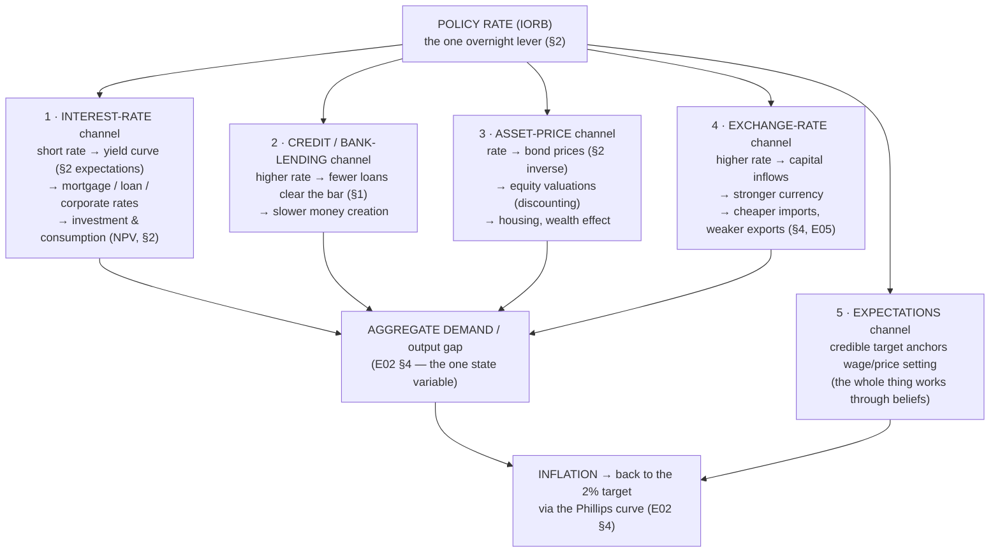
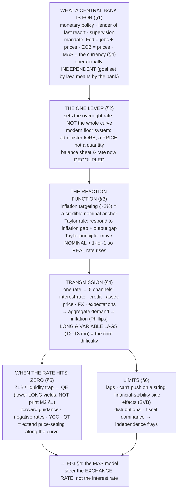

# E03 · §3 — Central Banks & Monetary Policy: the Standard (Fed) Model

> **Subject:** Economy & Finance *(hobby track)*
> **Module:** E03 — Money, Banking & Monetary Policy
> **Section:** The centrepiece of the module — where **most economic-policy news actually lives.** §1 built
> the object (money, created by bank lending); §2 built its price (interest, the time value of money, the
> yield curve). This section puts **the central bank's hand on that price**: what a central bank is *for*,
> how it actually sets "the" interest rate (the surprising plumbing of the **reserve market**), how it
> *decides* where to set it (the **reaction function** you were forecasting back in §2 §10c — the Taylor
> rule and inflation targeting), how that one overnight rate reaches the whole economy (the **transmission
> mechanism** — the payoff of §1 + §2), and what it does when the rate hits **zero** (the unconventional
> toolkit: **QE (quantitative easing)**, forward guidance, and why QE didn't do what §1's multiplier predicted). It closes on the
> limits and the live 2021–26 record. It sets up **§4**, where Singapore throws the whole playbook out and
> steers the *exchange rate* instead.
> **Status:** ✅ **finalized 2026-08-01.** Body drafted 2026-07-25; **§10 captures the live session** — a
> four-step chain that walked *outward* from one seed question, *how does the Fed actually create and drain
> reserves?*, into the full plumbing of the floor system: **(a)** reserves are a **closed system** (the Fed
> sets the total; banks are price-takers on the quantity — the "hot potato"); **(b)** **IORB (interest on reserve balances)** is interest
> on balances banks *already hold* (reserves *are* deposits at the Fed), and it floors the rate by
> arbitrage (with **ON RRP** as the sub-floor and EFFR trading just under IORB); **(c)** reserves are a
> **bank-only settlement layer** customers never touch — cash withdrawal is the one real exit, customer
> lending creates deposits, not reserve outflow (§1); **(d)** the Fed buys Treasuries in the **secondary
> market**, so the *private seller*, not the government, gets the new money (the anti-monetary-financing
> firewall) — and the choice of asset has **allocative** effects, which is *why* it prefers "neutral"
> Treasuries. The chain ended, on the learner's own reasoning, at the doorstep of §4 (the FX-based model).
> Math in LaTeX, quantitative relationships drawn as real curves, key terms glossed in 中文 (大陆/台灣), per
> [`../../../agent-docs/authoring-conventions.md`](../../../agent-docs/authoring-conventions.md).

**Estimated study time:** 2 hours including reflection (the longest section in E03 — it's the keystone).
**Prerequisites:** E03 §1 (banks create money by lending; the central bank sets the **price** of reserves,
not the quantity; QE made reserves but not M2) and E03 §2 (interest as the price of time; the **yield
curve** and the expectations-plus-term-premium logic; **real vs nominal**; the **reaction function** the
market forecasts). Helpful: E02 §2 (the ~2% inflation target), E02 §3 §11 (the **Taylor rule**, central-bank
**independence**, time-inconsistency, and the live 2026 Fed/Warsh case — we build directly on that), and
E02 §4 (the output gap and the Phillips curve — the last link in transmission).

---

## Why this section exists (for *you*)

Open any economics headline and count how many are, at bottom, about *this*: "the Fed held rates," "the ECB (European Central Bank)
cut 25 basis points," "the dot plot moved," "QT (quantitative tightening) is draining liquidity," "the central bank is behind the
curve." Monetary policy is the **single most-covered lever in economic news**, and it serves **Goal 2
(understand policy)** and **Goal 1 (read the news)** more directly than anything else in the course.

The trouble is that almost every popular account gets the *mechanism* wrong in the same two ways §1 warned
about — it imagines the central bank "printing money" and "controlling the money supply," when in fact it
sets a **price** and lets the private banking system respond. This section is where that correction becomes
operational: you will see *exactly* how one committee, moving *one* overnight interest rate (plus, since
2008, the size of its balance sheet), reaches out through the yield curve, the banks, asset prices, and the
exchange rate to speed up or slow down a 25-trillion-dollar economy — and where that reach fails.

> **One framing to hold the whole way through.** The central bank does **not** command the economy; it
> **sets one price and manages expectations**, then waits. Everything below is the answer to three questions:
> **(1) which price** (the policy rate — §2's short end), **(2) how do they choose its level** (the reaction
> function — §3's Taylor rule), and **(3) how does moving it change anything** (the transmission mechanism).
> Keep those three slots in mind and the whole apparatus stays organized.

---

## 1. What a central bank is for — mandate, independence, and the goals

<b>Vocabulary for this section</b> — mandates, independence, and the institutions named here (click to expand)

**Abbreviations**

| Short | Stands for | Meaning |
|---|---|---|
| **Fed** | the Federal Reserve | the central bank of the United States |
| **ECB** | European Central Bank | the euro area's central bank, with a single price-stability mandate |
| **MAS** | Monetary Authority of Singapore | Singapore's central bank, which targets the exchange rate instead (§4 of this module) |
| **SVB** | Silicon Valley Bank | the 2023 US bank failure that re-activated the lender-of-last-resort role |
| **BTFP** | Bank Term Funding Program | the emergency Fed lending facility opened after that failure |
| **M0** | monetary base | tier-1 money — currency plus reserves, the thing a central bank monopolises |
| **US** | United States | |

**Terms**

| Term | Definition |
|---|---|
| **Central bank** | the government's bank and the banks' bank: issuer of tier-1 money, monopoly supplier of reserves, manager of the currency |
| **Tier-1 money** | central-bank money — cash and reserves — as opposed to tier-2 commercial-bank deposits |
| **Reserves** | electronic central-bank money held by banks; **not** the same as deposits or currency |
| **Monetary policy** | steering inflation and activity by setting the policy rate and, now, the balance sheet |
| **Policy rate** | the short-term interest rate the central bank administers |
| **Balance sheet** *(as a tool)* | the size and composition of the central bank's own assets, used as a second lever |
| **Lender of last resort** | lending freely against good collateral in a panic, to stop a liquidity run from killing a solvent bank |
| **Bagehot's rule** | the classic version of that: lend freely, against good collateral, at a penalty rate |
| **Collateral** | assets pledged to secure such a loan |
| **Liquidity run** | depositors or creditors demanding cash faster than assets can be turned into it |
| **Solvent versus illiquid** | assets genuinely worth less than liabilities, versus merely unable to raise cash in time — the lender of last resort exists for the second case |
| **Financial stability** | keeping the system as a whole functioning, as distinct from steering inflation |
| **Supervision** | regulating individual banks' risk-taking and capital |
| **Payment system** | the plumbing through which payments settle, run by the central bank |
| **Systemic risk** | risk to the whole system rather than to one institution |
| **Macroprudential tools** | system-wide safety rules — loan-to-value caps, capital buffers — a separate lever from the policy rate |
| **Mandate** | what a central bank is legally told to optimise |
| **Dual mandate** | the Fed's: maximum employment *and* stable prices, which can conflict under a supply shock |
| **Single mandate** | the ECB's: price stability first, everything else subordinate |
| **Price stability** | low, predictable inflation — conventionally about 2% |
| **Maximum employment** | the highest employment consistent with stable prices |
| **Supply shock** | a disturbance that pushes inflation up *and* output down at once, forcing a genuine trade-off |
| **Central bank independence** | insulation from day-to-day political direction |
| **Operational (instrument) independence** | freedom to choose the *means* — where to set the rate — while the legislature sets the *goal*; this is what "independent" actually means |
| **Goal independence** | choosing the target itself, which would be undemocratic and is not what central banks have |
| **Time inconsistency / inflation bias** | the Kydland–Prescott problem: a government able to print will always be tempted to goose the economy, so markets expect inflation unless the printer is insulated |
| **Credibility** | whether markets believe the central bank will do what it says; the asset independence is meant to buy |
| **Credibility paradox** | political pressure to *cut* can *raise* long yields, because markets price in the future inflation it implies |
| **Long yields** | interest rates on long-dated government debt, set by markets rather than announced |

A central bank is the **government's bank and the banks' bank** — the issuer of tier-1 money (§1), the
monopoly supplier of reserves, and the institution charged with managing the currency in the public
interest. Its jobs, in rough order of how often they make the news:

1. **Monetary policy — steer inflation and the economy.** The headline job: set the policy rate (and now
   the balance sheet) to keep prices stable and, at some central banks, employment high. This is §§2–6.
2. **Lender of last resort — backstop the financial system.** From §1 §6: lend freely against good
   collateral in a panic (Bagehot's rule) to stop a liquidity run from killing solvent banks. This is the
   older job, and it resurfaces every crisis (SVB 2023, the BTFP — Bank Term Funding Program — facility).
3. **Financial-stability and supervisory roles** — regulate banks, run the payment system, watch for
   systemic risk (the macroprudential tools from E02 §4 §10a).

**The mandate — one target or two?** Central banks differ in what they are *legally told to optimize*, and
the difference shapes their behaviour:

- **A dual mandate (the Fed).** The US Federal Reserve is charged with **maximum employment *and* stable
  prices** — two goals that usually point the same way but can conflict (a supply shock, E02 §4 §3, pushes
  inflation up *and* employment down; which do you fight?). The Fed must trade them off.
- **A single mandate (the ECB, the old inflation-targeters).** The European Central Bank's *primary*
  objective is **price stability, full stop**; everything else is subordinate. Cleaner, but less room to
  cushion a downturn.
- **The exchange rate (the MAS).** Singapore's central bank targets neither of these directly — it steers
  the **currency**. That's the whole of §4, and holding it against the Fed model is what makes both click.

**Independence — the idea you already own.** In E02 §3 §11 you built the case for **central-bank
independence** from first principles: the **time-inconsistency / inflation-bias** problem (Kydland–Prescott
— a government that can print will always be tempted to goose the economy before an election, so markets
expect inflation *unless* the printer is insulated from the politician), the **credibility paradox**
(political pressure to cut can *raise* long yields as markets price in future inflation), and the live 2026
test case — Powell's term ending, the **Warsh** appointment, and whether a Fed can stay independent when the
executive wants cuts. Everything in this section *assumes* an operationally independent central bank; §6
returns to what happens when that assumption frays.

> **The precise meaning of "independent."** It's **operational**, not absolute: the legislature sets the
> *goal* (e.g. "2% inflation"), and the central bank is free to choose the *means* (where to set the rate)
> without political interference. Independence over *goals* would be undemocratic; independence over
> *instruments* is what buys credibility. Keep that distinction — it's exactly the line the 2026 news is
> fighting over.

---

## 2. The one lever — how the Fed actually sets "the" interest rate

<b>Vocabulary for this section</b> — the market for reserves, and the two regimes it can be in (click to expand)

**Abbreviations**

| Short | Stands for | Meaning |
|---|---|---|
| **IORB** | interest on reserve balances | the rate the Fed *pays* banks on their reserves; today's main policy lever and the floor under the overnight rate |
| **OMO** | open-market operations | buying or selling Treasuries to change the *quantity* of reserves — the pre-2008 lever |
| **ON RRP** | overnight reverse repurchase agreement | a companion facility paying a slightly lower rate to non-banks, forming a sub-floor |
| **QE** | quantitative easing | large-scale asset purchases, which is how reserves went from scarce to abundant |
| **QT** | quantitative tightening | the reverse — letting the balance sheet shrink and draining reserves |
| **FOMC** | Federal Open Market Committee | the Fed body that votes on the policy rate |
| **bp** | basis point | one hundredth of a percentage point; "50 bps" is half a point |
| **M0** | monetary base | currency plus reserves — the quantity that is now decoupled from the policy rate |
| **US** | United States | |

**Terms**

| Term | Definition |
|---|---|
| **Federal funds rate** | the overnight rate at which US banks lend reserves to each other — the one rate the Fed targets |
| **Overnight rate** | a rate on lending repaid the next business day, the shortest point on the curve |
| **Market for reserves** | the supply and demand for central-bank money among banks, which is where the policy rate is actually set |
| **Reserve demand curve** | how much reserves banks want at each overnight rate: downward-sloping when reserves are scarce, flat once they are abundant |
| **Scarce-reserves regime** | the pre-2008 world where banks genuinely needed reserves, so small quantity changes moved the rate |
| **Ample-reserves regime** | today's world of trillions in reserves, where an extra reserve is worth nothing at the margin and the quantity lever stops working |
| **Reserve requirement** | a regulatory minimum ratio of reserves to deposits; zero in the US since 2020 |
| **Settlement** | the transfer of reserves that finalises payments between banks |
| **Discount rate** *(the Fed's)* | what the Fed charges banks to borrow reserves directly — a ceiling on the overnight rate. ⚠ **Not** the §2 *discount rate* used to compute present value; same words, unrelated concept |
| **Open-market operations** | buying or selling government bonds to shift the supply of reserves left or right |
| **Treasuries** | US government bonds, the instrument used in those operations |
| **Floor system** | the modern arrangement in which the rate the central bank pays on reserves sets a hard floor under the market rate — no bank lends for less than it can earn risk-free |
| **Administered rate** | a rate the central bank simply announces, rather than one produced by adjusting quantities |
| **Steering by price, not quantity** | the section's core claim: the central bank announces a price and lets the quantity of reserves be whatever it needs to be |
| **Decoupled** | the property that the size of the balance sheet and the level of the policy rate are now independent tools — which is why QT and rate cuts can happen together |
| **Basis point** | 0.01 of a percentage point |
| **Short end of the yield curve** | the shortest maturities, which the overnight rate anchors directly; the rest of the curve reprices off expected *future* announcements |

Here is the piece almost every explainer skips, and it's the most satisfying: the Fed does **not** set
mortgage rates, or corporate-bond yields, or even most of the yield curve. It sets **one** rate — the
**overnight rate at which banks lend reserves to each other** (in the US, the **federal funds rate**) — and
everything else in §4 flows from that. The question is *how* it pins an interest rate that is, nominally, a
free-market price between private banks. The answer is the **market for reserves** (§1's tier-1 money), and
it works in two completely different regimes.

![Two-panel diagram of the market for reserves. Panel (a), scarce reserves before 2008: a downward-sloping reserve-demand curve running from a ceiling (the discount rate, about 5 percent) down toward a near-zero floor, with a vertical reserve-supply line crossing it on the sloped middle, setting the target rate where they meet; a second dotted supply line shows that when the Fed shifts supply via open-market operations, the rate moves along the slope. Panel (b), ample reserves after 2008: the same demand curve but the vertical supply line now sits far out to the right on the flat portion, where demand has bottomed out at an administered floor equal to the interest-on-reserves rate (IORB), so the overnight rate is pinned at that floor and a large shift in supply — QE or QT — barely moves it.](diagrams/03-monetary-policy-the-fed-model-fig1.svg)

**Figure 1** — the market for reserves, before and after 2008 — scarce-reserve against ample-reserve operating regimes.

### 2a. The old way — scarce reserves (pre-2008)

Reserves used to be **scarce**, and banks needed them (to meet reserve requirements and settle payments).
That gave the reserve-demand curve a **downward slope**: when reserves are tight, banks bid the overnight
rate *up* toward the ceiling (the **discount rate**, what the Fed charges to lend directly); when reserves
are plentiful, the rate falls. The Fed hit its target by **open-market operations (OMO)** — buying or
selling Treasuries to nudge the *quantity* of reserves left and right along that slope (Panel a). Buy bonds
→ add reserves → supply shifts right → the overnight rate falls to the target. It was genuinely a
quantity lever, but a *tiny* one: the Fed adjusted a small, scarce quantity to hit a price.

### 2b. The modern way — ample reserves and the floor system (post-2008)

After 2008's QE (§1), reserves went from scarce to **enormously abundant** — trillions of dollars. On the
demand curve, that pushes you far out to the **right, onto the flat part**, where extra reserves are
worthless at the margin and the old quantity lever stops working (adding reserves to a glut moves the rate
by nothing). So the Fed switched to a **floor system**, using a tool it got in 2008: **interest on reserve
balances (IORB)** — it *pays* banks interest on the reserves they hold. That rate becomes a **hard floor**:
no bank will lend reserves to another bank for *less* than it can earn risk-free at the Fed. The overnight
rate sits at (just above) the IORB floor, and the Fed moves the policy rate simply by **announcing a new
IORB** (plus a companion sub-floor, the **overnight reverse-repo / ON RRP** rate, for non-banks) (Panel b).

This is the concrete payoff of §1's slogan and §2's whole framing: **the central bank steers by price, not
quantity.** In the modern system it literally *administers* a price and lets the balance sheet be whatever
size it needs to be. The quantity of reserves (§1's M0) and the policy rate are now **decoupled** — which is
exactly why the Fed can run QT (shrinking reserves) and cut rates *at the same time*, something the old
quantity story says is impossible.

> **Reading the news.** When you hear "**the Fed raised rates by 25 basis points**," what physically
> happened is that the FOMC (Federal Open Market Committee) voted to raise the **IORB** (and ON RRP) by 0.25 percentage points, and the
> whole overnight market repriced to the new floor within a day. A **basis point (bp)** is 0.01% — "50 bps"
> = half a percentage point. There was no printing, no rationing — a price was announced, and because it's
> the *risk-free overnight* price, it anchors the short end of §2's yield curve, and the rest of the curve
> reprices off the market's forecast of *future* announcements.

---

## 3. The reaction function — how they decide where to set it

<b>Vocabulary for this section</b> — the Taylor rule and every symbol, star and gap in it (click to expand)

**Abbreviations**

| Short | Stands for | Meaning |
|---|---|---|
| **FOMC** | Federal Open Market Committee | the Fed's rate-setting body, which publishes the "dot plot" |
| **Fed** | the Federal Reserve | the US central bank |

**Symbols used in the formulas**

| Symbol | Reads as | Meaning |
|---|---|---|
| $i$ | "i" | the **nominal** policy rate the rule prescribes — the number actually announced |
| $r^{\ast}$ | "r-star" | the **neutral real interest rate**: the real rate that neither stimulates nor restrains. The superscript star marks an equilibrium benchmark, not an observed market price |
| $\pi$ | "pi" | current inflation. In macroeconomics $\pi$ always means inflation, never the circle constant |
| $\pi^{\ast}$ | "pi-star" | the **inflation target**, conventionally 2%; again the star marks the desired value |
| $\pi - \pi^{\ast}$ | "pi minus pi-star" | the **inflation gap** — how far inflation sits above (or below) target |
| $y$ | "y" | actual output |
| $y^{\ast}$ | "y-star" | **potential output** — what the economy can produce at full employment without accelerating inflation |
| $y - y^{\ast}$ | "y minus y-star" | the **output gap**, the single state variable of the demand story; via Okun's law it is equivalent to an unemployment gap |
| **0.5** *(the two coefficients)* | "nought point five" | the rule's response weights — move the rate half a point for each point of gap |
| $r^{\ast} + \pi^{\ast}$ | "r-star plus pi-star" | the **neutral nominal rate**, what the rule prescribes when both gaps are zero |
| $r = i - \pi$ | "r equals i minus pi" | the real rate, nominal minus inflation — the number that actually bites on spending |

**Terms**

| Term | Definition |
|---|---|
| **Reaction function** | a rule linking the state of the economy to the rate the central bank should set |
| **Inflation targeting** | publicly committing to a numeric inflation goal and setting policy to hit it over the medium term |
| **Nominal anchor** | the publicly known number that pins down what people expect prices to do |
| **Expectations management** | the real point of announcing a target: if everyone believes it, wage- and price-setters build it in and the belief becomes self-fulfilling |
| **Medium term** | the horizon over which the target must be met, which allows looking through temporary shocks |
| **Expectations-augmented Phillips curve** | the relation in which inflation depends on expected inflation plus the state of demand — why a credible target stabilises inflation for free |
| **Taylor rule** | John Taylor's 1993 benchmark reaction function, setting the rate from the inflation gap and the output gap |
| **Neutral rate (r-star)** | the real rate consistent with output at potential and stable inflation |
| **Potential output** | the economy's sustainable production level |
| **Output gap** | actual output minus potential |
| **Okun's law** | the empirical link between the output gap and the unemployment gap, which lets one stand in for the other |
| **Taylor principle** | the crucial property that the inflation coefficient exceeds one: the nominal rate must rise *more* than one-for-one with inflation, or the **real** rate never rises and policy never actually tightens |
| **Real versus nominal rate** | in purchasing-power terms versus in money terms; only a rising real rate restrains spending |
| **Great Inflation** | the 1970s episode diagnosed as a Taylor-principle violation — rates rose, but not enough, so real rates stayed negative |
| **Rules versus discretion** | predictable commitment versus the freedom to react to an unanticipated shock |
| **Time inconsistency** | the trap discretion falls into: the policy that is optimal to promise is not the one it is tempting to deliver |
| **Constrained discretion** | the modern compromise — commit to the goal, choose the path pragmatically |
| **Forward guidance** | communicating the expected *future* path of rates, which moves long yields today because the curve is driven by expected future short rates |
| **Dot plot** | the chart of individual FOMC members' projected rate paths, a formal channel for that communication |

Setting the rate is the easy part; choosing its *level* is the hard part. A central bank needs a
**reaction function**: a rule linking the state of the economy to the rate it should set. You met the
canonical one in E02 §3 §11 — this is where it becomes the organizing idea.

### 3a. The nominal anchor: inflation targeting

Since the 1990s the dominant framework is **inflation targeting**: the central bank publicly commits to a
numeric inflation goal — almost universally **≈2%** (the "why 2%?" was E02 §2's deflation-buffer,
wage-rigidity-grease, and measurement-bias-headroom argument) — and sets policy to hit it over the medium
term. The *point* of announcing the target is **expectations management**: if everyone believes the central
bank will deliver 2%, then wage- and price-setters build 2% into their contracts, and the belief becomes
self-fulfilling (E02 §4's expectations-augmented Phillips curve). A credible target is a **free
stabilizer** — it does work without the rate having to move at all.

### 3b. The rule: the Taylor rule and the Taylor principle

How far should the rate move when the economy deviates from target? The **Taylor rule** (John Taylor, 1993)
is the famous approximation — a reaction function that sets the rate from just two gaps:

$$i = r^{\ast} + \pi + 0.5 \times (\pi - \pi^{\ast}) + 0.5 \times (y - y^{\ast}).$$

Read it left to right: start from the **neutral nominal rate** (the real neutral rate $r^{\ast}$ from §2
plus current inflation $\pi$), then add a response to the **inflation gap** $\pi - \pi^{\ast}$ (how far
inflation is above target) and the **output gap** $y - y^{\ast}$ (E02 §4's one state variable; via Okun's
law this is equivalently an unemployment-gap term). When inflation is on target and output is at potential,
both gaps are zero and the rule prescribes the neutral rate $r^{\ast} + \pi^{\ast}$.

![A conceptual plot of the Taylor rule: the prescribed policy rate on the vertical axis against the inflation rate on the horizontal axis. The prescription is a straight line with slope 1.5 — steeper than a dashed 45-degree reference line — passing through a marked neutral point where 2 percent inflation gives a 2.5 percent rate. Where the rule would prescribe a rate below zero (at low or negative inflation) it is clipped flat along the zero lower bound, a shaded region annotated as the place where the Fed must switch to QE and forward guidance. An annotation highlights that the slope greater than one is the Taylor principle: raising the nominal rate more than one-for-one with inflation means the real rate rises, which is what actually tightens.](diagrams/03-monetary-policy-the-fed-model-fig2.svg)

**Figure 2** — the Taylor rule, and the Taylor principle: the prescription must rise more than one-for-one with inflation.

The single most important property is the **Taylor principle**: the coefficient on inflation is **greater
than one** (the rule raises the *nominal* rate by *more* than the rise in inflation). Why it matters is pure
§2–§3 real-vs-nominal thinking: only if the **nominal** rate rises faster than inflation does the **real**
rate $r = i - \pi$ actually *rise* — and it's the real rate that bites on spending. A central bank that
raised nominal rates only one-for-one with inflation would leave the real rate unchanged and never actually
tighten; inflation would spiral. Violating the Taylor principle is the textbook diagnosis of the 1970s Great
Inflation (E02 §3 §11a) — the Fed raised rates, but not by *enough*, so real rates stayed negative.

### 3c. Rules vs discretion, and forward guidance

No central bank mechanically obeys the Taylor rule — it's a *benchmark*, not an autopilot. Real policy is a
managed tension between **rules** (predictable, credibility-building, immune to the time-inconsistency trap)
and **discretion** (flexibility to handle a shock no rule anticipated). The modern compromise is
**"constrained discretion"**: commit to the 2% goal (the rule part), but choose the path pragmatically (the
discretion part).

And because the whole curve (§2) is driven by *expected future* short rates, a central bank has a second
lever beyond today's rate — **forward guidance**: *talking* about the future path. Saying "we expect to hold
rates near zero through 2024" can lower long yields *today* (§2's expectations channel) even without moving
the current rate. Managing the expected path — via statements, the **"dot plot"** (the FOMC members'
projected rate paths), and press conferences — is now as much of the toolkit as the rate itself.

---

## 4. The transmission mechanism — from one overnight rate to the whole economy

<b>Vocabulary for this section</b> — the five transmission channels and the lag vocabulary (click to expand)

**Abbreviations**

| Short | Stands for | Meaning |
|---|---|---|
| **IORB** | interest on reserve balances | the administered rate that *is* the policy lever (§2) |
| **NPV** | net present value | discounted future cash flows minus upfront cost; a higher discount rate pushes projects below the bar |
| **FX** | foreign exchange | the currency market, where the fourth channel operates |
| **E02 / E05** | internal cross-references | to earlier modules, not abbreviations to expand |

**Terms**

| Term | Definition |
|---|---|
| **Transmission mechanism** | the set of routes by which one overnight interest rate changes inflation and employment across a whole economy |
| **Interest-rate channel** | the workhorse: the policy rate anchors the short end, the curve reprices, mortgage and corporate borrowing costs rise, fewer projects clear the net-present-value bar, interest-sensitive spending falls |
| **Discount rate** *(in valuation)* | the rate used to convert future cash into today's money; monetary policy moves every one of them in the economy |
| **Interest-sensitive spending** | housing, business investment, cars — the spending most affected by borrowing costs |
| **Credit / bank-lending channel** | a higher policy rate raises banks' cost of funding, so fewer loans clear the profitability bar and money creation itself slows |
| **Cost of funding** | what a bank pays for the money it lends |
| **Credit standards** | how strict banks are about who qualifies; tightening them amplifies the channel |
| **Asset-price / wealth channel** | rates up, bond prices down, equity valuations down, housing cools |
| **Wealth effect** | households that feel poorer spending less |
| **Exchange-rate channel** | higher domestic rates attract foreign capital, the currency appreciates, imports get cheaper and exports less competitive |
| **Appreciation** | a rise in the currency's value against others |
| **Capital inflow** | foreign money moving in to chase the higher yield |
| **Small open economy** | one where trade and capital flows dominate, so this channel is powerful enough to be targeted directly — Singapore's case |
| **Expectations channel** | the route through beliefs: a credible target makes wage- and price-setters expect 2%, so inflation self-stabilises — which is why communication is a tool |
| **Aggregate demand** | total spending in the economy, the thing all five channels converge on |
| **Output gap** | actual output minus potential — the single state variable the channels move |
| **Phillips curve** | the relation translating that gap into inflation |
| **Long and variable lags** | Milton Friedman's phrase: a rate change hits activity in roughly half a year to a year and a half, and inflation later still |
| **Impulse response** | the plotted path of the economy's reaction over time to a one-off policy change |
| **Forecast-based policy** | the consequence of the lag — today's rate must be set for the economy of 12 to 18 months from now |
| **Overshoot** | doing too much because you are steering on stale information; the source of policy-induced oscillations |
| **"Behind the curve"** | the commentary phrase for a central bank that has not tightened or eased fast enough given where inflation is heading |

This is the heart of the section and the payoff of §1 + §2: how does moving *one overnight interest rate*
change inflation and employment across a whole economy? Through **five channels**, all of which you already
have the pieces for.

<!-- DIAGRAM:START -->

Diagram source (Mermaid)

<!-- DIAGRAM:END -->

1. **The interest-rate channel (the main one).** The policy rate anchors the short end of the yield curve
   (§2); the rest of the curve reprices off expected future policy (§2's expectations hypothesis). Higher
   rates raise mortgage rates, corporate borrowing costs, and every **discount rate** in the economy — so
   fewer projects clear the **NPV (net present value)** bar (§2d), and interest-sensitive spending (housing, business
   investment, cars) falls. This is the workhorse.
2. **The credit / bank-lending channel.** Straight from §1: a higher policy rate raises banks' cost of
   funding, so fewer loans clear the profitability bar, so **money creation itself slows** (§1's
   loans-create-deposits, run in reverse). Tighter credit standards amplify it.
3. **The asset-price / wealth channel.** Rates up → bond prices down (§2's inverse), equity valuations down
   (higher discount rate on future earnings — the §2 discounting logic applied to stocks), house prices
   cool. Households feeling poorer spend less (the **wealth effect**); this is also where financial-stability
   risk lives (§6).
4. **The exchange-rate channel.** Higher domestic rates attract foreign capital chasing yield → the currency
   **appreciates** → imports get cheaper (dampening inflation directly) and exports get less competitive
   (dampening demand). For a small open economy this channel is so dominant that Singapore targets it
   *directly* — the whole logic of §4.
5. **The expectations channel.** The one that ties it together: if the target is credible, wage- and
   price-setters *expect* 2%, so inflation self-stabilizes (E02 §4's expectations-augmented Phillips curve).
   Much of modern policy is fought here — in beliefs — which is why *communication* is a tool (§3c).

**The one hard fact that makes policy difficult: long and variable lags.** None of this happens fast. Milton
Friedman's phrase — monetary policy operates with **"long and variable lags"** — means a rate change today
hits real activity in roughly **half a year to a year and a half**, and inflation even later.

**Figure 4** — the impulse response to a one-off hike: output turns first, inflation much later.

The lag is *why* central banking is hard: the Fed must set today's rate for the economy of **12–18 months
from now**, based on a **forecast** — so it is perpetually at risk of doing too much or too little and only
finding out later. It's the "active damper with a destabilizing lag" you identified in E02 §4 §10a: steer a
ship by looking only at where it was a year ago, and you tend to *overshoot* and set up oscillations. This
single fact drives most policy mistakes and most of the "is the Fed behind the curve?" commentary.

---

## 5. When the rate hits zero — the unconventional toolkit

<b>Vocabulary for this section</b> — the zero lower bound and every unconventional tool (click to expand)

**Abbreviations**

| Short | Stands for | Meaning |
|---|---|---|
| **ZLB / ELB** | zero lower bound / effective lower bound | the point below which cutting the nominal rate stops working, because holders can just switch to physical cash at 0% |
| **QE** | quantitative easing | creating reserves to buy long-dated assets, to push down *long* yields when the short rate is already at zero |
| **QT** | quantitative tightening | the reverse — letting bonds mature without replacement so the balance sheet shrinks |
| **NIRP** | negative interest rate policy | charging banks to hold reserves, taking the policy rate slightly below zero |
| **YCC** | yield curve control | promising to buy whatever it takes to pin a chosen *long* yield at a target |
| **ECB** | European Central Bank | one of the central banks that went slightly negative |
| **BoJ** | Bank of Japan | ran explicit yield curve control from 2016 to 2024 |
| **M0 / M2** | monetary base / broad money | the two layers whose weak link QE demonstrated |

**Terms**

| Term | Definition |
|---|---|
| **Zero lower bound (effective lower bound)** | the floor on nominal rates set by the option to hold physical cash at zero |
| **Liquidity trap** | the state where more base money does not help because the price of money cannot fall further. ⚠ Distinct from a *thin market's* liquidity problem, which is about finding a buyer |
| **Unconventional policy** | the toolkit reached for once the conventional short-rate lever is jammed |
| **Quantitative easing** | large-scale purchases of long-dated government and mortgage bonds, paid for with newly created reserves |
| **Long-dated assets** | bonds with many years to maturity, and therefore high duration |
| **Portfolio-balance effect** | the first route QE works through: removing duration from the market forces holders into other assets and bids their prices up |
| **Term-premium compression** | the resulting fall in the extra yield demanded for going long — the actual target of QE |
| **Duration** | a bond's sensitivity to yield changes; "buying duration" is how QE removes interest-rate risk from private hands |
| **Signalling** | the second route: a large purchase programme is read as a commitment to hold rates low |
| **"QE is not printing money to spend"** | the section's punchline — QE ballooned the monetary base without runaway broad money or inflation, because banks never lend out reserves; it works on yields and expectations |
| **Forward guidance** | promising to stay low for longer, which drags down the long rates that actually matter |
| **Negative interest rates** | a policy rate set below zero; a little works, but it is constrained by the cash-hoarding floor and squeezes bank profitability |
| **Cash hoarding** | the escape route that puts a floor under how negative rates can go |
| **Yield curve control** | targeting a long *yield* rather than a *quantity* of purchases — the most aggressive form of "price, not quantity" |
| **Quantitative tightening** | shrinking the balance sheet and draining reserves |
| **Floor system** | the reason QT and rate cuts are compatible: with the rate administered, the balance sheet is a separate tool (§2b) |
| **Balance sheet** | the central bank's holdings, the "unconventional tool" plotted against the funds rate in Figure 3 |
| **Effective federal funds rate** | the actual traded overnight rate, as opposed to the announced target |

The Taylor rule sometimes prescribes a *negative* rate (Figure 2's shaded region): in a deep slump with
inflation below target, the rule wants the policy rate below zero. But you can't cut nominal rates much
below zero — depositors would just hold physical cash at 0% instead (the **zero lower bound / effective
lower bound**). When the conventional lever is jammed at zero, the economy can fall into a **liquidity trap**
(E02 §2 §9b's territory): more base money doesn't help because the price of money can't fall further. So
after 2008 central banks built an **unconventional toolkit**.

![A twin-axis time series from 2007 to 2026. On one axis, the effective federal funds rate (the conventional tool) shows the 2007 level near 5 percent, a collapse to near zero from 2008 through 2015, liftoff to about 2.2 percent by 2019, a drop back to zero in 2020, then the sharp 2022 to 2023 hiking cycle to just above 5 percent and a partial descent to about 3.6 percent by 2026. On the other axis, the Fed's balance sheet (the unconventional tool) climbs from under 1 trillion dollars in 2007 to about 4.5 trillion by 2014 through successive rounds of QE, dips slightly with quantitative tightening in 2018 to 2019, explodes to nearly 9 trillion in 2020 to 2021, and shrinks under QT from 2022. The two tools are used together: when the rate is stuck at zero, the balance sheet does the work.](diagrams/03-monetary-policy-the-fed-model-fig3.svg)

**Figure 3** — the conventional and unconventional tools side by side, 2007–2026 — the policy rate against the balance sheet.

- **Quantitative easing (QE).** The central bank creates reserves and buys **long-dated** assets (Treasuries,
  mortgage bonds). The point is *not* "printing money to spend" — it's to push down **long-term** yields
  when the short rate is already at zero, by two routes: (i) **portfolio-balance / term-premium
  compression** — buying duration removes it from the market, lowering the §2 term premium and long yields
  (the same lever the Treasury's issuance mix pulls, from §2 §10b); and (ii) **signaling** — a commitment to
  hold rates low. **And here is the §1 punchline, now fully paid off:** QE ballooned the monetary base but
  did **not** cause runaway M2 or inflation, because banks don't lend out reserves (§1 §4b) — QE works on
  *yields and expectations*, not by mechanically multiplying money. The 2010s proved it; Figure 3 shows the
  balance sheet exploding while the funds rate — and inflation — stayed floored.
- **Forward guidance.** As in §3c, but load-bearing at the ZLB (zero lower bound): when you can't cut, you *promise* to stay low
  for longer, dragging down the long rates that actually matter (§2).
- **Negative interest rates (NIRP — negative interest rate policy).** Some central banks (the ECB, Switzerland, Japan) went *slightly*
  negative — charging banks to hold reserves — testing how far below zero you can actually go. The
  consensus verdict: a little works, but it's constrained by the cash-hoarding floor and it squeezes bank
  profitability.
- **Yield curve control (YCC).** From §2 §10b: instead of buying a *quantity* of bonds (QE), promise to buy
  *whatever it takes* to pin a chosen long yield at a target. The **Bank of Japan** ran explicit YCC (yield curve control)
  2016–2024; the **Fed** did a version 1942–51. It's the most aggressive form of "price not quantity" —
  applied to the long end.
- **Quantitative tightening (QT).** The reverse of QE — letting the balance sheet **shrink** (bonds mature
  and aren't replaced), draining reserves. Because of the **floor system** (§2b), the Fed can run QT
  *while cutting rates* — the balance sheet and the policy rate are separate tools (Figure 3, 2024–26).

> **The reframe that organizes the toolkit.** Conventional policy sets the **price** of *short-term* money
> (the policy rate). The unconventional tools reach for the **rest of the curve** — long yields, term
> premia, and expectations — when the short rate alone isn't enough. They're not "emergency money printing";
> they're the central bank extending its price-setting reach from the overnight rate out along §2's yield
> curve. Seeing them that way (rather than as "stimulus magic") is most of what it takes to read QE/QT
> coverage correctly.

---

## 6. Limits, side effects, and the live record

<b>Vocabulary for this section</b> — where policy fails, and the vocabulary of the 2021–2026 record (click to expand)

**Abbreviations**

| Short | Stands for | Meaning |
|---|---|---|
| **ZLB** | zero lower bound | the floor at which the conventional rate lever jams |
| **QE / QT** | quantitative easing / quantitative tightening | expanding versus shrinking the central bank's balance sheet |
| **SVB** | Silicon Valley Bank | the 2023 failure caused by long-duration bonds bought cheap and crushed by hikes |
| **COVID** | the COVID-19 pandemic | the shock preceding the 2021 inflation surge |
| **Fed** | the Federal Reserve | the US central bank |

**Terms**

| Term | Definition |
|---|---|
| **Long and variable lags** | policy acts on a forecast of next year's economy, so overshoot is structural rather than incompetence |
| **"Pushing on a string"** | cutting rates *enables* borrowing but cannot force it; in a slump, cheap money may simply sit there |
| **Fiscal policy** | government taxing and spending — the active lever when monetary policy is tapped out at the lower bound |
| **Reach for yield** | investors taking more risk to hit a return target when safe rates are low |
| **Hiking cycle** | a run of successive rate increases, which detonates the risks accumulated in the easy years |
| **Duration risk** | the loss on long-dated bonds when yields rise — the mechanism inside the SVB failure |
| **Macroprudential toolkit** | system-wide safety rules, a separate lever precisely because inflation-fighting and financial stability can pull in opposite directions |
| **Distributional effects** | low rates and asset purchases lift asset prices, benefiting asset owners — a standing criticism of an unelected institution |
| **Fiscal dominance** | the point at which government debt is so large that high rates become budgetarily unbearable, and monetary independence quietly ends |
| **Central bank independence** | operational freedom from political direction, the assumption every other section here rests on |
| **"Transitory"** | the 2021 judgement that the inflation surge would pass without policy action — a forecast error under the lag risk |
| **Look-through** | deliberately ignoring a shock expected to fade, rather than responding to it |
| **Sticky inflation** | inflation that stays above target longer than forecast |
| **Hawkish / dovish** | leaning toward tighter policy (more worried about inflation) versus looser policy (more worried about employment) |
| **Funds rate** | the Fed's policy rate, lifted from near zero to over 5% in 18 months in the 2022–23 cycle |
| **"Behind the curve"** | the charge that a central bank has reacted too late relative to where inflation is heading |

Monetary policy is powerful but blunt, and knowing *where it fails* is what separates reading the news from
being fooled by it.

- **Long and variable lags (§4).** The dominant limitation: policy acts on a forecast of next year's
  economy, so overshoot and "behind the curve" errors are structural, not incompetence.
- **You can't push on a string.** Cutting rates *enables* borrowing but can't *force* it. In a slump with
  scared households and firms (E02 §2 §9b's demand gap), cheap money may just sit there — which is why the
  ZLB is so dangerous and why **fiscal** policy (E04) becomes the active lever when monetary policy is
  tapped out.
- **Financial-stability side effects.** Years of low rates push investors to "reach for yield" and inflate
  asset prices — and then a **hiking cycle detonates the risks built up in the easy years.** This is not
  abstract: it is *exactly* the SVB 2023 chain (§2 §6) — long-duration bonds bought when rates were low,
  crushed when the Fed hiked. Monetary policy and financial stability can pull in opposite directions
  (raise rates to fight inflation *vs* hold them to protect balance sheets), which is why the
  **macroprudential** toolkit (E02 §4 §10a) exists as a separate lever.
- **Distributional effects.** Low rates and QE lift asset prices, which benefits asset *owners* — a channel
  critics blame for widening wealth inequality (the E02 §4 §10c thread). Monetary policy is not
  distributionally neutral, even though it's run by unelected technocrats — part of why its independence is
  politically contested.
- **Fiscal dominance and the independence question (E02 §3 §11).** When government debt is large enough,
  high rates become budgetarily unbearable, and pressure mounts on the central bank to keep rates low to
  ease the government's interest bill — **fiscal dominance**, the point at which monetary independence
  quietly ends.

> **The live record (2021–2026), read with this toolkit.** The recent cycle is the whole section in one
> episode. Post-COVID, the Fed judged the 2021 inflation surge **"transitory"** and held rates at zero too
> long (a forecast error, §4's lag risk; the "look-through" call from E02 §3 §11b). When inflation hit ~9%,
> it executed the **fastest hiking cycle in 40 years** (Figure 3), lifting the funds rate from ~0 to over 5%
> in 18 months while running **QT** — testing every channel of §4 at once, and detonating the duration risk
> that killed **SVB** (§2 §6). By 2026, with inflation still sticky above target, the **Warsh** Fed
> (E02 §3 §11d) held at 3.50–3.75% with a *hawkish* tilt — the independence stress-test you were tracking
> live. Every phrase in that paragraph — transitory, hiking cycle, QT, behind the curve, duration, hawkish,
> independence — is now something you can *define and judge*, not just nod at.

---

## 7. The one-page mental model

<!-- DIAGRAM:START -->

Diagram source (Mermaid)

<!-- DIAGRAM:END -->

**The nine things to remember:**
1. **A central bank sets a price and manages expectations — it doesn't command the economy.** Three slots:
   *which price* (the policy rate), *how they choose it* (the reaction function), *how it spreads*
   (transmission).
2. **Mandates differ:** the Fed has a **dual mandate** (jobs + prices), the ECB a single one (prices), the
   MAS (Monetary Authority of Singapore) targets the **currency** (§4). Independence is **operational** — the law sets the goal, the bank
   picks the means.
3. **It moves ONE rate**, the overnight interbank rate — not mortgages, not the 10-year. Everything else
   reprices off it through §2's yield curve.
4. **Modern rate-setting is a floor system:** the Fed *administers* the **IORB** rate, a **price, not a
   quantity** — so the balance sheet and the policy rate are **decoupled** (QT while cutting is possible).
5. **The reaction function is inflation targeting + the Taylor rule.** The **Taylor principle** (move the
   *nominal* rate more than one-for-one with inflation) is what makes the **real** rate — the one that bites
   — actually rise.
6. **Transmission runs through five channels** — interest-rate, credit, asset-price, exchange-rate,
   expectations — into aggregate demand and then inflation via the Phillips curve (E02 §4).
7. **Long and variable lags (12–18 months)** are the core difficulty: policy is set for a *forecast* of next
   year's economy, so overshoot and "behind the curve" errors are structural.
8. **At the zero lower bound**, conventional policy jams and the central bank reaches for **QE** (lower
   *long* yields — **not** printing M2, the §1 punchline), forward guidance, negative rates, YCC, and QT —
   all "price-setting extended along the curve."
9. **The limits are real:** can't push on a string, financial-stability side effects (SVB), distributional
   consequences, and **fiscal dominance** — the point where independence quietly ends.

---

## 8. Check your understanding

Reason first; check against a source where noted.

1. **Price, not quantity.** In the modern floor system, explain why the Fed can shrink its balance sheet
   (QT) and *cut* the policy rate in the same year — something the old "central bank controls the money
   supply" story says is contradictory. What single 2008 innovation made this possible?
2. **The Taylor principle.** Inflation rises from 2% to 5%. A central bank raises its nominal policy rate
   from 2.5% to 4%. Did it actually *tighten*? Compute the approximate real rate before and after, and use
   the result to explain why the Taylor principle requires a coefficient greater than one.
3. **Which channel?** For each, name the transmission channel doing the work: (a) a rate cut lifts the stock
   market; (b) a rate hike strengthens the currency and cheapens imports; (c) a credible 2% target keeps
   union wage demands moderate; (d) higher rates make banks approve fewer mortgages.
4. **The QE puzzle, finished.** After 2008 the Fed's balance sheet grew several-fold (Figure 3) yet inflation
   stayed *below* target for a decade. Explain why, connecting §1 §4b (loans create deposits) to what QE
   actually operates on. Then explain why 2021 was different (hint: where did the money reach *that* time?).
5. **Long and variable lags.** Why does the "12–18 month lag" make it structurally likely that a central
   bank *overshoots* — hikes too much or cuts too much? Tie your answer to the "active damper with a
   destabilizing lag" idea from E02 §4 §10a.
6. **Reading the curve back.** In §2 §10c you concluded an inverted yield curve is the market *forecasting*
   Fed cuts. Using this section's reaction function, explain *what the market must believe about inflation
   and the output gap* for it to forecast cuts — i.e. what economic story an inversion is really telling.
7. **When it can't work.** Explain "you can't push on a string" using the zero lower bound and E02 §2 §9b's
   demand gap. Why does this hand the baton to **fiscal** policy (E04)?
8. **Live check.** On [FRED](https://fred.stlouisfed.org), plot the target rate (`DFEDTARU`), the balance
   sheet (`WALCL`), and core PCE (Personal Consumption Expenditures) inflation (`PCEPILFE`, as a year-over-year change). Where is policy now
   relative to the 2% target — tightening, easing, or on hold — and is the balance sheet growing (QE) or
   shrinking (QT)?

Answers

1. **Because in the floor system the quantity of reserves and the policy rate are decoupled — the rate is
   *administered*, not squeezed out of a scarce quantity.** With reserves ample, the system sits far out on
   the flat part of the reserve-demand curve (Figure 1, panel b), where draining reserves through quantitative
   tightening moves the overnight rate by essentially nothing; the rate is wherever the Fed announces the
   floor to be. The single 2008 innovation is **interest on reserve balances (IORB)** — paying interest on
   reserves, which floors the overnight market by arbitrage since no bank lends below what it earns risk-free
   at the Fed (§2b, §10b).
2. **No — it *loosened*.** The real rate was about $2.5 - 2 = 0.5$ percent before and about $4 - 5 = -1$ percent after,
   so despite a 150-basis-point nominal hike the rate that actually bites on spending **fell** by about 1.5
   percentage points (§3b). That is exactly why the **Taylor principle** demands a coefficient **greater than
   one** on inflation: only a nominal rate that rises *more* than one-for-one with inflation raises the real
   rate $r = i - \pi$. Raising one-for-one leaves the real rate unchanged and never tightens at all — the
   textbook diagnosis of the 1970s Great Inflation (E02 §3 §11a).
3. **(a) the asset-price / wealth channel** (a lower discount rate lifts the present value of future
   earnings, §2's discounting applied to equities); **(b) the exchange-rate channel** (higher rates attract
   yield-chasing capital, the currency appreciates, imports cheapen); **(c) the expectations channel** (a
   credible target anchors wage- and price-setting, the expectations-augmented Phillips curve); **(d) the
   credit / bank-lending channel** (a higher funding cost means fewer loans clear the profitability bar, so
   money creation itself slows — §1's loans-create-deposits run in reverse). All four are §4.
4. **Because QE creates *reserves*, and reserves are a bank-only settlement layer that never becomes
   customer lending.** A loan creates a *deposit* by keystroke (§1 §4b); reserves are only used to convert to
   cash, settle interbank payments, or lend to another bank (§10c) — so the base ballooned without broad
   money or spending following. What QE actually operates on is **long yields, the term premium, and
   expectations** (§5). **2021 was different because the money reached *spenders*:** fiscal transfers went
   straight into household deposits, which is spendable M2 in the hands of people who spent it, and inflation
   followed. Inflation comes when money reaches spenders, not from balance-sheet size.
5. **Because policy is set for an economy 12–18 months out, on a forecast, while the feedback arrives only
   after the action has already worked through.** So a central bank that keeps tightening until it *sees*
   inflation fall has by then already put more tightening into the pipeline than the economy has absorbed
   (§4). That is the "active damper with a **destabilizing lag**" from E02 §4 §10a: a corrective force
   applied out of phase with the thing it is correcting stops damping and starts driving oscillation —
   overshoot on the way up, then over-easing on the way down. It is structural, not incompetence.
6. **It must believe that inflation will fall back to or below target *and* that the output gap will turn
   negative.** Run §3b's Taylor rule backwards: the rule prescribes a *lower* rate only when the inflation
   gap $\pi - \pi^{\ast}$ and the output gap $y - y^{\ast}$ are negative (or turning so). So an inversion is
   the market forecasting **a slowdown that opens a negative output gap and disinflates** — the recession is
   the primitive, and the expected cuts are just how the market prices the Fed's **reaction function**
   responding to it (§2 §10c). It is a forecast, not pressure.
7. **Because a rate cut only *enables* borrowing; it cannot *make* anyone borrow.** At the **zero lower
   bound** the price of money cannot fall further, and if households and firms are frightened enough that
   loan demand has collapsed — E02 §2 §9b's demand gap, §5's liquidity trap — cheap money simply sits
   (§6). Fiscal policy (E04) takes the baton because it does **not** depend on a private party choosing to
   borrow and spend: the government spends or transfers directly, closing the demand gap itself rather than
   inviting someone else to.
8. **Read the three series as a stance, not a level.** `PCEPILFE` year-over-year against 2% tells you
   whether the target is being met; the direction of `DFEDTARU` tells you tightening, easing or on hold; and
   the slope of `WALCL` tells you QE (growing) versus QT (shrinking). The sharper test §9 suggests is the
   **real** policy rate (funds rate minus core PCE inflation) against estimates of **r-star**: above neutral
   is restrictive, below is accommodative. For orientation from §6's live record: by 2026 the Fed was holding
   at 3.50–3.75% with a hawkish tilt and inflation still sticky above target, with the balance sheet having
   been shrinking under QT since 2022 — i.e. the two tools pointing the same way.

---

## 9. Optional: watch monetary policy on live data (15–20 min)

- **The two tools, live.** On FRED (Federal Reserve Economic Data), plot the **target range** (`DFEDTARU` / `DFEDTARL`) and the **balance
  sheet** (`WALCL`) — this is Figure 3 with the real numbers, updated. Are they moving together or in opposite
  directions right now?
- **The floor system.** Plot the **effective fed funds rate** (`EFFR`) against the **IORB** rate (`IORB`)
  and the **ON RRP (reverse repurchase agreement)** rate (`RRPONTSYAWARD`). See the market rate sit *between* the floors — the §2 plumbing
  made visible.
- **Is policy tight or loose?** Compare the **real** policy rate (funds rate minus core PCE inflation) to
  estimates of **r-star** (the NY Fed publishes the **Laubach–Williams** r-star series). Above neutral =
  restrictive; below = accommodative.
- **The market's view of the path.** Look up the **CME FedWatch** tool (market-implied probabilities of the
  next rate move) and the FOMC **"dot plot"** — the §3c expectations lever, quantified. Compare what the
  market expects to what the Fed is signalling.

Bring one chart to our session and we'll read the stance of policy off it — is the real rate above or below
neutral, is the balance sheet draining, what is the market pricing for the next move — the way we ran the
labour market on the 2026 Fed (E02 §3) and the yield curve on who-sets-Treasury-rates (E03 §2 §10).

## 10. Applied — from our session Q&A (2026-08-01)

This session was a four-step chain that walked *outward* from a single seed question — **how does the Fed
actually create and drain reserves?** — into the complete plumbing of the floor system (§2), then to the
doorstep of §4. The pattern was the learner probing the *mechanism* behind each rule and proposing a
plausible inference, each of which was **right in instinct but mislocated by one step**; naming the correct
locus made it click. All four threads reused §1's *loans-create-deposits* keystroke and §2b's floor system.

### 10a. Reserves are a *closed system* — the Fed sets the quantity, banks are price-takers

The learner reasoned: *the US has no reserve requirement, so the amount of reserves is market-determined.*
The premise is right, the inference is the wrong step. The fix is a distinction between **the total quantity
of reserves (set by the Fed) and any individual bank's desired holdings (a market question).**

- **Creation is the purchase itself.** The Fed doesn't "create reserves" as a step separate from buying a
  bond — it *pays* for the bond by crediting a bank's reserve account, issuing tier-1 money with a keystroke
  (§1's keystroke, one tier up). Buying from a *non-bank* also creates a deposit → so QE bumps M2 by that
  amount, but the deposit just sits (no lending cascade — the §1 punchline again).
- **Reserves are a hot potato.** An individual bank can offload unwanted reserves (lend or buy), but they
  only move to *another* bank — they never leave the system. So the banking system *as a whole* is **stuck**
  with whatever total the Fed created; "no reserve requirement" removed the *minimum each bank must hold*, it
  did **not** hand banks control of the aggregate. What makes them willing to hold the deliberate glut is now
  the **IORB floor**, not a requirement.
- **QT drains via passive run-off**, not mainly active selling: the Fed stops replacing maturing bonds, so
  the Treasury must sell those bonds to the *public* instead; the public pays with reserves, which flow
  through the Treasury's Fed account and are **extinguished** as the Fed's balance sheet shrinks. Net: the
  public re-absorbs the bonds, reserves vanish. Plus the **autonomous factors** (currency withdrawn, the TGA [Treasury General Account],
  ON RRP) move reserves around too — but every one is a shift *between lines on the Fed's own balance sheet*.

### 10b. IORB is interest on balances banks *already hold* — and that's what floors the rate

The learner asked whether banks *deposit* reserves at the Fed to earn IORB. Small inversion to flip:
**reserves *are* a bank's deposit at the Fed** (tier-1 money) — there is no separate depositing step; holding
reserves *is* having a balance in your Fed account, and IORB is simply the interest paid on it (itself paid
by crediting more reserves — a keystroke).

- **Why it's a floor.** A bank with spare reserves can earn **IORB risk-free** at the Fed, so it will never
  lend them to another bank for *less*. IORB therefore puts a floor under the whole overnight market — raise
  IORB and the policy rate rises regardless of the trillions in reserves. This *is* "price, not quantity"
  (§2b) made concrete: IORB is the administered price.
- **The wrinkle (why EFFR trades a few bp *below* IORB).** Not everyone with a Fed account earns IORB —
  the **GSEs / Federal Home Loan Banks** don't, so they lend fed funds below IORB (anything beats zero), and
  the arbitrage that should close the gap is blunted by banks' balance-sheet costs (leverage ratio, FDIC [Federal Deposit Insurance Corporation]
  fees). So the Fed runs a **sub-floor, ON RRP**, for non-banks, and EFFR (effective federal funds rate) settles in the band just under
  IORB. The corridor: **discount rate (ceiling) > IORB (bank floor) > ON RRP (non-bank sub-floor).**
- **The cost.** IORB on trillions runs to 100-plus billion dollars a year; since 2022 it has exceeded the
  Fed's income on its old low-yield QE portfolio, so the Fed books an **operating loss** ("deferred asset") —
  the politically touchy underside of the floor system.

### 10c. Reserves are a bank-only *settlement* layer — customers never touch them

The learner asked whether a bank "withdraws" reserves to pay a customer's cash or to lend out. The answer
**splits**, and the split is the whole point:

- **Paying cash → yes, a genuine withdrawal, and the one true exit.** The Fed debits the bank's reserve
  account and ships banknotes; reserves *convert to currency*. This is the single case where reserves
  actually **leave the banking system** (one Fed liability becomes another) — the currency autonomous factor
  of 10a.
- **"Lending out reserves" to a customer → category error (the §1 misconception).** A customer loan
  **creates a deposit** (keystroke), it does not disburse reserves; the borrower gets a *deposit*, and
  customers can't hold reserves anyway (no Fed account). A reserve only moves at **settlement** — when the
  borrower *spends* the deposit to a customer at another bank, the bank ships reserves to settle. So reserves
  are the **wholesale settlement medium between banks**, used in only three ways: convert to cash, settle net
  interbank payments, or lend to another bank (fed funds). Customer lending isn't on the list — which is the
  deepest reason QE's tier-1 reserves didn't cascade into tier-2 loans.

### 10d. QE buys in the *secondary* market — the seller, not the government, gets the money

The learner's sharpest thread: *which asset the Fed buys channels the new money somewhere, with micro
effects — and if it buys Treasuries, doesn't the government get the money? What if the government issues
fewer?* Two moves — validate the insight, correct the premise:

- **The allocative insight is correct — and it's *why* they buy Treasuries.** The asset choice picks winners
  (MBS [mortgage-backed securities] → housing; corporate bonds → 2020 corporate credit; the **BoJ's ETF [exchange-traded fund] buying** made it a top equity
  shareholder). The Fed prefers Treasuries precisely because they are the most **market-neutral** (deepest,
  most liquid, no private-sector tilt). His instinct found the actual design principle.
- **But the government does *not* get the money.** QE buys in the **secondary market** from *private*
  holders; the government got its cash at original issuance (primary market) and is not a party to the Fed's
  trade. The Fed is **legally barred from buying directly from the Treasury** — the anti-**monetary-financing
  / debt-monetization** firewall (the ECB's Article 123 is the explicit version), built for exactly the worry
  he raised. The financing effect is *indirect* (lower yields; the consolidated Fed-plus-Treasury view where
  the public holds reserves instead of bonds and the Fed remits profits back) — which, done deliberately
  during big deficits, is the **fiscal dominance** blur of §6, not a check handed to the Treasury.
- **What if Treasuries were scarce?** The Fed isn't hostage to issuance: it can buy **other assets** (MBS,
  agency, even corporate/equities as some central banks do — reviving the neutrality problem), or **create
  reserves by *lending* against collateral** (repo / the Standing Repo Facility) rather than buying outright.
  For the US it is near-moot (a ~36-trillion-dollar debt ocean), though it *was* genuinely debated in the
  late-1990s surplus era. And the **pure bond-free version** — manage the monetary base via **FX (foreign exchange)** instead —
  is exactly the **MAS model of §4**. He reasoned his own way to the module's finale.

---

## Key terms — English · 中文（中国大陆 / 台灣）

So the concepts carry over to Chinese-language economic news. Most differences are just **simplified vs
traditional script**; **⚠ marks a genuine terminology difference** between Mainland China (大陆) and Taiwan
(台灣) that you'd actually trip over.

**The institution & its mandate**

| English | 中国大陆 (简体) | 台灣 (繁體) | Note |
|---|---|---|---|
| Central bank | 中央银行（央行）| 中央銀行（央行）| issuer of tier-1 money |
| Monetary policy | 货币政策 | 貨幣政策 | steering rates / the balance sheet |
| Mandate | 政策目标／使命 | 政策目標／職責 | what the law tells it to optimize |
| Price stability | 物价稳定 | 物價穩定 | the near-universal goal |
| Full employment | 充分就业 | 充分就業 | ⚠ 就业 ↔ 就業; the Fed's second goal |
| Dual mandate | 双重使命 | 雙重使命 | jobs + prices (the Fed) |
| Central-bank independence | 央行独立性 | 央行獨立性 | operational, not absolute |
| Lender of last resort | 最后贷款人 | 最後貸款人 | the crisis backstop (§1) |
| Federal Reserve (the Fed) | 美联储 | 聯準會 | ⚠ **美联储 ↔ 聯準會** — a classic split |
| FOMC | 联邦公开市场委员会 | 聯邦公開市場委員會 | the Fed's rate-setting committee |

**Setting the rate & the reaction function**

| English | 中国大陆 (简体) | 台灣 (繁體) | Note |
|---|---|---|---|
| Policy rate | 政策利率 | 政策利率 | the one overnight lever |
| Federal funds rate | 联邦基金利率 | 聯邦基金利率 | the US overnight interbank rate |
| Open market operations | 公开市场操作 | 公開市場操作 | ⚠ 操作 ↔ 操作 (same); the pre-2008 tool |
| Interest on reserves (IORB) | 准备金利率 | 準備金利率 | the modern floor |
| Discount rate / window | 贴现率／贴现窗口 | 重貼現率／貼現窗口 | ⚠ 大陆 **贴现** vs 台灣 **重貼現**; the ceiling |
| Basis point (bp) | 基点 | 基點（基本點）| ⚠ 基点 ↔ 基點; 1bp = 0.01% |
| Inflation targeting | 通胀目标制 | 通膨目標（機制）| ⚠ 通胀 ↔ 通膨; the ~2% anchor |
| Taylor rule | 泰勒规则 | 泰勒法則 | ⚠ 规则 ↔ 法則; the reaction function |
| Reaction function | 反应函数 | 反應函數 | economy-state → prescribed rate |
| Forward guidance | 前瞻指引 | 前瞻指引 | talking the future path down |
| Dot plot | 点阵图 | 點陣圖 | ⚠ 数字/点阵 wording; FOMC rate projections |

**Transmission & the unconventional toolkit**

| English | 中国大陆 (简体) | 台灣 (繁體) | Note |
|---|---|---|---|
| Transmission mechanism | 传导机制 | 傳導機制 | ⚠ 传导 ↔ 傳導; rate → economy |
| Quantitative easing (QE) | 量化宽松 | 量化寬鬆 | ⚠ 宽松 ↔ 寬鬆; buy long bonds, lower long yields |
| Quantitative tightening (QT) | 量化紧缩 | 量化緊縮 | ⚠ 紧缩 ↔ 緊縮; the reverse of QE |
| Zero lower bound (ZLB) | 零利率下限 | 零利率下限 | can't cut much below 0 |
| Liquidity trap | 流动性陷阱 | 流動性陷阱 | more base money stops helping |
| Yield curve control (YCC) | 收益率曲线控制 | 殖利率曲線控制 | ⚠ 收益率 ↔ 殖利率; pin a long yield |
| Negative interest rates | 负利率 | 負利率 | charging to hold reserves |
| Fiscal dominance | 财政主导 | 財政主導 | debt makes high rates unbearable |

> Recurring genuine splits to memorize: **美联储 ↔ 聯準會** (the Fed), **通胀 ↔ 通膨** (inflation),
> **宽松 ↔ 寬鬆** (easing), **紧缩 ↔ 緊縮** (tightening), **传导 ↔ 傳導** (transmission), **规则 ↔ 法則**
> (rule), **贴现 ↔ 重貼現** (discount), **收益率 ↔ 殖利率** (yield).

**§10 applied threads — the reserve-system plumbing**

| English | 中国大陆 (简体) | 台灣 (繁體) | Note |
|---|---|---|---|
| Bank reserves | （银行）准备金 | （銀行）準備金 | a bank's deposit *at* the Fed (tier-1) |
| Reserve requirement | 存款准备金率 | 存款準備率 | zero in the US since 2020 |
| Interbank / fed funds market | 银行间市场 | 銀行間市場 | where reserves are lent bank-to-bank |
| Settlement | 结算／清算 | 結算／清算 | ⚠ 结算 ↔ 結算; moving reserves between banks |
| Primary market | 一级市场 | 初级市场（初級市場）| ⚠ **一级 ↔ 初級** — issuance; govt gets the cash |
| Secondary market | 二级市场 | 次级市场（次級市場）| ⚠ **二级 ↔ 次級** — where the Fed does QE |
| Monetary financing / debt monetization | 债务货币化 | 債務貨幣化 | the firewall the Fed is barred from crossing |
| Autonomous factors | 自主性因素 | 自主性因素 | currency, TGA, RRP — move reserves w/o QE |

---

## References (optional, for depth)

- **The friendliest overview:** the Federal Reserve's own **"Monetary Policy: What Are Its Goals? How Does
  It Work?"** explainer — the mandate, the tools, and transmission, in plain English.
  https://www.federalreserve.gov/monetarypolicy/monetary-policy-what-are-its-goals-how-does-it-work.htm
- **On the modern floor system:** the NY Fed's **"How the Fed Implements Monetary Policy"** — IORB, ON RRP,
  and why the old scarce-reserves diagram no longer applies.
  https://www.newyorkfed.org/markets/domestic-market-operations/monetary-policy-implementation
- **The Taylor rule, from the source:** John B. Taylor, *"Discretion versus policy rules in practice"* (1993)
  — short and readable; or the Atlanta Fed's live **Taylor Rule Utility** to play with the coefficients.
  https://www.atlantafed.org/cqer/research/taylor-rule
- **On QE and why it didn't inflate:** Ben Bernanke's later writing / the Bank of England 2014 bulletin
  again (§1's reference) — QE operates on yields and expectations, not by multiplying deposits.
- **The classic textbook treatment:** *CORE Econ — The Economy 2.0*, Unit 15 **"Monetary policy"** — rigorous,
  free, with real data. https://www.core-econ.org/the-economy/
- **Live data to practise on:** **FRED** (https://fred.stlouisfed.org) — `DFEDTARU`, `EFFR`, `IORB`,
  `RRPONTSYAWARD`, `WALCL`, `PCEPILFE`; the **NY Fed r-star** page; and the **CME FedWatch** tool.

---

### What's next
✅ **Finalized 2026-08-01.** You now hold the whole standard model: what a central bank is *for*, how it sets
one price (the floor system — a **price, not a quantity**), how it chooses that price (inflation targeting +
the Taylor rule, with the Taylor principle making the *real* rate bite), how that one rate reaches the
economy (the five transmission channels, with **long and variable lags** as the core difficulty), and what it
reaches for at the zero lower bound (QE and friends — extending price-setting along §2's curve, *not* printing
M2). The live session (§10) went one level *beneath* the policy rate into the **reserve-system plumbing** —
reserves as a closed system, IORB as the arbitrage floor, the bank-only settlement layer customers never
touch, and the secondary-market/neutrality logic of what the Fed buys — and the learner reasoned his own way
to the finale. The bridge is deliberate: this entire section assumed a central bank steering the **interest
rate**. **§4 — the MAS model** — is the mirror image: Singapore, a small open economy where the
**exchange-rate channel** (channel 4 above) dwarfs all the others, gives up control of the interest rate
entirely and steers the **currency** instead — the fully bond-free way to manage the monetary base that §10d
landed on. Holding the two models side by side — the Fed targeting a domestic *price of time*, the MAS
targeting an external *price of money* — is what makes the logic of *both* finally click, and closes
Module E03.
