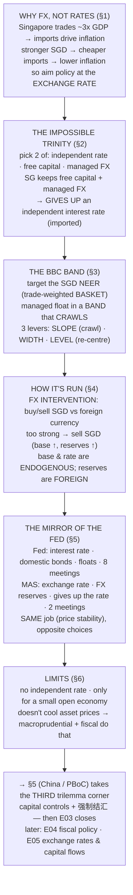

# E03 · §4 — The MAS Model: Singapore's Exchange-Rate Monetary Policy

> **Subject:** Economy & Finance *(hobby track)*
> **Module:** E03 — Money, Banking & Monetary Policy
> **Section:** the **second of three central-bank models** in E03, and the *local lens*. §3 built the standard
> model — a central bank steering a domestic **interest rate**. This section is its mirror image: the
> **Monetary Authority of Singapore (MAS)** gives up the interest rate entirely and steers the **exchange
> rate** instead. That's not an exotic quirk to memorize — it's the cleanest possible way to *test whether you
> actually understood §3*, because MAS makes the opposite choice at every fork (interest rate vs currency, 8
> meetings vs 2, domestic bonds vs FX reserves), and each opposite choice has a *reason* rooted in what an
> economy is. We build why a small, ultra-open economy targets the currency, why the **impossible trinity**
> means it *cannot also* keep an independent rate, the actual mechanism (the **BBC band** — basket, band,
> crawl), how MAS operates it (FX intervention — the bond-free model §3 §10d landed on), and the side-by-side
> that makes *both* models finally click. Fed and MAS take **two corners of the trilemma**; **§5 (China / the
> PBoC)** takes the **third** — capital controls — to complete the triangle before E03 closes and points to
> E04 (fiscal policy) and E05 (exchange rates & capital flows).
> **Status:** ✅ **finalized 2026-08-06** (body drafted 2026-08-01, went untouched). **§10 Applied** added from
> our live session — three threads: the intervention asymmetry & what pushes the SGD up; what "reserves"
> really are; and the currency-of-contract law that hinges into §5.
> Math in LaTeX, quantitative relationships drawn as real curves, key terms glossed in 中文 (大陆/台灣), per
> [`../../../agent-docs/authoring-conventions.md`](../../../agent-docs/authoring-conventions.md).

**Estimated study time:** 1.5–2 hours including reflection.
**Prerequisites:** E03 §3 (the whole standard Fed model — the policy rate, the reaction function, the five
transmission channels, and especially **channel 4, the exchange-rate channel**, plus §3 §10d's "manage the
base via FX instead of bonds"), E03 §1 (the central bank creates base money and holds reserves), and E02 §2
(imported inflation, the price level). Helpful: E02 §3's Singapore labour-market lens, and the fact from
E01/E02 that Singapore imports almost everything.

---

## Why this section exists (for *you*)

Two reasons. First, the **local lens**: you live and invest in Singapore, and MAS policy *is* the local
monetary news — "MAS tightened the slope," "the SGD NEER is at the top of the band," "core inflation came in
at 3%." You cannot read any of it with the Fed model alone, because MAS doesn't set an interest rate at all.

Second, and more powerfully, **MAS is the perfect foil for §3**. The best way to check that you understood
*why* the Fed does each thing is to study a serious central bank that does the *opposite* — and has equally
good reasons. Every contrast is a comprehension test: the Fed steers the price of *time* (the interest
rate); MAS steers the price of *foreign money* (the exchange rate). The Fed meets eight times a year; MAS,
twice. The Fed's balance sheet is full of domestic bonds; MAS's is full of foreign-exchange reserves. Hold
the two side by side (§5) and the logic of *both* snaps into focus in a way neither does alone.

> **One framing to carry through.** A central bank can only point its policy at *one* target. The Fed points
> at the **internal** price level via the interest rate. MAS points at the **external** value of the dollar
> via the exchange rate. Which one you choose is not ideology — it's determined by **what actually drives
> inflation in your economy**, and for a country that imports almost everything, that driver is the exchange
> rate. Everything below follows from that single fact.

---

## 1. Why an exchange rate, not an interest rate?

Start with the fact that decides everything: **Singapore is one of the most open economies on earth.** Its
total trade (exports plus imports) runs to **roughly three times its GDP** — it imports its food, its
energy, its water, its raw materials, and most of what it consumes, and re-exports an enormous volume on top.

![A bar chart of trade openness — exports plus imports as a share of GDP — across economies. Hong Kong is about 350 percent and Singapore about 320 percent, towering over the others; the Netherlands is about 155 percent, Germany and South Korea about 90 percent, and China, Japan, and the USA cluster low at roughly 37, 37, and 25 percent. A dashed line marks 100 percent of GDP. Annotations note that Singapore trades about three times its GDP so import prices drive its inflation, whereas the US is large and relatively closed so its interest rate is the natural lever.](diagrams/04-the-mas-model-fig3.svg)

Now connect that to inflation (E02 §2). In the US, most of what people buy is made domestically, so US
inflation is driven mainly by **domestic** demand and wages — which is exactly what an **interest rate**
acts on (§3's transmission). But in Singapore, most of what people buy is **imported**, so the single
biggest driver of the domestic price level is the **price of imports** — and the price of imports, in
Singapore-dollar terms, is set by the **exchange rate**. A stronger Singapore dollar makes every imported
good cheaper in local currency; a weaker one makes everything more expensive.

So for Singapore the causal chain is short and blunt:

**stronger SGD → cheaper imports → lower inflation** (and weaker SGD → dearer imports → higher inflation).

Given that, targeting the exchange rate isn't exotic — it's simply **aiming your policy at the thing that
actually moves your inflation.** The interest rate, MAS judges, would be a weak and roundabout tool here
(the domestic-demand channel is small relative to the trade channel), whereas the exchange rate hits the
dominant driver **directly and fast**. This is why MAS has run an **exchange-rate-centred** monetary policy
since 1981, essentially alone among major central banks.

---

## 2. The impossible trinity — why MAS *can't* also keep an independent rate

There's a deeper reason MAS doesn't set an interest rate: **it isn't allowed to by the laws of open-economy
macro.** This is the **impossible trinity** (or **trilemma**, from the Mundell–Fleming model), one of the
most useful frameworks in all of international economics.

![A triangle whose three corners are labelled independent monetary policy, free capital mobility, and exchange-rate stability. The claim is that a country can pick at most two — each side of the triangle joins the two corners it keeps and sacrifices the opposite corner. The left side (independent policy plus free capital) is a floating exchange rate, as in the USA and Eurozone, giving up exchange-rate stability. The right side (independent policy plus a fixed exchange rate) requires capital controls, as in China historically, giving up free capital. The bottom side (free capital plus a managed exchange rate) is Singapore and Hong Kong, which give up an independent interest rate. The bottom side is highlighted.](diagrams/04-the-mas-model-fig1.svg)

The trilemma says a country can have **at most two** of these three things:

1. **A managed / stable exchange rate**
2. **Free movement of capital across its borders**
3. **An independent monetary policy** (setting your own interest rate)

Why you can't have all three: suppose you both fix your exchange rate *and* let capital flow freely, and
then you try to set a domestic interest rate *higher* than the world rate. Global money, free to move, would
pour in to earn the higher return, which would force your currency up — breaking your exchange-rate target.
To hold the target you'd have to let the rate fall back to the world level. So a country with **open capital
and a managed currency has no independent interest rate** — its rate is effectively **imported** from world
markets (formally, via **covered interest parity**: the local rate tracks the world rate adjusted for the
expected currency move, $i_{\text{SGD}} \approx i_{\text{USD}} - \text{expected SGD appreciation}$).

Every country's regime is a choice of *which corner to give up*:

- **The US and Eurozone** keep independent rates + free capital → they must **float** the exchange rate
  (give up corner 1). This is why the Fed *can* run §3's model.
- **China (historically)** kept independent rates + a managed exchange rate → it had to impose **capital
  controls** (give up corner 2 — recall the eurodollar / capital-controls threads from §1 §10).
- **Singapore and Hong Kong** are global **financial hubs** — free capital movement is non-negotiable — and
  they want a managed currency (Singapore for inflation, Hong Kong via a hard USD peg). So both **give up an
  independent interest rate** (corner 3).

This is the rigorous version of §1: MAS *chose* to target the exchange rate for the inflation reason in §1,
and the trilemma says that choice **necessarily costs it interest-rate autonomy** — SGD interest rates are
essentially set by the world (mostly US rates), not by MAS. Far from being a problem, this is exactly what
MAS wants: it spends its one available lever on the exchange rate, the thing that actually drives Singapore's
inflation, and lets rates be imported.

---

## 3. The mechanism — the BBC band: Basket, Band, Crawl

MAS doesn't fix the dollar (a hard peg like Hong Kong's) and doesn't let it float (like the US). It runs a
**managed float** inside a **policy band**, and the framework is nicknamed **BBC** — **Basket, Band, Crawl.**

- **Basket.** MAS doesn't target the SGD against the US dollar alone; it targets the **SGD NEER** — the
  Singapore-dollar **nominal effective exchange rate**, a **trade-weighted basket** of the currencies of
  Singapore's main trading partners. (In MAS's own statements and in bank research it's written **S\$NEER**;
  this section uses **SGD NEER** for the same thing.) The exact currencies and weights are kept secret, to
  make the band harder to speculate against, but they broadly reflect trade shares. Using a basket makes
  sense because what matters for *imported inflation* is the SGD against *all* the places Singapore buys
  from, not just the US.
- **Band.** The SGD NEER is allowed to float within a **policy band** — a range around a central midpoint.
  Inside the band, the market sets the rate; MAS only acts to keep it from leaving.
- **Crawl.** The band is not flat — it **crawls** (slopes) over time, usually gently **upward** (a slow
  appreciation), reflecting Singapore's need to offset persistent imported-inflation pressure.

![A time-series diagram of the SGD NEER managed inside a sloping policy band. A shaded band rises gently from left to right; a dashed line marks its mid-point; a solid line shows the actual SGD NEER wiggling within the band. Three levers are annotated. The SLOPE is the gentle upward appreciation crawl, which MAS steepens to tighten policy (a faster-rising Singapore dollar makes imports cheaper). The WIDTH is the plus-or-minus range around the mid-point, which absorbs short-term volatility. The LEVEL is set by a discrete re-centring — shifting the whole band up or down at a policy meeting. The figure shows a re-centring up combined with a steeper slope midway through.](diagrams/04-the-mas-model-fig2.svg)

That gives MAS **three policy levers** — the exact analogue of the Fed's single interest-rate lever, but for
a band instead of a rate:

1. **The slope** (the crawl rate). Steepen the upward slope → the SGD appreciates *faster* → imports get
   cheaper faster → **tightening**. Flatten it to zero → neutral. Negative slope (a depreciation path) →
   **easing**. This is the *most-used* lever.
2. **The width** of the band. Widen it to accommodate more volatility (used in turbulent times); it's about
   *flexibility*, not the stance.
3. **The level / mid-point** — a **re-centring**: a discrete one-off shift of the whole band up (tightening)
   or down (easing), used when the SGD NEER has drifted to an edge and MAS wants to lock in a new level.

MAS announces its settings in a **Monetary Policy Statement (MPS)** twice a year (April and October), with
off-cycle moves reserved for emergencies. Compare that to the Fed's eight meetings: because the exchange
rate transmits to inflation *fast* (§5), MAS needs to adjust far less often than a central bank waiting out
§3's 12–18-month interest-rate lag.

---

## 4. How MAS actually operates the band — FX intervention

How does MAS *keep* the SGD NEER inside the band? Not by decree — by **buying and selling currency in the
foreign-exchange market**, exactly the "manage the monetary base via FX, not bonds" model you reasoned your
way to in §3 §10d.

- **If the SGD threatens to rise *above* the band** (too strong — e.g. huge capital inflows), MAS **sells
  Singapore dollars and buys foreign currency.** Selling SGD pushes its value back down into the band — and
  notice the by-product: MAS *creates* Singapore dollars to sell (expanding the monetary base, §1) and
  *accumulates* foreign-exchange reserves. This is why Singapore, a tiny country, sits on **hundreds of
  billions of dollars of FX reserves** — they are the accumulated residue of decades of leaning against SGD
  appreciation.
- **If the SGD threatens to fall *below* the band** (too weak), MAS **buys Singapore dollars and sells its
  foreign-currency reserves** — draining SGD from the system and defending the floor.

Two consequences complete the mirror-image of §3:

- **The monetary base is endogenous.** Because MAS must create or absorb SGD to hit the *exchange-rate*
  target, it **cannot independently choose the quantity of money** — the base is whatever the FX target
  requires. (The Fed chooses the price of reserves and lets the quantity follow; MAS chooses the exchange
  rate and lets *both* the money quantity and the interest rate follow. The trilemma, made mechanical.)
- **Reserves are foreign, not domestic.** The Fed's balance sheet is full of **domestic Treasuries** (§3);
  MAS's is full of **foreign-currency assets**. When MAS "does QE-like base expansion," it's buying *foreign*
  bonds, not Singaporean ones — the fully bond-market-independent way to run a central bank (§3 §10d). It
  also means MAS earns returns on a giant foreign portfolio (managed alongside GIC and Temasek in
  Singapore's broader reserves system), a very different institution from a domestic-bond central bank.

---

## 5. Transmission, and the comparison that makes both models click

**Transmission for a small open economy.** How does moving the SGD NEER control inflation? Mostly through one
short, powerful channel — the opposite of §3's five-channel web:

- **The direct import-price channel (dominant).** A stronger SGD immediately lowers the local-currency price
  of imported goods and imported *inputs*. Because imports are such a large share of the consumption basket,
  this passes through to the price level **quickly** — much faster than the Fed's 12–18-month lag. This is
  why MAS can afford to meet only twice a year.
- **The demand channel (secondary).** A stronger SGD makes Singapore's exports less price-competitive,
  cooling external demand and the domestic economy — a slower, supporting effect.

Because the exchange rate is *both* the inflation anchor and a demand lever, MAS gets most of §3's job done
with one instrument. (It targets **MAS core inflation** — which strips out *accommodation* and *private
transport*, the two components driven by domestic policy rather than import prices — precisely because the
exchange rate acts on the *importable* part of the basket.)

**The comparison that makes both click.** Here is the whole point of the section — the Fed and MAS doing the
*same job* (price stability) with opposite choices at every fork:

| | **The Fed (standard model, §3)** | **The MAS (this section)** |
|---|---|---|
| **Targets** | a domestic **interest rate** (price of *time*) | the **exchange rate** / SGD NEER (price of *foreign money*) |
| **Because inflation is driven by** | **domestic** demand & wages (large closed-ish economy) | **imported** prices (small ultra-open economy) |
| **Instrument(s)** | one overnight **policy rate** (IORB) | the **band**: slope · width · level |
| **Operating method** | administer IORB / OMO on **domestic bonds** | **FX intervention** — buy/sell SGD vs foreign currency |
| **Balance sheet holds** | domestic **Treasuries** | **foreign-exchange reserves** |
| **Gives up (trilemma)** | exchange-rate stability (the US **floats**) | an **independent interest rate** (imported from the world) |
| **Meets** | 8 times a year | **twice** a year (fast transmission) |
| **Transmission** | 5 channels, **long & variable lags** | mainly the **import-price** channel, **fast** |

Read that table twice: **every row is the same decision made oppositely, for a reason tied to the size and
openness of the economy.** That's why studying MAS *finishes* your understanding of the Fed — it shows you
which features of the Fed model are *universal* (some central bank must anchor the price level) and which are
*contingent* on the US being a large, relatively closed economy (the choice of the *interest rate* as the
lever).

![A twin-axis time series from 2020 to 2024 showing the Fed and the MAS fighting the same post-COVID inflation surge with different levers. On the left axis, the US federal funds rate stays near zero through 2021, then climbs steeply through 2022 to above 5 percent. On the right axis, the Singapore-dollar nominal effective exchange rate is roughly flat in 2020 to 2021, then appreciates steadily through 2022 to 2023 as the MAS tightens (five tightenings, two of them off-cycle). The shared shaded region marks the inflation surge both were responding to; the caption is same job, different levers.](diagrams/04-the-mas-model-fig4.svg)

The **2021–2023** episode is this table brought to life. Facing the same global inflation surge, the **Fed
raised its policy rate** from near zero to over 5%, while the **MAS tightened five times** — steepening the
SGD NEER appreciation slope and re-centring the band up (twice off-cycle) — to force a stronger Singapore
dollar and cheaper imports. Same disease, same goal, two completely different levers — and both, broadly,
worked. That parallel is the single clearest demonstration that §3 and §4 are two dialects of one language.

---

## 6. Strengths, limits, and the live record

**Strengths.**
- **It targets the actual inflation driver** (import prices) directly, rather than working around the houses
  through domestic demand — the right tool for the economy MAS actually has.
- **Fast transmission** — the exchange rate passes through to prices in months, not the Fed's year-plus.
- **A band, not a peg**, gives flexibility: it can absorb volatility (width) and bend to fundamentals
  (slope/level) without inviting the one-way speculative attack that broke hard pegs elsewhere (the ERM 1992,
  various 1990s crises — E05's territory).

**Limits — and what MAS gives up.**
- **No independent interest rate** (the trilemma cost). When the Fed hikes, SGD rates rise regardless of
  where Singapore is in *its own* cycle — though a steeper appreciation path can partly offset the imported
  tightening. Singaporeans feel this directly in mortgage rates (SORA tracks global rates, not an MAS
  decision).
- **It only works for a small, ultra-open economy.** A large economy *couldn't* copy it: the exchange rate
  is a **relative price** (not everyone can appreciate at once — someone must be on the other side), and a
  big economy's inflation is mostly domestic anyway, so the currency lever would be too weak. The Fed model
  isn't "less sophisticated" — it's the correct tool for a large closed-ish economy, just as MAS's is correct
  for Singapore.
- **It doesn't directly cool domestic asset prices.** The exchange rate does little about a **property**
  boom, so Singapore runs housing policy with a *separate* toolkit — **macroprudential** measures (loan-to-
  value limits, the additional buyer's stamp duty) and **fiscal** tools — exactly the "different lever for
  financial stability" principle from E02 §4 §10a and the Singapore-policy instincts you showed in E01 §3.
  Monetary policy (the SGD NEER) fights *imported goods* inflation; other tools fight *asset* inflation.

**The live record.** Beyond the 2021–23 tightening (fig 4), the pattern repeats each cycle: MAS eased as
global inflation cooled into 2024, keeping the slope positive but flatter. Reading an MPS is now within
reach — "MAS will *raise slightly the slope of the band*" is a tightening; "*no change to width or level*"
tells you it's a slope-only move; "core inflation projected at 2%" is the target being hit.

---

## 7. The one-page mental model

<!-- DIAGRAM:START -->

Diagram source (Mermaid)

<!-- DIAGRAM:END -->

**The eight things to remember:**
1. **Singapore targets the exchange rate because it's ultra-open** — it trades ~3x its GDP, so import prices
   (set by the SGD) drive inflation; the exchange rate hits that driver directly, the interest rate wouldn't.
2. **The impossible trinity forces the choice:** with free capital + a managed currency, MAS **cannot** also
   have an independent interest rate — SGD rates are **imported** from world markets.
3. **MAS runs a managed float — the BBC band:** it targets the **SGD NEER** (a secret trade-weighted
   **basket**), floating inside a **band** that **crawls** (slopes) gently upward.
4. **Three levers, not one rate:** the **slope** (steepen to tighten — the main lever), the **width**
   (volatility), and the **level** (a discrete **re-centring**). Announced twice a year (the MPS).
5. **It operates by FX intervention:** buy/sell SGD against foreign currency to hold the band — so the
   **monetary base and interest rate are endogenous**, and the reserves it piles up are **foreign**.
6. **It's the mirror image of the Fed** — same job (price stability), opposite choice at every fork
   (exchange rate vs rate, FX reserves vs bonds, gives up the rate vs floats the currency).
7. **Transmission is fast and direct** (the import-price channel), which is why MAS meets twice a year while
   the Fed meets eight times and waits out long lags. It targets **core inflation** (ex accommodation &
   private transport).
8. **The limits define the boundary:** no independent rate, works **only** for a small open economy, and
   doesn't cool asset prices — so Singapore fights property inflation with **macroprudential + fiscal** tools,
   not the SGD NEER.

---

## 8. Check your understanding

Reason first; check against a source where noted.

1. **The core reason.** In two sentences, explain why an economy that trades ~3x its GDP would target the
   exchange rate rather than the interest rate — and name the specific channel from §3 that becomes dominant.
2. **The trilemma.** Singapore wants to stay a global financial hub (free capital) and manage its currency.
   Use the impossible trinity to explain what it *must* give up, and what "SGD interest rates are imported"
   means in practice. What did China give up instead, and why (callback to §1 §10)?
3. **Which lever?** For each MAS move, name the lever (slope / width / level) and whether it tightens, eases,
   or neither: (a) steepening the appreciation path; (b) a one-off shift of the whole band upward;
   (c) widening the band in a volatile month; (d) flattening the slope to zero.
4. **The intervention mechanic.** Strong capital inflows are pushing the SGD toward the *top* of the band.
   What does MAS buy and sell to hold the band, and what are the two by-products for (i) Singapore's monetary
   base and (ii) its FX reserves?
5. **Same job, different lever.** In 2022 the Fed raised rates while MAS steepened the SGD appreciation.
   Explain how *each* move fights inflation, and why MAS's works faster. Which underlying inflation driver is
   each one aimed at?
6. **The mirror table.** Without looking, fill in the MAS column for: *instrument*, *balance-sheet holdings*,
   *what it gives up (trilemma)*, and *meeting frequency* — then say, for each, the *reason* it differs from
   the Fed.
7. **Where it stops.** Why can't the US run the MAS model, and why doesn't the SGD NEER cool a Singapore
   property boom? What tools does Singapore use for the latter (tie to E02 §4 §10a)?
8. **Live check.** Find the latest **MAS Monetary Policy Statement** (mas.gov.sg) and the MAS **core
   inflation** figure. Is the current stance a tightening, easing, or hold — and which lever (slope / width /
   level) did they move? How does core inflation compare to their comfort zone (~2%)?

---

## 9. Optional: watch the MAS model on live data (15–20 min)

- **The SGD NEER band, live.** MAS doesn't publish the exact band, but banks (e.g. DBS, OCBC, MUFG) publish
  **estimated SGD NEER** charts against an estimated band — search "SGD NEER band estimate." See where the rate
  sits in the band right now (top = market expects/priced tightening).
- **The policy statements.** Read the most recent **MAS Monetary Policy Statement** (twice-yearly, April &
  October) at mas.gov.sg — note the exact language on *slope*, *width*, and *level*. Compare two consecutive
  statements to see what changed.
- **Core vs headline inflation.** On the **SingStat** or MAS site, plot **MAS core inflation** against
  **headline CPI** — the gap is mostly accommodation + private transport, the bits the SGD NEER *doesn't*
  target. This is §5 made concrete.
- **Imported rates.** Look up **SORA** (the Singapore Overnight Rate Average) alongside the US fed funds rate
  — watch SGD rates track global rates, not an MAS decision. That's the trilemma's "imported interest rate"
  on a chart.

Bring one — an MPS, a SGD NEER-band estimate, or the SORA-vs-fed-funds chart — to our session and we'll read
the MAS stance off it: is the slope steepening or flattening, is the SGD at the top or bottom of the band,
what is core inflation doing — the way we ran the Fed on the 2026 dot plot (§3) and the yield curve on
who-sets-Treasury-rates (§2).

## 10. Applied — from our session Q&A

Our live session pulled on three threads, and together they trace the whole machine: **how MAS holds the
band**, **what the reserves it piles up actually are**, and **what currency the economy underneath is even
allowed to price in**. The last thread turns out to be the exact hinge into §5 (China does the opposite).

### 10a — Controlling the slope, the intervention *asymmetry*, and what really pushes the SGD up

You reasoned your way, correctly, to one of the deepest facts about any managed-FX regime — so let me record
it as you built it, with the one vocabulary fix that sharpens it.

**Your starting move — the asymmetry.** To hold the band, MAS sells SGD/buys foreign currency when the SGD is
too strong, and buys SGD/sells reserves when it's too weak. You spotted that these two directions are *not
symmetric*:

- **Resisting appreciation** (sell SGD, buy USD): MAS *creates* the SGD it sells, so its ammunition is
  effectively **unlimited**. 无限 (無限).
- **Resisting depreciation** (sell USD, buy SGD): MAS can only spend the **finite** foreign reserves it holds.

This asymmetry is exactly what breaks fixed-rate regimes from the *weak* side — 1997 Thailand, any peg defended
until the reserves run dry — but never from the strong side. **A central bank can hold a currency down forever;
it can only hold one up until the reserves are gone.**

**Your inference — reserve growth is a fingerprint.** From that you drew the right conclusion: MAS's
*ever-growing* reserve pile means MAS is *usually* on the "lean against a too-strong SGD" side — selling SGD,
buying USD, accumulating reserves. If the market were chronically trying to *weaken* the SGD, reserves would be
*shrinking* (spent on defence). **You read the direction of market pressure off the direction of reserve flow** —
precisely the right way to read it.

**The one fix — slope vs. level.** You called this "upward momentum pushing the slope." Sharpen it: the
**slope** (the trend appreciation rate) is **MAS's policy dial**, not something the market pushes. What the
market supplies is **pressure on the *level*** — the NEER wanting to sit above the band *today*. So the precise
statement is: *the fundamentals push the SGD's level up harder than MAS's chosen slope, so MAS leans against it
by selling SGD, and reserves accumulate.*

**Your actual question — so what fundamentals push the SGD up?** Four structural forces, in order:

1. **A gigantic, persistent current-account surplus** 经常账户盈余 (經常帳盈餘) — routinely **~15–20% of GDP**,
   among the largest on earth. More foreign currency flows in (exports of goods, services, and investment
   income) than out → continuous excess demand for SGD. It reflects a national **saving rate** (CPF, corporate
   retained earnings, fiscal surpluses) running far ahead of domestic investment.
2. **A huge net-creditor position throwing off income.** GIC, Temasek, MAS reserves, corporates → Singapore is
   a massive net owner of foreign assets, whose returns feed the surplus in a *self-reinforcing* loop.
3. **Safe-haven capital inflows** 避险资金 (避險資金) — AAA rating, rule of law, hub status pull in FDI,
   portfolio, and private-wealth inflows: structural demand for SGD assets.
4. **Balassa–Samuelson (productivity).** A fast-growing, high-productivity economy tends to see its *real*
   exchange rate appreciate; a country delivers that either through domestic inflation or a rising nominal
   currency — which is the bridge to the punchline.

**The twist — the appreciating slope *is* the monetary policy.** Singapore is too small and open for the
interest rate to be the main anti-inflation lever, so MAS *deliberately chooses* a gently appreciating slope to
hold down imported inflation (§1). So the market's appreciation pressure and MAS's desired policy **point the
same way** — MAS isn't fighting the upward momentum so much as *harnessing and metering* it (steepen when
imported inflation runs hot, as in 2022; flatten when it cools).

**The accounting that guarantees it all ties out.** A current-account surplus *must* be matched by net
acquisition of foreign assets (a financial-account outflow). Singapore recycles its high-saving surplus into
foreign assets — MAS reserves + GIC + Temasek — so the reserve growth isn't luck; it's the **mechanical
counterpart** of the surplus.

**The caveat on "unlimited."** Resisting appreciation isn't *free*: selling SGD injects SGD liquidity, which
left alone would loosen policy and stoke inflation — defeating the purpose. So MAS **sterilizes** 冲销 (沖銷) —
issuing MAS Bills / SGS, taking government deposits, doing reverse repos. Real cost and complexity, but — the
key point — **not a hard ceiling** the way finite reserves are on the depreciation side. Your "unlimited on the
strong side" holds; the binding constraint only bites in the rare crisis when MAS must defend a *weak* SGD, and
the giant reserve stockpile exists precisely to win those rare fights decisively.

### 10b — What "reserves" actually are, and why offshore returns don't move the SGD unless *converted*

Two precise questions that tighten §4's loose "GIC, Temasek, MAS reserves" lumping.

**(i) What counts as "foreign reserves"? Does my personal USD deposit count?** No — and the clean line runs
through *three* different pools I had lumped together:

| Pool | What it is | "Official foreign reserves"? |
|---|---|---|
| **MAS Official Foreign Reserves (OFR)** 官方外汇储备 (官方外匯儲備) | Foreign-currency assets held by the *monetary authority*, usable for FX intervention | **Yes** — the only pool that changes when MAS intervenes (~USD 370bn range) |
| **GIC** | Manages the government's long-horizon financial assets abroad | No — not OFR, not published |
| **Temasek** | A commercial holding company owning equity stakes | No — its own corporate balance sheet |

So **"official reserves" = MAS only.** GIC and Temasek are part of Singapore's *national* net-creditor position
净债权国 (淨債權國) but not "reserves" in the intervention sense. Your personal USD deposit is a **private**
external asset — it counts toward the country's net international investment position (NIIP), not toward
official reserves. So: correct, it doesn't count.

**(ii) If a public-sector fund earns high returns abroad and keeps them in foreign currency, does that push the
SGD up?** Your instinct was exactly right: **no — not unless it's *converted* into SGD.** An asset sitting in
US equities is USD that never places an order in the SGD market. Upward pressure materializes *only* when
someone sells foreign currency and buys SGD.

And this is the key to 10a's puzzle. The balance-of-payments identity says the surplus *must* become foreign
assets; the question is *who holds them and in what currency*. Singapore's answer — **recycle the surplus into
offshore foreign-currency assets** (MAS + GIC + Temasek) rather than converting it to SGD — is itself an
**appreciation-pressure release valve**. If the whole surplus had to be converted to SGD each year, no gentle
slope could survive it. The sovereign-wealth-fund model isn't only about returns; it's *structurally* how
Singapore keeps appreciation gentle despite enormous surpluses. Two honesty checks:

- **Investment income still enlarges the surplus statistically** (it's primary income 投资收益 / 投資收益) — but
  a *statistical* surplus is not *FX-market pressure*. Only conversion moves the rate.
- **Where the offshore money finally touches the SGD:** the **Net Investment Returns Contribution (NIRC)** — the
  government may spend up to ~50% of expected long-run returns from GIC/MAS/Temasek in its SGD budget. Funding
  SGD outlays means converting some returns into SGD — real SGD demand, though smoothed and offsettable.

### 10c — What currency is the economy even allowed to price in? (the hinge into §5)

You noticed the split: firms invoice in **USD** all the time, yet the consumer and property markets are **purely
SGD**. Is there a law? Could a condo carry a **USD** price tag?

**The governing principle: freedom of contract, and no exchange controls.** Singapore abolished exchange
controls in **1978** and has **no law requiring domestic transactions to be in SGD**. The default is **freedom
of contract** 合同自由 (契約自由): parties may price, invoice, and settle in any currency, and Singapore courts
will enforce a foreign-currency contract and even *give judgment* in a foreign currency. USD invoicing is
completely legal — routine in trade, shipping, commodities, and B2B.

**"Legal tender" ≠ "mandatory pricing currency."** Under the **Currency Act**, SGD notes/coins are **legal
tender** 法定货币 (法定貨幣) — meaning only that *if an SGD debt is payable in Singapore, the creditor must accept
SGD to discharge it*. It does **not** force prices to be in SGD (same reason a shop may refuse a large note or
refuse cash: legal tender governs *discharge of a debt*, not *what you must price in*). So the consumer market
being all-SGD is **economic gravity, not law** — wages, rents, CPF, and taxes are all SGD, so pricing consumer
goods otherwise just dumps FX risk on the customer.

**Could a developer put a USD tag on a condo?** No outright statutory ban on the *quote* — but the entire
apparatus of a residential sale runs in SGD, so in practice it's SGD and a USD tag would be self-defeating:
statutorily **prescribed** Option-to-Purchase / Sale-&-Purchase forms and progress-payment schedule; **stamp
duties** (BSD/ABSD) assessed in SGD; MAS **loan rules** (LTV, TDSR) and SGD housing loans; **CPF** (SGD-only).
A USD contract would pile FX risk onto a buyer whose loan, CPF, and salary are all SGD — nobody would sign it,
and the paperwork converts to SGD anyway.

**The one hard hook — and note what it's about.** Even a USD invoice for a domestic supply must show the
**SGD-equivalent** for **GST** 消费税 (消費稅): IRAS requires GST to be *accounted for* in SGD. That's the
closest thing to a "must use SGD" rule — and it's **tax accounting**, not a restriction on what you may price or
contract in.

**Mental model:** Singapore lets you *contract* in any currency (open economy, freedom of contract), reserves
SGD's special status for the narrow legal-tender question of *discharging SGD debts*, and lets **practical
gravity** pull consumer and property pricing into SGD without ever needing a law.

**Why this is the hinge into §5.** Hold that picture — *no exchange controls, free choice of contract
currency, capital flows in and out freely* — because **China is the exact opposite corner of the trilemma**
(§2). China keeps an *independent interest rate* **and** a *managed exchange rate*, which the trilemma says
forces it to give up the third corner: **free capital movement**. So China runs **capital controls** and,
historically, **强制结汇 (compulsory FX surrender)** — the state *requiring* exporters to hand over their foreign
currency — the precise inverse of Singapore's "keep your USD, price in what you like." §5 builds that third
model, and your 10c question is exactly the door into it.

*(Signature pattern, again: the value in each thread was not re-teaching the mechanism but* correcting the
premise *and* naming the structure *— slope-vs-level, OFR-vs-GIC-vs-Temasek, legal-tender-vs-pricing-currency —*
*and your own instincts (the intervention asymmetry, "returns don't move the SGD unless converted") were the
load-bearing insights, integrated straight in.)*

---

## Key terms — English · 中文（中国大陆 / 台灣）

The payoff section for reading **Singapore/Asia** monetary news across both languages. Most differences are
**simplified vs traditional script**; **⚠ marks a genuine terminology difference** you'd trip over.

**The institution & the regime**

| English | 中国大陆 (简体) | 台灣 (繁體) | Note |
|---|---|---|---|
| Monetary Authority of Singapore (MAS) | 新加坡金融管理局 | 新加坡金融管理局 | Singapore's central bank |
| Exchange rate | 汇率 | 匯率 | ⚠ 汇 ↔ 匯; the price of foreign money |
| Small open economy | 小型开放经济体 | 小型開放經濟體 | trades a large multiple of GDP |
| Trade openness | 贸易开放度 | 貿易開放度 | ⚠ 贸 ↔ 貿; (exports+imports)/GDP |
| Imported inflation | 输入性通胀 | 輸入性通膨 | ⚠ 通胀 ↔ 通膨; the driver MAS targets |
| Managed float | 有管理的浮动汇率 | 管理浮動匯率 | ⚠ 浮动 ↔ 浮動; not a peg, not a free float |
| Peg | 盯住／钉住汇率 | 釘住匯率 | ⚠ a *hard* fix (Hong Kong), not MAS |

**The trilemma & the mechanism**

| English | 中国大陆 (简体) | 台灣 (繁體) | Note |
|---|---|---|---|
| Impossible trinity / trilemma | 三元悖论（不可能三角）| 三元悖論（不可能的三位一體）| ⚠ 悖论 ↔ 悖論; pick 2 of 3 |
| Capital mobility / flows | 资本流动 | 資本流動 | free movement across borders |
| Capital controls | 资本管制 | 資本管制 | what China gave up instead |
| Covered interest parity | 抛补利率平价 | 拋補利率平價 | ⚠ 抛补 ↔ 拋補; why rates are imported |
| Currency basket | 一篮子货币 | 一籃子貨幣 | ⚠ 篮 ↔ 籃; the SGD NEER's contents |
| Nominal effective exchange rate (NEER) | 名义有效汇率 | 名目有效匯率 | ⚠ 名义 ↔ 名目; trade-weighted rate |
| Policy band | 政策区间 | 政策區間 | ⚠ 区间 ↔ 區間; the managed range |
| Crawl (of the band) | 爬行（区间斜率）| 爬行（區間斜率）| the appreciation slope |
| Re-centring | 中心平价调整 | 中心點調整 | a discrete band shift (the LEVEL lever) |

**Operating it & the effects**

| English | 中国大陆 (简体) | 台灣 (繁體) | Note |
|---|---|---|---|
| FX intervention | 外汇干预 | 外匯干預 | ⚠ 干预 ↔ 干預; buy/sell SGD to hold the band |
| Foreign-exchange reserves | 外汇储备 | 外匯儲備 | MAS's balance sheet (foreign, not domestic) |
| Appreciation / depreciation | 升值／贬值 | 升值／貶值 | ⚠ 贬 ↔ 貶; stronger / weaker currency |
| Core inflation | 核心通胀 | 核心通膨 | ⚠ 通胀 ↔ 通膨; MAS's target (ex accom. & transport) |
| Macroprudential policy | 宏观审慎政策 | 總體審慎政策 | ⚠ **宏观审慎 ↔ 總體審慎**; the property-cooling tool |

> Recurring genuine splits to memorize: **汇率 ↔ 匯率** (exchange rate), **名义 ↔ 名目** (nominal),
> **浮动 ↔ 浮動** (float), **通胀 ↔ 通膨** (inflation), **贬值 ↔ 貶值** (depreciation), **悖论 ↔ 悖論**
> (paradox), **宏观审慎 ↔ 總體審慎** (macroprudential).

---

## References (optional, for depth)

- **Straight from the source:** the **MAS** page **"Singapore's Exchange Rate-Based Monetary Policy"** — MAS
  explaining its own framework (basket, band, crawl) in plain terms. https://www.mas.gov.sg — search
  "exchange rate policy" / "monetary policy framework."
- **The current stance:** the latest **MAS Monetary Policy Statement** (April & October) — short, readable,
  and the live application of everything above.
- **The trilemma:** any international-macro explainer of the **Mundell–Fleming impossible trinity** — e.g.
  the *Investopedia* "Trilemma" entry, or CORE Econ's open-economy material. https://www.core-econ.org/the-economy/
- **A good outside overview:** the IMF or BIS write-ups on Singapore's monetary framework, and academic
  retrospectives on "why Singapore targets the exchange rate" (MAS's own staff papers are accessible).
- **Live data to practise on:** **MAS** (SGD NEER commentary, MPS, core inflation), **SingStat** (CPI),
  bank research desks (DBS/OCBC/UOB **SGD NEER band estimates**), and **SORA** vs the US fed funds rate.

---

### What's next
✅ **Finalized 2026-08-06** (§10 Applied added from our live session). You now hold *two* of the three
templates for how a central bank anchors the price level: the **Fed model** (§3 — steer the domestic
**interest rate**, because a large closed-ish economy's inflation is domestic) and the **MAS model** (§4 —
steer the **exchange rate**, because a small ultra-open economy's inflation is imported), tied together by
the **impossible trinity** that says *which* lever you can keep. Fed and MAS occupy **two corners** of that
triangle — but the trilemma has **three**. **§5 (China / the PBoC)** takes the corner neither of them chose:
keep *both* an independent interest rate *and* a managed exchange rate, and pay for it by giving up **free
capital movement** — **capital controls**, and historically **强制结汇 (compulsory FX surrender)**. That's the
exact inverse of the freedom-of-contract, open-capital Singapore you met in §10c, and it completes the
central-bank picture before Module E03 closes. After §5, the track opens onto the **other half of macro
policy — E04, fiscal policy**, and, when you want the FX mechanics deepened, **E05 (exchange rates, the
balance of payments, and capital flows)**, where the trilemma, FX intervention, and Singapore-as-a-hub return
with full rigour.
