# E03 · §5 — The PBoC Model: China's Managed Exchange Rate, Capital Controls & Compulsory FX Surrender

> **Subject:** Economy & Finance *(hobby track)*
> **Module:** E03 — Money, Banking & Monetary Policy
> **Section:** the **third and final central-bank model** of E03, and the piece that **completes the trilemma
> triangle**. §3 (the Fed) and §4 (MAS) each took *two corners* of the impossible trinity and gave up the
> third: the Fed keeps an independent rate + free capital and **floats**; MAS (Monetary Authority of Singapore) keeps free capital + a managed
> currency and **gives up the rate**. The **People's Bank of China (PBoC)** takes the corner *neither* chose —
> it keeps **both** an independent interest rate **and** a managed exchange rate, and pays the trilemma's bill
> by giving up the third corner: **free movement of capital**. That single choice explains everything
> downstream — **capital controls**, the historical **compulsory FX (foreign exchange) surrender (强制结汇)** that built the
> largest reserve pile in history, an FX regime that is neither a float nor a hard peg, and a monetary toolkit
> that looks nothing like the Fed's. This is the exact inverse of the open-capital, freedom-of-contract
> Singapore you met in §4 §10c. It closes E03 and points to E04 (fiscal policy) and E05 (exchange rates &
> capital flows), where these mechanics return with full rigour.
> **Status:** ✅ **finalized 2026-08-07** (body drafted 2026-08-06, went untouched). **§10 Applied** added from
> our live session — two threads: the **PBoC's mandate** (vs the Fed's and MAS's), and **a map of every major
> central bank on the trilemma triangle** (with an abbreviation key). This section **closes Module E03.**
> Math in LaTeX, quantitative relationships drawn as real curves, key terms glossed in 中文 (大陆/台灣), per
> [`../../../agent-docs/authoring-conventions.md`](../../../agent-docs/authoring-conventions.md).

**Estimated study time:** 1.5–2 hours including reflection.
**Prerequisites:** E03 §4 (the whole MAS model — the **impossible trinity**, FX intervention, why reserves are
foreign, and especially §4 §10a's *intervention asymmetry* and §10c's *no-exchange-controls* Singapore), E03
§3 (the Fed model — the policy rate, the reaction function, the reserve-market plumbing, and §3 §10's
*credit-allocation-neutrality* insight), E03 §1 (banks create money; the central bank creates base money and
holds reserves). Helpful: E02 §2 (imported inflation), and the callbacks from §1 §10 / §4 §2 that China
"chose capital controls."

---

## Why this section exists (for *you*)

Three reasons. First, **you asked for it** — you wanted a *full picture*, and two models leave the triangle
with an empty corner. The Fed and MAS are the two corners most economies actually live in; China is the great
exception, and understanding *why* it can be an exception is the cleanest possible test that you understood the
trilemma at all.

Second, the **local/regional lens goes both ways.** You live in Singapore's *open-capital* world, where you can
hold USD, wire money abroad, and price a contract in any currency (§4 §10c). China is the **mirror image** — a
world of quotas, surrender requirements, and controlled gates. Half of Asia's economic news — the yuan
"fixing," the RRR (reserve requirement ratio) cut, the reserve number, the capital-flight scare — is unreadable without this model, and it
is the one whose *mechanics* differ most from everything you've built so far.

Third, **China is where the trilemma stops being a diagram and starts drawing blood.** MAS's asymmetry (§4
§10a) — unlimited ammunition against appreciation, finite against depreciation — was a clean piece of logic.
In China's **2015–16** episode it became a **one-trillion-dollar** real event. Watching a giant economy hit the
trilemma wall, and choose which corner to sacrifice *under fire*, is the payoff.

> **One framing to carry through.** The trilemma is not a menu you order from once; it is a *budget constraint*
> you live inside forever. The Fed, MAS, and the PBoC are three governments spending the same fixed budget on
> different things. China's distinctive choice — **buy monetary autonomy *and* currency stability, pay with the
> capital account** — is coherent and, for a large developing economy that wanted to industrialize on its own
> terms, was arguably the *right* choice. But it is expensive, and the bill (controls, surrender, sterilization,
> a permanent tension with opening up) is what this section is about.

---

## 1. Why China is the trilemma's *third* corner

<b>Vocabulary for this section</b> — the trilemma corner China chose, and the parity symbols (click to expand)

**Abbreviations**

| Short | Stands for | Meaning |
|---|---|---|
| **PBoC** | People's Bank of China | China's central bank |
| **CNY** | Chinese yuan (onshore) | the tightly controlled onshore market for the currency |
| **CNH** | Chinese yuan (offshore) | the freely traded offshore market, mostly in Hong Kong — the same currency at a second price |
| **USD** | US dollar | |
| **MAS** | Monetary Authority of Singapore | the exchange-rate-targeting model of §4 |
| **Fed** | the Federal Reserve | the interest-rate-targeting model of §3 |

**Symbols used in the formulas**

| Symbol | Reads as | Meaning |
|---|---|---|
| $i_{\text{CNY}}$ | "i sub C-N-Y" | the nominal interest rate on onshore yuan; $i$ is the standard symbol for a **nominal** rate |
| $i_{\text{USD}}$ | "i sub U-S-D" | the nominal interest rate on US dollars — the world rate in practice |
| $\approx$ | "is approximately equal to" | |

**Terms**

| Term | Definition |
|---|---|
| **Impossible trinity (trilemma)** | a country can hold at most two of: an independent monetary policy, free capital mobility, and a managed exchange rate |
| **Independent monetary policy** | setting your own interest rate for your own conditions rather than importing the world's |
| **Free capital mobility** | money being able to cross the border freely in search of financial return |
| **Capital controls** | restrictions on those flows — the corner China gives up the other two to keep |
| **Managed exchange rate** | keeping the currency inside a chosen range rather than letting markets set it |
| **Renminbi / yuan** | the currency (renminbi is the name of the money, yuan the unit) |
| **Export-led industrialization** | a growth strategy built on selling manufactured goods abroad, which wants a stable and competitive currency |
| **Competitive (cheap) currency** | one deliberately kept weak, which subsidises exporters by making their goods cheap abroad |
| **Arbitrage** | exploiting a price difference between two markets; what capital controls are designed to block |
| **Covered interest parity** | the arbitrage relation pinning a local rate to the world rate adjusted for the expected currency move |
| **Spread** | the gap between two rates, which is what free capital would rush in to capture |
| **Monetary autonomy** | the freedom to set a domestic rate different from the world's — what the controls buy |
| **Onshore–offshore split** | the coexistence of a controlled CNY price and a free CNH price; the gap between them is the trilemma made visible |

Recall the impossible trinity (§4 §2): a country can hold **at most two** of {independent monetary policy, free
capital mobility, a managed exchange rate}. §3 and §4 each showed you one choice. Here is all three at once —
the completed triangle.

![A triangle whose three corners are labelled independent monetary policy, free capital mobility, and exchange-rate stability (managed). Each of the three sides keeps the two corners it joins and sacrifices the opposite corner. The left side joins independent policy and free capital — a floating exchange rate, as in the USA and Eurozone and the Fed of section 3, giving up exchange-rate stability. The bottom side joins free capital and a managed exchange rate — Singapore, Hong Kong and MAS of section 4, giving up an independent interest rate. The right side joins independent policy and a managed exchange rate — China and the PBoC, giving up free capital, which means capital controls. The right side is highlighted as the subject of this section. A caption notes that the Fed and MAS take two corners and China takes the third, completing the triangle.](diagrams/05-the-pboc-model-fig1.svg)

China's economic strategy demanded **two** things at once:

- **An independent interest rate.** China is a continent-sized economy with its own gigantic domestic credit
  system, its own investment cycle, and — for decades — its own development plan. It was never going to import
  its monetary stance from Washington the way tiny open Singapore does. It wanted to set Chinese interest rates
  for Chinese conditions.
- **A managed, stable exchange rate.** An export-led industrialization strategy needs a currency that is
  *stable and competitive*, not one whipped around by global capital. A predictable yuan let exporters price,
  plan, and win world market share; a deliberately *cheap* yuan (for much of the 2000s) subsidized that export
  machine directly.

The trilemma says you cannot have both of those *and* free capital. So China **gave up the third corner**: it
does **not** let capital move freely across its border. That is the whole architecture in one sentence —
**capital controls are the price China pays to keep both its interest rate and its exchange rate.**

**How controls actually buy autonomy — the mechanism.** In §4 §2 we said an open-capital country's interest
rate is *imported*, pinned to the world rate by arbitrage (covered interest parity):

$$i_{\text{CNY}} \approx i_{\text{USD}} - (\text{expected CNY appreciation}).$$

If capital were free and China tried to hold its rate *above* this, money would pour in to earn the spread,
forcing the yuan up and breaking the managed rate. **Capital controls sever that arbitrage.** With the gate
shut, global money *cannot* freely chase the spread, so covered interest parity **does not bind onshore** — and
the PBoC is free to set a domestic rate that differs from the world rate *while still* managing the currency.
The living proof is the **onshore–offshore split**: the tightly-controlled onshore yuan (**CNY**) and the
freely-traded offshore yuan in Hong Kong (**CNH**) can trade at *different* prices and imply *different* rates,
precisely because the wall between them blocks the arbitrage that would otherwise force them together. That gap
*is* the trilemma made visible.

---

## 2. The exchange-rate regime — from hard peg to a managed basket float

<b>Vocabulary for this section</b> — the exchange-rate regime, its history and its two daily levers (click to expand)

**Abbreviations**

| Short | Stands for | Meaning |
|---|---|---|
| **PBoC** | People's Bank of China | |
| **USD** | US dollar | the currency the yuan was pegged to, at about 8.28 per dollar until 2005 |
| **CNY / CNH** | onshore yuan / offshore yuan | the managed domestic market versus the free Hong Kong market |
| **CFETS** | China Foreign Exchange Trade System | the PBoC-run platform that publishes the daily fix, and the name of China's trade-weighted currency index |
| **NEER** | nominal effective exchange rate | a currency's value against a trade-weighted basket — MAS's target, and the concept behind the CFETS index |
| **MAS** | Monetary Authority of Singapore | the comparison case, whose band works very differently |
| **US** | United States | |

**Terms**

| Term | Definition |
|---|---|
| **Hard peg** | a fixed rate against one currency, held by intervention — China's regime from 1994 to 2005, and Hong Kong's to this day |
| **Managed (dirty) float** | market trading permitted, but only inside limits the central bank enforces |
| **Free float** | no target at all; the US regime |
| **Central parity ("the fix", 中间价)** | the midpoint published every morning, around which the yuan may trade that day — a genuine policy instrument in its own right |
| **Trading band (±2%)** | the maximum the onshore yuan may move from that day's fix before official buyers step in |
| **Daily reset** | the feature that distinguishes China's band from MAS's: the reference point is re-set every morning, rather than crawling slowly |
| **Appreciation / depreciation** | the currency getting stronger versus weaker |
| **Devaluation** | a deliberate, discrete weakening by the authority — as in the 8·11 move of August 2015 |
| **8·11 reform** | the August 2015 attempt to make the fix more market-determined, which produced a roughly 3% drop in days and triggered capital flight |
| **Market-determined** | set by trading rather than by announcement; the direction the reform was meant to move in |
| **Basket** | the set of partner currencies the yuan is framed against, replacing a single-dollar reference |
| **CFETS index** | China's trade-weighted basket index, conceptually like Singapore's NEER |
| **Counter-cyclical factor (逆周期因子)** | the discretionary term added to the fix formula, letting the PBoC lean against market moves it dislikes |
| **Trade surplus** | exporting more than you import — the pressure that drove the 2005–14 appreciation |
| **Capital flight** | residents and investors rushing money out of the country |
| **Liberalize** | loosen official control over a price or a flow |
| **Proxies (state banks)** | the large state-owned banks that intervene on the PBoC's behalf, so official action is not always visible as such |

China does not float the yuan (like the US) and — since 2005 — does not run a pure hard peg (like Hong Kong's
fixed 7.8/USD). It runs a **tightly managed float** with two moving parts you must know: a **daily central
parity** and a **trading band** around it.

![A time series of the Chinese yuan against the US dollar from 1994 to 2025, plotted so that a lower line means a stronger yuan. From 1994 the rate is essentially flat as a hard peg at about 8.28 yuan per dollar, holding through the Asian financial crisis and until 2005. In July 2005 the peg is loosened and the yuan appreciates steadily, strengthening from about 8.28 to a strongest point near 6.05 by early 2014. In August 2015 a sharp discrete step weakens the yuan — the 8-11 reform devaluation. From 2015 to 2025 the yuan trades in a managed range roughly between 6.3 and 7.3 per dollar, weakening during the 2018-19 trade war and again in 2022-24. Annotations mark the 8.28 peg era, the 2005 managed-appreciation reform, the 2014 strongest point, and the August 2015 8-11 devaluation.](diagrams/05-the-pboc-model-fig2.svg)

**The history in four acts** (fig 2):

1. **The hard peg (1994–2005).** After unifying its dual exchange rates in **1994** (a reform we return to in
   §4 below), China pegged the yuan at roughly **8.28 per US dollar** and held it there — famously *not*
   devaluing during the 1997 Asian crisis, which won it regional credibility. A fixed rate + independent policy
   + closed capital account: a textbook "right-side corner."
2. **Managed appreciation (2005–2014).** Under heavy US pressure over its trade surplus, China began a
   *gradual, controlled* appreciation in July 2005, letting the yuan strengthen from 8.28 toward a peak of about
   **6.05** by early 2014 — a slow crawl, tightly managed, never a free float.
3. **The 8·11 reform (August 2015).** China announced it would make the daily fix more "market-determined" — and
   the yuan promptly *dropped* about 3% in days (the market had been leaning weak). This **8·11 devaluation**
   spooked global markets and triggered massive capital flight (§6). It was a genuine attempt to liberalize that
   ran straight into the trilemma.
4. **The managed basket, with a "counter-cyclical factor" (2016–now).** China now frames the yuan against a
   **basket** (the **CFETS index** — a trade-weighted basket, conceptually like MAS's NEER) and sets the daily
   fix by a published-ish formula: previous close + basket move + a discretionary **"counter-cyclical factor"**
   (逆周期因子) that lets the PBoC lean against moves it dislikes. The yuan has traded roughly **6.3–7.3** since.

**The two levers of the regime:**

- **The daily central parity (中间价, the "fix").** Every morning the PBoC (via the CFETS) publishes a **central
  parity rate** for the day — the midpoint the yuan will trade around. This is a genuine *policy instrument*:
  by setting where the fix is, the PBoC signals and steers.
- **The trading band (±2%).** The onshore yuan may move at most **±2%** from that day's fix. Hit the edge and
  the PBoC's proxies step in. (Contrast MAS's band, which is a secret, wider, *slowly crawling* range around a
  basket; China's is a *daily-reset*, narrow ±2% around a *daily* fix. Both are "managed floats," operated very
  differently.)

**CNY (onshore renminbi) vs CNH (offshore renminbi) — a consequence worth naming.** Because the onshore market is walled off, an **offshore** yuan
market grew up in Hong Kong (**CNH**), where the yuan trades freely. **CNY** (onshore, managed) and **CNH**
(offshore, free) are the *same currency* at *two prices*. When the two diverge, it tells you which way the
*uncontrolled* market wants to go — a pressure gauge the controls would otherwise hide.

---

## 3. Capital controls — the machinery that pays the trilemma's bill

<b>Vocabulary for this section</b> — the capital-control machinery and the metered gates (click to expand)

**Abbreviations**

| Short | Stands for | Meaning |
|---|---|---|
| **SAFE** | State Administration of Foreign Exchange (国家外汇管理局) | the agency under the PBoC that administers the controls |
| **PBoC** | People's Bank of China | |
| **FX** | foreign exchange | foreign currency, and the market for it |
| **USD** | US dollar | the currency the individual quota is denominated in |
| **QFII / RQFII** | Qualified Foreign Institutional Investor / Renminbi QFII | licensing schemes letting approved foreign institutions invest onshore |
| **ODI** | outbound direct investment | Chinese companies investing abroad, which is screened |

**Terms**

| Term | Definition |
|---|---|
| **Capital controls** | quotas, approvals and licensed channels restricting cross-border movement of money seeking a financial return |
| **Capital account** | the part of the balance of payments covering financial flows — investments, loans, deposits. ⚠ Distinct from the **current account**, which covers trade in goods and services; China keeps the current account fairly open and the capital account closed |
| **Current account** | cross-border payments for goods, services and income — the flows that *are* allowed relatively freely |
| **Quota** | a hard numerical cap on how much may be moved |
| **Individual FX quota** | the per-resident limit of USD 50,000 a year that may be converted into foreign currency |
| **Approval regime** | the requirement that a company document and obtain permission before moving capital |
| **Over-invoicing** | disguising capital movement as trade by misstating the price on an invoice |
| **"Smurfing"** | splitting a large transfer across many individuals' quotas |
| **Underground banking** | informal cross-border settlement networks operating outside the official system |
| **Leakage** | the general fact that controls always breed evasion channels |
| **Stock Connect** | the metered Shanghai and Shenzhen to Hong Kong trading links for equities |
| **Bond Connect** | the equivalent channel for the onshore bond market |
| **"Liberalization by pipeline"** | opening narrow, monitored, widenable channels instead of opening the account itself |
| **Load-bearing wall** | the section's framing: the controls are not a malfunction but the deliberate structural cost of the corner China chose |

"Capital controls" 资本管制 (資本管制) sounds abstract; concretely it is a dense system of **quotas, approvals,
and licensed channels** administered mainly by **SAFE** (the State Administration of Foreign Exchange, 国家外汇
管理局) under the PBoC. The point is always the same: **you may trade goods and services across the border fairly
freely, but you may not move *capital* — money seeking financial return — in or out at will.**

The main instruments:

- **The individual FX quota.** A Chinese resident may convert only up to **USD 50,000 per year** into foreign
  currency, and even that is monitored and cannot be freely used to buy foreign property or securities. This is
  why moving personal wealth out of China is hard, and why *illicit* channels (over-invoicing trade, "smurfing,"
  crypto, underground banks) exist — controls always breed leakage.
- **Corporate and financial approvals.** Companies need documentation and approval to move capital across the
  border; foreign borrowing is quota'd; outbound investment (ODI) is screened.
- **The controlled "gates."** Rather than open the account, China built *narrow, metered doors* for foreign
  capital to reach its markets and vice versa: **QFII/RQFII** (licensed foreign institutional investors),
  **Stock Connect** (Shanghai/Shenzhen–Hong Kong), and **Bond Connect**. Each is a valve the state can widen or
  narrow — liberalization "by pipeline," not by opening the floodgates.

**Why this is the load-bearing wall.** Everything in §1–§2 rests on this. Without controls, the arbitrage in §1
would force China's rate to the world rate, or force the yuan to move — China could not keep both. Controls are
not a sign the system is broken; they are the *deliberate structural cost* of the corner China chose. And they
are the exact inverse of §4 §10c's Singapore: there, no controls, hold any currency, price a contract in USD if
you like; here, a USD 50,000 wall and a surrender history. **Same trilemma, opposite corner, opposite daily
life.**

---

## 4. Compulsory FX surrender (强制结汇) — how it built the world's biggest reserve pile

<b>Vocabulary for this section</b> — compulsory surrender, sterilization and every piece of the reserve machine (click to expand)

**Abbreviations**

| Short | Stands for | Meaning |
|---|---|---|
| **FX** | foreign exchange | foreign currency |
| **USD** | US dollar | the currency exporters earned and had to hand over |
| **RRR** | reserve requirement ratio (存款准备金率) | the share of deposits banks must park at the central bank — China's great sterilization tool, peaking at 21.5% in 2011 |
| **PBoC** | People's Bank of China | |
| **SAFE** | State Administration of Foreign Exchange | the agency that still steers FX flows under "voluntary" settlement |
| **MAS** | Monetary Authority of Singapore | the discretionary version of the same intervention, from §4 |

**Terms**

| Term | Definition |
|---|---|
| **Compulsory FX surrender (强制结汇)** | the rule that an exporter earning foreign currency had to sell it to a designated state bank, which passed it to the PBoC, in exchange for yuan at the official rate |
| **Voluntary settlement (意愿结汇)** | the successor regime, in which firms may choose to hold foreign-currency accounts instead — but where the state still steers the plumbing |
| **Designated state bank** | the licensed intermediary through which the surrender ran |
| **Official rate** | the administered exchange rate at which the conversion was done |
| **Dual exchange rates** | the pre-1994 arrangement of an official rate alongside a market rate, unified in the 1994 reform |
| **Trade surplus** | exporting more than you import; the torrent of incoming dollars this machine automatically converted |
| **Foreign-exchange reserves** | the resulting stock of foreign assets on the central bank's balance sheet, which peaked near USD 4 trillion in 2014 |
| **Base money (monetary base)** | currency plus banks' reserves — what the PBoC created in order to buy those dollars |
| **Monetization** | turning an inflow into newly created domestic money; here it happened automatically with every trade surplus |
| **Sterilization** | offsetting that money creation so it does not fuel credit and inflation — ⚠ **unsterilised** intervention leaves the new money in the system, **sterilised** intervention mops it back up |
| **Central-bank bills** | short-dated securities the PBoC sold to banks to absorb the excess yuan |
| **Reserve requirement ratio** | the other, larger mop: forcing banks to park more yuan at the PBoC instead of lending it out |
| **Leaning against the wind** | discretionary intervention to slow a currency move — what MAS does, as opposed to this standing legal requirement |
| **"The engine and the brake"** | the section's summary: surrender created the yuan, the reserve requirement locked it up |
| **Running in reverse** | the modern pattern — inflows slowed, sterilization is no longer needed, so cutting the reserve requirement releases locked money and *eases* policy |

This is the piece you specifically asked about, and it is the most vivid single mechanism in the whole model.
**Compulsory FX surrender — 强制结汇 (qiángzhì jiéhuì).** For years, a Chinese
exporter who earned US dollars was **not allowed to keep them** — it was *required* to sell (surrender) those
dollars to a designated state bank, which passed them up to the PBoC, in exchange for yuan at the official rate.

**Read what that machine does, step by step — it is §4's FX intervention, but *forced and automatic*:**

1. **Exports earn dollars.** China's export engine runs a huge trade surplus, so a torrent of USD flows in.
2. **The dollars are surrendered, not kept.** Under compulsory surrender, exporters *must* convert them to yuan. So the
   foreign currency piles up on the **PBoC's** balance sheet — this is exactly how China built **foreign-exchange
   reserves that peaked near USD 4 trillion in 2014**, the largest hoard any country has ever held.
3. **Creating the yuan to pay for them is base-money creation.** To buy all those dollars, the PBoC *issues
   yuan* — expanding the monetary base (§1), precisely MAS's "sell your currency, accumulate reserves" (§4 §4),
   except here it is not discretionary leaning-against-the-wind but a *standing legal requirement* that
   automatically monetized every trade surplus.
4. **So it had to be sterilized — massively.** All that freshly-created yuan, left in the banking system, would
   have caused runaway credit and inflation. So the PBoC **sterilized** on a scale no other central bank has
   matched: it issued **central-bank bills** and, above all, it **raised the reserve requirement ratio (RRR)**
   again and again — forcing banks to park ever more yuan at the PBoC instead of lending it out.

![A time series of China's official foreign-exchange reserves in trillions of US dollars from 1994 to 2025. Reserves are negligible in the 1990s, then climb explosively through the 2000s from under 0.2 trillion in 2000 to about 1.9 trillion in 2008, continuing up to a peak of nearly 4 trillion US dollars in mid-2014. From 2014 to early 2017 reserves fall sharply by about one trillion, to roughly 3 trillion, as the PBoC sells dollars to defend the yuan after the 2015 8-11 reform triggers capital flight. From 2017 to 2025 reserves plateau in a band around 3.0 to 3.3 trillion. Annotations mark the compulsory-surrender-driven climb, the nearly 4 trillion peak in 2014, and the roughly one-trillion drawdown of 2014 to 2016.](diagrams/05-the-pboc-model-fig3.svg)

![A time series of China's reserve requirement ratio for large banks, in percent, from 2003 to 2025. It rises from about 7 percent in 2003 to a peak of 21.5 percent in 2011 as the PBoC locks up the flood of yuan created by buying surrendered export dollars — sterilization. From 2011 onward it is cut steadily and repeatedly, to about 17 percent by 2016, 13 percent by 2019, and around 9 percent by 2025, as inflows reverse and the PBoC shifts to easing. Annotations note the 21.5 percent peak as the high-water mark of sterilizing FX inflows, and the long decline as the machine runs in reverse.](diagrams/05-the-pboc-model-fig4.svg)

The two charts above are the *same story* told twice. Reserves (fig 3) climbed to nearly USD 4 trillion because
surrender funneled every export dollar to the PBoC; the RRR (fig 4) climbed to **21.5%** in 2011 because the
PBoC had to *lock up* the tidal wave of yuan it created buying those dollars. **Compulsory surrender is the
engine; the RRR was the brake.**

**The history of the policy itself:**

- **1994 — the foundation.** China unified its dual (official + market) exchange rates and instituted
  **compulsory surrender** as a pillar of the new system. Combined with the peg, it gave the state complete control of FX and built the
  reserve war-chest.
- **Gradual relaxation → voluntary settlement (意愿结汇).** As reserves grew embarrassingly large and China
  matured, compulsory surrender was progressively loosened through the 2000s and, by around **2007–2012**,
  effectively replaced by **voluntary settlement (意愿结汇, yìyuàn jiéhuì)**: firms may now choose to hold
  foreign-currency accounts rather than surrender everything.
- **But the state's hand never left.** Even under "voluntary" settlement, SAFE guidance, the fixing mechanism,
  and the standing option to tighten mean the PBoC still effectively steers the FX flow. Compulsory surrender as
  a hard legal mandate is largely historical; compulsory surrender as *the state controls the FX plumbing* very
  much is not.

**Why it matters for reading China.** When you see "China's reserves rose/fell by USD X," you are reading the
residue of this machine — now voluntary, but still steered. When you see "the PBoC cut the RRR," you are usually
watching the machine run *in reverse*: inflows have slowed (or reversed), the sterilization is no longer needed,
and freeing up locked reserves is now a way to *ease* (fig 4's long decline).

---

## 5. How the PBoC actually runs monetary policy

<b>Vocabulary for this section</b> — the PBoC toolkit, from quantity levers to price levers (click to expand)

**Abbreviations**

| Short | Stands for | Meaning |
|---|---|---|
| **PBoC** | People's Bank of China | |
| **RRR** | reserve requirement ratio (存款准备金率) | the share of deposits banks must hold at the central bank; an actively used lever in China, and zero in the US |
| **MLF** | Medium-term Lending Facility (中期借贷便利) | the PBoC facility whose rate is one of its policy anchors |
| **LPR** | Loan Prime Rate (贷款市场报价利率) | the benchmark rate banks' lending is priced off |
| **PSL** | Pledged Supplementary Lending (再贷款 family) | cheap central-bank funding earmarked for favoured sectors |
| **ECB** | European Central Bank | the other operationally independent central bank contrasted here |
| **Fed** | the Federal Reserve | the single-rate, deliberately neutral model of §3 |
| **US** | United States | |

**Terms**

| Term | Definition |
|---|---|
| **Quantity-based tools** | levers that act on *how much* money or credit exists — reserve requirements, credit quotas |
| **Price-based tools** | levers that act on the *cost* of money — policy rates; the direction China is moving in |
| **Reserve requirement ratio** | China's signature lever: cutting it releases locked reserves into lending and counts as headline easing. Different ratios apply to large and small banks, making it a targeted tool |
| **Credit quota** | an administrative cap on how much each bank may lend |
| **Window guidance (窗口指导)** | the authorities simply telling banks how much to lend and to whom — direct administrative allocation, with no counterpart in an independent-central-bank model |
| **Benchmark deposit and lending rates** | the older system of directly administered rates for banks' customers |
| **7-day reverse repo rate** | a short-term money-market operation rate, increasingly the PBoC's main policy rate |
| **Reverse repo** | the central bank lending cash against collateral for a short term, injecting liquidity |
| **Loan Prime Rate** | the market-quoted benchmark that now anchors bank lending rates |
| **Relending / targeted facilities (再贷款)** | cheap PBoC funding to banks earmarked for small business, agriculture, affordable housing, green or strategic industry |
| **Credit allocation** | deciding *where* credit goes, not just how much — something the Fed deliberately refuses and the PBoC deliberately embraces |
| **Neutrality** | the Fed principle of holding only generic government bonds so as not to steer credit to particular sectors |
| **Allocative policy** | the opposite stance, treating the direction of credit as a legitimate policy objective |
| **State Council** | China's cabinet; the PBoC is a ministry-level body under it, not an independent authority |
| **Operational independence** | freedom to choose the means of policy without political direction — what the Fed and ECB have and the PBoC, by design, does not |
| **Transmission** | how a policy move reaches the real economy; weaker and more administrative here than under the Fed model |

Because controls buy China its monetary autonomy (§1), the PBoC *can* run a genuinely independent domestic
policy — but its toolkit looks nothing like the Fed's clean single-rate model (§3). It is a **hybrid, still
mid-transition from quantity to price**, and it is unashamedly **allocative** — the opposite of the Fed's
neutrality principle you reasoned about in §3 §10.

**Quantity-based tools (historically dominant):**

- **The reserve requirement ratio (RRR, 存款准备金率).** China's signature lever — and, unlike the US where the
  requirement is *zero* (§1 §5), an *actively used* one. Historically it was the great sterilization tool (§4);
  today an RRR cut is a headline *easing* move, releasing locked reserves into the lending system. China even
  runs *different* RRRs for large vs small banks as a targeted tool.
- **Credit quotas & window guidance (窗口指导).** For much of its history the PBoC (and the Party-state) simply
  *told* banks how much to lend, and to whom — direct administrative allocation of credit, a lever no
  independent-central-bank model has.

**Price-based tools (growing, the direction of travel):**

- **The policy-rate complex.** China long steered *benchmark* deposit and lending rates directly. It has been
  building a more market-based framework: the **MLF** (Medium-term Lending Facility, 中期借贷便利) rate, the
  **LPR** (Loan Prime Rate, 贷款市场报价利率) that anchors bank lending, and — increasingly the *main* policy
  rate — the **7-day reverse repo rate**. The transmission from these to the real economy is still weaker and
  more administrative than the Fed's.

**Structural / targeted tools (a whole extra category):**

- **Relending & targeted facilities (再贷款, PSL — Pledged Supplementary Lending).** The PBoC lends cheaply to banks *earmarked* for favored
  sectors — small business, agriculture, affordable housing, "green," strategic industry. This is **credit
  allocation by design**: monetary policy pointed not just at *how much* credit but *where it goes*.

**The two structural facts that define the institution:**

- **It is *not* independent.** The PBoC is a **ministry-level body under the State Council** — an arm of the
  government, not an independent authority. Monetary policy is subordinate to the Party-state's growth,
  employment, and industrial goals. Contrast the Fed's and ECB (European Central Bank)'s hard-won *operational independence* (E02 §3
  §11). This is a *feature* of the model, not a flaw in it: China chose a monetary authority that executes
  national policy rather than one insulated from it.
- **It is deliberately allocative.** In §3 §10 you worked out *why* the Fed buys *neutral* Treasuries — to avoid
  steering credit to particular sectors. The PBoC makes the **opposite** choice on purpose: relending, targeted
  RRRs, and window guidance exist precisely *to* direct credit. Your §3 §10 insight was that credit-allocation
  is a real power a central bank can wield or refuse; the Fed refuses it, the PBoC embraces it. Same insight,
  two opposite institutional answers.

---

## 6. The trilemma in action — the 2015–16 wall, and RMB internationalization

<b>Vocabulary for this section</b> — the 2015–16 defence and the vocabulary of internationalization (click to expand)

**Abbreviations**

| Short | Stands for | Meaning |
|---|---|---|
| **PBoC** | People's Bank of China | |
| **USD** | US dollar | |
| **RMB** | renminbi | the Chinese currency, the name used in the internationalization debate |
| **CNH** | offshore yuan | the freely traded Hong Kong market used as the controllable half-opening |
| **IMF** | International Monetary Fund | the body whose reserve-asset basket the yuan joined in 2016 |
| **SDR** | Special Drawing Right | that IMF reserve asset, whose basket membership is a mark of global currency status |
| **MAS** | Monetary Authority of Singapore | the §4 case whose asymmetry argument this section confirms at scale |
| **US** | United States | |

**Terms**

| Term | Definition |
|---|---|
| **Intervention asymmetry** | a central bank has unlimited ammunition to hold its currency **down** (it can always create more of its own money) but only **finite reserves** to hold it **up** |
| **Finite ammunition** | the constraint on the defensive side — China spent roughly USD 1 trillion of reserves between mid-2014 and early 2017 |
| **Capital flight / outflows** | money leaving the country faster than it arrives, the pressure behind that defence |
| **Disorderly slide** | an uncontrolled depreciation, which is what the intervention was meant to prevent |
| **Re-tightening controls** | China's escape route: reasserting capital controls rather than continuing to burn reserves — paying the trilemma bill it had always chosen to pay |
| **RMB internationalization** | the project of making the yuan a widely used trade and reserve currency |
| **Reserve currency** | a currency other countries hold in their own reserves; requires being *freely usable*, which requires an open capital account |
| **Freely usable** | convertible and available in deep markets without official permission — the condition the trilemma makes hard for China to meet |
| **Cross-border settlement** | paying for trade directly in a currency, increasingly in renminbi |
| **Connect pipes** | the metered Stock and Bond Connect channels through which controlled opening happens |
| **"Liberalization on a leash"** | opening just enough, through channels that can be narrowed again |
| **Currency manipulator** | the charge that a country holds its currency artificially cheap to win export share — the old critique of the surrender-and-sterilize machine |
| **Global saving glut** | Bernanke's account of excess world savings, into which China's surpluses were the leading exhibit |
| **Export surplus** | the trade surplus that cheap-currency policy supported |
| **Depreciation defence** | the modern problem — spending reserves to stop the currency falling, the expensive side of the asymmetry |

Two live episodes show the model under stress, and both are direct payoffs of §4.

**The 2015–16 wall — MAS's asymmetry, for real and at scale.** In §4 §10a you reasoned that a central bank has
*unlimited* ammunition to hold a currency *down* but only *finite* reserves to hold it *up*. China lived the
finite side. After the 8·11 reform (§2), the market wanted the yuan *weaker* and capital tried to flee. To stop
a disorderly slide the PBoC did the depreciation-side intervention — **selling USD, buying yuan** — and burned
through roughly **USD 1 trillion of reserves** between mid-2014 and early 2017 (fig 3's cliff). That is the
finite-ammunition problem you predicted, playing out at trillion-dollar scale. And notice China's *escape*: it
did what MAS structurally cannot as easily — it **re-tightened the capital controls** (cracking down on outflows,
tightening the USD 50,000 quota's enforcement), reasserting the very corner it had briefly tried to relax. When
the trilemma bit, China paid the bill it had always chosen to pay: *less* free capital.

**RMB internationalization — the slow, deliberate half-opening.** China wants the yuan to be a global trade and
reserve currency — a source of prestige and power, and insulation from USD dominance. The yuan was added to the
IMF (International Monetary Fund)'s **SDR** basket in 2016; cross-border trade is increasingly RMB-settled. **But** a global reserve currency
must be *freely usable* — which needs an *open* capital account — which the trilemma says China cannot have while
keeping both its rate and its managed currency. So China threads the needle with the **offshore CNH** market and
the metered **Connect** pipes (§2–§3): internationalize *just enough*, through *controllable channels*, without
throwing the capital account open. It is liberalization deliberately kept on a leash — the trilemma setting the
speed limit.

**The old critique, and how it flipped.** For much of the 2000s the surrender-and-sterilize machine (§4) kept
the yuan *cheap*, powering export surpluses — the basis of the US **"currency manipulator"** charge and of
Bernanke's "global saving glut" story. That era is over: as growth slowed and capital wanted *out*, China's
recent problem has been the **opposite** — defending the yuan against *depreciation* (2015–16, 2022–24), the
expensive side of the asymmetry. The same model that once held the yuan down now often strains to hold it up.

---

## 7. The completed trilemma — the three-way comparison

<b>Vocabulary for this section</b> — every row of the three-way comparison table (click to expand)

**Abbreviations**

| Short | Stands for | Meaning |
|---|---|---|
| **Fed** | the Federal Reserve | the US central bank (§3) |
| **MAS** | Monetary Authority of Singapore | (§4) |
| **PBoC** | People's Bank of China | (§5) |
| **SGD NEER** | Singapore-dollar nominal effective exchange rate | the trade-weighted index MAS targets |
| **IORB** | interest on reserve balances | the Fed's single administered policy rate |
| **RRR** | reserve requirement ratio | the PBoC's signature quantity lever |
| **SAFE** | State Administration of Foreign Exchange | the agency running China's capital controls |
| **FX** | foreign exchange | foreign currency and its market |
| **tn** | trillion | as in reserves peaking near USD 4tn |

**Terms**

| Term | Definition |
|---|---|
| **Primary target** | the variable each central bank actually steers — a domestic rate, an exchange rate, or in China's case both at once |
| **Trilemma corner** | which two of the three incompatible goals each economy keeps |
| **Free float** | letting markets set the currency, the Fed's sacrifice of exchange-rate stability |
| **Managed float** | market trading inside official limits — a secret crawling basket band in Singapore, a daily fix plus a ±2% band in China |
| **Crawling band** | a band whose centre moves gradually over time, MAS's design |
| **Daily fix** | the central parity published each morning, China's design |
| **Capital account** | the cross-border financial flows each regime leaves open or walls off |
| **Balance sheet holdings** | domestic government bonds for the Fed, foreign-exchange reserves for MAS, both for the PBoC |
| **Treasuries** | US government bonds, the Fed's deliberately neutral asset |
| **Signature tool** | the lever each institution is known for: one policy rate, the band's slope and level, the reserve requirement plus the fix |
| **Credit allocation neutrality** | refusing to steer credit to particular sectors — the Fed's choice, and the exact opposite of relending and window guidance |
| **Relending** | cheap central-bank funding earmarked for favoured sectors |
| **Window guidance** | telling banks directly how much to lend and to whom |
| **Operational independence** | freedom over the means of policy; the Fed has it, the PBoC is an arm of the State Council and does not |
| **Statutory authority** | MAS's status — established and empowered by legislation |
| **Compulsory surrender (强制结汇)** | the rule that built China's reserves by forcing exporters to hand over their foreign currency |
| **Leaning against appreciation** | how Singapore built its reserves instead — selling its own currency to stop it rising |

Here is the whole module in one table: three central banks, doing the *same job* (anchor the economy), each
occupying a *different corner* of the same triangle. This is §4's Fed-vs-MAS table with the third column that
completes it.

| | **The Fed (§3)** | **MAS (§4)** | **The PBoC (§5)** |
|---|---|---|---|
| **Primary target** | domestic **interest rate** | the **exchange rate** (SGD NEER) | **both** a rate *and* a managed FX (basket) |
| **Trilemma corner kept** | independent rate + free capital | free capital + managed FX | **independent rate + managed FX** |
| **…so it gives up** | exchange-rate stability → **floats** | an **independent interest rate** (imported) | **free capital** → **capital controls** |
| **Exchange-rate regime** | free float | managed float, secret crawling basket band | managed float, **daily fix + ±2% band** |
| **Capital account** | fully open | fully open | **controlled** (quotas, SAFE, Connect gates) |
| **Balance sheet holds** | domestic **Treasuries** | **foreign-exchange reserves** | **FX reserves** (peaked ~USD 4tn) + domestic claims |
| **Signature tool** | one policy rate (IORB) | the band: slope · width · level | the **RRR** + fix + relending (quantity→price) |
| **Credit allocation** | **neutral** (Treasuries only, §3 §10) | n/a (targets FX) | **deliberately allocative** (relending, window guidance) |
| **Independence** | operationally **independent** | statutory authority | **arm of the State Council** — not independent |
| **How it built reserves** | — | leaning against SGD appreciation | **compulsory surrender** of export USD (强制结汇) |

Read the middle three rows as a single sentence each economy completes differently: *"I keep ___ and ___, so I
give up ___."* That is the trilemma, and the three central banks of E03 are its three possible answers. Nothing
about China is exotic once you see it as **the third corner** — it is the coherent choice of a large economy
that wanted both monetary autonomy and a stable competitive currency, and was willing to wall off its capital
account to get them.

---

## 8. The one-page mental model

```mermaid
flowchart TD
    CHOICE["THE THIRD CORNER (§1)<br/>China wants BOTH an independent rate AND a managed FX<br/>trilemma → must give up the third corner: FREE CAPITAL<br/>∴ CAPITAL CONTROLS are the price"]
    REGIME["THE FX REGIME (§2)<br/>not a float, not a hard peg → managed float<br/>daily CENTRAL PARITY (the 'fix') + ±2% band, vs a basket (CFETS)<br/>peg 8.28 → appreciate 2005-14 → 8·11 devalue 2015<br/>onshore CNY vs offshore CNH = the wall, made visible"]
    CONTROLS["CAPITAL CONTROLS (§3)<br/>SAFE + a USD 50k/yr personal quota + corporate approvals<br/>metered gates: QFII/RQFII · Stock Connect · Bond Connect<br/>severs the arbitrage → lets China keep rate AND FX"]
    SURRENDER["COMPULSORY FX SURRENDER (§4)<br/>exporters MUST sell USD to the state → PBoC piles up reserves (~USD 4tn peak 2014)<br/>PBoC issues yuan to buy them = base money ↑<br/>→ sterilize HARD via the RRR (peak 21.5% in 2011)<br/>now voluntary settlement but still steered"]
    POLICY["HOW POLICY IS RUN (§5)<br/>quantity tools (RRR, window guidance) → price tools (LPR/MLF/7d repo)<br/>+ ALLOCATIVE relending (opposite of the Fed's §3 neutrality)<br/>PBoC is NOT independent — an arm of the State Council"]
    STRESS["THE TRILEMMA BITES (§6)<br/>2015-16: capital flight → burned ~USD 1tn defending the yuan<br/>(MAS's §4 asymmetry, real & at scale) → re-tightened controls<br/>RMB internationalization (SDR 2016, CNH) kept on a leash"]
    COMPARE["THE COMPLETED TRIANGLE (§7)<br/>Fed = rate/float · MAS = FX/give-up-rate · PBoC = both/give-up-capital<br/>same job, three different corners"]
    NEXT["→ closes MODULE E03<br/>next: E04 fiscal policy · E05 exchange rates &amp; capital flows"]
    CHOICE --> REGIME
    REGIME --> CONTROLS
    CONTROLS --> SURRENDER
    SURRENDER --> POLICY
    POLICY --> STRESS
    STRESS --> COMPARE
    COMPARE --> NEXT
```

<!-- DIAGRAM:START -->

Diagram source (Mermaid)

<!-- DIAGRAM:END -->

**The eight things to remember:**
1. **China is the trilemma's third corner:** it keeps *both* an independent interest rate *and* a managed
   exchange rate, and pays by giving up **free capital movement** — hence **capital controls**.
2. **Controls sever the arbitrage** (covered interest parity) that would otherwise force an open economy's rate
   to the world rate — which is *why* China can set its own rate *and* manage the yuan. The **CNY/CNH split** is
   that wall made visible.
3. **The FX regime is a managed float:** a **daily central parity (the "fix") + a ±2% band**, against a basket
   (CFETS). History: hard peg at **8.28** → managed appreciation from 2005 → the **8·11 (2015) devaluation** →
   basket + "counter-cyclical factor."
4. **Compulsory FX surrender (强制结汇)** forced exporters to sell their USD to the state — the engine that built
   reserves to a **~USD 4 trillion** peak (2014) and created the yuan base money that had to be **sterilized**,
   mainly via a rising **RRR** (peak **21.5%**, 2011). Now largely **voluntary settlement (意愿结汇)** but still steered.
5. **The PBoC's toolkit is a quantity→price hybrid:** the **RRR** (actively used, unlike the US), window
   guidance, and credit quotas, shifting toward **LPR/MLF/7-day repo** rates — plus **allocative relending**.
6. **It is deliberately *allocative*** (relending, targeted RRR, window guidance) — the **opposite** of the
   Fed's §3 §10 credit-neutrality choice. Same insight, opposite institutional answer.
7. **The PBoC is *not* independent** — a ministry-level arm of the **State Council**, executing national policy
   (contrast Fed/ECB independence, E02 §3 §11).
8. **In 2015–16 the trilemma drew blood:** capital fled, the PBoC burned **~USD 1 trillion** defending the yuan
   (MAS's §4 §10a asymmetry, real and at scale), and China's escape was to **re-tighten controls** — paying the
   bill it had always chosen. RMB internationalization proceeds, but kept on a leash by the same triangle.

---

## 9. Check your understanding

Reason first; check against a source where noted.

1. **The corner.** State China's trilemma choice as one sentence of the form *"keep ___ and ___, give up ___."*
   Then explain *why* capital controls are what makes keeping the first two *possible* (use the arbitrage /
   covered-interest-parity argument, and the CNY/CNH split as evidence).
2. **The engine and the brake.** Explain, step by step, how **compulsory surrender** both (i) built China's FX reserves and
   (ii) *created* domestic yuan — and why that forced the PBoC to raise the **RRR**. Which chart shows the
   engine and which shows the brake?
3. **Reading the reversal.** China's RRR has fallen from 21.5% (2011) to about 9% today. Give *two* distinct
   reasons — one about the FX machine running in reverse, one about domestic policy stance.
4. **The 2015–16 episode.** Connect it to §4 §10a's asymmetry: which side of the asymmetry was China on, how
   much did it cost, and what did China do that a fully-open-capital economy like Singapore *couldn't* do as
   easily?
5. **Allocative vs neutral.** In §3 §10 you reasoned why the Fed holds only *neutral* Treasuries. Name two PBoC
   tools that make the *opposite* choice, and state what each is trying to steer credit *toward*.
6. **The mirror of §4 §10c.** In Singapore you may hold USD and price a contract in any currency. State the two
   things a Chinese resident/firm *cannot* freely do, and tie each to the specific control (the quota; SAFE
   approval; the metered gates).
7. **Same job, three corners.** Without looking, fill the PBoC column for: *trilemma corner kept*, *what it gives
   up*, *exchange-rate regime*, *how it built reserves*, and *independence* — then say, for each, how it differs
   from *both* the Fed and MAS.
8. **Live check.** Find (a) China's latest **FX reserves** figure and (b) the current **RRR** for large banks
   (PBoC / SAFE, or a data aggregator). Is the RRR higher or lower than a year ago — and what does the direction
   tell you about the PBoC's current stance and the direction of capital flow?

Answers

1. **"Keep an independent interest rate and a managed exchange rate, give up free capital movement."**
   Capital controls are what make the first two compatible because they **sever the arbitrage**: with an open
   capital account, covered interest parity pins the domestic rate to
   $i_{\text{CNY}} \approx i_{\text{USD}} - (\text{expected CNY appreciation})$, so holding the rate above
   that would pull money in and force the yuan up, breaking the managed rate. With the gate shut, global
   money cannot chase the spread, so parity **does not bind onshore** and the PBoC can set a Chinese rate for
   Chinese conditions while still steering the currency (§1). The evidence is the **CNY/CNH split** — the
   onshore and offshore yuan are the same currency at two prices, which is only possible because the wall
   blocks the arbitrage that would force them together (§2).
2. **The engine: exporters earned dollars and were legally required to surrender them**, selling them to
   designated state banks that passed them up to the PBoC, so every trade surplus funnelled foreign currency
   onto the central bank's balance sheet — reserves peaking near **USD 4 trillion in 2014** (fig 3). **The
   creation of yuan is the same act seen from the other side:** the PBoC had to *issue* yuan to pay for those
   dollars, so base money expanded automatically with the surplus (§4, and §1's base-money creation). Left
   alone that would have produced runaway credit and inflation, so the PBoC had to **sterilise** — issuing
   central-bank bills and, above all, ratcheting the **reserve requirement ratio (RRR)** up to **21.5% in
   2011** to lock the yuan away instead of letting banks lend it (fig 4). **Fig 3 is the engine, fig 4 is the
   brake.**
3. **(i) The FX machine is running in reverse.** Inflows have slowed or reversed and reserves have plateaued
   around USD 3.0–3.3 trillion, so there is no longer a tide of newly created yuan needing to be locked up —
   the sterilisation the high RRR existed to perform is simply no longer required (§4). **(ii) The domestic
   stance has turned to easing.** An RRR cut is now a headline **easing** tool in its own right, releasing
   locked reserves into the lending system to support growth and credit — the quantity lever used the way the
   Fed would use a rate cut (§5).
4. **China was on the *depreciation* side — the finite-ammunition side of the asymmetry.** After the 8·11
   reform the market wanted the yuan weaker, so the PBoC had to **sell dollars and buy yuan**, which it can
   only do with the reserves it actually holds; it burned roughly **USD 1 trillion** between mid-2014 and
   early 2017 (fig 3's cliff) — §4 §10a's logic at trillion-dollar scale. Its escape was the move Singapore
   structurally cannot make: it **re-tightened capital controls**, cracking down on outflows and on
   enforcement of the personal quota. MAS cannot do that because free capital movement is non-negotiable for
   a financial hub (§4 §10c) — so when the trilemma bit, China paid the bill it had always chosen to pay
   (§6).
5. **Relending and targeted facilities (including Pledged Supplementary Lending), and window
   guidance / credit quotas.** Relending lends cheaply to banks **earmarked** for favoured sectors — small
   business, agriculture, affordable housing, "green" and strategic industry. Window guidance (and
   differentiated RRRs for small versus large banks) steers credit by telling banks **how much to lend and to
   whom**, typically toward the priorities of the national plan and away from sectors the state wants cooled.
   Both are the deliberate opposite of the Fed's choice to hold only **neutral** Treasuries precisely to
   avoid picking sectors (§5, §3 §10).
6. **(i) A resident cannot freely convert or move money abroad** — the **individual FX quota** caps
   conversion at **USD 50,000 per year**, and even that is monitored and cannot simply be used to buy foreign
   property or securities (§3). **(ii) A firm cannot freely move capital across the border** — outbound
   investment is screened and foreign borrowing is quota'd, all requiring documentation and **SAFE** (State
   Administration of Foreign Exchange) approval; and foreign money reaches Chinese markets only through the
   **metered gates** — QFII/RQFII (the licensed foreign-institutional-investor schemes), Stock Connect and
   Bond Connect — each a valve the state can widen or narrow. That is the exact inverse of Singapore, where
   you may hold any currency and price a contract in any currency (§4 §10c).
7. **Corner kept: an independent interest rate plus a managed exchange rate** — the one corner neither of the
   others takes. **Gives up: free capital movement**, hence capital controls — where the Fed gives up
   exchange-rate stability and MAS gives up its own interest rate. **Regime: a tightly managed float** — a
   **daily central parity** plus a **±2% band** against the CFETS basket — versus the Fed's free float and
   versus MAS's secret, slowly *crawling* band. **Reserves were built by compulsory FX surrender** of export
   dollars, versus MAS's discretionary leaning against appreciation and the Fed's not accumulating FX
   reserves at all. **Independence: none** — the PBoC is a ministry-level arm of the **State Council**,
   against the Fed's hard-won operational independence and MAS's statutory authority (§7, §10a).
8. **Read the direction, not the level.** A **falling** RRR means easing *and*, historically, that the FX
   machine is no longer running forward — inflows have slowed or reversed, so the sterilisation brake can be
   released (§4); a **rising** RRR would mean either tightening or a return of the inflow flood needing to be
   mopped up. Pair it with the reserves figure: reserves falling means the PBoC is on the expensive
   depreciation-defence side of the asymmetry (§6), reserves rising means inflows again. For orientation:
   the RRR for large banks has fallen from the 21.5% peak of 2011 to around 9% by 2025, with reserves
   plateaued near USD 3 trillion — the machine in reverse (§4, §5).

---

## 10. Applied — from our session Q&A

Two threads, and together they turn the three-model arc of §3–§5 into a map of the *whole world*: first **what
the PBoC is actually *for*** (its mandate, next to the Fed's and MAS's), then **where every major central bank
sits** on the same trilemma triangle. An abbreviation key follows the big table — most of the acronyms are just
"[Country] central bank," but the policy tools are worth knowing.

### 10a — The PBoC's mandate: broader than the Fed's, and *dual in a different sense*

You had the Fed and MAS pinned — **Fed = dual mandate** (price stability + maximum employment), **MAS = price
stability only** (pursued through the exchange rate) — and asked what the PBoC's is. It's the broadest of the
three, and the interesting part is *how*.

**The legal mandate.** Under the *Law of the PRC (People's Republic of China) on the People's Bank of China* (1995, amended 2003): *to
maintain the **stability of the value of the currency** (货币币值稳定), and thereby to promote economic growth.*
That reads dual (stability + growth) — but two things set it apart:

- **"Value of the currency" is itself dual — internal *and* external.** Internal value = the domestic price
  level (**price stability**, like everyone else). External value = the **exchange rate**. The Fed's mandate
  covers only the internal value (it floats the dollar); MAS's *objective* is also internal (the exchange rate
  is just its instrument). The PBoC's mandate makes the **external value an objective in its own right** — and
  *that is the trilemma choice restated as a mandate*: a bank told to stabilize both the price level *and* the
  exchange rate, while keeping its own rate, is a bank that **must** wall off the capital account. The mandate
  and §1's corner are the same fact.
- **In practice it's *multi-objective* (多目标制), not dual.** Former governor Zhou Xiaochuan described the
  PBoC as juggling **five-ish goals**: price stability, growth, employment, **balance-of-payments equilibrium**
  (the external-balance goal the Fed doesn't carry), and **financial stability / financial-sector reform &
  opening**.

**The decisive difference — it isn't an *independent* mandate.** For the Fed, the dual mandate is a legal
constraint it pursues *autonomously*. For the PBoC, these objectives are **set and prioritized by the State
Council** (§5) — so "growth" and "employment" enter not as autonomous central-bank targets but as *whatever the
national plan currently requires*. The effective top line is "serve the national economic policy, anchored on
currency stability + growth."

| | **Fed** | **MAS** | **PBoC** |
|---|---|---|---|
| **Stated objective** | dual: **price stability + max employment** | **price stability** (basis for sustainable growth) | **currency stability — internal *and* external** → and thereby growth |
| **In practice** | those two (+ moderate long rates) | one (price stability) | **multi-objective** (prices · growth · employment · BoP balance · financial stability/reform) |
| **Exchange rate a *goal*?** | no (dollar floats) | no — it's the *instrument* | **yes, explicitly** |
| **Who sets priorities** | the Fed, **independently** | MAS, operationally independent | the **State Council** (PBoC executes) |

Narrowest and most autonomous (Fed) → most single-minded, one goal one lever (MAS) → **broadest and least
independent, with the exchange rate written into the mandate itself** (PBoC).

### 10b — The whole world on one triangle

Your follow-up was the natural one: if there are three models, where does *everyone else* sit? The cleanest
organizing question is **which corner of the trilemma each one gives up** — that *is* the Fed/MAS/PBoC
classification (§7). Most of the developed world clusters at the Fed corner; a handful live on an edge.

> **The three corners:** **Fed model** = keep an independent rate + free capital, give up FX stability
> (**float**). **MAS model** = keep free capital + managed FX, give up the independent rate. **PBoC model** =
> keep an independent rate + managed FX, give up free capital (**controls**).

**Group 1 — Fed model** (float · independent rate · open capital · inflation targeting)

| Body (economy) | Mandate | Main policy & toolkit | vs Fed — key difference |
|---|---|---|---|
| **Federal Reserve** (USA) | **Dual**: price stability + max employment | Policy rate (floor system), OMO, QE/QT [quantitative easing/tightening], forward guidance | — *the reference* |
| **ECB** (Eurozone) | **Single primary**: price stability (~2%) | Policy rates, APP/PEPP (QE), TLTRO, TPI | Single (not dual) mandate; **one rate for 20 sovereigns** → fragmentation risk |
| **Bank of England** (UK) | Price stability (2%); *then* support growth & employment | Bank Rate, QE/QT, forward guidance | Explicitly **hierarchical**; annual remit letter from the Treasury |
| **Bank of Japan** | Price stability (2%) | Policy rate, **YCC** (2016–24), **QQE**, ETF [exchange-traded fund] buying, negative rates (all ended 2024) | Fought **deflation** for ~30 yrs; pioneered QE & YCC; only now normalizing |
| **BoC · RBA · RBNZ · Riksbank · Norges · BoK** | Inflation target (mostly 2%) | Policy rate, QE as needed, forward guidance | Same model. **RBNZ** = original inflation-targeter (1990); **RBA** carries a fuller employment leg |

*Edge cases — float, but not "pure" Fed:*

| Body | Mandate | Toolkit | Why it's a hybrid |
|---|---|---|---|
| **Swiss National Bank** | Price stability, w/ due account of the economy | Policy rate **+ heavy FX intervention** (EUR/CHF floor 2011–15; huge reserves) | Floats but **leans against safe-haven appreciation like MAS** — a Fed/MAS blend |
| **Reserve Bank of India** | Flexible inflation targeting (4% ±2%) | Repo rate, **CRR/SLR**, OMO, **managed float + partial capital controls** | Sits **between Fed and PBoC**: own rate + inflation target, but a managed rupee and a half-open capital account |

**Group 2 — MAS model** (open capital · managed FX · give up the independent rate)

| Body (economy) | Mandate | Main policy & toolkit | vs MAS — key difference |
|---|---|---|---|
| **MAS** (Singapore) | Price stability (basis for growth) | **The SGD NEER band** (slope/width/level) + FX intervention | — *the reference* |
| **HKMA** (Hong Kong) | Currency & banking stability; the Linked Exchange Rate | **Currency-board hard peg** 7.75–7.85/USD; no discretionary rate | Same corner, but a **hard peg, zero discretion** — fully imports Fed policy; no crawling band |
| **Gulf pegs** (Saudi SAMA, UAE, Qatar…) | Exchange-rate / monetary stability | **Hard USD pegs**; rates move in lockstep with the Fed | MAS-corner via **hard peg**; oil exporters recycling USD (Kuwait pegs to a basket) |
| **Danmarks Nationalbank** (Denmark) | Defend the **euro** peg (ERM II) | FX intervention + rate moves to hold the peg | Same corner, but pegged to the **euro** → gives up its rate to the **ECB**, not the Fed |

**Group 3 — PBoC model** (independent rate · managed FX · capital controls)

| Body (economy) | Mandate | Main policy & toolkit | vs PBoC — key difference |
|---|---|---|---|
| **PBoC** (China) | Currency stability (internal + external) → growth; multi-objective; not independent | Managed float (daily fix + ±2% band), **RRR**, LPR/MLF/reverse-repo, window guidance, relending, **capital controls** | — *the reference* |
| **State Bank of Vietnam** | Currency stability + growth (state-directed) | Crawling band vs USD, **credit-growth quotas**, rate tools, **capital controls** | A smaller **PBoC-lite**; even heavier reliance on administrative credit quotas |
| **EM with controls** (Malaysia 1998–2005; Argentina, Nigeria, Egypt at times) | FX-stability/growth, often under state direction | Pegs/managed rates + **capital & FX controls** (quotas, surrender rules) | PBoC-corner — several used **compulsory-surrender-style** rules — but usually **crisis-driven**, not China's deliberate long-run strategy |

**How to read the whole thing.** Most of the developed world is **Group 1** — the differences there are about
*mandate breadth* (dual vs single) and *what they fight* (BoJ: deflation), not the corner. **Group 2 is "run
someone else's monetary policy on purpose"** — HKMA/Gulf import the Fed's, Denmark the ECB's; MAS is the
sophisticated version (a discretionary band, not a rigid peg). **Group 3 is the rare, expensive corner** — it
needs the whole capital-controls apparatus, so only large or tightly-governed states run it by design; others
only *visit* it in a crisis. The two most instructive hybrids are the **SNB** (a floater borrowing MAS's
appreciation-fighting tool) and **India** (parked *between* the Fed and PBoC corners, holding partial controls
to keep a little of both). (The **IMF, BIS (Bank for International Settlements), and World Bank** are *not* on the list — they don't set monetary
policy or issue a currency; they're lenders/forums/standard-setters.)

#### Abbreviation key (the part you asked for)

**Central banks & bodies** — mostly just "[place] central bank":

| Abbrev. | Full name (economy) |
|---|---|
| **Fed** | Federal Reserve (USA) |
| **ECB** | European Central Bank (the Eurozone — the 20 EU states using the euro) |
| **BoE** | Bank of England (UK) |
| **BoJ** | Bank of Japan |
| **BoC** | Bank of Canada |
| **RBA** | Reserve Bank of Australia |
| **RBNZ** | Reserve Bank of New Zealand |
| **Riksbank** | Sveriges Riksbank (Sweden — the world's oldest central bank) |
| **Norges Bank** | central bank of Norway |
| **BoK** | Bank of Korea (South Korea) |
| **SNB** | Swiss National Bank (Switzerland) |
| **RBI** | Reserve Bank of India |
| **MAS** | Monetary Authority of Singapore |
| **HKMA** | Hong Kong Monetary Authority |
| **SAMA** | Saudi Central Bank (still abbreviated from the old *Saudi Arabian Monetary Authority*) |
| **SBV** | State Bank of Vietnam |
| **PBoC** | People's Bank of China |
| **GCC** | Gulf Cooperation Council (Saudi Arabia, UAE, Qatar, Kuwait, Bahrain, Oman) |
| **EM** | emerging markets (developing economies) |
| **IMF / BIS** | International Monetary Fund / Bank for International Settlements (*not* central banks) |

**Policy tools & terms:**

| Abbrev. | What it is |
|---|---|
| **OMO** | Open Market Operations — buying/selling securities to move the money supply / rate |
| **QE / QT** | Quantitative Easing / Tightening — large-scale asset *buying* (QE) or *shrinking* the balance sheet (QT); see §3 |
| **IORB** | Interest On Reserve Balances — the rate the Fed pays banks on reserves; its main lever (§3) |
| **ON RRP** | Overnight Reverse Repo — the Fed's sub-floor facility for non-banks (§3 §10b) |
| **APP / PEPP** | ECB Asset Purchase Programme / Pandemic Emergency Purchase Programme — its QE programmes |
| **TLTRO** | Targeted Longer-Term Refinancing Operations — cheap ECB loans to banks that keep lending |
| **TPI** | Transmission Protection Instrument — ECB tool to stop one member's bond yields blowing out |
| **YCC** | Yield Curve Control — pinning a *longer* bond yield at a target (BoJ 2016–24; §3 §5) |
| **QQE** | Quantitative *and Qualitative* Easing — the BoJ's giant, wide-asset QE programme |
| **NIRP** | Negative Interest Rate Policy — a policy rate below zero (BoJ/ECB/SNB, now unwound) |
| **Bank Rate** | the Bank of England's name for its policy interest rate |
| **repo / reverse repo** | a collateralized short-term loan; the *rate* on it is a common policy lever (China's 7-day reverse repo) |
| **RRR** | Reserve Requirement Ratio — the share of deposits banks must park at the central bank; China's signature lever (§4–§5) |
| **LPR / MLF** | Loan Prime Rate / Medium-term Lending Facility — China's main lending-rate anchors (§5) |
| **CRR / SLR** | Cash Reserve Ratio / Statutory Liquidity Ratio — India's two reserve-type requirements |
| **NEER** | Nominal Effective Exchange Rate — a currency vs a *trade-weighted basket* (the SGD NEER, the CFETS basket; §3–§4) |
| **ERM II** | Exchange Rate Mechanism II — the EU framework in which a non-euro currency (e.g. the Danish krone) pegs to the euro |
| **CFETS** | China Foreign Exchange Trade System — its basket index, the reference for the yuan's daily fix (§2) |

*(For the China-specific tools in Chinese — RRR 存款准备金率, LPR 贷款市场报价利率, MLF 中期借贷便利, etc. — see
the bilingual glossary above.)*

---

## Key terms — English · 中文（中国大陆 / 台灣）

Reading **China/Asia** monetary news across both scripts. Most differences are **simplified vs traditional**;
**⚠ marks a genuine terminology difference** you'd trip over. (Mainland is where these policies live, so the
简体 column is the *native* one here.)

**The institution & the regime**

| English | 中国大陆 (简体) | 台灣 (繁體) | Note |
|---|---|---|---|
| People's Bank of China (PBoC) | 中国人民银行 | 中國人民銀行 | China's central bank; under the State Council |
| State Administration of Foreign Exchange (SAFE) | 国家外汇管理局 | 國家外匯管理局 | the capital-controls gatekeeper |
| Renminbi / yuan | 人民币／元 | 人民幣／元 | ⚠ 币 ↔ 幣; RMB = the currency, yuan = the unit |
| Central parity / the "fix" | 中间价 | 中間價 | ⚠ 间 ↔ 間; the daily reference rate |
| Managed float | 有管理的浮动汇率 | 管理浮動匯率 | ⚠ 浮动 ↔ 浮動; daily fix + ±2% band |
| Counter-cyclical factor | 逆周期因子 | 逆循環因子 | ⚠ **周期 ↔ 循環**; the discretionary fix adjuster |
| Onshore / offshore yuan | 在岸／离岸人民币 (CNY/CNH) | 在岸／離岸人民幣 | ⚠ 离 ↔ 離; the two prices of one currency |

**Controls & the surrender machine**

| English | 中国大陆 (简体) | 台灣 (繁體) | Note |
|---|---|---|---|
| Capital controls | 资本管制 | 資本管制 | the price China pays for the third corner |
| Compulsory FX surrender | 强制结汇 | 強制結匯 | ⚠ **强 ↔ 強, 结汇 ↔ 結匯**; the historical engine |
| Voluntary FX settlement | 意愿结汇 | 意願結匯 | ⚠ 意愿 ↔ 意願; what replaced it (~2007–12) |
| Foreign-exchange reserves | 外汇储备 | 外匯儲備 | ⚠ 汇 ↔ 匯; peaked ~USD 4tn in 2014 |
| Sterilization | 冲销／对冲 | 沖銷／對沖 | ⚠ 冲 ↔ 沖; mopping up the yuan created |
| Reserve requirement ratio (RRR) | 存款准备金率 | 存款準備金率 | ⚠ 准备 ↔ 準備; China's signature lever |

**Policy tools & the goal**

| English | 中国大陆 (简体) | 台灣 (繁體) | Note |
|---|---|---|---|
| Window guidance | 窗口指导 | 窗口指導 | ⚠ 指导 ↔ 指導; administrative credit steering |
| Loan Prime Rate (LPR) | 贷款市场报价利率 | 貸款市場報價利率 | ⚠ 贷/报 ↔ 貸/報; the lending anchor |
| Medium-term Lending Facility (MLF) | 中期借贷便利 | 中期借貸便利 | ⚠ 贷 ↔ 貸; a key policy-rate tool |
| Re-lending (targeted) | 再贷款 | 再貸款 | allocative credit to favored sectors |
| Capital account | 资本账户 | 資本帳戶 | ⚠ 账 ↔ 帳; the thing that stays closed |
| RMB internationalization | 人民币国际化 | 人民幣國際化 | ⚠ 国际 ↔ 國際; kept on a leash by the trilemma |

> Recurring genuine splits to memorize: **周期 ↔ 循環** (cycle), **强制 ↔ 強制** (compulsory), **结汇 ↔ 結匯**
> (FX settlement), **准备金 ↔ 準備金** (reserves), **指导 ↔ 指導** (guidance), **账户 ↔ 帳戶** (account),
> **汇率 ↔ 匯率** (exchange rate, from §4).

---

## References (optional, for depth)

- **The regime, from the source:** the **PBoC** (pbc.gov.cn) and **SAFE** (safe.gov.cn) English pages on the RMB
  exchange-rate regime and FX administration — dry but authoritative on the fix, the band, and the quotas.
- **The trilemma, applied to China:** any international-macro treatment of the **Mundell–Fleming trilemma** with
  China as the capital-controls case — e.g. Aizenman–Chinn–Ito's "trilemma indexes," or CORE Econ's open-economy
  material. https://www.core-econ.org/the-economy/
- **The reserves & surrender story:** IMF and BIS write-ups on China's reserve accumulation and sterilization in
  the 2000s; Michael Pettis's work (*The Great Rebalancing*) on the surplus-recycling machine; Brad Setser's blog
  for the modern reserve/flows detective work.
- **The 2015–16 episode:** contemporaneous IMF/BIS and central-bank retrospectives on the 8·11 reform, the
  capital-flight scare, and the reserve drawdown.
- **Live data to practise on:** China's **FX reserves** and **RRR** (PBoC/SAFE, or Trading Economics / CEIC), the
  daily **central parity** fix, and the **CNY vs CNH** spread (any FX data source) as a live pressure gauge.

---

### What's next
✅ **Finalized 2026-08-07 — this section CLOSES Module E03.** You now hold **all
three** templates for how a central bank governs money — the trilemma's three corners: the **Fed** (§3 — keep
the rate + open capital, **float**), **MAS** (§4 — keep open capital + a managed currency, **give up the
rate**), and the **PBoC** (§5 — keep the rate + a managed currency, **give up free capital**, paid in *controls*
and historically *compulsory FX surrender*). With money defined (§1), priced (§2), and *governed* three ways (§3–§5), **Module
E03 is complete** — you can read essentially any monetary-policy story on earth, from the mechanism up. The
track now opens onto the **other half of macro policy — E04, fiscal policy** (taxes, spending, deficits, and the
policy mix), and, when you want the FX and cross-border mechanics deepened, **E05 (exchange rates, the balance
of payments, and capital flows)** — where the trilemma, FX intervention, reserves, and capital controls all
return with full rigour, now as the *main* subject rather than the central-bank lens. **§10 Applied** captured
our two session threads — the PBoC's mandate, and the world map of central banks on the trilemma triangle.
