# E03 · §5 — The PBoC Model: China's Managed Exchange Rate, Capital Controls & 强制结汇

> **Subject:** Economy & Finance *(hobby track)*
> **Module:** E03 — Money, Banking & Monetary Policy
> **Section:** the **third and final central-bank model** of E03, and the piece that **completes the trilemma
> triangle**. §3 (the Fed) and §4 (MAS) each took *two corners* of the impossible trinity and gave up the
> third: the Fed keeps an independent rate + free capital and **floats**; MAS keeps free capital + a managed
> currency and **gives up the rate**. The **People's Bank of China (PBoC)** takes the corner *neither* chose —
> it keeps **both** an independent interest rate **and** a managed exchange rate, and pays the trilemma's bill
> by giving up the third corner: **free movement of capital**. That single choice explains everything
> downstream — **capital controls**, the historical **强制结汇 (compulsory FX surrender)** that built the
> largest reserve pile in history, an FX regime that is neither a float nor a hard peg, and a monetary toolkit
> that looks nothing like the Fed's. This is the exact inverse of the open-capital, freedom-of-contract
> Singapore you met in §4 §10c. It closes E03 and points to E04 (fiscal policy) and E05 (exchange rates &
> capital flows), where these mechanics return with full rigour.
> **Status:** 🔵 **body drafted 2026-08-06.** Awaiting our live session → a **§10 Applied** will be added on
> finalize (as in every prior section). This section **closes Module E03.**
> Math in LaTeX, quantitative relationships drawn as real curves, key terms glossed in 中文 (大陆/台灣), per
> [`../../../agent-docs/authoring-conventions.md`](../../../agent-docs/authoring-conventions.md).

**Estimated study time:** 1.5–2 hours including reflection.
**Prerequisites:** E03 §4 (the whole MAS model — the **impossible trinity**, FX intervention, why reserves are
foreign, and especially §4 §10a's *intervention asymmetry* and §10c's *no-exchange-controls* Singapore), E03
§3 (the Fed model — the policy rate, the reaction function, the reserve-market plumbing, and §3 §10's
*credit-allocation-neutrality* insight), E03 §1 (banks create money; the central bank creates base money and
holds reserves). Helpful: E02 §2 (imported inflation), and the callbacks from §1 §10 / §4 §2 that China
"chose capital controls."

---

## Why this section exists (for *you*)

Three reasons. First, **you asked for it** — you wanted a *full picture*, and two models leave the triangle
with an empty corner. The Fed and MAS are the two corners most economies actually live in; China is the great
exception, and understanding *why* it can be an exception is the cleanest possible test that you understood the
trilemma at all.

Second, the **local/regional lens goes both ways.** You live in Singapore's *open-capital* world, where you can
hold USD, wire money abroad, and price a contract in any currency (§4 §10c). China is the **mirror image** — a
world of quotas, surrender requirements, and controlled gates. Half of Asia's economic news — the yuan
"fixing," the RRR cut, the reserve number, the capital-flight scare — is unreadable without this model, and it
is the one whose *mechanics* differ most from everything you've built so far.

Third, **China is where the trilemma stops being a diagram and starts drawing blood.** MAS's asymmetry (§4
§10a) — unlimited ammunition against appreciation, finite against depreciation — was a clean piece of logic.
In China's **2015–16** episode it became a **one-trillion-dollar** real event. Watching a giant economy hit the
trilemma wall, and choose which corner to sacrifice *under fire*, is the payoff.

> **One framing to carry through.** The trilemma is not a menu you order from once; it is a *budget constraint*
> you live inside forever. The Fed, MAS, and the PBoC are three governments spending the same fixed budget on
> different things. China's distinctive choice — **buy monetary autonomy *and* currency stability, pay with the
> capital account** — is coherent and, for a large developing economy that wanted to industrialize on its own
> terms, was arguably the *right* choice. But it is expensive, and the bill (controls, surrender, sterilization,
> a permanent tension with opening up) is what this section is about.

---

## 1. Why China is the trilemma's *third* corner

Recall the impossible trinity (§4 §2): a country can hold **at most two** of {independent monetary policy, free
capital mobility, a managed exchange rate}. §3 and §4 each showed you one choice. Here is all three at once —
the completed triangle.

![A triangle whose three corners are labelled independent monetary policy, free capital mobility, and exchange-rate stability (managed). Each of the three sides keeps the two corners it joins and sacrifices the opposite corner. The left side joins independent policy and free capital — a floating exchange rate, as in the USA and Eurozone and the Fed of section 3, giving up exchange-rate stability. The bottom side joins free capital and a managed exchange rate — Singapore, Hong Kong and MAS of section 4, giving up an independent interest rate. The right side joins independent policy and a managed exchange rate — China and the PBoC, giving up free capital, which means capital controls. The right side is highlighted as the subject of this section. A caption notes that the Fed and MAS take two corners and China takes the third, completing the triangle.](diagrams/05-the-pboc-model-fig1.svg)

China's economic strategy demanded **two** things at once:

- **An independent interest rate.** China is a continent-sized economy with its own gigantic domestic credit
  system, its own investment cycle, and — for decades — its own development plan. It was never going to import
  its monetary stance from Washington the way tiny open Singapore does. It wanted to set Chinese interest rates
  for Chinese conditions.
- **A managed, stable exchange rate.** An export-led industrialization strategy needs a currency that is
  *stable and competitive*, not one whipped around by global capital. A predictable yuan let exporters price,
  plan, and win world market share; a deliberately *cheap* yuan (for much of the 2000s) subsidized that export
  machine directly.

The trilemma says you cannot have both of those *and* free capital. So China **gave up the third corner**: it
does **not** let capital move freely across its border. That is the whole architecture in one sentence —
**capital controls are the price China pays to keep both its interest rate and its exchange rate.**

**How controls actually buy autonomy — the mechanism.** In §4 §2 we said an open-capital country's interest
rate is *imported*, pinned to the world rate by arbitrage (covered interest parity):

$$i_{\text{CNY}} \approx i_{\text{USD}} - (\text{expected CNY appreciation}).$$

If capital were free and China tried to hold its rate *above* this, money would pour in to earn the spread,
forcing the yuan up and breaking the managed rate. **Capital controls sever that arbitrage.** With the gate
shut, global money *cannot* freely chase the spread, so covered interest parity **does not bind onshore** — and
the PBoC is free to set a domestic rate that differs from the world rate *while still* managing the currency.
The living proof is the **onshore–offshore split**: the tightly-controlled onshore yuan (**CNY**) and the
freely-traded offshore yuan in Hong Kong (**CNH**) can trade at *different* prices and imply *different* rates,
precisely because the wall between them blocks the arbitrage that would otherwise force them together. That gap
*is* the trilemma made visible.

---

## 2. The exchange-rate regime — from hard peg to a managed basket float

China does not float the yuan (like the US) and — since 2005 — does not run a pure hard peg (like Hong Kong's
fixed 7.8/USD). It runs a **tightly managed float** with two moving parts you must know: a **daily central
parity** and a **trading band** around it.

![A time series of the Chinese yuan against the US dollar from 1994 to 2025, plotted so that a lower line means a stronger yuan. From 1994 the rate is essentially flat as a hard peg at about 8.28 yuan per dollar, holding through the Asian financial crisis and until 2005. In July 2005 the peg is loosened and the yuan appreciates steadily, strengthening from about 8.28 to a strongest point near 6.05 by early 2014. In August 2015 a sharp discrete step weakens the yuan — the 8-11 reform devaluation. From 2015 to 2025 the yuan trades in a managed range roughly between 6.3 and 7.3 per dollar, weakening during the 2018-19 trade war and again in 2022-24. Annotations mark the 8.28 peg era, the 2005 managed-appreciation reform, the 2014 strongest point, and the August 2015 8-11 devaluation.](diagrams/05-the-pboc-model-fig2.svg)

**The history in four acts** (fig 2):

1. **The hard peg (1994–2005).** After unifying its dual exchange rates in **1994** (a reform we return to in
   §4 below), China pegged the yuan at roughly **8.28 per US dollar** and held it there — famously *not*
   devaluing during the 1997 Asian crisis, which won it regional credibility. A fixed rate + independent policy
   + closed capital account: a textbook "right-side corner."
2. **Managed appreciation (2005–2014).** Under heavy US pressure over its trade surplus, China began a
   *gradual, controlled* appreciation in July 2005, letting the yuan strengthen from 8.28 toward a peak of about
   **6.05** by early 2014 — a slow crawl, tightly managed, never a free float.
3. **The 8·11 reform (August 2015).** China announced it would make the daily fix more "market-determined" — and
   the yuan promptly *dropped* about 3% in days (the market had been leaning weak). This **8·11 devaluation**
   spooked global markets and triggered massive capital flight (§6). It was a genuine attempt to liberalize that
   ran straight into the trilemma.
4. **The managed basket, with a "counter-cyclical factor" (2016–now).** China now frames the yuan against a
   **basket** (the **CFETS index** — a trade-weighted basket, conceptually like MAS's NEER) and sets the daily
   fix by a published-ish formula: previous close + basket move + a discretionary **"counter-cyclical factor"**
   (逆周期因子) that lets the PBoC lean against moves it dislikes. The yuan has traded roughly **6.3–7.3** since.

**The two levers of the regime:**

- **The daily central parity (中间价, the "fix").** Every morning the PBoC (via the CFETS) publishes a **central
  parity rate** for the day — the midpoint the yuan will trade around. This is a genuine *policy instrument*:
  by setting where the fix is, the PBoC signals and steers.
- **The trading band (±2%).** The onshore yuan may move at most **±2%** from that day's fix. Hit the edge and
  the PBoC's proxies step in. (Contrast MAS's band, which is a secret, wider, *slowly crawling* range around a
  basket; China's is a *daily-reset*, narrow ±2% around a *daily* fix. Both are "managed floats," operated very
  differently.)

**CNY vs CNH — a consequence worth naming.** Because the onshore market is walled off, an **offshore** yuan
market grew up in Hong Kong (**CNH**), where the yuan trades freely. **CNY** (onshore, managed) and **CNH**
(offshore, free) are the *same currency* at *two prices*. When the two diverge, it tells you which way the
*uncontrolled* market wants to go — a pressure gauge the controls would otherwise hide.

---

## 3. Capital controls — the machinery that pays the trilemma's bill

"Capital controls" 资本管制 (資本管制) sounds abstract; concretely it is a dense system of **quotas, approvals,
and licensed channels** administered mainly by **SAFE** (the State Administration of Foreign Exchange, 国家外汇
管理局) under the PBoC. The point is always the same: **you may trade goods and services across the border fairly
freely, but you may not move *capital* — money seeking financial return — in or out at will.**

The main instruments:

- **The individual FX quota.** A Chinese resident may convert only up to **USD 50,000 per year** into foreign
  currency, and even that is monitored and cannot be freely used to buy foreign property or securities. This is
  why moving personal wealth out of China is hard, and why *illicit* channels (over-invoicing trade, "smurfing,"
  crypto, underground banks) exist — controls always breed leakage.
- **Corporate and financial approvals.** Companies need documentation and approval to move capital across the
  border; foreign borrowing is quota'd; outbound investment (ODI) is screened.
- **The controlled "gates."** Rather than open the account, China built *narrow, metered doors* for foreign
  capital to reach its markets and vice versa: **QFII/RQFII** (licensed foreign institutional investors),
  **Stock Connect** (Shanghai/Shenzhen–Hong Kong), and **Bond Connect**. Each is a valve the state can widen or
  narrow — liberalization "by pipeline," not by opening the floodgates.

**Why this is the load-bearing wall.** Everything in §1–§2 rests on this. Without controls, the arbitrage in §1
would force China's rate to the world rate, or force the yuan to move — China could not keep both. Controls are
not a sign the system is broken; they are the *deliberate structural cost* of the corner China chose. And they
are the exact inverse of §4 §10c's Singapore: there, no controls, hold any currency, price a contract in USD if
you like; here, a USD 50,000 wall and a surrender history. **Same trilemma, opposite corner, opposite daily
life.**

---

## 4. 强制结汇 — compulsory FX surrender, and how it built the world's biggest reserve pile

This is the piece you specifically asked about, and it is the most vivid single mechanism in the whole model.
**强制结汇 (qiángzhì jiéhuì) = "compulsory foreign-exchange settlement/surrender."** For years, a Chinese
exporter who earned US dollars was **not allowed to keep them** — it was *required* to sell (surrender) those
dollars to a designated state bank, which passed them up to the PBoC, in exchange for yuan at the official rate.

**Read what that machine does, step by step — it is §4's FX intervention, but *forced and automatic*:**

1. **Exports earn dollars.** China's export engine runs a huge trade surplus, so a torrent of USD flows in.
2. **The dollars are surrendered, not kept.** Under 强制结汇, exporters *must* convert them to yuan. So the
   foreign currency piles up on the **PBoC's** balance sheet — this is exactly how China built **foreign-exchange
   reserves that peaked near USD 4 trillion in 2014**, the largest hoard any country has ever held.
3. **Creating the yuan to pay for them is base-money creation.** To buy all those dollars, the PBoC *issues
   yuan* — expanding the monetary base (§1), precisely MAS's "sell your currency, accumulate reserves" (§4 §4),
   except here it is not discretionary leaning-against-the-wind but a *standing legal requirement* that
   automatically monetized every trade surplus.
4. **So it had to be sterilized — massively.** All that freshly-created yuan, left in the banking system, would
   have caused runaway credit and inflation. So the PBoC **sterilized** on a scale no other central bank has
   matched: it issued **central-bank bills** and, above all, it **raised the reserve requirement ratio (RRR)**
   again and again — forcing banks to park ever more yuan at the PBoC instead of lending it out.

![A time series of China's official foreign-exchange reserves in trillions of US dollars from 1994 to 2025. Reserves are negligible in the 1990s, then climb explosively through the 2000s from under 0.2 trillion in 2000 to about 1.9 trillion in 2008, continuing up to a peak of nearly 4 trillion US dollars in mid-2014. From 2014 to early 2017 reserves fall sharply by about one trillion, to roughly 3 trillion, as the PBoC sells dollars to defend the yuan after the 2015 8-11 reform triggers capital flight. From 2017 to 2025 reserves plateau in a band around 3.0 to 3.3 trillion. Annotations mark the compulsory-surrender-driven climb, the nearly 4 trillion peak in 2014, and the roughly one-trillion drawdown of 2014 to 2016.](diagrams/05-the-pboc-model-fig3.svg)

![A time series of China's reserve requirement ratio for large banks, in percent, from 2003 to 2025. It rises from about 7 percent in 2003 to a peak of 21.5 percent in 2011 as the PBoC locks up the flood of yuan created by buying surrendered export dollars — sterilization. From 2011 onward it is cut steadily and repeatedly, to about 17 percent by 2016, 13 percent by 2019, and around 9 percent by 2025, as inflows reverse and the PBoC shifts to easing. Annotations note the 21.5 percent peak as the high-water mark of sterilizing FX inflows, and the long decline as the machine runs in reverse.](diagrams/05-the-pboc-model-fig4.svg)

The two charts above are the *same story* told twice. Reserves (fig 3) climbed to nearly USD 4 trillion because
surrender funneled every export dollar to the PBoC; the RRR (fig 4) climbed to **21.5%** in 2011 because the
PBoC had to *lock up* the tidal wave of yuan it created buying those dollars. **强制结汇 is the engine; the RRR
was the brake.**

**The history of the policy itself:**

- **1994 — the foundation.** China unified its dual (official + market) exchange rates and instituted **强制结汇**
  as a pillar of the new system. Combined with the peg, it gave the state complete control of FX and built the
  reserve war-chest.
- **Gradual relaxation → 意愿结汇 (voluntary settlement).** As reserves grew embarrassingly large and China
  matured, compulsory surrender was progressively loosened through the 2000s and, by around **2007–2012**,
  effectively replaced by **意愿结汇 (yìyuàn jiéhuì)** — *voluntary* settlement: firms may now choose to hold
  foreign-currency accounts rather than surrender everything.
- **But the state's hand never left.** Even under "voluntary" settlement, SAFE guidance, the fixing mechanism,
  and the standing option to tighten mean the PBoC still effectively steers the FX flow. 强制结汇 as a hard legal
  mandate is largely historical; 强制结汇 as *the state controls the FX plumbing* very much is not.

**Why it matters for reading China.** When you see "China's reserves rose/fell by USD X," you are reading the
residue of this machine — now voluntary, but still steered. When you see "the PBoC cut the RRR," you are usually
watching the machine run *in reverse*: inflows have slowed (or reversed), the sterilization is no longer needed,
and freeing up locked reserves is now a way to *ease* (fig 4's long decline).

---

## 5. How the PBoC actually runs monetary policy

Because controls buy China its monetary autonomy (§1), the PBoC *can* run a genuinely independent domestic
policy — but its toolkit looks nothing like the Fed's clean single-rate model (§3). It is a **hybrid, still
mid-transition from quantity to price**, and it is unashamedly **allocative** — the opposite of the Fed's
neutrality principle you reasoned about in §3 §10.

**Quantity-based tools (historically dominant):**

- **The reserve requirement ratio (RRR, 存款准备金率).** China's signature lever — and, unlike the US where the
  requirement is *zero* (§1 §5), an *actively used* one. Historically it was the great sterilization tool (§4);
  today an RRR cut is a headline *easing* move, releasing locked reserves into the lending system. China even
  runs *different* RRRs for large vs small banks as a targeted tool.
- **Credit quotas & window guidance (窗口指导).** For much of its history the PBoC (and the Party-state) simply
  *told* banks how much to lend, and to whom — direct administrative allocation of credit, a lever no
  independent-central-bank model has.

**Price-based tools (growing, the direction of travel):**

- **The policy-rate complex.** China long steered *benchmark* deposit and lending rates directly. It has been
  building a more market-based framework: the **MLF** (Medium-term Lending Facility, 中期借贷便利) rate, the
  **LPR** (Loan Prime Rate, 贷款市场报价利率) that anchors bank lending, and — increasingly the *main* policy
  rate — the **7-day reverse repo rate**. The transmission from these to the real economy is still weaker and
  more administrative than the Fed's.

**Structural / targeted tools (a whole extra category):**

- **Relending & targeted facilities (再贷款, PSL).** The PBoC lends cheaply to banks *earmarked* for favored
  sectors — small business, agriculture, affordable housing, "green," strategic industry. This is **credit
  allocation by design**: monetary policy pointed not just at *how much* credit but *where it goes*.

**The two structural facts that define the institution:**

- **It is *not* independent.** The PBoC is a **ministry-level body under the State Council** — an arm of the
  government, not an independent authority. Monetary policy is subordinate to the Party-state's growth,
  employment, and industrial goals. Contrast the Fed's and ECB's hard-won *operational independence* (E02 §3
  §11). This is a *feature* of the model, not a flaw in it: China chose a monetary authority that executes
  national policy rather than one insulated from it.
- **It is deliberately allocative.** In §3 §10 you worked out *why* the Fed buys *neutral* Treasuries — to avoid
  steering credit to particular sectors. The PBoC makes the **opposite** choice on purpose: relending, targeted
  RRRs, and window guidance exist precisely *to* direct credit. Your §3 §10 insight was that credit-allocation
  is a real power a central bank can wield or refuse; the Fed refuses it, the PBoC embraces it. Same insight,
  two opposite institutional answers.

---

## 6. The trilemma in action — the 2015–16 wall, and RMB internationalization

Two live episodes show the model under stress, and both are direct payoffs of §4.

**The 2015–16 wall — MAS's asymmetry, for real and at scale.** In §4 §10a you reasoned that a central bank has
*unlimited* ammunition to hold a currency *down* but only *finite* reserves to hold it *up*. China lived the
finite side. After the 8·11 reform (§2), the market wanted the yuan *weaker* and capital tried to flee. To stop
a disorderly slide the PBoC did the depreciation-side intervention — **selling USD, buying yuan** — and burned
through roughly **USD 1 trillion of reserves** between mid-2014 and early 2017 (fig 3's cliff). That is the
finite-ammunition problem you predicted, playing out at trillion-dollar scale. And notice China's *escape*: it
did what MAS structurally cannot as easily — it **re-tightened the capital controls** (cracking down on outflows,
tightening the USD 50,000 quota's enforcement), reasserting the very corner it had briefly tried to relax. When
the trilemma bit, China paid the bill it had always chosen to pay: *less* free capital.

**RMB internationalization — the slow, deliberate half-opening.** China wants the yuan to be a global trade and
reserve currency — a source of prestige and power, and insulation from USD dominance. The yuan was added to the
IMF's **SDR** basket in 2016; cross-border trade is increasingly RMB-settled. **But** a global reserve currency
must be *freely usable* — which needs an *open* capital account — which the trilemma says China cannot have while
keeping both its rate and its managed currency. So China threads the needle with the **offshore CNH** market and
the metered **Connect** pipes (§2–§3): internationalize *just enough*, through *controllable channels*, without
throwing the capital account open. It is liberalization deliberately kept on a leash — the trilemma setting the
speed limit.

**The old critique, and how it flipped.** For much of the 2000s the surrender-and-sterilize machine (§4) kept
the yuan *cheap*, powering export surpluses — the basis of the US **"currency manipulator"** charge and of
Bernanke's "global saving glut" story. That era is over: as growth slowed and capital wanted *out*, China's
recent problem has been the **opposite** — defending the yuan against *depreciation* (2015–16, 2022–24), the
expensive side of the asymmetry. The same model that once held the yuan down now often strains to hold it up.

---

## 7. The completed trilemma — the three-way comparison

Here is the whole module in one table: three central banks, doing the *same job* (anchor the economy), each
occupying a *different corner* of the same triangle. This is §4's Fed-vs-MAS table with the third column that
completes it.

| | **The Fed (§3)** | **MAS (§4)** | **The PBoC (§5)** |
|---|---|---|---|
| **Primary target** | domestic **interest rate** | the **exchange rate** (SGD NEER) | **both** a rate *and* a managed FX (basket) |
| **Trilemma corner kept** | independent rate + free capital | free capital + managed FX | **independent rate + managed FX** |
| **…so it gives up** | exchange-rate stability → **floats** | an **independent interest rate** (imported) | **free capital** → **capital controls** |
| **Exchange-rate regime** | free float | managed float, secret crawling basket band | managed float, **daily fix + ±2% band** |
| **Capital account** | fully open | fully open | **controlled** (quotas, SAFE, Connect gates) |
| **Balance sheet holds** | domestic **Treasuries** | **foreign-exchange reserves** | **FX reserves** (peaked ~USD 4tn) + domestic claims |
| **Signature tool** | one policy rate (IORB) | the band: slope · width · level | the **RRR** + fix + relending (quantity→price) |
| **Credit allocation** | **neutral** (Treasuries only, §3 §10) | n/a (targets FX) | **deliberately allocative** (relending, window guidance) |
| **Independence** | operationally **independent** | statutory authority | **arm of the State Council** — not independent |
| **How it built reserves** | — | leaning against SGD appreciation | **强制结汇** — compulsory surrender of export USD |

Read the middle three rows as a single sentence each economy completes differently: *"I keep ___ and ___, so I
give up ___."* That is the trilemma, and the three central banks of E03 are its three possible answers. Nothing
about China is exotic once you see it as **the third corner** — it is the coherent choice of a large economy
that wanted both monetary autonomy and a stable competitive currency, and was willing to wall off its capital
account to get them.

---

## 8. The one-page mental model

```mermaid
flowchart TD
    CHOICE["THE THIRD CORNER (§1)<br/>China wants BOTH an independent rate AND a managed FX<br/>trilemma → must give up the third corner: FREE CAPITAL<br/>∴ CAPITAL CONTROLS are the price"]
    REGIME["THE FX REGIME (§2)<br/>not a float, not a hard peg → managed float<br/>daily CENTRAL PARITY (the 'fix') + ±2% band, vs a basket (CFETS)<br/>peg 8.28 → appreciate 2005-14 → 8·11 devalue 2015<br/>onshore CNY vs offshore CNH = the wall, made visible"]
    CONTROLS["CAPITAL CONTROLS (§3)<br/>SAFE + a USD 50k/yr personal quota + corporate approvals<br/>metered gates: QFII/RQFII · Stock Connect · Bond Connect<br/>severs the arbitrage → lets China keep rate AND FX"]
    SURRENDER["强制结汇 — COMPULSORY SURRENDER (§4)<br/>exporters MUST sell USD to the state → PBoC piles up reserves (~USD 4tn peak 2014)<br/>PBoC issues yuan to buy them = base money ↑<br/>→ sterilize HARD via the RRR (peak 21.5% in 2011)<br/>now voluntary (意愿结汇) but still steered"]
    POLICY["HOW POLICY IS RUN (§5)<br/>quantity tools (RRR, window guidance) → price tools (LPR/MLF/7d repo)<br/>+ ALLOCATIVE relending (opposite of the Fed's §3 neutrality)<br/>PBoC is NOT independent — an arm of the State Council"]
    STRESS["THE TRILEMMA BITES (§6)<br/>2015-16: capital flight → burned ~USD 1tn defending the yuan<br/>(MAS's §4 asymmetry, real & at scale) → re-tightened controls<br/>RMB internationalization (SDR 2016, CNH) kept on a leash"]
    COMPARE["THE COMPLETED TRIANGLE (§7)<br/>Fed = rate/float · MAS = FX/give-up-rate · PBoC = both/give-up-capital<br/>same job, three different corners"]
    NEXT["→ closes MODULE E03<br/>next: E04 fiscal policy · E05 exchange rates &amp; capital flows"]
    CHOICE --> REGIME
    REGIME --> CONTROLS
    CONTROLS --> SURRENDER
    SURRENDER --> POLICY
    POLICY --> STRESS
    STRESS --> COMPARE
    COMPARE --> NEXT
```

<!-- DIAGRAM:START -->

Diagram source (Mermaid)

<!-- DIAGRAM:END -->

**The eight things to remember:**
1. **China is the trilemma's third corner:** it keeps *both* an independent interest rate *and* a managed
   exchange rate, and pays by giving up **free capital movement** — hence **capital controls**.
2. **Controls sever the arbitrage** (covered interest parity) that would otherwise force an open economy's rate
   to the world rate — which is *why* China can set its own rate *and* manage the yuan. The **CNY/CNH split** is
   that wall made visible.
3. **The FX regime is a managed float:** a **daily central parity (the "fix") + a ±2% band**, against a basket
   (CFETS). History: hard peg at **8.28** → managed appreciation from 2005 → the **8·11 (2015) devaluation** →
   basket + "counter-cyclical factor."
4. **强制结汇 (compulsory surrender)** forced exporters to sell their USD to the state — the engine that built
   reserves to a **~USD 4 trillion** peak (2014) and created the yuan base money that had to be **sterilized**,
   mainly via a rising **RRR** (peak **21.5%**, 2011). Now largely **voluntary (意愿结汇)** but still steered.
5. **The PBoC's toolkit is a quantity→price hybrid:** the **RRR** (actively used, unlike the US), window
   guidance, and credit quotas, shifting toward **LPR/MLF/7-day repo** rates — plus **allocative relending**.
6. **It is deliberately *allocative*** (relending, targeted RRR, window guidance) — the **opposite** of the
   Fed's §3 §10 credit-neutrality choice. Same insight, opposite institutional answer.
7. **The PBoC is *not* independent** — a ministry-level arm of the **State Council**, executing national policy
   (contrast Fed/ECB independence, E02 §3 §11).
8. **In 2015–16 the trilemma drew blood:** capital fled, the PBoC burned **~USD 1 trillion** defending the yuan
   (MAS's §4 §10a asymmetry, real and at scale), and China's escape was to **re-tighten controls** — paying the
   bill it had always chosen. RMB internationalization proceeds, but kept on a leash by the same triangle.

---

## 9. Check your understanding

Reason first; check against a source where noted.

1. **The corner.** State China's trilemma choice as one sentence of the form *"keep ___ and ___, give up ___."*
   Then explain *why* capital controls are what makes keeping the first two *possible* (use the arbitrage /
   covered-interest-parity argument, and the CNY/CNH split as evidence).
2. **The engine and the brake.** Explain, step by step, how **强制结汇** both (i) built China's FX reserves and
   (ii) *created* domestic yuan — and why that forced the PBoC to raise the **RRR**. Which chart shows the
   engine and which shows the brake?
3. **Reading the reversal.** China's RRR has fallen from 21.5% (2011) to about 9% today. Give *two* distinct
   reasons — one about the FX machine running in reverse, one about domestic policy stance.
4. **The 2015–16 episode.** Connect it to §4 §10a's asymmetry: which side of the asymmetry was China on, how
   much did it cost, and what did China do that a fully-open-capital economy like Singapore *couldn't* do as
   easily?
5. **Allocative vs neutral.** In §3 §10 you reasoned why the Fed holds only *neutral* Treasuries. Name two PBoC
   tools that make the *opposite* choice, and state what each is trying to steer credit *toward*.
6. **The mirror of §4 §10c.** In Singapore you may hold USD and price a contract in any currency. State the two
   things a Chinese resident/firm *cannot* freely do, and tie each to the specific control (the quota; SAFE
   approval; the metered gates).
7. **Same job, three corners.** Without looking, fill the PBoC column for: *trilemma corner kept*, *what it gives
   up*, *exchange-rate regime*, *how it built reserves*, and *independence* — then say, for each, how it differs
   from *both* the Fed and MAS.
8. **Live check.** Find (a) China's latest **FX reserves** figure and (b) the current **RRR** for large banks
   (PBoC / SAFE, or a data aggregator). Is the RRR higher or lower than a year ago — and what does the direction
   tell you about the PBoC's current stance and the direction of capital flow?

---

## 10. Applied — from our session Q&A

*(To be added on finalize — this section will capture whatever thread our live discussion pulls on, as in
every prior section.)*

---

## Key terms — English · 中文（中国大陆 / 台灣）

Reading **China/Asia** monetary news across both scripts. Most differences are **simplified vs traditional**;
**⚠ marks a genuine terminology difference** you'd trip over. (Mainland is where these policies live, so the
简体 column is the *native* one here.)

**The institution & the regime**

| English | 中国大陆 (简体) | 台灣 (繁體) | Note |
|---|---|---|---|
| People's Bank of China (PBoC) | 中国人民银行 | 中國人民銀行 | China's central bank; under the State Council |
| State Administration of Foreign Exchange (SAFE) | 国家外汇管理局 | 國家外匯管理局 | the capital-controls gatekeeper |
| Renminbi / yuan | 人民币／元 | 人民幣／元 | ⚠ 币 ↔ 幣; RMB = the currency, yuan = the unit |
| Central parity / the "fix" | 中间价 | 中間價 | ⚠ 间 ↔ 間; the daily reference rate |
| Managed float | 有管理的浮动汇率 | 管理浮動匯率 | ⚠ 浮动 ↔ 浮動; daily fix + ±2% band |
| Counter-cyclical factor | 逆周期因子 | 逆循環因子 | ⚠ **周期 ↔ 循環**; the discretionary fix adjuster |
| Onshore / offshore yuan | 在岸／离岸人民币 (CNY/CNH) | 在岸／離岸人民幣 | ⚠ 离 ↔ 離; the two prices of one currency |

**Controls & the surrender machine**

| English | 中国大陆 (简体) | 台灣 (繁體) | Note |
|---|---|---|---|
| Capital controls | 资本管制 | 資本管制 | the price China pays for the third corner |
| Compulsory FX surrender | 强制结汇 | 強制結匯 | ⚠ **强 ↔ 強, 结汇 ↔ 結匯**; the historical engine |
| Voluntary FX settlement | 意愿结汇 | 意願結匯 | ⚠ 意愿 ↔ 意願; what replaced it (~2007–12) |
| Foreign-exchange reserves | 外汇储备 | 外匯儲備 | ⚠ 汇 ↔ 匯; peaked ~USD 4tn in 2014 |
| Sterilization | 冲销／对冲 | 沖銷／對沖 | ⚠ 冲 ↔ 沖; mopping up the yuan created |
| Reserve requirement ratio (RRR) | 存款准备金率 | 存款準備金率 | ⚠ 准备 ↔ 準備; China's signature lever |

**Policy tools & the goal**

| English | 中国大陆 (简体) | 台灣 (繁體) | Note |
|---|---|---|---|
| Window guidance | 窗口指导 | 窗口指導 | ⚠ 指导 ↔ 指導; administrative credit steering |
| Loan Prime Rate (LPR) | 贷款市场报价利率 | 貸款市場報價利率 | ⚠ 贷/报 ↔ 貸/報; the lending anchor |
| Medium-term Lending Facility (MLF) | 中期借贷便利 | 中期借貸便利 | ⚠ 贷 ↔ 貸; a key policy-rate tool |
| Re-lending (targeted) | 再贷款 | 再貸款 | allocative credit to favored sectors |
| Capital account | 资本账户 | 資本帳戶 | ⚠ 账 ↔ 帳; the thing that stays closed |
| RMB internationalization | 人民币国际化 | 人民幣國際化 | ⚠ 国际 ↔ 國際; kept on a leash by the trilemma |

> Recurring genuine splits to memorize: **周期 ↔ 循環** (cycle), **强制 ↔ 強制** (compulsory), **结汇 ↔ 結匯**
> (FX settlement), **准备金 ↔ 準備金** (reserves), **指导 ↔ 指導** (guidance), **账户 ↔ 帳戶** (account),
> **汇率 ↔ 匯率** (exchange rate, from §4).

---

## References (optional, for depth)

- **The regime, from the source:** the **PBoC** (pbc.gov.cn) and **SAFE** (safe.gov.cn) English pages on the RMB
  exchange-rate regime and FX administration — dry but authoritative on the fix, the band, and the quotas.
- **The trilemma, applied to China:** any international-macro treatment of the **Mundell–Fleming trilemma** with
  China as the capital-controls case — e.g. Aizenman–Chinn–Ito's "trilemma indexes," or CORE Econ's open-economy
  material. https://www.core-econ.org/the-economy/
- **The reserves & surrender story:** IMF and BIS write-ups on China's reserve accumulation and sterilization in
  the 2000s; Michael Pettis's work (*The Great Rebalancing*) on the surplus-recycling machine; Brad Setser's blog
  for the modern reserve/flows detective work.
- **The 2015–16 episode:** contemporaneous IMF/BIS and central-bank retrospectives on the 8·11 reform, the
  capital-flight scare, and the reserve drawdown.
- **Live data to practise on:** China's **FX reserves** and **RRR** (PBoC/SAFE, or Trading Economics / CEIC), the
  daily **central parity** fix, and the **CNY vs CNH** spread (any FX data source) as a live pressure gauge.

---

### What's next
🔵 **Body drafted 2026-08-06 — awaiting our live session. This section closes Module E03.** You now hold **all
three** templates for how a central bank governs money — the trilemma's three corners: the **Fed** (§3 — keep
the rate + open capital, **float**), **MAS** (§4 — keep open capital + a managed currency, **give up the
rate**), and the **PBoC** (§5 — keep the rate + a managed currency, **give up free capital**, paid in *controls*
and historically *强制结汇*). With money defined (§1), priced (§2), and *governed* three ways (§3–§5), **Module
E03 is complete** — you can read essentially any monetary-policy story on earth, from the mechanism up. The
track now opens onto the **other half of macro policy — E04, fiscal policy** (taxes, spending, deficits, and the
policy mix), and, when you want the FX and cross-border mechanics deepened, **E05 (exchange rates, the balance
of payments, and capital flows)** — where the trilemma, FX intervention, reserves, and capital controls all
return with full rigour, now as the *main* subject rather than the central-bank lens. On finalize, a **§10
Applied** will capture whatever thread our session pulls on.
