# E04 · §1 — Taxes, Spending & the Government Budget

> **Subject:** Economy & Finance *(hobby track)*
> **Module:** E04 — Government & the Public Finances (Fiscal Policy)
> **Section:** the **opener of Module E04**, and the switch to the economy's **other** macro lever. All of E03 was
> **monetary** policy — the central bank moving the price or quantity of money. This module is **fiscal** policy:
> the **government** using **taxation and spending** to raise revenue, provide public goods, redistribute, and
> steer aggregate demand. §1 builds the object every fiscal story rests on — **the budget**: where the money comes
> from (taxes), where it goes (spending), what it means when the two don't match (deficit / surplus), and how the
> budget doubles as a **stabilization tool** (the fiscal multiplier and the automatic stabilizers you met in E02
> §4). We close on the *constraints* — why governments can't just spend freely — which sets up §2 (deficits & debt)
> and §3 (the fiscal-monetary policy mix). Global-first, with Singapore's unusually conservative fiscal
> constitution as the local lens.
> **Status:** 🔵 **body drafted 2026-08-07.** Awaiting our live session → a **§10 Applied** will be added on
> finalize (as in every prior section).
> Math in LaTeX, quantitative relationships drawn as real curves, key terms glossed in 中文 (大陆/台灣), per
> [`../../../agent-docs/authoring-conventions.md`](../../../agent-docs/authoring-conventions.md).

**Estimated study time:** 1.5–2 hours including reflection.
**Prerequisites:** E02 §1 (GDP and the **C + I + G + NX** identity — especially what **G** does and does not
include), E02 §4 (the business cycle, the **output gap**, the **multiplier** $1/(1-c)$, and §4 §10a's **automatic
stabilizers = the passive dashpot**), E01 §3 (elasticity and **tax incidence** — who really bears a tax), and E03
§3 (monetary policy — because fiscal and monetary policy interact, the "policy mix" of §3). Helpful: E03 §2's
Treasury-issuance thread (a deficit is financed by issuing bonds) and §4/§5's reserves/NIRC callbacks.

---

## Why this section exists (for *you*)

Two reasons. First, **you can't read economic-policy news with only half the toolkit.** Every budget season, every
"stimulus package," every "austerity" fight, every debt-ceiling standoff, every credit-rating downgrade is a
*fiscal* story, and none of it is legible through the monetary lens you spent E03 building. Fiscal and monetary
are the **two hands** of macro policy; E03 was one hand, E04 is the other.

Second, **fiscal policy is where economics meets politics most directly** — and where your instinct for
*mechanism vs. narrative* pays off. "Tax cuts pay for themselves," "the deficit is out of control," "austerity
killed the recovery," "we owe it to ourselves" — each is a claim with a real mechanism underneath and a great deal
of motivated storytelling on top. This section gives you the mechanisms so you can tell which is which.

> **One framing to carry through.** A government budget is doing **four different jobs at once**, and most fiscal
> arguments are really disagreements about which job matters most: (1) **funding public goods** (defense, courts,
> roads); (2) **redistribution** (taxes and transfers moving resources between people); (3) **stabilization**
> (leaning against the business cycle — the E02 §4 job); and (4) **its own sustainability** (not going broke —
> §2). A policy that's good for one job can be bad for another. Keep the four jobs separate and the debates get
> much clearer.

---

## 1. What fiscal policy is — the economy's second lever

**Fiscal policy** (财政政策 / 財政政策) is the government's use of **taxation** and **public spending** to influence
the economy. Its instrument is the **government budget**; its operator is the **treasury / finance ministry** (the
US Treasury, the UK Treasury, Singapore's Ministry of Finance) under the elected government — *not* the central
bank. That institutional split is the whole point:

| | **Monetary policy (E03)** | **Fiscal policy (E04)** |
|---|---|---|
| **Who** | the central bank (Fed, MAS, PBoC) | the elected government / treasury |
| **Levers** | the policy rate, the money supply, the exchange rate | **taxes** and **government spending** |
| **Independent?** | usually **operationally independent** (E02 §3 §11) | **inherently political** — set through the budget/legislature |
| **Speed** | fast to *decide* (a committee), slow to *transmit* (12–18 mo lags) | slow to *decide* (legislation), can be fast to *act* (a transfer lands immediately) |

The budget is where the four jobs above are actually executed. The rest of this section takes the budget apart:
**revenue** (§2), **spending** (§3), the **balance** between them (§4), the budget-as-**stabilizer** (§5), and the
**constraints** (§6).

---

## 2. Where the money comes from — taxes (and non-tax revenue)

Governments raise revenue by taxing one of three things — **what you earn, what you spend, or what you own** —
plus some non-tax sources.

**The main tax bases:**

- **Income taxes** 所得税 (所得稅) — on wages, profits, and capital. Split into **personal income tax** and
  **corporate income tax**; capital gains and dividends are often taxed separately (and, notably, **not at all in
  Singapore**).
- **Payroll / social-insurance contributions** 社会保障缴款 (社會保險費) — levied on wages to fund pensions and
  health (US Social Security & Medicare; Europe's social contributions; Singapore's **CPF** is a *mandatory
  saving* scheme, economically adjacent but not a tax into general revenue).
- **Consumption taxes** 消费税 (消費稅) — on spending: a **VAT / GST** (value-added tax / goods-and-services tax —
  Singapore's **GST**), a retail sales tax (US states), and narrow **excise / "sin" taxes** (alcohol, tobacco,
  fuel, and increasingly **carbon** — the Pigouvian tool from E01 §3).
- **Property & wealth taxes** 财产税 (財產稅) — on assets: recurrent property tax, stamp duties on transactions,
  estate/inheritance tax.
- **Trade taxes** — tariffs on imports (small for most rich economies; E05's territory).

![A grouped bar chart comparing the composition of government revenue across three systems, as a share of total revenue. For the USA (federal), personal income tax is about 49 percent and payroll/social contributions about 35 percent, dwarfing corporate income (about 9 percent), other taxes (about 5 percent) and non-tax revenue (about 2 percent), with essentially no federal consumption tax. For a high-tax European system, the load is spread across payroll/social contributions (about 33 percent), personal income (about 23 percent) and a large consumption/VAT slice (about 25 percent). For Singapore, the mix is unusual: corporate income (about 22 percent), GST (about 20 percent), other taxes such as stamp and property (about 20 percent), personal income (about 15 percent), and a large non-tax slice of about 23 percent from investment income (the NIRC). Annotations note that the US leans on income plus payroll with no federal VAT, Europe leans on VAT plus social contributions, and Singapore leans on corporate tax, GST, and a large investment-income contribution.](diagrams/01-taxes-spending-and-the-budget-fig1.svg)

The figure makes the headline point: **there is no single "normal" tax system.** The US federal government runs
on **income + payroll** (no federal VAT at all); high-tax European states lean heavily on **VAT + social
contributions**; and Singapore is an outlier again — **corporate tax + GST + a giant non-tax slice** (the **NIRC**
— the Net Investment Returns Contribution, the spendable return on the national reserves you met in E03 §4 §10b).
How a country taxes is a *political choice*, not a law of nature.

**Three concepts that decide who actually pays:**

1. **Progressive vs. proportional vs. regressive** 累进／比例／累退 (累進／比例／累退). A tax is **progressive** if
   the rich pay a *higher share of income* (most income taxes, via brackets), **proportional / flat** if everyone
   pays the same rate, and **regressive** if the poor pay a higher *share* (most consumption taxes — the poor spend
   a larger fraction of income, so a GST takes a bigger bite; the E01 §3 sugar-tax regressivity point, and E02 §2's
   "inflation is a regressive tax," generalize here).
2. **Average vs. marginal rate** 平均税率／边际税率 (平均稅率／邊際稅率). Your **average** rate is total tax ÷ total
   income; your **marginal** rate is the tax on the *next* dollar. **Incentives run on the marginal rate** (it's
   what changes your decision to work or invest more), while the *burden* is the average rate. Conflating the two is
   the single most common tax error in the news. With brackets, a raise that "pushes you into a higher bracket"
   only taxes the dollars *above* the threshold at the higher rate — your whole income is not re-taxed.
3. **Tax incidence** 税负归宿 (稅賦歸宿) — the E01 §3 payoff. Who *legally* pays a tax is not who *economically*
   bears it: the burden lands on **whichever side of the market is more inelastic**. A payroll tax "on employers"
   is largely borne by *workers* (via lower wages); a corporate tax is split among shareholders, workers, and
   customers. "We'll tax the corporations, not you" is usually incidence sleight-of-hand.

**The Laffer curve — and its abuse.** Revenue is rate × base, and a higher *rate* can shrink the *base* (people
work/invest/report less, or leave). So revenue-vs-rate is hump-shaped: zero at a 0% rate, zero again at a 100% rate
(nobody bothers), a maximum somewhere between — the **Laffer curve** (拉弗曲线 / 拉弗曲線). The *logic* is
uncontroversial. The *abuse* is the claim that "tax cuts pay for themselves" — true **only if you are on the
right/descending side of the hump**, which for most taxes at most times you are **not** (empirically the
revenue-maximizing top income rate is high, and typical rate cuts lose revenue). Ask *"which side of the hump are
we actually on?"* — usually the answer is "the left side," where cuts lose money.

---

## 3. Where the money goes — spending

Spending splits two ways that both matter.

**By economic type** (this is the E02 §1 subtlety, so get it right):

- **Government consumption & investment** — buying goods and services *now* (salaries of teachers, soldiers;
  buying equipment) and *building for the future* (roads, schools). **This is the "G" in GDP** — it's the
  government directly using resources.
- **Transfers** 转移支付 (移轉支付) — handing money to people *without buying anything* (pensions, unemployment
  benefits, welfare). **Transfers are NOT in "G"** — they don't consume resources; they *move purchasing power* to
  someone who then spends it (that spending shows up as **C**). Missing this double-counts the government's GDP
  footprint. Transfers are the **redistribution** and **stabilization** jobs; G is the **public-goods** job.
- **Interest on the debt** — the cost of past deficits (→ §2). A pure financing cost, and a rising one.

**By control** (this is the US budget-politics framing):

- **Mandatory / entitlements** 法定支出 (法定支出) — set by standing law, paid automatically to whoever qualifies
  (Social Security, Medicare, Medicaid). Not voted on each year.
- **Discretionary** 可自由支配支出 (可自由裁量支出) — set annually by the legislature's appropriations (defense,
  most agencies).

![A bar chart of US federal outlays by category as a share of total spending, sorted from largest to smallest and coloured by type. Health programmes (Medicare and Medicaid) are about 24 percent, Social Security about 21 percent, and other mandatory spending about 17 percent — all coloured as mandatory. Non-defense discretionary is about 14 percent and defense discretionary about 13 percent — coloured as discretionary. Net interest on the debt is about 11 percent, coloured separately. A caption notes that mandatory plus interest together are roughly 73 percent, so only about 27 percent is the discretionary budget the legislature actually votes on each year.](diagrams/01-taxes-spending-and-the-budget-fig2.svg)

The figure carries a fact that dominates rich-world fiscal politics: **the budget is mostly on autopilot.**
Mandatory entitlements plus interest are ~73% of US federal outlays, so the annual budget fight is over the
remaining ~27%. And the mandatory share **grows structurally** as populations age (more pensioners, more
healthcare) — the slow-motion fiscal pressure behind §2. (Singapore's spending profile is very different again:
small transfers, no large public-pension entitlement — CPF does that job — and a big share going to development
and topping up the reserves.)

---

## 4. The budget balance — deficit and surplus

The **budget balance** is simply revenue minus spending:

$$\text{Balance} = T - G,$$

where $T$ is total revenue and $G$ total spending (including transfers and interest — using $G$ loosely here for
*all* outlays). A **surplus** ($T > G$) lets the government pay down debt or save; a **deficit** ($G > T$) must be
**financed by borrowing** — the government issues **bonds** (US Treasuries, Singapore's SGS/SINGA), which is
exactly the issuance side of E03 §2's yield-curve thread. **Every deficit adds to the stock of debt** (→ §2); the
deficit is the *flow*, the debt is the *stock*.

**Two distinctions that separate good analysis from bad:**

1. **Cyclical vs. structural.** Part of the deficit is the economy, not the policy. In a recession, revenue falls
   (less income to tax) and transfers rise (more unemployment benefits) **automatically** — the deficit widens with
   *no new decision*. That's the **cyclical** deficit — and it *is* the **automatic stabilizers** from E02 §4 §10a
   (the passive dashpot: the budget leans against the cycle on its own). Strip the cycle out and you get the
   **structural (cyclically-adjusted) deficit** 结构性赤字 (結構性赤字) — the part that reflects deliberate policy.
   Judging a government by its *headline* deficit in a recession is like judging a thermostat by the temperature:
   you want the *structural* number.
2. **Primary vs. headline.** The **primary balance** excludes interest payments ($T - G_{\text{non-interest}}$).
   It's the right measure of *current* fiscal effort, because interest is the bill for the *past*. It's also the
   variable that governs whether debt is stable (→ §2's debt dynamics).

![A time-series chart of the US federal surplus or deficit as a share of GDP from 1960 to 2024. The line is positive (surplus) only briefly around 1998 to 2001 (the Clinton-era surpluses, shaded green), and negative (deficit, shaded red) in almost every other year. Deficits spike downward in each recession: to about minus 6 percent in the early 1980s, to about minus 9.8 percent in the 2009 global financial crisis, and to about minus 14.7 percent in the 2020 COVID shock, before partly recovering to around minus 6 percent by 2024. A caption notes that deficits widen automatically in every recession — the automatic stabilizers.](diagrams/01-taxes-spending-and-the-budget-fig3.svg)

The history (fig 3) shows two things at once: a **structural drift** toward persistent deficits (the US has run a
surplus in only a handful of years since 1960 — the **deficit bias** of §6), and sharp **cyclical spikes** in every
recession (the stabilizers firing, biggest in 2009 and 2020). Both patterns are the subject matter of §2 and §6.

---

## 5. The budget as a stabilization tool — the fiscal multiplier

Beyond funding and redistribution, the budget is a **demand lever** — the active version of E02 §4's damper.
**Expansionary** fiscal policy (cut taxes or raise spending) adds demand in a slump; **contractionary** policy
(austerity) removes it in a boom. How much output you get per dollar is the **fiscal multiplier** (财政乘数 /
財政乘數) — the same mechanism you built in E02 §4:

$$\text{spending multiplier} = \frac{1}{1 - c}, \qquad c = \text{marginal propensity to consume (MPC)}.$$

A dollar of government spending becomes someone's income; they spend a fraction $c$ of it; that becomes the next
person's income; and so on — a geometric series summing to $1/(1-c)$. Two refinements the multiplier concept forces:

- **Spending beats tax cuts.** A dollar of *direct spending* enters demand in full; a dollar of *tax cut* is
  partly **saved** (only $c$ of it is spent), so its first-round kick is smaller — the **tax multiplier**,
  $-c/(1-c)$, is smaller in magnitude. (Corollary — the **balanced-budget multiplier ≈ 1**: raise spending *and*
  taxes by the same amount and you still get output, because the spending is fully spent while the tax only removes
  the saved part.)
- **The multiplier is not a constant — it depends on the state of the world.** It is **larger** when there's
  **economic slack** (idle resources to activate) and when the **central bank doesn't offset** (e.g. at the
  zero lower bound, where the Fed *wants* the help — the E03 policy-mix link); it is **smaller** near full
  employment (where it just **crowds out** private activity and bids up prices) and in a very **open economy**
  (where much of the stimulus **leaks into imports** rather than domestic demand — directly relevant to Singapore,
  §6).

![A grouped bar chart of illustrative fiscal-multiplier ranges for four instruments, each shown for two states of the economy. In a slump with economic slack, public investment has a multiplier of about 1.6, general government spending about 1.4, transfers to liquidity-constrained households about 1.2, and a broad tax cut about 0.8. Near full employment, the same instruments have much smaller multipliers — about 0.8, 0.7, 0.5 and 0.4 respectively. A dashed line marks a multiplier of 1. Annotations note that tax cuts are partly saved so they deliver a smaller bang than direct spending, and that spending beats tax cuts while slack makes every multiplier bigger.](diagrams/01-taxes-spending-and-the-budget-fig4.svg)

The figure (illustrative ranges from the IMF/CBO literature) makes both refinements visible: within each pair,
**spending-type tools beat tax cuts**, and for every tool the **slump bar towers over the full-employment bar**.
This is why the *same* stimulus can be great policy in 2009 and wasteful in a boom — and why "does fiscal stimulus
work?" has no single answer: it depends on slack and on what the central bank is doing.

**Two classic objections you'll meet:**

- **Crowding out** 挤出效应 (排擠效果). Government borrowing competes for savings, pushing up interest rates and
  *crowding out* private investment — so the net boost is smaller. This bites **hard at full employment** but
  **barely at all in a deep slump / at the ZLB** (idle savings, a central bank pinning rates). Whether crowding out
  matters is, again, a question about the state of the economy.
- **Ricardian equivalence** 李嘉图等价 (李嘉圖等值). The strong-form critique: rational households see that a
  tax cut today means higher taxes tomorrow (to repay the debt), so they **save the whole cut** to pay the future
  bill — and the multiplier is zero. Reality is in between: it holds *partly* (some do save), but liquidity
  constraints, myopia, and finite lives mean tax cuts *do* raise demand — just less than a naïve model says.

---

## 6. The constraints — why governments can't just spend

If spending boosts the economy and taxes are unpopular, why not spend freely? Because the budget faces real limits.

- **The government budget constraint.** Deficits must be financed, and financing isn't free: it adds to **debt**,
  which carries **interest** that crowds out other spending and, past some point, spooks bond markets (→ §2). You
  can borrow, but every dollar borrowed is a claim on future taxes.
- **Deficit bias — the political-economy tilt.** Spending is concentrated and popular (visible benefits *now*);
  taxes are painful and deferred-benefit. So democracies have a **structural tendency to deficit** (fig 3's
  downward drift) — the reason many countries adopt **fiscal rules** to tie their own hands.
- **Fiscal rules.** Self-imposed limits: the EU's **Stability & Growth Pact** (deficit < 3% of GDP, debt < 60%),
  statutory **debt ceilings** (the US, a recurring crisis), balanced-budget amendments, and independent **fiscal
  councils**. Rules trade flexibility for credibility — and get suspended in crises (the SGP was, in 2020).
- **The monetary interaction (preview of §3).** Fiscal and monetary policy can **pull together** (stimulus while
  the central bank holds rates low — powerful) or **fight** (stimulus while the central bank hikes to contain
  inflation — the multiplier gets *offset*). Post-2021 was a live case: fiscal stimulus *plus* monetary tightening.
- **Timing lags.** Fiscal policy's weakness vs. monetary policy is the **decision lag** — legislation takes months
  or years (recognition → decision → implementation), so discretionary stimulus often arrives *late*. This is the
  case *for* leaning on the **automatic** stabilizers (§4), which fire instantly with no vote.

> **The Singapore local lens — a fiscal outlier.** Singapore runs one of the world's most conservative fiscal
> constitutions, and it's worth knowing as the counterexample to everything above:
> - **A constitutional balanced-budget rule** *over each term of government* — the government may not, in normal
>   times, spend more than it collects across its electoral term.
> - **No borrowing to fund spending.** Government borrowing (SGS, and now **SINGA** bonds) funds *investment* and
>   develops the debt market — **not** the operating budget. Deficits-financed-by-debt, the default everywhere
>   else, is constitutionally off the table for day-to-day spending.
> - **The NIRC** (E03 §4 §10b) — up to ~50% of the *expected long-run returns* on the national reserves is a
>   standing, non-tax revenue line (fig 1's big "non-tax" slice). Past surpluses fund present spending *through their
>   returns*, not by drawing down principal.
> - **The "second key"** — past reserves are constitutionally protected; drawing on them needs the President's
>   assent (used in the 2020 COVID budget).
>
> The result: Singapore mostly *can't* run the deficit-and-debt game §2 is about — it self-insures with reserves
> instead. A very different answer to the same budget problem.

---

## 7. The one-page mental model

```mermaid
flowchart TD
    WHAT["WHAT FISCAL POLICY IS (§1)<br/>the govt's OTHER macro lever: taxes + spending<br/>operated by the treasury (political), not the central bank<br/>the budget does 4 jobs: public goods · redistribution · stabilization · sustainability"]
    REV["REVENUE — where money comes from (§2)<br/>tax what you EARN (income/payroll) · SPEND (VAT/GST) · OWN (property)<br/>progressive vs regressive · AVERAGE (burden) vs MARGINAL (incentive) rate<br/>incidence = who really pays (inelastic side) · Laffer: which side of the hump?"]
    SPEND["SPENDING — where money goes (§3)<br/>G = consumption + investment (in GDP) vs TRANSFERS (not in G, → C)<br/>mandatory/entitlements + interest ≈ 73% (autopilot) vs discretionary ≈ 27%<br/>aging → mandatory share grows structurally"]
    BAL["THE BALANCE (§4)<br/>Balance = T − G · deficit → issue BONDS → debt (§2)<br/>CYCLICAL (auto-stabilizers, E02 §4) vs STRUCTURAL (policy)<br/>PRIMARY balance (ex-interest) = current effort"]
    STAB["THE STABILIZATION LEVER (§5)<br/>fiscal multiplier 1/(1−c) · spending &gt; tax cuts (partly saved)<br/>BIGGER with slack / at the ZLB · SMALLER at full employment, open economy<br/>objections: crowding out · Ricardian equivalence"]
    LIMITS["THE CONSTRAINTS (§6)<br/>budget constraint · deficit bias · fiscal rules (EU 3%/60%, debt ceiling)<br/>monetary interaction (pull together or fight → §3) · decision LAGS<br/>SG outlier: balance over a term · no borrow-to-spend · NIRC · reserves"]
    NEXT["→ §2 deficits, public debt &amp; sustainability<br/>then §3 the fiscal + monetary policy MIX"]
    WHAT --> REV
    REV --> SPEND
    SPEND --> BAL
    BAL --> STAB
    STAB --> LIMITS
    LIMITS --> NEXT
```

<!-- DIAGRAM:START -->

Diagram source (Mermaid)

<!-- DIAGRAM:END -->

**The eight things to remember:**
1. **Fiscal policy is the economy's *second* lever** — the government's taxes and spending, operated by the
   *treasury* (political), the counterpart to E03's independent central bank. The budget does **four jobs**: public
   goods, redistribution, stabilization, sustainability.
2. **Revenue taxes one of three things** — what you **earn** (income/payroll), **spend** (VAT/GST), or **own**
   (property). There is **no single normal mix**: US = income+payroll, Europe = VAT+social, Singapore =
   corporate+GST+investment income.
3. **Average rate = the burden; marginal rate = the incentive** — never confuse them; and **incidence** means the
   payer of record is often not the bearer (the inelastic side pays). The **Laffer curve** is real but "cuts pay
   for themselves" needs you to be on the *descending* side — usually you aren't.
4. **Spending splits into G (in GDP) vs transfers (not in G, → C)**, and into **mandatory + interest (~73%,
   autopilot)** vs **discretionary (~27%)** — and the mandatory share **grows structurally** as populations age.
5. **Balance = T − G; a deficit is financed by issuing bonds → debt.** Separate the **cyclical** deficit (the
   automatic stabilizers, E02 §4) from the **structural** one (actual policy), and watch the **primary** balance
   (ex-interest) for current effort.
6. **The fiscal multiplier is $1/(1-c)$** — **spending beats tax cuts** (tax cuts are partly saved), and the
   multiplier is **big with slack / at the ZLB** and **small at full employment or in an open economy** (imports
   leak).
7. **Crowding out and Ricardian equivalence** shrink the multiplier — but mostly **at full employment**, not in a
   deep slump; the state of the economy decides whether stimulus works.
8. **The constraints:** the budget constraint, **deficit bias**, **fiscal rules**, the **monetary interaction**
   (pull together or fight — §3), and **decision lags** (why automatic stabilizers matter). **Singapore is the
   conservative outlier** — balance over a term, no borrow-to-spend, the NIRC, protected reserves.

---

## 8. Check your understanding

Reason first; check against a source where noted.

1. **The two levers.** In two sentences, distinguish fiscal from monetary policy by *who* operates each and *what*
   the lever is — and give one reason a country might want the two operated by *different*, independent
   institutions (tie to E02 §3 §11).
2. **Marginal vs. average.** Your salary rises and "pushes you into the 24% bracket." Explain why your *whole*
   income is not taxed at 24%, and which rate (marginal or average) determines (a) your total tax bill and (b)
   whether you'd bother working overtime.
3. **Incidence.** A government imposes a new tax "on employers" (a payroll tax). Use E01 §3's incidence logic to say
   who likely bears most of it and why — and what fact about labour supply/demand your answer depends on.
4. **G vs. transfers.** Classify each as "in G" or "a transfer": (a) the government pays a soldier's salary;
   (b) it pays a retiree's pension; (c) it builds a road; (d) it sends unemployment benefits. Why does the
   distinction matter for measuring the government's footprint in GDP (E02 §1)?
5. **Cyclical vs. structural.** A recession hits and the deficit jumps from 2% to 6% of GDP with no new laws
   passed. How much of that is "policy" and how much is "the thermostat"? Which number should you judge the
   government on, and why (tie to the automatic stabilizers, E02 §4 §10a)?
6. **Multiplier conditions.** Rank these four stimulus dollars by likely bang-for-buck and justify each ranking:
   (a) public investment during a deep recession; (b) a broad tax cut at full employment; (c) unemployment
   benefits in a slump; (d) government spending in a very open economy. Which two effects (from §5) are doing the
   ranking?
7. **When stimulus fails.** Give two distinct mechanisms by which a fiscal expansion could produce *little* extra
   output, and state the condition under which each one bites hardest.
8. **The Singapore case.** Explain how Singapore funds a large share of its budget *without* taxing income heavily
   or borrowing to spend — name the mechanism (tie to E03 §4 §10b) and say what it relies on that most countries
   don't have.

---

## 9. Optional: read a real budget (15–20 min)

- **Your own country's budget in one chart.** Search "[your country] federal/government budget revenue and
  spending breakdown" and find the two pie/bar charts (revenue by source, spending by function). Identify the
  single biggest line on each side — for most rich countries it's *income/payroll* on revenue and
  *pensions/health* on spending.
- **Singapore's Budget.** The **MOF Budget** (mof.gov.sg / singaporebudget.gov.sg) publishes revenue and
  expenditure tables — find the **NIRC** line and the **GST** line, and note how *small* personal income tax is
  relative to corporate + GST + NIRC. This is fig 1 made concrete.
- **The US deficit history, live.** On **FRED**, plot `FYFSGDA188S` (federal surplus/deficit as % of GDP) — it's
  fig 3. Note the Clinton surpluses and the 2009 and 2020 troughs.
- **Find the cyclical vs. structural split.** The **IMF Fiscal Monitor** or **CBO** publishes
  *cyclically-adjusted* balances — compare the headline and structural deficit for a recession year and see how
  much was "just the thermostat."

Bring one — a budget breakdown, the deficit chart, or a headline-vs-structural comparison — to our session and
we'll read the fiscal stance off it: is it expansionary or contractionary, cyclical or structural, and what is it
doing to the debt (§2) — the way we read an MPS off the SGD NEER band (E03 §4) and the dot plot off the Fed (E03 §3).

## 10. Applied — from our session Q&A

*(To be added on finalize — this section will capture whatever thread our live discussion pulls on, as in
every prior section.)*

---

## Key terms — English · 中文（中国大陆 / 台灣）

Reading fiscal/budget news across both scripts. Most differences are **simplified vs traditional**; **⚠ marks a
genuine terminology difference** you'd trip over.

**The policy & the budget**

| English | 中国大陆 (简体) | 台灣 (繁體) | Note |
|---|---|---|---|
| Fiscal policy | 财政政策 | 財政政策 | ⚠ 财 ↔ 財; the government's tax-and-spend lever |
| Government budget | 政府预算 | 政府預算 | ⚠ 预算 ↔ 預算; the object §1 takes apart |
| Revenue | 财政收入 | 財政收入 | ⚠ 财 ↔ 財; where the money comes from |
| Expenditure / spending | 财政支出 | 財政支出 | where the money goes |
| Budget deficit / surplus | 财政赤字／盈余 | 財政赤字／盈餘 | ⚠ 盈余 ↔ 盈餘; balance = T − G |
| Fiscal stimulus / austerity | 财政刺激／紧缩 | 財政刺激／撙節 | ⚠ **紧缩 ↔ 撙節** (austerity — genuinely different word) |

**Taxes**

| English | 中国大陆 (简体) | 台灣 (繁體) | Note |
|---|---|---|---|
| Tax | 税 | 稅 | ⚠ 税 ↔ 稅 |
| Income tax | 所得税／个人所得税 | 所得稅／綜合所得稅 | ⚠ 个人所得 ↔ 綜合所得 (personal income) |
| Corporate income tax | 企业所得税 | 營利事業所得稅 | ⚠ **genuinely different naming** (企业所得 ↔ 營所) |
| Value-added tax (VAT) | 增值税 | 加值型營業稅 | ⚠ **增值税 ↔ 營業稅** (a real terminology split) |
| Goods & Services Tax (GST) | 商品及服务税 | 商品及服務稅 | Singapore's consumption tax |
| Progressive / regressive | 累进／累退 | 累進／累退 | ⚠ 进 ↔ 進; on share-of-income |
| Marginal / average tax rate | 边际／平均税率 | 邊際／平均稅率 | ⚠ 边际 ↔ 邊際; incentive vs burden |
| Tax incidence | 税负归宿 | 稅賦歸宿 | ⚠ 负 ↔ 賦; who really bears it |

**Spending, balance & stabilization**

| English | 中国大陆 (简体) | 台灣 (繁體) | Note |
|---|---|---|---|
| Transfer payments | 转移支付 | 移轉支付 | ⚠ **转移 ↔ 移轉**; not in "G" |
| Mandatory / discretionary spending | 法定／可自由支配支出 | 法定／可裁量支出 | US budget split |
| National debt | 国债 | 國債／公債 | ⚠ 国 ↔ 國; the stock (→ §2) |
| Fiscal multiplier | 财政乘数 | 財政乘數 | ⚠ 乘数 ↔ 乘數; 1/(1−c) |
| Automatic stabilizers | 自动稳定器 | 自動穩定機制 | ⚠ **稳定器 ↔ 穩定機制**; the cyclical deficit |
| Crowding out | 挤出效应 | 排擠效果 | ⚠ **挤出 ↔ 排擠** (genuinely different) |
| Ricardian equivalence | 李嘉图等价 | 李嘉圖等值 | ⚠ 图↔圖, 价↔值; the tax-cut-saved critique |

> Recurring genuine splits to memorize: **财 ↔ 財** (fiscal), **紧缩 ↔ 撙節** (austerity), **增值税 ↔ 營業稅**
> (VAT), **企业所得税 ↔ 營利事業所得稅** (corporate tax), **转移支付 ↔ 移轉支付** (transfers), **挤出 ↔ 排擠**
> (crowding out), **稳定器 ↔ 穩定機制** (stabilizers).

---

## References (optional, for depth)

- **A clean textbook treatment:** any principles-of-macro chapter on "fiscal policy" (Mankiw, or **CORE Econ**'s
  Unit on government and the economy). https://www.core-econ.org/the-economy/
- **The multiplier, seriously:** the IMF's work on **fiscal multipliers** (Blanchard–Leigh's famous 2013 finding
  that multipliers were *underestimated* in the euro-austerity years) — the empirical heart of §5.
- **US budget mechanics:** the **Congressional Budget Office (CBO)** "The Federal Budget in [year]" primer, and
  the **Tax Policy Center** for the revenue side — both plain-language and authoritative.
- **The Singapore fiscal constitution:** the **MOF** Budget documents and the explainers on the **NIRC** and the
  reserves framework (mof.gov.sg) — the local-lens outlier in §6.
- **Live data:** **FRED** (US deficit, revenue, outlays as % of GDP), the **IMF Fiscal Monitor** (cross-country
  deficits, debt, *cyclically-adjusted* balances), and **OECD** revenue-statistics for the tax-mix comparison.

---

### What's next
🔵 **Body drafted 2026-08-07 — awaiting our live session, which opens Module E04.** You now have the **budget**
fully apart: the **revenue** side (taxing what you earn/spend/own, and *who really pays*), the **spending** side
(G vs transfers, the ~73% autopilot), the **balance** (deficit → bonds → debt; cyclical vs structural), the
budget-as-**stabilizer** (the multiplier, and why it depends on slack and the central bank), and the
**constraints** that stop a government spending freely. That last point hands directly to **§2 — deficits, public
debt & sustainability** (when does debt actually matter? the "we owe it to ourselves" question, debt dynamics, and
the bond-market limit), and then **§3 — the policy mix** (fiscal + monetary together — the interaction §5 and §6
kept flagging, now the main event, tying E04 back to all of E03). On finalize, a **§10 Applied** will capture
whatever thread our session pulls on.
