# E04 · §2 — Deficits, Public Debt & Sustainability

> **Subject:** Economy & Finance *(hobby track)*
> **Module:** E04 — Government & the Public Finances (Fiscal Policy)
> **Section:** the **second of E04**, and the payoff to §1's cliffhanger. §1 ended on "a deficit is financed by
> issuing bonds → **debt**" and the question every fiscal argument eventually reaches: **when does the debt
> actually matter?** This section answers it properly. We separate the **deficit** (a flow) from the **debt** (a
> stock); test the popular "**we owe it to ourselves**" reassurance; build the one equation that governs
> everything — **debt dynamics**, where the **(r − g)** gap decides whether debt melts or snowballs; see how the
> **bond market** sets the interest rate and why crises arrive "slowly, then suddenly"; and land on the single
> most important distinction in sovereign finance — **own-currency vs. foreign-currency debt** (why Japan is fine
> at 250% while Greece imploded at 180%). We close on what "**sustainability**" really means (a dynamic condition,
> not a magic number) and why Singapore's high *gross* debt is nothing to worry about. This sets up §3, the
> fiscal-monetary **policy mix**, which closes the module.
> **Status:** ✅ **FINALIZED 2026-08-14.** §10 Applied added — the US/Japan/China fiscal-sustainability reading
> from our live session (all three read off the master equation).
> Math in LaTeX, quantitative relationships drawn as real curves, key terms glossed in 中文 (大陆/台灣), per
> [`../../../agent-docs/authoring-conventions.md`](../../../agent-docs/authoring-conventions.md).

**Estimated study time:** 1.5–2 hours including reflection.
**Prerequisites:** E04 §1 (the whole budget — deficit = T − G, financed by bonds; cyclical vs structural; the
tax-smoothing and fiscal-illusion threads of §10), E03 §2 (interest rates, the yield curve, bond price↔yield —
the market that prices this debt), E03 §5 (monetary sovereignty & capital controls — the "own-currency"
distinction here is the same idea), and E02 §1/§4 (GDP as the denominator; growth **g**). Helpful: E03 §3 §6's
**fiscal dominance**, and §1 §10's Friedman/Buchanan framing.

---

## Why this section exists (for *you*)

Two reasons. First, **debt is the fiscal number that actually moves markets and topples governments** — credit
downgrades, bond-market "vigilantes," the euro crisis, the UK's 2022 gilt spasm, every "debt ceiling" fight. None
of it is readable without the machinery below, and most of the public commentary on it is **wrong in a
predictable way** — either "any debt is catastrophe" or "debt never matters." The truth is a *conditional*, and
this section is that conditional.

Second, this is where your instinct for **mechanism over narrative** gets its biggest payoff yet. "The national
debt is USD 35 trillion — we're bankrupting our grandchildren" and "a sovereign that prints its own money can
never go broke" are both slogans hiding a real mechanism. By the end you'll hold the actual equation, and you'll
be able to say *exactly* which claim applies to which country and when.

> **One framing to carry through.** A country is **not** a household. A household must eventually repay its debt
> in full because it has a finite life and cannot print money or tax others. A government is (potentially)
> immortal, can roll debt over forever, and — if it issues in its own currency — can always create the money to
> pay. So the right question is **never "can they repay it all?"** (they don't have to) but **"can they *stabilize*
> the debt at a level markets will keep financing, in a currency they control?"** Everything below is that
> question made precise.

---

## 1. Deficit vs. debt — flow vs. stock, and the right way to measure it

<b>Vocabulary for this section</b> — terms, abbreviations and every symbol used below (click to expand)

**Abbreviations**

| Short | Stands for | Meaning |
|---|---|---|
| **GDP** | gross domestic product | the total value of what an economy produces in a year — the proxy for its capacity to service debt |
| **USD** | US dollar | |
| **WWII** | the Second World War | the episode behind the debt peaks in the chart |

**Symbols used below**

| Symbol | Reads as | Meaning |
|---|---|---|
| $b$ | "b" | **public debt as a share of GDP** — the ratio, not the dollar amount. This is the variable the whole section is about |
| $D$ | "D" | the stock of government debt in money terms |
| $Y$ | "Y" | GDP in money terms — the standard economics letter for national output |
| $b = D / Y$ | "b equals D over Y" | the debt ratio: the pile of debt divided by the size of the economy |

**Terms**

| Term | Definition |
|---|---|
| **Deficit** | this year's shortfall of revenue against spending — a **flow**, a rate per year |
| **Debt** | the accumulated pile of all past deficits minus surpluses — a **stock**, a level. *A deficit adds to the debt; the two are not the same quantity* |
| **Surplus** | revenue above spending; it pays debt down |
| **Flow vs stock** | a flow is measured *per period* (the tap), a stock is measured *at a moment* (the water level) |
| **Debt-to-GDP ratio** | debt measured against the size of the economy — the only meaningful way to compare debt across countries or eras |
| **Tax base** | the economic activity a government can actually tax; GDP stands in for it |
| **Gross debt** | everything the government owes |
| **Net debt** | gross debt **minus** the financial assets the government owns. *Gross vs net can differ enormously — Singapore is gross-indebted and net-creditor* |
| **Creditor (net creditor)** | a government that owns more financial assets than it owes |
| **Debt held by the public** | debt owed to households, banks, foreigners and the central bank — a real market claim |
| **Intragovernmental debt** | one government account owing another (e.g. a social-security trust fund holding government bonds); not a claim from outside |
| **Trust fund** | a dedicated government account, typically for pensions, that holds government bonds as its assets |
| **Domestic vs foreign holders** | whether the bonds are owned inside the country or abroad — the hinge of the whole section |

Start by nailing the distinction §1 introduced. The **deficit** is a **flow** — this year's shortfall (spending
minus revenue). The **debt** is a **stock** — the accumulated pile of all past deficits minus surpluses. A deficit
*adds to* the debt; a surplus *pays it down*. (The bathtub image: the deficit is the flow from the tap, the debt
is the water level.)

**The number that matters is debt-to-GDP, not the absolute level.** "USD 35 trillion" is meaningless on its own —
the question is *relative to the economy's capacity to service it*, and GDP (Gross Domestic Product) is the proxy for that capacity (it's
the tax base). So we track $b = D / Y$ (debt over GDP). A country can grow its way to a lower ratio while the
absolute debt still rises — because the *denominator* grew faster (this is §3's whole story).

**Two measurement traps to know:**

- **Gross vs. net debt.** 总债务／净债务 (總債務／淨債務). **Gross** debt is everything the government owes; **net**
  debt subtracts the financial assets it *owns*. The gap can be enormous and it makes gross figures misleading —
  the headline example being **Singapore**, whose *gross* debt is ~170% of GDP yet whose *net* position is a large
  **creditor** (its reserves dwarf its debt), because it issues bonds to build markets and fund investment, not to
  cover deficits (§6, and E04 §1 §6). Japan's net debt (~150%) is also far below its gross (~250%).
- **Who holds it.** Debt held by the **public** (households, banks, foreigners, the central bank) vs.
  **intragovernmental** (one government account owing another — e.g. the US Social Security trust fund holding
  Treasuries). Only the publicly-held part is a real market claim. And *within* the public part, the crucial split
  is **domestic vs. foreign** holders — the hinge of §2 and §5.

![A line chart of gross government debt as a share of GDP for the UK, USA and Japan across the last century. The UK line rises to about 180 percent by the 1930s and peaks near 250 percent after World War Two, then melts down to about 30 percent by 1990 before climbing back toward 100 percent after 2008 and COVID. The US line peaks near 106 percent after World War Two, melts to about 33 percent by the mid-1970s, and climbs to about 130 percent by 2020. The Japan line starts low around 1970 and climbs relentlessly from about 60 percent in 1990 to roughly 250 percent by the 2020s. Annotations mark the World War Two peaks, the postwar melt driven by growth exceeding the interest rate plus financial repression, Japan's relentless climb, and the post-2008 and COVID increases.](diagrams/02-deficits-debt-and-sustainability-fig1.svg)

The century of data (fig 1) kills the naïve intuition immediately: **debt/GDP is not a one-way street.** It
spikes in wars and crises (the UK hit ~250% after WWII, the US ~106%) and then **melts** over decades — the UK's
fell from 250% to 30% without ever being "repaid" in the household sense. *How* it melted is §3. And Japan's climb
to ~250% without a crisis is the puzzle that §5 resolves.

---

## 2. "We owe it to ourselves" — the comforting half-truth

<b>Vocabulary for this section</b> — terms and abbreviations used below (click to expand)

**Abbreviations**

| Short | Stands for | Meaning |
|---|---|---|
| **Treasuries** | US Treasury securities | the bonds and bills issued by the US federal government |

**Terms**

| Term | Definition |
|---|---|
| **"We owe it to ourselves"** | the argument that domestically-held public debt is an internal transfer, not a national loss — true in part, and only in part |
| **Bondholder** | whoever owns the government's debt and receives its interest |
| **Taxpayer** | whoever funds that interest. *Bondholders and taxpayers are not the same people — that gap is the distributional problem* |
| **Domestically-held debt** | debt owned by residents; servicing it moves money within the country |
| **Foreign-held debt** | debt owned abroad; servicing it ships real resources out of the country |
| **Distributional transfer** | a movement of income between groups with no change in the total |
| **Regressive** | falling more heavily on the less well-off, as a share of income |
| **Deadweight loss** | the output genuinely destroyed by a tax, over and above the money it raises, because the tax distorts decisions |
| **Tax distortion** | the change in behaviour — working, saving, investing less — that a tax causes |
| **Crowding out** | savings absorbed by government bonds instead of financing private capital, leaving a smaller future economy |
| **Private capital** | the machines, buildings and equipment firms invest in |
| **Emerging market** | a middle-income economy with less developed financial markets; typically far more reliant on foreign holders |

The most common reassurance is that public debt doesn't really impoverish a nation because **"we owe it to
ourselves"** — the government's liability is some citizen's asset (the bondholder), so it nets out. There's a real
truth here and four real limits, and holding both is the mark of understanding it.

**The truth:** for the portion of debt held **domestically**, it *is* largely an internal transfer. Repaying it
moves money from **taxpayers** to **bondholders** — both inside the country — rather than shipping wealth abroad.
Unlike a household's mortgage, the nation as a whole hasn't lost resources to an outsider.

**The four limits that make it only a half-truth:**

1. **Distribution — and it's usually regressive.** Taxpayers and bondholders are *not the same people*. Bonds are
   held disproportionately by the **wealthy** (and by institutions serving them); taxes fall on everyone. So
   "owing it to ourselves" quietly means *the broad public pays the affluent bondholders* — a distributional
   transfer, often upward. (E04 §1's redistribution job, running in reverse.)
2. **Foreign-held debt is a real external claim.** The "ourselves" part fails for the slice held **abroad**. When
   ~30% of US Treasuries or the bulk of an emerging market's debt is foreign-owned, servicing it ships real
   resources *out* of the country. That debt behaves like a household's after all.
3. **The deadweight loss of the servicing taxes.** Even a pure internal transfer isn't free: the *taxes* raised to
   pay the interest carry the E04 §1 efficiency cost (they distort work, saving, investment). Moving the money
   around burns some of it in the moving.
4. **Crowding out → lower future output.** Every dollar of savings parked in government bonds is a dollar *not*
   financing private capital. If public debt crowds out productive investment, the future economy is **smaller** —
   a real cost borne by future citizens, "ourselves" or not.

So the honest verdict: "we owe it to ourselves" correctly refutes the *household* panic (a country need not repay
in full and domestic debt isn't a simple national loss), but it is **not** a clean bill of health — it hides
distribution, foreign claims, tax distortion, and crowding out.

---

## 3. Debt dynamics — the one equation that governs everything

<b>Vocabulary for this section</b> — terms, abbreviations and every symbol in the master equation (click to expand)

**Abbreviations**

| Short | Stands for | Meaning |
|---|---|---|
| **GDP** | gross domestic product | annual national output — the denominator of the debt ratio |
| **WWII** | the Second World War | |

**Symbols used in the formulas**

| Symbol | Reads as | Meaning |
|---|---|---|
| $\Delta$ | "delta" | the change in something over one period — here, this year's move in the debt ratio |
| $\Delta b$ | "delta b" | the change in debt-to-GDP over the year; positive means the ratio is rising |
| $b$ | "b" | public debt as a share of GDP |
| $r$ | "r" | the **real** interest rate the government pays on its debt — the nominal rate less inflation |
| $g$ | "g" | the **real** growth rate of GDP |
| $r - g$ | "r minus g" | the interest-growth differential. **Its sign decides everything**: negative and the ratio melts, positive and it snowballs |
| $(r - g)b$ | "r minus g, times b" | the **snowball term** — what the existing debt stock does to the ratio all by itself |
| $p$ | "p" | the **primary balance** as a share of GDP — the budget balance *before* interest. **Not** a price |
| $-p$ | "minus p" | the effort term: a primary surplus enters the equation negatively, pulling the ratio down |
| $p^{\ast}$ | "p-star" | the **debt-stabilizing** primary balance — the surplus that exactly offsets the snowball, leaving the ratio flat |

**Terms**

| Term | Definition |
|---|---|
| **Debt-dynamics equation** | the accounting identity linking the change in the debt ratio to the interest-growth gap and the primary balance |
| **Accounting identity** | a relation that is true by definition, not a behavioural theory to be tested |
| **Real interest rate** | the interest rate after subtracting inflation — what the lender gains in purchasing power |
| **Real growth rate** | output growth after subtracting inflation |
| **Primary balance** | revenue minus **non-interest** spending. *Primary vs overall (headline) balance differs by exactly the interest bill; the primary balance measures today's fiscal effort, interest is the bill for the past* |
| **Primary surplus** | a positive primary balance — the government covers its non-interest spending and has something left for interest |
| **Snowball** | debt growing on itself because interest compounds faster than the economy does |
| **Melt** | the debt ratio falling without repayment, because the denominator grows faster than the debt |
| **Financial repression** | policies that hold interest rates artificially below inflation — caps, captive buyers, regulation — producing a deeply negative real rate and quietly melting the debt |
| **Denominator effect** | the ratio falling because GDP rose, not because debt fell |
| **Percentage point** | the unit for a difference between two percentages — a gap of "2 points" between the interest rate and growth |

Here is the analytical heart of the section. Whether the debt ratio rises or falls each year is captured by a
single accounting identity — the **debt-dynamics equation**:

$$\Delta b = (r - g)b - p,$$

where $b$ = debt/GDP, $r$ = the (real) interest rate the government pays on its debt, $g$ = the (real) growth
rate of GDP, and $p$ = the **primary balance** as a share of GDP (the surplus *before* interest, from E04 §1 §4).
Read it in two pieces:

- **$(r - g)b$ — the snowball term.** Interest *adds* to the debt at rate $r$; growth *shrinks the ratio* by
  fattening the denominator at rate $g$. So what matters is the **difference $r - g$**. If the government pays 3%
  on its debt but the economy grows 5%, the ratio *falls* even though interest is accruing — the denominator wins.
- **$-p$ — the effort term.** A **primary surplus** ($p > 0$) pays debt down; a primary deficit adds to it.

**The one insight to carry forever: the sign of $(r - g)$ decides the game.**

- **If $g > r$ (the favorable regime):** the ratio **melts** on its own — you can even run modest primary deficits
  forever and still see debt/GDP fall. This is *exactly* how the UK and US shrank their WWII debt (fig 1): fast
  postwar growth plus **financial repression** (holding interest rates artificially below inflation → a deeply
  negative real $r$) made $r - g$ very negative, and the mountain melted **without repayment**.
- **If $r > g$ (the dangerous regime):** the ratio **snowballs** — interest compounds faster than the economy
  grows, and *stabilizing* the debt requires running a **primary surplus** big enough to offset it. The
  debt-stabilizing primary balance is $p^{\ast} = (r - g)b$: at 100% debt with $r - g$ of 2 points, you must run
  a 2% primary surplus *every year* just to stop the ratio rising.

![A chart of four simulated debt-to-GDP paths over thirty years, all starting at 100 percent, illustrating the debt-dynamics equation. With the interest-growth gap at plus 2 percent and a balanced primary budget, debt snowballs upward to about 180 percent. With the gap at minus 2 percent and a balanced primary budget, debt melts down to about 55 percent. A flat dashed line shows the gap at zero holding debt constant. A fourth path, with the gap at plus 2 percent but a primary surplus of 2.5 percent of GDP, is roughly tamed and drifts down. A boxed caption shows the master equation, change in b equals the quantity r minus g times b, minus p.](diagrams/02-deficits-debt-and-sustainability-fig2.svg)

The simulation (fig 2) is the equation made visible: the **same starting debt** (100%) goes to 180% or down to
55% over thirty years depending only on $(r - g)$ and $p$. Notice the snowball can be **tamed by a primary
surplus** (the orange path) — but it takes sustained effort, and that effort is exactly what fails when growth
disappoints or rates rise.

![A bar chart of the interest-rate-minus-growth differential for the US, averaged by decade from the 1950s to the 2020s. The differential is negative and favorable in the 1950s, 1960s, 1970s, 2000s and 2010s (roughly minus 1 to minus 2.6 percentage points), meaning debt melts even while running deficits. It is positive and dangerous in the 1980s (about plus 2.6) and 1990s (about plus 1.1), and turns positive again in the partial 2020s (about plus 0.6). Annotations explain that r below g melts debt while r above g makes it snowball.](diagrams/02-deficits-debt-and-sustainability-fig3.svg)

And $(r - g)$ is not a constant — fig 3 shows it flipping sign across US decades. It was **negative for most of
the postwar era** (debt melted), turned sharply **positive under Volcker's high real rates** in the 1980s, went
negative again in the 2010s zero-rate era (when Olivier Blanchard argued debt might carry "no fiscal cost"), and
has been **turning positive again in the 2020s** as rates rose — which is precisely why debt sustainability is
back in the headlines. *The whole debate about whether today's debt is dangerous is really a debate about where
(r − g) is heading.*

---

## 4. The bond market and the non-linearity — why crises come "slowly, then suddenly"

<b>Vocabulary for this section</b> — terms, abbreviations and every symbol used below (click to expand)

**Abbreviations**

| Short | Stands for | Meaning |
|---|---|---|
| **ECB** | European Central Bank | the central bank of the euro area — the missing backstop in the euro crisis |

**Symbols used below**

| Symbol | Reads as | Meaning |
|---|---|---|
| $r$ | "r" | the real interest rate the government pays — set by the bond market, not by nature |
| $b$ | "b" | public debt as a share of GDP. The danger is that $r$ itself rises with $b$ |

**Terms**

| Term | Definition |
|---|---|
| **Bond market** | the market where government debt is bought and sold, and where its interest rate is actually determined |
| **Sovereign** | a national government, in its role as a borrower |
| **Term risk** | the extra return lenders want for tying money up for longer |
| **Default (credit) risk** | the risk the borrower simply does not pay |
| **Risk premium** | the extra interest demanded to compensate for that risk |
| **Spiral (self-reinforcing feedback)** | a higher rate worsens the debt dynamics, which raises perceived risk, which raises the rate again |
| **Non-linearity** | the property that nothing happens for years and then everything happens at once — "slowly, then suddenly" |
| **Rollover** | issuing new bonds to repay maturing ones; how governments actually handle debt rather than paying it off |
| **Rollover risk** | the risk that markets refuse to refinance maturing debt, or only at punishing rates |
| **Maturity** | how long until a bond must be repaid. *Short-maturity debt rolls constantly and is far more exposed; long-maturity debt locks in today's rate* |
| **Liquidity crisis** | being unable to find a lender this week even though the debt is affordable in the long run — as opposed to a **solvency** problem, where it genuinely is not |
| **Self-fulfilling crisis** | one caused by the expectation of it: fear of default raises rates enough to cause the default |
| **Multiple equilibria** | the same fundamentals supporting both a "good" outcome (low rates, sustainable) and a "bad" one (high rates, unsustainable) |
| **Backstop** | a credible promise by a central bank to buy the bonds if nobody else will — which, being credible, usually means it need not |

$r$ in that equation is not handed down by nature — it's set by the **bond market** (E03 §2). Investors lend to a
government at a rate that compensates them for expected inflation, term risk, and — the new ingredient here —
**default/credit risk**. And this is where debt dynamics turn treacherous, because $r$ **depends on $b$ itself**:

- At low debt, investors barely think about default, so $r$ is low and stable.
- As debt climbs, at *some* point investors start demanding a **risk premium** — a higher $r$ — to keep lending.
- But a higher $r$ **worsens the dynamics** (bigger snowball term), which raises default risk, which pushes $r$
  higher still… a **self-reinforcing spiral**.

This feedback is why sovereign trouble is famously **non-linear** — "**slowly, then suddenly**" (the Hemingway
line economists love). For years a government runs high debt with no visible problem; then confidence tips,
the premium jumps, and the dynamics go from benign to explosive in *months*. Two accelerants:

- **Rollover risk.** 展期风险 (展期風險). Governments don't repay debt so much as **roll it over** — issue new
  bonds to pay off maturing ones. If markets refuse to roll (or only at punishing rates), even a *solvent*
  government faces a **liquidity crisis** — it can't find buyers this week. **Short-maturity** debt is far more
  exposed (it rolls constantly); **long-maturity** debt locks in today's rate and buys time.
- **Self-fulfilling crises.** Because the fear of default *causes* the high rates that *cause* default, a country
  can be tipped into crisis by a **shift in sentiment** alone — there can be a "good" equilibrium (low rates,
  sustainable) and a "bad" one (high rates, unsustainable) for the *same* fundamentals. This is what makes a
  **credible backstop** so powerful (§5) — and it's the deep reason the euro crisis was as much about the ECB (European Central Bank)'s
  early *absence* as about Greek fundamentals.

---

## 5. The decisive distinction — own-currency vs. foreign-currency debt

<b>Vocabulary for this section</b> — terms and abbreviations used below (click to expand)

**Abbreviations**

| Short | Stands for | Meaning |
|---|---|---|
| **USD** | US dollar | the currency many emerging markets are obliged to borrow in |
| **GDP** | gross domestic product | |
| **ECB** | European Central Bank | the euro area's central bank; no single member state controls it |
| **BoJ** | Bank of Japan | Japan's central bank |

**Terms**

| Term | Definition |
|---|---|
| **Own-currency debt** | debt a government owes in the currency its own central bank issues; it can always create the money to pay |
| **Foreign-currency debt** | debt owed in a currency the government cannot create. *Own vs foreign currency, not the size of the ratio, is the best predictor of a default crisis* |
| **Monetary sovereignty** | the capacity to issue the currency your obligations are denominated in |
| **Default** | failing to pay a debt as promised |
| **Inflation** | a general rise in prices; the real risk for an own-currency borrower, in place of default |
| **Inflation tax** | the loss bondholders and cash-holders suffer when money is printed to pay debts |
| **Fiscal dominance** | the state where the central bank's decisions are driven by the government's financing needs rather than by its inflation target |
| **Nominal vs real** | nominal is the money amount, real is what that money will buy. Bondholders can be repaid in full nominally and still lose in real terms |
| **Foreign-exchange reserves** | the stock of foreign currency a government holds; running out of it is what turns foreign-currency debt into default |
| **Original sin** | the historical inability of many countries to borrow abroad in their own currency, forcing them into foreign-currency debt |
| **Monetary union** | a group of states sharing one currency and one central bank; members lose the printing press without gaining a shared treasury, so their debt behaves like foreign-currency debt |
| **Eurozone** | the set of EU states using the euro |
| **"Whatever it takes"** | the 2012 pledge by the ECB's president that the bank would backstop member states' bonds, which shifted markets from the bad equilibrium to the good one |
| **Haircut** | the share of what a bondholder is owed that is written off in a restructuring |

If you remember one thing from this section, make it this. **The single best predictor of whether high debt turns
into a default crisis is not the ratio — it's the *currency the debt is issued in*.**

- **Debt in your OWN currency** (US dollars for the US, yen for Japan, pounds for the UK). The government, via its
  central bank, can **always create the money to pay** (E03 §5's monetary sovereignty). So it can *never be
  *forced* into outright default — it can always print. The risk isn't default; it's **inflation** (printing to
  pay debases the currency — the inflation tax of §1 §10a, and the **fiscal dominance** of E03 §3 §6). Bondholders
  get repaid in *nominal* terms but may lose in *real* terms.
- **Debt in a FOREIGN currency** (an emerging market that borrowed in USD; or — crucially — a **Eurozone member**,
  for whom the euro is effectively "foreign" because no single member controls the ECB's printing press). Here the
  government **cannot** create the money it owes. If it runs out of foreign reserves, it **genuinely defaults**.
  This is "**original sin**" 原罪 (原罪) — the historical inability of many countries to borrow abroad in their own
  currency.

![A horizontal bar chart of gross debt as a share of GDP for seven economies, coloured by whether the debt is in the country's own currency or a foreign/euro currency, with default or crisis episodes marked. Japan tops the chart at about 255 percent in its own currency with no default. The USA at about 122 percent and the UK at about 100 percent are also own-currency and crisis-free. Greece in 2011 at about 180 percent, Italy at about 135 percent, Sri Lanka in 2022 at about 100 percent, and Argentina in 2001 at about 62 percent are foreign-currency or euro debt; Greece, Sri Lanka and Argentina are marked as default or crisis. An annotation notes that the UK and Sri Lanka sit at the same ratio near 100 percent with opposite fates, the difference being the currency, not the number.](diagrams/02-deficits-debt-and-sustainability-fig4.svg)

Fig 4 is the whole argument in one picture. **Japan is fine at 255%** (own currency, the BoJ backstops it, yields
near zero); **Argentina defaulted at 62%** and **Sri Lanka at ~100%** (foreign-currency debt they couldn't
print); **Greece imploded at ~180%** because the euro was "foreign" to it — Athens couldn't print euros, and until
2012 the ECB wouldn't. The UK and Sri Lanka sit at the *same* ~100% ratio with **opposite fates**. So when a
headline shrieks about a debt ratio, the first question is never "how high?" — it's "**in whose currency?**"

This is also why the euro crisis was structurally special: monetary union **stripped members of the printing
press** without a shared treasury, converting all their debt into de-facto foreign-currency debt. The crisis only
truly calmed when the ECB's Draghi promised in 2012 to do "**whatever it takes**" — i.e., to *become* the missing
backstop. That single sentence moved countries from the "bad equilibrium" of §4 to the "good" one, with barely a
euro spent.

---

## 6. How it resolves, and when debt *actually* matters

<b>Vocabulary for this section</b> — terms, abbreviations and every symbol used below (click to expand)

**Abbreviations**

| Short | Stands for | Meaning |
|---|---|---|
| **GDP** | gross domestic product | annual national output |
| **SGS** | Singapore Government Securities | tradable Singapore government bonds and bills, issued to build a yield curve rather than to fund a deficit |
| **SSGS** | Special Singapore Government Securities | non-tradable government securities that Central Provident Fund savings are invested in |
| **CPF** | Central Provident Fund | Singapore's mandatory savings scheme |
| **GIC** | Government of Singapore Investment Corporation | the fund that manages much of Singapore's reserves |

**Symbols used below**

| Symbol | Reads as | Meaning |
|---|---|---|
| $b$ | "b" | public debt as a share of GDP — the thing a government tries to *stabilize* |
| $r$ | "r" | the real interest rate paid on the debt |
| $g$ | "g" | the real growth rate of GDP |
| $(r - g)$ | "r minus g" | the interest-growth gap whose sign decides whether the ratio melts or snowballs |

**Terms**

| Term | Definition |
|---|---|
| **Grow out of it** | shrinking the ratio by expanding the denominator — the painless exit, and the hardest to arrange |
| **Austerity** | raising taxes and cutting spending to run primary surpluses |
| **Self-defeating austerity** | cutting so hard in a slump that GDP falls faster than debt does, leaving the *ratio* higher |
| **Multiplier** | output produced per dollar of fiscal action; it is high in a slump, which is what makes austerity self-defeating there |
| **Inflate it away** | letting inflation erode the real value of nominal debt — a stealth default, most effective on long-maturity own-currency debt |
| **Financial repression** | holding interest rates below inflation so that the real rate is negative and the debt quietly melts |
| **Restructuring** | renegotiating the terms of debt — later repayment, lower interest, or a write-down |
| **Haircut** | the fraction of principal or interest a bondholder is forced to give up |
| **Reverse causality** | the direction-of-arrow error: slow growth causes high debt at least as much as high debt causes slow growth |
| **Debt threshold** | the idea of a single ratio above which debt becomes dangerous — an idea the evidence does not support |
| **Sustainability** | the condition that a government can hold the debt ratio at a level markets will finance; a dynamic condition, not a number |
| **Maturity structure** | the profile of when a government's debt falls due; long maturities buy time, short ones expose it to rollover risk |
| **Credibility** | markets' belief that the government will do what it says about its budget |
| **Fiscal space** | how much more a government could borrow before running into trouble |
| **Gross vs net debt** | everything owed, versus everything owed minus the financial assets owned — the distinction that makes Singapore's headline ratio a non-story |

**The four exits from a debt mountain** (all historically used — Reinhart & Rogoff catalogued centuries of them):

1. **Grow out of it** (the painless one) — engineer $g > r$ and the ratio melts (§3). Needs real growth, which is
   hard to summon on demand.
2. **Austerity** — run primary surpluses (raise taxes, cut spending). Works arithmetically but is **politically
   brutal** and can be **self-defeating in a slump** (cutting when the multiplier is high shrinks GDP — the
   denominator — so the *ratio* can even *rise*; the Blanchard–Leigh euro-austerity finding from §1 §10).
3. **Inflate it away** — let inflation erode the *real* value of nominal debt (works best on **long-maturity,
   own-currency** debt; the postwar melt combined this with growth via **financial repression**). A stealth
   default on bondholders.
4. **Default / restructuring** — stop paying, or force a "haircut" (the messy exit — Argentina repeatedly, Greece
   2012). Available mainly to foreign-currency borrowers who've run out of the other three.

**So when does debt actually matter? — the honest synthesis.**

- **There is no magic threshold.** The famous "**90% of GDP is the danger line**" (Reinhart–Rogoff 2010) was
  **overstated and partly erroneous** — a spreadsheet error plus reverse causality (slow growth causes high debt
  as much as the reverse). Japan at 250% and crisis-hit countries at 60% both refute a universal number.
- **Sustainability is a *dynamic condition*, not a level.** Debt is sustainable if the government can **stabilize**
  $b$ at a level markets will finance — which depends on $(r - g)$, the achievable primary balance, the
  **currency of denomination**, the **maturity structure**, and **credibility**. "Is this debt too high?" has no
  numerical answer; it has a *conditional* one.
- **Fiscal space** 财政空间 (財政空間) is the useful concept: the room a government has to borrow *more* before it
  hits the wall — large for a credible own-currency issuer with $g > r$, near-zero for a foreign-currency borrower
  with $r > g$ and short maturities.

> **The Singapore lens — why its scary gross number is a non-story.** Singapore's **gross** debt is ~170% of GDP
> — a figure that would look alarming anywhere else. But Singapore has **never run a deficit to need it**: by law
> it can't borrow to fund spending (§1 §6). The debt exists because it *chooses* to issue **SGS** (to build a
> risk-free yield curve and a bond market) and **SSGS** (special securities the CPF (Central Provident Fund) is invested in), and the
> proceeds are **invested**, managed by GIC (Government of Singapore Investment Corporation). Net of its enormous reserves, Singapore is a massive **creditor**.
> Its gross debt is a *capital-market and savings-management* artifact, not a solvency question — the textbook
> case for why **gross vs. net** (§1) and **why the debt exists** matter more than the raw ratio.

---

## 7. The one-page mental model

```mermaid
flowchart TD
    STOCKFLOW["DEFICIT vs DEBT (§1)<br/>deficit = FLOW (this year) · debt = STOCK (all past deficits)<br/>measure debt/GDP (b), not the absolute level<br/>gross vs NET (Singapore!) · who holds it: domestic vs foreign"]
    OWE["'WE OWE IT TO OURSELVES' (§2)<br/>true: domestic debt = an internal transfer (not a household loss)<br/>BUT: regressive distribution · foreign-held = real external claim<br/>· tax deadweight loss · crowding out → smaller future economy"]
    DYN["DEBT DYNAMICS — the master equation (§3)<br/>Δb = (r − g)·b − p<br/>g &gt; r → debt MELTS (postwar UK/US, financial repression)<br/>r &gt; g → SNOWBALLS unless primary surplus p* = (r−g)·b"]
    MARKET["THE BOND MARKET &amp; NON-LINEARITY (§4)<br/>r is set by markets and RISES with b → self-reinforcing spiral<br/>'slowly, then suddenly' · rollover risk (short maturity = exposed)<br/>self-fulfilling crises → a credible backstop matters"]
    CURRENCY["THE DECISIVE DISTINCTION (§5)<br/>OWN-currency debt → can always print → risk is INFLATION, not default<br/>FOREIGN-currency / euro debt → can genuinely RUN OUT → default<br/>Japan fine at 255% · Greece imploded at 180% · 'whatever it takes'"]
    WHEN["HOW IT ENDS &amp; WHEN IT MATTERS (§6)<br/>4 exits: grow · austerity (self-defeating in a slump) · inflate · default<br/>NO magic threshold (the 90% claim was wrong) — sustainability is a<br/>DYNAMIC condition (r−g, primary balance, currency, credibility) + fiscal space"]
    NEXT["→ §3 the fiscal + monetary POLICY MIX (closes E04)<br/>then E05 exchange rates, BoP &amp; capital flows"]
    STOCKFLOW --> OWE
    OWE --> DYN
    DYN --> MARKET
    MARKET --> CURRENCY
    CURRENCY --> WHEN
    WHEN --> NEXT
```

<!-- DIAGRAM:START -->

Diagram source (Mermaid)

<!-- DIAGRAM:END -->

**The eight things to remember:**
1. **Deficit = flow, debt = stock**, and the meaningful measure is **debt/GDP** (relative to the tax base), not
   the absolute number — and **gross vs. net** matters enormously (Singapore's gross ~170% hides a net creditor).
2. **"We owe it to ourselves" is a half-truth** — right that a country isn't a household and domestic debt is an
   internal transfer, but it hides **regressive distribution, foreign-held claims, tax deadweight loss, and
   crowding out**.
3. **Debt dynamics: $\Delta b = (r - g)b - p$.** The **sign of $(r - g)$** decides everything — $g > r$ **melts**
   the debt (even with deficits), $r > g$ **snowballs** it (needs a primary surplus to stabilize).
4. **The postwar debt mountains melted without repayment** — fast growth + **financial repression** made $r - g$
   deeply negative. The whole "is debt dangerous now?" debate is really about **where $(r - g)$ is heading**.
5. **The bond market sets $r$, and $r$ rises with debt** → a self-reinforcing spiral, so crises hit **"slowly,
   then suddenly."** **Rollover risk** makes short-maturity debt fragile; sentiment alone can tip a
   **self-fulfilling** crisis.
6. **The decisive distinction is currency, not ratio.** **Own-currency** debt can always be printed → the risk is
   **inflation, not default** (Japan at 255%). **Foreign-currency / euro** debt can genuinely run out → **default**
   (Greece at 180%, Argentina at 62%).
7. **A credible central-bank backstop can move a country from the "bad" to the "good" equilibrium** — Draghi's
   "whatever it takes" (2012) calmed the euro crisis almost for free.
8. **Sustainability is a dynamic condition, not a magic number** — the "90% danger line" was wrong. It depends on
   $(r - g)$, the achievable primary balance, currency, maturity, and credibility. **Fiscal space** is the room
   left before the wall.

---

## 8. Check your understanding

Reason first; check against a source where noted.

1. **Flow vs. stock.** A country runs a *smaller* deficit this year than last year. Did its debt go up or down?
   (Careful.) Now: its debt/GDP *fell* while its absolute debt *rose* — how is that possible?
2. **The half-truth.** Give the strongest version of "we owe it to ourselves," then name the four limits — and say
   which limit applies most to (a) the USA (30% foreign-held) and (b) a typical emerging market (mostly
   foreign-held).
3. **The master equation.** A country has debt/GDP of 120%, pays real interest of 4%, grows at 1.5%, and runs a
   primary balance of zero. Is its debt ratio rising or falling, and roughly by how much this year? What primary
   balance would *stabilize* it (use $p^{\ast} = (r-g)b$)?
4. **The melt.** Explain how the UK took debt from 250% to 30% of GDP after WWII **without repaying it**. Name the
   two forces and the term for the policy that held interest rates down.
5. **Slowly, then suddenly.** Why is $r$ a function of $b$, and why does that make sovereign crises non-linear?
   What is rollover risk, and why does lengthening the average maturity of the debt reduce it?
6. **The decisive distinction.** Japan is at ~250% debt/GDP and calm; Greece hit ~180% and collapsed. Explain the
   difference in one sentence about *currency*, then say what Greece could have done that Japan can — and why
   monetary union took that option away.
7. **The exits.** For each of the four exits (grow, austerity, inflate, default), name one country/episode that
   used it, and state its main drawback. Why can austerity *raise* the debt ratio in a deep recession (tie to the
   §1 §5 multiplier)?
8. **Singapore.** Singapore's gross debt is ~170% of GDP. Explain, in three sentences, why this is *not* a
   sustainability concern — using gross-vs-net, the borrowing-purpose rule (§1 §6), and where the proceeds go.

Answers

1. **The debt went UP** — a smaller deficit is still a deficit, so the tap is still running and the water
   level rises; only a **surplus** lowers the stock (§1's flow-vs-stock distinction). The second part works
   because the measure that matters is the **ratio** $b = D/Y$: if nominal GDP (the denominator) grows
   faster than the debt (the numerator), $b$ falls while $D$ keeps climbing. That is not a trick — it is the
   normal way debt mountains have historically shrunk (§3).
2. **The strongest version:** a country is not a household — for the **domestically held** portion, the
   government's liability is a citizen's asset, so repaying it is an **internal transfer from taxpayers to
   bondholders**, not wealth shipped out of the nation, and it need never be repaid in full because a state
   is immortal and can roll over. **The four limits (§2):** regressive **distribution** (bondholders skew
   wealthy, taxpayers don't), **foreign-held debt** as a genuine external claim, the **deadweight loss** of
   the servicing taxes, and **crowding out** of private capital leaving a smaller future economy. (a) For
   the **USA**, with about 30% foreign-held, the binding ones are **distribution and crowding out**, with
   the foreign slice a real but minority external claim. (b) For a typical **emerging market**, mostly
   foreign-held, limit 2 dominates outright — "ourselves" barely applies, and servicing genuinely exports
   resources.
3. **Rising, by about 3 percentage points of GDP this year** —
   $\Delta b = (r-g)b - p = (0.04 - 0.015)\times 1.2 - 0 = 0.03$, so debt/GDP goes from 120% to about 123%
   (§3). This is the **snowball regime**, because $r$ exceeds $g$. To *stabilize* it you need a **primary
   surplus of 3% of GDP**: $p^{\ast} = (r-g)b = 0.025 \times 1.2 = 0.03$ — every year, forever, just to hold
   the ratio still.
4. **It never repaid the debt — it grew and inflated the ratio away**, with the denominator doing the work
   (§3, fig 1). The **two forces** are (i) fast postwar **real growth**, which fattened nominal GDP, and
   (ii) **interest rates held artificially below inflation**, which made the *real* rate the government paid
   deeply negative. Together they drove $r - g$ strongly negative, so the snowball term ran in reverse and
   the ratio melted from 250% to 30%. The term for the policy that pinned rates down is **financial
   repression** (caps on deposit rates, captive domestic buyers, capital controls).
5. **Because the bond market — not nature — sets $r$, and investors price a default/credit risk premium that
   grows with $b$** (§4). That makes the system self-reinforcing: higher debt raises the demanded rate, a
   higher rate enlarges the snowball term $(r-g)b$, worse dynamics raise perceived default risk, which
   raises the rate again — so a country can sit at high debt for years with nothing visible happening, then
   tip in months. **Rollover risk** is the fact that governments don't repay debt so much as **roll it
   over**, issuing new bonds to redeem maturing ones; if markets refuse to roll — or only at punishing rates
   — even a **solvent** government faces a liquidity crisis. Lengthening the average maturity reduces it
   because only a small slice of the stock has to find buyers in any given window, and today's rate is
   locked in on the rest.
6. **Japan's debt is in a currency Japan controls; Greece's was not** — the yen can always be created by the
   BoJ, whereas Athens owed euros it could not print, which made the euro effectively a **foreign currency**
   for a Eurozone member. Greece could have done what Japan can: **create the money to pay, and/or let
   inflation and a devaluation erode the real value of the debt** — so the risk would have been inflation,
   not default (§5). **Monetary union took that option away** by stripping members of the printing press
   without giving them a shared treasury or a backstop, converting their debt into de-facto foreign-currency
   debt; the crisis only calmed when the ECB's 2012 "whatever it takes" supplied the missing backstop and
   moved Greece and Italy from the bad equilibrium of §4 to the good one.
7. **Grow** — the postwar UK and USA (fig 1); drawback: real growth cannot be summoned on demand.
   **Austerity** — Greece and the Eurozone periphery 2010–15; drawback: politically brutal and
   self-defeating in a slump. **Inflate it away** — the postwar melt, combined with financial repression;
   drawback: it is a **stealth default** on bondholders, and it works only on long-maturity, own-currency
   debt. **Default / restructuring** — Argentina 2001 and Greece's 2012 haircut; drawback: market exclusion
   and a wrecked credit reputation, and it is mainly the exit of last resort for foreign-currency borrowers.
   Austerity can **raise** the ratio in a deep recession because the multiplier is **large when there is
   slack** (E04 §1 §5): cutting spending shrinks GDP — the *denominator* — proportionally more than it
   shrinks the debt, so $b$ goes up. That is the Blanchard–Leigh finding on the euro-austerity years.
8. **Because Singapore's gross figure is a capital-market artifact, not a solvency position.** First,
   **gross vs. net** (§1): net of its enormous reserves, Singapore is a large **creditor**, not a debtor.
   Second, the **borrowing-purpose rule** (E04 §1 §6): by law it cannot borrow to fund spending, so none of
   that debt arose from covering deficits — it issues **SGS** to build a risk-free yield curve and a bond
   market, **SSGS** to hold CPF savings, and SINGA for long-lived infrastructure. Third, **the proceeds are
   invested**, managed by GIC, and the returns exceed the coupon — so the liability comes with a matching
   (and larger) asset.

---

## 9. Optional: read the debt like a bond investor (15–20 min)

- **The long-run picture.** On **FRED (Federal Reserve Economic Data)** or the **IMF (International Monetary Fund) Global Debt Database**, pull debt/GDP for the US, Japan, and
  an emerging market on one chart — see the war spikes, the postwar melt, and the divergence. (This is fig 1.)
- **The variable that matters.** Find your country's **10-year government bond yield** (the market's $r$) and its
  **nominal GDP growth** (a proxy for $r$ vs $g$ at the nominal level). Is the gap positive or negative right now?
  That single comparison tells you which regime (§3) you're in.
- **Denomination.** Look up what share of a country's debt is in **foreign currency** and what share is
  **foreign-held** (the IMF or the country's debt-management office publishes this). Contrast Japan (almost all
  yen, mostly domestic) with a stressed emerging market.
- **A crisis in slow motion.** Read a short retrospective on the **euro crisis (2010–12)** or the **UK gilt / LDI (liability-driven investment)
  episode (Sept 2022)** — watch the "slowly, then suddenly" non-linearity and the role of the central-bank
  backstop in real time.

Bring one — a debt/GDP chart, a comparison of $r$ and $g$, or a denomination breakdown — to our session and we'll
read a country's fiscal sustainability off it: which regime is $(r - g)$ in, is the debt own- or
foreign-currency, and how much fiscal space is left — the way we read the Fed off the dot plot (E03 §3) and the
budget off its revenue mix (E04 §1).

## 10. Applied — reading three sovereigns off the master equation

§9 promised we'd "read a country's fiscal sustainability off" the equation the way we read the Fed off its dot
plot. Our session did exactly that, live, for the three economies whose debt actually moves the world — and they
turned out to be **three points on the same curve.** The master equation is the whole apparatus:

$$\Delta b = (r - g)b - p.$$

The US is trying to **manufacture** the favorable regime ($g > r$); Japan **lost** it to deflation and is clawing
it back; China is **watching** it erode as growth slows. Same equation, read three times.

### 10a — The United States: *engineering* $r < g$ to melt the debt

The thread started with a real puzzle: *why does a President lean on the Fed to cut rates?* Reading it off the
equation dissolves the mystery. The play targets the **ratio** $b$, not the dollar debt $D$ (which keeps growing —
deficits continue). Push $r$ down, keep nominal $g$ high, drive $(r - g)$ negative, and the ratio **melts on its
own** — precisely the postwar-US mechanism from fig 1, run deliberately. Three things decide whether it works:

- **The Fed doesn't set the rate the Treasury pays.** The Fed sets the overnight rate; the maturities that matter
  (the 10Y, 30Y) are priced by the **bond market** on inflation expectations. Cut while inflation still lives and
  the long end can *rise* (bear steepening) — the §4 non-linearity biting the exact debt you roll.
- **The "growth absorbs the inflation" bet is the weakest leg.** The hope is that cheap capital funds real capacity
  (fabs, data centres, grid) so supply rises to meet demand. But: demand hits *now* while capacity arrives in
  years (a **timing mismatch**); rate cuts are **untargeted** (they inflate asset prices more reliably than
  factories); at **full employment** there's no slack to absorb the demand; and if the resulting $g$ is *inflation*
  rather than real growth, that's not a free melt — it's a transfer from savers to the debtor.
- **The hidden asset being spent is Fed credibility.** The only reason a cut *stays* non-inflationary is the belief
  the Fed will reverse if inflation flares. A cut that looks **coerced** de-anchors expectations → the inflation
  premium bakes permanently into the 30Y → the melt defeats itself.

Two refinements worth keeping. First, **inflation is partly the tool, not a side effect** — surprise inflation
repays nominal debt in cheaper dollars, a direct creditor→debtor transfer, so even *un*-mitigated inflation helps
the borrower. Second, from §5, the melt runs clean only for own-currency, fixed-rate, **long**-maturity debt: the
US is own-currency ✓ and mostly fixed-rate ✓ but has **short average maturity (~6 yrs)** and **~30% foreign-held**
debt — so the bond market sets the speed limit on how fast Washington is *allowed* to melt.

### 10b — Japan: the melt it was *denied*, and the four cushions

Two threads converged here: *why is the yen weak while rates rise?* and *why did Japan build ~250% debt at all?*

**The weak yen is the rate differential, not Japan's own hiking.** The Fed (and everyone) at 4–5% while the BoJ
sat near zero drove the carry trade and the yen down; the BoJ hiking is the *response* — defending the yen — which
**collides head-on** with servicing 250%-of-GDP debt. The two goals point in opposite directions: defend the yen
(hike, detonate debt service) vs. protect the debt (hold, let the yen slide and import inflation). Japan can ride
that contradiction far longer than anyone because it has **every own-currency advantage maxed out**:

1. **Long maturity (~9 yrs, termed out on purpose)** — a rate rise reprices the debt only slowly.
2. **The BoJ owns >50% of JGBs** — interest on that half returns to the Treasury as remitted profit, so half the
   debt is effectively **interest-free to the consolidated government**.
3. **~90% domestically held** — a captive base with home bias and regulatory demand; **no foreign creditor to
   flee.** "We owe it to ourselves" (§2) is *more literally true* in Japan than anywhere.
4. **World's largest net creditor** (~3.3 trillion USD net foreign assets) — a weak yen *fattens* that external
   wealth and the income it throws off. Japan is hedged against its own currency.

**Why the debt built up** is the balance-sheet-recession story: the 1990 bubble burst → the private sector spent a
*generation* paying down debt even at zero rates → by accounting identity the **government became the borrower of
last resort** to stop demand imploding. Then the amplifier: two decades of **deflation froze the denominator** —
nominal GDP flat for ~20 years, so $b$ ballooned even on modest deficits (in the equation, primary deficits with
$g \approx 0$, survivable only because the BoJ pinned $r \approx 0$ too). **Demographics** widened the structural
gap permanently. But domestic savings funded every yen of it, in yen, at zero rates — **the high debt and its
captive buyer base are the same phenomenon viewed from two sides.**

The cleanest **escape valve** isn't anything Japan does — it's the **Fed cutting** (10a): a narrower differential
strengthens the yen on its own, so the BoJ needn't hike, and the debt pressure eases. Japan's least-painful exit
is literally the US rate cut — the two threads are one system. The real risk isn't a bond run (no foreign creditor
to run); it's **imported inflation** via a too-weak yen forcing a faster defense than the debt can survive.

### 10c — China: *watching* $r < g$ erode, with the debt hidden off-sovereign

China breaks the frame. Its **sovereign** debt looks low (~25% of GDP), yet **total** non-financial debt is
~300% — because the debt was moved *off* the central balance sheet into **local governments and their off-book
LGFVs** (地方政府融资平台), **corporates/SOEs**, and **households**. The engine was an
**investment-and-land** model: local governments financed themselves by selling land-use rights and borrowing
through LGFVs, which worked while real growth ran 8–10% (deep $g > r$ — growth outran any borrowing). The
property bust (2021→) hit **growth, local revenue, and household wealth simultaneously** (they were the same
pillar), just as $g$ is falling structurally — the favorable-regime cushion **thinning at the worst moment**,
with near-deflation echoing early Japan.

It rhymes with Japan, but three things differ — and all three come from the **PBoC model (E03 §5)**:

- **A closed capital account.** Savings are trapped inside the system, so **bond-market vigilantes literally
  cannot operate** — no capital-flight crisis of the §4 kind is even available. Japan-style own-currency
  insulation *plus* active capital controls.
- **The center has fiscal space precisely *because* the debt is decentralized** — Beijing's near-empty sovereign
  balance sheet can **absorb** local/LGFV (local government financing vehicle) debt, an option Japan (already 100% central) never had.
- **The state owns the whole chain** — the banks (creditors), the SOEs/LGFVs (debtors), *and* the controls — so it
  can push losses around **administratively**. "Extend and pretend" is a policy instrument, not a failure.

So the toolkit is: **debt swaps** (化债 — roll hidden, short, expensive LGFV debt into explicit, long, cheap
municipal bonds: Japan's term-it-out *and* a melt at once); **financial repression**; and a bet to **grow into it
via new industries** (EVs, batteries, solar, chips — 新质生产力) rather than reflate consumption, which Beijing
ideologically resists. The distinctive risk is therefore *not* an acute crisis (the controls prevent it) but a
slow **Japanification** — the very tools that block a sharp reset let a slow deflationary rot persist.

### The through-line

Read off the same equation, the three regimes line up on one curve:

| | Regime move | Own-currency? | The binding constraint |
|---|---|---|---|
| **US** | *manufacturing* $g > r$ | yes, but ~6-yr maturity, ~30% foreign-held | **Fed credibility** + the bond-market speed limit |
| **Japan** | *clawing back* $g > r$ after deflation | yes, maximally (4 cushions) | **imported inflation** via a too-weak yen |
| **China** | *watching* $g > r$ erode as growth slows | yes, *plus capital controls* | **Japanification** — slow deflation, not a crisis |

The US wants to *make* the melt happen, Japan is *finally getting* the melt it was denied for thirty years, and
China is *losing* the melt it long took for granted. Every headline about any of the three — a Fed cut, a BoJ
hike, a Beijing debt-swap — is a move on **one term of one equation**, which is exactly what §3–§6 built the
machinery to read. *(These three are the payoff of §9's promise: bring a chart, name the regime, name the
currency, name the constraint — done.)*

---

## Key terms — English · 中文（中国大陆 / 台灣）

Reading sovereign-debt news across both scripts. Most differences are **simplified vs traditional**; **⚠ marks a
genuine terminology difference** you'd trip over.

**The stock, the flow & the measure**

| English | 中国大陆 (简体) | 台灣 (繁體) | Note |
|---|---|---|---|
| Public / national debt | 公共债务／国债 | 公共債務／國債 | ⚠ 债 ↔ 債, 国 ↔ 國; the stock |
| Budget deficit | 财政赤字 | 財政赤字 | ⚠ 财 ↔ 財; the annual flow |
| Debt-to-GDP ratio | 债务占GDP比率／负债率 | 債務占GDP比率 | ⚠ 负债 ↔ 負債; the real measure |
| Gross / net debt | 总债务／净债务 | 總債務／淨債務 | ⚠ **总↔總, 净↔淨**; Singapore's gap |
| Sovereign bond | 主权债券／国债 | 主權債券／公債 | ⚠ 权 ↔ 權; the instrument (E03 §2) |

**The dynamics & the market**

| English | 中国大陆 (简体) | 台灣 (繁體) | Note |
|---|---|---|---|
| Primary balance | 基本财政收支／基础财政余额 | 基本財政收支 | surplus *before* interest |
| Debt dynamics | 债务动态／债务演化 | 債務動態 | the Δb = (r−g)b − p equation |
| Financial repression | 金融抑制 | 金融抑制 | holding r below inflation (the melt) |
| Rollover / refinancing risk | 展期风险／再融资风险 | 展期風險／再融資風險 | ⚠ 风险 ↔ 風險; can't roll maturing debt |
| Risk premium | 风险溢价 | 風險溢酬 | ⚠ **溢价 ↔ 溢酬**; extra yield for default risk |
| Bond-market vigilantes | 债券义警 | 債券義警 | investors forcing discipline via yields |

**Sovereignty, crises & sustainability**

| English | 中国大陆 (简体) | 台灣 (繁體) | Note |
|---|---|---|---|
| Own- / foreign-currency debt | 本币／外币债务 | 本幣／外幣債務 | ⚠ **币 ↔ 幣**; the decisive distinction |
| Original sin | 原罪 | 原罪 | can't borrow abroad in your own currency |
| Default / restructuring | 违约／债务重组 | 違約／債務重組 | ⚠ **违约 ↔ 違約**; the messy exit |
| Sovereign debt crisis | 主权债务危机 | 主權債務危機 | ⚠ 权/机 ↔ 權/機 |
| Debt sustainability | 债务可持续性 | 債務可持續性 | a dynamic condition, not a number |
| Fiscal space | 财政空间 | 財政空間 | room to borrow before the wall |

> Recurring genuine splits to memorize: **债 ↔ 債** (debt), **国 ↔ 國** (national), **负债 ↔ 負債** (liabilities),
> **总 ↔ 總 / 净 ↔ 淨** (gross/net), **币 ↔ 幣** (currency), **溢价 ↔ 溢酬** (premium), **违约 ↔ 違約** (default),
> **风险 ↔ 風險** (risk).

---

## References (optional, for depth)

- **The definitive history:** Reinhart & Rogoff, *This Time Is Different* — eight centuries of debt, default, and
  the recurring "this time is different" delusion. (Read it *with* the caveat that their 2010 "90% threshold"
  paper was found to contain a spreadsheet error and reverse causality.)
- **The modern debt-dynamics view:** Olivier Blanchard's 2019 AEA (American Economic Association) presidential address, *"Public Debt and Low
  Interest Rates"* — the clearest statement of why $r < g$ changes the calculus (and its limits now that rates
  have risen).
- **The euro crisis, mechanically:** any good retrospective on 2010–12 and Draghi's "whatever it takes" — the
  cleanest real-world lesson in own- vs. foreign-currency debt and the self-fulfilling-crisis logic of §4–§5.
- **The Singapore case:** the **MOF (Ministry of Finance) / MAS (Monetary Authority of Singapore)** explainers on why Singapore issues debt despite balanced budgets (SGS,
  SSGS/CPF, SINGA) and the reserves framework — the gross-vs-net story of §6.
- **Live data:** **FRED**, the **IMF Global Debt Database** and **Fiscal Monitor** (debt/GDP, gross vs net,
  interest-growth differentials), and any government **debt-management office** for maturity and
  currency-composition tables.

---

### What's next
✅ **FINALIZED 2026-08-14.** You now hold the machinery to judge any sovereign-debt
story: the **deficit/debt** (flow vs stock, gross vs net), the honest reckoning with "**we owe it to ourselves**,"
the **debt-dynamics equation** where **$(r-g)$** melts or snowballs the pile, the **bond market's** non-linear
"slowly-then-suddenly" spiral, and the decisive **own- vs. foreign-currency** distinction that explains why the
raw ratio predicts almost nothing. That completes the *diagnosis* half of fiscal policy (§1 the budget, §2 the
debt). The module closes with **§3 — the policy mix**: fiscal and monetary policy acting *together* (or fighting) —
the interaction that §1 and §2 kept flagging (crowding out, the central-bank backstop, fiscal dominance, monetary
offset), now the main event, tying E04 back to everything in E03. After that, **E05 (exchange rates, the balance
of payments & capital flows)** opens — where debt, currencies, and the trilemma all return with cross-border
rigour. **§10 Applied** reads the US, Japan and China off the master equation — three points on one curve.
