# E04 · §3 — The Policy Mix: Fiscal + Monetary Together

> **Subject:** Economy & Finance *(hobby track)*
> **Module:** E04 — Government & the Public Finances (Fiscal Policy)
> **Section:** the **third and closing section of E04**, and the synthesis the whole module has been building
> toward. §1 gave you the **fiscal lever** (taxes, spending, the budget); §2 gave you the **debt constraint** on
> it; all of **E03** gave you the **monetary lever** (the interest rate, the balance sheet). This section puts them
> in the same room. No economy runs one lever in isolation — they act on the **same aggregate demand**, and almost
> everything interesting (and dangerous) lives in their **interaction**: when the two cooperate, when they **fight**
> (monetary offset, crowding out), when the government's debt **captures** the central bank (fiscal dominance), and
> who is really in charge (the game of chicken, and why independence exists). We read the mix off a **2×2 matrix**,
> watch the fiscal multiplier swell and collapse depending on what the *other* lever does, and close on the
> **Singapore inversion** — where a foreign-exchange (FX)-based monetary policy hands the stabilization job to fiscal policy,
> tying E03 §4 and E04 together. This **closes Module E04** and sets up **E05 (the global economy)**.
> **Status:** ✅ **FINALIZED 2026-08-14.** §10 Applied added — the current 2026 US economy read off the policy
> mix (the fighting-mix quadrant + the saving–investment identity), closing Module E04.
> Math in LaTeX, quantitative relationships drawn as real curves, key terms glossed in 中文 (大陆/台灣), per
> [`../../../agent-docs/authoring-conventions.md`](../../../agent-docs/authoring-conventions.md).

**Estimated study time:** 1.5–2 hours including reflection.
**Prerequisites:** E04 §1 (the budget, T − G, the fiscal multiplier 1/(1−c), crowding out) and §2 (debt dynamics,
fiscal dominance, own-currency debt); E03 §3 (monetary policy — the Fed model: the policy rate, the reaction
function, transmission, the ZLB (zero lower bound) toolkit) and §3 §6 (fiscal dominance, first flagged there); E03 §4 (the MAS (Monetary Authority of Singapore) model
— monetary policy *as the exchange rate*, needed for §7); E03 §5 (monetary sovereignty & the ZLB). Helpful: E02 §3
§11 (central-bank independence, time-inconsistency) and E02 §4 (aggregate demand, the multiplier, the output gap).

---

## Why this section exists (for *you*)

Because **the levers are never pulled alone, and the public debate almost always forgets it.** "The stimulus
didn't work." "Money-printing will cause hyperinflation." "The central bank should just cut rates to help the
government." "Austerity failed." Every one of these is a **policy-mix** statement wearing a single-lever costume —
and each is answerable *only* once you ask what the *other* authority was doing at the time. A fiscal expansion
that a central bank offsets does nothing; the *same* expansion at the zero lower bound is powerful. Money creation
that's temporary is a tool; the same creation made permanent under a captured central bank is a catastrophe.

This is also the section where the two halves of your macro map finally connect. You've spent E03 on the central
bank and E04 on the treasury as if they were separate machines. They aren't: they're two hands on **one steering
wheel**, and the car's path depends on whether the hands cooperate, fight, or wrestle for control. By the end
you'll be able to take any real episode — Reagan–Volcker, the euro crisis, COVID, Japan today — and **name the
mix, name the mechanism, and name who was in charge.**

> **One framing to carry through.** There is only **one aggregate demand**, and **two authorities** with a lever
> that moves it. So the object of study is never "fiscal policy" or "monetary policy" on its own — it's the
> **joint setting** (the *mix*), plus the **assignment** (who is aiming at what), plus the **conflict** (what each
> does in response to the other). Hold those three and the rest of the section is commentary.

---

## 1. Two levers, one economy

Line the levers up side by side. They both move aggregate demand, but they are utterly different instruments:

| | **Monetary** (E03) | **Fiscal** (E04) |
|---|---|---|
| **Who** | the central bank (Fed/ECB [European Central Bank]/MAS/BoJ) | the government (treasury + legislature) |
| **Lever** | the overnight interest rate + the balance sheet | taxes (T) and spending (G) |
| **Speed** | fast — decided in a meeting, changed at the next | slow — budgets, laws, politics |
| **Aim** | broad demand / inflation (a blunt, economy-wide tool) | can be **targeted** (who is taxed, what is funded) |
| **Independence** | operationally **insulated** from politics (by design) | **is** politics — distributional by nature |
| **Main limit** | the zero lower bound; "can't push on a string" | the debt constraint (§2); crowding out |

The single most important idea in this whole section follows immediately: **you cannot read the effect of one
lever without knowing the stance of the other.** A tax cut's power depends on whether the central bank welcomes
or fights the extra demand. A rate cut's power depends on whether the government is expanding or consolidating
alongside it. So the real object — the thing that actually sets demand — is the **combination**, the **policy
mix**.

Two classic principles organize the combination:

- **Tinbergen's rule** (廷贝亨法则): to hit **N independent targets** you need **N independent instruments**. With
  *two* levers you can, in principle, pursue *two* goals at once — e.g. stabilize demand **and** manage the
  exchange rate, or stabilize demand **and** shape the composition of output (more investment, less consumption).
- **Mundell's assignment problem** (蒙代尔配置): given two instruments and two targets, **assign each instrument to
  the target it moves most efficiently.** The workhorse assignment in most countries: **monetary policy → demand /
  inflation** (it's fast and nimble), **fiscal policy → allocation, distribution, and long-run capacity** (it can
  target, but it's slow and political). We'll see this assignment *invert* in Singapore (§7) and *break down* under
  fiscal dominance (§5).

---

## 2. The policy-mix matrix — reading the four quadrants

Because each lever can be **loose** (expansionary) or **tight** (contractionary), the mix lives on a **2×2 grid**.
This one picture is the mental model for the whole section.

![A two-by-two matrix with the horizontal axis running from tight fiscal policy on the left to loose fiscal policy on the right, and the vertical axis from tight monetary policy at the bottom to loose monetary policy at the top. The top-right quadrant, loose fiscal plus loose monetary, is labelled maximum stimulus with the examples COVID 2020 to 2021 transfers plus quantitative easing, and the 1970s Great Inflation. The bottom-right quadrant, loose fiscal plus tight monetary, is labelled the levers fight, producing high real rates, a strong currency and crowding out, with the example Reagan tax cuts plus Volcker rate hikes in the early 1980s. The top-left quadrant, tight fiscal plus loose monetary, is labelled austerity with the central bank trying to offset it, often a weak recovery, with the example Eurozone and UK austerity plus quantitative easing from 2010 to 2015. The bottom-left quadrant, tight fiscal plus tight monetary, is labelled both levers pull demand down, a deep contraction and usually a mistake, with the example the 1937 Roosevelt recession.](diagrams/03-the-policy-mix-fig1.svg)

Walk the quadrants (fig 1):

- **Loose + Loose (top-right) — maximum stimulus.** Both levers push demand the same way. The clean modern case is
  **COVID 2020–21**: huge fiscal transfers *plus* zero rates and QE (quantitative easing). Enormously effective at preventing a
  depression — and, when overdone relative to supply, the road to the **1970s Great Inflation** and the 2021–22
  inflation spike. This quadrant is powerful and dangerous in equal measure.
- **Tight + Tight (bottom-left) — maximum contraction.** Both levers pull demand down together. Almost always a
  **mistake**: the textbook case is **1937**, when the US tightened fiscal *and* monetary policy prematurely and
  aborted the recovery from the Great Depression (the "Roosevelt recession"). Also the shape of a deliberate,
  brutal **disinflation**.
- **Loose fiscal + Tight monetary (bottom-right) — the levers fight.** The two offset each other *on demand*, but
  leave a distinctive footprint. The archetype is **Reagan–Volcker** (fig 3 below): big deficits pushing demand
  up while Volcker's rates pushed it down → **very high real interest rates, a soaring dollar, a widening trade
  deficit ("twin deficits"), and private investment crowded out.** Demand can end up roughly neutral, but the
  *composition* is warped toward government and away from private capital and exports.
- **Tight fiscal + Loose monetary (top-left) — austerity, cushioned.** The government consolidates while the
  central bank tries to soften the blow. The defining case is **Eurozone / UK austerity 2010–2015**: fiscal cuts
  with the central bank at (or near) the zero lower bound trying to offset via QE. The problem — as §3 explains —
  is that a central bank *already at the floor* can't fully offset, so the recovery came in **weak and slow**.

![A dual-axis chart of the United States from 1977 to 1992. Light blue bars show the federal budget deficit as a share of GDP (Gross Domestic Product), rising from about 2.5 percent in the late 1970s to a peak near 6 percent in 1983 and staying elevated through the 1980s, representing a loose fiscal stance. A red line shows the real federal funds rate, which is slightly negative in the late 1970s, then jumps to about 6 percent in 1981 during the Volcker shock and stays between 3 and 6 percent through the mid-1980s before falling back toward zero by 1992, representing a tight monetary stance. Annotations mark the Volcker shock driving real rates to about 6 percent to break inflation, and the Reagan deficits widening at the same time.](diagrams/03-the-policy-mix-fig3.svg)

Fig 3 is the "fighting mix" in real data: through the early 1980s the US ran a **loose fiscal** stance (Reagan tax
cuts and defense spending → deficits widening toward 6% of GDP) straight into a **tight monetary** stance
(Volcker driving the *real* policy rate to ~6% to break inflation). The two levers pulling against each other
produced the highest real interest rates of the postwar era and a dollar so strong it triggered the 1985 Plaza
Accord (E03 §4 §10b). **The headline lesson of the matrix:** the same demand outcome can be reached by different
mixes — but the mixes differ enormously in their **side effects** (real rates, the currency, the debt path,
who gets crowded out). *Choosing the mix is choosing the side effects.*

---

## 3. When the levers fight — monetary offset & crowding out

Here is the mechanism that decides whether fiscal policy "works" at all, and it is almost always missing from the
public argument. **The fiscal multiplier depends on what the central bank does in response.**

Recall the multiplier from E04 §1: a dollar of government spending raises income, which raises consumption, which
raises income again — a geometric cascade summing to $\frac{1}{1 - c}$ where $c$ is the marginal propensity to
consume. But that derivation quietly **held the interest rate fixed.** Let the central bank move, and the picture
changes completely:

- If the economy is **at full employment** and the central bank is **inflation-targeting**, then a fiscal
  expansion that adds demand will push inflation above target — so the central bank **raises rates to lean against
  it.** The higher rate suppresses private spending by exactly enough to keep demand (and inflation) on target.
  The fiscal stimulus is **offset**, and the multiplier collapses toward **zero**. This is the **monetary offset**
  (or the "Sumner critique"): *at full employment, the central bank — not the government — has the last word on
  demand.*
- **Crowding out** is the same story told through prices and resources. Two flavors: **financial crowding out** —
  government borrowing bids up the interest rate, discouraging private investment (§2's bond market); and **real /
  resource crowding out** — at full employment the economy simply *can't produce more*, so every extra unit of G
  must come at the expense of C or I. There's no free demand to be had.

![A chart showing the fiscal multiplier under three monetary regimes as vertical range bars. When the central bank actively offsets, tightening to hold inflation at target at full employment, the multiplier is a low band from about 0.0 to 0.5. When the central bank is neutral or accommodates, the multiplier is a middle band around 0.6 to 1.0, straddling the multiplier-equals-one reference line. At the zero lower bound, where rates are stuck at zero and the central bank cannot offset, the multiplier is a high band from about 1.4 to 2.1. An annotation labels the collapse in the first regime as monetary offset.](diagrams/03-the-policy-mix-fig2.svg)

Fig 2 is the punchline of the whole section in one chart. The **same** fiscal action has a multiplier near **zero**
when the central bank offsets, around **one** when it stays neutral, and **well above one** at the zero lower bound
where it *can't* offset. So the eternal question "does government spending stimulate the economy?" has no
universal answer — **it depends entirely on the monetary regime it lands in.** Which sets up the mirror image:
fiscal policy is most powerful *exactly* when monetary policy is stuck.

---

## 4. When the levers must cooperate — the ZLB, coordination & helicopter money

At the **zero lower bound** (ZLB), monetary policy is constrained — you can't cut much below zero, and QE has
diminishing returns ("pushing on a string," E03 §3 §6). This flips the assignment of §1. Now:

1. **Fiscal policy becomes the primary demand tool** — because there is **no monetary offset** (the central bank
   *wants* the demand and is trying to create it anyway), the multiplier is large (fig 2, right bar).
2. **Coordination pays.** A big fiscal expansion means a flood of new bond issuance, which — left alone — could
   push up long yields and choke the stimulus. So the central bank **buys the bonds (QE)**, holding long rates
   down so the government can finance cheaply. This is precisely what happened in **2008–09 and 2020**: the
   Treasury issued in size, the Fed's balance sheet ballooned to absorb it, and financing stayed cheap. The two
   levers moved *together*, on purpose.

That cooperation shades toward a limit case worth naming carefully:

- **Helicopter money / overt monetary financing (OMF)** 直升机撒钱 — the central bank directly finances the
  government's spending by creating money handed to citizens or the treasury, with **no intention of ever
  reversing it.** This is the theoretical maximum-power stimulus (Friedman's thought experiment, revived by
  Bernanke): it is both fiscal (someone gets money to spend) and monetary (the money base rises permanently).
- **QE + large deficits looks similar but is legally different.** In QE the central bank buys *existing* bonds in
  the *secondary* market (the §2/E03 §5 firewall: never directly from the treasury), and the purchase is
  understood to be **temporary** (unwound via QT — quantitative tightening). The macro *result* rhymes with monetary financing, which is
  why critics call QE "money-printing" — but the **firewall and the temporariness are the whole point.** The
  distinction that actually matters for inflation is **temporary vs. permanent**: temporary money creation (QE) is
  a loan the system expects back; permanent creation (helicopter) is a gift, more stimulative *and* more
  inflationary. The line between "coordination in a crisis" and "monetization" is exactly the line between
  *temporary-and-independent* and *permanent-and-captured* — which is the subject of §5.

---

## 5. When fiscal *forces* monetary — fiscal dominance

This is the dangerous regime, and it's where §2's obsession with debt finally pays off. **Fiscal dominance** 财政
主导 is the situation where government debt is so large that the central bank **loses its independence in
practice** — it can no longer set rates for the economy's sake because doing so would blow up the government's
budget.

The mechanism is arithmetic (fig 4). The government's annual interest bill is roughly **the rate times the debt**,
so an extra point of interest rate costs about $\Delta r \times b$ of GDP per year, where $b$ is the debt ratio:

$$\Delta(\text{interest bill}) \approx \Delta r \times b.$$

![A line chart showing the extra annual interest bill from a one-percentage-point rate rise, as a share of GDP, on the vertical axis, against government debt as a share of GDP on the horizontal axis. Because the extra interest is approximately the rate change times the debt, the line is a straight upward ray whose slope is the debt ratio. Dotted markers sit on the line at a low-debt emerging market near 35 percent, the USA and UK near 100 percent, Italy near 135 percent, and Japan near 255 percent. A shaded fiscal-dominance zone marks where a one-point hike costs more than about 1.5 percent of GDP a year, at which point raising rates to fight inflation starts to threaten solvency and the budget begins to constrain monetary policy.](diagrams/03-the-policy-mix-fig4.svg)

At 40% debt, a +1pp hike costs 0.4% of GDP a year — an annoyance. At 250% debt (Japan), the *same* hike costs
2.5% of GDP a year — a fiscal earthquake. So as debt rises, the interest-rate move the budget can *tolerate*
shrinks toward zero. Past some threshold (fig 4's shaded zone), the central bank faces a wretched choice: **raise
rates to fight inflation and threaten the government's solvency, or hold rates down and let inflation run.** When
the budget wins that argument, monetary policy has become **subordinate to fiscal needs** — the central bank is
dominated.

The deep result is **Sargent and Wallace's "Unpleasant Monetarist Arithmetic" (1981)**: if the fiscal authority
**refuses to adjust** its primary deficits, then tight money *today* doesn't defeat inflation — it just forces
**more** money-printing (and inflation) *tomorrow*, because the debt built up at high rates must eventually be
monetized. A determined central bank can change the **timing** of inflation but not its **presence**; only a
change in the *fiscal* path can. This is the precise sense in which **§2's high debt is dangerous even for an
own-currency issuer**: the risk isn't default, it's that the debt **captures the printing press** and converts a
debt problem into an inflation problem (the §2 "inflate it away" exit, arriving whether or not anyone chose it).

---

## 6. Who's in charge? — the game of chicken & the case for independence

Strip the interaction to its game-theoretic bones and you get a **game of chicken** (Nordhaus). Both authorities
would prefer the *other* to do the painful adjustment:

- The **central bank** wants **fiscal discipline** — a sustainable primary balance — so it never has to choose
  between inflation and recession.
- The **treasury** wants **low interest rates** — cheap debt service and a hot economy for the electoral cycle —
  and would rather the central bank accommodate than that it raise taxes or cut spending.

Each is driving at the other, hoping the other swerves. **Who wins depends on who can credibly commit to *not*
swerving** — and that is exactly what **central-bank independence** buys (E02 §3 §11, E03 §3 §1). An independent
central bank can credibly refuse to monetize deficits, which forces the fiscal side to bear its own adjustment,
which **anchors inflation expectations** so that everyone believes low-inflation promises. Independence is a
commitment device that resolves the game in favor of the low-inflation equilibrium — *provided the debt hasn't
grown so large that the threat to hold rates high is no longer credible* (§5). Independence and low debt protect
each other; lose one and you eventually lose the other.

But independence has a **limit**, and it's the flip side of §4: in a genuine crisis (2008, 2020), rigid
separation is *harmful* — you *want* the two levers coordinated, fiscal expanding while monetary accommodates. So
the mature institutional design isn't "maximum separation always." It's a **three-part settlement**:

1. an **independent central bank** owning the inflation anchor in normal times (so the game resolves well);
2. **fiscal rules** owning debt sustainability (structural-balance rules, debt brakes — §2 §6, E04 §1 §6) so the
   fiscal side disciplines *itself* rather than leaning on the central bank;
3. a **coordination protocol for emergencies** — cooperate hard when at the ZLB — behind a bright **firewall
   against *permanent* monetization** (the secondary-market rule, no direct financing).

The reason this is live again in the **2020s**: high debt **plus** the return of inflation **plus** political
pressure on central banks has put the fiscal-dominance question back on the table for advanced economies — the
same tension behind the Warsh/Fed appointment thread (E02 §3 §11) and the "activist Treasury issuance" debate
(E03 §2 §10). The policy mix is not a settled museum piece; it is being renegotiated right now.

---

## 7. The Singapore inversion — the closing case

Singapore is the perfect capstone, because it **inverts the standard assignment of §1** and shows the whole
section is about *choices*, not a universal recipe.

Recall the trilemma (E03 §4–§5): a country can have at most two of {a stable exchange rate, free capital flows,
an independent domestic interest rate}. **Singapore chose the exchange rate and open capital flows — and therefore
*gave up the domestic interest rate*.** MAS conducts monetary policy by managing the **trade-weighted SGD**, not
by setting a domestic policy rate (E03 §4). Local interest rates are essentially **imported** from global markets;
MAS does not, and cannot, use them to manage domestic demand.

That has a striking consequence for the policy mix: **the interest-rate lever that the Fed uses for demand
management simply isn't available to Singapore for the domestic economy.** So the **assignment inverts** — the
stabilization job that monetary policy does elsewhere falls, far more than in most countries, onto **fiscal
policy**. Singapore's counter-cyclical response to COVID in 2020 was overwhelmingly *fiscal* — multiple budgets
drawing on past reserves (the "second key," E04 §1 §6) — doing the demand-support work that rate cuts did in the
US. The exchange-rate lever, meanwhile, handled the **imported-inflation** side (letting the SGD appreciate to
blunt 2022's global price surge, E03 §4).

This is the entire section in one country. The policy mix is **not** one recipe; it is **structured by the
trilemma choice** each country makes. The Fed's mix (interest-rate monetary + rules-bound fiscal) and Singapore's
mix (exchange-rate monetary + activist fiscal) are two **internally coherent** but **opposite** assignments —
and which one you run is downstream of the more fundamental choice about currency and capital. That choice, and
the open-economy machinery behind it (Mundell–Fleming), is exactly where **E05** begins.

---

## 8. The one-page mental model

```mermaid
flowchart TD
    TWO["TWO LEVERS, ONE ECONOMY (§1)<br/>monetary (central bank · the rate + balance sheet · fast, independent)<br/>+ fiscal (govt · T and G · slow, targeted, political) → ONE aggregate demand<br/>you can't read one lever without the other's stance = the MIX<br/>Tinbergen (N targets need N instruments) · Mundell assignment"]
    MATRIX["THE POLICY-MIX MATRIX (§2)<br/>loose+loose = max stimulus (COVID 2020 · 1970s inflation)<br/>tight+tight = deep contraction (the 1937 mistake)<br/>loose fiscal + tight money = the levers FIGHT (Reagan-Volcker: high real rates,<br/>strong dollar, crowding out) · tight fiscal + loose money = cushioned austerity (EU 2010s)"]
    FIGHT["WHEN THEY FIGHT — MONETARY OFFSET (§3)<br/>the fiscal multiplier depends on what the CENTRAL BANK does<br/>full employment + inflation-targeting → CB raises rates → multiplier → 0 (offset)<br/>crowding out (financial: higher r · real: no spare capacity)"]
    COOP["WHEN THEY COOPERATE — THE ZLB (§4)<br/>rates stuck at 0 → no offset → fiscal is primary, multiplier LARGE<br/>coordinate: fiscal expands + CB buys the bonds (QE) → cheap financing (2008, 2020)<br/>limit case = helicopter money · QE differs by FIREWALL + TEMPORARY-not-permanent"]
    DOM["WHEN FISCAL FORCES MONETARY — FISCAL DOMINANCE (§5)<br/>extra interest ≈ Δr × debt → high debt shrinks the CB's room to hike<br/>Sargent-Wallace: if fiscal won't adjust, tight money now = more inflation later<br/>the danger is the debt CAPTURING the printing press (not default)"]
    WHO["WHO'S IN CHARGE (§6)<br/>a game of CHICKEN — each wants the other to adjust<br/>independence = the commitment device that wins it for low inflation<br/>mature design: independent CB + fiscal rules + crisis coordination behind a firewall"]
    SG["THE SINGAPORE INVERSION (§7)<br/>chose FX + open capital → GAVE UP the domestic rate (trilemma)<br/>so FISCAL carries the stabilization job monetary does elsewhere<br/>the mix is structured by the trilemma choice — not one universal recipe"]
    NEXT["→ closes E04. Next E05 (the global economy)<br/>trade &amp; comparative advantage, then exchange rates, the balance of<br/>payments &amp; capital flows — Mundell-Fleming makes the mix an OPEN-economy problem"]
    TWO --> MATRIX
    MATRIX --> FIGHT
    FIGHT --> COOP
    COOP --> DOM
    DOM --> WHO
    WHO --> SG
    SG --> NEXT
```

<!-- DIAGRAM:START -->

Diagram source (Mermaid)

<!-- DIAGRAM:END -->

**The eight things to remember:**
1. **There is one aggregate demand and two authorities with a lever on it** — so the real object is the **mix**
   (the joint setting), the **assignment** (who aims at what), and the **conflict** (what each does in response to
   the other). You can't read one lever without the other's stance.
2. **The mix lives on a 2×2** (fiscal loose/tight × monetary loose/tight). The **same demand outcome** can come
   from different mixes, but they differ in **side effects** — real rates, the currency, the debt path, who gets
   crowded out. **Choosing the mix is choosing the side effects.**
3. **The fiscal multiplier is regime-dependent.** Near **zero** when the central bank offsets (full employment,
   inflation-targeting — the "monetary offset"), around **one** when it's neutral, **well above one** at the ZLB.
   "Does stimulus work?" has no answer without naming the monetary regime.
4. **When the levers fight** (loose fiscal + tight money, e.g. Reagan–Volcker), demand can net out but the
   composition warps: **high real rates, strong currency, twin deficits, private investment crowded out.**
5. **When monetary policy is stuck at the ZLB, fiscal policy is primary and coordination pays** — fiscal expands
   while the central bank buys the bonds (QE) to keep financing cheap (2008, 2020). The limit case is **helicopter
   money**; QE differs by the **firewall** and by being **temporary, not permanent**.
6. **Fiscal dominance** is the dangerous regime: extra interest ≈ **Δr × debt**, so high debt shrinks the central
   bank's room to hike. **Sargent–Wallace:** if the fiscal path won't adjust, tight money now just means more
   inflation later. The risk of high debt is **capturing the printing press**, not default.
7. **The interaction is a game of chicken**, and **central-bank independence** is the commitment device that wins
   it for low inflation — *as long as debt stays low enough that "we'll hold rates high" is still credible.*
   Independence and low debt protect each other.
8. **There is no universal mix** — it's **structured by the trilemma choice.** Singapore gave up the domestic
   interest rate (chose FX + open capital), so **fiscal** carries the stabilization job that **monetary** does in
   the US. The Fed's mix and Singapore's mix are opposite, coherent assignments.

---

## 9. Check your understanding

Reason first; check against a source where noted.

1. **The mix, not the lever.** Two economies both end up with demand "on target." In one, the government is
   expanding while the central bank tightens; in the other, both are neutral. Name **three ways** the two
   economies differ *despite the same demand outcome* (think real rates, currency, investment).
2. **The offset.** A government passes a large stimulus at full employment, and an inflation-targeting central bank
   responds. What happens to the fiscal multiplier, and why? Now the *same* stimulus is passed when rates are
   stuck at zero — what happens instead? (This is fig 2 in words.)
3. **Read the quadrant.** For each of the four quadrants of fig 1, name a real episode and its characteristic
   side effect. Which quadrant is "usually a mistake," and why was 1937 the classic example?
4. **Twin deficits.** Explain why "loose fiscal + tight monetary" (Reagan–Volcker) produced a strong dollar and a
   large *trade* deficit — not just a budget deficit. (Hint: high real rates attract foreign capital → bids up the
   currency → hurts exports.)
5. **QE vs. helicopter.** Both are "money creation to support the economy." State the **two** distinctions that
   actually matter (the firewall; temporary vs. permanent), and say why the temporary/permanent one is what
   governs the inflation risk.
6. **Fiscal dominance.** A country at 40% debt and a country at 240% debt both need to raise rates 3 points to
   fight inflation. Roughly what does that cost each, per year, as a share of GDP (use Δinterest ≈ Δr × b)? Explain
   how this arithmetic can strip a central bank of its independence *without any law changing.*
7. **Sargent–Wallace.** Explain the claim that "if the fiscal authority won't adjust, a central bank can change
   the *timing* of inflation but not its *presence*." Why does this make §2's high own-currency debt a monetary
   problem, not just a fiscal one?
8. **The Singapore inversion.** Singapore runs monetary policy through the exchange rate, not the interest rate.
   Explain, in three sentences, why this forces **fiscal** policy to do more of the domestic-stabilization work —
   and tie it to the trilemma choice that made it necessary.

> **Optional — read a real mix off the data (15–20 min).** Pick one episode — **COVID 2020–21**, **Reagan–Volcker
> (1981–85)**, or **Eurozone austerity (2010–15)** — and place it on the fig-1 matrix yourself: on **FRED (Federal Reserve Economic Data)**, pull
> the government deficit/GDP (the fiscal stance) and the *real* policy rate (the monetary stance) for those years,
> and check which quadrant they fall in. Then name the side effect the matrix predicts (currency, real rates,
> recovery speed) and see if it shows up. Bring it to the session.

## 10. Applied — the current US, read off the policy mix

Our session turned this section's machinery on the **live 2026 US economy**, in a chain you drove one question at
a time — each answer's refinement becoming your next question. It's the perfect stress test, because the current
US is the **fighting-mix quadrant with a 2020s twist** the 1980s archetype didn't have, and reading it correctly
requires almost every tool in the module. (Current figures below are from a live data pull during the session —
see the dates.)

### 10a — Does the US fit "loose fiscal + tight monetary"? Yes, but a *soft, drifting* version

The quadrant fits (§2), but the **stance** needs reading carefully. Fiscal is unambiguously **loose** — deficits
~6% of GDP *at full employment*, debt still climbing. Monetary is where "tight" misleads: the Fed's ~3.5–3.75%
(mid-2026) is high versus the 2010s zero era, but with inflation ~4% the **real** policy rate is roughly **zero**.
Compare Volcker (fig 3): nominal ~19%, *real* ~+6%. So this is "loose fiscal + *nominally*-tight, *really*-neutral"
monetary — and with the market pricing **cuts** plus political pressure on the Fed, the stance is **drifting up
toward loose-loose**, not parked in the hard bottom-right corner. That single correction — the real rate is near
zero, not high — is what dissolves the next puzzle.

### 10b — The dollar paradox: why the dollar is *weak* despite high rates

Your observation: high rates "should" mean a strong dollar (the fig-3 fighting-mix footprint), yet the dollar was
**weakening** (DXY [US Dollar Index] ~99 on 24 Aug 2026, down ~2.5% over the prior month, off a 4-year low under 97) amid rising
debt-and-"default" chatter. The resolution is that "high rate → strong dollar" is only **one** channel, and three
forces are swamping it: **(1)** the *real*-rate attraction is thin (~0% real, vs Volcker's +6%); **(2)** a
**rising risk premium** — a **fiscal** premium (positive $(r - g)$, 6%-of-GDP deficits) *and* a **Fed-independence**
premium (markets pricing a politically-pressured Fed that tolerates inflation) — which makes yields and the
currency move the *wrong* way *together* (yields up, currency down — the **emerging-market sign flip**, the UK-2022
gilt episode in miniature, §4); **(3)** a policy that *wants* a weaker dollar for competitiveness. The keystone
synthesis, tying back to §2: **for an own-currency sovereign, "default" doesn't arrive as a missed payment — it
arrives as a weak dollar plus inflation** (the §2 §6 *inflate-it-away* exit; the sovereign can always print, §5).
So "the dollar is weakening" and "there's default-adjacent risk" are not contradictory — the **weak dollar is the
mechanism of the soft default**. (The one *literal* US default risk is different and political: a debt-ceiling
technical default.)

### 10c — CA = S − I: why the manufacturing plan can't dodge the trade deficit

Your next step was sharp: high rates attract foreign capital *for* manufacturing, so surely no *larger* trade
deficit? This runs into an **identity**, not a theory. The current account (≈ the trade balance) is *definitionally*

$$CA = S - I,$$

national saving minus investment: a country runs a trade **deficit** if and only if it **invests more than it
saves**. Push the plan through it — more manufacturing **investment** (I ↑) plus **loose fiscal** (public saving
↓) — and, with private saving flat, S − I **falls**: the deficit **widens**. And the specific claim inverts the
causality, because of a *second* identity: **the capital inflow *is* the trade deficit** (a capital-account
surplus ≡ a current-account deficit — two sides of the balance of payments). To attract *net* foreign capital *is*
to run a trade deficit; you cannot do both-and-shrink-it unless **national saving rises**. This is the 1980s
**twin deficits** again (fig 3). And it exposes the mix's internal war: tight money to fight inflation props the
dollar **up**, which *hurts* the export/reindustrialize goal — which is exactly why the policy reaches for
**tariffs** and **pressure for a weaker dollar/Fed cuts** to force by other means what a weak currency would do
cleanly, while the tariffs *themselves* raise import prices → add to inflation → keep the Fed tight → prop the
dollar up (a partially self-defeating loop).

### 10d — Is the claimed "narrowing" real? Mostly a mirage

You reasoned that if capital inflow can't *cause* a narrowing, then any real narrowing must come from the S − I
side — correct, and the 2026 data rewards the deduction. The **total** goods-and-services deficit barely moved
(~USD 901bn in 2025 vs 904bn in 2024 — still the *third-highest on record*). Trump's "**78% reduction**" is a
**base-effect cherry-pick**: it measures from **March 2025** (USD 140.5bn, a record *inflated by importers
front-running the April tariffs*) down to **October 2025** (USD 29.4bn) — and the gap then jumped **139%** by
December. The real structural signal points the *other* way: the **goods** deficit hit a **record USD 1.24
trillion**, driven by *importing chips from Taiwan to build AI datacenters* — the S − I identity made flesh, an
investment boom *sucking in* imports. The only genuine narrowing was in **services** (surplus up to USD 339bn),
the part of the economy the manufacturing policy isn't even aimed at. So the honest menu of what can narrow a
deficit — higher saving / weaker-dollar exports (good), tariff import-compression (mechanical), recession or trade
*diversion* (bad/illusory), base effects (artifact) — resolves the headline "narrowing" into **base effects + a
services surplus**, while the manufacturing-relevant number set an all-time record.

### 10e — The "good deficit": correct in principle, conditional in practice

Your closing insight was genuinely sophisticated and independently correct: a deficit that funds **productive
investment** can be *good*, because it builds future export capacity — the **intertemporal / "development" current
account**, exactly how the 19th-century US (British capital → railroads → the world's top exporter) and postwar
South Korea industrialized. Validated. The honest refinement is the **three conditions** it hinges on, not the
investment *volume*: **(1)** the capital must build **tradables** (else it's Thailand 1997 — foreign money into
property, no export payback, crash); **(2)** it must earn a **return above the cost of capital** — i.e. not a
**bubble** (this is *your own* E02 §4 AI boom-vs-bubble thread: the thesis is worth exactly the ROI on the
AI/factory capex); **(3)** national saving must eventually **rise / the fiscal deficit must consolidate**, or
permanent public dis-saving just *swallows* the private-investment payoff (the S − I trap again). Plus a twist
specific to now: America's comparative advantage is in **services/tech**, so if the AI capex pays off it likely
shows up as **services exports** — meaning "good for the economy" ✓ *and* "narrows the deficit" ✓ can both hold
**while "reindustrializes / shrinks the *goods* gap" does not.** And the AI capex (private, productive-looking) is
a different bet from tariff-*protected* reshoring (comparative-advantage tension; some justified on
strategic/security grounds, E04 §1's public-goods logic — but a lower financial return).

> **The one-line landing.** The current US is the **fighting-mix quadrant read through the saving–investment
> identity**: a loose-fiscal + softly-tight-monetary mix whose *own goals contradict* (fight inflation → strong
> dollar → kills reindustrialization), papered over with tariffs and Fed pressure, with a dollar weakening the
> **emerging-market way** (a fiscal + credibility premium repricing it) and a trade deficit the accounting holds
> *open* from the saving side faster than tariffs close it from the goods side. The "good deficit" defense is real
> but conditional — and the tells to watch are **tradability, ROI (return on investment), and the fiscal path**, not the investment
> headline. *All of it is Mundell–Fleming, which is where E05 begins.*

---

## Key terms — English · 中文（中国大陆 / 台灣）

Reading policy-mix commentary across both scripts. Most differences are **simplified vs traditional**; **⚠ marks a
genuine terminology difference** you'd trip over.

**The two levers & their combination**

| English | 中国大陆 (简体) | 台灣 (繁體) | Note |
|---|---|---|---|
| Fiscal policy | 财政政策 | 財政政策 | ⚠ 财 ↔ 財; the government's lever (E04) |
| Monetary policy | 货币政策 | 貨幣政策 | ⚠ **货币 ↔ 貨幣**; the central bank's lever (E03) |
| Policy mix | 政策组合 | 政策組合 | ⚠ 组 ↔ 組; the joint setting — the real object |
| Policy coordination | 政策协调 | 政策協調 | ⚠ 协 ↔ 協; cooperating the two levers |
| Expansionary / contractionary | 扩张性／紧缩性 | 擴張性／緊縮性 | ⚠ **扩张 ↔ 擴張, 紧缩 ↔ 緊縮**; loose / tight |

**The conflicts**

| English | 中国大陆 (简体) | 台灣 (繁體) | Note |
|---|---|---|---|
| Crowding out | 挤出效应 | 排擠效應 | ⚠ **挤出 ↔ 排擠**; govt spending displaces private |
| Monetary offset | 货币抵消 | 貨幣抵銷 | ⚠ 抵消 ↔ 抵銷; the CB cancels fiscal stimulus |
| Fiscal multiplier | 财政乘数 | 財政乘數 | Δoutput per 1 unit spent; regime-dependent |
| Zero lower bound (ZLB) | 零利率下限 | 零利率下限 | rates can't go (much) below 0 |
| Fiscal dominance | 财政主导 | 財政主導 | debt subordinates monetary policy |

**Institutions & ideas**

| English | 中国大陆 (简体) | 台灣 (繁體) | Note |
|---|---|---|---|
| Central-bank independence | 央行独立性 | 央行獨立性 | ⚠ **独 ↔ 獨**; the commitment device (§6) |
| Helicopter money | 直升机撒钱 | 直升機撒錢 | ⚠ 机 ↔ 機; permanent monetary financing |
| Monetary financing / monetization | 货币融资／债务货币化 | 貨幣融資／債務貨幣化 | printing to fund the deficit |
| Automatic stabilizers | 自动稳定器 | 自動穩定機制 | ⚠ **稳定器 ↔ 穩定機制**; the passive fiscal cushion |
| Assignment problem | 政策配置问题 | 政策配置問題 | Mundell: match instrument to target |

> Recurring genuine splits to memorize: **货币 ↔ 貨幣** (money/currency), **财 ↔ 財** (fiscal), **扩张 ↔ 擴張**
> (expansion), **紧缩 ↔ 緊縮** (tightening), **挤出 ↔ 排擠** (crowding out), **独 ↔ 獨** (independent),
> **稳定器 ↔ 穩定機制** (stabilizer).

---

## References (optional, for depth)

- **The assignment framework:** Robert Mundell's classic work on assigning instruments to targets, and Jan
  Tinbergen's rule (N targets need N instruments) — the intellectual backbone of §1.
- **Monetary offset, mechanically:** Scott Sumner and the "market monetarist" case that at full employment the
  central bank has the last word on demand — the clearest modern statement of §3's offset. Pair it with the
  empirical multiplier literature (Ramey's surveys; the Blanchard–Leigh euro-austerity finding of E04 §1 §5).
- **Fiscal dominance, the founding paper:** Thomas Sargent & Neil Wallace, *"Some Unpleasant Monetarist
  Arithmetic"* (1981) — the formal result behind §5. Pair with Michael Woodford and the **Fiscal Theory of the
  Price Level** for the modern treatment.
- **Coordination and its limits:** any good retrospective on the **2008–09 and 2020** responses (fiscal expansion
  + QE) and on **Eurozone austerity 2010–15** — the two cleanest cooperate-vs-fight case studies of §4.
- **The Singapore mix:** the **MAS** monetary-policy framework explainers (the exchange-rate-centred system) read
  alongside the **MOF (Ministry of Finance)** budget framework — the two halves of §7's inverted assignment.

---

### What's next
✅ **FINALIZED 2026-08-14 — this closes Module E04.** With this you hold the **whole fiscal–monetary
picture**: the two levers on one demand (§1), the **2×2 mix** and its side effects (§2), the **monetary offset**
that makes the multiplier regime-dependent (§3), the **cooperation** that the ZLB demands and its helicopter-money
limit (§4), the **fiscal dominance** that high debt threatens (§5), the **game of chicken** that independence is
built to win (§6), and the **Singapore inversion** that shows the mix is a *choice* structured by the trilemma
(§7). **This closes Module E04** — the government and the public finances, from the budget (§1) through the debt
(§2) to the policy mix (§3). Next, **E05 — the global economy** opens: **trade & comparative advantage**, then
**exchange rates, the balance of payments & capital flows**, where the trilemma stops being a footnote and
**Mundell–Fleming** turns the entire policy mix into an *open-economy* problem — the natural home of everything
E03 §4–§5 and this section kept gesturing at. **§10 Applied** reads the current 2026 US economy off this
machinery — the fighting-mix quadrant, the dollar paradox, and the saving–investment identity CA = S − I.
