# E05 · §1 — Trade & Comparative Advantage

> **Subject:** Economy & Finance *(hobby track)*
> **Module:** E05 — The Global Economy (Trade, Currencies & Capital Across Borders)
> **Section:** the **first of E05**, and the opening of the module that takes everything so far *across borders*.
> E04 kept bumping into trade — the trade deficit, tariffs, reshoring, "comparative advantage" — and each time we
> deferred the foundation to here. This section is that foundation: **why do countries trade at all, and who
> wins?** We build from **absolute advantage** (the intuitive but incomplete answer) to **comparative advantage**
> (Ricardo's counterintuitive core — the most misunderstood idea in economics, and the one that judges every
> tariff debate); see *where* comparative advantage comes from (factor endowments, scale, and how it can be
> *built*); confront the honest part textbooks used to skip — trade produces **winners and losers** (the China
> shock); analyze **tariffs** and their deadweight loss (paying off E01 §3); and close on **global supply chains**
> and the retreat from hyperglobalization (reshoring, resilience-vs-efficiency). This sets up **§2 (exchange rates
> & the balance of payments)** — where the trade balance meets the currency.
> **Status:** ✅ **FINALIZED 2026-08-14.** §10 Applied added — the learner's two upgrades: the **dynamic gains**
> (trade as a catch-up engine, EOI vs ISI) and the **trade war as political economy**, not efficiency.
> Math in LaTeX, quantitative relationships drawn as real curves, key terms glossed in 中文 (大陆/台灣), per
> [`../../../agent-docs/authoring-conventions.md`](../../../agent-docs/authoring-conventions.md).

**Estimated study time:** 1.5–2 hours including reflection.
**Prerequisites:** E01 §2 (supply & demand) and §3 (consumer/producer surplus, **deadweight loss**, incidence —
the machinery reused for tariffs in §5); E02 §1 (GDP and **net exports** NX); E04 §3 §10 (the **CA = S − I**
identity and the current-US trade-deficit discussion — this section is its theoretical backbone). Helpful: E01 §4
(economies of scale, for new-trade-theory in §3) and E03 §4 (the exchange rate, which §2 will connect to trade).

---

## Why this section exists (for *you*)

Because **comparative advantage is simultaneously the most powerful and the most misunderstood idea in
economics** — and the entire trade-policy debate you've been reading (tariffs, reshoring, the deficit) is
unreadable without it. Smart, powerful people get it wrong constantly, because the correct answer is *genuinely
counterintuitive*: a country can be **worse at producing everything** and still gain from trade, and a country can
be **better at producing everything** and still benefit from importing. That's not a paradox to memorize; it's a
mechanism to understand, and once you hold it you can cut through almost any trade argument in seconds.

Second, this section is where the E04 threads finally get their foundation. When we found (E04 §3 §10) that the US
trade deficit is governed by the identity **CA = S − I**, and that tariffs can't repeal it, we were standing on
trade theory without having built it. Here we build it — and we do the honest thing the mercantilist slogans and
the free-trade slogans *both* dodge: trade grows the total pie (efficiency) **and** redistributes it, creating
real losers (the China shock). Holding both is the whole skill.

> **One framing to carry through.** Trade is **not** a contest one country wins and another loses — that's the
> **mercantilist** error (trade as war, exports "good," imports "bad"). Trade is **mutually beneficial
> specialization**: like two people who are each better off dividing labour than each doing everything alone, two
> countries are (in aggregate) richer specializing by **comparative advantage** and trading. The deep questions
> are therefore never "are we winning?" but **"is the pie bigger?"** (almost always yes) and **"who inside each
> country gets which slice?"** (the part that actually decides the politics).

---

## 1. Why trade at all? — absolute advantage, and the puzzle it can't solve

Start with the intuitive answer. **Adam Smith's absolute advantage** (绝对优势): if Canada is better at growing
wheat and Japan is better at making cars, obviously Canada should grow wheat, Japan should make cars, and they
should trade. Each does what it's best at; both get both goods more cheaply than making everything at home. True,
and a real source of the gains from trade.

But absolute advantage leaves a puzzle it *cannot* answer, and the puzzle is the whole game:

> **What if one country is better at *everything*?** If the US is more productive than Vietnam at *both* software
> *and* textiles, does trade still make sense — or should the US just make everything itself and Vietnam make
> nothing?

Absolute advantage says Vietnam has nothing to offer and shouldn't trade. **That answer is wrong**, and seeing
*why* it's wrong is the single most important step in international economics. The resolution — Ricardo's, from
1817 — is that trade is driven not by who is *better*, but by who gives up *less*.

---

## 2. Comparative advantage — the counterintuitive core

The key concept is **opportunity cost** (机会成本, from E01): the true cost of producing one good is *the other
good you give up* to make it. **Comparative advantage** (比较优势) means having a **lower opportunity cost** in a
good — and *that*, not absolute productivity, is what determines who should specialize in what.

Here's the worked example that makes it click. Suppose one worker's output per month:

| | Software (units) | Textiles (units) | Opportunity cost of **1 software** | Opportunity cost of **1 textile** |
|---|---|---|---|---|
| **USA** | 10 | 20 | 2 textiles | 0.5 software |
| **Vietnam** | 2 | 8 | 4 textiles | 0.25 software |

The USA is **absolutely better at both** (10 > 2 software, 20 > 8 textiles). Naive intuition says the USA should
make everything. But look at the **opportunity costs**:

- To make **1 software**, the USA gives up **2 textiles**; Vietnam gives up **4 textiles**. → The USA is the
  *cheaper* software producer (**comparative advantage in software**).
- To make **1 textile**, the USA gives up **0.5 software**; Vietnam gives up only **0.25 software**. → **Vietnam**
  is the *cheaper* textile producer (**comparative advantage in textiles**).

So even though Vietnam is worse at *both* in absolute terms, it is *relatively* better at textiles — and both
countries gain if the USA specializes in software, Vietnam in textiles, and they trade. The reason is that
Vietnam making textiles frees up American workers to make software (where America's edge is *biggest*), and the
world gets more of both. **Absolute advantage tells you who's more productive; comparative advantage tells you
who should make what — and they are not the same thing.**

![A two-panel figure. The left panel is a grouped bar chart of opportunity costs for a symmetric two-country example: the opportunity cost of one computer is 0.5 wheat for Home but 2 wheat for Foreign, and the opportunity cost of one wheat is 2 computers for Home but 0.5 computers for Foreign — so Home is the cheaper computer maker and Foreign the cheaper wheat maker, and each specializes where its opportunity cost is lowest. The right panel is a grouped bar chart of total world output: with no trade the world makes 75 computers and 75 wheat, but when each country specializes and trades the world makes 100 of each — a 33 percent rise in both goods from the same labour.](diagrams/01-trade-and-comparative-advantage-fig1.svg)

Fig 1 shows the mechanism with a clean symmetric example. The left panel is the *driver* — each country is the
lower-opportunity-cost producer of one good. The right panel is the *result* — when each specializes and they
trade, **world output of *both* goods rises** (here +33% each) from the *same* total labour. Nothing was invented;
the gain came purely from **allocating each country's effort to what it sacrifices least to produce.** That is the
gains-from-trade result, and it is why the mercantilist "exports good, imports bad" framing is exactly backwards:
imports are the *point* (they're what you get), exports are what you *give* to pay for them.

---

## 3. Consuming beyond your frontier — and where comparative advantage comes from

There's an even sharper way to see the gain, and it settles the "worse at everything" case for good.

![A production-possibility-frontier chart for a country that is worse at everything. Its frontier is a straight line running from 50 computers and zero wheat to zero computers and 100 wheat. Without trade it produces and consumes on the frontier — for example 25 computers and 50 wheat. With trade it fully specializes in wheat, producing at zero computers and 100 wheat, then trades along a world-price line at one computer per one wheat, reaching a consumption point of 40 computers and 60 wheat — which lies outside and above its own production frontier. The wedge between the frontier and the trade line is shaded as the gains from trade.](diagrams/01-trade-and-comparative-advantage-fig2.svg)

A country's **production-possibility frontier** (PPF) is everything it can *make on its own*. Fig 2 takes the
country that's absolutely worse at everything: without trade, it's stuck consuming *on* its frontier (point A). But
if it **specializes** in its comparative-advantage good (point P) and **trades at the world price**, it can reach a
consumption point (C) that lies **outside its own frontier** — consuming more of *both* goods than it could ever
*produce* alone. **Trade lets a country consume beyond what it can make.** That shaded wedge is the gains from
trade, and it exists even for the country that's worse at everything — which is the whole point.

**So where does comparative advantage *come from*?** Four sources, increasingly modern:

1. **Technology / productivity differences (Ricardo).** Different countries are relatively better at different
   things because of know-how, climate, or accumulated skill. (The example above.)
2. **Factor endowments (Heckscher–Ohlin).** A country exports goods that use its **abundant factor** intensively.
   Labour-abundant countries (historically China) export **labour-intensive** goods; capital- and skill-abundant
   countries (the US, Germany) export **capital- and skill-intensive** goods (aircraft, software, precision
   machinery). This predicts the *pattern* of trade from what a country *has*.
3. **Economies of scale + variety (Krugman's "new trade theory").** This explains a puzzle H–O can't: why do
   *similar* rich countries trade so much *with each other*, swapping the *same kind* of good (Germany and Japan
   both export cars to each other)? Because scale economies (E01 §4) reward each firm specializing in a *variety*,
   and consumers value **variety** itself. Much of world trade is this **intra-industry** trade, not
   rich-swaps-with-poor.
4. **It can be *built* (dynamic comparative advantage).** Advantage isn't fixed by nature. South Korea had no
   comparative advantage in semiconductors in 1970 and manufactured one through decades of investment and policy.
   This is the serious core of the **infant-industry argument** (§5) — and the reason the reshoring debate isn't
   *purely* foolish: you might rationally invest to *create* an advantage you don't yet have (though doing it well
   is far harder than it sounds).

---

## 4. Winners and losers — the honest part

Here is the honesty that mercantilist slogans and naïve free-trade slogans *both* dodge, and it's the crux of the
modern politics. **Trade raises a country's *total* income — but it does not raise *everyone's* income.** It
creates winners and losers *inside* each country.

The theory is precise. **Stolper–Samuelson:** trade raises the return to a country's **abundant** factor and
lowers the return to its **scarce** factor. In the US — abundant in capital and skilled labour, *scarce* in
less-skilled labour — freer trade tends to **raise** returns to capital and the college-educated and **lower**
wages (or jobs) for less-skilled manufacturing workers, who now compete with abundant labour abroad.

![A dual-axis chart of the United States. A red line shows manufacturing employment in millions, roughly flat near 17 to 19 million from 1970 to 2000, then falling sharply to about 11.5 million by 2010 before partially recovering to about 12 million. A blue dashed line shows China's share of US goods imports rising from about 1 percent in 1970 to a peak near 21 percent by 2015. A vertical marker notes China joining the WTO in 2001, and an annotation marks the China shock, in which roughly one to two million manufacturing jobs were lost, concentrated in specific towns, per Autor, Dorn and Hanson.](diagrams/01-trade-and-comparative-advantage-fig3.svg)

Fig 3 is this in real data — the **"China shock."** After China joined the WTO in 2001, its share of US imports
surged and US manufacturing employment fell sharply. The aggregate US gains from that trade were real and large
(cheaper goods for everyone, higher returns to the winning sectors) — but the **losses were concentrated**: the
research of Autor, Dorn & Hanson found roughly 1–2 million manufacturing jobs lost, hitting *specific towns*
brutally while the gains were spread thin across all consumers. **Diffuse gains, concentrated losses** — which is
*exactly* the recipe for a political backlash, because the losers know precisely who they are and the winners
barely notice they won.

This resolves the apparent contradiction between "economists say trade is good" and "trade destroyed my town" —
**both are true, at different levels** (the same move as E01 §3 and E04 §3). The **compensation principle** says
the winners *could* fully compensate the losers and still come out ahead (the pie is genuinely bigger) — but in
practice they usually *don't*, via retraining or redistribution (E04 §1). When compensation fails, the efficient
policy (open trade) becomes politically unsustainable, and you get tariffs and reshoring — not because they're
efficient, but because the distribution was never handled. **The economics problem is efficiency; the political
problem is distribution; confusing the two is how the whole debate goes wrong.**

---

## 5. Tariffs & protection — the tools and their true cost

A **tariff** (关税) is a tax on imports. Its analysis is a direct application of the surplus machinery from E01 §3.

![A supply-and-demand diagram of a tariff. Domestic demand slopes down and domestic supply slopes up. A horizontal dashed line marks the world price, and a higher horizontal dashed line marks the world price plus the tariff. Raising the price from the world level to the tariff level increases the quantity domestic producers supply and decreases the quantity consumers buy, shrinking imports. Four areas are shaded between the two price lines: area a, the producer-surplus gain; area c, the government's tariff revenue; and two triangles, b and d, which are the production and consumption deadweight losses. Consumers lose the whole of a plus b plus c plus d, which is more than producers and the government together gain.](diagrams/01-trade-and-comparative-advantage-fig4.svg)

A tariff raises the domestic price from the world price to "world price + tariff" (fig 4). The effects:

- **Domestic producers gain** (area **a**) — they can now sell more, at a higher price. This is *who lobbies for
  tariffs.*
- **The government collects revenue** (area **c**) — the tariff times the remaining imports.
- **Consumers lose** the *whole* trapezoid (**a + b + c + d**) — they pay more and buy less.
- Netting out, **b + d is pure deadweight loss** (无谓损失) — value destroyed and captured by *no one*: **b** is
  the **production distortion** (resources pulled into higher-cost domestic production) and **d** is the
  **consumption distortion** (buyers priced out of trades that were worth making).

So a tariff is a **transfer from consumers to producers and the government, plus a bag of value simply burned.**
And — critically, tying to E04 §3 §10 and E01 §3's incidence lesson — **the importing country's own consumers pay
most of it**, not the exporter; a tariff is largely a **tax on your own citizens** dressed as toughness on
foreigners.

**Do any arguments for protection survive?** A few, in narrow forms:

- **National security / strategic** — genuinely valid for goods you must be able to make in a crisis (chips,
  defense, some pharma). This accepts a *lower financial return* for *resilience* — an honest, non-economic
  reason (E04 §1's public-goods logic).
- **Infant industry** — valid *in theory* (dynamic comparative advantage, §3: protect a young industry until it
  reaches scale), but treacherous in practice — the protection tends to become permanent and breed inefficiency,
  because the protected firms lobby to keep it. Works only with a credible *exit*.
- **Bargaining / retaliation** — a tariff as a *threat* to open others' markets can sometimes work, but risks a
  mutually destructive trade war (everyone's deadweight loss rises).
- **Anti-dumping** — countering genuinely predatory below-cost selling; real but frequently abused as disguised
  protection.

The honest verdict: the case for protection is **weaker than it looks and narrower than politics pretends**, but
**not zero** — strategic and (well-executed) infant-industry arguments are real. What tariffs **cannot** do is
what they're usually sold as: they don't "bring back the jobs" at scale (automation, not trade, did most of the
job loss; and the strong-dollar / retaliation channels bite back), and — from E04 §3 — **they can't fix a trade
deficit**, which is set by **saving minus investment**, not by import taxes.

---

## 6. Supply chains & the retreat from hyperglobalization

One more modern reality, because "which country makes it" is now the wrong question. Most manufactured goods are
made by **global value chains** — an iPhone is designed in California, runs on chips from Taiwan and Korea, uses a
screen from Japan, and is assembled in China from components crossing borders many times. "Made in China" on the
box hides that most of the *value* was added elsewhere; this is why **gross** trade statistics mislead and
economists increasingly measure trade in **value-added** terms (a lot of "China's exports" is really re-exported
imported content — echoing the gross-vs-net theme from E04 §2).

And the long arc has turned:

- **Hyperglobalization (roughly 1990–2008):** trade grew far faster than GDP as supply chains fragmented across
  the globe chasing the lowest cost — the era that produced both the China-shock gains *and* its concentrated
  losses.
- **"Slowbalization" and retreat (roughly 2016– ):** trade/GDP plateaued, and policy pivoted from pure efficiency
  toward **reshoring, friendshoring, and "de-risking."** COVID and geopolitics exposed the hidden cost of
  hyper-efficient, concentrated chains: a single disruption (a locked-down port, an export ban, a chokepoint on
  advanced chips) could halt production everywhere.

The organizing tension of the whole modern debate is **efficiency vs. resilience.** Concentrating production
where it's cheapest maximizes the gains from trade (this section's §2 result) but maximizes *fragility*;
diversifying or reshoring buys **insurance** against disruption at the cost of some efficiency. Neither pole is
"correct" — it's a **portfolio choice** about how much efficiency to trade for security, and (as with §4) *who
bears* the cost of that choice. That, and the exchange rate that prices all these cross-border flows, is where the
rest of E05 goes.

---

## 7. The one-page mental model

```mermaid
flowchart TD
    WHY["WHY TRADE? (§1)<br/>absolute advantage (Smith): each does what it's best at — intuitive but INCOMPLETE<br/>the puzzle it can't solve: what if one country is better at EVERYTHING?"]
    CA["COMPARATIVE ADVANTAGE (§2) — the counterintuitive core<br/>trade is driven by OPPORTUNITY COST, not who's 'better'<br/>specialize where you give up LEAST → world output of BOTH goods rises<br/>imports are the POINT; exports are what you give to pay for them"]
    SRC["CONSUME BEYOND THE PPF + WHERE CA COMES FROM (§3)<br/>trade lets you consume OUTSIDE your own frontier (even if worse at everything)<br/>sources: technology (Ricardo) · factor endowments (Heckscher-Ohlin) ·<br/>scale &amp; variety (Krugman, intra-industry) · and it can be BUILT (dynamic CA)"]
    WL["WINNERS &amp; LOSERS (§4) — the honest part<br/>trade grows the TOTAL pie but redistributes it (Stolper-Samuelson)<br/>the CHINA SHOCK: diffuse gains, CONCENTRATED losses → the backlash<br/>compensation principle: winners COULD repay losers — but usually don't"]
    TAR["TARIFFS &amp; PROTECTION (§5)<br/>tariff = tax on imports → producers gain (a) + revenue (c), but DWL = b + d burned<br/>your OWN consumers pay most of it; can't fix a deficit (= S − I, E04 §3)<br/>valid narrow cases: national security · infant industry (with an exit)"]
    GVC["SUPPLY CHAINS &amp; THE RETREAT (§6)<br/>global value chains: 'made in the world' → measure VALUE-ADDED not gross<br/>hyperglobalization (1990-2008) → slowbalization / reshoring (2016- )<br/>the tension: EFFICIENCY vs RESILIENCE (a portfolio choice)"]
    NEXT["→ §2 exchange rates &amp; the balance of payments<br/>where the trade balance meets the CURRENCY (the price of one money in another)<br/>then §3 capital flows, crises &amp; globalization (Singapore as a hub)"]
    WHY --> CA
    CA --> SRC
    SRC --> WL
    WL --> TAR
    TAR --> GVC
    GVC --> NEXT
```

<!-- DIAGRAM:START -->

Diagram source (Mermaid)

<!-- DIAGRAM:END -->

**The eight things to remember:**
1. **Trade is mutually beneficial specialization, not a contest.** The mercantilist "exports good, imports bad" is
   backwards: **imports are what you get; exports are what you give to pay for them.** The question is never "are
   we winning?" but "is the pie bigger?" and "who gets which slice?"
2. **Absolute advantage (who's more productive) ≠ comparative advantage (who should make what).** The second is
   what governs trade, and it runs on **opportunity cost.**
3. **Comparative advantage is counterintuitive and decisive:** a country worse at *everything* still gains
   (it specializes where it's *least* worse), and a country better at everything still benefits from importing
   (freeing its workers for where its edge is *biggest*). Specialization by opportunity cost **grows total
   output of both goods.**
4. **Trade lets a country consume *beyond* its own production frontier** — the clearest picture of the gain, and
   it holds even for the country that's absolutely worse at everything.
5. **Comparative advantage comes from technology, factor endowments (Heckscher–Ohlin), scale & variety (Krugman),
   and can be *built* (dynamic CA)** — the last being the serious core of the infant-industry argument.
6. **Trade grows the total pie but redistributes it** (Stolper–Samuelson): the **China shock** delivered diffuse
   gains and **concentrated losses**, which is the recipe for backlash. "Trade is good" (efficiency) and "trade
   hurt my town" (distribution) are **both true.** The compensation is usually the missing piece.
7. **A tariff is a tax on your own consumers** — producers gain (a) + revenue (c), but **b + d is pure deadweight
   loss**, and it **can't fix a trade deficit** (that's S − I, E04 §3). Narrow valid cases exist (national
   security; infant industry *with an exit*).
8. **Modern trade is global value chains** ("made in the world" — measure **value-added**, not gross), and the arc
   has turned from hyperglobalization to reshoring — a live **efficiency-vs-resilience** portfolio choice.

---

## 8. Check your understanding

Reason first; check against a source where noted.

1. **Absolute vs comparative.** Canada can produce both lumber and maple syrup more efficiently than Mexico. Using
   opportunity cost, explain why they might *still* both gain from trade. What single number decides who
   specializes in what?
2. **Work the example.** In the §2 table (USA: 10 software / 20 textiles; Vietnam: 2 / 8 per worker), confirm the
   opportunity costs and state each country's comparative advantage. Then explain, in one sentence, *why* the USA
   gains by importing textiles from a country it could out-produce.
3. **Beyond the frontier.** What does it mean to say trade lets a country "consume outside its PPF"? Why doesn't
   that violate the fact that the PPF shows *everything it can make*?
4. **Sources of advantage.** Match each to its explanation: (a) China exports textiles, the US exports aircraft;
   (b) Germany and Japan both export cars *to each other*; (c) South Korea, with no 1970 advantage in chips, leads
   in them today. Which theory explains each — Heckscher–Ohlin, new-trade-theory scale, or dynamic CA?
5. **Winners and losers.** State Stolper–Samuelson in one sentence. In the US China shock, who won and who lost,
   and why is "diffuse gains, concentrated losses" the political recipe for a backlash *even when the country
   gains overall*?
6. **The tariff.** On the fig-4 diagram, identify areas a, b, c, d and say who gets each. Which two are deadweight
   loss, and *why* are they losses? Who — domestic consumers or the foreign exporter — bears most of a tariff, and
   why (tie to E01 §3 incidence)?
7. **Tariffs and the deficit.** Explain why a tariff generally *cannot* shrink a country's overall trade deficit,
   using CA = S − I (E04 §3). What *would* shrink it?
8. **Efficiency vs resilience.** Give one genuine argument for reshoring some production even though it's less
   efficient, and one cost of doing so. Why is this a "portfolio choice" rather than a right/wrong question?

> **Optional — see comparative advantage in your own life (10–15 min).** The logic isn't just for countries. Think
> of a skilled surgeon who also happens to type faster than any assistant. Should she type her own notes? Work the
> opportunity cost: every hour typing is an hour *not* in surgery (her comparative advantage). She should
> "import" typing from an assistant who is *absolutely* worse at both — exactly Ricardo. Find one example from your
> own work where you (or your team) should "trade" a task you're good at to focus where your *opportunity cost* is
> lowest, and bring it to the session.

## 10. Applied — two upgrades from static to real

You read the section, said it matched how you already understood world trade, and added the two extensions that
turn a *static* textbook grasp into a real one. Both are the exact directions §1 deliberately left open, so they
belong here as the section's payoff. (This is a domain where your prior intuition is strong — the dynamic story
below is, after all, your own region's economic history.)

### 10a — The dynamic gains: trade as an engine of catch-up growth

§1–§3 mostly gave the **static** gain: comparative advantage reallocates *existing* resources for a **one-time**
rise in the *level* of output. Your addition was the **dynamic** gain — trade raising a developing country's
**growth *rate***, not just its level — and it's the categorically bigger effect. Because the economy isn't
static, trading with advanced markets **accelerates** the follower's development through five channels:

- **Technology & knowledge transfer** — you *import* the frontier (embodied in capital goods, components,
  standards, managerial practice) instead of reinventing it.
- **Learning by exporting** — selling into demanding rich markets drags firms up the quality/productivity curve.
- **Scale** — export access unlocks the economies of scale (E01 §4) a poor domestic market can't provide.
- **Competition as discipline** — import competition kills domestic monopolies and forces productivity.
- **The ladder** — comparative advantage is *dynamic* (§3): textiles → assembly → components → design. Trade *is*
  the ladder a country climbs.

**The evidence is one of the cleanest natural experiments in economics**, and it's East Asia's story: **export-
oriented industrialization** (Japan → Korea, Taiwan, Singapore, Hong Kong → China → Vietnam) produced the greatest
sustained catch-up in history, while **import-substitution industrialization** — the closed, protectionist model
of postwar Latin America and pre-1991 India — largely **failed** to converge. Same era, opposite strategies,
opposite outcomes. This is close to *the* central finding of development economics, and it strongly backs your
point.

The honest condition that makes the claim bulletproof: catch-up is **not automatic — it's conditional.** Openness
is necessary but not sufficient; it needs **absorptive capacity** (human capital to *use* the imported
technology), institutions, and infrastructure. Without them a country gets the static gain but locks into
exporting raw commodities and stalls (the **Prebisch–Singer** commodity-dependence trap). And East Asia did *not*
run pure laissez-faire — it ran **managed, strategic integration** (sequenced liberalization, export discipline,
industrial policy). So the precise statement is: *export-orientation **plus a capable state** accelerates
development* — stronger and more accurate than "free trade always helps."

**The precision on "purely from efficiency, free trade is always beneficial."** Correct — with one crystallization
you already half-hold from §4: it's the **aggregate** (the global pie) that always weakly improves, **not every
party.** "Beneficial" means a **potential** Pareto gain (Kaldor–Hicks: the winners *could* compensate the losers
and all be better off) — whether they *do* is §4's distribution problem. The only textbook exceptions where even a
*national* aggregate can gain from a tariff are the **optimal tariff** (a large country improving its terms of
trade at the world's expense — but this *shrinks the global pie*) and **infant industry with a genuine market
failure** (§3). Both are narrow and are the exceptions that prove the rule: globally, free trade maximizes
efficiency; the exceptions are one country grabbing a bigger slice of a *smaller* pie.

### 10b — The trade war is political economy, not efficiency

Your second point — the trade-war narrative is political, not economic — is right, and the sharp version is
stronger than it first sounds: **the economics of a trade war is nearly *unambiguous* — both sides lose** (§5
deadweight loss on both sides, plus retaliation). There is essentially no serious *efficiency* case *for* one. So
the drivers are **necessarily non-efficiency**, and there are three worth separating:

- **Distribution, not efficiency (§4).** The losers from trade are **concentrated and mobilized** (manufacturing
  regions, often swing states); the winners (all consumers) are **diffuse and silent.** Politics rewards
  protecting the concentrated group even when the economics condemns it. A trade war is what an unaddressed
  *compensation failure* looks like once it becomes policy.
- **Geopolitics / national security.** The US–China conflict is substantially **strategic rivalry** — chips,
  critical supply chains, techno-military supremacy, decoupling/de-risking — **not** the trade balance. The
  deficit is the *scoreboard and pretext* (E04 §3 §10); the real game is the §6 resilience/security logic. A
  *legitimate* non-efficiency objective.
- **Signaling.** Tariffs are visible and "tough"; their costs are hidden, diffuse and delayed (the E04 §1
  fiscal-illusion asymmetry). Great politics, bad economics.

So the crispest formulation: **anyone making an *efficiency* argument for a trade war ("tariffs will make us
richer / fix the deficit") is either confused or providing cover** — because efficiency runs the other way. The
*honest* arguments for protection are **distributional** ("protect these communities"), **strategic** ("don't
depend on a rival for chips"), or **resilience** ("insure against disruption"), and they should be argued and
*paid for* on their own terms — not smuggled in wearing an economics costume the economics doesn't support.
Telling "trade war to get rich" (the mercantilist error of §1 — intuitive, popular, wrong) from "trade war to not
depend on a rival for chips" (a real argument you can weigh) is the whole skill.

> **The landing.** §1 taught that trade grows the pie by *reallocating* resources; your two additions complete it
> — trade also **grows the pie faster over time** (the dynamic catch-up engine, conditional on absorptive
> capacity), and the fights over trade are almost never about the *efficiency* the economics measures but about
> **distribution and power**, which it doesn't. Hold "the efficiency case is strong and mostly settled" in one
> hand and "the *politics* is about who wins and who's secure" in the other, and no trade headline can confuse
> you again.

---

## Key terms — English · 中文（中国大陆 / 台灣）

Reading trade news across both scripts. Most differences are **simplified vs traditional**; **⚠ marks a genuine
terminology difference** you'd trip over.

**The core theory**

| English | 中国大陆 (简体) | 台灣 (繁體) | Note |
|---|---|---|---|
| Absolute advantage | 绝对优势 | 絕對優勢 | ⚠ **绝对 ↔ 絕對**; who's more productive |
| Comparative advantage | 比较优势 | 比較優勢 | ⚠ 较 ↔ 較; the decisive concept |
| Opportunity cost | 机会成本 | 機會成本 | ⚠ **机会 ↔ 機會**; what you give up |
| Gains from trade | 贸易收益 | 貿易利得 | ⚠ **贸易 ↔ 貿易, 收益 ↔ 利得**; the bigger pie |
| Factor endowment | 要素禀赋 | 要素稟賦 | ⚠ **禀赋 ↔ 稟賦**; Heckscher–Ohlin |

**Trade flows & the pattern**

| English | 中国大陆 (简体) | 台灣 (繁體) | Note |
|---|---|---|---|
| Terms of trade | 贸易条件 | 貿易條件 | ⚠ 条 ↔ 條; the price ratio you trade at |
| Balance of trade | 贸易差额 | 貿易差額 | ⚠ **差额 ↔ 差額**; exports − imports (E04 §3) |
| Intra-industry trade | 产业内贸易 | 產業內貿易 | ⚠ **产业 ↔ 產業**; similar countries swap |
| Global value chain | 全球价值链 | 全球價值鏈 | ⚠ **价值链 ↔ 價值鏈**; "made in the world" |
| Supply chain | 供应链 | 供應鏈 | ⚠ **应链 ↔ 應鏈** |

**Policy & its costs**

| English | 中国大陆 (简体) | 台灣 (繁體) | Note |
|---|---|---|---|
| Tariff | 关税 | 關稅 | ⚠ **关 ↔ 關**; a tax on imports |
| Quota | 配额 | 配額 | ⚠ 额 ↔ 額; a quantity limit |
| Protectionism | 保护主义 | 保護主義 | ⚠ **护 ↔ 護** |
| Deadweight loss | 无谓损失／净损失 | 無謂損失 | ⚠ **无谓 ↔ 無謂, 损 ↔ 損**; value burned (E01 §3) |
| Dumping | 倾销 | 傾銷 | ⚠ **倾销 ↔ 傾銷**; predatory below-cost selling |
| Infant industry | 幼稚产业 | 幼稚產業 | ⚠ 产业 ↔ 產業; the build-an-advantage case |

> Recurring genuine splits to memorize: **贸易 ↔ 貿易** (trade), **绝对 ↔ 絕對** (absolute), **较 ↔ 較**
> (comparative), **机会 ↔ 機會** (opportunity), **关 ↔ 關** (tariff/customs), **产业 ↔ 產業** (industry),
> **无谓 ↔ 無謂** (deadweight), **护 ↔ 護** (protect).

---

## References (optional, for depth)

- **The founding idea:** David Ricardo's *On the Principles of Political Economy and Taxation* (1817) — the
  original comparative-advantage argument; any good intermediate-trade textbook (Krugman–Obstfeld–Melitz,
  *International Economics*) for the modern treatment of §2–§5.
- **The winners-and-losers evidence:** Autor, Dorn & Hanson, *"The China Syndrome"* (2013) and *"The China Shock"*
  (2016) — the empirical study behind §4; the cleanest data on concentrated local losses from trade.
- **New trade theory:** Paul Krugman's work on economies of scale and intra-industry trade (his Nobel citation) —
  why *similar* countries trade so much with each other (§3).
- **Tariffs & the modern era:** the **Tax Foundation** and **Peterson Institute (PIIE)** trackers on the 2018–2026
  US tariffs — who actually pays, and the measured deadweight cost, alongside the §5 diagram.
- **Value chains & slowbalization:** the **WTO** and **IMF** work on trade in value-added and the post-2016 trade
  slowdown — the data behind §6's "made in the world" and the efficiency-vs-resilience turn.

---

### What's next
✅ **FINALIZED 2026-08-14 — opens Module E05.** You now hold the engine of trade: **why** countries
trade (comparative advantage, opportunity cost — the counterintuitive core that a country worse at everything
still gains), **where** advantage comes from (endowments, scale, and building it), the honest reckoning with
**winners and losers** (the China shock; diffuse gains, concentrated losses), the true cost of **tariffs**
(deadweight loss; a tax on your own consumers that can't fix a deficit), and the modern reality of **global value
chains** and the efficiency-vs-resilience retreat. This **opens Module E05.** Next, **§2 — exchange rates & the
balance of payments** connects all of this to the **currency**: what a trade flow *is* in the balance of payments,
how the exchange rate is set and what moves it, and how the trade balance and the capital account must sum to zero
(the identity behind E04 §3's CA = S − I, now with the currency in it). Then **§3 — capital flows, crises &
globalization**, with **Singapore as a trade/finance hub**. Together they turn the policy mix, the trilemma, and
the debt story into a fully **open-economy** picture (**Mundell–Fleming**). **§10 Applied** captures the learner's
two upgrades — the **dynamic gains** (trade as a catch-up engine) and the **trade war as political economy**.
