# E05 · §2 — Exchange Rates & the Balance of Payments

> **Subject:** Economy & Finance *(hobby track)*
> **Module:** E05 — The Global Economy (Trade, Currencies & Capital Across Borders)
> **Section:** the **second of E05**, and the bridge from *goods* to *money*. §1 explained trade in real goods;
> but every cross-border transaction has a **currency** on each side, and this section supplies the two things §1
> left out — the **accounting** (the balance of payments, the complete ledger where E04 §3's **CA = S − I** finally
> lives as a formal identity) and the **price** (the exchange rate — what it is, and what actually moves it). We
> nail the exchange rate (nominal vs real, the quote confusion, the trade-weighted basket); split "what moves a
> currency" into its **two horizons** (PPP anchors the decade, interest-rates-and-capital-flows drive the month);
> build the **balance of payments** and its iron identity **CA + KA (capital account) = 0**; lay out the **fixed-vs-floating**
> regime spectrum as *the trilemma made concrete*; show how (and how *little*) a currency move fixes the trade
> balance (the **J-curve**); and close on **Mundell–Fleming** — the open-economy policy mix that is the formal
> engine behind the E04 §3 §10 US story. This sets up **§3 (capital flows, crises & globalization)**.
> **Status:** ✅ **FINALIZED 2026-09-04.** §10 Applied added — the **monetary-sovereignty spectrum**: the
> assumption this whole module rests on, and how to analyze the euro and dollarization cases where it fails.
> Math in LaTeX, quantitative relationships drawn as real curves, key terms glossed in 中文 (大陆/台灣), per
> [`../../../agent-docs/authoring-conventions.md`](../../../agent-docs/authoring-conventions.md).

**Estimated study time:** 1.5–2 hours including reflection.
**Prerequisites:** E05 §1 (trade, the gains, the trade balance); E04 §3 §10 (the **CA = S − I** identity and the
current-US dollar/trade-deficit discussion — this section formalizes it); E03 §4 (the **MAS (Monetary Authority of Singapore) model** — monetary
policy *as* the exchange rate, the S\$NEER [nominal effective exchange rate] basket, intervention); E03 §5 (**the trilemma / impossible trinity**,
CNY (onshore renminbi)–CNH (offshore renminbi), capital controls); E03 §2 (interest rates — the short-run driver here is interest parity). Helpful: E02
§1 (net exports NX in GDP) and E02 §2 (real vs nominal, which reappears as the *real* exchange rate).

---

## Why this section exists (for *you*)

Because **the exchange rate is where every thread of this whole course converges, and it's the single most
counterintuitive price in economics.** You already met pieces of it — the MAS running policy *through* the SGD
(E03 §4), the dollar weakening *despite* high rates (E04 §3 §10), the CA = S − I identity that made tariffs unable
to fix the deficit. This section is where those pieces become one machine: an **accounting identity** that never
breaks (the balance of payments) and a **price** with two clocks (a slow one set by prices, a fast one set by
capital).

And it delivers the payoff the last two modules kept deferring: **Mundell–Fleming**, the open-economy version of
the E04 §3 policy mix. The reason a US fiscal expansion strengthened the dollar and *widened* the trade deficit
(E04 §3 §10) isn't a coincidence or a policy failure — it's a *theorem*, and by the end you'll be able to derive
it. The exchange rate is the variable through which the trilemma, the policy mix, and the trade balance all talk
to each other.

> **One framing to carry through.** There are **two truths** about a currency, on two clocks. On the **slow**
> clock (years-to-decades), a currency is worth what it can *buy* — purchasing power, real goods (PPP). On the
> **fast** clock (days-to-quarters), a currency is worth what *capital* will pay to hold it — interest rates,
> risk, expectations. Almost every "why is the currency doing *that*?" confusion comes from applying the wrong
> clock. And underneath *both* sits one identity that cannot be argued with: **every dollar that leaves the
> country on the trade account comes back on the capital account** — the balance of payments sums to zero.

---

## 1. The exchange rate — what it is, and why the quote confuses everyone

<b>Vocabulary for this section</b> — terms, abbreviations and every symbol in the real-exchange-rate formula (click to expand)

**Abbreviations**

| Short | Stands for | Meaning |
|---|---|---|
| **SGD** | Singapore dollar | |
| **USD** | US dollar | |
| **MAS** | Monetary Authority of Singapore | Singapore's central bank, which runs monetary policy by steering the currency basket |
| **NEER** | nominal effective exchange rate | a currency's value against a trade-weighted basket of others, before adjusting for prices — MAS's policy variable |
| **DXY** | the US dollar index | a trade-weighted basket measure of the dollar |

**Symbols used in the formula**

| Symbol | Reads as | Meaning |
|---|---|---|
| $e_{\text{nominal}}$ | "e nominal" | the **nominal** exchange rate — the sticker price of one currency in another |
| $e_{\text{real}}$ | "e real" | the **real** exchange rate — the nominal rate adjusted for the two countries' price levels; the measure of competitiveness. *Nominal is the quote you see; real is the one that decides whether your goods undercut theirs* |
| $P_{\text{domestic}}$ | "P domestic" | the general price level at home |
| $P_{\text{foreign}}$ | "P foreign" | the general price level abroad |
| $\frac{P_{\text{domestic}}}{P_{\text{foreign}}}$ | "P domestic over P foreign" | the ratio of the two price levels; if home prices rise faster, this ratio rises and the real rate appreciates even with the nominal rate pinned |

**Terms**

| Term | Definition |
|---|---|
| **Exchange rate** | the price of one currency in terms of another |
| **Direct quote** | how much local currency one unit of foreign currency costs |
| **Reciprocal (indirect) quote** | the same rate the other way up. *The two move in opposite directions, which is why "the dollar went up" is ambiguous until you know which currency is on top* |
| **Numerator currency** | the currency on top of the quote; the thing to check before reading any exchange-rate headline |
| **Appreciation** | a currency rising in value, so it buys more foreign currency |
| **Depreciation** | a currency falling in value, so it buys less. *Appreciation and depreciation are market moves under a float; a deliberate change to a pegged rate is called revaluation or devaluation instead* |
| **Nominal exchange rate** | the quoted rate, with no adjustment for inflation |
| **Real exchange rate** | the rate adjusted for relative price levels — what determines competitiveness |
| **Competitiveness** | whether a country's goods are cheap enough, in a common currency, to win foreign orders |
| **Overvalued** | a currency whose real rate is above the level that would balance trade — goods priced out of world markets |
| **Peg** | a commitment to hold the nominal rate fixed; it does not stop the *real* rate appreciating if domestic inflation runs hot |
| **Big Mac index** | the informal test of over- or undervaluation by comparing the price of one identical good across countries |
| **Effective (trade-weighted) exchange rate** | a currency's value against a basket of partners, weighted by how much trade is done with each — "the" exchange rate for a whole economy |

An **exchange rate** is simply the **price of one currency in another** — but it's the price that trips up more
smart people than any other, for a boring reason: it can be quoted **two ways**, and they're reciprocals.

- "**1.35 SGD per USD**" (how much local money one unit of foreign money costs — a *direct* quote for a
  Singaporean) vs "**0.74 USD per SGD**" (the reciprocal). Both describe the *same* rate.
- This is why "the dollar went **up**" is ambiguous until you know the convention: a *stronger* SGD means *fewer*
  SGD per USD (the first number falls) but *more* USD per SGD (the second rises). **Appreciation** = your currency
  buys more foreign; **depreciation** = it buys less. Always check which currency is in the *numerator*.

Two refinements matter enormously:

- **Nominal vs real.** The **nominal** rate is the sticker price of the currencies. The **real** exchange rate
  adjusts for the two countries' *price levels* — it's what actually determines **competitiveness** (can your
  goods undercut theirs?):

$$e_{\text{real}} = e_{\text{nominal}} \times \frac{P_{\text{domestic}}}{P_{\text{foreign}}}.$$

  A currency can be *nominally* stable but become *really* overvalued if domestic prices rise faster than abroad
  (this is how a fixed peg quietly kills competitiveness — the real rate appreciates even though the nominal one
  doesn't move). The **Big Mac index** is the famous intuitive proxy: compare the price of one identical good
  across countries to spot over/undervaluation.

- **There is no single "the" exchange rate.** A currency has a rate against *every* other currency, so what
  matters for the whole economy is the **effective (trade-weighted) exchange rate** — a basket, weighted by trade
  shares. This is exactly the **MAS S\$NEER** (E03 §4) and the **DXY** dollar index you met in E04 §3 §10. When we
  say "the dollar is strong," we mean the *basket*.

---

## 2. What moves a currency — the two horizons

<b>Vocabulary for this section</b> — terms, abbreviations and every symbol in the interest-parity formula (click to expand)

**Abbreviations**

| Short | Stands for | Meaning |
|---|---|---|
| **PPP** | purchasing power parity | the idea that exchange rates should move until the same basket costs the same everywhere |
| **UIP** | uncovered interest parity | the condition that an interest-rate advantage is offset by expected currency depreciation |
| **CIP** | covered interest parity | the same condition with the future rate locked in by a forward contract, so it holds by arbitrage |
| **USD** | US dollar | |
| **CNY** | onshore Chinese yuan | the yuan as traded inside mainland China |
| **CNH** | offshore Chinese yuan | the yuan as traded outside the mainland, chiefly in Hong Kong |
| **Fed** | the Federal Reserve | the US central bank |

**Symbols used in the formula**

| Symbol | Reads as | Meaning |
|---|---|---|
| $i_{\text{home}}$ | "i home" | the interest rate on domestic-currency assets |
| $i_{\text{foreign}}$ | "i foreign" | the interest rate on foreign-currency assets |
| $\approx$ | "is approximately equal to" | the relation holds as an approximation, not an exact equality |

**Terms**

| Term | Definition |
|---|---|
| **Foreign-exchange market** | where currencies trade; the largest market in the world, and mostly capital flows rather than trade |
| **Capital flows** | money moving across borders to buy assets, as opposed to goods |
| **Law of one price** | identical goods should cost the same everywhere once converted to a common currency |
| **Purchasing power parity** | the law of one price applied to whole baskets; a real anchor over a decade, useless over a quarter |
| **Arbitrage** | buying where something is cheap and selling where it is dear, which is what forces prices together |
| **Real effective exchange rate** | the trade-weighted rate adjusted for relative price levels |
| **Non-tradables** | goods and services that cannot cross borders — haircuts, rent — so no arbitrage disciplines their price |
| **Balassa–Samuelson effect** | the tendency of richer, higher-productivity countries to have systematically higher price levels, so their currencies look permanently overvalued on a PPP measure |
| **Uncovered interest parity** | if home assets pay more, capital flows in and bids the currency up until the expected future depreciation exactly cancels the yield advantage |
| **Covered interest parity** | the same relation locked in with a forward contract; a pure no-arbitrage condition |
| **Forward contract** | an agreement today to exchange currency at a fixed rate on a future date |
| **Carry trade** | borrowing in a low-interest currency and investing in a high-interest one, collecting the gap and bearing the currency risk |
| **Risk premium** | the extra return investors demand to hold a currency or asset they consider risky — the thing that can flip the interest-parity prediction |
| **Real rate** | the interest rate less inflation; a high nominal rate with high inflation is a thin real rate and attracts no capital |
| **Emerging-market sign-flip** | the case where a rate rise *weakens* rather than strengthens a currency, because it is read as a distress signal rather than a yield opportunity |

The foreign-exchange market is the **largest market on earth** (~7.5 trillion USD traded *per day*) — and the
crucial fact is that **the vast majority of that is not trade.** It's capital: investors moving money for return
and safety. So the drivers split by horizon.

**The long run — Purchasing Power Parity (PPP).** The **law of one price** applied to baskets: if a basket costs
more (in a common currency) in one country than another, arbitrage and trade should push the exchange rate until
purchasing power is equalized. PPP (purchasing power parity) is a **real anchor** — but a **slow and leaky** one.

![A line chart of the US real effective exchange rate as an index from 1980 to 2024, swinging widely around a dashed long-run average near 108. It rises to about 143 at the 1985 Plaza peak, falls to about 90 by the mid-1990s, climbs to about 129 by 2002, drops back near 96 around 2008 to 2011, and rises again toward 128 by 2022. Regions above the average are shaded to show the currency dear, and regions below to show it cheap. An annotation notes that deviations of about 30 percent can last a decade, so purchasing-power parity anchors the long run, not the short run.](diagrams/02-exchange-rates-and-balance-of-payments-fig1.svg)

**Figure 1** — the US real effective exchange rate, 1980–2024, swinging around its long-run average.

Fig 1 shows why PPP is a *decade* anchor, not a *month* one: the US real exchange rate swings **±30% for years**
around its long-run average. Two forces make PPP leak: **non-tradables** (haircuts, rent — they don't arbitrage
across borders) and **Balassa–Samuelson** (richer, higher-productivity countries have systematically *higher*
price levels, so their currencies look "overvalued" on PPP forever). So PPP tells you where a currency will
*drift* over 10 years, not where it'll be next quarter.

**The short-to-medium run — interest rates & capital flows.** Over months, the currency is set by where **capital
wants to be**, and the workhorse is **interest parity.** **Uncovered interest parity (UIP):** if home assets pay a
higher interest rate, capital floods in and bids the currency *up* — until the expected *future depreciation* just
offsets the extra yield:

$$i_{\text{home}} \approx i_{\text{foreign}} + (\text{expected depreciation of home currency}).$$

This is the engine of the **carry trade** (borrow low-yield yen, park in high-yield assets) and the reason a rate
hike usually *strengthens* a currency. **Covered interest parity (CIP)** is the same logic locked in with a
forward contract — the no-arbitrage condition behind the CNY–CNH gap of E03 §5.

**The synthesis — and the E04 §3 dollar paradox, explained.** PPP anchors the long run; interest and capital flows
dominate the short run; and there is a *huge* gap between them where **risk premia and expectations** rule. This
is precisely why the dollar could weaken *despite* high nominal rates (E04 §3 §10): the naïve UIP story
("high rate → strong currency") was overwhelmed by a **thin *real* rate** and a **rising risk premium** (fiscal +
Fed-independence) — capital demanded compensation and stepped back, the emerging-market sign-flip. UIP is the
*default*; the risk premium is what flips it.

---

## 3. The balance of payments — the ledger that always sums to zero

<b>Vocabulary for this section</b> — terms, abbreviations and every symbol in the two identities (click to expand)

**Abbreviations**

| Short | Stands for | Meaning |
|---|---|---|
| **BoP** | balance of payments | the complete record of a country's transactions with the rest of the world |
| **CA** | **current account** | a country's net trade, income and transfers with the rest of the world. **In this module CA always means current account** — elsewhere in this repo (the TLS chapter) the same two letters mean *certificate authority* |
| **KA** | capital and financial account | the flows of asset *ownership* across the border — the mirror image of the current account |
| **GDP** | gross domestic product | annual national output; both accounts are quoted as a share of it |
| **NIRC** | Net Investment Returns Contribution | the spendable slice of returns on Singapore's reserves — an example of cross-border investment income |
| **US** | United States | |

**Symbols used in the identities**

| Symbol | Reads as | Meaning |
|---|---|---|
| $CA$ | "C-A" | the current account balance; positive is a surplus, negative a deficit |
| $KA$ | "K-A" | the capital and financial account balance |
| $CA + KA = 0$ | "C-A plus K-A equals zero" | the balance-of-payments identity: the two accounts are always equal and opposite, because every real flow has a financial counterpart |
| $S$ | "S" | **national saving** — everything the country's households, firms and government do not consume |
| $I$ | "I" | **domestic investment** — spending on real productive capacity (factories, equipment, housing), *not* "buying shares" |
| $CA = S - I$ | "C-A equals S minus I" | the current account **is** the gap between what a country saves and what it invests at home |

**Terms**

| Term | Definition |
|---|---|
| **Balance of payments** | the double-entry record of every transaction between a country's residents and the rest of the world; it sums to zero by construction |
| **Double-entry** | every transaction recorded twice, once on each side, which is why the ledger balances |
| **Current account** | flows of goods, services and income — what the country earns and spends abroad this year |
| **Capital and financial account** | flows of asset ownership — who ends up owning what. *Current account = this year's earnings; capital account = changes in the stock of claims* |
| **Trade balance (net exports)** | exports minus imports of goods and services; the largest part of the current account |
| **Primary income** | cross-border investment income — dividends and interest earned on assets held abroad |
| **Secondary income** | cross-border transfers with nothing received in return: remittances, aid |
| **Remittances** | money workers send home from abroad |
| **Foreign direct investment** | buying or building a controlling stake in a real business abroad |
| **Portfolio flows** | buying foreign stocks and bonds without control. *Direct investment is sticky and hard to reverse; portfolio flows can leave overnight* |
| **Official reserves** | the foreign currency a central bank holds; changes in it are part of the capital account |
| **Current-account deficit** | importing more than you earn abroad — necessarily financed by selling assets or borrowing, i.e. a capital inflow |
| **Capital inflow** | foreigners acquiring domestic assets; identically equal to the current-account deficit |
| **National saving** | income not consumed, by households, firms and government together |
| **Saving–investment gap** | the difference between the two; it *is* the current account, which is why a tariff cannot close a trade deficit without changing saving or investment |

Now the accounting, and it's the backbone of the whole module. The **balance of payments (BoP)** is the complete
double-entry record of every transaction between a country's residents and the rest of the world. Because it's
double-entry, it **always balances to zero** — every real flow has a financial counterpart. It has two main
accounts:

- **The current account (CA)** — flows of *goods, services, and income*: net exports (the trade balance from
  §1/E05), plus **primary income** (cross-border investment income — dividends and interest, e.g. Singapore's
  **NIRC (Net Investment Returns Contribution)** from E03 §4, and the returns on foreign assets), plus **secondary income** (transfers, remittances,
  aid).
- **The capital & financial account (KA)** — flows of *ownership of assets*: foreign direct investment (building
  factories), portfolio flows (buying stocks and bonds), bank lending, and changes in official **reserves**.

The identity is the whole point:

$$CA + KA = 0.$$

![A horizontal bar chart of four economies showing the current account and the capital and financial account as a share of GDP (Gross Domestic Product), as mirror-image bars. The USA has a current-account deficit of about minus 3 percent matched by a capital-account surplus of plus 3 percent; the United Kingdom is minus 3.5 and plus 3.5; China is a current-account surplus of plus 2.2 matched by a capital-account deficit of minus 2.2; Germany is plus 6.5 and minus 6.5. A caption notes that the current and capital accounts are equal and opposite for every country, so deficit countries import capital and surplus countries export it.](diagrams/02-exchange-rates-and-balance-of-payments-fig2.svg)

**Figure 2** — the current and financial accounts for four economies — they sum to zero by construction.

Fig 2 is the identity made visible: for **every** country the two accounts are **equal and opposite.** A
**current-account deficit is *exactly* financed by a capital-account surplus** — the US imports more goods than it
exports (CA < 0) and, by identity, imports the difference as *capital* (KA > 0: foreigners buy US Treasuries,
stocks, companies). This **is** the "capital inflow *is* the trade deficit" point from E04 §3 §10, now as a
formal law: you cannot run a trade deficit *without* a matching capital inflow, because they are two sides of one
ledger.

And it connects straight back to saving and investment. The current account is, identically, **national saving
minus investment**:

$$CA = S - I.$$

So the three statements — *trade deficit*, *investing more than you save*, *importing capital (KA surplus)* — are
**the same fact in three languages.** This is why (E04 §3) a tariff can't fix a trade deficit: the deficit is set
by the **saving–investment gap**, and unless a policy changes *S* or *I*, the BoP identity forces the trade gap to
stay. The exchange rate and the trade balance are downstream of this identity, not upstream of it.

---

## 4. Fixed vs floating — the regime spectrum *is* the trilemma

<b>Vocabulary for this section</b> — terms and abbreviations used below (click to expand)

**Abbreviations**

| Short | Stands for | Meaning |
|---|---|---|
| **USD** | US dollar | |
| **EUR** | euro | |
| **JPY** | Japanese yen | |
| **GBP** | pound sterling | |
| **HKD** | Hong Kong dollar | pegged to the US dollar through a currency board |
| **HK** | Hong Kong | |
| **CNY** | Chinese yuan | managed against a basket rather than floating |
| **NEER** | nominal effective exchange rate | the trade-weighted currency basket MAS steers within a band |
| **MAS** | Monetary Authority of Singapore | |
| **Fed** | the Federal Reserve | the US central bank |

**Terms**

| Term | Definition |
|---|---|
| **Exchange-rate regime** | how a country decides its currency's value — float, peg, or something in between |
| **Floating rate** | the market sets the rate; the central bank targets inflation instead |
| **Shock absorber** | the role a floating currency plays — a bad export year weakens it, which automatically cheapens exports |
| **Peg (hard fix)** | a public commitment to hold the rate at a stated level |
| **Currency board** | the strictest peg: local money is issued only against foreign-currency reserves held one-for-one |
| **Gold standard** | the historical regime in which currencies were fixed to a weight of gold |
| **Bretton Woods** | the post-1944 system of currencies fixed to the dollar, which was fixed to gold |
| **Reserves** | the stock of foreign currency a central bank can spend defending its rate |
| **Monetary autonomy** | the ability to set interest rates for the domestic economy's needs — what a peg surrenders |
| **Managed float (basket band)** | guiding the currency within a band against a basket, intervening as needed |
| **The trilemma (impossible trinity)** | a country can have at most two of: a stable exchange rate, free capital movement, an independent monetary policy |
| **Free capital movement** | money allowed in and out without restriction |
| **Capital controls** | legal restrictions on cross-border money flows — the price a country pays to keep both a managed rate and its own interest rates |
| **Intervention** | a central bank buying or selling its own currency to move the rate |

A country must choose **how** its exchange rate is set, and the menu is a spectrum:

- **Floating** (USD, EUR, JPY, GBP). The market sets the rate; the central bank targets *inflation*, not the
  currency. The rate is a **shock absorber** (a bad export year → the currency falls → exports cheapen → automatic
  cushion) but **volatile**.
- **Hard fix / peg** (Hong Kong's currency board at ~7.8 HKD/USD; the gold standard and Bretton Woods
  historically). The central bank **commits** to a rate and defends it with reserves and interest rates. It
  imports **credibility and stability** but **surrenders monetary autonomy** — rates must serve the peg, not the
  domestic economy.
- **Managed float / basket** (the **MAS S\$NEER**, E03 §4; China's managed CNY, E03 §5). The in-between: guide the
  currency within a band against a basket, intervene as needed.

Here is the deep point that ties E05 back to E03: **the exchange-rate regime IS the trilemma choice** (the
impossible trinity, E03 §4–§5). You can have at most **two** of {a stable exchange rate, free capital movement, an
independent monetary policy}:

- **Float + free capital → monetary autonomy** (the US: the currency moves, but the Fed sets rates for the US).
- **Fixed + free capital → *no* monetary autonomy** (Hong Kong: the peg + open capital *forces* HK to import US
  interest rates — it has no independent monetary policy at all).
- **Fixed + monetary autonomy → *closed* capital** (China: a managed rate *and* independent rates, bought by
  **capital controls**, E03 §5's 强制结汇 legacy).

So a country's whole macro identity — how it runs the E04 §3 policy mix — is downstream of *which corner of the
trilemma it picks*, expressed as its exchange-rate regime. That choice sets the stage for §6.

---

## 5. How a currency move fixes the trade balance — the J-curve, and its limit

<b>Vocabulary for this section</b> — terms and abbreviations used below (click to expand)

**Abbreviations**

| Short | Stands for | Meaning |
|---|---|---|
| **S** | national saving | income the country does not consume |
| **I** | domestic investment | spending on real productive capacity — not share-buying |
| **US** | United States | |

**Terms**

| Term | Definition |
|---|---|
| **Depreciation** | a currency falling in value against others |
| **Expenditure switching** | buyers moving from foreign goods to domestic ones (and vice versa) because relative prices changed — the channel a depreciation is supposed to work through |
| **Net exports** | exports minus imports |
| **Trade balance** | the same quantity, viewed as a surplus or deficit |
| **J-curve** | the path of the trade balance after a depreciation: it worsens first, then improves — the shape of the letter J |
| **Prices vs volumes** | prices move immediately, quantities do not; that lag *is* the dip in the J |
| **Sticky contracts** | existing agreements that fix quantities and terms for months, delaying any volume response |
| **Elasticity of demand** | how strongly the quantity bought responds to a price change |
| **Marshall–Lerner condition** | a depreciation improves the trade balance only if export and import demand elasticities sum to more than one — otherwise the price effect dominates and the balance never recovers |
| **Real exchange rate** | the nominal rate adjusted for relative prices; if domestic inflation follows the depreciation, the real rate reverts and the gain evaporates |
| **Saving–investment gap** | the difference between what a country saves and what it invests; the *cause* of a trade imbalance, of which the exchange rate is only the mechanism |
| **Currency manipulation** | deliberately holding a currency cheap, typically by accumulating foreign reserves, to sustain a trade surplus |
| **Reserve accumulation** | a central bank buying foreign currency and stockpiling it — the operation behind that charge |
| **Persistent surplus** | a long-running current-account surplus, which reflects high national saving rather than merely a cheap currency |

If a currency **depreciates**, the textbook says the trade balance should improve: exports get cheaper to
foreigners, imports get dearer at home, so net exports rise. This is the **expenditure-switching** channel. But it
works **slowly, and with a nasty first act.**

![A line chart of the trade balance over time after a currency depreciates at time zero. The balance first falls below zero, reaching a trough around minus 0.7 within the first two quarters, then rises steadily and crosses back above zero by about quarter two and continues up toward plus 0.9. The early dip is labelled phase one, worsens, because import prices jump immediately while trade volumes are still stuck under existing contracts and habits; the later rise is labelled phase two, improves, as exports become cheaper and imports dearer and volumes finally adjust. A note adds that the improvement lasts only if the depreciation shifts saving minus investment.](diagrams/02-exchange-rates-and-balance-of-payments-fig3.svg)

**Figure 3** — the trade balance against the exchange rate: the J-curve, and why it gets worse first.

Fig 3 is the **J-curve.** Right after a depreciation, **prices** move but **volumes** don't (contracts are signed,
supply chains and habits are sticky). So you immediately pay *more* for the same imports while still selling the
same exports → the trade balance **worsens first** (the dip). Only later, as buyers switch, do volumes adjust and
the balance **improves** (the tail of the J). Whether the improvement comes at all depends on the
**Marshall–Lerner condition** (the export and import demand elasticities must sum to more than one).

**But here's the limit that ties it all together (§3, E04 §3):** a depreciation can only *lastingly* improve the
trade balance if it changes **saving minus investment.** If a weaker currency just raises import prices and
domestic inflation with no change in *S* or *I*, the *real* exchange rate reverts and the trade balance comes
back. The currency is the **mechanism**; the saving–investment gap is the **cause**. This is why "just weaken the
currency to fix the deficit" (and the reserve-accumulation **currency manipulation** of E03 §4, or the US wanting
a weaker dollar in E04 §3 §10) is a real *lever* but not a real *cure* — and why persistent surpluses (China,
Germany) reflect **high saving**, not just a cheap currency.

---

## 6. Mundell–Fleming — the open-economy policy mix (the payoff)

<b>Vocabulary for this section</b> — terms and abbreviations used below (click to expand)

**Abbreviations**

| Short | Stands for | Meaning |
|---|---|---|
| **US** | United States | |

**Terms**

| Term | Definition |
|---|---|
| **Mundell–Fleming model** | the open-economy account of how monetary and fiscal policy work under mobile capital, and how the exchange-rate regime decides which lever is effective |
| **Open economy** | one with large cross-border flows of goods and capital |
| **Mobile capital** | money free to move across borders in response to interest-rate differences |
| **Policy mix** | the combination of the monetary and fiscal stances |
| **Floating rate** | the market sets the currency; monetary policy is powerful and fiscal policy is weak |
| **Fixed rate (peg)** | the central bank holds the currency at a stated level; monetary policy is impotent and fiscal policy is powerful |
| **Dirty float** | a nominally floating currency that the authorities nonetheless lean against from time to time |
| **Rate cut** | lowering the policy interest rate; under a float it pushes capital out and weakens the currency, reinforcing the stimulus |
| **Fiscal expansion** | tax cuts or spending increases; under a float it raises rates, pulls capital in, strengthens the currency and cuts net exports |
| **Exchange-rate crowding out** | the loss of fiscal stimulus through a stronger currency and weaker exports, rather than through higher interest rates alone |
| **Net exports** | exports minus imports — the channel the exchange rate operates through |
| **Monetary autonomy** | the freedom to set rates for the domestic economy; a peg removes it, because rates must defend the currency |
| **Defending the peg** | buying or selling reserves, and moving rates, to hold the currency at its committed level |
| **Reindustrialization** | the policy goal of rebuilding domestic manufacturing — here fought by the exchange rate the policy mix itself produced |
| **The trilemma** | at most two of a stable rate, free capital flows and independent monetary policy; the constraint underlying this whole grid |

Now the theorem the whole course was walking toward: put the **policy mix** (E04 §3) into an **open economy with
mobile capital**, and the exchange-rate regime decides **which lever works.**

![A two-by-two grid titled Mundell-Fleming under mobile capital. The rows are floating rate and fixed rate; the columns are monetary policy and fiscal policy. Under a floating rate, monetary policy is powerful because a rate cut sends capital out, depreciates the currency and lifts net exports, reinforcing the stimulus, while fiscal policy is weak because higher spending raises rates, draws capital in, appreciates the currency and cuts net exports, crowding it out through the exchange rate. Under a fixed rate the pattern reverses: monetary policy is impotent because rates are pinned to defend the peg, while fiscal policy is powerful because the central bank must print to hold the peg, so there is no crowding-out. A note says the floating row is the engine behind the earlier US example, where fiscal expansion produced a strong dollar and a wider trade deficit.](diagrams/02-exchange-rates-and-balance-of-payments-fig4.svg)

**Figure 4** — Mundell–Fleming: what monetary and fiscal policy can do under fixed and floating rates.

Fig 4 is the result. Under **mobile capital**:

- **Floating rate:** **monetary policy is powerful, fiscal policy is weak.** A rate cut sends capital *out* →
  the currency *depreciates* → net exports rise → the stimulus is *reinforced* by the exchange rate. But a *fiscal*
  expansion raises rates → capital flows *in* → the currency *appreciates* → net exports *fall* → the stimulus is
  **crowded out through the exchange rate.**
- **Fixed rate:** the pattern **reverses.** Monetary policy is *impotent* (rates are pinned to defend the peg —
  no autonomy, the trilemma again), while *fiscal* policy is *powerful* (the central bank must supply money to
  hold the peg, so there's no interest-rate crowding-out).

**This is the formal engine behind E04 §3 §10.** The reason the current US — a (dirty-)floating economy with
mobile capital running a *loose fiscal* stance — got a **strong dollar and a wider trade deficit** is *exactly*
the top-right cell: fiscal expansion → higher rates → capital in → currency up → net exports down. It wasn't bad
luck; it's Mundell–Fleming. And it's why the reindustrialization goal was fought *by the exchange rate itself* —
the policy mix and the currency are one system, and this 2×2 is its map. (The full open-economy trilemma —
including the crises that erupt when a country picks an *inconsistent* mix — is §3.)

---

## 7. The one-page mental model

```mermaid
flowchart TD
    ER["THE EXCHANGE RATE (§1)<br/>the price of one currency in another — quoted TWO ways (reciprocals)<br/>nominal vs REAL (adjust for price levels = competitiveness)<br/>no single rate → the trade-weighted BASKET (S$NEER, DXY)"]
    MOVE["WHAT MOVES IT — TWO HORIZONS (§2)<br/>LONG run = PPP (purchasing power) — a slow, leaky anchor (±30% for a decade)<br/>SHORT run = interest rates + capital flows (UIP: higher rate → currency up)<br/>the gap between = risk premia → the E04 §3 dollar paradox"]
    BOP["THE BALANCE OF PAYMENTS (§3)<br/>double-entry → ALWAYS sums to zero: CA + KA = 0<br/>current account (trade + income) + capital account (assets) are equal &amp; opposite<br/>a trade deficit IS a capital inflow — and CA = S − I (three ways to say one fact)"]
    REG["FIXED vs FLOATING = THE TRILEMMA (§4)<br/>float+open → monetary autonomy (US) · fixed+open → NO autonomy (Hong Kong)<br/>fixed+autonomy → closed capital (China's controls)<br/>the regime IS which corner of the impossible trinity you pick (E03 §4-§5)"]
    JC["HOW A CURRENCY FIXES TRADE (§5)<br/>depreciation → J-CURVE (worsens first as prices move before volumes, then improves)<br/>needs Marshall-Lerner elasticities — BUT only lasts if it shifts S − I<br/>the currency is the MECHANISM, the saving-investment gap is the CAUSE"]
    MF["MUNDELL-FLEMING (§6) — the open-economy policy mix<br/>FLOATING: monetary POWERFUL, fiscal WEAK (crowded out via the exchange rate)<br/>FIXED: monetary IMPOTENT, fiscal POWERFUL<br/>= the formal engine behind E04 §3 §10's strong-dollar / wider-deficit US"]
    NEXT["→ §3 capital flows, crises &amp; globalization<br/>what happens when capital moves FAST — sudden stops, currency crises,<br/>the trilemma broken — with SINGAPORE as a trade/finance hub (local lens)"]
    ER --> MOVE
    MOVE --> BOP
    BOP --> REG
    REG --> JC
    JC --> MF
    MF --> NEXT
```

<!-- DIAGRAM:START -->

Diagram source (Mermaid)

<!-- DIAGRAM:END -->

**The eight things to remember:**
1. **An exchange rate is the price of one currency in another, quoted two (reciprocal) ways** — always check which
   currency is on top before reading "up" or "down." **Appreciation** = buys more foreign.
2. **The *real* exchange rate (nominal adjusted for price levels) is what sets competitiveness** — a fixed nominal
   peg can still become *really* overvalued if domestic prices outrun the world's. What matters for the economy is
   the **trade-weighted basket** (S\$NEER, DXY), not any single pair.
3. **A currency has two clocks:** the **slow** one is **PPP** (purchasing power — a real but leaky decade-anchor),
   the **fast** one is **interest rates and capital flows** (UIP: a rate hike usually strengthens the currency).
   The gap between them — **risk premia** — is where the E04 §3 dollar paradox lived.
4. **The balance of payments always sums to zero: CA + KA = 0.** A **trade deficit is exactly a capital-account
   surplus** — you *cannot* run one without the other; they're two sides of one ledger.
5. **CA = S − I:** trade deficit = investing more than you save = importing capital — **one fact in three
   languages.** This is *why* a tariff can't fix a deficit (E04 §3): only changing saving or investment can.
6. **The exchange-rate regime IS the trilemma choice:** float+open → monetary autonomy (US); fixed+open → *no*
   autonomy (Hong Kong); fixed+autonomy → *closed* capital (China). You get two of the three.
7. **A depreciation fixes the trade balance slowly (the J-curve — worse before better) and only if it shifts
   S − I.** The currency is the *mechanism*; the saving–investment gap is the *cause*. Manipulating the currency is
   a lever, not a cure.
8. **Mundell–Fleming:** under mobile capital, a **floating** rate makes **monetary** policy powerful and **fiscal**
   policy weak (crowded out via the exchange rate); a **fixed** rate reverses it. This is the formal engine behind
   E04 §3 §10's strong-dollar, wider-deficit US.

---

## 8. Check your understanding

Reason first; check against a source where noted.

1. **Read the quote.** If USD/SGD goes from 1.35 to 1.30 SGD per USD, did the SGD appreciate or depreciate? Which
   is now cheaper for a Singaporean — a US holiday or a Singapore one — and why?
2. **Real vs nominal.** A country pegs its currency (nominal rate fixed) but has 8% inflation while its trading
   partners have 2%. What happens to its *real* exchange rate and its competitiveness over five years, and why is
   this dangerous for a peg?
3. **Two horizons.** Country A raises interest rates sharply. What happens to its currency in the next month, and
   why (name the parity condition)? Now: over the next decade, what anchors the currency instead, and why can the
   two answers point in *opposite* directions?
4. **The identity.** A country runs a current-account deficit of 4% of GDP. What must its capital/financial
   account be, and what does that mean in plain words (who is doing what)? Tie it to CA = S − I.
5. **Why tariffs can't fix it.** Using CA + KA = 0 and CA = S − I, explain why a country that raises tariffs but
   doesn't change its saving or investment will *not* shrink its overall trade deficit. What *would* shrink it?
6. **The trilemma as a regime.** Explain why Hong Kong (fixed rate + open capital) has *no* independent monetary
   policy, while China (managed rate + monetary autonomy) must use *capital controls*. Which two of the three did
   each choose?
7. **The J-curve.** Why does a depreciation *worsen* the trade balance before improving it? What condition decides
   whether it improves at all, and why is a currency move only a *temporary* fix unless saving or investment
   changes?
8. **Mundell–Fleming.** In a floating economy with mobile capital, explain why a fiscal expansion is largely
   "crowded out through the exchange rate." Tie your answer explicitly to the current-US strong-dollar /
   wider-deficit story of E04 §3 §10.

Answers

1. **The SGD appreciated.** The quote is *SGD per USD*, so a fall from 1.35 to 1.30 means one US dollar now buys
   fewer Singapore dollars — equivalently one SGD buys more USD (0.74 → 0.77). **The US holiday became cheaper**
   for a Singaporean, because every SGD of spending money converts into more dollars of American goods and hotel
   nights; a Singapore holiday is unchanged in SGD and now *dearer* to foreigners. This is exactly the
   **numerator trap** of §1: "the dollar went up" is meaningless until you know which currency is on top.
2. **Its *real* exchange rate appreciates by roughly 6% a year — about 34% over five years — and its
   competitiveness erodes badly**, even though the nominal rate never moved. From §1's identity, the real rate is
   the nominal rate scaled by the ratio of domestic to foreign price levels, so domestic inflation running 6
   points above the world's *is* a real appreciation. **This is the classic way a peg dies**: the country's goods
   price themselves out of world markets, the current account deteriorates, and the defended nominal rate becomes
   visibly inconsistent with the fundamentals — the first-generation setup that §4's regime choice and E05 §3's
   crisis models take up.
3. **Next month the currency *appreciates*, by uncovered interest parity (UIP)** — capital chases the higher
   yield, bidding the currency up until expected future depreciation just offsets the extra return (§2).
   **Over the decade the anchor is purchasing power parity (PPP)** — the currency drifts toward the level that
   equalizes the price of a common basket. **They can point in opposite directions** because a sharp rate rise
   often accompanies *high inflation*, and high relative inflation means PPP calls for long-run **depreciation**
   while the rate differential is pulling the spot rate **up**; and because real rates can deviate about 30% from
   the PPP average for a decade (Figure 1). A **risk premium** can flip even the short-run answer — that is the E04
   §3 §10 dollar paradox.
4. **Its capital and financial account (KA) must be a surplus of exactly +4% of GDP**, because the balance of
   payments sums to zero: CA + KA = 0 (§3). **In plain words: foreigners are buying 4% of GDP worth of the
   country's assets each year** — its government bonds, shares, companies and bank deposits — and that inflow is
   precisely what pays for the excess of imports over exports. Read through **CA = S − I**, the same fact says the
   country is **investing more than it saves** and borrowing the difference from abroad. Trade deficit, capital
   import, and a saving shortfall are one fact in three languages.
5. **Because the deficit is determined by CA = S − I, and the identity CA + KA = 0 leaves no room for a tariff to
   change it** (§3, §5). Tariffs raise the price of imports from the taxed source, but unless national saving
   rises or investment falls, the current-account gap must reappear elsewhere — through trade diverted to other
   partners, through a currency **appreciation** (§6's Mundell–Fleming channel) that hurts exports, and through
   retaliation. **What would shrink it: a rise in national saving** (smaller fiscal deficit, higher private
   saving) **or a fall in investment** — nothing else.
6. **Hong Kong chose a stable exchange rate + free capital movement, so it gave up monetary autonomy; China chose
   a stable exchange rate + monetary autonomy, so it gave up free capital movement** (§4 — the **impossible
   trinity**). With the peg fixed and capital free, any gap between Hong Kong and US interest rates would be
   arbitraged instantly by capital flows that the currency board must accommodate to hold the rate — so Hong Kong
   **imports US rates** whatever its own economy needs. China escapes that only by putting a wall between its
   domestic money market and the world: **capital controls** are literally the price it pays for keeping both a
   managed rate and its own policy rate.
7. **Because prices adjust immediately while volumes are sticky — the J-curve** (§5, Figure 3). Contracts are already
   signed and supply chains and habits do not switch overnight, so on day one you pay *more* in local currency for
   the same import quantity while still selling the same exports: the balance **worsens first**, and improves only
   as buyers switch. **Whether it improves at all is decided by the Marshall–Lerner condition** — the export and
   import demand elasticities must sum to more than one. And it is **only temporary unless saving minus investment
   changes**: if the depreciation merely feeds through into domestic inflation, the *real* exchange rate reverts
   and the trade balance with it. **The currency is the mechanism; the S − I gap is the cause.**
8. **Because the fiscal expansion raises domestic interest rates, which pulls capital *in*, which appreciates the
   currency, which cuts net exports — the stimulus leaks out through the trade account** (§6, Figure 4's
   floating/fiscal cell). Under **Mundell–Fleming** with mobile capital this is a theorem, not bad luck: floating
   makes monetary policy powerful and fiscal policy weak, and fixed reverses it. **The current US is exactly this
   cell** — a (dirty-)floating economy with open capital running a loose fiscal stance got a **strong dollar and a
   wider trade deficit** (E04 §3 §10), which is why a reindustrialization goal was fought by the exchange rate
   itself. The policy mix and the currency are one system.

> **Optional — watch the two clocks in real data (15–20 min).** On **FRED (Federal Reserve Economic Data)**, pull (a) a currency pair's spot rate
> and (b) the *interest-rate differential* between the two countries over the last 3 years — see how the fast clock
> (rates) tracks the currency short-term. Then pull a **real effective exchange rate** index over 30 years and eyeball
> how far and how *long* it wanders from its average (the slow PPP clock, Figure 1). Bring one chart where the two
> clocks disagreed — that gap is where the risk premium lives.

## 10. Applied — the monetary-sovereignty spectrum: where this theory stops applying

You closed the section by finding its **load-bearing assumption**: everything in E03–E05 — Mundell–Fleming, the
trilemma, E04 §2's "own-currency debt can never be *forced* into default" — quietly assumes the country **issues
and controls the money its economy runs on.** You named two cases where it doesn't: **EU members can't control the
euro**, and **some countries use a foreign currency even domestically.** (E04 §2 §5 planted the euro case in a
single sentence — "a Eurozone member, for whom the euro is effectively *foreign*" — this is that sentence fully
developed.)

### 10a — Sovereignty is four separable attributes, not a binary

The clean way to analyze every edge case at once: monetary sovereignty decomposes into **four things you can lose
independently.**

**Table 1** — sovereignty as four separable attributes, and what giving up each one costs.

| Attribute | Lose it and you lose… |
|---|---|
| **(a) You issue the currency** | seigniorage, and the printing press as a backstop |
| **(b) Your debt is denominated in it** | the "can never be *forced* to default" guarantee (E04 §2 §5) |
| **(c) Your residents actually *use* it** | monetary transmission — your policy rate never reaches your economy |
| **(d) It floats** | the exchange rate as a shock absorber (§5) |

Placing the cases on it:

- **Eurozone member** — loses **(a), (b), (d)**; keeps only a seat on the ECB (European Central Bank) board. Its debt is in a currency no
  single member controls.
- **Fully dollarized** (Panama, Ecuador, El Salvador) — loses **all four**.
- **Hong Kong currency board** — loses (d) and effectively (a), *but keeps an **exit option*** (it could devalue —
  catastrophically, but legally). The euro's **irrevocability** is exactly what removes that escape, and is both
  what makes the commitment credible and what makes the trap tight.
- **The case worth adding: "original sin"** — a country with its own *floating* currency whose **debt is in USD**.
  It loses only **(b)** — and that is the most common emerging-market situation.

**The theory doesn't break; it re-parameterizes.** A Eurozone member is simply **the fixed-rate row of Figure 4 taken
to its limit**: monetary policy fully impotent, fiscal policy powerful *in principle* (no exchange-rate
crowding-out) but constrained *in practice*. The trilemma still holds — the euro is "irrevocably fixed + free
capital → zero monetary autonomy."

### 10b — What actually breaks: four losses, and one cruel bind

1. **The exchange rate as shock absorber vanishes.** Adjustment must instead run through **internal devaluation** —
   cutting domestic wages and prices. Because wages are sticky downward (E02 §3), **unemployment does the
   adjusting instead.** Greece needed roughly a 30% real depreciation, could not devalue, and got ~27%
   unemployment and a ~25% collapse in GDP. *That is the price of a missing exchange rate, paid in people.*
2. **The lender of last resort vanishes.** With no domestic LOLR in the currency your deposits and bonds are
   denominated in, E04 §2 §4's **self-fulfilling run** stops being theoretical — which is exactly why Greek,
   Italian and Spanish spreads exploded in 2010–12 while **Japan sat calm at 250%**. It also creates the
   euro-specific **doom loop**: banks hold their own sovereign's bonds → sovereign stress wrecks the banks → bank
   rescues wreck the sovereign. Draghi's 2012 "whatever it takes" worked precisely because the ECB agreed to
   **be** the missing backstop.
3. **Seigniorage disappears.** A dollarized country hands the issuer an interest-free loan for every note it holds.
4. **The cruel bind:** fiscal becomes the **only** lever — and simultaneously the **most constrained** one (EU
   fiscal rules; or, without a printing backstop, a bond market charging a fat risk premium). The decisive
   comparison is **Singapore vs Greece**: structurally *identical* positions (no domestic rate lever, so fiscal
   must do the stabilizing — E04 §3 §7), opposite outcomes — and the entire difference is **fiscal space.**

### 10c — The framework for currency unions: Optimum Currency Area theory

The named answer for your first case is **Mundell's OCA theory (1961)**: a group *should* share a currency only if
it has enough **substitutes for the exchange rate it gave up.** Four criteria:

1. **Labour mobility** — workers move from depressed to booming regions. *US states: high. Eurozone: low*
   (language, pensions, credentials).
2. **Wage and price flexibility** — makes internal devaluation fast rather than agonizing.
3. **Fiscal transfers / risk sharing** — a central budget that automatically cushions a depressed region. *The US
   federal budget absorbs roughly 20–30% of a state-level shock automatically; the EU budget is ~1% of GNI (Gross National Income) and
   does essentially none of this.*
4. **Symmetric shocks** — one monetary policy only fits if everyone gets the same shock. Germany booming while
   Spain busts is the killer.

**Verdict: the Eurozone is not an optimum currency area** on any of the four. It was a **political project run
ahead of its economics**, justified by the "endogenous OCA" hope (Frankel–Rose: sharing a currency would itself
*create* convergence). That hope partly failed — the early euro years instead pushed capital from core to
periphery, inflating Spanish, Irish and Greek booms that burst with no currency to cushion them. The fixes since
are real but partial: **OMT** (2012), **Banking Union** (2014, breaking part of the doom loop), the **ESM**, and
**NGEU** (2020 — the first genuinely *joint* fiscal borrowing, a partial "Hamiltonian moment," but temporary).
There is still **no permanent fiscal union** — the missing OCA (optimum currency area) leg.

### 10d — The framework for dollarization: a credibility-for-flexibility trade

Full dollarization is best read as a **commitment device**: a country that has destroyed its own monetary
credibility (hyperinflation, serial default) **imports** credibility by using someone else's money — *you tie your
hands because your hands cannot be trusted.* It reliably kills hyperinflation overnight (Ecuador 2000 after a
currency collapse). The cost, beyond 10b, is **imported monetary policy that is wrong for you**: the Fed sets
rates for the US, while Ecuador's cycle is driven by oil.

But your second case is usually the **partial, de-facto** version (Argentina, Lebanon, Turkey, Cambodia) — and in
one crucial respect it is **worse than full dollarization**, because it produces **currency mismatch**: banks,
firms and households hold **liabilities in USD but earn income in local currency.**

**This flips the sign of §5's central mechanism.** Normally a depreciation *helps* (expenditure switching, the
J-curve). With dollarized liabilities it **doubles your debt in local terms while your income stays put** →
balance sheets detonate → **contractionary devaluation.** The exchange rate stops being a **shock absorber** and
becomes a **shock amplifier.** That single inversion is why emerging-market crises are so much more violent than
rich-country recessions (Asia 1997, Argentina 2001, Lebanon 2019) — and it is the direct on-ramp to §3.

It also explains **"fear of floating"** (Calvo–Reinhart, 2002): many countries that *officially* float intervene
heavily to prevent depreciation, precisely because of these balance-sheet effects. So a country's **declared
regime is not its actual regime** — classify by behaviour, not by the label.

### 10e — The practical checklist

For any country whose sovereignty is partial, ask four questions **in this order**:

1. **What currency are the *liabilities* in?** → decides whether a depreciation heals or destroys.
2. **Who is the lender of last resort in that currency, and will they actually act?** → if nobody, self-fulfilling
   runs (E04 §2 §4) are live.
3. **What replaces the exchange rate as the adjustment mechanism?** → run the OCA criteria; if none exist,
   adjustment arrives as **unemployment**.
4. **Which lever is left, and how much space does it have?** → usually fiscal only, and then Singapore-vs-Greece
   is settled entirely by fiscal space.

> **The landing.** §1–§6 taught the machine for a country that controls its own money. Your question found the
> assumption and the exit: **sovereignty is a spectrum of four attributes, and every "exception" is just the same
> theory with one of them switched off.** Switch off the exchange rate and adjustment becomes unemployment; switch
> off the lender of last resort and debt runs become self-fulfilling; switch off currency-matching on the
> liability side and the exchange rate flips from absorber to **amplifier**. That last inversion is precisely the
> engine of the crises §3 is about.

---

## Key terms — English · 中文（中国大陆 / 台灣）

Reading FX (foreign exchange) and balance-of-payments news across both scripts. Most differences are **simplified vs traditional**;
**⚠ marks a genuine terminology difference** you'd trip over.

**The price**

| English | 中国大陆 (简体) | 台灣 (繁體) | Note |
|---|---|---|---|
| Exchange rate | 汇率 | 匯率 | ⚠ **汇 ↔ 匯**; price of one currency in another |
| Appreciation / depreciation | 升值／贬值 | 升值／貶值 | ⚠ **贬 ↔ 貶**; stronger / weaker |
| Real exchange rate | 实际汇率 | 實質匯率 | ⚠ **实际 ↔ 實質**; adjusted for price levels |
| Purchasing power parity (PPP) | 购买力平价 | 購買力平價 | ⚠ **购买 ↔ 購買**; the long-run anchor |
| Peg / currency board | 联系汇率／货币局 | 聯繫匯率／貨幣局 | ⚠ **联系 ↔ 聯繫, 货币 ↔ 貨幣**; Hong Kong |

**The ledger**

| English | 中国大陆 (简体) | 台灣 (繁體) | Note |
|---|---|---|---|
| Balance of payments | 国际收支 | 國際收支 | ⚠ 国 ↔ 國; the complete ledger (sums to 0) |
| Current account | 经常账户／经常项目 | 經常帳戶 | ⚠ **经常账 ↔ 經常帳**; trade + income |
| Capital / financial account | 资本／金融账户 | 資本／金融帳戶 | ⚠ **资本 ↔ 資本, 账 ↔ 帳**; asset flows |
| Foreign direct investment (FDI) | 外国直接投资 | 外國直接投資 | ⚠ **投资 ↔ 投資**; building/buying abroad |
| Foreign-exchange reserves | 外汇储备 | 外匯儲備 | ⚠ **外汇 ↔ 外匯, 储备 ↔ 儲備** |

**The regime & the flows**

| English | 中国大陆 (简体) | 台灣 (繁體) | Note |
|---|---|---|---|
| Floating / fixed rate | 浮动／固定汇率 | 浮動／固定匯率 | ⚠ **浮动 ↔ 浮動** |
| Capital controls | 资本管制 | 資本管制 | ⚠ 资 ↔ 資; the trilemma's price (E03 §5) |
| Interest-rate parity | 利率平价 | 利率平價 | ⚠ 价 ↔ 價; the short-run driver (UIP/CIP) |
| Carry trade | 套利交易／利差交易 | 套利交易 | borrow low-yield, hold high-yield |
| Currency crisis | 货币危机 | 貨幣危機 | ⚠ **货币 ↔ 貨幣**; when the regime breaks (→ §3) |

> Recurring genuine splits to memorize: **汇 ↔ 匯** (exchange), **货币 ↔ 貨幣** (currency), **实际 ↔ 實質**
> (real), **账户 ↔ 帳戶** (account), **资本 ↔ 資本** (capital), **贬 ↔ 貶** (depreciate), **储备 ↔ 儲備**
> (reserves).

---

## References (optional, for depth)

- **The whole framework:** any intermediate international-macro text (Krugman–Obstfeld–Melitz, *International
  Economics*, the second half; or Feenstra–Taylor) for the exchange rate, the balance of payments, and
  Mundell–Fleming (§1–§6).
- **The two clocks:** Kenneth Rogoff's survey work on **PPP puzzles** (why real rates deviate so far, so long) for
  §2's slow clock; any FX-market primer on **interest-rate parity and the carry trade** for the fast one.
- **The identity, made concrete:** the **IMF (International Monetary Fund) Balance of Payments Manual (BPM6)** and a country's central-bank BoP
  release (e.g. **MAS** for Singapore) — see CA + KA = 0 and the CA = S − I decomposition in real published data
  (Figure 2).
- **Mundell–Fleming & the trilemma:** Robert Mundell's Nobel work; Maurice Obstfeld & Alan Taylor on the
  **trilemma** across history — the empirical backbone for §4 and §6, and the bridge to §3's crises.
- **Live data:** **FRED** (exchange rates, real effective rates, interest differentials), the **BIS** (the daily FX
  turnover figure and effective exchange rates), and the **IMF** for balance-of-payments and reserve data.

---

### What's next
✅ **FINALIZED 2026-09-04.** You now hold the currency machine: the **exchange rate**
(nominal vs real, the basket) and its **two clocks** (PPP slow, capital-flows fast); the **balance of payments**
and its unbreakable **CA + KA = 0** (with **CA = S − I** — the formal home of E04 §3's identity); the
**fixed-vs-floating** regime as *the trilemma made concrete*; the **J-curve** limit on fixing trade with a currency
move; and **Mundell–Fleming**, the open-economy policy mix that is the formal engine behind the E04 §3 §10 US
story. Next, **§3 — capital flows, crises & globalization** takes the final step: what happens when capital moves
*fast and reverses* — **sudden stops**, **currency crises** (the trilemma punished when a country runs an
inconsistent mix), the 1997 Asian crisis and its lessons — with **Singapore as a trade and finance hub** (the
local lens), closing Module E05 and the whole open-economy arc. **§10 Applied** maps the **monetary-sovereignty
spectrum** — the four attributes a country can lose, and how the euro and dollarization cases are analyzed.
