# E05 · §2 — Exchange Rates & the Balance of Payments

> **Subject:** Economy & Finance *(hobby track)*
> **Module:** E05 — The Global Economy (Trade, Currencies & Capital Across Borders)
> **Section:** the **second of E05**, and the bridge from *goods* to *money*. §1 explained trade in real goods;
> but every cross-border transaction has a **currency** on each side, and this section supplies the two things §1
> left out — the **accounting** (the balance of payments, the complete ledger where E04 §3's **CA = S − I** finally
> lives as a formal identity) and the **price** (the exchange rate — what it is, and what actually moves it). We
> nail the exchange rate (nominal vs real, the quote confusion, the trade-weighted basket); split "what moves a
> currency" into its **two horizons** (PPP anchors the decade, interest-rates-and-capital-flows drive the month);
> build the **balance of payments** and its iron identity **CA + KA = 0**; lay out the **fixed-vs-floating**
> regime spectrum as *the trilemma made concrete*; show how (and how *little*) a currency move fixes the trade
> balance (the **J-curve**); and close on **Mundell–Fleming** — the open-economy policy mix that is the formal
> engine behind the E04 §3 §10 US story. This sets up **§3 (capital flows, crises & globalization)**.
> **Status:** 🔵 **body drafted 2026-08-14.** Awaiting our live session → a **§10 Applied** will be added on
> finalize (as in every prior section).
> Math in LaTeX, quantitative relationships drawn as real curves, key terms glossed in 中文 (大陆/台灣), per
> [`../../../agent-docs/authoring-conventions.md`](../../../agent-docs/authoring-conventions.md).

**Estimated study time:** 1.5–2 hours including reflection.
**Prerequisites:** E05 §1 (trade, the gains, the trade balance); E04 §3 §10 (the **CA = S − I** identity and the
current-US dollar/trade-deficit discussion — this section formalizes it); E03 §4 (the **MAS model** — monetary
policy *as* the exchange rate, the S\$NEER basket, intervention); E03 §5 (**the trilemma / impossible trinity**,
CNY–CNH, capital controls); E03 §2 (interest rates — the short-run driver here is interest parity). Helpful: E02
§1 (net exports NX in GDP) and E02 §2 (real vs nominal, which reappears as the *real* exchange rate).

---

## Why this section exists (for *you*)

Because **the exchange rate is where every thread of this whole course converges, and it's the single most
counterintuitive price in economics.** You already met pieces of it — the MAS running policy *through* the SGD
(E03 §4), the dollar weakening *despite* high rates (E04 §3 §10), the CA = S − I identity that made tariffs unable
to fix the deficit. This section is where those pieces become one machine: an **accounting identity** that never
breaks (the balance of payments) and a **price** with two clocks (a slow one set by prices, a fast one set by
capital).

And it delivers the payoff the last two modules kept deferring: **Mundell–Fleming**, the open-economy version of
the E04 §3 policy mix. The reason a US fiscal expansion strengthened the dollar and *widened* the trade deficit
(E04 §3 §10) isn't a coincidence or a policy failure — it's a *theorem*, and by the end you'll be able to derive
it. The exchange rate is the variable through which the trilemma, the policy mix, and the trade balance all talk
to each other.

> **One framing to carry through.** There are **two truths** about a currency, on two clocks. On the **slow**
> clock (years-to-decades), a currency is worth what it can *buy* — purchasing power, real goods (PPP). On the
> **fast** clock (days-to-quarters), a currency is worth what *capital* will pay to hold it — interest rates,
> risk, expectations. Almost every "why is the currency doing *that*?" confusion comes from applying the wrong
> clock. And underneath *both* sits one identity that cannot be argued with: **every dollar that leaves the
> country on the trade account comes back on the capital account** — the balance of payments sums to zero.

---

## 1. The exchange rate — what it is, and why the quote confuses everyone

An **exchange rate** is simply the **price of one currency in another** — but it's the price that trips up more
smart people than any other, for a boring reason: it can be quoted **two ways**, and they're reciprocals.

- "**1.35 SGD per USD**" (how much local money one unit of foreign money costs — a *direct* quote for a
  Singaporean) vs "**0.74 USD per SGD**" (the reciprocal). Both describe the *same* rate.
- This is why "the dollar went **up**" is ambiguous until you know the convention: a *stronger* SGD means *fewer*
  SGD per USD (the first number falls) but *more* USD per SGD (the second rises). **Appreciation** = your currency
  buys more foreign; **depreciation** = it buys less. Always check which currency is in the *numerator*.

Two refinements matter enormously:

- **Nominal vs real.** The **nominal** rate is the sticker price of the currencies. The **real** exchange rate
  adjusts for the two countries' *price levels* — it's what actually determines **competitiveness** (can your
  goods undercut theirs?):

$$e_{\text{real}} = e_{\text{nominal}} \times \frac{P_{\text{domestic}}}{P_{\text{foreign}}}.$$

  A currency can be *nominally* stable but become *really* overvalued if domestic prices rise faster than abroad
  (this is how a fixed peg quietly kills competitiveness — the real rate appreciates even though the nominal one
  doesn't move). The **Big Mac index** is the famous intuitive proxy: compare the price of one identical good
  across countries to spot over/undervaluation.

- **There is no single "the" exchange rate.** A currency has a rate against *every* other currency, so what
  matters for the whole economy is the **effective (trade-weighted) exchange rate** — a basket, weighted by trade
  shares. This is exactly the **MAS S\$NEER** (E03 §4) and the **DXY** dollar index you met in E04 §3 §10. When we
  say "the dollar is strong," we mean the *basket*.

---

## 2. What moves a currency — the two horizons

The foreign-exchange market is the **largest market on earth** (~7.5 trillion USD traded *per day*) — and the
crucial fact is that **the vast majority of that is not trade.** It's capital: investors moving money for return
and safety. So the drivers split by horizon.

**The long run — Purchasing Power Parity (PPP).** The **law of one price** applied to baskets: if a basket costs
more (in a common currency) in one country than another, arbitrage and trade should push the exchange rate until
purchasing power is equalized. PPP is a **real anchor** — but a **slow and leaky** one.

![A line chart of the US real effective exchange rate as an index from 1980 to 2024, swinging widely around a dashed long-run average near 108. It rises to about 143 at the 1985 Plaza peak, falls to about 90 by the mid-1990s, climbs to about 129 by 2002, drops back near 96 around 2008 to 2011, and rises again toward 128 by 2022. Regions above the average are shaded to show the currency dear, and regions below to show it cheap. An annotation notes that deviations of about 30 percent can last a decade, so purchasing-power parity anchors the long run, not the short run.](diagrams/02-exchange-rates-and-balance-of-payments-fig1.svg)

Fig 1 shows why PPP is a *decade* anchor, not a *month* one: the US real exchange rate swings **±30% for years**
around its long-run average. Two forces make PPP leak: **non-tradables** (haircuts, rent — they don't arbitrage
across borders) and **Balassa–Samuelson** (richer, higher-productivity countries have systematically *higher*
price levels, so their currencies look "overvalued" on PPP forever). So PPP tells you where a currency will
*drift* over 10 years, not where it'll be next quarter.

**The short-to-medium run — interest rates & capital flows.** Over months, the currency is set by where **capital
wants to be**, and the workhorse is **interest parity.** **Uncovered interest parity (UIP):** if home assets pay a
higher interest rate, capital floods in and bids the currency *up* — until the expected *future depreciation* just
offsets the extra yield:

$$i_{\text{home}} \approx i_{\text{foreign}} + (\text{expected depreciation of home currency}).$$

This is the engine of the **carry trade** (borrow low-yield yen, park in high-yield assets) and the reason a rate
hike usually *strengthens* a currency. **Covered interest parity (CIP)** is the same logic locked in with a
forward contract — the no-arbitrage condition behind the CNY–CNH gap of E03 §5.

**The synthesis — and the E04 §3 dollar paradox, explained.** PPP anchors the long run; interest and capital flows
dominate the short run; and there is a *huge* gap between them where **risk premia and expectations** rule. This
is precisely why the dollar could weaken *despite* high nominal rates (E04 §3 §10): the naïve UIP story
("high rate → strong currency") was overwhelmed by a **thin *real* rate** and a **rising risk premium** (fiscal +
Fed-independence) — capital demanded compensation and stepped back, the emerging-market sign-flip. UIP is the
*default*; the risk premium is what flips it.

---

## 3. The balance of payments — the ledger that always sums to zero

Now the accounting, and it's the backbone of the whole module. The **balance of payments (BoP)** is the complete
double-entry record of every transaction between a country's residents and the rest of the world. Because it's
double-entry, it **always balances to zero** — every real flow has a financial counterpart. It has two main
accounts:

- **The current account (CA)** — flows of *goods, services, and income*: net exports (the trade balance from
  §1/E05), plus **primary income** (cross-border investment income — dividends and interest, e.g. Singapore's
  **NIRC** from E03 §4, and the returns on foreign assets), plus **secondary income** (transfers, remittances,
  aid).
- **The capital & financial account (KA)** — flows of *ownership of assets*: foreign direct investment (building
  factories), portfolio flows (buying stocks and bonds), bank lending, and changes in official **reserves**.

The identity is the whole point:

$$CA + KA = 0.$$

![A horizontal bar chart of four economies showing the current account and the capital and financial account as a share of GDP, as mirror-image bars. The USA has a current-account deficit of about minus 3 percent matched by a capital-account surplus of plus 3 percent; the United Kingdom is minus 3.5 and plus 3.5; China is a current-account surplus of plus 2.2 matched by a capital-account deficit of minus 2.2; Germany is plus 6.5 and minus 6.5. A caption notes that the current and capital accounts are equal and opposite for every country, so deficit countries import capital and surplus countries export it.](diagrams/02-exchange-rates-and-balance-of-payments-fig2.svg)

Fig 2 is the identity made visible: for **every** country the two accounts are **equal and opposite.** A
**current-account deficit is *exactly* financed by a capital-account surplus** — the US imports more goods than it
exports (CA < 0) and, by identity, imports the difference as *capital* (KA > 0: foreigners buy US Treasuries,
stocks, companies). This **is** the "capital inflow *is* the trade deficit" point from E04 §3 §10, now as a
formal law: you cannot run a trade deficit *without* a matching capital inflow, because they are two sides of one
ledger.

And it connects straight back to saving and investment. The current account is, identically, **national saving
minus investment**:

$$CA = S - I.$$

So the three statements — *trade deficit*, *investing more than you save*, *importing capital (KA surplus)* — are
**the same fact in three languages.** This is why (E04 §3) a tariff can't fix a trade deficit: the deficit is set
by the **saving–investment gap**, and unless a policy changes *S* or *I*, the BoP identity forces the trade gap to
stay. The exchange rate and the trade balance are downstream of this identity, not upstream of it.

---

## 4. Fixed vs floating — the regime spectrum *is* the trilemma

A country must choose **how** its exchange rate is set, and the menu is a spectrum:

- **Floating** (USD, EUR, JPY, GBP). The market sets the rate; the central bank targets *inflation*, not the
  currency. The rate is a **shock absorber** (a bad export year → the currency falls → exports cheapen → automatic
  cushion) but **volatile**.
- **Hard fix / peg** (Hong Kong's currency board at ~7.8 HKD/USD; the gold standard and Bretton Woods
  historically). The central bank **commits** to a rate and defends it with reserves and interest rates. It
  imports **credibility and stability** but **surrenders monetary autonomy** — rates must serve the peg, not the
  domestic economy.
- **Managed float / basket** (the **MAS S\$NEER**, E03 §4; China's managed CNY, E03 §5). The in-between: guide the
  currency within a band against a basket, intervene as needed.

Here is the deep point that ties E05 back to E03: **the exchange-rate regime IS the trilemma choice** (the
impossible trinity, E03 §4–§5). You can have at most **two** of {a stable exchange rate, free capital movement, an
independent monetary policy}:

- **Float + free capital → monetary autonomy** (the US: the currency moves, but the Fed sets rates for the US).
- **Fixed + free capital → *no* monetary autonomy** (Hong Kong: the peg + open capital *forces* HK to import US
  interest rates — it has no independent monetary policy at all).
- **Fixed + monetary autonomy → *closed* capital** (China: a managed rate *and* independent rates, bought by
  **capital controls**, E03 §5's 强制结汇 legacy).

So a country's whole macro identity — how it runs the E04 §3 policy mix — is downstream of *which corner of the
trilemma it picks*, expressed as its exchange-rate regime. That choice sets the stage for §6.

---

## 5. How a currency move fixes the trade balance — the J-curve, and its limit

If a currency **depreciates**, the textbook says the trade balance should improve: exports get cheaper to
foreigners, imports get dearer at home, so net exports rise. This is the **expenditure-switching** channel. But it
works **slowly, and with a nasty first act.**

![A line chart of the trade balance over time after a currency depreciates at time zero. The balance first falls below zero, reaching a trough around minus 0.7 within the first two quarters, then rises steadily and crosses back above zero by about quarter two and continues up toward plus 0.9. The early dip is labelled phase one, worsens, because import prices jump immediately while trade volumes are still stuck under existing contracts and habits; the later rise is labelled phase two, improves, as exports become cheaper and imports dearer and volumes finally adjust. A note adds that the improvement lasts only if the depreciation shifts saving minus investment.](diagrams/02-exchange-rates-and-balance-of-payments-fig3.svg)

Fig 3 is the **J-curve.** Right after a depreciation, **prices** move but **volumes** don't (contracts are signed,
supply chains and habits are sticky). So you immediately pay *more* for the same imports while still selling the
same exports → the trade balance **worsens first** (the dip). Only later, as buyers switch, do volumes adjust and
the balance **improves** (the tail of the J). Whether the improvement comes at all depends on the
**Marshall–Lerner condition** (the export and import demand elasticities must sum to more than one).

**But here's the limit that ties it all together (§3, E04 §3):** a depreciation can only *lastingly* improve the
trade balance if it changes **saving minus investment.** If a weaker currency just raises import prices and
domestic inflation with no change in *S* or *I*, the *real* exchange rate reverts and the trade balance comes
back. The currency is the **mechanism**; the saving–investment gap is the **cause**. This is why "just weaken the
currency to fix the deficit" (and the reserve-accumulation **currency manipulation** of E03 §4, or the US wanting
a weaker dollar in E04 §3 §10) is a real *lever* but not a real *cure* — and why persistent surpluses (China,
Germany) reflect **high saving**, not just a cheap currency.

---

## 6. Mundell–Fleming — the open-economy policy mix (the payoff)

Now the theorem the whole course was walking toward: put the **policy mix** (E04 §3) into an **open economy with
mobile capital**, and the exchange-rate regime decides **which lever works.**

![A two-by-two grid titled Mundell-Fleming under mobile capital. The rows are floating rate and fixed rate; the columns are monetary policy and fiscal policy. Under a floating rate, monetary policy is powerful because a rate cut sends capital out, depreciates the currency and lifts net exports, reinforcing the stimulus, while fiscal policy is weak because higher spending raises rates, draws capital in, appreciates the currency and cuts net exports, crowding it out through the exchange rate. Under a fixed rate the pattern reverses: monetary policy is impotent because rates are pinned to defend the peg, while fiscal policy is powerful because the central bank must print to hold the peg, so there is no crowding-out. A note says the floating row is the engine behind the earlier US example, where fiscal expansion produced a strong dollar and a wider trade deficit.](diagrams/02-exchange-rates-and-balance-of-payments-fig4.svg)

Fig 4 is the result. Under **mobile capital**:

- **Floating rate:** **monetary policy is powerful, fiscal policy is weak.** A rate cut sends capital *out* →
  the currency *depreciates* → net exports rise → the stimulus is *reinforced* by the exchange rate. But a *fiscal*
  expansion raises rates → capital flows *in* → the currency *appreciates* → net exports *fall* → the stimulus is
  **crowded out through the exchange rate.**
- **Fixed rate:** the pattern **reverses.** Monetary policy is *impotent* (rates are pinned to defend the peg —
  no autonomy, the trilemma again), while *fiscal* policy is *powerful* (the central bank must supply money to
  hold the peg, so there's no interest-rate crowding-out).

**This is the formal engine behind E04 §3 §10.** The reason the current US — a (dirty-)floating economy with
mobile capital running a *loose fiscal* stance — got a **strong dollar and a wider trade deficit** is *exactly*
the top-right cell: fiscal expansion → higher rates → capital in → currency up → net exports down. It wasn't bad
luck; it's Mundell–Fleming. And it's why the reindustrialization goal was fought *by the exchange rate itself* —
the policy mix and the currency are one system, and this 2×2 is its map. (The full open-economy trilemma —
including the crises that erupt when a country picks an *inconsistent* mix — is §3.)

---

## 7. The one-page mental model

```mermaid
flowchart TD
    ER["THE EXCHANGE RATE (§1)<br/>the price of one currency in another — quoted TWO ways (reciprocals)<br/>nominal vs REAL (adjust for price levels = competitiveness)<br/>no single rate → the trade-weighted BASKET (S$NEER, DXY)"]
    MOVE["WHAT MOVES IT — TWO HORIZONS (§2)<br/>LONG run = PPP (purchasing power) — a slow, leaky anchor (±30% for a decade)<br/>SHORT run = interest rates + capital flows (UIP: higher rate → currency up)<br/>the gap between = risk premia → the E04 §3 dollar paradox"]
    BOP["THE BALANCE OF PAYMENTS (§3)<br/>double-entry → ALWAYS sums to zero: CA + KA = 0<br/>current account (trade + income) + capital account (assets) are equal &amp; opposite<br/>a trade deficit IS a capital inflow — and CA = S − I (three ways to say one fact)"]
    REG["FIXED vs FLOATING = THE TRILEMMA (§4)<br/>float+open → monetary autonomy (US) · fixed+open → NO autonomy (Hong Kong)<br/>fixed+autonomy → closed capital (China's controls)<br/>the regime IS which corner of the impossible trinity you pick (E03 §4-§5)"]
    JC["HOW A CURRENCY FIXES TRADE (§5)<br/>depreciation → J-CURVE (worsens first as prices move before volumes, then improves)<br/>needs Marshall-Lerner elasticities — BUT only lasts if it shifts S − I<br/>the currency is the MECHANISM, the saving-investment gap is the CAUSE"]
    MF["MUNDELL-FLEMING (§6) — the open-economy policy mix<br/>FLOATING: monetary POWERFUL, fiscal WEAK (crowded out via the exchange rate)<br/>FIXED: monetary IMPOTENT, fiscal POWERFUL<br/>= the formal engine behind E04 §3 §10's strong-dollar / wider-deficit US"]
    NEXT["→ §3 capital flows, crises &amp; globalization<br/>what happens when capital moves FAST — sudden stops, currency crises,<br/>the trilemma broken — with SINGAPORE as a trade/finance hub (local lens)"]
    ER --> MOVE
    MOVE --> BOP
    BOP --> REG
    REG --> JC
    JC --> MF
    MF --> NEXT
```

<!-- DIAGRAM:START -->

Diagram source (Mermaid)

<!-- DIAGRAM:END -->

**The eight things to remember:**
1. **An exchange rate is the price of one currency in another, quoted two (reciprocal) ways** — always check which
   currency is on top before reading "up" or "down." **Appreciation** = buys more foreign.
2. **The *real* exchange rate (nominal adjusted for price levels) is what sets competitiveness** — a fixed nominal
   peg can still become *really* overvalued if domestic prices outrun the world's. What matters for the economy is
   the **trade-weighted basket** (S\$NEER, DXY), not any single pair.
3. **A currency has two clocks:** the **slow** one is **PPP** (purchasing power — a real but leaky decade-anchor),
   the **fast** one is **interest rates and capital flows** (UIP: a rate hike usually strengthens the currency).
   The gap between them — **risk premia** — is where the E04 §3 dollar paradox lived.
4. **The balance of payments always sums to zero: CA + KA = 0.** A **trade deficit is exactly a capital-account
   surplus** — you *cannot* run one without the other; they're two sides of one ledger.
5. **CA = S − I:** trade deficit = investing more than you save = importing capital — **one fact in three
   languages.** This is *why* a tariff can't fix a deficit (E04 §3): only changing saving or investment can.
6. **The exchange-rate regime IS the trilemma choice:** float+open → monetary autonomy (US); fixed+open → *no*
   autonomy (Hong Kong); fixed+autonomy → *closed* capital (China). You get two of the three.
7. **A depreciation fixes the trade balance slowly (the J-curve — worse before better) and only if it shifts
   S − I.** The currency is the *mechanism*; the saving–investment gap is the *cause*. Manipulating the currency is
   a lever, not a cure.
8. **Mundell–Fleming:** under mobile capital, a **floating** rate makes **monetary** policy powerful and **fiscal**
   policy weak (crowded out via the exchange rate); a **fixed** rate reverses it. This is the formal engine behind
   E04 §3 §10's strong-dollar, wider-deficit US.

---

## 8. Check your understanding

Reason first; check against a source where noted.

1. **Read the quote.** If USD/SGD goes from 1.35 to 1.30 SGD per USD, did the SGD appreciate or depreciate? Which
   is now cheaper for a Singaporean — a US holiday or a Singapore one — and why?
2. **Real vs nominal.** A country pegs its currency (nominal rate fixed) but has 8% inflation while its trading
   partners have 2%. What happens to its *real* exchange rate and its competitiveness over five years, and why is
   this dangerous for a peg?
3. **Two horizons.** Country A raises interest rates sharply. What happens to its currency in the next month, and
   why (name the parity condition)? Now: over the next decade, what anchors the currency instead, and why can the
   two answers point in *opposite* directions?
4. **The identity.** A country runs a current-account deficit of 4% of GDP. What must its capital/financial
   account be, and what does that mean in plain words (who is doing what)? Tie it to CA = S − I.
5. **Why tariffs can't fix it.** Using CA + KA = 0 and CA = S − I, explain why a country that raises tariffs but
   doesn't change its saving or investment will *not* shrink its overall trade deficit. What *would* shrink it?
6. **The trilemma as a regime.** Explain why Hong Kong (fixed rate + open capital) has *no* independent monetary
   policy, while China (managed rate + monetary autonomy) must use *capital controls*. Which two of the three did
   each choose?
7. **The J-curve.** Why does a depreciation *worsen* the trade balance before improving it? What condition decides
   whether it improves at all, and why is a currency move only a *temporary* fix unless saving or investment
   changes?
8. **Mundell–Fleming.** In a floating economy with mobile capital, explain why a fiscal expansion is largely
   "crowded out through the exchange rate." Tie your answer explicitly to the current-US strong-dollar /
   wider-deficit story of E04 §3 §10.

> **Optional — watch the two clocks in real data (15–20 min).** On **FRED**, pull (a) a currency pair's spot rate
> and (b) the *interest-rate differential* between the two countries over the last 3 years — see how the fast clock
> (rates) tracks the currency short-term. Then pull a **real effective exchange rate** index over 30 years and eyeball
> how far and how *long* it wanders from its average (the slow PPP clock, fig 1). Bring one chart where the two
> clocks disagreed — that gap is where the risk premium lives.

## 10. Applied — from our session Q&A

*(To be added on finalize — this section will capture whatever thread our live discussion pulls on, as in
every prior section.)*

---

## Key terms — English · 中文（中国大陆 / 台灣）

Reading FX and balance-of-payments news across both scripts. Most differences are **simplified vs traditional**;
**⚠ marks a genuine terminology difference** you'd trip over.

**The price**

| English | 中国大陆 (简体) | 台灣 (繁體) | Note |
|---|---|---|---|
| Exchange rate | 汇率 | 匯率 | ⚠ **汇 ↔ 匯**; price of one currency in another |
| Appreciation / depreciation | 升值／贬值 | 升值／貶值 | ⚠ **贬 ↔ 貶**; stronger / weaker |
| Real exchange rate | 实际汇率 | 實質匯率 | ⚠ **实际 ↔ 實質**; adjusted for price levels |
| Purchasing power parity (PPP) | 购买力平价 | 購買力平價 | ⚠ **购买 ↔ 購買**; the long-run anchor |
| Peg / currency board | 联系汇率／货币局 | 聯繫匯率／貨幣局 | ⚠ **联系 ↔ 聯繫, 货币 ↔ 貨幣**; Hong Kong |

**The ledger**

| English | 中国大陆 (简体) | 台灣 (繁體) | Note |
|---|---|---|---|
| Balance of payments | 国际收支 | 國際收支 | ⚠ 国 ↔ 國; the complete ledger (sums to 0) |
| Current account | 经常账户／经常项目 | 經常帳戶 | ⚠ **经常账 ↔ 經常帳**; trade + income |
| Capital / financial account | 资本／金融账户 | 資本／金融帳戶 | ⚠ **资本 ↔ 資本, 账 ↔ 帳**; asset flows |
| Foreign direct investment (FDI) | 外国直接投资 | 外國直接投資 | ⚠ **投资 ↔ 投資**; building/buying abroad |
| Foreign-exchange reserves | 外汇储备 | 外匯儲備 | ⚠ **外汇 ↔ 外匯, 储备 ↔ 儲備** |

**The regime & the flows**

| English | 中国大陆 (简体) | 台灣 (繁體) | Note |
|---|---|---|---|
| Floating / fixed rate | 浮动／固定汇率 | 浮動／固定匯率 | ⚠ **浮动 ↔ 浮動** |
| Capital controls | 资本管制 | 資本管制 | ⚠ 资 ↔ 資; the trilemma's price (E03 §5) |
| Interest-rate parity | 利率平价 | 利率平價 | ⚠ 价 ↔ 價; the short-run driver (UIP/CIP) |
| Carry trade | 套利交易／利差交易 | 套利交易 | borrow low-yield, hold high-yield |
| Currency crisis | 货币危机 | 貨幣危機 | ⚠ **货币 ↔ 貨幣**; when the regime breaks (→ §3) |

> Recurring genuine splits to memorize: **汇 ↔ 匯** (exchange), **货币 ↔ 貨幣** (currency), **实际 ↔ 實質**
> (real), **账户 ↔ 帳戶** (account), **资本 ↔ 資本** (capital), **贬 ↔ 貶** (depreciate), **储备 ↔ 儲備**
> (reserves).

---

## References (optional, for depth)

- **The whole framework:** any intermediate international-macro text (Krugman–Obstfeld–Melitz, *International
  Economics*, the second half; or Feenstra–Taylor) for the exchange rate, the balance of payments, and
  Mundell–Fleming (§1–§6).
- **The two clocks:** Kenneth Rogoff's survey work on **PPP puzzles** (why real rates deviate so far, so long) for
  §2's slow clock; any FX-market primer on **interest-rate parity and the carry trade** for the fast one.
- **The identity, made concrete:** the **IMF Balance of Payments Manual (BPM6)** and a country's central-bank BoP
  release (e.g. **MAS** for Singapore) — see CA + KA = 0 and the CA = S − I decomposition in real published data
  (fig 2).
- **Mundell–Fleming & the trilemma:** Robert Mundell's Nobel work; Maurice Obstfeld & Alan Taylor on the
  **trilemma** across history — the empirical backbone for §4 and §6, and the bridge to §3's crises.
- **Live data:** **FRED** (exchange rates, real effective rates, interest differentials), the **BIS** (the daily FX
  turnover figure and effective exchange rates), and the **IMF** for balance-of-payments and reserve data.

---

### What's next
🔵 **Body drafted 2026-08-14 — awaiting our live session.** You now hold the currency machine: the **exchange rate**
(nominal vs real, the basket) and its **two clocks** (PPP slow, capital-flows fast); the **balance of payments**
and its unbreakable **CA + KA = 0** (with **CA = S − I** — the formal home of E04 §3's identity); the
**fixed-vs-floating** regime as *the trilemma made concrete*; the **J-curve** limit on fixing trade with a currency
move; and **Mundell–Fleming**, the open-economy policy mix that is the formal engine behind the E04 §3 §10 US
story. Next, **§3 — capital flows, crises & globalization** takes the final step: what happens when capital moves
*fast and reverses* — **sudden stops**, **currency crises** (the trilemma punished when a country runs an
inconsistent mix), the 1997 Asian crisis and its lessons — with **Singapore as a trade and finance hub** (the
local lens), closing Module E05 and the whole open-economy arc. On finalize, a **§10 Applied** will capture
whatever thread our session pulls on.
