# E05 · §3 — Capital Flows, Crises & Globalization

> **Subject:** Economy & Finance *(hobby track)*
> **Module:** E05 — The Global Economy (Trade, Currencies & Capital Across Borders)
> **Section:** the **third and closing section of E05** — and the capstone of the whole open-economy arc. §1 gave
> trade in goods; §2 gave the currency and the balance of payments. But the modern global economy is dominated not
> by trade flows but by **capital** flows — vastly larger, far faster, and prone to violent reversal. This is where
> the machinery gets **stress-tested to destruction**. We anatomize capital flows (why *composition* matters more
> than amount); see why they are a **double-edged sword** (procyclical, and the **sudden stop** that turns §2's
> benign identity CA + KA (capital account) = 0 into a straitjacket); build the **three generations of currency-crisis models**; work
> the **1997 Asian financial crisis** as the canonical case and trace its enormous aftermath; lay out the **policy
> toolkit** that actually protects a country (including the modern **"dilemma, not trilemma"** refinement); and
> close on **Singapore as a trade and finance hub** — the most open economy on earth, and the control case proving
> that *openness isn't the danger; unhedged mismatch and weak institutions are.* This **closes Module E05.**
> **Status:** ✅ **FINALIZED 2026-09-04 — this CLOSES Module E05.** §10 Applied added — stress-testing **China**
> against this section's checklist: a real risk, correctly re-typed (external vs domestic), plus the export-data
> rerouting argument adjudicated.
> Math in LaTeX, quantitative relationships drawn as real curves, key terms glossed in 中文 (大陆/台灣), per
> [`../../../agent-docs/authoring-conventions.md`](../../../agent-docs/authoring-conventions.md).

**Estimated study time:** 1.5–2 hours including reflection.
**Prerequisites:** E05 §2 — **all of it**, and especially **§10** (the monetary-sovereignty spectrum, currency
mismatch and **contractionary devaluation**, the missing lender of last resort — this section is that discussion's
payoff); E05 §2 §3 (**CA + KA = 0**, the identity that becomes a straitjacket here) and §4 (the trilemma as a
regime); E05 §1 (trade, the East-Asian export model); E03 §4 (**MAS (Monetary Authority of Singapore)**, reserves, intervention) and §5 (capital
controls). Helpful: E04 §2 §4 (self-fulfilling debt crises, rollover risk) and E02 §4 (the business cycle,
financial amplification).

---

## Why this section exists (for *you*)

Because **this is where everything you've built either holds or breaks — and watching it break is how you learn
what was really load-bearing.** Every concept from the last three modules shows up here under maximum stress: the
balance-of-payments identity becomes a guillotine, the exchange rate flips from shock *absorber* to shock
*amplifier*, the lender of last resort turns out to be the thing that was quietly holding the system up, and the
trilemma gets *punished* rather than merely chosen.

It's also, frankly, **your region's defining economic event.** The 1997 crisis reshaped Southeast Asia — its
policy, its politics, its reserves, and the global imbalances that followed for twenty years (the counterpart of
the US deficits you analyzed in E04 §3 §10). And it produced the natural experiment that closes this module:
**Singapore, the most open economy on the planet, sat in the middle of the firestorm and did not have a crisis.**
Understanding *why* is the single best test of whether you've absorbed the last three modules.

> **One framing to carry through.** Capital flows are **not** simply "good" (they finance investment and carry
> technology — E05 §1's dynamic gains) or "bad" (they cause crises). They are **leverage on the whole system**:
> they amplify whatever is already there. Into a well-supervised economy with matched balance sheets they bring
> growth; into a mismatched one they bring a boom and then a detonation. So the question is never "should we be
> open?" but **"open with what buffers, what composition, and what institutions?"**

---

## 1. The anatomy of capital flows — composition beats amount

"Capital inflows" is far too coarse a category. The single most useful analytical move is to sort them by
**stickiness** — how fast they can leave:

| Type | What it is | Stickiness | Risk |
|---|---|---|---|
| **FDI** (foreign direct investment) | building a plant, buying a controlling stake | **Stickiest** — you can't wheel a factory onto a plane | Low; also carries technology & management (E05 §1) |
| **Portfolio equity** | buying shares | Moderate — sellable, but losses are *shared* (prices fall) | Medium |
| **Portfolio debt & cross-border bank loans** | bonds, and especially **short-term foreign-currency** bank credit | **Hot money** — can leave in days | **Highest**; must be *repaid in full*, in a currency you can't print |

**The rule this table encodes: the *composition* of your inflows matters more than the *amount*.** Two countries
can run identical current-account deficits — identical on §2's ledger — and be in completely different danger,
because one financed it with FDI (foreign direct investment) and the other with short-term dollar bank debt. Equity and FDI **share** losses
with the foreign investor when things go wrong; debt does **not** — it must be repaid in full, on schedule, in
someone else's currency.

A modern refinement worth holding: **gross flows matter, not just net.** Net flows can look modest while *gross*
positions (banks borrowing abroad and lending abroad simultaneously) balloon — and it is the gross balance-sheet
leverage that breaks.

**Why we want capital flows at all** (the case that makes this a genuine trade-off): they let global savings find
the highest-return uses; they let a capital-scarce developing country **borrow to invest** and grow faster (exactly
the "good deficit" / intertemporal current account you named in E04 §3 §10e); they share risk across borders; and
they discipline bad policy. The puzzle is that capital *doesn't* flow "downhill" from rich to poor as the theory
predicts — the **Lucas paradox** — because institutions and risk, not just returns, decide where money goes.

---

## 2. The double-edged sword — procyclicality and the sudden stop

Capital flows have one structural vice: **they are violently procyclical.** They flood *in* during booms — making
booms bigger, currencies stronger, credit looser — and flood *out* during busts, making busts deeper. They
**amplify** the cycle instead of smoothing it. Reinhart and Reinhart documented the pattern: a **"capital-flow
bonanza"** is one of the better predictors that a crisis is coming.

Then comes the event this section is built around. A **sudden stop** (Calvo) is an abrupt halt — or reversal — of
capital inflows.

![A bar chart of net private capital flows to the Asia-5 economies from 1990 to 2000 in billions of US dollars. Flows rise from about plus 25 billion in 1990 to a peak of plus 93 billion in 1996, then reverse sharply to minus 12 billion in 1997 and minus 45 billion in 1998 before partially recovering to about minus 20 billion by 2000. An annotation marks the sudden stop, noting that the swing from 1996 to 1997 exceeded 105 billion dollars, roughly a tenth of their combined GDP (Gross Domestic Product), in a single year. A second note explains that capital floods in during the boom and makes it bigger.](diagrams/03-capital-flows-and-crises-fig1.svg)

Fig 1 shows the 1996→1997 reversal for the Asia-5: a swing of **over 105 billion USD — about a tenth of their
combined GDP — in a single year.**

**And here is where §2's accounting turns lethal.** Recall the identity **CA + KA = 0**: the current account and
the capital account must sum to zero. In §2 that was benign bookkeeping. But it means that **if the capital
inflow stops, the current account is *forced* to adjust — immediately and by the same amount.** A country running
a 6%-of-GDP current-account deficit financed by inflows must, when those inflows vanish, close that deficit
*within months*. There is no negotiation with an identity. The adjustment happens through the only channels
available: **imports collapse, the currency crashes, and output contracts.** The identity that looked like tidy
accounting in §2 is, in a sudden stop, a **guillotine**.

Two vulnerabilities determine whether the guillotine merely hurts or kills:

- **Currency mismatch** — liabilities in foreign currency, income in local (E05 §2 §10d). This flips the exchange
  rate from **absorber** to **amplifier**: the depreciation that should cushion you instead doubles your debt.
- **Maturity mismatch** — borrowing short to fund long. You don't need to be *insolvent* to die; you only need to
  be unable to **roll over** (E04 §2 §4's rollover risk, now with a currency you cannot print).

The lethal combination is **both at once**: short-term foreign-currency debt. That is the fingerprint on almost
every emerging-market crisis of the last forty years.

---

## 3. How currency crises actually work — three generations

Crisis theory developed in three waves, each written after a crisis the previous generation couldn't explain. They
are not rivals so much as three *mechanisms*, and modern crises mix all three.

![A three-panel comparison of currency-crisis models. The first generation, from Krugman in 1979, is triggered by bad fundamentals: a fixed peg plus unsustainable deficits drains reserves predictably until speculators attack at the threshold, so the crisis is deserved, as in Latin America in the 1980s. The second generation, from Obstfeld, is triggered by expectations: the government chooses between defending with high rates that cause recession or exiting, and if markets expect an exit then defending costs more so exiting becomes optimal, making the crisis self-fulfilling with multiple equilibria and not necessarily deserved, as in the 1992 ERM (Exchange Rate Mechanism) crisis. The third generation, developed after 1997, is triggered by balance sheets: currency and maturity mismatches mean devaluation destroys balance sheets, producing contractionary devaluation and a twin banking crisis, so the exchange rate acts as an amplifier, as in Asia in 1997.](diagrams/03-capital-flows-and-crises-fig4.svg)

- **First generation (Krugman, 1979) — the crisis you *deserve*.** A government pegs the currency while running
  unsustainable deficits financed by printing. Reserves drain predictably; speculators, seeing the arithmetic,
  attack the moment reserves approach the threshold. The peg dies of **bad fundamentals**. Latin America, 1980s.
- **Second generation (Obstfeld) — the crisis you *don't* deserve.** Here the government has a genuine **choice**:
  defend the peg with punishing interest rates (accepting recession and unemployment), or abandon it. If markets
  *believe* it will abandon, they attack, which raises the cost of defending, which **makes abandoning
  optimal** — the expectation causes the outcome. **Multiple equilibria**: the *same* fundamentals support both a
  calm and a crisis outcome. This is E04 §2 §4's self-fulfilling logic applied to a currency. The canonical case is
  the **1992 ERM crisis** (Britain forced out on Black Wednesday).
- **Third generation (post-1997) — the crisis that runs through *balance sheets*.** The previous models treat
  devaluation as the *cure*. The third generation showed it can be the *disease*: with currency and maturity
  mismatches, devaluation **destroys the balance sheets** of banks and firms → **contractionary devaluation** →
  bankruptcies → a banking collapse alongside the currency collapse (a **twin crisis**). Here the exchange rate is
  the **amplifier**, and the crisis feeds itself. This is Asia 1997, and it is the direct continuation of E05 §2
  §10d.

The synthesis to carry: **weak fundamentals make you vulnerable; self-fulfilling dynamics pull the trigger;
balance sheets decide how bad it gets.**

---

## 4. The 1997 Asian financial crisis — the canonical case

**The setup (and the tragedy of it):** these were the *success stories* — the export-oriented "Asian Miracle"
economies of E05 §1, with high growth, high saving, and broadly sound budgets. This was **not** a first-generation
fiscal crisis. What they had instead was: currencies **pegged or tightly managed against the USD** (so borrowing in
dollars felt riskless), **rapid financial liberalization** in the early 1990s without matching supervision, a
resulting flood of **short-term foreign-currency bank borrowing**, current-account deficits, property and
investment booms, and — in several countries — connected, politically-directed lending.

Every ingredient from §2 was in place: the double mismatch, hot-money composition, and a peg that made everyone
*feel* hedged when nobody was.

**The trigger and the cascade.** Thailand's baht came under pressure; the central bank drained reserves defending
it (partly through forwards that hid how little was left). On **2 July 1997 the peg broke**. Contagion followed
fast — Indonesia, Korea, Malaysia, the Philippines — propagated by **common creditors** (Japanese and European
banks pulling back from the whole region at once), by "wake-up call" reassessment of similar economies, and by
trade links.

![A line chart of Asian currencies against the US dollar, indexed to 100 in June 1997 and running quarterly to December 1998. The Indonesian rupiah collapses to about 15, a loss of roughly 85 percent; the Thai baht falls to about 52 and the Korean won to about 52 before partial recoveries; the Malaysian ringgit falls to about 62; while the Singapore dollar declines only to about 82, giving up roughly 15 percent. Annotations mark the rupiah collapse as balance sheets being destroyed by dollar debt against rupiah income, and highlight Singapore as the control case.](diagrams/03-capital-flows-and-crises-fig2.svg)

**The mechanism was textbook third-generation.** As fig 2 shows, the depreciations were enormous — the rupiah lost
roughly **85%** of its value. Because corporate and bank liabilities were in dollars while revenues were in local
currency, each step of depreciation **multiplied the local-currency value of the debt** while doing nothing for
income. Firms went bankrupt *because* the currency fell; the bankruptcies wrecked the banks; the banking collapse
deepened the capital flight; the flight drove the currency lower still. **Contractionary devaluation, running as a
doom loop.** Indonesian GDP fell about 13% in 1998; Korea's chaebol conglomerates buckled; Indonesia's government
fell.

**The IMF (International Monetary Fund) response, and the argument that changed the field.** The IMF's programs prescribed **high interest rates
and fiscal austerity** — the standard first-generation remedy. Critics (notably Stiglitz and Sachs) argued this
badly misdiagnosed the disease: these were **balance-sheet** crises, not fiscal ones, so austerity and punitive
rates deepened the collapse rather than restoring confidence. **Malaysia**, notably, went the other way in
September 1998 — imposing **capital controls** rather than raising rates — and recovered comparably well. That
outcome did more than any paper to make capital controls respectable again (see §5).

![A line chart of emerging-Asia foreign-exchange reserves in trillions of US dollars from 1995 to 2025, rising from about 0.25 trillion in 1995 and 0.5 trillion in 2000 to about 1.5 trillion by 2005, 3.2 trillion by 2010, 4.5 trillion by 2015 and around 5.8 trillion by 2025. A vertical marker denotes the 1997 crisis, and annotations describe the never-again reaction of self-insurance by hoarding reserves, noting it is costly because reserves are low-yielding and require sterilization, and that this accumulation is the counterpart of the US deficit.](diagrams/03-capital-flows-and-crises-fig3.svg)

**The aftermath reshaped the world economy for two decades.** The lesson Asia drew was "**never again be at the
mercy of the IMF or of foreign creditors**," and the response was **massive self-insurance**: reserve
accumulation on a scale never seen (fig 3), a region-wide swing from current-account *deficits* to persistent
*surpluses*, and regional arrangements (the Chiang Mai Initiative). This is costly insurance — reserves are
low-yielding and sterilizing them has a real fiscal cost (E03 §5) — but it worked: Asia sailed through 2008 far
better than 1997.

And note the global consequence, which closes the loop with E04: **Asia's surpluses and reserve hoards are the
mirror image of the US deficits you analyzed in E04 §3 §10.** By the BoP identity applied worldwide, someone had
to absorb those savings. The "global savings glut" that held down world interest rates for twenty years was, in
substantial part, **the scar tissue of 1997.**

---

## 5. The policy toolkit — what actually protects a country

Ranked roughly by how much the profession now trusts them:

1. **Get the composition right.** Favor **FDI and local-currency** finance; discourage **short-term
   foreign-currency debt**. This attacks the vulnerability at its root (§1).
2. **Macroprudential policy** — the post-2008 workhorse. Limits on banks' FX (foreign exchange) exposure and maturity mismatch,
   loan-to-value caps, countercyclical capital buffers. It targets the **mismatch**, not the flow, and is now
   mainstream everywhere.
3. **Reserves as self-insurance** (fig 3). Effective and proven, but genuinely expensive — and if *everyone*
   self-insures you get a global savings glut.
4. **Develop local-currency bond markets** — the structural cure for **original sin** (E05 §2 §10a). If you can
   borrow long, at home, in your own currency, the whole third-generation mechanism switches off. Asia has done a
   great deal of this since 1997, and it is why the region is far more robust today.
5. **A genuinely flexible exchange rate** — a real shock absorber, *but only if you don't have currency mismatch*
   (the §2 §10 condition). Float first, then fix the balance sheets — or the float will hurt you.
6. **Capital-flow management (capital controls)** — once heresy, now respectable. The IMF's 2012 **"Institutional
   View"** formally accepted them in defined circumstances, a major intellectual reversal driven partly by
   Malaysia 1998. Tools include Chile's inflow tax (the *encaje*), FX-debt limits, and temporary outflow controls
   in an emergency.
7. **The global financial safety net** — IMF facilities, regional pools, and above all the **Federal Reserve's
   dollar swap lines**, which in 2008 and 2020 acted as the world's de-facto **lender of last resort in dollars**.
   Note what that implies: the missing-LOLR problem from §2 §10 is partly solved *by the Fed choosing to lend* —
   which is a privilege extended to some countries and not others.

**And one modern refinement that updates the whole module.** Hélène Rey's **"dilemma, not trilemma"** (2013): there
is a **global financial cycle** in capital flows, credit and asset prices, driven largely by **US monetary policy
and global risk appetite**. Her finding is that this cycle transmits to countries *regardless of their exchange-rate
regime* — so even a **floating** country does not get full monetary autonomy. If true, the trilemma collapses to a
**dilemma**: *free capital mobility and independent monetary policy are incompatible, whatever you do with the
exchange rate* — unless you manage capital flows directly. This doesn't demolish E03/E05's trilemma; it **tightens**
it, and it is the strongest modern argument for items 2 and 6 above.

---

## 6. Singapore as a trade & finance hub — the closing case

Now the natural experiment that closes the module, and it is a genuine puzzle. Singapore is arguably **the most
open economy on earth**: trade is roughly **three times GDP**, the capital account is **fully open**, and it is one
of the world's largest FX trading and wealth-management centres. By this section's logic it should be maximally
exposed to everything above. Yet in 1997 it took a recession and a ~15% currency decline (fig 2) and had **no
banking crisis, no IMF program, no crisis at all.** Why?

Because openness was paired with a **coherent system of buffers**, each of which is a concept from this course:

- **No original sin, and a huge net creditor position.** Singapore borrows in **SGD** (SGS/SSGS [Singapore Government Securities, ordinary and Special] — E04 §2 §6's
  gross-vs-net story), and its external assets vastly exceed its liabilities. So a depreciation **helps** it
  (its foreign assets are worth more) rather than destroying it — the §2 §10d condition **inverted**. The
  third-generation mechanism simply cannot get a grip.
- **Enormous reserves plus exchange-rate-based monetary policy.** The MAS manages the trade-weighted SGD directly
  (E03 §4), backed by reserves across MAS/GIC [Government of Singapore Investment Corporation]/Temasek — self-insurance at a scale few match.
- **Fiscal space, and the willingness to use it.** With no domestic interest-rate lever (the trilemma choice of
  E04 §3 §7), fiscal does the stabilizing — and Singapore has the space, which is exactly the
  **Singapore-vs-Greece** contrast from §2 §10b.
- **Deliberate internal devaluation.** In 1998 Singapore cut employer **CPF (Central Provident Fund)** contributions sharply and restrained
  wages to cut business costs directly — *the internal devaluation of §2 §10b, chosen deliberately and executed
  fast*, rather than suffered slowly through unemployment. It is the clearest real-world demonstration that
  internal devaluation is *possible* when institutions can coordinate it.
- **Institutions and macroprudential rigor.** The MAS is an integrated regulator with high capital standards, and
  Singapore's property **cooling measures** (LTV limits, ABSD [Additional Buyer's Stamp Duty], TDSR — Total Debt Servicing Ratio) are textbook macroprudential policy — item 2
  of §5, applied for decades.
- **Hub strategy — monetizing openness.** Entrepôt trade, regional headquarters, FX and wealth management: being
  *the node* turns exposure into income.

**The lesson that closes Module E05:** Singapore is the control case proving that **openness is not the danger.**
Thailand and Singapore were both small, open, trade-dependent Asian economies in 1997. What differed was
**balance-sheet matching, buffers, and institutions.** The vulnerability was never openness *per se* — it was
openness **without the balance sheet to survive it.** And Singapore's whole macro identity is a coherent, deliberate
answer to the trilemma: it gave up the domestic interest rate, chose the exchange rate as its instrument, and then
built the reserves, the fiscal space, and the supervision that make that choice safe.

---

## 7. The one-page mental model

```mermaid
flowchart TD
    ANAT["THE ANATOMY OF CAPITAL FLOWS (§1)<br/>sort by STICKINESS: FDI (stickiest, carries tech) &gt; portfolio equity &gt;<br/>short-term FX bank debt (HOT MONEY — must be repaid in full, in a currency you can't print)<br/>COMPOSITION beats amount · gross flows matter, not just net · the Lucas paradox"]
    SWORD["THE DOUBLE-EDGED SWORD (§2)<br/>capital is violently PROCYCLICAL — floods in during booms, out during busts<br/>the SUDDEN STOP: because CA + KA = 0, if inflows stop the current account MUST<br/>adjust at once → imports collapse, currency crashes, output contracts (the identity as a guillotine)"]
    GENS["THREE GENERATIONS OF CRISIS (§3)<br/>1st (Krugman): bad fundamentals → the crisis you DESERVE<br/>2nd (Obstfeld): SELF-FULFILLING, multiple equilibria → the crisis you don't<br/>3rd (post-97): BALANCE SHEETS → contractionary devaluation, the ER as AMPLIFIER"]
    ASIA["1997 — THE CANONICAL CASE (§4)<br/>success stories, sound budgets, BUT pegs + hot money + double mismatch<br/>baht breaks 2 Jul 97 → contagion via common creditors → rupiah −85%<br/>IMF's first-generation remedy misdiagnosed a third-generation disease<br/>AFTERMATH: reserve hoarding = the mirror of the US deficit (E04 §3)"]
    TOOL["THE TOOLKIT (§5)<br/>composition · MACROPRUDENTIAL · reserves · local-currency bond markets (cures original sin)<br/>· a real float (only without mismatch) · capital controls (respectable since IMF 2012)<br/>· the safety net (Fed swap lines = the de-facto dollar LOLR)<br/>REY: 'dilemma not trilemma' — the global financial cycle transmits regardless of regime"]
    SG["SINGAPORE — THE CONTROL CASE (§6)<br/>most open economy on earth, yet NO crisis in 1997<br/>no original sin + net creditor (depreciation HELPS) · reserves + MAS FX policy ·<br/>fiscal space · deliberate INTERNAL DEVALUATION (1998 CPF cut) · macroprudential rigor<br/>⇒ openness isn't the danger — unhedged MISMATCH and weak institutions are"]
    NEXT["→ CLOSES E05 and the open-economy arc.<br/>Next E06 — Financial Markets &amp; Instruments:<br/>what is actually being bought and sold (primary vs secondary markets)"]
    ANAT --> SWORD
    SWORD --> GENS
    GENS --> ASIA
    ASIA --> TOOL
    TOOL --> SG
    SG --> NEXT
```

<!-- DIAGRAM:START -->

Diagram source (Mermaid)

<!-- DIAGRAM:END -->

**The eight things to remember:**
1. **Sort capital by stickiness, and judge composition before amount.** FDI is patient and carries technology;
   **short-term foreign-currency bank debt is hot money** that must be repaid in full in a currency you cannot
   print. Two identical deficits can carry completely different risk.
2. **Capital flows are procyclical — they amplify, not smooth.** A "bonanza" of inflows is one of the better
   predictors that a crisis is coming.
3. **A sudden stop turns CA + KA = 0 from accounting into a guillotine.** If the inflow stops, the current account
   *must* close immediately — through collapsing imports, a crashing currency, and contracting output.
4. **The lethal combination is the double mismatch:** borrowing **short** and in **foreign currency**. You don't
   need to be insolvent — you only need to be unable to roll over.
5. **Three generations of crisis:** (1) bad fundamentals → deserved; (2) **self-fulfilling** expectations →
   multiple equilibria, not deserved; (3) **balance sheets** → contractionary devaluation with the exchange rate
   as **amplifier**. Real crises mix all three.
6. **1997 was a third-generation crisis misdiagnosed as a first-generation one** — sound budgets but pegs, hot
   money and mismatch; the IMF's austerity-and-high-rates remedy deepened it; Malaysia's capital controls made
   controls respectable again. The aftermath — **reserve hoarding** — is the mirror image of the US deficits of
   E04 §3.
7. **The toolkit that works: composition, macroprudential limits, reserves, local-currency bond markets** (the
   cure for original sin), a real float *only once mismatches are gone*, capital controls where warranted, and the
   global safety net (**Fed swap lines** as the de-facto dollar LOLR). **Rey's "dilemma not trilemma"**: the global
   financial cycle transmits regardless of regime, so free capital and monetary autonomy may be incompatible
   *whatever* you do with the exchange rate.
8. **Singapore is the control case: openness is not the danger.** Maximum openness paired with **no original sin,
   a net-creditor balance sheet, reserves, fiscal space, deliberate internal devaluation, and hard-nosed
   supervision** produced no crisis in 1997. **Unhedged mismatch and weak institutions are the danger.**

---

## 8. Check your understanding

Reason first; check against a source where noted.

1. **Composition.** Two countries each run a current-account deficit of 5% of GDP. One financed it with FDI, the
   other with one-year foreign-currency bank loans. Explain, in mechanism terms, why they face completely different
   risks — and what happens to each in a sudden stop.
2. **The identity as guillotine.** A country's capital inflows stop overnight. Using CA + KA = 0, explain *why* its
   current account must adjust immediately, and name the three channels through which that adjustment actually
   happens.
3. **The double mismatch.** Define currency mismatch and maturity mismatch. Why is the *combination* — short-term
   foreign-currency debt — so much worse than either alone? Why can a *solvent* borrower still fail?
4. **Which generation?** Classify each and say why: (a) a government printing money to fund deficits while
   defending a peg; (b) a peg that breaks after markets simply *decide* it will, with unchanged fundamentals; (c)
   a devaluation that bankrupts domestic firms and takes the banks down with them.
5. **Why devaluation didn't cure 1997.** In §2 a depreciation *improves* the trade balance (the J-curve). In 1997
   it made things worse. Explain the inversion precisely, and name the condition that decides which way it goes.
6. **The misdiagnosis.** Why did critics argue the IMF's high-rates-and-austerity prescription was wrong for Asia
   in 1997? What would a third-generation diagnosis have prescribed instead?
7. **The global loop.** Explain how the 1997 crisis produced two decades of Asian current-account surpluses and
   reserve accumulation — and how that connects, via the balance-of-payments identity, to the US deficits of
   E04 §3 §10.
8. **The Singapore puzzle.** Singapore is more open than Thailand was in 1997 and had no crisis. Give **four**
   specific buffers that explain the difference, and state the general lesson in one sentence.

> **Optional — stress-test a country yourself (15–20 min).** Pick any emerging market and assemble its risk
> profile from public data: (a) **short-term external debt as a share of reserves** (the classic
> Guidotti–Greenspan tripwire — reserves should cover a year of short-term debt); (b) the **share of external debt
> in foreign currency** (original sin); (c) the **current-account balance**; (d) the **composition** of inflows
> (FDI vs portfolio debt). Then run §5's checklist and judge how a sudden stop would hit it. Bring your country to
> the session.

## 10. Applied — stress-testing China: a real risk, correctly re-typed

You ran §8's optional exercise unprompted and on the hardest possible subject, then pushed it through two more
rounds. The session became a three-part adjudication — and in each part the *structure* of your analysis was right
while one specific link needed correcting. (All figures below were pulled live during the session.)

### 10a — Running the checklist on China: the crisis is real, but it is the wrong *type*

You laid out three protections — inflows dominated by **FDI** (high-quality, sticky), **huge reserves**, and
**capital controls** — then four deteriorating signals: FDI reversing as supply chains leave, domestic wealth
fleeing, leakage despite the controls, and **reserves falling**.

**Three of the four signals check out.** Net direct investment *was* negative in 2025 (outward USD 157bn against
inward of only USD 80bn); domestic entities added **over USD 300bn** of overseas investment in the first five
months of 2026 alone; and the leakage is real (the balance-of-payments *errors and omissions* line is the standard
proxy for unrecorded flight).

**But the fourth — the load-bearing one — is factually wrong, and correcting it inverts the conclusion.** Reserves
are **not** falling: they stood at **USD 3.74tn at end-2025, up about 8% year-on-year**, and remained **stable
above USD 3.4tn** through the first half of 2026.

**The resolution comes from the identity you learned in §2 §3.** China's current-account surplus just hit an
**all-time high** — **USD 379.4bn in H1 2026** (goods surplus USD 526.3bn), with external assets at a record
**~USD 12tn**. Since **CA + KA = 0**, a record surplus *requires* a matching capital outflow. **The outflow you
are seeing IS the surplus, viewed from the other side of the ledger.** You cannot run a surplus that size without
exporting capital — which is exactly why reserves aren't draining.

That makes China's configuration **the opposite of a sudden stop**. A sudden stop happens to a country that
*needs* foreign capital and stops receiving it. Scored against §2's vulnerability checklist:

| Criterion | China | Verdict |
|---|---|---|
| Needs foreign financing? | No — record current-account surplus | protected |
| Currency mismatch? | External debt only ~13–14% of GDP, much of it in RMB | protected |
| Rollover dependence on foreigners? | **Net creditor**, ~USD 12tn external assets | protected |
| Reserve adequacy (Guidotti–Greenspan) | Covers short-term external debt several times over | protected |
| Open capital account? | Controlled | protected |

**The third-generation mechanism (§3) cannot get a grip**, because the ingredient that made 1997 lethal — large
unhedged foreign-currency liabilities — is not there at scale.

**So the fear is well-aimed but mis-typed.** The danger is not this section's external crisis; it is **E04 §2
§10c's Japanification** — a *domestic*, *own-currency*, *slow* balance-sheet problem (property, LGFV debt,
deflation, households deleveraging, nominal growth falling so the r-minus-g cushion thins). And note the
uncomfortable symmetry: **the capital controls that make an acute crisis nearly impossible are the same tool that
lets the slow rot persist.** No forced reckoning means no cleansing reset — losses get rolled, swapped and
socialized rather than crystallized. Stagnation instead of a crash is a *different* disease, not a cure.

Three places your instinct still bites: **confidence** is the one thing controls cannot manufacture (and its
erosion is self-fulfilling — the *second*-generation mechanism); **2015–16 proves the buffer is finite** (about
USD 1tn of reserves spent in 18 months defending the RMB — it held, but it was expensive); and the FDI exit splits
into a **cyclical** part (profit repatriation driven by the rate differential, which reverses if the Fed cuts) and
a **structural** part (China-plus-one, which does not). The structural part's real cost is not crisis risk — it is
losing **E05 §1's dynamic-gains channel**. That is a *growth* story, not a *crisis* story.

### 10b — Export dependence, the RMB, and the reframe that unifies everything

**"China relies heavily on exports" is true at the *margin*, not the *level*.** Exports are roughly **20% of GDP**,
down from a ~36% peak in 2006 — *less* export-dependent than Germany (~47%) or Korea (~44%). But last year's 5%
growth came from an export boom **offsetting weak domestic consumption**: exports are carrying the **marginal**
growth precisely because the domestic engine is broken. So an external hit lands **harder than the 20% share
suggests** — not because exports are large, but because nothing else is currently generating growth.

**On the RMB, the measurement rule from §2 §1 applies — and the data validated you beyond your own
observation.** For competitiveness you must read the **trade-weighted basket**, never the bilateral rate. My first
instinct was that RMB strength was mostly *dollar weakness*; checking it proved otherwise: the **CFETS index rose
about 4.8% year-to-date versus only 0.9% and 2.6% against the USD.** This is genuine **effective** appreciation,
so your concern was *understated* by looking at USD alone.

Yet the revealed outcome contradicts the fear: a **record goods surplus** and a current account at **3.69% of GDP**
in Q1. You do not set surplus records while being priced out. China is absorbing the appreciation through **price
and margin cuts** (this is the "exporting deflation" phenomenon) plus real competitiveness in EVs, batteries,
solar and machinery. **Volume wins; value per unit is sacrificed.** The policy tension is deliberate: a stronger
RMB **helps** against the capital flight of 10a and deflects manipulation accusations, but **worsens deflation**
and squeezes exporters.

**Are markets closing?** Mostly no — this is **de-risking, not decoupling**, and **redirection, not reduction**:
China's share of US imports fell while its *global* surplus set records. Two real bites remain: **margin
compression**, and **the ladder walled off at the top** (controls on chips in, and on EVs and solar out, target
exactly the high-value rungs of E05 §1's dynamic comparative advantage). The Global-South escape valve is also
narrowing as Brazil, India, Indonesia and Mexico raise their own barriers.

**And here is the keystone.** From **CA = S − I**: a surplus *is* an excess of saving over investment. Chinese
households save **over 30% of disposable income**, and consumption's share of GDP sits far below the global norm.
So **China's export dependence is the mirror image of its suppressed consumption** — the surplus exists *because*
China under-consumes. Therefore the substitute for foreign demand is **domestic demand, entirely within China's own
control**: a country of 1.4 billion running a record surplus is *choosing* to depend on foreign customers.

**Which means your export worry and the Japanification worry are the same problem seen from two sides** — a
high-saving, low-consumption model shows up *externally* as a surplus that irritates trading partners and
*internally* as deflation and weak demand. Fix the consumption share and you fix both. Beijing has now named it:
2026 is being called "the year of rebalancing," the World Bank's China update is titled *Rebalancing Growth*, and
for the first time a dedicated plan to raise **household incomes** sits in a top-level policy document — though
with **no specific target**, and against a saving rate driven by structural insecurity (health, pensions,
education, hukou, destroyed property wealth) that takes years of safety-net building to unwind.

### 10c — "The export data is misread" — a real mechanism with its causality backwards

You brought an argument for adjudication: China moves final assembly abroad to shed the "Made in China" label,
must therefore export intermediates to those factories, and so its export data looks strong while net exports have
actually fallen. **My position: the mechanism is real, the causality is inverted, and the magnitudes are far too
small to carry the claim.**

Work the arithmetic on a USD 100 finished good:

| | China's gross export | China's captured value |
|---|---|---|
| **Whole chain in China** | **USD 100** (the finished good) | ~USD 85 |
| **Assembly moved to Vietnam** | **USD 80** (components only) | ~USD 70 |

When assembly moves abroad, China stops exporting the **USD 100 finished good** and starts exporting the **USD 80
intermediate**. **Rerouting SUBTRACTS from China's gross exports — it cannot inflate them.** What double-counts is
*world* trade (the value crosses two borders), but China's own line item *shrinks*. China's exports are strong
**despite** rerouting, not because of it.

**The magnitudes confirm it.** Firm-level evidence on Vietnam splits the post-tariff export increase to the US
into roughly **8.8% genuine re-exported Chinese goods**, **20.4% added Chinese inputs**, and **~40% genuine
Vietnamese value added.** In scale, about **USD 8bn** was rerouted through Vietnam over three quarters of 2025 —
against Chinese exports of roughly **USD 3.5tn a year**, a fraction of one percent. Real, but nowhere near
load-bearing.

**What the argument *should* have said** — three better reasons the headline flatters: **margin compression** (the
strongest, and the one we found in 10b); **capital-goods front-loading** (building those overseas plants requires
exporting machinery and production lines — a one-off *stock* adjustment that stops once they are built, and the
sharpest correct version of the intuition); and **gross versus value-added** (E05 §1 §6) — though that one cuts
*against* the pessimism, since China's domestic value-added share of exports has *risen* (roughly 65% to 80%+) as
it localized supply chains, meaning it captures **more** per gross dollar than before.

**Is it a real risk? It depends entirely on which rungs China keeps.** Shedding low-margin assembly while
retaining high-value components and capital goods is **exactly the Japan and Korea path** of the 1980s–90s — that
is *climbing* the ladder, not losing it, and the Vietnam split (~20% Chinese inputs) is consistent with
graduating upward. **The genuine danger is being SQUEEZED IN THE MIDDLE**: pushed out of the top rungs by
technology export controls *while* losing the bottom rungs to cheaper competitors. Note what that implies — **the
risk is set by the technology-control fight, not by where final assembly physically sits.** The assembly question
is a distraction; the chip question is the real one. Two caveats do bite: **employment** (assembly is job-intensive,
so shedding it is economically rational but politically painful), and **the valve is closing** — Washington has
named **40-plus countries** in a transshipment crackdown, giving the rerouting strategy a limited shelf life.

**The honest epistemic limit:** value-added trade data (OECD–WTO TiVA) lags by years, so the *recent* period
cannot be measured cleanly yet. Watch instead for **export volume rising while value falls** (margin compression),
the **capital-goods share** unwinding, and whether China **holds its position in high-value components**.

> **The landing.** Three corrections, three different shapes: a **factual** one (reserves are rising, not falling —
> which inverted the conclusion), a **type** one (the crisis is domestic and slow, not external and sudden), and a
> **direction** one (rerouting subtracts from China's exports rather than inflating them). What survived all three
> is your underlying instinct: *something is genuinely wrong in China.* It simply is not the crisis this section
> is about. **China is protected against the 1997 disease by exactly the features that leave it exposed to the
> Japanese one** — a closed capital account, a vast surplus, and a state that can socialize losses. The binding
> constraint was never foreign demand or foreign capital. It is whether China can turn its own savers into
> consumers before the export channel and the property channel both run out.

---

## Key terms — English · 中文（中国大陆 / 台灣）

Reading crisis and capital-flow news across both scripts. Most differences are **simplified vs traditional**;
**⚠ marks a genuine terminology difference** you'd trip over.

**The flows**

| English | 中国大陆 (简体) | 台灣 (繁體) | Note |
|---|---|---|---|
| Capital flows | 资本流动 | 資本流動 | ⚠ **资 ↔ 資, 动 ↔ 動** |
| Foreign direct investment (FDI) | 外国直接投资 | 外國直接投資 | ⚠ **投资 ↔ 投資**; the stickiest kind |
| Portfolio investment | 证券投资／组合投资 | 證券投資 | ⚠ **证券 ↔ 證券**; more mobile |
| Hot money | 热钱／游资 | 熱錢 | ⚠ **热钱 ↔ 熱錢**; short-term speculative |
| Capital flight | 资本外逃 | 資本外逃 | the reversal itself |

**The crisis**

| English | 中国大陆 (简体) | 台灣 (繁體) | Note |
|---|---|---|---|
| Sudden stop | 突然停止 | 驟停 | ⚠ **突然停止 ↔ 驟停**; inflows halt/reverse |
| Currency mismatch | 货币错配 | 貨幣錯配 | ⚠ **货币 ↔ 貨幣**; the lethal ingredient |
| Contagion | 传染／蔓延 | 傳染／蔓延 | ⚠ **传 ↔ 傳**; crisis spreading across borders |
| Twin crisis | 双重危机 | 雙重危機 | ⚠ **双重 ↔ 雙重**; currency + banking together |
| Bank run | 银行挤兑 | 銀行擠兌 | ⚠ **银行 ↔ 銀行, 挤兑 ↔ 擠兌** |

**The defences**

| English | 中国大陆 (简体) | 台灣 (繁體) | Note |
|---|---|---|---|
| Foreign-exchange reserves | 外汇储备 | 外匯儲備 | ⚠ **外汇 ↔ 外匯, 储备 ↔ 儲備**; self-insurance |
| Capital controls | 资本管制 | 資本管制 | respectable again since the IMF's 2012 view |
| Macroprudential policy | 宏观审慎政策 | 總體審慎政策 | ⚠ **宏观 ↔ 總體, 审慎 ↔ 審慎** |
| Lender of last resort | 最后贷款人 | 最後貸款人 | ⚠ **贷款 ↔ 貸款**; Fed swap lines in practice |
| Sterilization | 冲销／对冲 | 沖銷 | ⚠ **冲销 ↔ 沖銷**; the cost of hoarding reserves |

> Recurring genuine splits to memorize: **资本 ↔ 資本** (capital), **货币 ↔ 貨幣** (currency), **外汇 ↔ 外匯**
> (FX), **储备 ↔ 儲備** (reserves), **热钱 ↔ 熱錢** (hot money), **宏观审慎 ↔ 總體審慎** (macroprudential),
> **双重 ↔ 雙重** (twin), **传染 ↔ 傳染** (contagion).

---

## References (optional, for depth)

- **The crisis canon:** Paul Krugman's 1979 model and his later "balance sheets" essays; Maurice Obstfeld on
  self-fulfilling attacks; Guillermo Calvo on **sudden stops** — the three generations of §3 in the original.
- **1997, in depth:** any solid retrospective on the Asian financial crisis (the IMF's own independent evaluation
  of its programs is unusually candid); Radelet & Sachs for the "panic, not fundamentals" reading; Stiglitz's
  *Globalization and Its Discontents* for the critique of the policy response.
- **The modern reframing:** Hélène Rey, *"Dilemma not Trilemma"* (Jackson Hole, 2013) — the global financial
  cycle; Claudio Borio and Hyun Song Shin on **gross flows** and banking-sector leverage.
- **The policy turn:** the **IMF's 2012 Institutional View** on capital-flow management — the formal
  rehabilitation of capital controls — and any central-bank primer on **macroprudential** tools.
- **The Singapore lens:** **MAS** publications on the exchange-rate policy framework, financial-centre
  development, and the property **cooling measures**; and Singapore's own retrospectives on 1997–98 (including
  the CPF and wage-cost adjustments of 1998).
- **Live data:** the **IMF** (BoP, reserves, external debt), the **BIS** (cross-border banking statistics — the
  gross-flow picture), and the **World Bank** for external-debt composition.

---

### What's next
✅ **FINALIZED 2026-09-04 — this CLOSES Module E05.** You now hold the stress-test: the **anatomy of capital
flows** (composition beats amount), their **procyclicality** and the **sudden stop** that turns CA + KA = 0 into a
guillotine, the **three generations** of crisis models, the **1997 Asian crisis** end-to-end with its
world-reshaping aftermath, the **toolkit** that actually protects a country (plus Rey's **"dilemma not
trilemma"** tightening of the framework), and **Singapore** as the control case proving that openness is not the
danger — unhedged mismatch and weak institutions are. **This closes Module E05**, and with it the whole
open-economy arc: trade (§1) → the currency and the balance of payments (§2) → capital and crises (§3), sitting on
top of E03's monetary machinery and E04's fiscal machinery. Next, **E06 — Financial Markets & Instruments** opens
the third act: what is *actually* being bought and sold in all these flows — primary vs secondary markets, who is
in them, and what they are for. **§10 Applied** stress-tests **China** against this section's own checklist —
finding a real risk that is correctly re-typed from an external crisis to a domestic, slow one.
