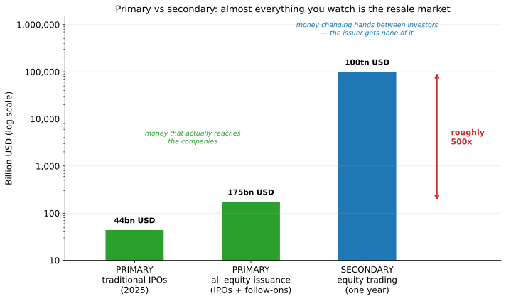
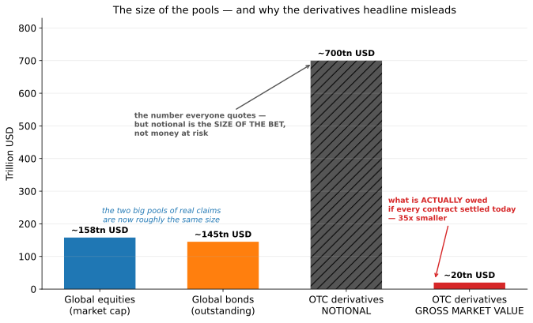
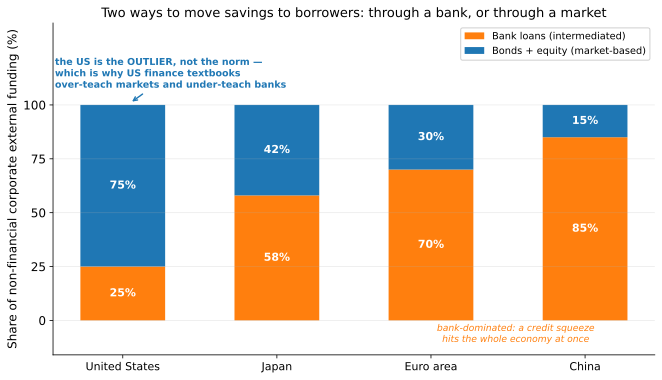
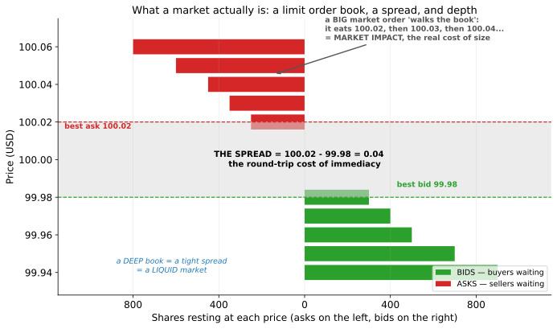

# E06 · §1 — What Financial Markets Are, Who's In Them, and What They're For

> **Subject:** Economy & Finance *(hobby track)*
> **Module:** E06 — Financial Markets & Instruments
> **Section:** the **opening section of E06** — and the start of the whole third act. Modules E02–E05 built the
> *macro* machinery: output and cycles, money and central banks, budgets and debt, trade and capital flows. All of
> that machinery moves **claims** around, and this module finally opens the box and asks what those claims
> actually *are*. We start with the market itself: the **five jobs** a financial market does for a real economy;
> the **primary/secondary distinction** that clears up more confusion than any other single idea in finance; the
> **instrument map** (debt, equity, and everything derived from them) with the **one equation** that prices all of
> them; **who is actually in the market** and why the bank-versus-market question decides how a whole economy
> transmits shocks; **how a trade physically happens** — order books, spreads, dealers, clearing houses; what
> **price discovery** and "efficiency" do and do not claim; and finally the puzzle of **Singapore, a giant global
> financial centre with a shrinking domestic stock market** *(local lens)*.
> **Status:** ✅ **FINALIZED 2026-09-11.** §10 Applied added — **why a country fights for a stock market nobody
> wants to list on**: the exchange-versus-board re-cut, the delisting wealth transfer worked end to end, a ranked
> argument audited item by item (one reason correctly demolished and rebuilt), and the foreign-access question
> that closes the diagnosis.
> Math in LaTeX, quantitative relationships drawn as real curves, key terms glossed in 中文 (大陆/台灣), per
> [`../../../agent-docs/authoring-conventions.md`](../../../agent-docs/authoring-conventions.md).

**Estimated study time:** 1.5–2 hours including reflection.
**Prerequisites:** E01 §3 (interest, present value, the time value of money — the engine of §3 below); E03 §1–§2
(money, banks, credit creation — §4's bank-versus-market contrast is the payoff); E05 §3 (capital flows sorted by
stickiness — this section is the *plumbing* those flows travel through). Helpful: E04 §2 (government bonds as an
instrument, from the issuer's side) and E02 §4 (the business cycle and financial amplification).

---

## Why this section exists (for *you*)

Because **from here on, the course changes register.** Everything so far was about *systems* — an economy, a
central bank, a balance of payments. From now on it is about *things you can actually hold*: a share, a bond, a
contract. This module is the bridge between the macro machinery you have and the two goals you set — **reading
financial reports** (E07–E08) and **understanding investing** (E09–E10). Neither is possible until you know what
the instruments are and where they trade.

It also fixes a specific, extremely common confusion — one that quietly corrupts a lot of reasoning about
markets: **the belief that when you buy shares, your money goes to the company.** It almost never does. Getting
the **primary/secondary** distinction straight in §2 will change how you read half of all financial news,
including most commentary about whether a rising stock market "helps the economy."

And there is a local puzzle worth having in mind from the start, which §7 closes on. Singapore is one of the
three or four most important financial centres on the planet — a giant in foreign exchange, asset management,
and wealth — and yet **its own stock exchange has been shrinking for a decade**, with delistings outrunning new
listings, to the point where the government committed billions of Singapore dollars to try to revive it. How can
both things be true at once? The answer requires nearly everything in this section, so hold the question.

> **One framing to carry through.** A financial market is not fundamentally a casino, and it is not
> fundamentally a wealth-creation machine. It is a **transfer technology**: it moves purchasing power *across
> people* (from savers to borrowers), *across time* (from today to a claim on tomorrow), and *across states of
> the world* (from those who want a risk to those who do not). Everything else — exchanges, tickers, spreads,
> derivatives — is engineering built on top of those three transfers. Whenever a market instrument confuses you,
> ask: **which transfer is this doing, and who is on the other side?**

---

## 1. What a market is *for* — the five jobs

Start from the real economy, not the ticker. Households save; firms and governments need to spend more than they
currently have. In E05 §2 you wrote that gap as an identity for a whole country. Inside a country the same gap
exists between *units*: **surplus units** (savers) and **deficit units** (borrowers). A financial system is
whatever moves resources from the first to the second. It does five distinguishable jobs.

| # | The job | What it means concretely | What breaks without it |
|---|---|---|---|
| 1 | **Channel savings into investment** | a retiree's savings end up financing a semiconductor fab | savings sit idle; only the already-rich can build anything |
| 2 | **Price discovery** | thousands of opinions aggregate into one number that says what a claim is worth | capital is allocated blind — no signal of where returns are |
| 3 | **Liquidity transformation** | savers want their money back any time; factories take 20 years to pay off | nobody funds anything long-term |
| 4 | **Risk transfer and pooling** | a farmer sells price risk; an insurer pools thousands of independent risks | risk stays with whoever cannot bear it |
| 5 | **Monitoring and discipline** | a falling share price or a rising borrowing cost punishes bad management | capital keeps flowing to value-destroying firms |

**Job 3 deserves special attention, because it is the one that quietly does the most work — and it is where
crises come from.** A saver wants to be able to withdraw tomorrow. A borrower needs the money for twenty years.
Some institution has to stand in the middle and promise both — that is *maturity transformation*, and it is
structurally fragile: the promise is only keepable as long as savers do not all ask at once. You saw the
international version of exactly this in E05 §3 (borrow short, invest long, and die of a rollover, not of
insolvency). It is the same mechanism domestically. **Liquidity is a promise that is true on average and false
in a panic.**

Job 5 is the one most people forget. Markets are not only a funding mechanism; they are a **governance**
mechanism. A publicly quoted price is a continuously updated verdict on management, visible to everyone
including the board. That is a real economic function, and it is precisely what a company gives up when it stays
private.

> **The honest counter-case.** Every one of these five jobs can be done badly, and a large financial sector is
> not automatically a productive one. A market can price-discover a bubble; it can pool risk in a way that
> *concentrates* it (2008); it can discipline management toward short-term earnings at the expense of long-term
> investment. Research on "too much finance" finds the growth benefit of financial deepening flattens and can
> reverse past a point. So the correct question is never "are markets good?" but **"is this particular market
> doing one of the five jobs, or extracting a fee for pretending to?"** Keep that test — you will use it in §6
> and again in E09.

---

## 2. Primary vs secondary — the distinction that clears up everything

This is the single highest-leverage idea in the section.

- A **primary market** transaction is one where a **new security is created and sold by its issuer**. Money
  flows *from the investor to the company or government*. Examples: an **IPO (initial public offering)**, a
  follow-on share issue, a corporate bond issue, a government bond auction.
- A **secondary market** transaction is an investor selling an **already-existing** security to another
  investor. Money flows *between investors*. **The issuer receives nothing and is not a party to the trade.**

When you buy 100 shares of a listed company on an exchange, the company gets **zero dollars**. You paid another
investor. The company's involvement ended at the moment it originally issued those shares, possibly decades ago.

<!-- FIGURE 1 -->

The scale gap is not a detail — it *is* the picture. In 2025 the United States saw roughly 200 traditional
initial public offerings raising on the order of **USD 44 billion**, and perhaps **USD 175 billion** across all
equity issuance including follow-on offerings. Secondary trading in US equities over the same year ran into the
**tens of trillions of dollars**. The market you read about every day is, to a first approximation, entirely the
**resale** market.

**So why does the secondary market matter at all, if no money reaches the issuer?** Because of a chain that runs
backwards:

> **A liquid secondary market lowers the cost of capital in the primary market.** No one will buy a 30-year bond
> or a share in a young company if they can never get out. The *option to sell* is worth money — so investors
> will pay more for an identical claim that trades on a deep market than for one that does not. Paying more for
> the claim *is* a lower cost of funding for the issuer. The secondary market's existence is what makes the
> primary market cheap.

This is the **liquidity premium**, and it is one of the most reliable empirical regularities in finance:
illiquid assets trade at a discount, which is the same statement as *illiquid issuers pay more*. It explains why
a government works hard to keep its bond market liquid, why a company wants an exchange listing at all, and — as
you will see in §7 — why a stock exchange losing liquidity is a genuine economic problem and not merely wounded
national pride.

Two refinements worth carrying:

- **Buybacks and secondary sales run the pipe in reverse.** When a company buys back its own shares, or pays a
  dividend, capital flows *out* of the corporate sector back to investors. In mature economies this often
  exceeds new issuance, so the *net* equity market is a returner of capital, not a supplier of it. That surprises
  people who imagine the stock market's main job is funding growth. Its main job today is **governance,
  liquidity, and price discovery** — funding is real but comparatively small.
- **"The market went up so the economy is fine" is a non-sequitur** — a secondary-market price move transfers
  wealth and updates a signal. It changes the real economy only through *channels*: cheaper future issuance, a
  wealth effect on consumption, and collateral values. Those channels are real but indirect, and the second one
  is concentrated among asset holders. You will meet this again in E09.

---

## 3. The instrument map — debt, equity, and everything derived from them

Almost every financial instrument is one of three things, or a package of them.

| | **Debt** | **Equity** | **Derivative** |
|---|---|---|---|
| **The claim** | a **fixed** promise: interest plus principal | a **residual** claim: whatever is left after everyone else is paid | a claim whose value is **derived** from something else |
| **Upside** | capped — you get your money back and no more | unlimited | depends on the contract |
| **Downside** | you lose if the borrower fails | you can lose everything, but no more (limited liability) | can exceed the amount you put in |
| **Control** | none, until you are not paid | voting rights; you are an **owner** | none |
| **In a bankruptcy** | **senior** — paid first | **last in line** — usually zero | depends on collateral and netting |
| **Studied in** | §3 of this module | §2 of this module | §4 of this module |

The bankruptcy ordering — the **capital structure** or "ladder of claims" — is what actually defines the
difference. Everything else follows from it. Debt is senior and fixed, so its return is *mostly* about whether
you get repaid; equity is junior and residual, so its return is about how well the business does. That is the
whole distinction, and E07's balance sheet is literally a picture of it.

<!-- FIGURE 2 -->

Two things to take from the scale picture.

**First, bonds are not the small market.** Non-specialists picture "the market" as the stock market. Globally,
equity market capitalisation (roughly USD 158 trillion in 2025) and fixed income outstanding (roughly USD 145
trillion) are now of comparable size — and the bond market matters *more* for the macroeconomy, because it is
where governments fund themselves (E04) and where the interest rates that price everything else are set (E03).

**Second, the derivatives number you have seen quoted is not what you think.** The headline figure — hundreds of
trillions of dollars of **OTC (over-the-counter) derivatives** — is **notional**: the size of the *bet*, the
reference amount used to compute payments. Almost nobody ever owes the notional. The **gross market value** —
what would actually change hands if every contract settled today — is roughly an order of magnitude and a half
smaller. Confusing the two produces most of the "derivatives are a quadrillion-dollar time bomb" genre. The real
risks in derivatives are **counterparty risk, leverage, and opacity**, none of which is measured by notional.

### The one equation underneath all of it

Every instrument in the table above is a claim on **future cash flows**. So every one of them is priced the same
way — by discounting those cash flows back to today at a rate that reflects their risk:

$$P_0 = \sum_{t=1}^{T} \frac{C_t}{(1 + r)^t}$$

where $P_0$ is the price today, $C_t$ the cash flow at time $t$, and $r$ the discount rate. That is the whole of
valuation. **A bond and a share differ only in what you put into the formula** — a bond's $C_t$ are contractual
and known, so the hard part is $r$ (credit and interest-rate risk); a share's $C_t$ are unknown and unbounded,
so the hard part is the cash flows themselves. E06 §2 and §3 are, in a real sense, just two long applications of
this one line.

The discount rate itself decomposes into a risk-free rate plus compensation for bearing risk:

$$r = r_f + \text{risk premium}$$

which is why **E03's policy rate moves the price of literally everything.** When a central bank raises $r_f$,
every discounted cash flow in the world gets smaller, and the longest-dated claims — growth stocks, 30-year
bonds, infrastructure — fall the most. That single sentence explains a remarkable share of financial news.

---

## 4. Who is actually in the market

The cast, sorted by what they are *for*:

**The principals — people whose money it is**

| Participant | What they want |
|---|---|
| **Households / retail investors** | save for retirement, buy a home, get a return above inflation |
| **Non-financial companies** | raise capital, park cash, hedge input and currency risk |
| **Governments** | fund deficits (E04), manage debt maturity |

**The institutions — people who manage other people's money**

| Participant | What they are |
|---|---|
| **Pension funds and insurers** | very long-horizon buyers with liabilities to match; the natural owners of long bonds |
| **Mutual funds and ETFs (exchange-traded funds)** | pooled vehicles that give a small saver diversification |
| **Sovereign wealth funds** | state-owned long-horizon investors — e.g. Singapore's GIC and Temasek |
| **Hedge funds** | loosely constrained, leverage-using, often the marginal price-setter |
| **Banks** | both intermediary and participant — see below |

**The plumbing — people who make trading possible**

| Participant | Function |
|---|---|
| **Brokers** | execute *your* order as your agent; they do not take the other side |
| **Dealers / market makers** | quote a two-sided price and take the other side from inventory — they *are* the liquidity |
| **Exchanges** | run the matching engine and set listing rules |
| **Clearing houses (CCPs — central counterparties)** | step between buyer and seller so neither bears the other's default risk |
| **Custodians** | actually hold the securities; the reason your broker's failure need not lose your assets |
| **Regulators** | disclosure, conduct, systemic stability — the **MAS (Monetary Authority of Singapore)** locally |

> **The distinction to keep: broker vs dealer.** A **broker** works *for* you and takes a commission. A
> **dealer** trades *against* you and earns the spread. Many firms are both, which is precisely why conflict-of-
> interest rules exist. When you place a retail order, ask which one is on the other side — the answer determines
> whose interest your execution serves.

### Bank-based vs market-based: the structural question

There are two ways to move savings to borrowers. Through a **bank** — savers deposit, the bank decides who
borrows, and the bank holds the risk on its own balance sheet (E03 §2). Or through a **market** — savers buy the
borrower's securities directly, and hold the risk themselves. Economies differ enormously in the mix.

<!-- FIGURE 3 -->

This is not a curiosity — it changes how the whole economy behaves:

- **Where banks dominate** (the euro area, Japan, China), a credit squeeze hits *everyone at once*, because
  there is only one pipe. Monetary policy transmits powerfully and fast through the banking channel. But bank
  relationships are long-lived, which cushions individual firms in a downturn — the classic argument for the
  German and Japanese models.
- **Where markets dominate** (the United States), a bank crisis is survivable because firms can issue bonds
  instead — the "spare tyre" argument. But risk sits with dispersed investors who can panic simultaneously, and
  pricing is more volatile.
- **The US is the outlier, not the norm.** Most finance textbooks are American and therefore over-teach markets
  and under-teach banks. Globally, bank credit is the dominant channel. Keep this in mind when you read
  US-centric commentary about "what companies do."

One more structural shift worth knowing before E09: the rise of **passive investing**. Index funds and ETFs
crossed the halfway mark of US equity fund assets around 2023–2025, so the *marginal owner* of a large listed
company is increasingly a fund that holds it for no reason other than its index membership. That has genuine
consequences for price discovery (§6) and for governance (job 5 in §1) — a passive holder cannot sell, so its
only lever is the vote.

---

## 5. How a trade actually happens

Under the abstraction is a very concrete mechanism. Nearly all modern exchange trading is a **continuous
double auction** run on a **limit order book**.

- A **limit order** says "buy at 99.98 or better" — it *rests* in the book, adding liquidity, and may never
  fill.
- A **market order** says "buy now at whatever the best available price is" — it *removes* liquidity and always
  fills, at a price you do not control.
- The book's best buy price is the **bid**; the best sell price is the **ask** (or offer). The gap between them
  is the **bid-ask spread**:

$$\text{spread} = P_{\text{ask}} - P_{\text{bid}}$$

<!-- FIGURE 4 -->

**The spread is the price of immediacy.** If you insist on trading *now*, you cross the spread and pay it. If
you are willing to wait, you post a limit order and may *earn* it. That is the entire business model of a market
maker: quote both sides, capture the spread thousands of times a day, and manage the inventory risk of being
caught holding a falling asset — the reason spreads *widen* exactly when you most want to trade.

**Depth matters as much as the spread.** A tight quote for 100 shares is useless if you need to sell 100,000; a
large order **walks the book**, eating successively worse prices. That extra cost is **market impact**, and for
institutional investors it usually dwarfs commissions. "Liquidity" concretely means: *tight spread, deep book,
and quick replenishment after a trade.*

**After the match, the boring part that actually keeps the system alive:**

1. **Execution** — the match happens in microseconds.
2. **Clearing** — a **CCP (central counterparty)** interposes itself via *novation*, becoming buyer to every
   seller and seller to every buyer, and nets everyone's obligations down. This is why one participant's failure
   does not cascade — and also why the CCP itself is now a systemically critical node.
3. **Settlement** — securities and cash actually change hands. The US, Canada and India settle equities one
   business day after the trade (**T+1**); much of Europe and Asia, including Singapore, remains at **T+2**.
4. **Custody** — the securities sit with a custodian in your name, which is what makes broker failure survivable.

> **Why the plumbing occasionally becomes the story.** The 2021 meme-stock episode's most-misunderstood moment —
> brokers restricting purchases — was a *clearing* event: with T+2 settlement, a CCP demanded far more collateral
> against volatile positions than the brokers had posted. The 2010 "flash crash" was a *microstructure* event:
> liquidity providers withdrew, the book emptied, and prices briefly traded at absurd levels with no change in
> fundamentals. Neither is explicable at the level of "supply and demand for shares." **When markets behave
> inexplicably for minutes or hours, the answer is usually in §5, not §6.**

---

## 6. Price discovery and efficiency — what the claim actually is

Job 2 in §1 was price discovery. The formal version is the **EMH (efficient market hypothesis)**, usually stated
in three strengths:

| Form | Claim | Roughly true? |
|---|---|---|
| **Weak** | prices already reflect all *past price* information | strongly supported — pure chart-based trading rules do not reliably work |
| **Semi-strong** | prices reflect all *public* information | broadly supported for large liquid stocks; documented anomalies exist |
| **Strong** | prices reflect *all* information, including private | false — which is why insider trading is both profitable and illegal |

The mechanical consequence of the semi-strong form is that price changes are close to **unpredictable**:

$$P_{t+1} = P_t + \varepsilon_{t+1}$$

Not because prices are random in some mystical sense, but because **anything predictable would already have been
traded away.** If everyone knew a stock would rise tomorrow, it would rise today.

**What the EMH does *not* claim,** and where most arguments about it go wrong:

- It does **not** claim prices are *correct*. It claims they reflect available information — and information can
  be wrong, incomplete, or about other people's beliefs. Bubbles are not a refutation of the EMH; they are a
  demonstration that "reflects information" and "equals fundamental value" are different statements.
- It does **not** claim markets are efficient *always and everywhere*. Efficiency is produced by competition
  among informed traders, so it is strongest exactly where that competition is fiercest: large stocks, major
  currencies, government bonds. A thinly traded small-cap is a far weaker claim (hold that thought for §7).
- It does **not** claim market participants are rational. It requires only that enough of them are, and that
  they can trade freely — which is why **limits to arbitrage** (short-selling costs, capital constraints, the
  risk of being right too early) are the serious modern critique.

> **The Grossman–Stiglitz paradox — the most useful idea here.** If prices already reflected all information,
> nobody would have any reason to pay for research; but if nobody researched, prices would reflect nothing. So a
> perfectly efficient market is **impossible**: markets are efficient *because* people try to beat them, and the
> profits of the winners are the wage that keeps them trying. Efficiency is not a property of the world — it is
> an **equilibrium in the effort to exploit inefficiency.** This resolves the tension you may feel between "the
> index usually wins" and "somebody has to set the price."

The practical implication, which E09 will develop: for a retail investor in large liquid markets, the base case
is that **you will not systematically beat the price**, and the sensible response is diversification and low
costs. But this is a claim about *your* comparative advantage, not a metaphysical claim that markets are always
right — and it holds much more weakly in illiquid corners where few analysts look.

---

## 7. Singapore — a giant financial centre with a shrinking stock market *(local lens)*

Now the puzzle from the opening. Singapore is, by most measures, a top-tier global financial hub: one of the
largest **FX (foreign exchange)** trading centres in the world, a dominant Asian base for asset and wealth
management, a major bond-arranging and treasury centre, and home to two of the world's most significant
long-horizon investors. And yet the **SGX (Singapore Exchange)** equity market has spent a decade shrinking:
**delistings have persistently outnumbered new listings**, turnover in small- and mid-caps is thin, and
respected local companies have chosen to list elsewhere or go private.

**How can both be true?** Because being a financial *centre* and being a listing *venue* are different
businesses:

1. **Hub functions do not require a domestic exchange.** FX, wealth management, fund domiciliation, treasury and
   cross-border lending all use Singapore's institutions, law, tax treatment and time zone — none of them need
   an SGX listing.
2. **Listings follow the investor pool, not the head office.** A company lists where the deepest pool of buyers
   for *its kind of business* sits. For technology that has meant the United States; for consumer-facing
   Chinese firms, Hong Kong. Singapore's domestic pool is small relative to those, and its listed market skews
   toward banks, **REITs (real estate investment trusts)** and industrials rather than growth technology.
3. **Illiquidity is self-reinforcing — the §2 mechanism running in reverse.** Thin trading means a wide spread
   and high market impact (§5), which means institutions cannot build or exit a position at reasonable cost, so
   they stay away, which makes trading thinner still. Low liquidity depresses valuations, low valuations invite
   privatisation at a premium, delisting removes yet more liquidity. **This is a liquidity trap in the
   microstructure sense**, and it is precisely why the problem does not fix itself.
4. **Efficiency is weakest exactly here (§6).** A market with few analysts and little trading is where the
   semi-strong claim holds most weakly — which is simultaneously the *problem* (poor price discovery, no
   discipline on management) and the *opportunity* argued by local value investors.

The policy response is unusually direct and worth watching as a live experiment. Under the **EQDP (Equity Market
Development Programme)**, announced in February 2025 on the Equities Market Review Group's recommendations, the
MAS committed **SGD 5 billion** — expanded to **SGD 6.5 billion** at Budget 2026 — placed with appointed fund
managers under a mandate to invest predominantly in Singapore-listed equities **with an explicit tilt to small-
and mid-caps**, alongside tax measures for new listings. Nearly SGD 4 billion had been allocated across nine
managers by early 2026.

> **Read it through this section's own framework, and the design is coherent:** the government is not trying to
> "make the index go up." It is trying to break the self-reinforcing loop in point 3 by *buying liquidity* where
> it is scarcest — because liquidity in the **secondary** market is what lowers the cost of capital in the
> **primary** market (§2), and a functioning listing venue is what delivers price discovery and governance (§1,
> jobs 2 and 5) for domestic firms. **Whether public money can bootstrap private liquidity is a genuinely open
> question** — the honest sceptical case is that subsidised demand raises prices without creating the underlying
> pool of natural buyers and analysts, and stops working when the money stops. The test to watch is not the
> index level; it is **spreads, turnover, analyst coverage, and the listings-versus-delistings balance** three
> years out.

---

## 8. The one-page mental model

```mermaid
flowchart TD
    JOBS["WHAT A MARKET IS FOR (§1)<br/>five jobs: channel savings to investment · PRICE DISCOVERY ·<br/>LIQUIDITY transformation (the fragile one) · risk transfer · monitoring &amp; discipline<br/>it is a TRANSFER technology: across people, across time, across states of the world"]
    PRIM["PRIMARY vs SECONDARY (§2)<br/>PRIMARY = new security, money reaches the ISSUER (IPO, bond issue, auction)<br/>SECONDARY = investors trade existing claims — THE ISSUER GETS NOTHING<br/>secondary is ~500x bigger — and it MATTERS because liquidity in the secondary market<br/>LOWERS THE COST OF CAPITAL in the primary market (the liquidity premium)"]
    MAP["THE INSTRUMENT MAP (§3)<br/>DEBT = fixed, senior, capped upside · EQUITY = residual, junior, unlimited ·<br/>DERIVATIVE = value derived from something else (NOTIONAL is not money at risk)<br/>ONE EQUATION prices all of them: discount future cash flows at a risk-adjusted rate<br/>⇒ the policy rate moves the price of EVERYTHING (E03)"]
    WHO["WHO IS IN IT (§4)<br/>principals (households · firms · governments) · institutions (pensions · funds · hedge funds)<br/>· plumbing (BROKER works for you / DEALER trades against you · exchange · CCP · custodian)<br/>BANK-BASED vs MARKET-BASED decides how shocks transmit — the US is the OUTLIER"]
    MICRO["HOW A TRADE HAPPENS (§5)<br/>limit order book: LIMIT orders rest and supply liquidity, MARKET orders consume it<br/>SPREAD = the price of immediacy · DEPTH decides market impact on size<br/>then CLEARING (CCP novation) and SETTLEMENT (T+1 / T+2) — the plumbing that<br/>becomes the story in a flash crash or a margin-call episode"]
    EFF["PRICE DISCOVERY &amp; EFFICIENCY (§6)<br/>weak / semi-strong / strong — prices reflect information, which is NOT the same<br/>as being right; efficiency is strongest where competition is fiercest<br/>GROSSMAN-STIGLITZ: a perfectly efficient market is impossible — markets are efficient<br/>BECAUSE people try to beat them"]
    SG["SINGAPORE — THE PUZZLE (§7)<br/>a top-tier financial CENTRE with a shrinking LISTING venue: hub functions need no exchange,<br/>listings follow the investor pool, and ILLIQUIDITY IS SELF-REINFORCING (§2 in reverse)<br/>the EQDP buys liquidity where it is scarcest — watch spreads and coverage, not the index"]
    NEXT["→ Next E06 §2 — STOCKS (EQUITY):<br/>what a share legally is, ownership, dividends, and how to value a residual claim"]
    JOBS --> PRIM
    PRIM --> MAP
    MAP --> WHO
    WHO --> MICRO
    MICRO --> EFF
    EFF --> SG
    SG --> NEXT
```

<!-- DIAGRAM:START -->

Diagram source (Mermaid)

<!-- DIAGRAM:END -->

**The eight things to remember:**
1. **A market is a transfer technology** — across people, across time, across states of the world. Five jobs:
   channel savings, discover prices, transform liquidity, transfer risk, discipline management.
2. **Liquidity transformation is the fragile job.** Promising savers instant access while funding twenty-year
   assets is a promise that is true on average and false in a panic — the domestic twin of E05 §3's rollover
   risk.
3. **Primary creates, secondary resells.** When you buy a listed share, the company receives nothing. Nearly all
   visible market activity is the resale market.
4. **But the resale market is what makes the primary market cheap.** Liquidity is worth money, so investors pay
   more for tradeable claims — which *is* a lower cost of capital for the issuer. This one chain explains stock
   exchanges, government bond-market management, and Singapore's EQDP.
5. **Three instrument types, one equation.** Debt is a fixed senior claim, equity a residual junior one, a
   derivative a claim on something else — and all of them are the discounted value of future cash flows, which
   is why the policy rate prices everything.
6. **Know who is on the other side.** A broker acts for you; a dealer trades against you and earns the spread.
   And whether an economy is bank-based or market-based determines how a shock propagates through it.
7. **A market is concretely an order book.** The spread is the price of immediacy, depth is the price of size,
   and clearing and settlement are the invisible plumbing that turns into the headline when something breaks.
8. **Efficiency is an equilibrium, not a property.** Prices reflect information — not truth. Markets are
   efficient *because* people try to beat them (Grossman–Stiglitz), and least efficient exactly where nobody is
   looking, which is both the flaw and the opportunity in a thin market like SGX's small-caps.

---

## 9. Check your understanding

Reason first; check against a source where noted.

1. **The five jobs.** Name them, then pick any recent financial-news story and identify which job (or which
   failure of a job) it is actually about.
2. **Where the money goes.** You buy USD 10,000 of a listed company's shares on an exchange. Trace exactly who
   receives your money. Now explain, in two sentences, why the company nonetheless cares deeply about its share
   price.
3. **The liquidity chain.** State precisely why a *more liquid secondary market* results in a *lower cost of
   capital* in the primary market. Which step in that chain would break first if trading dried up?
4. **The ladder of claims.** A company goes bankrupt with assets worth less than its debts. What do bondholders
   get, what do shareholders get, and why does that ordering explain the entire difference in risk and return
   between the two instruments?
5. **Notional versus value.** A newspaper reports "over USD 700 trillion of derivatives outstanding." Explain
   why that number is not the amount of money at risk, and name the three risks that *are* worth worrying about.
6. **One equation, two instruments.** Using the discounted-cash-flow formula, explain why a rise in interest
   rates hurts a 30-year bond and a fast-growing technology stock through the *same* mechanism — and why it hurts
   them more than it hurts a mature dividend-paying utility.
7. **Broker or dealer?** You place a retail market order and it fills instantly at a price slightly worse than
   the quote you saw. Explain what happened, in the vocabulary of §5, and say who earned what.
8. **Bank-based or market-based.** A central bank raises rates sharply. Describe how the shock reaches companies
   in (a) the euro area and (b) the United States, and say which economy's firms are more exposed to a *banking*
   crisis specifically.
9. **The efficiency claim.** State the semi-strong EMH precisely. Then explain the Grossman–Stiglitz paradox and
   what it implies about whether you should expect to beat the market — and where the exception lies.
10. **The Singapore puzzle.** Explain how Singapore can be a leading global financial centre while its stock
    exchange shrinks. Then evaluate the EQDP: what mechanism is it trying to break, and what evidence three
    years from now would tell you it worked?

> **Optional — take apart a market yourself (15–20 min).** Pick any listed company you know and assemble its
> market profile from public data: (a) its **market capitalisation** and **average daily traded value**; (b) the
> current **bid-ask spread** as a fraction of price; (c) whether it has issued *new* shares or bonds in the last
> three years (primary) or only traded (secondary); (d) how many sell-side analysts cover it. Then judge how
> efficiently it is likely to be priced, and how much it would cost you to sell a position worth ten days'
> average volume. Compare an SGX small-cap with a US mega-cap — the contrast is the whole section in one
> exercise. Bring it to the session.

---

## 10. Applied — why a country fights for a stock market nobody wants to list on

You read §7, accepted the diagnosis, and immediately inverted the question: *"I can understand why companies do
not want to list there. **Why does Singapore still want to keep it?**"* That is the right next question — §7
explained the decay but never justified the defence — and the session that followed took a shape none of the
previous ones did: **you audited a ranked argument item by item**, agreeing with three points, demanding the
mechanism behind one, and attacking one with a counter-example. The attack landed. What follows is the exchange,
including the part where you were right and I revised.

### 10a — The question had to be re-cut before it could be answered

"Why keep the exchange?" contains a hidden assumption: that the exchange is failing. It isn't. SGX's FY2025 net
revenue was a record **SGD 1.30 billion, up 11.7%**, with record profit — and the segment mix is the reason:

| Segment | Share of SGX net revenue, FY2025 |
|---|---|
| Cash equities | 30.3% |
| Derivatives | 26.6% |
| Currencies & commodities | 24.0% |
| Platform & others | 18.3% |

**Roughly 70% of SGX's revenue has nothing to do with Singaporeans buying Singaporean shares.** Its derivatives
franchise (China A50, Japan, iron ore) and its FX business serve the region, not the domestic board. So the
commercial entity is healthy; what is shrinking is one segment of it. **The real question is narrower and
harder: why fight for the *domestic listing board* specifically?** Five answers, deliberately ranked — which is
what made them auditable:

| # | The reason | Weight |
|---|---|---|
| 1 | **The tier that can't list anywhere else** — a large multinational lists in New York; a SGD 300m Singaporean industrial cannot (no coverage, no natural buyers, ruinous compliance). Remove the local board and that tier has only bank debt and private equity — pushing the corporate sector toward **pure bank-based finance** (§4), the structure where a credit squeeze hits every firm at once with no spare tyre | **Strongest** |
| 2 | **Every delisting is a wealth transfer** from minority holders to insiders — see 10b | **Strong** |
| 3 | **A domestic savings channel** — originally argued as a macroprudential valve against property | **Failed — see 10c** |
| 4 | **Agglomeration in people** — analysts, brokers and research houses are sustained partly by domestic listing flow, and that population feeds the asset-management industry Singapore genuinely dominates | Moderate |
| 5 | **Strategic optionality** — owning your own clearing, depository and benchmarks matters more in a fragmenting world (E05 §3), and a politically neutral venue is an asset Hong Kong can no longer offer | Moderate |

You returned: **1 agreed · 2 needs the mechanism · 3 challenged · 4 and 5 agreed.**

### 10b — The delisting transfer, worked

A family controls 65% of a listed industrial. The shares trade at **SGD 1.00**; on a sober valuation — net asset
value, or what a trade buyer would pay — the business is worth about **SGD 1.60**. The gap exists because of
§7's loop: no coverage, no institutional buyers, a wide spread, so the quoted price reflects whoever the
*marginal* buyer happens to be rather than fundamental value. **This is §6's claim in its sharpest form —
efficiency is weakest exactly where nobody is looking.**

The controller offers **SGD 1.25** and takes it private. That is simultaneously:

- a **25% premium to market** — the headline reads "generous exit offer"; and
- a **22% discount to value** — the insider captures roughly SGD 0.35 per share on the 35% being bought.

Three asymmetries make it work:

1. **Information.** The controller knows the order pipeline, the revaluation potential of the properties on the
   books, the succession plan. The minority has an annual report and no analyst. **The party with the
   information is setting the price and standing on the buy side.**
2. **Coercion built into the structure.** Vote no and lose anyway, and you hold an **unquoted stub** — no exit,
   no price, and a controller who now owns nearly everything. At 90% acceptances compulsory acquisition sweeps
   up the rest. "Accept a bad offer" versus "hold something you can never sell" is not a real choice.
3. **The ratchet.** Delisting is one-way. Restoring that company to the public pool requires a full IPO, far
   more expensive than the delisting was. **The shrinkage never self-reverses; it only accumulates** — which is
   why a regulator acts rather than waiting for the cycle to turn.

Then the second-order effect, which is the nastiest part: once investors *learn* that cheap valuations invite
privatisation at the bottom, they rationally discount any thinly-traded SGX small-cap further, because being
bought out at a trough is now a known hazard of holding it. **That deepens the discount, which makes the next
privatisation more attractive — a second self-reinforcing loop stacked on §7's liquidity loop.**

SGX did respond. The **July 2019** rewrite of the voluntary delisting regime requires the exit offer to be
judged **both fair *and* reasonable** by an independent financial adviser (previously only "reasonable" — a
markedly lower bar), sets approval at **75% of independent shareholders**, and **forces the offeror and its
concert parties to abstain**. Genuine improvements. But note precisely what they do: **they police the price of
an exit; they do not remove the reason exits are attractive.** The regulation treats the symptom, the EQDP
targets the cause — which is the coherent reading of why Singapore does both.

### 10c — Where you were right, and the argument had to be rebuilt

My third reason claimed a domestic equity market is a **macroprudential valve**: without one, household savings
pile into property, which is the concentration Singapore has spent two decades of cooling measures fighting.

Your counter was one sentence: **"But local residents can easily invest in other markets, like US stock,
right?"**

**Correct, and it breaks the argument as stated.** Singapore has no capital controls, brokerage access to US
equities is cheap and ubiquitous, and Singaporeans use it heavily. **The realistic substitute for SGX is not a
condominium; it is the S&P 500.** The framing was wrong and the reason drops from third place to last. What
survives is narrower:

- **CPF is a genuinely captive pool — this is the part your counter-example does not reach.** Under the CPF
  Investment Scheme you may invest up to **35% of investible Ordinary Account savings in shares, SGX Mainboard
  only**. Foreign stocks are **not eligible at any allocation**. So a large, structurally domestic pool of
  retirement savings has equity options that exist only if the local board exists and is worth buying.
- **Currency matching.** MAS runs the SGD on a gradual appreciation path (E03 §4). Someone who saved a lifetime
  in USD assets but retires *spending* SGD has fought a structural headwind in their own consumption currency.
  Holding some SGD-denominated real assets is genuine liability matching — and much of why S-REITs are so
  heavily held locally.
- **The national version — real, but weak, and I said so rather than dressing it up.** Singapore's gross savings
  run near **40% of GDP** and its current-account surplus near **17% of GDP**. In MAS's own words the current
  account *is* the gap between national saving and domestic investment, so a large share of Singapore's savings
  is invested abroad by construction — **E05 §2's CA = S − I read straight off the national accounts.** A
  domestic equity market is one channel that could recycle some of it into domestic firms. But **for a small
  economy, exporting savings is rational**: there are not 40%-of-GDP worth of good domestic investments, and GIC
  exists precisely to do this well. "Recycle savings at home" is not self-evidently a goal.

> **The transferable lesson is about argument structure, not Singapore.** A ranked list invites exactly the
> attack you made: find the weakest item and test it with a counter-example. Reason 3 was the one that had been
> asserted rather than checked, and it was the one that fell. **Note what did *not* happen — the conclusion did
> not collapse.** Reasons 1, 2, 4 and 5 stand on independent mechanisms, so removing 3 lowered the total weight
> without changing the direction. That is the difference between a **cumulative** argument and a **chain**: a
> chain is only as strong as its weakest link, a cumulative case survives losing one. When you audit an argument,
> the diagnostic question is which kind you are holding.

### 10d — And the access question closes the diagnosis

You then asked whether foreigners face any limit on investing in SGX. **Essentially none**, and the detail
matters more than it first appears:

- **No quota regime** — nothing resembling China's QFII or Stock Connect, or India's FPI registration. Open an
  account and buy.
- **No capital gains tax** — Singapore does not levy one on anyone.
- **No dividend withholding tax** — under the one-tier corporate system dividends are tax-exempt in the
  shareholder's hands, resident or not.
- **No stamp duty** on scripless listed share transfers.
- The exceptions are sector-specific and apply to **everyone, not only foreigners**: MAS approval to cross 5%,
  12% and 20% controller thresholds in a local **bank**; licensing conditions in **media and telecom**; and the
  **SIRA (Significant Investments Review Act, 2024)** national-security screen — nine entities designated
  initially, with notification at 5% and approval at 12%, 25% and 50%, plus a broad ministerial call-in power,
  explicitly covering domestic and foreign investors alike.

> **Why this is the diagnostic closer.** If access were restricted, the thinness would have an obvious and
> boring cause. It is not restricted — foreign capital enters freely and pays no tax on the way out. **So the
> explanation must be one of the two named in §7: the self-reinforcing liquidity loop, or what is actually
> listed.** Policy can plausibly break the first and cannot manufacture the second. That is precisely why my
> forecast on the EQDP is *partial* success — measurably tighter spreads and better coverage in mid-caps, and no
> revival of a technology listing pipeline. **Openness is a policy asset here, exactly as in E05 §3's Singapore
> case — and it is also the reason the EQDP has to buy liquidity rather than protect it.**

## Key terms — English · 中文（中国大陆 / 台灣）

Reading market news across both scripts. Most differences are **simplified vs traditional**; **⚠ marks a genuine
terminology difference** you'd trip over — and this section has an unusual number of them, because market
vocabulary was translated separately on each side.

**The markets**

| English | 中国大陆 (简体) | 台灣 (繁體) | Note |
|---|---|---|---|
| Financial market | 金融市场 | 金融市場 | ⚠ **场 ↔ 場** |
| Primary market | **一级市场** | **初級市場** | ⚠⚠ **genuinely different words** — new issues |
| Secondary market | **二级市场** | **次級市場** | ⚠⚠ **genuinely different words** — resale |
| Initial public offering (IPO) | 首次公开发行／上市 | 首次公開發行／掛牌上市 | ⚠ **发行 ↔ 發行** |
| Exchange | 交易所 | 交易所 | same |
| Over-the-counter (OTC) | 场外交易 | 店頭市場／櫃檯買賣 | ⚠⚠ **场外 ↔ 店頭/櫃檯** |

**The instruments**

| English | 中国大陆 (简体) | 台灣 (繁體) | Note |
|---|---|---|---|
| Security | 证券 | 證券 | ⚠ **证 ↔ 證** |
| Share / stock | 股票 | 股票 | same; **equity** = 股权 ↔ 股權 |
| Bond | 债券 | 債券 | ⚠ **债 ↔ 債** |
| Derivative | **衍生品／衍生工具** | **衍生性金融商品** | ⚠⚠ the TW term is much longer |
| Exchange-traded fund (ETF) | 交易所交易基金 | **指數股票型基金** | ⚠⚠ both usually just say **ETF** |
| Index fund | 指数基金 | 指數型基金 | ⚠ **指数 ↔ 指數** |

**The plumbing**

| English | 中国大陆 (简体) | 台灣 (繁體) | Note |
|---|---|---|---|
| Broker | 经纪商／券商 | 券商／經紀商 | ⚠ **经纪 ↔ 經紀**; acts *for* you |
| Market maker | **做市商** | **造市者／造市商** | ⚠⚠ **做市 ↔ 造市**; trades *against* you |
| Bid-ask spread | 买卖价差 | 買賣價差 | ⚠ **买卖 ↔ 買賣, 价 ↔ 價** |
| Liquidity | 流动性 | 流動性 | ⚠ **动 ↔ 動** |
| Limit order | 限价单／限价委托 | 限價委託單 | ⚠ **价 ↔ 價** |
| Clearing / settlement | 清算／结算 | 結算／交割 | ⚠⚠ **结算 ↔ 交割** for settlement |
| Custodian | 托管人／托管银行 | 保管銀行 | ⚠⚠ **托管 ↔ 保管** |
| Institutional investor | 机构投资者 | **法人** | ⚠⚠ TW market talk says **法人**（三大法人） |
| Retail investor | 散户 | 散戶／自然人 | ⚠ **户 ↔ 戶** |

**The ideas**

| English | 中国大陆 (简体) | 台灣 (繁體) | Note |
|---|---|---|---|
| Efficient market hypothesis | 有效市场假说 | 效率市場假說 | ⚠⚠ **有效 ↔ 效率, 假说 ↔ 假說** |
| Price discovery | 价格发现 | 價格發現 | ⚠ **发现 ↔ 發現** |
| Market capitalisation | 市值 | 市值 | same |
| Underwriter | 承销商 | 承銷商 | ⚠ **销 ↔ 銷** |
| Delisting | 退市 | **下市** | ⚠⚠ **退市 ↔ 下市** — central to §7 |

> Recurring genuine splits to memorize: **一级/二级市场 ↔ 初級/次級市場**, **做市商 ↔ 造市者**, **衍生品 ↔
> 衍生性金融商品**, **场外交易 ↔ 店頭市場**, **机构投资者 ↔ 法人**, **退市 ↔ 下市**, **有效市场假说 ↔
> 效率市場假說**.

---

## References (optional, for depth)

- **The market-size numbers used in the figures:** the [SIFMA Capital Markets Fact Book](https://www.sifma.org/research/statistics/fact-book)
  (US and global equity and fixed-income statistics) and the
  [World Federation of Exchanges statistics portal](https://www.world-exchanges.org/our-work/statistics) for
  exchange-level listing and turnover data.
- **Derivatives, notional versus market value:** the [BIS OTC derivatives statistics](https://www.bis.org/statistics/derstats.htm)
  — the primary source, and the one that makes the notional-versus-gross-market-value distinction explicit.
- **Market efficiency, in the originals:** Eugene Fama's [Nobel lecture](https://www.nobelprize.org/prizes/economic-sciences/2013/fama/lecture/)
  (the cleanest short statement of the hypothesis and its evidence), and Grossman & Stiglitz,
  ["On the Impossibility of Informationally Efficient Markets"](https://www.jstor.org/stable/1805228) (*American
  Economic Review*, 1980) — the paradox in §6.
- **A readable book-length treatment:** Burton Malkiel, [*A Random Walk Down Wall Street*](https://wwnorton.com/books/9781324035435)
  — the standard popular case for the efficiency view and index investing, and a good companion to E09.
- **Market microstructure:** the [US SEC's investor primer on order types and execution](https://www.investor.gov/introduction-investing/investing-basics/how-stock-markets-work)
  for the mechanics, and the [SEC/CFTC report on the 2010 flash crash](https://www.sec.gov/news/studies/2010/marketevents-report.pdf)
  for what happens when the book empties.
- **The Singapore lens:** the [MAS media release on the expansion of the Equity Market Development Programme](https://www.mas.gov.sg/news/media-releases/2026/mas-announces-expansion-of-equity-market-development-programme)
  and [SGX's own market statistics](https://www.sgx.com/research-education/market-statistics) for turnover,
  listings and delistings.
- **Live data:** [Singapore Exchange](https://www.sgx.com), and the [MAS statistics room](https://www.mas.gov.sg/statistics)
  for Singapore's financial-sector and capital-market data.

---

### What's next
✅ **FINALIZED 2026-09-11.** This section opens **E06 — Financial Markets & Instruments**, the bridge from macro
machinery to the instruments themselves. You now have the **five jobs** a market does, the
**primary/secondary** distinction and the liquidity chain that connects them, the **instrument map** and the
single discounting equation that prices all three types, the **cast of participants** and the bank-versus-market
structural question, the **order-book mechanics** of an actual trade, what **efficiency** does and does not
claim, and **Singapore's centre-versus-venue puzzle** as a live policy experiment. Next, **E06 §2 — Stocks
(equity)** takes the residual claim apart: what a share legally is, how ownership, voting and dividends work,
and how you value something whose cash flows nobody knows. **§10 Applied** inverts §7's puzzle — *why does
Singapore keep a market nobody wants to list on?* — re-cutting the exchange from the board, working the
delisting wealth transfer end to end, and testing a ranked five-reason argument item by item until one of the
five had to be discarded and rebuilt.
