# E06 · §2 — Stocks (Equity): What a Share Actually Is

> **Subject:** Economy & Finance *(hobby track)*
> **Module:** E06 — Financial Markets & Instruments
> **Section:** the **second section of E06**. §1 built the market — its five jobs, the primary/secondary split,
> the order book, and the single discounting equation that prices every instrument. Now we take the first
> instrument apart. A share is the **residual claim**: junior to everything, unlimited on the upside, and the
> hardest thing in finance to value precisely because nobody knows its cash flows. We establish **what a share
> legally is** (a bundle of rights against a separate legal person — not a slice of the factory); why **the
> denominator moves** and what dilution really costs you; the **three channels** through which a shareholder
> actually gets paid, and Miller–Modigliani's uncomfortable claim that the split between them shouldn't matter;
> how to **value a residual claim** with the dividend discount model, why it detonates as growth approaches the
> discount rate, and why a P/E ratio is a *compressed* discounted cash flow rather than a price tag; **where a
> stock's value sits in time** (equity duration — the payoff to §1's claim that the policy rate prices
> everything); **risk and return**, diversification as the only free lunch, and what the market will and will
> not pay you to bear; **share classes and the control fight** (dual-class structures, and the VIE arrangement
> where you own a contract rather than a company); and **S-REITs**, Singapore's distinctive and genuinely
> world-class equity class *(local lens)*.
> **Status:** ✅ **FINALIZED 2026-09-17.** §10 Applied added — **your own portfolio, and the denominators nobody
> names**: what a Singapore tax resident actually pays (and where the invisible tax is levied), why dividend
> capture cannot work *because* Singapore removed the tax wedge, the price-return-versus-total-return gap that
> made the STI look flat while it nearly doubled, what "sticky" is sticky *in*, and how to read a bare multiple.
> Math in LaTeX, quantitative relationships drawn as real curves, key terms glossed in 中文 (大陆/台灣), per
> [`../../../agent-docs/authoring-conventions.md`](../../../agent-docs/authoring-conventions.md).

**Estimated study time:** 1.5–2 hours including reflection.
**Prerequisites:** E06 §1 — **all of it**, and especially §3 (the discounted-cash-flow equation and the ladder of
claims) and §6 (efficiency, and where it is weakest); §1 §10 (the delisting transfer — §6 below is its
governance twin). E01 §3 (present value, compounding). Helpful: E04 §2 (the same discounting logic applied to a
government), and E03 §3 (what moves the discount rate in the first place).

---

## Why this section exists (for *you*)

Because **the share is the instrument you will actually own**, and because almost every confident statement you
will hear about stocks is a statement about one of four things: what a share legally *is*, how many of them
there are, how the cash gets to you, or what the right price is. Getting those four straight is most of the
work, and it makes E07 (reading the statements) and E09 (investing) tractable rather than mystifying.

It is also where the abstraction from §1 pays a concrete dividend. §1 claimed that **every instrument is the
discounted value of its future cash flows**, and that this is why the policy rate prices everything. A share is
the hardest case of that claim — the cash flows are unknown, unbounded, and stretch to infinity — and working
through it explains several things that otherwise look like market irrationality: why a one-point revision to a
growth forecast can halve a company's value, why "expensive" technology stocks fall hardest when rates rise,
and why two companies with identical profits can trade at wildly different prices without either being wrong.

> **One framing to carry through.** A share is not a claim on a company's *assets* — you cannot walk into the
> factory and take a machine. It is a claim on **what is left over**, forever, after everyone else with a
> contract has been paid. Every distinctive property of equity follows from that single sentence: the unlimited
> upside (there is no cap on "what is left over"), the total wipeout in bankruptcy (there is often nothing left
> over), the voting rights (nobody else has an incentive to watch the residual), and the valuation difficulty
> (you are forecasting a remainder, which is the noisiest thing to forecast). **When a share confuses you,
> return to: a claim on the remainder, in perpetuity.**

---

## 1. What a share legally is

<b>Vocabulary for this section</b> — every term used below, including ones defined earlier (click to expand)

**Terms**

| Term | Definition |
|---|---|
| **Share (stock)** | a unit of ownership in a company — legally, a bundle of rights, not a slice of its property |
| **Shareholder** | the holder of those rights |
| **Equity** | the collective name for shares; also, in accounting, what is left of a company after its debts |
| **Legal person** | an entity that can own property, sign contracts and be sued in its own name; a company is one, which is why *it* owns its assets and you do not |
| **Residual claim** | a claim on whatever is left after everyone with a contract has been paid |
| **Residual assets** | the leftovers in a liquidation, distributed to shareholders — usually nothing |
| **Liquidation** | selling everything a failed company owns and paying claimants in order of seniority |
| **Creditor** | anyone the company owes money to; paid before shareholders |
| **Seniority** | position in the queue to be paid |
| **Limited liability** | the rule that the most a shareholder can lose is what they paid; company creditors cannot pursue their personal assets |
| **Perpetual existence** | a company has no expiry date, so its cash flows are modelled as running forever — the structural difference from a bond |
| **Transferability** | the right to sell your shares to someone else without the company's permission |
| **Separation of ownership from control** | shareholders own the company; directors and managers run it |
| **Agency problem** | the conflict that arises when the people running something are not the people whose money it is |
| **Board of directors** | the body elected by shareholders to supervise management |
| **Disclosure** | the audited accounts and continuous announcements a listed company must publish |
| **Voting right** | the right to vote on directors and major decisions, normally one vote per share |
| **Dividend** | a cash distribution from the company to shareholders |
| **Corporate governance** | the whole system of accountability between owners, boards and managers |

A company is a **separate legal person**. It owns its own assets, signs its own contracts, and can be sued in
its own name. A shareholder does not own the company's assets; a shareholder owns a **share of the company** —
and what that share confers is a **bundle of rights**, not a slice of property:

**Table 1** — the four rights a share actually confers, and where each one bites.

| Right | What it means | Where it bites |
|---|---|---|
| **Residual cash flow** | a claim on distributions the board chooses to make — dividends and buybacks | §3 |
| **Vote** | elect directors, approve major transactions, sometimes vote on pay | §6 |
| **Information** | audited accounts and continuous disclosure — the legal basis of E07 | E07 |
| **Residual assets** | in a liquidation, whatever remains after **every** creditor is paid | usually zero |

Four structural features make this work, and each is a genuine social invention rather than a natural fact:

1. **Limited liability.** The most you can lose is what you paid. Creditors of the company cannot pursue your
   house. This is *not* obvious — historically, partners were liable for everything — and it is what makes
   dispersed public ownership possible at all. Nobody would buy shares in a company run by strangers if a
   failure could bankrupt them personally.
2. **Perpetual existence.** The company outlives its shareholders and its founders. Its cash flows therefore
   run to infinity, which is why §4's valuation formulas sum to infinity rather than to a maturity date. **This
   is the cleanest structural difference from a bond**, which has a stated end.
3. **Transferability.** Your rights can be sold to someone else without the company's permission and without
   disturbing its operations — the property that makes §1's secondary market possible.
4. **Separation of ownership from control.** Shareholders own; directors and managers control. This is the
   source of the efficiency (professional management, no need for owners to be competent operators) and of the
   central problem of corporate governance — the **agency problem**, where the people running the company are
   not the people whose money it is.

> **What a share is *not*.** It is not a deposit (nobody promises to return it), not a claim on assets (those
> belong to the company), not a loan (there is no repayment date and no obligation to pay you anything at all),
> and not a right to be treated well by management (only to elect them, and to sue in narrow circumstances). The
> single most common confusion is expecting bond-like protections from an instrument whose whole economic
> character is the absence of them.

---

## 2. A share is a fraction — and the denominator moves

<b>Vocabulary for this section</b> — terms, abbreviations and the symbols in the two formulas (click to expand)

**Abbreviations**

| Short | Stands for | Meaning |
|---|---|---|
| **EPS** | earnings per share | profit divided by the number of shares — the per-share view of profit |
| **SBC** | stock-based compensation | paying employees in shares rather than cash |
| **USD** | US dollar | |

**Symbols used in the formulas**

| Symbol | Reads as | Meaning |
|---|---|---|
| $P$ | | the price of one share |
| $N$ | | the number of shares outstanding |
| $P \times N$ | "P times N" | the two multiplied — the market value of the whole company's equity |

**Terms**

| Term | Definition |
|---|---|
| **Market capitalisation** | price per share multiplied by the number of shares — the market value of the equity |
| **Enterprise value** | market capitalisation **plus net debt** — the value of the whole business regardless of how it is financed |
| **Net debt** | total borrowings minus cash on hand |
| **Shares outstanding** | the number of shares currently in existence and held by investors |
| **Diluted shares** | shares outstanding **plus** everything that could become a share — options, restricted stock, convertibles. The honest denominator |
| **Dilution** | an increase in the share count, which shrinks each existing holder's fraction |
| **Follow-on offering** | a sale of new shares by an already-listed company; raises cash for the company and dilutes existing holders |
| **Stock-based compensation** | employee pay issued as shares; cash-free for the company, paid out of your ownership |
| **Convertible bond** | a bond that can be exchanged for shares, usually when the share price has risen |
| **Buyback (share repurchase)** | the company buying and cancelling its own shares, raising every remaining holder's fraction |
| **Stock split** | dividing each share into several; the count rises and the price falls proportionally, changing nothing real |
| **Bonus issue (scrip issue)** | free additional shares issued pro rata; like a split, economically neutral |
| **Per-share figure** | any measure expressed per share — the only kind that is unaffected by changes in the share count |

The price of one share tells you nothing on its own. A share is a *fraction* of a company, so what matters is
price **times** the number of shares:

$$\text{Market capitalisation} = P \times N$$

where $P$ is the price per share and $N$ the shares outstanding. A company at USD 10 per share with 10 billion
shares is worth ten times one at USD 100 per share with 100 million shares. This is why a **stock split**
changes nothing real: doubling $N$ and halving $P$ leaves the product identical, and leaves your stake
identical.

A related quantity you will meet constantly in E08 adds the debt back:

$$\text{Enterprise value} = \text{market capitalisation} + \text{net debt}$$

Market capitalisation prices the *equity*; enterprise value prices the *whole business* regardless of how it is
financed. Confusing them is the most common valuation error made by beginners.

**The part people miss is that $N$ is not constant.** Companies change it every single year:

**Table 2** — what changes the share count, and what each action does to your stake.

| Action | Effect on $N$ | What it does to you |
|---|---|---|
| **Follow-on offering** | up | your % falls; the company gets cash (a §1 *primary* transaction) |
| **Stock-based compensation** | up | your % falls; employees are paid with your ownership |
| **Convertible bonds converting** | up | your % falls when the share price rises — precisely when it hurts |
| **Buyback** | down | your % rises without you doing anything |
| **Stock split / bonus issue** | up | nothing — everyone's fraction is unchanged |

<!-- FIGURE 1 -->

**Figure 1** — the share count is not constant: net issuance dilutes a passive holder, buybacks concentrate them.

Two companies, identical starting share counts, a passive holder who never trades: after six years the same
holder owns **0.86%** of one and **1.24%** of the other. Nothing was bought or sold. **This is why per-share
figures — earnings per share, dividends per share — matter more than totals.** A company can grow its profits
handsomely and still deliver nothing to you if it grows its share count just as fast.

> **The honest version of the stock-based-compensation argument.** Companies often present stock compensation
> as a cash-free expense. It is cash-free *for the company* and emphatically not free for *you* — it is paid in
> your ownership. The clean test is not the income statement but the share count: **look at diluted shares
> outstanding over five years.** If it is rising steadily and buybacks are presented as "returning capital,"
> those buybacks may be doing nothing but mopping up issuance — running to stand still. E08 will make this a
> formal check.

---

## 3. How a shareholder actually gets paid

<b>Vocabulary for this section</b> — the payout vocabulary and the return identity (click to expand)

**Abbreviations**

| Short | Stands for | Meaning |
|---|---|---|
| **TSR** | total shareholder return | dividends plus price change — the full return to an owner |
| **MM** | Miller and Modigliani | the two economists behind the irrelevance theorem in this section |
| **CGT** | capital gains tax | tax on the profit from selling an asset; **Singapore has none** |

**Terms**

| Term | Definition |
|---|---|
| **Dividend** | a cash payment from the company to shareholders |
| **Dividend yield** | the annual dividend divided by the share price, expressed as a percentage |
| **Payout ratio** | the share of earnings paid out as dividends rather than retained |
| **Sticky dividends** | the observed reluctance of managers to cut a dividend, which turns the dividend into a signal |
| **Signalling** | taking a costly action to communicate private information credibly — paying cash rather than making a claim |
| **Retained earnings** | profits the company keeps instead of distributing |
| **Reinvestment** | deploying those retained profits into the business |
| **Return on retained capital** | what the company actually earns on the money it keeps — the question that decides whether retention is good for you |
| **Free cash flow** | cash generated after the spending needed to maintain and grow the business |
| **Agency cost** | value lost because managers' interests diverge from owners' — for example, spending surplus cash badly |
| **Clientele effect** | the tendency of a company's payout policy to attract a particular type of shareholder |
| **Irrelevance theorem** | Miller and Modigliani's result that, without taxes or other frictions, how a company splits its payout does not change its value |
| **Friction** | any real-world feature the frictionless model assumes away — taxes, information gaps, transaction costs |
| **One-tier tax system** | Singapore's arrangement in which company profits are taxed once, at the company, so dividends reach shareholders tax-exempt |
| **Capital appreciation** | the rise in the share price itself, as distinct from cash received |

There are exactly three channels, and mixing them up causes endless confusion.

1. **Dividends** — the company distributes cash. Simple, visible, taxed on receipt in most countries (though
   **not in Singapore**, under its one-tier system). Dividends are famously *sticky*: managers cut them only in
   real distress, because a cut is read as a confession. That stickiness (documented by Lintner in the 1950s and
   never really overturned) makes the dividend a **signal** as much as a payment.
2. **Buybacks** — the company buys its own shares and cancels them. You receive nothing directly; your *fraction
   of the company rises* (Figure 1, right panel). Economically it is a distribution; mechanically it is a change in
   the denominator. It is more tax-efficient where dividends are taxed, more flexible (no implied promise), and
   more easily abused — a buyback executed at an inflated price destroys value just as surely as an overpriced
   acquisition.
3. **Retained earnings reinvested** — the company keeps the cash and grows. You are paid later, through a larger
   future claim, and only if the reinvestment earns more than your required return. **This is where most of the
   lifetime return of a good business comes from**, and it is the entire justification for a company that has
   never paid a dividend being worth anything.

The total is what matters:

$$\text{Total shareholder return} = \text{dividend yield} + \text{capital appreciation}$$

### The uncomfortable theorem

**Miller and Modigliani (1961)** proved that in a frictionless world — no taxes, no transaction costs, no
information asymmetry, fixed investment policy — **dividend policy is irrelevant to value.** If a company pays
you a dividend, the share price drops by exactly that amount; if it doesn't, you can manufacture your own
dividend by selling a sliver of your holding. The pie is the same however you slice it.

Nobody believes the conclusion literally, but the theorem is valuable in the way all impossibility results are:
**it tells you exactly where to look for the real effects.** Dividend policy matters only through the frictions
the theorem assumed away:

- **Taxes** — the classic argument for buybacks over dividends where dividend income is taxed more heavily. Note
  that **in Singapore this consideration mostly vanishes**: dividends are tax-exempt in the shareholder's hands
  and there is no capital gains tax, so the tax scoreboard is close to neutral.
- **Signalling** — initiating or raising a dividend is a costly, credible statement about expected future cash.
  Talk is cheap; a cheque is not.
- **Agency** — paying cash out removes the temptation to spend it badly. For a mature company with no good
  projects, a dividend is a **discipline device**, which is Jensen's free-cash-flow argument.
- **Clienteles** — retirees who want income and endowments who want growth are different buyers, and a company
  effectively chooses its shareholder base with its payout policy.

> **The test to carry into E08.** The question is never "does it pay a dividend?" but **"what return does the
> company earn on the cash it retains?"** A business reinvesting at 20% should pay you nothing. A business
> reinvesting at 4% when you could earn 5% elsewhere is destroying value every year it retains, no matter how
> profitable it looks.

---

## 4. Valuing a residual claim

<b>Vocabulary for this section</b> — valuation terms and **every symbol** used in the models (click to expand)

**Abbreviations**

| Short | Stands for | Meaning |
|---|---|---|
| **DCF** | discounted cash flow | valuing something by adding up its future cash flows, each converted to today's money |
| **DDM** | dividend discount model | a DCF where the cash flows are dividends |
| **P/E** | price-to-earnings ratio | share price divided by earnings per share |
| **P/B** | price-to-book ratio | share price divided by book value per share |
| **P/S** | price-to-sales ratio | share price divided by revenue per share |
| **EV** | enterprise value | market capitalisation plus net debt |
| **EBITDA** | earnings before interest, tax, depreciation and amortisation | a rough proxy for operating cash generation |

**Symbols used in the formulas**

| Symbol | Reads as | Meaning |
|---|---|---|
| $P_0$ | "P-nought" | the price today |
| $D_1$ | "D-one" | **next** year's dividend — the subscript 1 means one period from now |
| $E_1$ | "E-one" | next year's earnings |
| $r$ | | the discount rate — the annual return required for a claim of this riskiness |
| $g$ | | the assumed perpetual growth rate of the cash flows |
| $r - g$ | "r minus g" | the gap between the two; the model's denominator, and the reason the value explodes when it approaches zero |
| $t$ | | a time period, counting 1, 2, 3, … years into the future |
| $(1 + r)^t$ | | the compounding factor; dividing by it converts an amount received in year $t$ into today's money |

**Terms**

| Term | Definition |
|---|---|
| **Discount rate** | the return you require to hold a risky claim; the number the model divides by |
| **Dividend discount model** | valuing a share as the sum of all its future dividends, discounted |
| **Gordon growth model** | the closed-form version assuming dividends grow forever at a constant rate |
| **Terminal value** | the value attributed to everything beyond the explicitly forecast years |
| **Equity duration** | how far into the future a share's value sits; long-duration claims are the most sensitive to a change in $r$ |
| **Multiple** | a valuation shortcut — a price divided by some fundamental like earnings or book value |
| **Book value** | the accounting value of a company's equity: assets minus liabilities as recorded in the books |
| **Intangibles** | assets without physical form — brands, software, patents — which book value often understates |
| **Earnings** | accounting profit, which involves judgement and is therefore not the same as cash |
| **Capital structure** *(here)* | the debt-and-equity mix, which is why EV-based multiples compare companies more fairly than P/E |
| **Growth stock / value stock** | shorthand for a company priced on expected future expansion versus one priced cheaply against current fundamentals |

§1 gave the universal equation: price is the sum of discounted future cash flows. For a share, the cash flows to
the owner are the distributions, and the sum runs forever. Assume for a moment that they grow at a constant rate
$g$ and discount at $r$. The infinite sum collapses into one line — the **dividend discount model**, usually
called the **Gordon growth model**:

$$P_0 = \frac{D_1}{r - g}$$

Simple, and treacherous. Rearranged, it also tells you what return you are signing up for:

$$r = \frac{D_1}{P_0} + g$$

**your return equals the dividend yield plus the growth rate** — which is the single most useful sanity check in
equity investing, and the thing to reach for whenever someone quotes you an expected return.

<!-- FIGURE 2 -->

**Figure 2** — the Gordon growth model explodes as growth approaches the discount rate.

Look at what the formula does. At 2% growth the business is worth about 17 times next year's dividend. At 5%,
33 times. At 7% — one point more than 6% — the value **doubles**. As $g$ approaches $r$ the denominator goes to
zero and the value goes to infinity.

**This is not a defect of the model; it is a statement about reality.** The value of a long-lived growing claim
genuinely is hypersensitive to its assumed growth rate, because growth compounds over an infinite horizon. It
explains, with no appeal to irrationality:

- why a small revision to a growth forecast can move a stock 30% in a day;
- why analysts disagree so violently about growth companies and so little about utilities;
- and why **any valuation with $g$ close to $r$ should be treated as an opinion wearing a lab coat.** No company
  can grow faster than the economy forever — if it did, it would eventually *be* the economy.

### Where the value sits in time

The same model answers a question that explains most of 2022's market behaviour.

<!-- FIGURE 3 -->

**Figure 4** — where a stock's value sits in time — equity duration, and why growth stocks are long-duration assets.

For a mature payer, a quarter of all present value arrives in the first five years. For a company paying little
now and growing fast, only about a tenth does — **nearly three quarters of its value sits beyond year 10**, in
cash flows nobody has any real ability to forecast.

That is **equity duration**, and it is the direct payoff to §1's claim that the policy rate prices everything.
Distant cash flows are discounted by $(1 + r)^t$ with large $t$, so they are far more sensitive to a change in
$r$. **A rise in rates does not "hurt technology stocks" because of anything about technology.** It hurts
long-duration claims, and growth companies are long-duration claims. A utility and a pre-profit software company
can face the identical rate shock and respond completely differently for purely arithmetic reasons.

### Multiples — a compressed DCF, not a price tag

In practice almost nobody builds an infinite sum. They use a **multiple**, most commonly the price-to-earnings
ratio. And the crucial point, which converts P/E from a folk statistic into a real tool, is that **a multiple is
a discounted cash flow with the assumptions hidden inside it.** Divide the Gordon model through by earnings:

$$\frac{P_0}{E_1} = \frac{\text{payout ratio}}{r - g}$$

So a P/E ratio is not "how expensive" a stock is. It is a **compressed statement of three beliefs**: how much of
its earnings the company can pay out, how risky it is, and how fast it will grow. A stock on 40 times earnings
is not by that fact overpriced — it encodes an expectation of high growth or low risk, which may be right or
wrong. A stock on 6 times earnings is not cheap — it encodes an expectation of decline, which may also be right.

**Table 3** — the common multiples: what each divides by, what it suits, and its main trap.

| Multiple | What it divides by | Best for | Main trap |
|---|---|---|---|
| **P/E** | net earnings | profitable, stable companies | earnings are an accounting choice (E07); useless if negative |
| **P/B** (price to book) | book equity | banks and asset-heavy businesses | book value ignores intangibles, so it mis-prices software badly |
| **EV/EBITDA** | operating cash proxy | comparing across capital structures | ignores the real cost of capital spending |
| **P/S** (price to sales) | revenue | pre-profit companies | a sale is not a profit; the weakest of the family |

> **The honest limit of all valuation.** None of this is a truth machine. A discounted cash flow is a device for
> making your assumptions **explicit and checkable** — its output is only as good as the growth and discount
> rates you fed it, and §6 of the previous section tells you the market price already embeds thousands of other
> people's versions of the same guess. The correct use is not "the model says it's worth 42, it trades at 30,
> therefore buy." It is: **"at 30, what would have to be true?"** Then judge *that*.

---

## 5. Risk, return, and what the market pays you for

<b>Vocabulary for this section</b> — risk vocabulary and every symbol in the CAPM equation (click to expand)

**Abbreviations**

| Short | Stands for | Meaning |
|---|---|---|
| **CAPM** | capital asset pricing model | the standard model linking expected return to market risk alone |
| **ERP** | equity risk premium | the extra long-run return of shares over government bonds |

**Symbols used in the formula**

| Symbol | Reads as | Meaning |
|---|---|---|
| $E(R_i)$ | "the expected return on asset i" | what you should expect to earn, on average, from holding security $i$ |
| $E(R_m)$ | "the expected return on the market" | the same for the market as a whole |
| $r_f$ | "r-sub-f" | the risk-free rate — what a safe government borrower pays |
| $\beta_i$ | "beta-sub-i" | how much security $i$ moves when the market moves: 1.5 amplifies market moves, 0.5 damps them |
| $E(R_m) - r_f$ | | the market risk premium — the reward for holding the market rather than cash |

**Terms**

| Term | Definition |
|---|---|
| **Equity risk premium** | the extra return shares have historically delivered over government bonds, as compensation for risk |
| **Volatility** | how much a price fluctuates, usually measured as the annualised standard deviation of returns |
| **Standard deviation** | a statistical measure of spread around the average |
| **Idiosyncratic (specific) risk** | risk unique to one company — a fire, a fraud, a failed product |
| **Systematic (market) risk** | risk affecting everything at once — recessions, rate shocks, wars |
| **Diversification** | holding many different assets so specific risks cancel out |
| **Correlation** | the degree to which two assets move together; diversification works because it is less than one |
| **Beta** | the sensitivity of a security's returns to the market's |
| **Risk-free rate** | the return available with no default risk, the baseline for every other return |
| **Factor** | a characteristic — size, cheapness, momentum, quality — historically associated with higher returns than beta alone predicts |
| **Cross-section of returns** | the pattern of returns *across* different stocks at a point in time, which is what CAPM tries and largely fails to explain |

Over long periods equities have returned meaningfully more than government bonds — the **equity risk premium**,
historically somewhere in the region of 3 to 5 percentage points a year depending on market and period. That
premium is not a gift. It is compensation for the two things you accepted in §1: you are **last in line**, and
your returns are **violent**.

But not all risk is compensated, and the distinction is the most practically valuable idea in this section.

<!-- FIGURE 4 -->

**Figure 3** — diversification: idiosyncratic risk disappears, systematic risk does not.

- **Idiosyncratic risk** is company-specific: a failed drug trial, a fire, a fraud, a lost contract. Adding more
  names makes it **disappear** — the good and bad surprises cancel. Because it can be removed *for free*, the
  market does **not** pay you to bear it. Holding one stock instead of thirty is taking risk you are not being
  compensated for.
- **Systematic risk** is the market itself: recessions, rate shocks, wars. No amount of diversification removes
  it, because it hits everything at once. **This is the risk the equity premium is paying for.**

The figure shows where the free lunch ends: most of the benefit is captured by roughly 20–30 reasonably
different names, and beyond that the line flattens onto the systematic floor. This is Markowitz's insight, and
it is the entire intellectual foundation of the index fund you met in §1 §4.

**CAPM (the capital asset pricing model)** formalises it into the one equation every finance course teaches:

$$E(R_i) = r_f + \beta_i \left( E(R_m) - r_f \right)$$

Your expected return is the risk-free rate plus your exposure to market risk. **Beta** measures how much a
stock moves with the market: a beta of 1.5 amplifies market moves, a beta of 0.5 damps them. Note what CAPM
asserts — that only the *undiversifiable* part of a stock's volatility earns a return, which is the figure
written as an equation.

> **CAPM is wrong, and still worth learning.** Empirically it explains far less of the cross-section of returns
> than it claims, and decades of work found persistent patterns it cannot account for — smaller companies,
> cheaper companies, recent winners, and high-quality companies have all historically earned more than their
> betas justify. That is the **factor** literature (Fama–French and its descendants), and it is where E09 will
> pick up. Learn CAPM as the **reference frame** that makes the anomalies legible, not as a description of the
> world. Its durable contribution is the distinction above: **you are paid for risk you cannot diversify away,
> and not for risk you simply chose not to.**

---

## 6. Share classes, control, and the governance fight

<b>Vocabulary for this section</b> — share classes, control mechanisms and the structures (click to expand)

**Abbreviations**

| Short | Stands for | Meaning |
|---|---|---|
| **ADR** | American depositary receipt | a certificate representing foreign shares, allowing them to trade in the US |
| **VIE** | variable interest entity | a contractual structure giving foreign investors a claim on a Chinese business they cannot legally own |
| **SEC** | Securities and Exchange Commission | the US securities regulator |

**Terms**

| Term | Definition |
|---|---|
| **Share class** | a category of share with its own rights; a company may have several |
| **Dual-class structure** | one class carrying many votes per share (usually founders') and another carrying one or none (usually the public's) |
| **Economic interest vs voting control** | the share of the profits you own versus the share of the votes you hold; dual-class structures separate the two |
| **Index inclusion** | whether an index provider admits a company; with passive funds as the marginal owner, this now functions as a governance rule |
| **Preferred share** | a hybrid paying a fixed dividend ahead of ordinary shares, usually without a vote — economically closer to a bond |
| **Ordinary (common) share** | the standard residual claim of §1 |
| **Depositary receipt** | a certificate issued by a bank representing foreign shares it holds on your behalf |
| **Tracking stock** | equity whose return references one division's performance while the parent retains legal ownership |
| **Holding company** | a company whose purpose is to own stakes in other companies |
| **Shell company** | a holding company with no operations of its own |
| **Variable interest entity** | the structure in which the listed shell owns *contracts* entitling it to a business's profits rather than the business itself |
| **Takeover** | an acquisition of control of a company |
| **Minority shareholder** | a holder without control, and therefore dependent on legal protections |
| **Enforceability** | whether a contractual right can actually be upheld by a court in the relevant jurisdiction |

"One share, one vote" is a default, not a law — and the exceptions are where equity gets genuinely contested.

**Dual-class structures** give founders shares carrying ten or more votes each while the public buys shares
carrying one, or in some cases none at all. The case for them is real: insulation from short-term market
pressure lets a founder pursue a long project without being fired for a bad quarter. The case against is equally
real: a founder can hold voting control with a small fraction of the economics, and **the ordinary corrective
mechanism of equity — replace the board — is switched off permanently.** Note how this reconnects to §1 §10:
minority investors there faced a *price* problem at the exit, and here they face a *voice* problem throughout.
Both are the same underlying issue — a residual claimant with limited power.

Index providers have wrestled with this publicly, excluding and then re-admitting multi-class companies, which
matters enormously in practice: with passive funds now the marginal owner (§1 §4), **index inclusion rules are
a de facto governance regulator**, and one nobody elected.

Other variations on the residual claim worth knowing:

**Table 4** — instruments that look like shares but are not ordinary equity.

| Instrument | What it actually is |
|---|---|
| **Preferred shares** | a hybrid — a fixed dividend ranking ahead of ordinary shares, usually no vote; economically much closer to a bond than to equity |
| **ADRs / depositary receipts** | a certificate issued by a bank representing foreign shares it holds, letting a company trade on a market where it is not listed |
| **Tracking stocks** | equity referencing one division's performance while the parent keeps legal ownership |
| **VIE (variable interest entity)** | see below — the sharpest illustration in the world of "a share is a bundle of rights" |

> **The VIE structure, and why §1's framing is not pedantry.** Many Chinese internet companies operate in
> sectors where foreign ownership is restricted. So foreign investors do not buy the Chinese company. They buy a
> **Cayman Islands holding company** that has no ownership of the operating business at all — only a stack of
> **contracts** entitling it to that business's profits. You are holding a contractual claim, enforceable in
> uncertain venues, against a structure whose legality has never been definitively tested by the Chinese state.
> The US regulator has said plainly that many investors do not realise this. **It is the cleanest possible
> demonstration that a share is exactly and only the rights it carries** — and a direct callback to E05's point
> that jurisdiction, not economics, decides what a claim is worth in the end.

---

## 7. S-REITs — Singapore's distinctive equity class *(local lens)*

<b>Vocabulary for this section</b> — the REIT structure and its Singapore-specific terms (click to expand)

**Abbreviations**

| Short | Stands for | Meaning |
|---|---|---|
| **REIT** | real estate investment trust | a listed trust owning income-producing property |
| **S-REIT** | Singapore REIT | one listed on SGX |
| **DPU** | distribution per unit | the per-unit payout — a REIT's equivalent of earnings per share, and the metric that matters |
| **MAS** | Monetary Authority of Singapore | sets the leverage limit referred to here |
| **SGX / SGD** | Singapore Exchange / Singapore dollar | |
| **AUM** | assets under management | the total value a manager runs; often the basis of its fee |

**Terms**

| Term | Definition |
|---|---|
| **Trust** | a legal structure in which assets are held by a trustee for the benefit of unitholders |
| **Unit / unitholder** | a REIT's equivalent of a share and a shareholder |
| **REIT manager** | the company paid to run the trust, usually a subsidiary of the sponsor |
| **Sponsor** | the property group that established the REIT and typically sells assets into it |
| **Tax transparency** | treatment in which the trust itself is not taxed, provided it distributes most of its income |
| **Distribution** | a REIT's payout to unitholders — economically a dividend |
| **Aggregate leverage** | a REIT's total borrowings as a share of its assets, capped by MAS regulation |
| **Yield** | the annual distribution divided by the unit price |
| **Rate-sensitive** | an asset whose price moves sharply when interest rates change |
| **Accretive acquisition** | a purchase funded so that DPU rises afterwards — the test of whether issuing new units helped or hurt you |
| **Income-producing property** | buildings held to collect rent, as opposed to for development or resale |
| **Cost of capital** | the blended return a REIT must offer its debt and equity providers; buying assets yielding more than this creates value |

Singapore's equity market has one genuinely world-class segment, and it happens to be an excellent teaching
device: **roughly 40 listed REITs and property trusts with a combined market value of about SGD 100 billion, around a
tenth of SGX's total — the largest such market in Asia outside Japan, and with over 90% of them holding property
*outside* Singapore.** As noted in §1 §7, that makes the listing venue a genuine export business.

A **REIT (real estate investment trust)** is equity with the payout decision taken away. The structure:

1. A trust owns income-producing property and is managed by a **REIT manager** (usually a subsidiary of the
   sponsor that sold it the assets).
2. To keep its tax transparency it must **distribute at least 90% of taxable income** to unitholders. §3's
   retention channel is therefore switched off almost entirely.
3. Leverage is **capped by regulation** — the MAS aggregate leverage limit — precisely because the forced payout
   leaves no internal cushion.
4. Growth must therefore come from **acquisitions funded by new units or debt**, which is why REITs issue equity
   so often (Figure 1's dilution mechanics, running continuously).

**Why this is worth studying rather than just owning.** A REIT makes several of this section's abstractions
visible:

- **The payout ratio is fixed at nearly 1**, so the Gordon model's numerator is unusually knowable — which is
  precisely why REITs trade on yield and why their prices are so visibly **rate-sensitive**. With growth
  structurally low, $r - g$ is dominated by movements in $r$: a REIT is a short-duration, bond-like equity, and
  Figure 3's left-hand profile is roughly its picture.
- **Dilution is not a scandal but the business model.** A REIT that issues units to buy a building at a yield
  above its cost of capital has made you better off per unit. The metric that captures this — and the one to
  check — is **DPU (distribution per unit)**, not total distributions.
- **The agency problem of §1 has a specific local shape.** The manager is typically paid on assets under
  management, which rewards *getting bigger* rather than *earning more per unit*. So the sponsor has an
  incentive to sell its own properties into the trust. Governance here is not abstract: it is the question of
  whether a specific acquisition was priced for the unitholders or for the sponsor.
- **For a Singapore investor the tax treatment is unusually clean** — qualifying distributions to individuals
  are tax-exempt, there is no capital gains tax, and nothing is withheld — which is a large part of why the
  class is so heavily held domestically, and a live illustration of §3's Miller–Modigliani frictions being
  genuinely small in one jurisdiction.

> **The closing point, and the bridge to §3 of this module.** A REIT is what you get when you take an equity and
> force the residual to be paid out immediately. It behaves like a bond because you have removed the thing that
> made it equity — discretion over the remainder. **That is the cleanest possible demonstration that debt and
> equity are not two species but two ends of one spectrum**, which is exactly what the next section takes apart
> from the other end.

---

## 8. The one-page mental model

```mermaid
flowchart TD
    WHAT["WHAT A SHARE IS (§1)<br/>a BUNDLE OF RIGHTS against a separate legal person — NOT a slice of the assets<br/>residual cash flow · vote · information · residual assets (usually zero)<br/>built on LIMITED LIABILITY · perpetual existence · transferability ·<br/>separation of ownership from control (⇒ the AGENCY PROBLEM)"]
    FRAC["A SHARE IS A FRACTION (§2)<br/>market cap = price x shares, so the PRICE ALONE MEANS NOTHING (a split changes nothing)<br/>and the DENOMINATOR MOVES every year: issuance &amp; stock compensation DILUTE,<br/>buybacks CONCENTRATE — a passive holder's stake drifts without trading<br/>⇒ watch PER-SHARE figures and the 5-year diluted share count"]
    PAID["HOW YOU GET PAID (§3)<br/>three channels: DIVIDENDS (sticky, a signal) · BUYBACKS (a denominator change) ·<br/>RETAINED EARNINGS REINVESTED (where most lifetime return comes from)<br/>MILLER-MODIGLIANI: in a frictionless world the split is IRRELEVANT<br/>⇒ so it matters only through taxes, signalling, agency and clienteles<br/>the real question is never 'does it pay?' but WHAT IT EARNS ON WHAT IT KEEPS"]
    VAL["VALUING THE REMAINDER (§4)<br/>GORDON: price = next dividend / (r − g) ⇒ return = dividend yield + growth<br/>the value EXPLODES as g approaches r — which is why one point of growth<br/>can double a valuation, and why growth forecasts are opinions in a lab coat<br/>EQUITY DURATION: a growth company holds ~3/4 of its value beyond year 10<br/>⇒ rate rises hurt LONG-DURATION claims, not 'technology' as such<br/>A MULTIPLE IS A COMPRESSED DCF: P/E = payout / (r − g), a statement of BELIEFS"]
    RISK["RISK AND RETURN (§5)<br/>the EQUITY RISK PREMIUM pays you for being last in line and volatile<br/>IDIOSYNCRATIC risk diversifies away FOR FREE ⇒ the market does NOT pay for it<br/>SYSTEMATIC risk cannot ⇒ that is what you are paid to bear (~20-30 names does it)<br/>CAPM formalises this and is empirically WRONG but is the reference frame<br/>that makes the FACTOR anomalies legible (size, value, momentum, quality)"]
    CTRL["CLASSES AND CONTROL (§6)<br/>one-share-one-vote is a DEFAULT, not a law: DUAL-CLASS structures buy long-horizon<br/>insulation at the price of switching off the board-replacement mechanism<br/>index inclusion rules are now a DE FACTO governance regulator nobody elected<br/>preferred = bond-like · ADRs = a bank's certificate · VIE = you own CONTRACTS,<br/>not the company — the sharpest proof that a share is EXACTLY the rights it carries"]
    SG["S-REITs — THE LOCAL LENS (§7)<br/>~40 trusts, ~SGD 100bn, largest in Asia ex-Japan, &gt;90% holding FOREIGN property<br/>equity with the payout decision REMOVED (90% distribution rule, capped leverage)<br/>⇒ bond-like and rate-sensitive, growth must be BOUGHT with new units,<br/>so watch DPU not total distributions, and watch the sponsor-manager agency problem<br/>⇒ debt and equity are TWO ENDS OF ONE SPECTRUM, not two species"]
    NEXT["→ Next E06 §3 — BONDS &amp; FIXED INCOME:<br/>the other end of that spectrum — lending to companies and governments, price vs yield"]
    WHAT --> FRAC
    FRAC --> PAID
    PAID --> VAL
    VAL --> RISK
    RISK --> CTRL
    CTRL --> SG
    SG --> NEXT
```

<!-- DIAGRAM:START -->

Diagram source (Mermaid)

<!-- DIAGRAM:END -->

**The eight things to remember:**
1. **A share is a claim on the remainder, in perpetuity** — a bundle of rights against a separate legal person,
   not a slice of the assets. Every property of equity follows from that one sentence.
2. **Limited liability and separation of ownership from control are inventions, not facts** — the first makes
   dispersed public ownership possible, the second creates the agency problem that governance exists to manage.
3. **Price alone is meaningless; market cap is price times share count** — and the share count moves every year.
   Dilution and buybacks change your stake without you trading, so **per-share figures are the only honest ones**.
4. **Three payment channels — dividends, buybacks, reinvestment** — and Miller–Modigliani says the split between
   them is irrelevant in a frictionless world, which tells you to look at the frictions: taxes, signalling,
   agency, clienteles. The real question is what the company earns on what it keeps.
5. **Return equals dividend yield plus growth**, and value explodes as growth approaches the discount rate.
   Hypersensitivity to the growth assumption is a fact about long-lived claims, not a modelling error.
6. **Equity duration explains rate sensitivity.** A growth company holds most of its value beyond year 10, so a
   change in the discount rate hits it hardest. This is arithmetic, not sentiment.
7. **A multiple is a compressed discounted cash flow.** A P/E encodes beliefs about payout, risk and growth — so
   "high P/E" means *high expectations*, never *overpriced* on its own.
8. **You are paid for systematic risk only.** Idiosyncratic risk vanishes for free with 20–30 names, so bearing
   it uncompensated is simply an error. CAPM is the wrong-but-indispensable frame that makes this precise.

---

## 9. Check your understanding

Reason first; check against a source where noted.

1. **What you own.** A friend says "I own part of that company's factory." Correct them precisely, and list the
   four rights a share actually confers.
2. **Limited liability.** Explain why dispersed public equity markets would be nearly impossible without it —
   and identify who bears the risk that shareholders are shielded from.
3. **The denominator.** Company A grows net profit 60% over five years while its diluted share count rises 55%.
   Company B grows profit 25% while retiring 20% of its shares. Which delivered more to a holder who never
   traded? Show your reasoning in per-share terms.
4. **Buyback or dividend?** State Miller–Modigliani's claim precisely, then give the three frictions that make
   the choice matter in practice — and say specifically why the tax friction is unusually weak in Singapore.
5. **The sanity check.** A fund manager projects a 12% annual return from a mature utility yielding 4%. Using
   the rearranged Gordon model, state exactly what is being assumed and judge whether it is plausible.
6. **Why one point matters.** At a discount rate of 8%, compute the value multiple at 5% growth and at 6.5%
   growth. Explain in one sentence why this arithmetic, not investor psychology, drives most of the volatility
   in growth stocks.
7. **Duration.** Two companies face the same one-point rise in the discount rate: a utility paying out most of
   its earnings, and a pre-profit software company. Explain which falls further and why — **without** using the
   word "technology."
8. **Reading a multiple.** Stock X trades at 45 times earnings, stock Y at 7 times. Write down what each
   multiple is *asserting*, using the P/E identity, and say what you would need to check to judge either.
9. **Which risk is paid.** You hold one stock with 40% volatility. You diversify into thirty, and volatility
   falls to about 17%. Explain why your expected return did *not* fall by a corresponding amount — and what that
   implies about holding a concentrated portfolio.
10. **Control and claims.** Compare a dual-class share, a preferred share, and a VIE structure: in each case say
    precisely which of §1's four rights has been modified, and who benefits from the modification.
11. **The REIT as a teaching case.** Explain why a REIT behaves more like a bond than a typical share, using the
    Gordon model, and say why unit issuance is not automatically bad for existing holders.

Answers

1. **They own no part of the factory — the factory belongs to the company, which is a *separate legal person*; they
   own a share *of the company*, which is a bundle of rights** (§1). **The four rights: (i) residual cash flow** — a
   claim on distributions the board chooses to make, dividends and buybacks; **(ii) the vote** — electing directors
   and approving major transactions; **(iii) information** — audited accounts and continuous disclosure; **(iv)
   residual assets** — whatever is left in a liquidation after *every* creditor is paid, which is usually zero. A
   share is a claim on **the remainder, in perpetuity**, not a slice of property.
2. **Because without limited liability a passive shareholder's downside would be unbounded — a company failure
   could take their house — so nobody would buy a stake in a business run by strangers** (§1). Dispersed ownership
   only works if you can hold a small stake *without* monitoring management, and that requires the loss to be
   capped at what you paid; otherwise every owner would need to be a competent, watchful operator, which forces
   ownership back into small concentrated partnerships. **The risk is shifted onto the company's creditors** —
   lenders, suppliers, bondholders, and involuntary creditors such as tort claimants and sometimes employees or
   the taxpayer — who absorb losses beyond the firm's own assets. Contractual creditors price it in; involuntary
   ones cannot, which is the standing critique.
3. **Company B, by a wide margin** (§2). Work it per share, since only per-share figures are honest. **A:** profit
   ×1.60 against a share count ×1.55, so earnings per share rise by 1.60/1.55 = **about 3%** over five years —
   the growth was almost entirely handed to whoever received the new shares. **B:** profit ×1.25 against a share
   count ×0.80, so earnings per share rise by 1.25/0.80 = **about 56%**. Same holder, no trades, and the slower-
   growing business delivered roughly eighteen times more per share. **The denominator moves, and it moves your
   stake.**
4. **Miller–Modigliani (1961): in a frictionless world — no taxes, no transaction costs, no information asymmetry,
   investment policy held fixed — dividend policy is irrelevant to value** (§3). Pay a dividend and the share price
   falls by exactly that amount; withhold it and a shareholder can manufacture a **homemade dividend** by selling a
   sliver. **The three frictions that make it matter: taxes** (the classic case for buybacks where dividend income
   is taxed more heavily), **signalling** (initiating or raising a dividend is a costly, credible statement about
   expected cash — talk is cheap, a cheque is not), and **agency** (paying cash out removes the temptation to spend
   it badly — Jensen's free-cash-flow discipline); **clienteles** are the fourth. **The tax friction is unusually
   weak in Singapore** because the **one-tier system** makes dividends tax-exempt in the shareholder's hands and
   there is **no capital gains tax**, so the scoreboard between a dividend and a buyback is close to neutral.
5. **They are assuming perpetual growth of 8% a year, and it is not plausible for a mature utility.** Rearranged,
   the Gordon model says your return is the dividend yield plus the growth rate, so 12% = 4% + $g$ implies $g$ =
   **8% forever** (§4). That is above plausible long-run nominal growth for a regulated utility and, sustained
   indefinitely, violates the constraint that **no company can grow faster than the economy forever — if it did it
   would eventually *be* the economy.** Either the 12% is wrong, or it is really a forecast of a **re-rating** (a
   change in the multiple), which is a bet on $r$ falling rather than on the business.
6. **At 5% growth the value is 1/(0.08 − 0.05) = about 33 times next year's dividend; at 6.5% it is
   1/(0.08 − 0.065) = 1/0.015 = about 67 times — one and a half points of growth *doubles* the value** (§4,
   Figure 2). **The reason is the collapsing denominator** $r - g$, not investor psychology: because the
   claim is infinitely lived, growth compounds against the discount rate, so valuation is genuinely
   hypersensitive to $g$ — which is why a small revision to a growth forecast can move a share 30% in a day, and
   why any valuation with $g$ close to $r$ is, in the section's phrase, **an opinion wearing a lab coat**.
7. **The pre-profit software company falls much further, because most of its present value sits in cash flows far
   in the future** (§4, Figure 3). Each cash flow is discounted by $(1+r)^t$, and the penalty from a higher $r$
   compounds with $t$ — so a claim with nearly three quarters of its value beyond year 10 is hit far harder than
   one where a quarter of the value arrives within five years. That is **equity duration**, and it is pure
   arithmetic: a high-payout utility is a **short-duration** claim, a low-payout fast-growing one is a
   **long-duration** claim, and rate sensitivity follows from duration alone — nothing about the industry enters
   the calculation.
8. **Each multiple is a compressed discounted cash flow, asserting a payout ratio, a risk level and a growth
   rate at once** — from the identity, price over earnings equals the payout ratio divided by $r - g$ (§4). **Stock
   X at 45 times is asserting high expectations**: high sustainable growth, low risk (a low $r$), or an eventually
   high payout — it is *not* "overpriced" by that fact alone. **Stock Y at 7 times is asserting decline or danger**
   — negative or minimal growth, or a high risk premium — and is *not* cheap by that fact alone. **To judge either,
   check what would have to be true:** back out the implied $g$ at a sensible discount rate, ask whether the
   earnings are real and repeatable rather than an accounting choice (E07), and test the implied risk against the
   business. The question is never "is 45 too high" but **"at 45, what is being assumed?"**
9. **Because the volatility you removed was *idiosyncratic* risk, which the market does not pay you to bear**
   (§5). Company-specific surprises — a failed trial, a fire, a fraud — cancel out across 20–30 reasonably
   different names, and because that risk can be eliminated **for free**, no premium attaches to it. What remains
   is **systematic risk** — recessions, rate shocks, wars — which hits everything at once and **is** what the
   **equity risk premium** compensates. CAPM writes this as expected return depending on **beta**, your exposure
   to market risk, and nothing else. **The implication: a concentrated portfolio carries a large slab of
   uncompensated risk** — you take more variance with no expectation of more return, which is simply an error
   rather than a bold choice.
10. **Dual-class: the *vote* is modified** — public shares carry one vote or none while founders hold ten or more
    each, so control is held with a small fraction of the economics and **the ordinary corrective mechanism of
    equity, replacing the board, is switched off permanently.** It benefits founders and insiders (defensibly, by
    insulating a long project from short-term pressure). **Preferred shares: the *residual cash flow* right is
    modified and the *vote* usually surrendered** — a fixed dividend ranking ahead of ordinary shares makes it
    economically closer to a bond; it benefits income-seeking holders who want seniority, and issuers who can
    raise money without giving up control. **VIE (variable interest entity): the *residual assets* right — and
    ownership itself — is removed.** You buy a Cayman holding company that owns **contracts** entitling it to the
    operating business's profits, not the business; it benefits the operating company and satisfies the Chinese
    state's foreign-ownership restriction, while leaving the investor a contractual claim enforceable in uncertain
    venues (§6). All three are the same lesson: **a share is exactly and only the rights it carries** (§1).
11. **Because the 90% distribution requirement fixes the payout ratio at nearly one and caps retained growth**,
    so in the Gordon model the numerator is unusually knowable and the denominator $r - g$ is dominated by
    movements in $r$ (§7, §4). With $g$ structurally low, a REIT's price is essentially a discounted stream of
    known distributions —
    which is the definition of a **short-duration, bond-like** claim, and why REIT prices visibly track interest
    rates. **Unit issuance is not automatically bad because dilution here is the business model, not a scandal:**
    with retention switched off, growth must be bought, and **if the trust issues units to acquire a property at a
    yield above its cost of capital, existing holders are better off *per unit*.** The metric that settles it is
    **DPU (distribution per unit)**, not total distributions — and the governance question to ask is whether the
    acquisition was priced for unitholders or for the sponsor selling the asset.

> **Optional — take a real company apart (20–30 min).** Pick any listed company and pull five years of data:
> (a) **diluted shares outstanding** at each year end — is the denominator rising or falling? (b) **dividends
> and buybacks** as a share of operating cash flow; (c) **earnings per share** growth versus *total* earnings
> growth — the gap is dilution; (d) its current **P/E**, and using the identity in §4, what growth rate would
> justify it at a 9% discount rate. Then answer the only question that matters: **at today's price, what would
> have to be true?** Bring it to the session.

---

## 10. Applied — your own portfolio, and the denominators nobody names

The body drew no questions about what a share *is*. You went somewhere better: straight to the actual position —
*"I am only a Singapore tax resident, and I only invest through local banks, mainly ETFs"* — and ran five
questions outward from there, ending at how you read the financial press. **That is a shape none of the previous
sessions had: you brought the portfolio rather than a framework**, and the questions were never "explain this"
but "does this claim hold for *me*, in practice?"

The session also has a signature, and it is worth naming before the content, because it is the transferable part.
**Three of the five questions are the same question: *name the denominator.*** Two of them asked it literally —
*"If ratio, what is the denominator? As price is fluctuating"* and *"at x times, what ratio are they talking
about?"* — and the first was its jurisdictional form: which country's rules apply to a gain, which is a
denominator you do **not** choose by deciding where to buy. The remaining two are the sibling question about an
**invariant**: *"if the price is stable…"* and *"does the curve purely reflect price?"*

In four of the five, the missing denominator did not turn out to be a detail. It changed the sign or the
magnitude of the answer.

### 10a — You are right about Singapore, and that is not the same as "no tax"

Two claims have to be separated, because you made one and they are not the same.

**On the Singapore side you are correct.** Singapore levies no capital gains tax, so a gain on an ETF sale is not
taxed. Distributions are covered twice over: Singapore-resident company dividends are exempt under the
**one-tier corporate tax system** (tax is paid by the company and not again by you — the same fact §3 leaned on),
and **foreign-sourced income received in Singapore by a resident individual is exempt** unless received through a
partnership. There is also no estate duty, abolished for deaths from February 2008.

One caveat worth holding: the capital gains position is not a blanket exemption but a **characterisation**. If
IRAS judges the activity to be a *trade* rather than investment, the profit becomes taxable **income**. The test
is the **badges of trade** — frequency of transactions, holding period, method of financing, reason for sale,
whether it is your main income source. Buy-and-hold ETFs through a bank is nowhere near that line. The line still
exists.

**But "Singapore does not tax it" and "nothing is taken from me" are different statements**, and the gap is where
the money is.

**Withholding tax is deducted at source** — before the cash ever reaches your account. Your statement shows the
net, so the deduction is invisible unless you go looking for it. Singapore has **no income tax treaty with the
United States**, which sets the rate:

**Table 5** — fund domicile decides the tax: US withholding and US estate-tax exposure compared.

| Fund domicile | US withholding on US dividends | US estate tax exposure |
|---|---|---|
| **US-domiciled** (the SPDR S&P 500 trust, including its SGX cross-listing) | **30%** | **US-situs** — exemption only **USD 60,000** |
| **Irish-domiciled UCITS** (CSPX, VUAA, VWRA) | **15%** (US–Ireland treaty) | **not US-situs** — outside it entirely |

On an S&P 500 dividend yield near 1.25%, those fifteen points cost roughly **0.19% per year** — comparable to the
entire expense ratio of the fund, paid for nothing, and compounding. The estate-tax row is the one most Singapore
investors never learn: as a non-resident alien your exemption against US-situs assets is **USD 60,000**, against
rates up to 40%, where a US citizen gets roughly **USD 14 million**.

**And here is the trap, which is §1 §7's lesson wearing different clothes.** Buying through a Singapore bank, on
SGX, in a Singapore account, does not make the fund Singaporean. **Domicile is a property of the fund, not of
your broker, your account, or the exchange.** The SPDR S&P 500 that trades on SGX as **S27** is the US trust — it
carries the 30% and sits inside the US estate-tax net, bought locally or not. **Venue, domicile and residence are
three independent facts, and it is the middle one that decides who taxes you.** Read a fund's domicile off its
ISIN prefix: `IE…` Ireland, `US…` United States, `SG…` Singapore.

> **This refines a claim the body made.** §3 observed that Singapore's one-tier system plus no capital gains tax
> makes Miller–Modigliani's **tax friction nearly vanish**. That is true — *of Singapore*. But MM's frictions are
> taxes **wherever levied**, and for a Singaporean holding global equities the binding one is levied in
> Washington, not Singapore. The friction did not disappear; it **moved to the source country**, where it is
> invisible because it never appears on a statement. Frictions do not announce themselves.

### 10b — Dividend capture: Singapore's tax neutrality is exactly what kills it

You then proposed the trade: buy just before the payout, collect it, sell immediately. The proposal came with its
premise stated out loud — *"if the price is stable"* — and that is precisely where it fails. Stating it is what
made it checkable, which is the good kind of error.

**The price drop is not a prediction. It is arithmetic.** On the **ex-dividend date** the stock opens lower by
approximately the dividend, because the company is literally worth less: cash has left its balance sheet. A firm
worth SGD 45 per share that ships SGD 0.60 per share out the door is a firm worth SGD 44.40 per share, plus
SGD 0.60 in your pocket. Nothing was created — value moved from **inside the firm** to **your account**. This is
§3's **Miller–Modigliani** in its most concrete possible form.

Two mechanics matter. The date that governs entitlement is the **ex-date**, not the payment date, so "just before
the payout" is already too late. And the whole calendar is published months in advance — which should be the
first warning, because a strategy requiring no forecast and no information would be the most crowded trade on
earth.

**Now the part that connects back to 10a, and inverts it.** The classic result
([Elton & Gruber, 1970](https://pages.stern.nyu.edu/~eelton/papers/70-feb.pdf)) is that the price drop relative
to the dividend is

$$\frac{\Delta P}{D} = \frac{1 - t_{\text{div}}}{1 - t_{\text{cg}}}$$

where $t_{\text{div}}$ is the tax rate on dividends and $t_{\text{cg}}$ the rate on capital gains. Wherever a
**tax wedge** exists — dividends taxed more heavily than gains, as in many countries — the drop is *less* than
the dividend and a real sliver opens up. That sliver is what genuine dividend-stripping arbitrage targets, and it
is why many jurisdictions carry explicit anti-avoidance rules against it.

In Singapore both rates are zero. The ratio is $1$. **There is no wedge.** The very fact that was unambiguously
good news in 10a is the fact that removes the thing you were trying to harvest. **A friction is not good or bad
in itself — it is something you can stand on, or cannot.**

Even granting a perfect setup, the round trip:

**Table 6** — dividend capture, worked through on a concrete SGD 10,000 position.

| Item | On SGD 10,000, stock at SGD 45, dividend SGD 0.60 |
|---|---|
| Dividend captured | **+1.33%** |
| Price drop on the ex-date | **−1.33%** |
| Brokerage, buy and sell (local bank, ~0.28% or min SGD 25) | **−0.5%** |
| Bid-ask spread, round trip | **−0.05%** |
| **Expected result** | **≈ −0.55%** |

And the variance dwarfs all of it: a typical SGX large-cap runs daily volatility near 0.7–1%, so you would be
putting SGD 10,000 at risk of a one-percent swing to collect an expected prize of exactly zero. The noise is
larger than the entire prize, per day.

For your own holdings it is simpler still. An ETF's **NAV** falls by the distribution for the same reason. And an
**accumulating** UCITS share class — the one 10a pointed you toward — never distributes at all: dividends are
reinvested inside the fund and the NAV simply keeps rising. There is nothing to capture and nothing to trade
around.

> **The general form.** A **known** cash payment on a **known** date cannot be a source of return. Prices adjust
> ahead of scheduled, certain events; returns come from bearing risk or from knowing something, and a dividend
> calendar is neither. What a dividend genuinely carries is **information about the company** — which is §3's
> signalling channel, and 10d below is about why that channel works at all.

### 10c — The index curve is a price curve, and the STI is the proof

*"I think it is underestimated due to ignore of dividend, right?"* — **Yes. And by considerably more than you
supposed.**

**Almost every index quoted in public is a price return index.** S&P 500, STI, Nikkei, Hang Seng, FTSE 100 — the
curve tracks constituent prices only, and every dividend those companies paid simply vanishes from the series.
Index providers publish a parallel **total return** version assuming immediate reinvestment. Nobody quotes it.

**The Straits Times Index is the clearest demonstration in the world, and it is the market you live in.** The STI
peaked at **3,906 in October 2007** and regained that level in **February 2025** — seventeen years later, at
3,921.

**Table 7** — the STI from October 2007 to February 2025 — price return against total return.

| Measure, Oct 2007 → Feb 2025 | Result |
|---|---|
| Price return (the two-point ratio off the chart) | **+0.4%** |
| **Total return, dividends reinvested** | **+95%** |

**Effectively one hundred percent of the return was dividends, and the price curve reported none of it.** Your
method would not have been slightly off — it would have returned the *opposite* of the truth.

**And §3 explains exactly why this index, specifically.** The STI is banks, telcos and REITs, yielding around
3.5–4%: high-payout companies that return cash rather than retain it. §3 argued that **most lifetime return comes
from retained earnings reinvested**. For the STI that channel is small by construction, so the return *has* to
arrive through the dividend channel — which is the one the price index deletes. **The composition of an index
determines how much of the truth its price curve is capable of telling you.** A high-payout index is precisely
where the price chart lies most.

The S&P 500 is less dramatic and still enormous: from 1926 to 2006, **41% of total return came from dividends**,
about **4.4 percentage points per year**. USD 10,000 invested in 1926 became **USD 1.01 million** on the price
index and **USD 24.1 million** with dividends reinvested — a factor of **24** between two answers about the same
index over the same eighty years.

That factor is just compounding applied to a gap. If price grows at $g$ and reinvested dividends add $d$, the
ratio between the two answers after $n$ years is

$$\frac{(1+g+d)^n}{(1+g)^n} \approx \left(1 + \frac{d}{1+g}\right)^n$$

A two-point gap over 30 years is about 1.8 times; a 4.4-point gap over 80 years produces the 24 above. **The
error compounds rather than adding**, so it is worst over exactly the long horizons the "invest for x years"
claim is about.

**How to tell which curve you are reading.** Look for **TR**, **Total Return** or **Net Return** in the name; its
absence means price return. Tickers make it explicit: `^GSPC` is price, `^SP500TR` is total return. Two things
to know beyond that:

- **The DAX is a total return index.** Germany's headline number *does* include dividends, so any chart comparing
  the DAX against the S&P 500 price index is comparing two different measurements. A common cross-country trap.
- **MSCI publishes three versions:** price, **gross** total return (dividends reinvested in full), and **net**
  total return (reinvested *after* deducting notional withholding tax). **Net is the honest benchmark for you** —
  it is 10a's withholding drag written into an index definition.

**One consequence for your own funds.** An **accumulating** ETF's NAV *is* a total-return curve, because the
dividends never leave. Charting it against a price index will make your fund look as though it beats the index
every single year. It does not — you are comparing two different measurements. Benchmark it against the **net
total return** index, where the remaining gap should be roughly the expense ratio.

**And the errors running the other way**, since you are auditing the arithmetic: dividends make the naive estimate
too **low**, but **inflation** makes it too high (the S&P's ~10% nominal is about 7% real — 30 years turns 17 times into
7.6 times, the same compounding leverage pointed the other way), as do **costs** (expense ratio plus the unrecoverable
withholding), and **two-point selection** is itself a choice, as the STI shows. You also invest monthly rather
than in a lump, so your realised return is a dollar-weighted average of many entry points, not the curve's
endpoint ratio at all. **The honest calculation is the net total return index, deflated by CPI, minus your
expense ratio** — and those two corrections do not cancel.

### 10d — "Sticky" in what units?

This is the audit reflex aimed at my own vocabulary rather than at an argument. §3 called dividends **sticky, and
therefore a signal**, and never said sticky *in what*. Your question is the right one, and your reason for asking
is the right reason: **if it is a ratio, the denominator moves.**

**What is sticky is the absolute dividend per share, in currency.** Not the yield, not the payout ratio. Both
ratios fail, for different reasons:

**Table 8** — candidate meanings of a "sticky" dividend, and why each fails except one.

| Candidate | Why it cannot be the sticky quantity |
|---|---|
| **Yield**, $D/P$ | The price is in the denominator and moves every second — no board could target it. Worse, the causation runs backwards: **yield is the *output* of a sticky dividend meeting a moving price**, not an input. Hold the dollar dividend while the price halves and the yield doubles. That is the mechanism operating, not a policy being followed |
| **Payout ratio**, $D/E$ | Earnings are extremely volatile and can go negative. If this were sticky, dividends would be as volatile as earnings — and **the entire empirical observation is that they are not.** A firm whose earnings fall 40% in a recession usually does not cut at all |

The model behind the word is [Lintner (1956)](https://www.jstor.org/stable/1910664), built from interviews with
managers and still standing:

$$D_t - D_{t-1} = \alpha + c(rE_t - D_{t-1}) + \varepsilon_t$$

- $D_t$ — dividend per share this period
- $E_t$ — earnings per share this period
- $r$ — the **target long-run payout ratio**
- $c$ — the **speed of adjustment**, empirically around **0.3**

Read what it says. There *is* a ratio in the model, $r$ — but it is a slow-moving **target**, not the sticky
thing. The quantity $rE_t$ is where the dividend "should" be, and each period the firm closes only a fraction $c$
of the gap. At $c \approx 0.3$, a firm whose earnings permanently double takes roughly **five years** to walk its
dividend to the appropriate level. And the errors are **asymmetric**: increases are routine, decreases close to
taboo.

**So the precise statement is: dividend per share is rigid downward and ratchets upward slowly, drifting toward a
target payout ratio of what management believes is *permanent* earnings.**

How rigid, concretely:

- The **Dividend Aristocrats** are S&P 500 companies with **25 or more consecutive years of dividend increases** —
  through 2000, 2008 and 2020.
- **General Electric cut its dividend in 2009** — its first cut since **1938**. It was front-page news, and it
  happened only when the alternative was insolvency.
- [Brav, Graham, Harvey & Michaely (2005)](https://www.nber.org/papers/w9657) surveyed 384 CFOs and treasurers:
  they rank maintaining the dividend level alongside investment decisions, and say they would **pass up
  positive-NPV projects or raise external finance before cutting.** That is economically irrational on its face,
  which is the measure of how binding the constraint is.
- Your local case: on 29 July 2020 **MAS formally called on DBS, OCBC and UOB to cap FY2020 dividends at 60% of
  FY2019's**, as the Fed, Bank of England and ECB did with their own banks. The restraint had to be **imposed
  from outside**, in a pandemic, because the banks would not cut voluntarily. **And note the unit the regulator
  chose: the cap was written on total *dividends per share*, not on the payout ratio and not on the yield** — a
  supervisor drafting a binding constraint reached for exactly the quantity this section says is the sticky one,
  because it is the only one both parties can pin down in advance.

**Three consequences, and the second and third both upgrade claims the body made.**

**1. A cut is informative precisely because it is costly.** Signalling only works when the signal is expensive to
send. Since managers will do nearly anything else first, an actual cut says *management believes this shortfall
is permanent* — which is why a cut announcement typically takes 5–10% off the price on the day, far more than the
cash involved. This is the missing half of §3's "sticky, and therefore a signal": it is a signal **because** it is
sticky, not alongside it.

**2. Yield becomes an inverted price signal, and §4's rearrangement does the work.** §4 gave you

$$r = \frac{D_1}{P_0} + g$$

If $D_1$ is pinned by stickiness, then **every revision the market makes to $r$ or to $g$ has to come out in the
yield** — the yield is doing the accounting for changes in risk and growth. So a stock screening at a 9% yield is
usually not a bargain; it is a market pricing in a cut that has not been announced. That is the **yield trap**,
and it is a direct corollary of stickiness rather than a separate phenomenon.

**3. Buybacks are the flexible valve — which is *why* firms use them.** §3 presented the buyback as "a
denominator change." True, but incomplete. Precisely **because** dividends are sticky, firms route the *variable*
part of payout through buybacks, which carry no commitment and can be suspended quietly with no stigma. Buybacks
collapsed in 2020 while dividends barely moved. Much of the long US shift toward buybacks since the 1980s is
managers buying **optionality**, not just a share count.

**And the local exception closes a loop §7 opened.** **S-REITs are far less sticky by construction.** To hold
tax-transparent treatment a REIT must distribute at least **90% of taxable income**, so DPU tracks actual rental
income, and it fell for retail and hospitality S-REITs in 2020. §7 defined a REIT as **equity with the payout
decision removed** — and stickiness *is a payout policy*. A trust with no discretion over the payout has no
policy to be sticky with. **Do not read a REIT's DPU cut with the alarm you would read a bank's dividend cut:
one is a management judgement about permanent decline, the other is arithmetic.** The same asymmetry applies to
your ETFs, which distribute what they receive net of expenses, make no commitment, and are therefore lumpier than
any single holding — one more reason accumulating classes are simply less to interpret.

### 10e — "x times" what?

The last question moved from your portfolio to how you read the press: when a podcast says a stock is high or low
"at x times," what ratio is that?

**Default assumption: forward P/E** — price over *next*-twelve-months consensus earnings. That is the unmarked
case. But the default flips by sector and by speaker, and on a technology or venture podcast it flips often:

**Table 9** — what "x times" means in each context, and why that denominator.

| Context | "x times" usually means | Why that denominator |
|---|---|---|
| Mature profitable company | **Forward P/E** | Earnings exist and are meaningful |
| High-growth software, venture talk | **EV/Revenue** ("x times ARR", "x times sales") | There are no earnings — deliberately, since growth is funded through the income statement |
| Private equity, M&A, leveraged buyouts | **EV/EBITDA** | Capital-structure-neutral; the buyer will re-lever it anyway |
| **Banks** | **P/B** (price-to-book) | Assets are marked financial instruments, so book value means something; earnings swing with provisions |
| **REITs** | **P/NAV** and **P/FFO** | Depreciation is a large non-cash charge that makes accounting earnings near-meaningless for property |
| Whole-market commentary | **CAPE** (Shiller P/E) | Ten-year inflation-adjusted average earnings, to strip the cycle |

You will hear both registers in one episode — "20 times forward earnings" for a listed megacap, then "they raised
at 40 times ARR" for a private company. The second is not a P/E and is not comparable to the first in any way.

**The split that actually matters** is which *numerator* the multiple uses:

$$\text{P/E} = \frac{\text{Market capitalisation}}{\text{Net income}} \qquad\qquad \text{EV/EBITDA} = \frac{\text{EV}}{\text{EBITDA}}$$

$$\text{EV} = \text{Market capitalisation} + \text{Total debt} - \text{Cash}$$

This is §2's enterprise-value point returning as a practical reading rule. **P** is the equity claim and **E** is
what remains *after* interest and tax, so P/E measures the residual after debt-holders are paid. **EV** values the
whole business regardless of who financed it, so it pairs only with pre-interest measures. The consequence:
**P/E is distorted by leverage and EV multiples are not.** A heavily indebted firm can post a flattering P/E
purely because its debt is cheap, while its EV/EBITDA shows it is expensive. That is why buyout firms quote
EBITDA multiples — they are pricing the asset, not the current owner's financing choice.

Two further ambiguities inside "P/E" alone carry real weight:

- **Trailing versus forward.** Trailing uses the last four reported quarters, which is a fact; forward uses
  consensus for the next four, which is a forecast. For a fast-growing company these differ enormously — 45 times
  trailing can be 28 times forward. Speakers quote whichever serves the point and rarely say which.
- **GAAP versus adjusted.** "Adjusted" earnings typically add back **stock-based compensation**, which for large
  technology firms can run 10–20% of revenue. §2 already gave you the honest version of that argument — SBC is
  cash-free for the company and paid in *your* ownership — and here it resurfaces as a valuation dispute. When two
  commentators disagree about whether a stock is expensive, this is frequently the entire disagreement.

**Anchors, so a number means something.** As of September 2026:

**Table 10** — the Shiller multiple now against its long-run level.

| Measure | Now | Long-run |
|---|---|---|
| S&P 500 forward P/E | ~21.5 times | 10-year average ~18.8 times |
| **Shiller CAPE** | **~40.5 times** | median **~16 times**, long-run average ~17 times |

That CAPE reading sits at roughly the **98.8th percentile of all months since 1881** — only about twenty months
in 145 years have been higher, and they were 1999–2000 and 2026 itself. Worth carrying as context. Worth pairing
with the honest caveat that CAPE has been a poor *timing* tool: it has read "expensive" for most of the last
decade.

**And the thing to resist is the one §4 already armed you against.** Recall the identity:

$$\frac{P_0}{E_1} = \frac{\text{payout ratio}}{r - g}$$

**A multiple is a compressed statement about growth and risk, not a price tag.** Thirty times is cheap for
something compounding at 25% and outrageous for a utility. So "it trades at 30 times, that's expensive" has
asserted nothing yet — the claim becomes real only when the speaker says **what growth rate the market is
implying and why it is wrong.** That second half is where the analysis lives and it is the half most often
skipped. Practical read-off, when you hear a bare multiple: **of what · forward or trailing · versus what
comparable.** If all three cannot be answered, the number was rhetoric.

### The lesson worth keeping

Five questions, one habit. In each case a number was being quoted without its denominator, and asking for it was
not pedantry — it changed the answer:

**Table 11** — each claim from the session, and what naming the missing denominator did to it.

| The claim | What the missing denominator did to it |
|---|---|
| "I pay no tax on the gain" | True of **Singapore**, false of the **portfolio** — the rate is set by fund *domicile*, not by where you bought |
| "Buy just before the payout" | The price is not the invariant; the **ex-date** drop is arithmetic, not opinion |
| "The index returned x% over y years" | Off by a factor of **2 on the STI** and **24 on the S&P** — price return versus total return |
| "Dividends are sticky" | **Dollars per share**, not a ratio — and the whole signalling story depends on which |
| "It trades at 30 times" | Times **what**, forward or trailing, versus **which** comparable |

**Whenever a financial claim is a ratio or a change, say out loud what sits in the denominator and over what
measure.** Most bad financial reasoning is not a wrong calculation. It is a correct calculation of the wrong
ratio — and the ratio is usually wrong in a direction that flatters whoever is quoting it.

---

## Key terms — English · 中文（中国大陆 / 台灣）

Reading equity research and company news across both scripts. Most differences are **simplified vs
traditional**; **⚠ marks a genuine terminology difference** — and equity vocabulary has more of these than any
other topic so far, because the two markets developed their jargon independently.

**The instrument**

| English | 中国大陆 (简体) | 台灣 (繁體) | Note |
|---|---|---|---|
| Share / stock | 股票 | 股票 | same |
| Shareholder | 股东 | 股東 | ⚠ **东 ↔ 東** |
| Ordinary / common share | 普通股 | 普通股 | same |
| Preferred share | **优先股** | **特別股** | ⚠⚠ **genuinely different words** |
| Limited liability | 有限责任 | 有限責任 | ⚠ **责 ↔ 責** |
| Board of directors | 董事会 | 董事會 | ⚠ **会 ↔ 會** |

**The share count and payouts**

| English | 中国大陆 (简体) | 台灣 (繁體) | Note |
|---|---|---|---|
| Market capitalisation | 市值 | 市值 | same |
| Dividend | 股息／红利 | **股利** | ⚠⚠ TW default is **股利** |
| Share buyback | **股票回购** | **庫藏股** | ⚠⚠ **genuinely different** — TW frames it as treasury stock |
| Rights issue | **配股／供股** | **現金增資** | ⚠⚠ **genuinely different** |
| Stock split | 拆股／股票分割 | 股票分割 | ⚠ **拆股** is mainland-only |
| Dilution | 稀释 | 稀釋 | ⚠ **释 ↔ 釋** |
| Earnings per share (EPS) | **每股收益** | **每股盈餘** | ⚠⚠ **收益 ↔ 盈餘** |

**Valuation**

| English | 中国大陆 (简体) | 台灣 (繁體) | Note |
|---|---|---|---|
| Price-to-earnings (P/E) ratio | **市盈率** | **本益比** | ⚠⚠ **completely different terms** — the biggest trap here |
| Price-to-book (P/B) ratio | **市净率** | **股價淨值比** | ⚠⚠ **genuinely different** |
| Dividend yield | 股息率 | **殖利率** | ⚠⚠ **殖利率** is the standard TW word (also used for bond yield) |
| Book value | 账面价值 | 帳面價值 | ⚠ **账 ↔ 帳** |
| Blue chip | **蓝筹股** | **績優股** | ⚠⚠ **genuinely different** |
| Growth / value stock | 成长股／价值股 | 成長股／價值股 | ⚠ **长 ↔ 長, 价值 ↔ 價值** |

**Risk and structure**

| English | 中国大陆 (简体) | 台灣 (繁體) | Note |
|---|---|---|---|
| Volatility | 波动率 | 波動率 | ⚠ **动 ↔ 動** |
| Diversification | 分散投资 | 分散投資 | ⚠ **投资 ↔ 投資** |
| Beta | 贝塔系数 | 貝他係數 | ⚠ **贝塔 ↔ 貝他** |
| REIT | 房地产投资信托 | **不動產投資信託** | ⚠⚠ **房地产 ↔ 不動產** |
| Corporate governance | 公司治理 | 公司治理 | same |

> Recurring genuine splits to memorize: **市盈率 ↔ 本益比** (P/E), **股息率 ↔ 殖利率** (yield), **股票回购 ↔
> 庫藏股** (buyback), **优先股 ↔ 特別股** (preferred), **每股收益 ↔ 每股盈餘** (EPS), **蓝筹股 ↔ 績優股**
> (blue chip), **配股 ↔ 現金增資** (rights issue), **房地产 ↔ 不動產** (real estate).

---

## References (optional, for depth)

- **The valuation reference that practitioners actually use:** Aswath Damodaran's
  [teaching and data site](https://pages.stern.nyu.edu/~adamodar/) — free spreadsheets, sector multiples, and
  updated equity risk premium estimates; the single best public resource for everything in §4.
- **Dividend policy, in the original:** Miller & Modigliani,
  ["Dividend Policy, Growth, and the Valuation of Shares"](https://www.jstor.org/stable/2351143) (*Journal of
  Business*, 1961) — the irrelevance theorem of §3.
- **Diversification, in the original:** Harry Markowitz,
  ["Portfolio Selection"](https://www.jstor.org/stable/2975974) (*Journal of Finance*, 1952) — the paper behind
  Figure 3 and, ultimately, the index fund.
- **Equity as an owner sees it:** Berkshire Hathaway's
  [shareholder letters](https://www.berkshirehathaway.com/letters/letters.html) — decades of plain-English
  writing on retained earnings, buybacks and what a share actually is; start with the "Owner's Manual" material.
- **Risk, factors and the limits of CAPM:** the [Fama–French research overview at Dimensional](https://www.dimensional.com/us-en/insights)
  and Fama's [Nobel lecture](https://www.nobelprize.org/prizes/economic-sciences/2013/fama/lecture/) for how the
  anomalies were established.
- **The VIE warning, from the regulator:** the US SEC's
  [statement on investor protection in China-based companies](https://www.sec.gov/newsroom/speeches-statements/gensler-2021-07-30)
  — §6's structure described by the body responsible for disclosing it.
- **The Singapore lens:** [REITAS](https://www.reitas.sg/singapore-reits/overview-of-the-s-reit-industry/) for
  S-REIT industry statistics and structure, and [SGX's REIT resources](https://www.sgx.com/securities/sreits-property-trusts)
  for the live list and yields.
- **Dividend stickiness, in the original:** John Lintner,
  ["Distribution of Incomes of Corporations Among Dividends, Retained Earnings and Taxes"](https://www.jstor.org/stable/1910664)
  (*American Economic Review*, 1956) — the partial-adjustment model of §10d, built from interviews with managers;
  and [Brav, Graham, Harvey & Michaely, "Payout Policy in the 21st Century"](https://www.nber.org/papers/w9657)
  (NBER w9657 / *Journal of Financial Economics*, 2005) — the modern survey of 384 CFOs and treasurers that
  confirms it, including their willingness to skip positive-NPV projects rather than cut.
- **Why dividend capture cannot work:** Elton & Gruber,
  ["Marginal Stockholder Tax Rates and the Clientele Effect"](https://pages.stern.nyu.edu/~eelton/papers/70-feb.pdf)
  (*Review of Economics and Statistics*, 1970) — the ex-dividend price-drop ratio of §10b, free from the authors'
  own page. And the regulator's own words on stickiness: [MAS, *MAS Calls on Local Banks to Moderate FY2020
  Dividends*](https://www.mas.gov.sg/news/media-releases/2020/mas-calls-on-local-banks-to-moderate-fy2020-dividends)
  (29 July 2020), which caps **dividends per share**, not the payout ratio.
- **The tax position, from the source:** [IRAS on what is and is not taxable for
  individuals](https://www.iras.gov.sg/taxes/individual-income-tax/basics-of-individual-income-tax/what-is-taxable-what-is-not)
  for the Singapore side of §10a; and [Endowus, *Dividend withholding and estate taxes on US-listed
  ETFs*](https://endowus.com/insights/an-inconvenient-truth-tax-on-us-listed-etfs-04c7532c5d) plus State Street's
  [US-domiciled versus Irish UCITS comparison](https://www.ssga.com/us/en/institutional/insights/considerations-for-non-us-investors-us-etfs-vs-irish-ucits)
  for the part Singapore does not control — the 30%/15% withholding split and the USD 60,000 US estate-tax
  threshold.
- **Price return versus total return, with the raw data:** Robert Shiller's own
  [US stock price, earnings, dividend and CAPE series](https://shillerdata.com/) (the primary source behind every
  long-run chart in §10c and §10e), the [Shiller PE tracker at multpl](https://www.multpl.com/shiller-pe) for the
  current reading, and [Of Dollars And Data's S&P 500 calculator](https://ofdollarsanddata.com/sp500-calculator/)
  to run any start-and-end pair yourself with and without dividends, nominal and real.
- **Live data:** [SGX market statistics](https://www.sgx.com/research-education/market-statistics), and any
  company's own investor-relations page for the diluted share count the exercise in §9 asks for.

---

### What's next
✅ **FINALIZED 2026-09-17.** You now hold the residual claim end to end: **what a share legally is** (a bundle of
rights, built on limited liability and the separation of ownership from control), **why the denominator moves**
and what dilution really costs, the **three payment channels** and Miller–Modigliani's redirection of the
question toward frictions, **how to value a remainder** (Gordon, the growth hypersensitivity, equity duration,
and the multiple as a compressed discounted cash flow), **which risks are paid for** and why diversification is
the only free lunch, **share classes and control** from dual-class structures to the VIE, and **S-REITs** as the
local case where equity has had its discretion removed. **§10 Applied** turned all of it on your own account:
the Singapore tax position (right about Singapore, and not the same as "no tax" — the binding rate is set by a
fund's **domicile**, which is independent of where you buy), why **dividend capture** fails precisely because
Singapore's one-tier system removed the wedge it would need, the **price-versus-total-return** gap that made the
STI read +0.4% over seventeen years when the honest number was +95%, what **"sticky"** is sticky *in* (dollars
per share, via Lintner — and why the signal, the yield trap and the buyback all follow from that), and how to
read a bare **multiple** in the wild. Next, **E06 §3 — Bonds & fixed income** takes the other end of the same
spectrum: lending rather than owning, the inverse relationship between price and yield, and the credit and
duration risks that make a "safe" instrument anything but.
