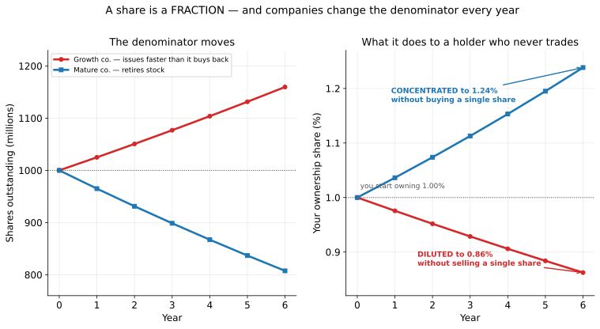
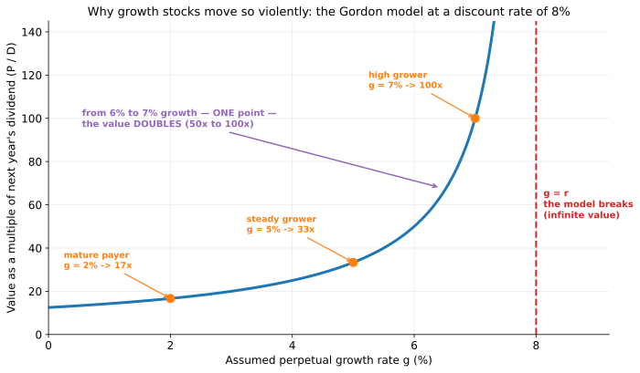
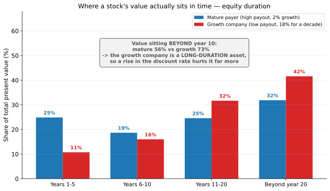
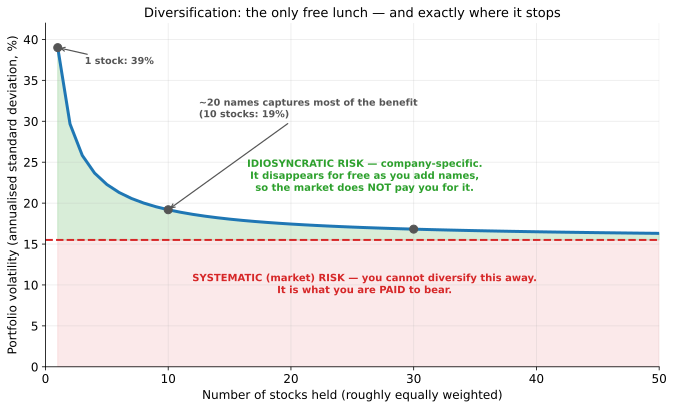

# E06 · §2 — Stocks (Equity): What a Share Actually Is

> **Subject:** Economy & Finance *(hobby track)*
> **Module:** E06 — Financial Markets & Instruments
> **Section:** the **second section of E06**. §1 built the market — its five jobs, the primary/secondary split,
> the order book, and the single discounting equation that prices every instrument. Now we take the first
> instrument apart. A share is the **residual claim**: junior to everything, unlimited on the upside, and the
> hardest thing in finance to value precisely because nobody knows its cash flows. We establish **what a share
> legally is** (a bundle of rights against a separate legal person — not a slice of the factory); why **the
> denominator moves** and what dilution really costs you; the **three channels** through which a shareholder
> actually gets paid, and Miller–Modigliani's uncomfortable claim that the split between them shouldn't matter;
> how to **value a residual claim** with the dividend discount model, why it detonates as growth approaches the
> discount rate, and why a P/E ratio is a *compressed* discounted cash flow rather than a price tag; **where a
> stock's value sits in time** (equity duration — the payoff to §1's claim that the policy rate prices
> everything); **risk and return**, diversification as the only free lunch, and what the market will and will
> not pay you to bear; **share classes and the control fight** (dual-class structures, and the VIE arrangement
> where you own a contract rather than a company); and **S-REITs**, Singapore's distinctive and genuinely
> world-class equity class *(local lens)*.
> **Status:** 🔵 **PREPARED 2026-09-11** — body drafted, awaiting the live session. **§10 Applied** gets added on
> finalize.
> Math in LaTeX, quantitative relationships drawn as real curves, key terms glossed in 中文 (大陆/台灣), per
> [`../../../agent-docs/authoring-conventions.md`](../../../agent-docs/authoring-conventions.md).

**Estimated study time:** 1.5–2 hours including reflection.
**Prerequisites:** E06 §1 — **all of it**, and especially §3 (the discounted-cash-flow equation and the ladder of
claims) and §6 (efficiency, and where it is weakest); §1 §10 (the delisting transfer — §6 below is its
governance twin). E01 §3 (present value, compounding). Helpful: E04 §2 (the same discounting logic applied to a
government), and E03 §3 (what moves the discount rate in the first place).

---

## Why this section exists (for *you*)

Because **the share is the instrument you will actually own**, and because almost every confident statement you
will hear about stocks is a statement about one of four things: what a share legally *is*, how many of them
there are, how the cash gets to you, or what the right price is. Getting those four straight is most of the
work, and it makes E07 (reading the statements) and E09 (investing) tractable rather than mystifying.

It is also where the abstraction from §1 pays a concrete dividend. §1 claimed that **every instrument is the
discounted value of its future cash flows**, and that this is why the policy rate prices everything. A share is
the hardest case of that claim — the cash flows are unknown, unbounded, and stretch to infinity — and working
through it explains several things that otherwise look like market irrationality: why a one-point revision to a
growth forecast can halve a company's value, why "expensive" technology stocks fall hardest when rates rise,
and why two companies with identical profits can trade at wildly different prices without either being wrong.

> **One framing to carry through.** A share is not a claim on a company's *assets* — you cannot walk into the
> factory and take a machine. It is a claim on **what is left over**, forever, after everyone else with a
> contract has been paid. Every distinctive property of equity follows from that single sentence: the unlimited
> upside (there is no cap on "what is left over"), the total wipeout in bankruptcy (there is often nothing left
> over), the voting rights (nobody else has an incentive to watch the residual), and the valuation difficulty
> (you are forecasting a remainder, which is the noisiest thing to forecast). **When a share confuses you,
> return to: a claim on the remainder, in perpetuity.**

---

## 1. What a share legally is

A company is a **separate legal person**. It owns its own assets, signs its own contracts, and can be sued in
its own name. A shareholder does not own the company's assets; a shareholder owns a **share of the company** —
and what that share confers is a **bundle of rights**, not a slice of property:

| Right | What it means | Where it bites |
|---|---|---|
| **Residual cash flow** | a claim on distributions the board chooses to make — dividends and buybacks | §3 |
| **Vote** | elect directors, approve major transactions, sometimes vote on pay | §6 |
| **Information** | audited accounts and continuous disclosure — the legal basis of E07 | E07 |
| **Residual assets** | in a liquidation, whatever remains after **every** creditor is paid | usually zero |

Four structural features make this work, and each is a genuine social invention rather than a natural fact:

1. **Limited liability.** The most you can lose is what you paid. Creditors of the company cannot pursue your
   house. This is *not* obvious — historically, partners were liable for everything — and it is what makes
   dispersed public ownership possible at all. Nobody would buy shares in a company run by strangers if a
   failure could bankrupt them personally.
2. **Perpetual existence.** The company outlives its shareholders and its founders. Its cash flows therefore
   run to infinity, which is why §4's valuation formulas sum to infinity rather than to a maturity date. **This
   is the cleanest structural difference from a bond**, which has a stated end.
3. **Transferability.** Your rights can be sold to someone else without the company's permission and without
   disturbing its operations — the property that makes §1's secondary market possible.
4. **Separation of ownership from control.** Shareholders own; directors and managers control. This is the
   source of the efficiency (professional management, no need for owners to be competent operators) and of the
   central problem of corporate governance — the **agency problem**, where the people running the company are
   not the people whose money it is.

> **What a share is *not*.** It is not a deposit (nobody promises to return it), not a claim on assets (those
> belong to the company), not a loan (there is no repayment date and no obligation to pay you anything at all),
> and not a right to be treated well by management (only to elect them, and to sue in narrow circumstances). The
> single most common confusion is expecting bond-like protections from an instrument whose whole economic
> character is the absence of them.

---

## 2. A share is a fraction — and the denominator moves

The price of one share tells you nothing on its own. A share is a *fraction* of a company, so what matters is
price **times** the number of shares:

$$\text{Market capitalisation} = P \times N$$

where $P$ is the price per share and $N$ the shares outstanding. A company at USD 10 per share with 10 billion
shares is worth ten times one at USD 100 per share with 100 million shares. This is why a **stock split**
changes nothing real: doubling $N$ and halving $P$ leaves the product identical, and leaves your stake
identical.

A related quantity you will meet constantly in E08 adds the debt back:

$$\text{Enterprise value} = \text{market capitalisation} + \text{net debt}$$

Market capitalisation prices the *equity*; enterprise value prices the *whole business* regardless of how it is
financed. Confusing them is the most common valuation error made by beginners.

**The part people miss is that $N$ is not constant.** Companies change it every single year:

| Action | Effect on $N$ | What it does to you |
|---|---|---|
| **Follow-on offering** | up | your % falls; the company gets cash (a §1 *primary* transaction) |
| **Stock-based compensation** | up | your % falls; employees are paid with your ownership |
| **Convertible bonds converting** | up | your % falls when the share price rises — precisely when it hurts |
| **Buyback** | down | your % rises without you doing anything |
| **Stock split / bonus issue** | up | nothing — everyone's fraction is unchanged |

<!-- FIGURE 1 -->

Two companies, identical starting share counts, a passive holder who never trades: after six years the same
holder owns **0.86%** of one and **1.24%** of the other. Nothing was bought or sold. **This is why per-share
figures — earnings per share, dividends per share — matter more than totals.** A company can grow its profits
handsomely and still deliver nothing to you if it grows its share count just as fast.

> **The honest version of the stock-based-compensation argument.** Companies often present stock compensation
> as a cash-free expense. It is cash-free *for the company* and emphatically not free for *you* — it is paid in
> your ownership. The clean test is not the income statement but the share count: **look at diluted shares
> outstanding over five years.** If it is rising steadily and buybacks are presented as "returning capital,"
> those buybacks may be doing nothing but mopping up issuance — running to stand still. E08 will make this a
> formal check.

---

## 3. How a shareholder actually gets paid

There are exactly three channels, and mixing them up causes endless confusion.

1. **Dividends** — the company distributes cash. Simple, visible, taxed on receipt in most countries (though
   **not in Singapore**, under its one-tier system). Dividends are famously *sticky*: managers cut them only in
   real distress, because a cut is read as a confession. That stickiness (documented by Lintner in the 1950s and
   never really overturned) makes the dividend a **signal** as much as a payment.
2. **Buybacks** — the company buys its own shares and cancels them. You receive nothing directly; your *fraction
   of the company rises* (fig 1, right panel). Economically it is a distribution; mechanically it is a change in
   the denominator. It is more tax-efficient where dividends are taxed, more flexible (no implied promise), and
   more easily abused — a buyback executed at an inflated price destroys value just as surely as an overpriced
   acquisition.
3. **Retained earnings reinvested** — the company keeps the cash and grows. You are paid later, through a larger
   future claim, and only if the reinvestment earns more than your required return. **This is where most of the
   lifetime return of a good business comes from**, and it is the entire justification for a company that has
   never paid a dividend being worth anything.

The total is what matters:

$$\text{Total shareholder return} = \text{dividend yield} + \text{capital appreciation}$$

### The uncomfortable theorem

**Miller and Modigliani (1961)** proved that in a frictionless world — no taxes, no transaction costs, no
information asymmetry, fixed investment policy — **dividend policy is irrelevant to value.** If a company pays
you a dividend, the share price drops by exactly that amount; if it doesn't, you can manufacture your own
dividend by selling a sliver of your holding. The pie is the same however you slice it.

Nobody believes the conclusion literally, but the theorem is valuable in the way all impossibility results are:
**it tells you exactly where to look for the real effects.** Dividend policy matters only through the frictions
the theorem assumed away:

- **Taxes** — the classic argument for buybacks over dividends where dividend income is taxed more heavily. Note
  that **in Singapore this consideration mostly vanishes**: dividends are tax-exempt in the shareholder's hands
  and there is no capital gains tax, so the tax scoreboard is close to neutral.
- **Signalling** — initiating or raising a dividend is a costly, credible statement about expected future cash.
  Talk is cheap; a cheque is not.
- **Agency** — paying cash out removes the temptation to spend it badly. For a mature company with no good
  projects, a dividend is a **discipline device**, which is Jensen's free-cash-flow argument.
- **Clienteles** — retirees who want income and endowments who want growth are different buyers, and a company
  effectively chooses its shareholder base with its payout policy.

> **The test to carry into E08.** The question is never "does it pay a dividend?" but **"what return does the
> company earn on the cash it retains?"** A business reinvesting at 20% should pay you nothing. A business
> reinvesting at 4% when you could earn 5% elsewhere is destroying value every year it retains, no matter how
> profitable it looks.

---

## 4. Valuing a residual claim

§1 gave the universal equation: price is the sum of discounted future cash flows. For a share, the cash flows to
the owner are the distributions, and the sum runs forever. Assume for a moment that they grow at a constant rate
$g$ and discount at $r$. The infinite sum collapses into one line — the **dividend discount model**, usually
called the **Gordon growth model**:

$$P_0 = \frac{D_1}{r - g}$$

Simple, and treacherous. Rearranged, it also tells you what return you are signing up for:

$$r = \frac{D_1}{P_0} + g$$

**your return equals the dividend yield plus the growth rate** — which is the single most useful sanity check in
equity investing, and the thing to reach for whenever someone quotes you an expected return.

<!-- FIGURE 2 -->

Look at what the formula does. At 2% growth the business is worth about 17 times next year's dividend. At 5%,
33 times. At 7% — one point more than 6% — the value **doubles**. As $g$ approaches $r$ the denominator goes to
zero and the value goes to infinity.

**This is not a defect of the model; it is a statement about reality.** The value of a long-lived growing claim
genuinely is hypersensitive to its assumed growth rate, because growth compounds over an infinite horizon. It
explains, with no appeal to irrationality:

- why a small revision to a growth forecast can move a stock 30% in a day;
- why analysts disagree so violently about growth companies and so little about utilities;
- and why **any valuation with $g$ close to $r$ should be treated as an opinion wearing a lab coat.** No company
  can grow faster than the economy forever — if it did, it would eventually *be* the economy.

### Where the value sits in time

The same model answers a question that explains most of 2022's market behaviour.

<!-- FIGURE 3 -->

For a mature payer, a quarter of all present value arrives in the first five years. For a company paying little
now and growing fast, only about a tenth does — **nearly three quarters of its value sits beyond year 10**, in
cash flows nobody has any real ability to forecast.

That is **equity duration**, and it is the direct payoff to §1's claim that the policy rate prices everything.
Distant cash flows are discounted by $(1 + r)^t$ with large $t$, so they are far more sensitive to a change in
$r$. **A rise in rates does not "hurt technology stocks" because of anything about technology.** It hurts
long-duration claims, and growth companies are long-duration claims. A utility and a pre-profit software company
can face the identical rate shock and respond completely differently for purely arithmetic reasons.

### Multiples — a compressed DCF, not a price tag

In practice almost nobody builds an infinite sum. They use a **multiple**, most commonly the price-to-earnings
ratio. And the crucial point, which converts P/E from a folk statistic into a real tool, is that **a multiple is
a discounted cash flow with the assumptions hidden inside it.** Divide the Gordon model through by earnings:

$$\frac{P_0}{E_1} = \frac{\text{payout ratio}}{r - g}$$

So a P/E ratio is not "how expensive" a stock is. It is a **compressed statement of three beliefs**: how much of
its earnings the company can pay out, how risky it is, and how fast it will grow. A stock on 40 times earnings
is not by that fact overpriced — it encodes an expectation of high growth or low risk, which may be right or
wrong. A stock on 6 times earnings is not cheap — it encodes an expectation of decline, which may also be right.

| Multiple | What it divides by | Best for | Main trap |
|---|---|---|---|
| **P/E** | net earnings | profitable, stable companies | earnings are an accounting choice (E07); useless if negative |
| **P/B** (price to book) | book equity | banks and asset-heavy businesses | book value ignores intangibles, so it mis-prices software badly |
| **EV/EBITDA** | operating cash proxy | comparing across capital structures | ignores the real cost of capital spending |
| **P/S** (price to sales) | revenue | pre-profit companies | a sale is not a profit; the weakest of the family |

> **The honest limit of all valuation.** None of this is a truth machine. A discounted cash flow is a device for
> making your assumptions **explicit and checkable** — its output is only as good as the growth and discount
> rates you fed it, and §6 of the previous section tells you the market price already embeds thousands of other
> people's versions of the same guess. The correct use is not "the model says it's worth 42, it trades at 30,
> therefore buy." It is: **"at 30, what would have to be true?"** Then judge *that*.

---

## 5. Risk, return, and what the market pays you for

Over long periods equities have returned meaningfully more than government bonds — the **equity risk premium**,
historically somewhere in the region of 3 to 5 percentage points a year depending on market and period. That
premium is not a gift. It is compensation for the two things you accepted in §1: you are **last in line**, and
your returns are **violent**.

But not all risk is compensated, and the distinction is the most practically valuable idea in this section.

<!-- FIGURE 4 -->

- **Idiosyncratic risk** is company-specific: a failed drug trial, a fire, a fraud, a lost contract. Adding more
  names makes it **disappear** — the good and bad surprises cancel. Because it can be removed *for free*, the
  market does **not** pay you to bear it. Holding one stock instead of thirty is taking risk you are not being
  compensated for.
- **Systematic risk** is the market itself: recessions, rate shocks, wars. No amount of diversification removes
  it, because it hits everything at once. **This is the risk the equity premium is paying for.**

The figure shows where the free lunch ends: most of the benefit is captured by roughly 20–30 reasonably
different names, and beyond that the line flattens onto the systematic floor. This is Markowitz's insight, and
it is the entire intellectual foundation of the index fund you met in §1 §4.

**CAPM (the capital asset pricing model)** formalises it into the one equation every finance course teaches:

$$E(R_i) = r_f + \beta_i \left( E(R_m) - r_f \right)$$

Your expected return is the risk-free rate plus your exposure to market risk. **Beta** measures how much a
stock moves with the market: a beta of 1.5 amplifies market moves, a beta of 0.5 damps them. Note what CAPM
asserts — that only the *undiversifiable* part of a stock's volatility earns a return, which is the figure
written as an equation.

> **CAPM is wrong, and still worth learning.** Empirically it explains far less of the cross-section of returns
> than it claims, and decades of work found persistent patterns it cannot account for — smaller companies,
> cheaper companies, recent winners, and high-quality companies have all historically earned more than their
> betas justify. That is the **factor** literature (Fama–French and its descendants), and it is where E09 will
> pick up. Learn CAPM as the **reference frame** that makes the anomalies legible, not as a description of the
> world. Its durable contribution is the distinction above: **you are paid for risk you cannot diversify away,
> and not for risk you simply chose not to.**

---

## 6. Share classes, control, and the governance fight

"One share, one vote" is a default, not a law — and the exceptions are where equity gets genuinely contested.

**Dual-class structures** give founders shares carrying ten or more votes each while the public buys shares
carrying one, or in some cases none at all. The case for them is real: insulation from short-term market
pressure lets a founder pursue a long project without being fired for a bad quarter. The case against is equally
real: a founder can hold voting control with a small fraction of the economics, and **the ordinary corrective
mechanism of equity — replace the board — is switched off permanently.** Note how this reconnects to §1 §10:
minority investors there faced a *price* problem at the exit, and here they face a *voice* problem throughout.
Both are the same underlying issue — a residual claimant with limited power.

Index providers have wrestled with this publicly, excluding and then re-admitting multi-class companies, which
matters enormously in practice: with passive funds now the marginal owner (§1 §4), **index inclusion rules are
a de facto governance regulator**, and one nobody elected.

Other variations on the residual claim worth knowing:

| Instrument | What it actually is |
|---|---|
| **Preferred shares** | a hybrid — a fixed dividend ranking ahead of ordinary shares, usually no vote; economically much closer to a bond than to equity |
| **ADRs / depositary receipts** | a certificate issued by a bank representing foreign shares it holds, letting a company trade on a market where it is not listed |
| **Tracking stocks** | equity referencing one division's performance while the parent keeps legal ownership |
| **VIE (variable interest entity)** | see below — the sharpest illustration in the world of "a share is a bundle of rights" |

> **The VIE structure, and why §1's framing is not pedantry.** Many Chinese internet companies operate in
> sectors where foreign ownership is restricted. So foreign investors do not buy the Chinese company. They buy a
> **Cayman Islands holding company** that has no ownership of the operating business at all — only a stack of
> **contracts** entitling it to that business's profits. You are holding a contractual claim, enforceable in
> uncertain venues, against a structure whose legality has never been definitively tested by the Chinese state.
> The US regulator has said plainly that many investors do not realise this. **It is the cleanest possible
> demonstration that a share is exactly and only the rights it carries** — and a direct callback to E05's point
> that jurisdiction, not economics, decides what a claim is worth in the end.

---

## 7. S-REITs — Singapore's distinctive equity class *(local lens)*

Singapore's equity market has one genuinely world-class segment, and it happens to be an excellent teaching
device: **roughly 40 listed REITs and property trusts with a combined market value of about SGD 100 billion, around a
tenth of SGX's total — the largest such market in Asia outside Japan, and with over 90% of them holding property
*outside* Singapore.** As noted in §1 §7, that makes the listing venue a genuine export business.

A **REIT (real estate investment trust)** is equity with the payout decision taken away. The structure:

1. A trust owns income-producing property and is managed by a **REIT manager** (usually a subsidiary of the
   sponsor that sold it the assets).
2. To keep its tax transparency it must **distribute at least 90% of taxable income** to unitholders. §3's
   retention channel is therefore switched off almost entirely.
3. Leverage is **capped by regulation** — the MAS aggregate leverage limit — precisely because the forced payout
   leaves no internal cushion.
4. Growth must therefore come from **acquisitions funded by new units or debt**, which is why REITs issue equity
   so often (fig 1's dilution mechanics, running continuously).

**Why this is worth studying rather than just owning.** A REIT makes several of this section's abstractions
visible:

- **The payout ratio is fixed at nearly 1**, so the Gordon model's numerator is unusually knowable — which is
  precisely why REITs trade on yield and why their prices are so visibly **rate-sensitive**. With growth
  structurally low, $r - g$ is dominated by movements in $r$: a REIT is a short-duration, bond-like equity, and
  fig 3's left-hand profile is roughly its picture.
- **Dilution is not a scandal but the business model.** A REIT that issues units to buy a building at a yield
  above its cost of capital has made you better off per unit. The metric that captures this — and the one to
  check — is **DPU (distribution per unit)**, not total distributions.
- **The agency problem of §1 has a specific local shape.** The manager is typically paid on assets under
  management, which rewards *getting bigger* rather than *earning more per unit*. So the sponsor has an
  incentive to sell its own properties into the trust. Governance here is not abstract: it is the question of
  whether a specific acquisition was priced for the unitholders or for the sponsor.
- **For a Singapore investor the tax treatment is unusually clean** — qualifying distributions to individuals
  are tax-exempt, there is no capital gains tax, and nothing is withheld — which is a large part of why the
  class is so heavily held domestically, and a live illustration of §3's Miller–Modigliani frictions being
  genuinely small in one jurisdiction.

> **The closing point, and the bridge to §3 of this module.** A REIT is what you get when you take an equity and
> force the residual to be paid out immediately. It behaves like a bond because you have removed the thing that
> made it equity — discretion over the remainder. **That is the cleanest possible demonstration that debt and
> equity are not two species but two ends of one spectrum**, which is exactly what the next section takes apart
> from the other end.

---

## 8. The one-page mental model

```mermaid
flowchart TD
    WHAT["WHAT A SHARE IS (§1)<br/>a BUNDLE OF RIGHTS against a separate legal person — NOT a slice of the assets<br/>residual cash flow · vote · information · residual assets (usually zero)<br/>built on LIMITED LIABILITY · perpetual existence · transferability ·<br/>separation of ownership from control (⇒ the AGENCY PROBLEM)"]
    FRAC["A SHARE IS A FRACTION (§2)<br/>market cap = price x shares, so the PRICE ALONE MEANS NOTHING (a split changes nothing)<br/>and the DENOMINATOR MOVES every year: issuance &amp; stock compensation DILUTE,<br/>buybacks CONCENTRATE — a passive holder's stake drifts without trading<br/>⇒ watch PER-SHARE figures and the 5-year diluted share count"]
    PAID["HOW YOU GET PAID (§3)<br/>three channels: DIVIDENDS (sticky, a signal) · BUYBACKS (a denominator change) ·<br/>RETAINED EARNINGS REINVESTED (where most lifetime return comes from)<br/>MILLER-MODIGLIANI: in a frictionless world the split is IRRELEVANT<br/>⇒ so it matters only through taxes, signalling, agency and clienteles<br/>the real question is never 'does it pay?' but WHAT IT EARNS ON WHAT IT KEEPS"]
    VAL["VALUING THE REMAINDER (§4)<br/>GORDON: price = next dividend / (r − g) ⇒ return = dividend yield + growth<br/>the value EXPLODES as g approaches r — which is why one point of growth<br/>can double a valuation, and why growth forecasts are opinions in a lab coat<br/>EQUITY DURATION: a growth company holds ~3/4 of its value beyond year 10<br/>⇒ rate rises hurt LONG-DURATION claims, not 'technology' as such<br/>A MULTIPLE IS A COMPRESSED DCF: P/E = payout / (r − g), a statement of BELIEFS"]
    RISK["RISK AND RETURN (§5)<br/>the EQUITY RISK PREMIUM pays you for being last in line and volatile<br/>IDIOSYNCRATIC risk diversifies away FOR FREE ⇒ the market does NOT pay for it<br/>SYSTEMATIC risk cannot ⇒ that is what you are paid to bear (~20-30 names does it)<br/>CAPM formalises this and is empirically WRONG but is the reference frame<br/>that makes the FACTOR anomalies legible (size, value, momentum, quality)"]
    CTRL["CLASSES AND CONTROL (§6)<br/>one-share-one-vote is a DEFAULT, not a law: DUAL-CLASS structures buy long-horizon<br/>insulation at the price of switching off the board-replacement mechanism<br/>index inclusion rules are now a DE FACTO governance regulator nobody elected<br/>preferred = bond-like · ADRs = a bank's certificate · VIE = you own CONTRACTS,<br/>not the company — the sharpest proof that a share is EXACTLY the rights it carries"]
    SG["S-REITs — THE LOCAL LENS (§7)<br/>~40 trusts, ~SGD 100bn, largest in Asia ex-Japan, &gt;90% holding FOREIGN property<br/>equity with the payout decision REMOVED (90% distribution rule, capped leverage)<br/>⇒ bond-like and rate-sensitive, growth must be BOUGHT with new units,<br/>so watch DPU not total distributions, and watch the sponsor-manager agency problem<br/>⇒ debt and equity are TWO ENDS OF ONE SPECTRUM, not two species"]
    NEXT["→ Next E06 §3 — BONDS &amp; FIXED INCOME:<br/>the other end of that spectrum — lending to companies and governments, price vs yield"]
    WHAT --> FRAC
    FRAC --> PAID
    PAID --> VAL
    VAL --> RISK
    RISK --> CTRL
    CTRL --> SG
    SG --> NEXT
```

<!-- DIAGRAM:START -->

Diagram source (Mermaid)

<!-- DIAGRAM:END -->

**The eight things to remember:**
1. **A share is a claim on the remainder, in perpetuity** — a bundle of rights against a separate legal person,
   not a slice of the assets. Every property of equity follows from that one sentence.
2. **Limited liability and separation of ownership from control are inventions, not facts** — the first makes
   dispersed public ownership possible, the second creates the agency problem that governance exists to manage.
3. **Price alone is meaningless; market cap is price times share count** — and the share count moves every year.
   Dilution and buybacks change your stake without you trading, so **per-share figures are the only honest ones**.
4. **Three payment channels — dividends, buybacks, reinvestment** — and Miller–Modigliani says the split between
   them is irrelevant in a frictionless world, which tells you to look at the frictions: taxes, signalling,
   agency, clienteles. The real question is what the company earns on what it keeps.
5. **Return equals dividend yield plus growth**, and value explodes as growth approaches the discount rate.
   Hypersensitivity to the growth assumption is a fact about long-lived claims, not a modelling error.
6. **Equity duration explains rate sensitivity.** A growth company holds most of its value beyond year 10, so a
   change in the discount rate hits it hardest. This is arithmetic, not sentiment.
7. **A multiple is a compressed discounted cash flow.** A P/E encodes beliefs about payout, risk and growth — so
   "high P/E" means *high expectations*, never *overpriced* on its own.
8. **You are paid for systematic risk only.** Idiosyncratic risk vanishes for free with 20–30 names, so bearing
   it uncompensated is simply an error. CAPM is the wrong-but-indispensable frame that makes this precise.

---

## 9. Check your understanding

Reason first; check against a source where noted.

1. **What you own.** A friend says "I own part of that company's factory." Correct them precisely, and list the
   four rights a share actually confers.
2. **Limited liability.** Explain why dispersed public equity markets would be nearly impossible without it —
   and identify who bears the risk that shareholders are shielded from.
3. **The denominator.** Company A grows net profit 60% over five years while its diluted share count rises 55%.
   Company B grows profit 25% while retiring 20% of its shares. Which delivered more to a holder who never
   traded? Show your reasoning in per-share terms.
4. **Buyback or dividend?** State Miller–Modigliani's claim precisely, then give the three frictions that make
   the choice matter in practice — and say specifically why the tax friction is unusually weak in Singapore.
5. **The sanity check.** A fund manager projects a 12% annual return from a mature utility yielding 4%. Using
   the rearranged Gordon model, state exactly what is being assumed and judge whether it is plausible.
6. **Why one point matters.** At a discount rate of 8%, compute the value multiple at 5% growth and at 6.5%
   growth. Explain in one sentence why this arithmetic, not investor psychology, drives most of the volatility
   in growth stocks.
7. **Duration.** Two companies face the same one-point rise in the discount rate: a utility paying out most of
   its earnings, and a pre-profit software company. Explain which falls further and why — **without** using the
   word "technology."
8. **Reading a multiple.** Stock X trades at 45 times earnings, stock Y at 7 times. Write down what each
   multiple is *asserting*, using the P/E identity, and say what you would need to check to judge either.
9. **Which risk is paid.** You hold one stock with 40% volatility. You diversify into thirty, and volatility
   falls to about 17%. Explain why your expected return did *not* fall by a corresponding amount — and what that
   implies about holding a concentrated portfolio.
10. **Control and claims.** Compare a dual-class share, a preferred share, and a VIE structure: in each case say
    precisely which of §1's four rights has been modified, and who benefits from the modification.
11. **The REIT as a teaching case.** Explain why a REIT behaves more like a bond than a typical share, using the
    Gordon model, and say why unit issuance is not automatically bad for existing holders.

> **Optional — take a real company apart (20–30 min).** Pick any listed company and pull five years of data:
> (a) **diluted shares outstanding** at each year end — is the denominator rising or falling? (b) **dividends
> and buybacks** as a share of operating cash flow; (c) **earnings per share** growth versus *total* earnings
> growth — the gap is dilution; (d) its current **P/E**, and using the identity in §4, what growth rate would
> justify it at a 9% discount rate. Then answer the only question that matters: **at today's price, what would
> have to be true?** Bring it to the session.

---

## Key terms — English · 中文（中国大陆 / 台灣）

Reading equity research and company news across both scripts. Most differences are **simplified vs
traditional**; **⚠ marks a genuine terminology difference** — and equity vocabulary has more of these than any
other topic so far, because the two markets developed their jargon independently.

**The instrument**

| English | 中国大陆 (简体) | 台灣 (繁體) | Note |
|---|---|---|---|
| Share / stock | 股票 | 股票 | same |
| Shareholder | 股东 | 股東 | ⚠ **东 ↔ 東** |
| Ordinary / common share | 普通股 | 普通股 | same |
| Preferred share | **优先股** | **特別股** | ⚠⚠ **genuinely different words** |
| Limited liability | 有限责任 | 有限責任 | ⚠ **责 ↔ 責** |
| Board of directors | 董事会 | 董事會 | ⚠ **会 ↔ 會** |

**The share count and payouts**

| English | 中国大陆 (简体) | 台灣 (繁體) | Note |
|---|---|---|---|
| Market capitalisation | 市值 | 市值 | same |
| Dividend | 股息／红利 | **股利** | ⚠⚠ TW default is **股利** |
| Share buyback | **股票回购** | **庫藏股** | ⚠⚠ **genuinely different** — TW frames it as treasury stock |
| Rights issue | **配股／供股** | **現金增資** | ⚠⚠ **genuinely different** |
| Stock split | 拆股／股票分割 | 股票分割 | ⚠ **拆股** is mainland-only |
| Dilution | 稀释 | 稀釋 | ⚠ **释 ↔ 釋** |
| Earnings per share (EPS) | **每股收益** | **每股盈餘** | ⚠⚠ **收益 ↔ 盈餘** |

**Valuation**

| English | 中国大陆 (简体) | 台灣 (繁體) | Note |
|---|---|---|---|
| Price-to-earnings (P/E) ratio | **市盈率** | **本益比** | ⚠⚠ **completely different terms** — the biggest trap here |
| Price-to-book (P/B) ratio | **市净率** | **股價淨值比** | ⚠⚠ **genuinely different** |
| Dividend yield | 股息率 | **殖利率** | ⚠⚠ **殖利率** is the standard TW word (also used for bond yield) |
| Book value | 账面价值 | 帳面價值 | ⚠ **账 ↔ 帳** |
| Blue chip | **蓝筹股** | **績優股** | ⚠⚠ **genuinely different** |
| Growth / value stock | 成长股／价值股 | 成長股／價值股 | ⚠ **长 ↔ 長, 价值 ↔ 價值** |

**Risk and structure**

| English | 中国大陆 (简体) | 台灣 (繁體) | Note |
|---|---|---|---|
| Volatility | 波动率 | 波動率 | ⚠ **动 ↔ 動** |
| Diversification | 分散投资 | 分散投資 | ⚠ **投资 ↔ 投資** |
| Beta | 贝塔系数 | 貝他係數 | ⚠ **贝塔 ↔ 貝他** |
| REIT | 房地产投资信托 | **不動產投資信託** | ⚠⚠ **房地产 ↔ 不動產** |
| Corporate governance | 公司治理 | 公司治理 | same |

> Recurring genuine splits to memorize: **市盈率 ↔ 本益比** (P/E), **股息率 ↔ 殖利率** (yield), **股票回购 ↔
> 庫藏股** (buyback), **优先股 ↔ 特別股** (preferred), **每股收益 ↔ 每股盈餘** (EPS), **蓝筹股 ↔ 績優股**
> (blue chip), **配股 ↔ 現金增資** (rights issue), **房地产 ↔ 不動產** (real estate).

---

## References (optional, for depth)

- **The valuation reference that practitioners actually use:** Aswath Damodaran's
  [teaching and data site](https://pages.stern.nyu.edu/~adamodar/) — free spreadsheets, sector multiples, and
  updated equity risk premium estimates; the single best public resource for everything in §4.
- **Dividend policy, in the original:** Miller & Modigliani,
  ["Dividend Policy, Growth, and the Valuation of Shares"](https://www.jstor.org/stable/2351143) (*Journal of
  Business*, 1961) — the irrelevance theorem of §3.
- **Diversification, in the original:** Harry Markowitz,
  ["Portfolio Selection"](https://www.jstor.org/stable/2975974) (*Journal of Finance*, 1952) — the paper behind
  fig 3 and, ultimately, the index fund.
- **Equity as an owner sees it:** Berkshire Hathaway's
  [shareholder letters](https://www.berkshirehathaway.com/letters/letters.html) — decades of plain-English
  writing on retained earnings, buybacks and what a share actually is; start with the "Owner's Manual" material.
- **Risk, factors and the limits of CAPM:** the [Fama–French research overview at Dimensional](https://www.dimensional.com/us-en/insights)
  and Fama's [Nobel lecture](https://www.nobelprize.org/prizes/economic-sciences/2013/fama/lecture/) for how the
  anomalies were established.
- **The VIE warning, from the regulator:** the US SEC's
  [statement on investor protection in China-based companies](https://www.sec.gov/newsroom/speeches-statements/gensler-2021-07-30)
  — §6's structure described by the body responsible for disclosing it.
- **The Singapore lens:** [REITAS](https://www.reitas.sg/singapore-reits/overview-of-the-s-reit-industry/) for
  S-REIT industry statistics and structure, and [SGX's REIT resources](https://www.sgx.com/securities/sreits-property-trusts)
  for the live list and yields.
- **Live data:** [SGX market statistics](https://www.sgx.com/research-education/market-statistics), and any
  company's own investor-relations page for the diluted share count the exercise in §9 asks for.

---

### What's next
🔵 **PREPARED 2026-09-11.** You now hold the residual claim end to end: **what a share legally is** (a bundle of
rights, built on limited liability and the separation of ownership from control), **why the denominator moves**
and what dilution really costs, the **three payment channels** and Miller–Modigliani's redirection of the
question toward frictions, **how to value a remainder** (Gordon, the growth hypersensitivity, equity duration,
and the multiple as a compressed discounted cash flow), **which risks are paid for** and why diversification is
the only free lunch, **share classes and control** from dual-class structures to the VIE, and **S-REITs** as the
local case where equity has had its discretion removed. Next, **E06 §3 — Bonds & fixed income** takes the other
end of the same spectrum: lending rather than owning, the inverse relationship between price and yield, and the
credit and duration risks that make a "safe" instrument anything but. **§10 Applied** will be added on finalize,
from the live session.
