# E06 · §3 — Bonds & Fixed Income: What Lending Actually Buys You

> **Subject:** Economy & Finance *(hobby track)*
> **Module:** E06 — Financial Markets & Instruments
> **Section:** the **third section of E06**. §1 built the market and gave us the one discounting equation;
> §2 took apart the **residual** claim, where the cash flows are unknown and the hard part is forecasting
> them. This section takes the other end of the same spectrum: the **contractual** claim, where the cash
> flows are written down in advance and the hard part is everything else — the discount rate, the credit,
> the conventions, and the fact that "safe" is a statement about *default*, not about *price*. We establish
> **what a bond is as a legal contract** (a promise with a queue position and a covenant package, not just a
> stream of payments); **how to read a quote** — clean versus dirty price, accrued interest, day counts, and
> the four different numbers all called "yield"; **interest-rate risk properly** — Macaulay and modified
> duration, DV01 (the dollar value of a basis point), and convexity as the curvature the tangent misses; **credit risk** — what a spread has to
> cover, how the rating scale maps onto it, recovery, and the seniority ladder that decides who eats the
> loss; **the curve as a pricing object** — spot rates, bootstrapping, implied forwards, and what a single
> yield to maturity hides; **the rest of the family** — inflation-linked bonds, floaters, callables and
> negative convexity, securitisation, and the AT1 (additional tier 1) bank instrument that inverted the ladder in 2023; **who owns
> bonds and why**, including the difference between a bond and a bond fund that almost everybody gets wrong;
> and **Singapore fixed income** — SGS, T-bills, Savings Bonds and the retail perpetual that taught the
> country what "subordinated" means *(local lens)*.
> **Status:** ✅ **FINALIZED 2026-09-22.** §12 Applied added — **six unresolved symbols, and the difference
> between asserting and showing**: every question you raised was a token the material had used without
> defining, and at your instruction the answers were folded into the body rather than quarantined, so §2.5
> (where a yield comes from), the call-provision gloss in §2, the tick-quote rule and day-count Table 3 in
> §2.1, §3.5 (the parallel shift, worked out) and the redrawn Figure 4 all exist because of that read.
> Math in LaTeX, quantitative relationships drawn as real computed curves (two of them from live market
> data), key terms glossed in 中文 (大陆/台灣), per
> [`../../../agent-docs/authoring-conventions.md`](../../../agent-docs/authoring-conventions.md).

**Estimated study time:** 1.5–2 hours including reflection.
**Prerequisites:** E06 §1 §3 (the discounting equation and the ladder of claims) and §1 §5 (liquidity);
E06 §2 — especially §2 §4 (valuing a claim) and §2 §5 (risk and what gets paid for), because this section is
the contrast case. **E03 §2 is the direct parent**: §2 §2 (time value), §2 §4 (the anatomy of a yield), §2 §5
(the yield curve) and §2 §6 (price–yield inversion, duration, and Silicon Valley Bank). This section assumes
all four and goes a layer deeper rather than repeating them. Helpful: E04 §2 (the sovereign issuer's side of
the same trade) and E03 §3 (what moves the policy rate).

---

## Why this section exists (for *you*)

Because **the bond market is where the macroeconomy you spent five modules learning becomes a price you can
look up.** Every variable in E02–E05 — growth, inflation, the policy rate, the deficit, the currency — lands
in a bond yield, and it lands there in a form you can decompose. When a headline says "markets punished the
budget," the punishment is a number on a gilt screen, and after this section you will be able to say which
component moved and by how much.

It is also the asset class where **the vocabulary actively misleads.** "Fixed income" sounds fixed; the
income is fixed and the *price* is not, which is the entire content of E03 §2 §6. "Investment grade" sounds
like a recommendation; it is a rating agency's opinion, paid for by the issuer. "Risk-free" means free of
*default* risk in the issuer's own currency, and says nothing about inflation, about the price you get if you
sell early, or about what the currency will buy. "Yield" is four different numbers. A retail investor who
takes each of those words at face value ends up in exactly the wrong instrument — as thirty-four thousand
Singaporeans found out in §8.

And there is a practical reason. Bonds are where **duration** lives, and duration is the single most
transferable idea in finance: it is why a growth stock and a 30-year Treasury fall together (E06 §2 §4), why
a pension fund behaves the way it does, why Silicon Valley Bank failed, and why the honest answer to "was the
2022 bond crash bad for me?" is a question about your horizon rather than about the market.

> **One framing to carry through.** A share is a claim on *the remainder, forever*. A bond is the opposite
> construction: **a claim on a stated amount, at a stated time, enforceable in court, and ahead of the
> shareholders in the queue.** Everything distinctive about a bond follows from that one sentence — the
> capped upside (you cannot be paid more than you were promised), the *legal* remedy when payment fails (you
> can force the company into insolvency; a shareholder cannot), the finite maturity (the contract ends), and
> the fact that your two real risks are precisely the two ways a promise can disappoint you: **the promise is
> not kept** (credit risk), or **the promise is kept but is worth less than you thought** (interest-rate and
> inflation risk). **When a bond confuses you, return to: a dated promise, with a queue position.**

---

## 1. What a bond actually is — a contract, not a cash-flow stream

<b>Vocabulary for this section</b> — every term used below, including ones defined earlier (click to expand)

**Abbreviations**

| Short | Stands for | Meaning |
|---|---|---|
| **IOU** | "I owe you" | informal name for a debt acknowledgement |
| **SPV** | special purpose vehicle | a company created for one financing, holding one set of assets |
| **UST** | United States Treasury security | the US government's own bonds, bills and notes |
| **SGS** | Singapore Government Securities | tradable Singapore government bonds and bills |
| **EBITDA** | earnings before interest, tax, depreciation and amortisation | a rough proxy for operating cash generation, used in covenant tests |
| **bn / tn** | billion / trillion | |

**Symbols used in the formulas**

| Symbol | Reads as | Meaning |
|---|---|---|
| $F$ | "F" | the **face** (par, principal) value — the amount repaid at maturity, conventionally quoted per 100 |
| $c$ | "c" | the **coupon rate**, a fraction of face value per year (a 4% coupon on 100 face pays 4 a year) |
| $C$ | "C" | the coupon **payment** itself, $C = c \times F$ divided by the number of payments per year |
| $n$ | "n" | the number of coupon periods remaining until maturity |
| $t$ | "t" | the running period index inside a sum, from 1 to $n$ |
| $y$ | "y" | the market **yield** used to discount; a price, not a policy setting |
| $P$ | "P" | the bond's price today |

**Terms**

| Term | Definition |
|---|---|
| **Bond** | a tradable loan: a legal promise to pay stated amounts on stated dates |
| **Fixed income** | the whole asset class of such promises — named for the fixed *payments*, not a fixed price |
| **Issuer** | the borrower who sells the bond and owes the money |
| **Bondholder / creditor** | the lender who owns the promise |
| **Face (par, principal) value** | the amount repaid at maturity; the base on which the coupon is calculated |
| **Coupon** | the periodic interest payment; the name survives from paper bonds with detachable coupons |
| **Zero-coupon bond** | a bond with no coupons, sold below face and redeemed at face; the difference is the interest |
| **Maturity (tenor)** | the date the principal comes back — the structural difference from a share, which has none |
| **Bill / note / bond** | the same instrument at different tenors; for US Treasuries, up to 1 year, 2–10 years, and over 10 years |
| **Indenture (trust deed)** | the contract itself: every term, covenant, default trigger and remedy |
| **Trustee** | the party appointed to act for all bondholders collectively, so they need not coordinate |
| **Covenant** | a promise in the indenture beyond paying — a limit on what the issuer may do while the debt is outstanding |
| **Incurrence covenant** | a covenant tested only when the issuer *does* something (borrows more, pays a dividend) |
| **Maintenance covenant** | a covenant tested every quarter regardless — the stricter, and now rarer, kind |
| **Covenant-lite** | a loan or bond with incurrence covenants only; the market standard since roughly 2013 |
| **Negative pledge** | a covenant promising not to grant other lenders security ahead of you |
| **Event of default** | the contractual trigger that lets bondholders demand immediate repayment |
| **Acceleration** | the remedy: the whole principal becomes due at once |
| **Cross-default** | a clause making default on *other* debt a default on yours, so all creditors fail together |
| **Seniority** | position in the repayment queue in insolvency |
| **Secured / unsecured** | backed by specific collateral, or only by a general claim on the issuer |
| **Senior / subordinated** | ahead of, or behind, other unsecured creditors of the same issuer |
| **Structural subordination** | being senior on paper but behind in practice, because the cash is in a subsidiary you have no claim on |
| **Recovery rate** | the fraction of face value creditors actually get back after a default |
| **Sovereign / corporate / municipal bond** | issued by a national government, a company, or a sub-national government |
| **Supranational** | issued by a multi-country institution such as the World Bank |
| **Special purpose vehicle** | a company created to hold one pool of assets and issue bonds against it (see §6) |

A bond is usually introduced as a picture of cash flows, and we will get there in a moment. But the cash-flow
picture is a *consequence*. **The instrument is a contract**, and almost everything that determines whether
you get paid is in the contract rather than in the schedule.

### 1.1 The schedule — the part everyone draws

A plain vanilla bond promises a **coupon** $C$ at fixed intervals and the **face value** $F$ at **maturity**.
Per 100 of face, a 10-year bond with a 4% annual coupon pays 4 a year for ten years and 104 in the tenth.
That is the left panel of Figure 1:

![A bond's nominal cash flows next to their present values. Left panel: ten annual coupons of 4 dollars per 100 of face value, then a final payment of 104 in year 10 — seventy-four percent of all the money owed arrives on the last day. Right panel: the present value of each of those payments discounted at a 5 percent yield, falling from 3.8 in year one to 2.6 in year nine, with 63.8 in year ten; the total is the price, 92.28. A dashed line and a triangular fulcrum at 8.36 years mark the Macaulay duration as the balance point of the present-value bars.](diagrams/03-bonds-and-fixed-income-fig1.svg)

**Figure 1** — a bond's cash flows and their present values: maturity tells you when it ends, duration tells you where the value lives.

Two things in that picture are worth more than they look.

**First, the money is not spread evenly.** Seventy-four percent of everything a 10-year 4% bond owes you
arrives on the final day. A bond is far more of a **single lump sum with some dribble beforehand** than the
word "income" suggests, and the lower the coupon the more extreme this gets. A **zero-coupon bond** is the
limiting case: no coupons at all, bought below face and redeemed at face, with 100% of the money on the last
day.

**Second, the right panel is the same schedule seen through the discounting equation of E06 §1 §3**, and it
already contains the whole of §3 below. The present value of each payment is the bar; the bars sum to the
price; and the **balance point** of the bars — 8.36 years for this bond — is the number that predicts how the
price will move. Hold that thought.

### 1.2 The contract — the part that decides whether the schedule happens

The legally operative document is the **indenture** (a **trust deed** in Singapore and the United Kingdom).
It runs to hundreds of pages and it contains the things a cash-flow diagram cannot show:

**Table 1** — the indenture terms that decide whether the payment schedule actually happens.

| Contract term | What it does | Why it decides your outcome |
|---|---|---|
| **Seniority and security** | fixes your place in the queue, and whether specific assets are pledged to you | in a default, this is worth more than the coupon ever was |
| **Covenants** | limit what the issuer may do while you are owed money | they stop value leaking to shareholders before you are paid |
| **Events of default** | define what counts as failure, beyond missing a payment | a covenant breach lets you act *before* the cash runs out |
| **Acceleration** | makes the whole principal due at once on default | your leverage; it is what forces a restructuring to the table |
| **Cross-default** | your bond defaults if the issuer defaults on other debt | prevents the issuer paying one creditor and starving you |
| **Negative pledge** | the issuer may not put new lenders ahead of you with collateral | stops your seniority being diluted after you bought |
| **Call / put provisions** | who may end the bond early, and at what price | an option owned by one side; see §6 |

**A covenant is the reason a bondholder can be relaxed about not having a vote.** A shareholder influences a
company by electing directors (E06 §2 §6); a bondholder influences it by having written down, in advance, a
list of things the company may not do — and by being able to accelerate if it does them anyway. That is why
the erosion of covenants matters. The market has shifted almost entirely from **maintenance covenants**
(tested every quarter: "your net debt must stay below three times EBITDA — earnings before interest, tax,
depreciation and amortisation") to **incurrence covenants** (tested only when the issuer takes an action).
So-called **covenant-lite** structures were about a quarter of the US leveraged loan market before 2008 and
are now the overwhelming majority. The practical effect: lenders no longer get an early warning. They find
out when a payment is missed, by which time the value has usually gone.

### 1.3 The queue is the instrument

If you remember one structural fact, remember the ladder. In an insolvency, claims are paid **strictly in
order**, and a junior class gets nothing until the class above it is paid in full:

**Table 2** — the repayment queue in insolvency, and what each rung typically recovers.

| Rank | Claim | Typical recovery |
|---|---|---|
| 1 | **Secured creditors** — a specific asset is pledged | high; they can take the collateral |
| 2 | **Senior unsecured bonds** — a general claim, ahead of other unsecured debt | the \~40% long-run average |
| 3 | **Subordinated bonds** — contractually behind the senior unsecured | low |
| 4 | **Hybrids: perpetuals, AT1, preference shares** — debt-shaped, equity-absorbing | usually near zero |
| 5 | **Ordinary shares** — the residual claim of E06 §2 | zero, almost always |

Two traps sit inside that simple picture, and both have destroyed real money.

> **Trap 1 — structural subordination.** A holding company issues the bonds; the operating subsidiaries own
> the assets and generate the cash. You are a *senior* creditor — of a company whose only asset is shares in
> its subsidiaries. The subsidiaries' own lenders are paid in full first, and only what is left flows up to
> your borrower. You can be senior on the cover page and last in line in practice. **Always ask which legal
> entity issued the paper, and where the cash actually is.**
>
> **Trap 2 — the word "perpetual" describes the maturity, not the risk.** A perpetual bond has no maturity
> date, sits at rung 4, and is usually callable by the issuer. It is priced and marketed on its coupon,
> which looks like a bond's. Its behaviour in trouble is equity's. §6 and §8 are both about this.

### 1.4 Who issues, and how much

The bond market is not a sideshow to the stock market — E06 §1 §3 already made the size comparison, and the
global bond market is comparable to or larger than global equities depending on the year and the measure.
Its composition is what matters here:

- **Sovereigns** — the largest issuers, and the reference point for everything else. A government borrowing
  in **its own currency** carries no meaningful default risk (E04 §2 §5), which makes its curve the
  **risk-free curve** every other yield is quoted against.
- **Government agencies and supranationals** — housing agencies, development banks, the World Bank. Usually
  an explicit or implicit sovereign guarantee, and a small spread over the sovereign.
- **Corporates** — from utilities that borrow for thirty years to technology companies that barely borrow at
  all. Split into **investment grade** and **high yield** (§4), which are effectively two different markets
  with different buyers.
- **Municipal / sub-national** — US states and cities, and their equivalents elsewhere; often tax-advantaged
  domestically, which distorts the yield comparison.
- **Securitisations** — bonds issued by a **special purpose vehicle** against a pool of loans (§6).

---

## 2. Reading the quote — price, accrued interest, and the four things called "yield"

<b>Vocabulary for this section</b> — quoting conventions and every symbol in the yield formulas (click to expand)

**Abbreviations**

| Short | Stands for | Meaning |
|---|---|---|
| **YTM** | yield to maturity | the single discount rate that makes the discounted cash flows equal the price |
| **YTC** | yield to call | the same calculation run to the first date the *issuer* may redeem the bond early, and the price they would pay |
| **YTW** | yield to worst | the lowest of YTM and every yield-to-call — the conservative quote |
| **bp / bps** | basis point(s) | one hundredth of a percentage point; 0.25 percentage points = 25 bps |
| **ACT** | actual (days) | a day-count convention counting real calendar days |
| **IRR** | internal rate of return | the discount rate that makes a cash-flow stream's present value zero; YTM is a bond's IRR |
| **UST** | United States Treasury security | quoted in 32nds of a point by convention |
| **EFFR** | effective federal funds rate | the overnight rate the Fed actually steers — the policy lever, and *not* the base for a long bond |
| **Fed** | the Federal Reserve | the US central bank |
| **SEC** | Securities and Exchange Commission | the US securities regulator, after which the standardised "SEC yield" is named |

**Symbols used in the formulas**

| Symbol | Reads as | Meaning |
|---|---|---|
| $P$ | "P" | the **clean price** — what is quoted on a screen, excluding accrued interest |
| $P_{d}$ | "P-dirty" | the **dirty (invoice) price** — what you actually pay, clean price plus accrued interest |
| $A$ | "A" | **accrued interest**: the coupon the seller has earned but not yet been paid |
| $C$ | "C" | the coupon payment per period |
| $F$ | "F" | face value, conventionally 100 |
| $y$ | "y" | the yield to maturity, per year |
| $m$ | "m" | coupon payments per year (2 for most government and corporate bonds) |
| $n$ | "n" | the number of coupon periods remaining |
| $t$ | "t" | the period index in the sum, 1 to $n$ |
| $\sum_{t=1}^{n}$ | "sum from t equals 1 to n" | add one discounted coupon for each remaining period |
| $(1 + y/m)^{t}$ | "one plus y over m, to the t" | the compounding factor discounting the payment in period $t$ |
| $d$ | "d" | days elapsed since the last coupon |
| $D_{c}$ | "D-c" | days in the current coupon period, counted using the bond's day-count convention |

**Terms**

| Term | Definition |
|---|---|
| **Clean price** | the quoted price, with accrued interest stripped out so the quote does not sawtooth between coupons |
| **Dirty (invoice, full) price** | what actually changes hands: clean price plus accrued interest |
| **Accrued interest** | the part of the next coupon the seller has earned by holding the bond so far |
| **Day-count convention** | the rule for counting the fraction of a coupon period elapsed — 30/360, ACT/ACT, ACT/360 |
| **Par** | a price of 100; the bond trades at par when its coupon rate equals its yield |
| **Discount / premium** | trading below / above 100, because the yield is above / below the coupon rate |
| **Basis point** | one hundredth of a percentage point; the working unit of the bond market |
| **Handle / 32nds** | the US Treasury quoting convention: "99-16" means 99 and 16/32 |
| **Current (running) yield** | annual coupon divided by price — ignores maturity entirely, and is nearly useless alone |
| **Yield to maturity** | the single rate that equates all discounted cash flows to the dirty price; the bond's IRR |
| **Reinvestment assumption** | the hidden condition in YTM: every coupon is reinvested at the YTM until maturity |
| **Reinvestment risk** | the risk that coupons cannot in fact be reinvested at that rate |
| **Call (call provision)** | a right written into the indenture (§1) letting the **issuer** buy the bond back early, on set dates and at a set **call price** — the holder cannot refuse. Full treatment in §6.3 |
| **Call date / call price** | when that right may be exercised, and what the issuer pays if it is |
| **Yield to call / yield to worst** | the same maths run to a call date instead of maturity, and the lowest such number |
| **Total return** | price change plus income plus reinvestment — the only number that describes your actual outcome |
| **Pull to par** | the drift of a bond's price toward 100 as maturity approaches, regardless of what yields did |
| **Base (benchmark) rate** | the yield on a default-free bond **of the same maturity** — not the overnight policy rate |
| **Policy rate** | the overnight rate a central bank sets. ⚠ A *lever*, not a market price, and not the base for anything longer than overnight |
| **Term premium** | the extra yield for lending long rather than rolling short; part of the base, not of the spread |
| **Spread** | the yield over the maturity-matched base. ⚠ **Defined by subtraction from two observed prices** — never computed from fundamentals |
| **Marginal buyer** | the last buyer needed to clear the market, whose indifference sets the price — not the average holder |
| **Bid / ask** | the prices a dealer will buy at and sell at; a trade prints between them |
| **"Read off a price"** | the section's habit: the yield is a *restatement of an observed price*, so the base-plus-spread split is an accounting of it after the fact, not a recipe for it |

### 2.1 The price is quoted per 100, and it is not what you pay

Bonds are quoted as a **price per 100 of face value**, so "98.40" means you pay 98.40 for every 100 of
principal you are owed. US Treasuries add a wrinkle: they are quoted in **32nds**, so "99-16" is 99.5 and
"99-16+" is 99.515625. This is a survival from open-outcry trading and it catches everybody once.

Read the quote in three pieces:

- **Before the dash — the handle**, in whole points. The 99 in "99-16".
- **After the dash — 32nds**, called **ticks**. The 16 means 16/32, so "99-16" is 99.5. ⚠ It is *not* 99.16.
- **A third character — fractions of a tick.** A **`+`** is the common one and means **half a tick**, $\tfrac{1}{64}$.
  So "99-16+" is $99 + \tfrac{16.5}{32} = 99.515625$. On most screens a digit there counts *eighths* of a
  tick, so "99-162" is $99+\tfrac{16.25}{32}$ and "99-166" is $99+\tfrac{16.75}{32}$.

The fractions are small but the notional is not, which is the whole reason the market bothers. Per
\$100,000 of face value, one point is \$1,000, one tick is **\$31.25**, and a plus is **\$15.625** — and a
Treasury desk trades in billions, so half a 32nd is real money. This is also why the bond market never
decimalised when equities did in 2001: the tick *is* the unit traders quote, argue and hedge in.

The quoted number is the **clean price**. What you actually wire is the **dirty price**, which adds
**accrued interest** — the portion of the next coupon that the *seller* earned by holding the bond since the
last payment date:

$$P_{d} = P + A, \qquad A = C \times \frac{d}{D_{c}}$$

where $d$ is days elapsed since the last coupon and $D_{c}$ is the length of the coupon period, both counted
using the bond's **day-count convention**. The convention is not cosmetic: US Treasuries use ACT/ACT,
corporate and municipal bonds conventionally use 30/360, money-market instruments use ACT/360, and the same
bond priced under two conventions gives two different invoices.

A convention answers two separate questions: **how do you count the days that have elapsed**, and **what do
you divide by**. "ACT" means count the real calendar days; "30" means pretend every month has exactly 30.

**Table 3** — the four day-count conventions you will actually meet, and what each one is really doing.

| Convention | Days elapsed | Divided by | Who uses it | The catch |
|---|---|---|---|---|
| **ACT/ACT** | real calendar days | the real length of *this* coupon period | US Treasuries, most government bonds | none — it is the honest one. Accrual reaches exactly one full coupon on the payment date |
| **30/360** | every month counted as 30 | 360 (every period exactly 180) | US corporate and municipal bonds, most swaps | a distortion of a few days, in whichever direction the calendar happens to fall |
| **ACT/360** | real calendar days | **360** — a year that does not exist | money markets: commercial paper, most floating-rate notes, US bank loans | ⚠ a real year is 365 days, so you collect $\tfrac{365}{360}$ of the quoted rate. **5% ACT/360 pays 5.0694%** |
| **ACT/365F** | real calendar days | 365, fixed, leap year or not | sterling and Singapore dollar money markets | mild: a leap year pays $\tfrac{366}{365}$ |

**The same bond, two conventions.** Take a 4% semiannual bond (so each coupon is 2.00 per 100), last paid
15 January 2026, settling 15 March 2026:

- **ACT/ACT** — 59 real days elapsed out of the 181 real days in the 15 Jan → 15 Jul period:
  $A = 2.00 \times \tfrac{59}{181} = 0.6519$
- **30/360** — two whole months, so 60 days out of 180: $A = 2.00 \times \tfrac{60}{180} = 0.6667$

A difference of **0.0147 per 100** — trivial on a retail ticket, **\$1,473 on 10 million of face**, and the
sort of thing that shows up as an unexplained break between two systems settling the same trade.

**Why do the fake calendars exist at all?** 30/360 predates computers: it makes every period identical, so a
clerk could price a bond with mental arithmetic and no almanac. ACT/360 comes from commercial banking, where
a 360-day year divided neatly into twelve 30-day months — and, not coincidentally, quietly pays the *lender*
an extra 1.4%. Neither survives on merit; they survive because changing a convention means repapering every
outstanding contract that references it.

**Why split the price at all?** Because if the quote included accrued interest it would climb steadily
through the coupon period and drop by the full coupon on the payment date — a sawtooth that has nothing to do
with the market's view of the bond. Stripping it out leaves a clean number you can compare across time and
across bonds. It is a presentation convention that exists to make a chart honest.

### 2.2 The price, from the discounting equation

E06 §1 §3 gave one equation for every instrument. For a bond it becomes fully explicit, because the $C_{t}$
are written in the contract:

$$P_{d} = \sum_{t=1}^{n} \frac{C}{(1 + y/m)^{t}} + \frac{F}{(1 + y/m)^{n}}$$

Three consequences follow immediately, and they are the whole of "bond arithmetic":

1. **Price and yield move inversely** (E03 §2 §6). Raise $y$ and every denominator grows; the price falls. No
   sentiment is involved.
2. **Par, discount, premium.** If the coupon rate equals $y$ the bond prices at exactly 100. If $y$ is above
   the coupon rate you must be compensated by buying below 100; if below, you pay above 100.
3. **Pull to par.** As $n$ shrinks, the price converges to 100 whatever happens to yields on the way. A bond
   bought at a premium *will* lose that premium; a bond bought at a discount *will* gain it. This is why a
   paper loss on a bond you intend to hold is a genuinely different animal from a paper loss on a share — the
   contract supplies a date on which the loss goes away.

### 2.3 Four numbers called "yield," and only one of them is the one you want

This is where careless reading does real damage, because a fund factsheet and a broker screen will each quote
a different one without saying which.

**Table 4** — the four numbers called "yield," and what each one leaves out.

| Name | Formula | What it ignores | Honest use |
|---|---|---|---|
| **Coupon rate** | $c$, fixed at issue | the price you paid | none, except to compute the coupon |
| **Current (running) yield** | annual coupon divided by price | the capital gain or loss to maturity, and all timing | a crude income check; badly misleading on premium or discount bonds |
| **Yield to maturity (YTM)** | the $y$ solving the price equation above | nothing, *if* its assumptions hold | the standard comparison number |
| **Yield to worst (YTW)** | the lowest of YTM and every yield-to-call | nothing further | the right quote for any bond the issuer may redeem early (§6.3) |

**Yield to maturity is the bond's internal rate of return**, and it carries two assumptions that are almost
never stated out loud:

- **You hold to maturity.** Sell early and you get the market price, not the YTM.
- **Every coupon is reinvested at the YTM itself**, all the way to maturity. This is the compounding step
  inside the formula, and it is a genuine assumption about the future, not a definition.

The second is **reinvestment risk**, and it is the exact mirror image of price risk. If yields *fall*, your
bond's price rises but your coupons reinvest at less than the YTM, so you end up below the advertised return.
If yields *rise*, the price falls but the coupons reinvest higher. The two effects work against each other —
and §3 will show that they cancel exactly at one particular horizon, which turns out to be the duration.

> **The habit worth forming: ask "yield of what kind, to what date, net of what?"** A "5.8% yield" on a fund
> factsheet might be the **distribution yield** (what it paid out last year, which can include return of
> capital), the **SEC yield** (a standardised 30-day computation named for the US Securities and Exchange Commission), or the portfolio's **yield to maturity**
> before fees. These can differ by more than a percentage point on the same portfolio. This is the same
> discipline you applied to "sticky" and to a bare multiple in E06 §2 §10d and §2 §10e: *name the
> denominator, name the units.*

### 2.4 The unit is the basis point

One **basis point** is 0.01 percentage points. Bond people quote everything in them because the moves that
matter are small and the leverage on them is large: a 25 bp policy move, a 10 bp widening, a 2 bp bid-ask
spread. In a market where a 30-year bond loses roughly 0.17% of its value per basis point — that is §3's
DV01, the dollar value of a basis point — one hundredth of a percentage point is not a rounding error — it is the trade.

### 2.5 Where the yield comes from — it is read off a price, not assembled

§2.2 used $y$ to turn a schedule of payments into a price. So where does $y$ itself come from? The natural
guess is that it is built up: a base rate, plus something for the risk of this particular bond. **That guess
has the right shape, and two things wrong with it — and both of them matter.**

**Table 5** — the two halves of any yield: what each is, what sets it, and which one does the moving.

| | **The base** | **The spread** |
|---|---|---|
| What it is | the yield on a *default-free* bond **of the same maturity** | everything the market charges on top for this particular bond |
| What sets it | expectations of the future path of short rates, plus a **term premium** (E03 §2 §5) | credit risk, liquidity, any embedded option, tax treatment (§4) |
| Where you get it | read it off the government curve (§5) | **by subtraction** — you do not compute it |
| What moves it | macro data, inflation, the policy path, issuance and central-bank demand | issuer news, the credit cycle, fund flows, dealer balance-sheet capacity |
| Whose variance dominates | **investment grade** — mostly a rates instrument | **high yield** — mostly a credit instrument, which is why it behaves partly like equity |

#### The first correction: the base is maturity-matched, not the policy rate

A central bank sets an **overnight** rate. A ten-year bond is not an overnight loan, so the overnight rate is
not its base. Both of these were true on the same day, 15 September 2026:

**Table 6** — the policy rate and the 10-year on one day: 137 basis points apart, with no credit risk in between.

| | Rate |
|---|---|
| Effective federal funds rate — the Fed's actual lever | **3.63%** |
| 10-year Treasury — the base for a 10-year corporate bond | **5.00%** |

That 137 basis point gap is not a risk premium on anything. It is the **same risk-free issuer at a different
horizon** — expected future short rates plus a term premium, exactly as E03 §2 §5 described. The base for a
10-year corporate bond is the 10-year Treasury; for a 2-year bond it is the 2-year. This is why §5 insists
that the *curve*, not a rate, is the object that does the pricing.

The consequence is the part that catches people out: **the policy rate and the long yield can move in
opposite directions, by a lot.** The Federal Reserve began cutting on 18 September 2024 and had taken the
effective federal funds rate from **5.33% to 4.33%** by mid-January 2025 — a full point of easing. Over the
same stretch the 10-year Treasury went from **3.65% to 4.78%**, a rise of 113 basis points. The Fed cut a
point; the ten-year rose more than a point. Nothing was broken: cuts that markets read as tolerant of
inflation, or that arrive alongside heavier issuance, raise the expected path and the term premium that the
long yield is made of. **If you hold long bonds and the central bank cuts, you have not automatically been
paid.**

#### The second correction: the causality runs the other way

Nobody assembles $y$ from components and derives the price from it. **The price is set by trading, and $y$ is
that price restated in a different unit.** A dealer quotes a bid and an ask; buyers and sellers meet; the
market clears where the **marginal buyer** — not the average holder, and not anyone's model — is indifferent
between this bond and the next-best use of the money. A trade prints at a price, and $y$ is defined as
whatever single rate makes the discounted cash flows equal that price.

So the base-plus-spread decomposition is an **accounting of a price after the fact, not a recipe for
producing one.** In particular the spread is *defined by subtraction*: you observe the government curve, you
observe where the corporate bond trades, you convert that price to a yield, and the difference **is** the
spread. It is measured, never modelled.

That is not pedantry — it is precisely what makes §4.1's move possible. If spreads were computed from default
fundamentals, inverting one to ask "what default rate does this imply?" would be circular. Because the spread
is an observed price, the inversion is a genuine test: **the market hands you a number, and you get to decide
whether you believe the loss rate it is paying you to bear.**

> **Back to Figure 1.** The 5% used there to discount a 4% coupon bond is not derived from anything in the
> figure. It is the return the market currently demands from *that issuer, at that maturity, with that
> liquidity* — observed from where the bond trades. The arithmetic then forces the price to 92.28. You may
> decompose it afterwards into, say, a 4.3% ten-year risk-free rate plus 70 basis points of spread — but you
> got that split from two observed prices, not from a model of the company.

---

## 3. Interest-rate risk, properly — duration, DV01 and convexity

<b>Vocabulary for this section</b> — terms, abbreviations and every symbol in the sensitivity formulas (click to expand)

**Abbreviations**

| Short | Stands for | Meaning |
|---|---|---|
| **DV01** | dollar value of a basis point | the money a position loses per one basis point rise in yield |
| **PV01** | present value of a basis point | the same quantity; the two names are used interchangeably |
| **bp** | basis point | one hundredth of a percentage point |
| **BPV** | basis point value | another name for DV01 |
| **LDI** | liability-driven investment | a pension strategy that matches asset duration to liability duration (§7) |
| **SVB** | Silicon Valley Bank | the 2023 failure this material used in E03 §2 §6 as the duration case study |

**Symbols used in the formulas**

| Symbol | Reads as | Meaning |
|---|---|---|
| $P$ | "P" | the bond's price |
| $y$ | "y" | the yield to maturity, as a decimal (0.05 means 5%) |
| $\Delta y$ | "delta y" | a change in yield, as a decimal (0.0001 is one basis point) |
| $\Delta P$ | "delta P" | the resulting change in price |
| $\frac{\Delta P}{P}$ | "delta P over P" | the **fractional** price change — the move expressed as a proportion |
| $D_{\text{mac}}$ | "D-mac" | **Macaulay duration**, in years: the present-value-weighted average time to payment |
| $D_{\text{mod}}$ | "D-mod" | **modified duration**: $D_{\text{mac}}$ divided by $(1 + y/m)$; the actual price sensitivity |
| $D_{\text{eff}}$ | "D-eff" | **effective duration**: sensitivity computed by repricing, valid when cash flows themselves move with yields |
| $w_{t}$ | "w-t" | the weight of period $t$ in the duration average — that payment's present value over the total price |
| $m$ | "m" | coupon payments per year |
| $t$ | "t" | the period index, 1 to $n$ |
| $C$ | "C" | **convexity**: the second derivative term, the curvature the duration line misses |
| $w_{i}$ | "w-i" | the weight of bond $i$ in a portfolio, by market value |

**Terms**

| Term | Definition |
|---|---|
| **Interest-rate risk** | the risk that a change in yields changes the market value of what you hold |
| **Macaulay duration** | the balance point of a bond's discounted cash flows, measured in years |
| **Modified duration** | the percentage price change per one-percentage-point change in yield |
| **Effective duration** | duration measured by actually repricing the bond up and down; the only valid measure when the bond has options (§6) |
| **DV01** | the cash loss per basis point — duration expressed in money rather than percent |
| **Convexity** | the curvature of the price–yield relationship; positive convexity means the true price beats the straight-line estimate in both directions |
| **Immunisation** | choosing a portfolio duration equal to your horizon so price risk and reinvestment risk cancel |
| **Key-rate duration** | sensitivity to a move at one specific point on the curve rather than a parallel shift |
| **Parallel shift** | the simplifying assumption that the whole curve moves by the same amount — the main limitation of a single duration number |
| **Barbell / bullet** | a portfolio concentrated at two maturities versus one; the same duration with different convexity — and, as §3.5 shows, very different curve risk |
| **Level, slope, curvature** | the three factors a principal-component analysis recovers from curve movements; duration captures only the first |
| **Steepener / flattener / butterfly** | trades on the *shape* of the curve, usually built duration-neutral, so a single duration number reports them as riskless |
| **Principal-component analysis (PCA)** | a statistical method that finds the few independent movements explaining most of the variance in many correlated series |
| **Duration drift** | the fall in a bond's duration as it ages, which is why a fund must keep buying to hold duration constant |

E03 §2 §6 gave you the headline: long bonds move more than short bonds, and the sensitivity is called
duration. This section makes that precise, because the precision is what you use.

### 3.1 Duration is a centre of mass, not a maturity

Look again at the right panel of Figure 1. Each payment contributes a bar whose height is its present value.
**Macaulay duration** is the weighted-average time of those bars:

$$D_{\text{mac}} = \sum_{t=1}^{n} w_{t} \cdot \frac{t}{m}, \qquad w_{t} = \frac{C / (1+y/m)^{t}}{P}$$

with the final period's weight including the face value. It is literally where you would put the fulcrum to
balance the bars — which, for a physicist, is exactly the **centre of mass** of the discounted cash flows,
with present value playing the role of mass. That is not a decorative analogy: it is why durations **add up
with weights** across a portfolio, exactly as centres of mass do.

$$D_{\text{portfolio}} = \sum_{i} w_{i} D_{i}$$

where $w_{i}$ is bond $i$'s share of the portfolio's market value. Additivity is what makes duration a
*manageable* risk: a pension fund with a 14-year liability duration can build it out of anything, as long as
the weighted average lands on 14.

Three facts about duration that follow directly from the balance-point picture, and are worth owning:

- **A zero-coupon bond's duration equals its maturity**, exactly — one bar, one location. Every coupon bond
  has duration *shorter* than its maturity, because some weight sits earlier.
- **A lower coupon means longer duration.** Less weight early, more of the balance at the end.
- **A higher yield means shorter duration.** Discounting harder shrinks the distant bars fastest, pulling the
  balance point toward you. This is why duration *falls* as rates rise, which partly self-limits the damage.

### 3.2 Modified duration and DV01 — the two forms you actually quote

**Modified duration** turns the balance point into a sensitivity:

$$D_{\text{mod}} = \frac{D_{\text{mac}}}{1 + y/m}, \qquad \frac{\Delta P}{P} \approx -D_{\text{mod}} \times \Delta y$$

Read it as: *a bond with modified duration 8 loses about 8% of its value per one-percentage-point rise in
yield.* The minus sign is the price–yield inversion.

**DV01** — the *dollar value of a basis point*, also written PV01 or BPV — is the same thing in money:

$$\text{DV01} = D_{\text{mod}} \times P \times 0.0001$$

Traders and risk managers use DV01 rather than duration because **it is additive in cash across instruments
of different sizes and prices**, so a whole book's exposure is one number: "we are short 420,000 dollars per
basis point." Duration is the analyst's unit; DV01 is the risk manager's.

### 3.3 Convexity — the curvature the straight line misses

The duration formula is a **first-order Taylor expansion**: it approximates a curve by its tangent at today's
yield. For small moves that is fine. For large ones it is wrong in a systematic and pleasant direction.

![Two panels on convexity. Left: the true price-yield curve of a 30-year 4 percent bond against its straight-line duration approximation with modified duration 17.3, both passing through par at a 4 percent yield; the true curve lies above the tangent everywhere, so a 2-point rise in yields costs 27.5 rather than the 34.6 the tangent predicts, and a 2-point fall gains 44.8 rather than 34.6. Right: a callable bond against an otherwise identical straight bond. As yields fall the callable bond's price is squeezed toward the call price of 102 and flattens out, while the straight bond keeps rising toward 144 — negative convexity, where the holder keeps the downside but not the upside.](diagrams/03-bonds-and-fixed-income-fig2.svg)

**Figure 2** — convexity: duration is only the tangent, the price is the curve — and an embedded call can bend it the wrong way.

The full second-order approximation adds the curvature term:

$$\frac{\Delta P}{P} \approx -D_{\text{mod}} \thinspace \Delta y + \tfrac{1}{2} C (\Delta y)^{2}$$

where $C$ is **convexity**. Note the square: **the convexity term is positive whichever way yields move.** For
an ordinary bond this makes convexity an unambiguous good — you lose less than duration predicts when yields
rise, and gain more when they fall. The left panel of Figure 2 puts numbers on it for a 30-year 4% bond: a
two-point rise costs 27.5 rather than the predicted 34.6, and a two-point fall gains 44.8 rather than 34.6.

Which raises the right question: **if convexity is free money, why does everyone not own the most convex bond
available?** Because it is not free. Convexity is priced. Two bonds with the same duration but different
convexity will not have the same yield — the more convex one yields less, and that yield give-up is the
premium you pay for the asymmetry. A **barbell** (very short plus very long) has more convexity than a
**bullet** (everything at the middle maturity) of the same duration, and correspondingly earns less carry.
The trade-off is explicit and it is quoted.

> **Where convexity turns against you.** Positive convexity assumes the cash flows are *fixed*. When the cash
> flows themselves change as yields move — a bond the issuer can call, a mortgage a homeowner can refinance —
> the curve can bend the wrong way. That is the right panel of Figure 2, and §6 is where it lives.

### 3.4 What duration does *not* tell you

Three limits, all of which have cost people money:

- **It assumes a parallel shift.** One duration number treats a 50 bp rise at every maturity the same as 50
  bp at the 2-year and nothing at the 30-year. Real curves steepen, flatten and twist. **Key-rate durations**
  break the exposure down by point on the curve; a single duration silently nets off risks that do not net.
- **It is local and it drifts.** Duration is measured at today's yield and changes as yields move (§3.1) and
  as the bond ages. A "10-year duration" portfolio is only that today.
- **It says nothing about credit.** Duration is sensitivity to the *risk-free* discount rate. A high-yield
  bond's price is often driven far more by its spread (§4) than by the Treasury curve — which is why
  high-yield behaves partly like equity and its measured duration understates nothing and overstates
  everything, depending on the day.

> **Immunisation, and the answer to "was 2022 bad?"** Because price risk and reinvestment risk move in
> opposite directions (§2.3), there is a horizon at which they cancel: **set your portfolio's duration equal
> to your investment horizon and a parallel yield shift leaves your terminal wealth unchanged.** That is
> immunisation, it is the theoretical basis of the LDI (liability-driven investment) strategies in §7, and it
> is the reason Figure 5 in §7 has a crossover at 8.4 years for a bond with duration 8.3.

### 3.5 The parallel shift, in detail — why it fails and what replaces it

The parallel assumption is not a simplification someone bolted on afterwards. **It is built into the
definition.** Duration is the derivative of price with respect to *one* variable, $y$ — a single number
applied to every cash flow at once. The moment you write $\frac{dP}{dy}$, you have declared that there is
only one thing that can move, and that all maturities move with it. A curve has as many degrees of freedom
as it has points; duration collapses them to one.

#### What curves actually do — three movements, not one

Run a principal-component analysis on daily changes in a government curve and the same three factors come
out, in every market and almost every period (the classic result is Litterman and Scheinkman, 1991):

**Table 7** — the three movements a yield curve actually makes, and how much of its variance each explains.

| Factor | What it looks like | Roughly how much of the variance |
|---|---|---|
| **Level** | the whole curve shifts up or down together — the parallel move | about 80–90% |
| **Slope** | short and long ends move by different amounts, or opposite ways — **steepening** and **flattening** | about 5–10% |
| **Curvature** | the belly moves relative to both ends — a **butterfly** | about 1–3% |

**Table 7 is the honest verdict on duration.** Level dominates, which is why one number works most of the
time and why duration earned its place. But the residual is not noise — it is *structured*, it is
persistent, and it is precisely what a hedge built on duration alone leaves uncovered. Duration does not
fail randomly. It fails on the days the curve reshapes, which are exactly the days that matter.

#### The demonstration — two portfolios a single duration calls identical

Take a flat 4% curve and build two portfolios from zero-coupon bonds, each with a duration of 10:

- **The bullet** — everything in the 10-year.
- **The barbell** — 71.4% in the 2-year, 28.6% in the 30-year. Value-weighted:
  $0.714 \times 2 + 0.286 \times 30 = 10$.

One duration number says these are the same risk. Their **key-rate durations** say otherwise:

**Table 8** — the same duration, spread across the curve in two completely different ways.

| Exposure at | Bullet | Barbell |
|---|---|---|
| 2-year | 0.0 | **1.4** |
| 10-year | **10.0** | 0.0 |
| 30-year | 0.0 | **8.6** |
| **Total (= duration)** | **10.0** | **10.0** |

Now reprice both under three moves of the same average size:

**Table 9** — identical duration, three scenarios, a 3.1-point spread in outcomes.

| Scenario | Bullet | Barbell | Barbell minus bullet |
|---|---|---|---|
| **Parallel** — every point +50 bp | −4.68% | −4.51% | **+0.17 pp** |
| **Steepener** — 2y unchanged, 10y +25 bp, 30y +50 bp | −2.37% | −3.83% | **−1.46 pp** |
| **Flattener** — 2y +50 bp, 10y +25 bp, 30y unchanged | −2.37% | −0.68% | **+1.69 pp** |

Read the first row and duration looks fine: the two differ by 0.17 points, and that gap is convexity
(§3.3), not a failure — the barbell is more convex, exactly as advertised. Read the next two and the
difference is **ten times larger and it flips sign**. Two portfolios that a risk report describes with the
same number are, across a plausible range of curve moves, **3.1 percentage points apart**.

#### Why "silently nets off"

Duration is a *sum*. The barbell's 1.4 at the 2-year and 8.6 at the 30-year add to 10, and the arithmetic
cannot tell that apart from a single 10 at the 10-year point. **Adding exposures is only legitimate if the
things being added always move together** — and factors 2 and 3 of Table 7 are precisely the
statement that they do not. The netting is not wrong so much as it is an assumption, made invisibly, at the
moment of addition.

This is not a corner case. An entire family of trades — **steepeners, flatteners and butterflies** — is
deliberately constructed to be *duration-neutral*. A single duration number reports them as having no
interest-rate risk at all. They are pure curve-shape bets, and their whole risk lives in the part duration
threw away.

#### What replaces it

A **key-rate duration** (Ho, 1992) is built by shocking **one point on the curve by one basis point, holding
every other point fixed**, and repricing. Do that at each of a handful of maturities — 2, 5, 10, 20, 30 —
and you get a *profile* instead of a scalar. The profile sums to approximately the total duration, so you
lose nothing, and it answers the question duration cannot: *where* on the curve are you exposed?

The practical consequences follow directly:

- **Hedge bucket by bucket.** Matching total duration is not matching risk. Pension and insurance liability
  hedging (§7) matches the *profile*, which is why LDI mandates are specified in key-rate or per-bucket terms.
- **Read immunisation with its asterisk.** The result quoted just above — set duration equal to your horizon
  and terminal wealth is protected — is true **for a parallel shift and no other**. Under a twist it leaks,
  and it leaks by more the more barbelled the portfolio is.
- **Treat a single duration as a summary, never as the hedge.** It is the right number for "roughly how much
  rate risk is here?" and the wrong number for "am I covered?"

---

## 4. Credit risk — what the spread has to cover

<b>Vocabulary for this section</b> — the credit stack, the agencies, and every symbol (click to expand)

**Abbreviations**

| Short | Stands for | Meaning |
|---|---|---|
| **IG** | investment grade | the rating band BBB−/Baa3 and above |
| **HY** | high yield ("junk") | the band below that |
| **OAS** | option-adjusted spread | a spread computed after stripping out the value of any embedded option, so callable and straight bonds compare |
| **PD** | probability of default | the chance the issuer fails to pay, over a stated horizon |
| **LGD** | loss given default | the fraction of exposure actually lost; $\text{LGD} = 1 - \text{recovery}$ |
| **CDS** | credit default swap | a contract paying out if a named issuer defaults; insurance on credit, traded separately |
| **NRSRO** | nationally recognised statistical rating organisation | the US regulatory designation that gave ratings legal force |
| **SEC** | Securities and Exchange Commission | the US securities regulator |
| **AT1** | additional tier 1 | a bank hybrid instrument; see §6 |
| **bp** | basis point | one hundredth of a percentage point |

**Symbols used in the formulas**

| Symbol | Reads as | Meaning |
|---|---|---|
| $s$ | "s" | the **credit spread**: the extra yield over the risk-free curve of the same maturity |
| $p$ | "p" | the annual **probability of default** implied by that spread |
| $R$ | "R" | the **recovery rate**: the fraction of face value creditors get back after default |
| $1 - R$ | "one minus R" | loss given default — the fraction actually lost |
| $\approx$ | "approximately equals" | the relation is a first-order approximation, not an identity |

**Terms**

| Term | Definition |
|---|---|
| **Credit risk** | the risk the issuer does not pay as promised |
| **Credit spread** | the yield difference between a risky bond and a risk-free bond of the same maturity; the market's price for that risk |
| **Option-adjusted spread** | the spread after removing the value of embedded options, so bonds with and without calls are comparable |
| **Default** | failure to meet a contractual obligation — a missed payment, or a covenant breach |
| **Restructuring** | renegotiating the terms instead of liquidating; the usual outcome for a sovereign |
| **Recovery rate** | what creditors actually collect; the long-run average for senior unsecured corporate bonds is around 40% |
| **Credit rating** | an agency's opinion of default likelihood, expressed on a letter scale |
| **Investment grade** | BBB−/Baa3 and above; the band most institutional mandates are restricted to |
| **High yield / junk** | below that line; a separate market with different buyers and different liquidity |
| **Fallen angel** | a bond downgraded out of investment grade into high yield |
| **Rising star** | one upgraded the other way |
| **Cliff effect** | the forced selling caused by a downgrade across the IG/HY line, because mandates prohibit holding below it |
| **Issuer-pays model** | the arrangement in which the issuer being rated pays the rating agency — the conflict of interest at the heart of 2008 |
| **Credit default swap** | a traded contract that pays out on default; lets credit risk be priced and hedged separately from the bond |
| **Spread duration** | sensitivity of price to a change in the spread, as opposed to the risk-free rate |
| **Credit cycle** | the multi-year oscillation between loose and tight lending standards |
| **Flight to quality** | the crisis pattern of selling credit and buying sovereigns, widening spreads on both sides at once |

### 4.1 The spread is a breakeven, and you can invert it

A corporate bond yields more than a government bond of the same maturity. That extra is the **credit spread**
$s$ — measured by subtraction from two observed prices, never computed from fundamentals (§2.5) — and in
first approximation it is paid for by expected default losses:

$$s \approx p \times (1 - R)$$

— the annual probability of default times the loss given default. Invert it and you get a number you can
actually judge:

$$p \approx \frac{s}{1 - R}$$

![The breakeven annual default rate implied by a credit spread, plotted for three recovery rates: 20 percent, 40 percent and 60 percent. Vertical markers show the US investment grade spread of 0.80 percent and the high yield spread of 2.76 percent on 15 September 2026, alongside their December 2008 records of 6.56 percent and 21.82 percent. At a 40 percent recovery rate, today's 2.76 percent high-yield spread corresponds to a 4.6 percent annual default rate, roughly the long-run average — meaning the spread pays for the average loss and no more.](diagrams/03-bonds-and-fixed-income-fig3.svg)

**Figure 3** — what a credit spread has to cover: the breakeven annual default rate it implies, with today's real spreads marked.

Run the current market through it. On 15 September 2026 the ICE BofA (Intercontinental Exchange / Bank of America) US high-yield option-adjusted spread was
**2.76 percentage points** and the investment-grade index was **0.80**. At the long-run 40% recovery rate,
that high-yield spread just covers a **4.6% annual default rate** — which is close to the long-run average
high-yield default rate. In other words, **the market is currently paying you the average loss and nothing
extra.** That is not a prediction that something bad will happen; it is the observation that you have no
cushion if it does.

Context makes the point sharper. The all-time records on those two series are **21.82** and **6.56**
percentage points, both set in December 2008; the all-time *low* on high yield is 2.41, set in **June 2007**.
Today's 2.76 is nearer to the June-2007 reading than to any crisis. **Spreads are the most mean-reverting
series in finance and the most complacent-looking at exactly the wrong moment** — which is why "spreads are
tight" is a statement about the *price of risk*, not about the *quantity* of it.

Two refinements to keep the model honest:

- **The spread is not purely default compensation.** It also contains a **liquidity premium** (E03 §2 §4) and
  a risk premium for the *uncertainty* of the default rate, not just its mean. Empirically, investment-grade
  spreads have historically exceeded realised default losses by a wide margin — the "credit spread puzzle."
  So the breakeven calculation is a floor on what you are being paid for, not a full account.
- **Use the option-adjusted spread.** A raw yield difference on a *callable* bond mixes credit compensation
  with the value of the issuer's option. **OAS** strips the option out so that the number means what you
  think it means.

### 4.2 The rating scale, and what it is and is not

**Table 10** — the rating scale, and where the investment-grade line falls.

| Moody's | S&P / Fitch | Band | Rough meaning |
|---|---|---|---|
| Aaa | AAA | **Investment grade** | extremely strong; a handful of sovereigns and about two companies |
| Aa1–Aa3 | AA+ to AA− | IG | very strong |
| A1–A3 | A+ to A− | IG | strong, some sensitivity to conditions |
| Baa1–Baa3 | BBB+ to **BBB−** | IG — the bottom rung | adequate; **BBB− / Baa3 is the line** |
| Ba1–Ba3 | BB+ to BB− | **High yield** | speculative |
| B1–B3 | B+ to B− | HY | highly speculative |
| Caa–C | CCC to C | HY | substantial risk, or already in trouble |
| — | D | default | |

A rating is **an opinion about relative default likelihood** — and, importantly, not a view on price, on
value, or on whether the spread compensates you. Three things about it are load-bearing:

- **The BBB−/Baa3 line is a regulatory and contractual cliff, not a gentle gradient.** Enormous pools of
  capital — insurance portfolios, index funds tracking IG benchmarks, mandates written by pension trustees —
  are *prohibited* from holding sub-IG paper. A one-notch downgrade across that line forces mechanical
  selling by holders who have no view at all, which is why a **fallen angel** gaps down far more than its
  change in fundamentals warrants, and why the reverse trade has historically been profitable. This
  **cliff effect** is a pure market-structure phenomenon, and it is one of the clearest cases in finance of a
  *rule* creating a *price*.
- **The agencies are paid by the issuers they rate.** The **issuer-pays model** replaced investor-pays in the
  1970s, and it is the structural conflict at the centre of the 2008 failure: agencies assigned AAA to
  structured products (§6) whose models they did not control and whose fee income they did not want to lose.
  Post-crisis reform reduced the *regulatory* reliance on ratings without changing who pays.
- **Ratings lag.** They are revised after evidence accumulates. Spreads move first. If a bond is trading at a
  high-yield spread with an investment-grade rating, believe the spread.

### 4.3 Default is a process, and recovery is the number that matters

"Default" is not usually a company vanishing. It is a **missed payment or a covenant breach**, which triggers
acceleration (§1.2) and then one of two paths: **restructuring** (renegotiate terms — the near-universal
outcome for sovereigns, and common for firms worth more alive than dead) or **liquidation** (sell everything
and pay the ladder in order).

What you collect is the **recovery rate**, and it is the most underweighted number in retail credit
investing. Long-run averages for US corporates land near 40% for senior unsecured, higher for secured, and
close to zero for subordinated and hybrid instruments. But the average hides the pattern that matters:
**recoveries are lowest exactly when defaults are highest.** Defaults cluster in recessions; in a recession
there are many distressed sellers and few buyers, so collateral fetches less. Your losses are therefore
*doubly* correlated with the economy — a fact that makes the diversification argument of E06 §2 §5 weaker for
credit than for equities, because the thing that kills one borrower tends to be the thing that kills the
others.

> **Sovereign default is a different animal.** A government borrowing in its **own** currency need never
> default in nominal terms (E04 §2 §5) — it can always print. Its creditors' real risk is **inflation and
> currency depreciation**, which is a default in purchasing-power terms achieved without a missed payment.
> A government borrowing in **someone else's** currency has no such escape, which is why the crisis
> literature of E05 §3 is entirely about foreign-currency debt. And a sovereign restructuring is a
> *negotiation between a creditor and a state*, with no bankruptcy court — which is why Argentina's
> restructurings ran for over a decade and why collective action clauses are now standard.

### 4.4 Credit risk can be unbundled — the CDS

A **credit default swap** is a contract where one side pays a periodic premium and receives a payout if a
named issuer defaults. It is insurance on credit, priced in basis points per year, and it lets credit risk be
traded *separately* from the bond: you can own the bond and buy protection, keeping the interest-rate
exposure and shedding the credit, or buy protection with no bond at all and simply be short the credit.

Two things this buys the system and one it costs:

- It gives a **continuously traded price for credit** on issuers whose bonds barely trade, so the CDS market
  is often the better read on distress than the bond market.
- It lets banks **hedge concentrations** they cannot sell.
- But it separates **who bears the loss** from **who did the credit work**, and it lets a single name's
  default trigger payouts many times the size of the underlying debt. That is the AIG (American International Group) mechanism of 2008: a
  seller of protection with no capacity to pay the claims, and no exchange standing in between. This is why
  standardised CDS now clear through a central counterparty (E06 §1 §4).

---

## 5. The curve as a pricing object — spot rates, forwards, and what a YTM hides

<b>Vocabulary for this section</b> — the term structure machinery and every symbol (click to expand)

**Abbreviations**

| Short | Stands for | Meaning |
|---|---|---|
| **YTM** | yield to maturity | the single rate that prices the whole bond; here shown to be a blend |
| **CMT** | constant maturity Treasury | the US Treasury's published par-yield series, the raw input to Figure 4 |
| **QE / QT** | quantitative easing / tightening | central-bank bond buying and its reversal, which move the term premium |
| **STRIPS** | separate trading of registered interest and principal securities | the programme that lets a Treasury be split into individually tradable zero-coupon pieces |
| **bp** | basis point | one hundredth of a percentage point |

**Symbols used in the formulas**

| Symbol | Reads as | Meaning |
|---|---|---|
| $z_{t}$ | "z-t" | the **spot (zero-coupon) rate** for maturity $t$ — the rate to lend once, today, for exactly $t$ years |
| $f_{t,T}$ | "f from t to T" | the **forward rate**: the rate for lending between future dates $t$ and $T$, locked in today |
| $DF_{t}$ | "discount factor at t" | the price today of one dollar delivered at $t$; $DF_{t} = (1+z_{t})^{-t}$ |
| $C_{t}$ | "C-t" | the cash flow arriving at time $t$ |
| $P$ | "P" | the bond's price |
| $y$ | "y" | the yield to maturity — a single number standing in for the whole set of $z_{t}$ |
| $t$, $T$ | "t", "T" | earlier and later dates |

**Terms**

| Term | Definition |
|---|---|
| **Term structure (yield curve)** | one issuer's yield plotted against maturity |
| **Par curve** | the curve of coupon rates that would make a new bond of each maturity price at exactly 100 — what is quoted |
| **Spot (zero) curve** | the curve of rates for single future payments; the true price of time at each horizon |
| **Forward curve** | the rates for future periods implied by today's spot curve |
| **Bootstrapping** | deriving the spot curve from the par curve one maturity at a time |
| **Discount factor** | the price today of one future dollar; the most primitive object of the three |
| **Coupon effect** | the fact that two bonds of the same maturity but different coupons have different YTMs when the curve is sloped |
| **Z-spread** | the constant amount added to every spot rate that makes a risky bond's discounted cash flows equal its price |
| **Carry** | the income earned by holding a position over a period |
| **Roll-down** | the price gain from a bond ageing into a lower point on an upward-sloping curve |
| **Riding the curve** | deliberately buying longer and selling earlier to harvest roll-down |
| **Term premium** | the extra yield for bearing the uncertainty of going long, over and above expected short rates |
| **Expectations hypothesis** | the proposition that long rates are averages of expected short rates; true only if the term premium is zero |

E03 §2 §5 introduced the yield curve as **a forecast drawn as a line** — the expectations hypothesis plus a
term premium, with inversion as the recession signal. That reading is about what the curve *means*. This
section is about what the curve *does*: it is the machine that prices every bond, and it has three equivalent
representations that answer three different questions. §2.5 already gave the headline — a bond's base is the
default-free yield **at its own maturity**, not the overnight policy rate — and this is where that base
actually gets built.

### 5.1 One curve, three readings

![The US Treasury curve on 15 September 2026, shown three ways. The par curve, the quoted constant-maturity yields, rises from 4.11 percent at three months through 4.67 at two years to 5.00 at ten years, peaks at 5.40 at twenty years and eases to 5.36 at thirty. The bootstrapped spot curve tracks it closely at the short end and rises above it wherever the curve slopes up, reaching about 5.57 percent near twenty years. The one-year implied forward curve sits above both, starting near 5.0 percent, dipping slightly to 4.99 at three years, then climbing steadily to a pronounced hump of 6.60 percent at year sixteen, falling steeply through 5.77 at nineteen years to 5.44 at twenty, and easing to about 5.1 percent at the long end.](diagrams/03-bonds-and-fixed-income-fig4.svg)

**Figure 4** — the US Treasury curve of 15 September 2026, read three ways: par, spot and 1-year implied forwards.

- **The par curve** is what the market quotes: for each maturity, the coupon a *new* bond would need to price
  at exactly 100. It is what you see on a screen and in the newspaper.
- **The spot (zero) curve** is the set of rates $z_{t}$ for a *single* payment at each future date. This is
  the primitive object: every bond is a portfolio of single payments, so the spot curve is what actually
  prices things.

$$P = \sum_{t} \frac{C_{t}}{(1 + z_{t})^{t}}$$

- **The forward curve** is what today's spot curve implies about future periods. If lending for two years and
  lending for one year then rolling into another one-year loan must break even, the second year's rate is
  pinned:

$$(1 + z_{2})^{2} = (1 + z_{1})(1 + f_{1,2}) \quad \Longrightarrow \quad f_{1,2} = \frac{(1+z_{2})^{2}}{1+z_{1}} - 1$$

**Getting the spot curve from the par curve is called bootstrapping**, and it is done one maturity at a time:
the 6-month spot is read directly; the 1-year par bond's price equation then has only one unknown, the 1-year
spot; and so on up the curve. Figure 4 does exactly this on the real US Treasury par yields of 15 September
2026.

Three readings of that figure:

1. **The spot curve sits above the par curve wherever the curve slopes up.** A coupon bond's early payments
   get discounted at *cheap short* rates, so its single blended yield understates the rate applying to its
   final, largest payment. The gap is the coupon effect made visible.
2. **The forwards are steeper than either.** A gently upward-sloping spot curve implies materially higher
   future short rates, because each forward is a *marginal* rate, not an average. This is why "the market
   expects rates to stay flat" and "the curve is upward-sloping" are not in conflict once the term premium is
   allowed for — the forwards embed the premium too, and are therefore a *biased* forecast of future short
   rates, not a pure one.
3. **The 20-year yield sits above the 30-year.** That inversion at the very long end is a persistent
   structural feature rather than a forecast: the 30-year point has concentrated demand from liability
   matchers (§7), and its greater convexity (§3.3) is worth a few basis points of yield give-up. **Not every
   kink in a curve is information.**
4. **And watch what that sag does to the forwards.** Because forwards are *marginal* rates, a par curve that
   rises to 20 years and then falls forces them to overshoot on the way up and undershoot afterwards: they
   hump to **6.60% for year 16** — 160 basis points above the 10-year par yield — and then collapse to 5.44%
   by year 20. Nobody is forecasting a 6.6% short rate in 2042. **It is the arithmetic of the sag**, and it
   is the clearest warning in the figure against reading a forward curve as a prediction.

### 5.2 Why a single YTM is a summary, not a mechanism

The **coupon effect** is the cleanest demonstration. Two bonds maturing on the same day, one with a 2% coupon
and one with an 8% coupon, will show *different* yields to maturity whenever the curve is sloped — not
because the market disagrees about either, but because they weight the spot curve differently. Neither YTM is
wrong; each is a different average of the same underlying rates.

This matters in three practical places:

- **Comparing bonds by YTM alone is only valid at equal duration.** Otherwise you are comparing two averages
  over different windows.
- **A relative-value spread should be a Z-spread**, not a yield difference: the constant addition to *every
  spot rate* that reproduces the market price. That isolates the compensation for credit from the shape of
  the curve.
- **Carry and roll-down** are separate sources of return from yield. **Carry** is the income you earn while
  holding; **roll-down** is the price gain from the bond ageing into a lower yield point on an upward-sloping
  curve. Buying a 5-year and selling it as a 4-year — **riding the curve** — harvests roll-down and is a
  genuine strategy with a genuine risk: it only works if the curve does not rise to meet you.

> **Where E03 §2 §5 and this section join.** The *shape* question ("what is the curve forecasting?") and the
> *pricing* question ("what does the curve cost me?") are the same object seen from two sides. The forward
> curve is where they meet: it is simultaneously the market's implied path for short rates *and* the
> breakeven you must beat for a long position to have been worth taking. If you buy the 10-year and rates
> follow the forwards exactly, you earn the same as rolling bills. **You are paid only for the part of the
> path the forwards got wrong.**

---

## 6. The rest of the family — linkers, floaters, callables, securitisations and hybrids

<b>Vocabulary for this section</b> — every instrument variant, with abbreviations and symbols (click to expand)

**Abbreviations**

| Short | Stands for | Meaning |
|---|---|---|
| **TIPS** | Treasury Inflation-Protected Securities | US inflation-linked government bonds |
| **CPI** | consumer price index | the inflation measure a linker's principal is indexed to (E02 §2) |
| **FRN** | floating-rate note | a bond whose coupon resets periodically to a reference rate plus a margin |
| **SOFR** | Secured Overnight Financing Rate | the US reference rate that replaced LIBOR |
| **SORA** | Singapore Overnight Rate Average | Singapore's equivalent, which replaced SIBOR and SOR |
| **LIBOR** | London Interbank Offered Rate | the discredited survey-based rate the market moved away from |
| **SIBOR / SOR** | Singapore Interbank Offered Rate / Swap Offer Rate | the legacy Singapore benchmarks, now retired |
| **MBS** | mortgage-backed security | a bond backed by a pool of mortgages |
| **ABS** | asset-backed security | the same idea over car loans, credit cards, receivables |
| **CLO** | collateralised loan obligation | a securitisation of leveraged corporate loans |
| **CDO** | collateralised debt obligation | a securitisation of other debt instruments, including other securitisations |
| **SPV** | special purpose vehicle | the bankruptcy-remote company that holds the pool and issues the bonds |
| **AT1** | additional tier 1 | a bank hybrid that converts or is written down when capital falls |
| **CoCo** | contingent convertible | the generic name for such an instrument |
| **CET1** | common equity tier 1 | the regulatory capital ratio whose trigger level governs an AT1 |
| **FINMA** | Swiss Financial Market Supervisory Authority | the regulator that ordered the 2023 Credit Suisse write-down |
| **CS / UBS** | Credit Suisse / UBS | the failed Swiss bank and its acquirer |
| **CHF** | Swiss franc | |
| **YTW** | yield to worst | the right yield quote for anything callable (§2.3) |

**Symbols used in the formulas**

| Symbol | Reads as | Meaning |
|---|---|---|
| $y_{\text{nom}}$ | "y-nom" | the nominal yield on a conventional bond |
| $y_{\text{real}}$ | "y-real" | the real yield on an inflation-linked bond of the same maturity |
| $\pi^{be}$ | "pi-b-e", "breakeven pi" | **breakeven inflation**: the inflation rate at which the two would pay the same |
| $D_{\text{eff}}$ | "D-eff" | effective duration — the only valid duration for a bond with an embedded option |

**Terms**

| Term | Definition |
|---|---|
| **Inflation-linked bond (linker)** | a bond whose principal, and hence coupon, is indexed to a price index |
| **Real yield** | the yield on such a bond — a return in purchasing-power terms, directly observable |
| **Breakeven inflation** | the nominal yield minus the real yield; the market's implied inflation rate, plus a risk premium |
| **Deflation floor** | a term in US TIPS guaranteeing at least original face at maturity even if prices fall |
| **Floating-rate note** | a bond whose coupon resets to a reference rate plus a fixed margin |
| **Reference rate** | the benchmark a floater resets to; now overnight risk-free rates such as SOFR and SORA |
| **Reset** | the periodic re-fixing of a floater's coupon |
| **Discount margin** | the floater equivalent of a spread — the margin over the reference rate the price implies |
| **Callable bond** | one the issuer may redeem early at a set price |
| **Puttable bond** | one the *holder* may sell back early — the mirror image, and a rare gift |
| **Call protection** | an initial period during which the call cannot be exercised |
| **Negative convexity** | a price–yield relationship that bends the wrong way; the holder is capped on the upside |
| **Prepayment risk** | the mortgage version: borrowers refinance when rates fall, returning your money at the worst time |
| **Convertible bond** | a bond the holder may convert into shares — a bond plus a call option on the equity |
| **Securitisation** | pooling loans in an SPV and issuing bonds against the pool |
| **Tranche** | one slice of a securitisation, with a defined position in the waterfall |
| **Waterfall** | the rule allocating the pool's cash to tranches in strict order |
| **Credit enhancement** | the subordination, over-collateralisation and reserves that make a senior tranche safer than the pool |
| **Correlation assumption** | the modelling input, disastrously wrong in 2008, for how likely the pooled loans are to fail together |
| **Perpetual bond** | a bond with no maturity date; usually callable, and junior |
| **Additional tier 1 / contingent convertible** | a bank hybrid that absorbs losses by converting to equity or being written down when a capital trigger is hit |
| **Viability event / point of non-viability** | the regulatory trigger that can write down an AT1 outside of any capital-ratio breach |
| **Green / sustainability-linked bond** | a bond whose proceeds are earmarked, or whose coupon steps up if a target is missed |

Everything so far assumed a fixed schedule and no options. Relax each assumption in turn and you generate the
rest of the market.

### 6.1 Relax "fixed in nominal terms" — inflation-linked bonds

A conventional bond's promise is nominal, so its real value is eaten by inflation (E02 §2). An
**inflation-linked bond** — **TIPS** (Treasury Inflation-Protected Securities) in the US, index-linked
gilts in the UK, and the largest single market,
linkers in the UK pension system — indexes the **principal** to a price index, so the coupon (a fixed rate on
a moving principal) and the redemption both rise with prices. Its quoted yield is therefore a **real yield**,
directly observable, which is remarkable: it is one of the very few macroeconomic quantities you can simply
look up rather than estimate.

The difference between the two is the market's inflation expectation plus a premium:

$$\pi^{be} = y_{\text{nom}} - y_{\text{real}}$$

**Breakeven inflation** is the rate at which you would be indifferent between the two bonds. It is watched
obsessively by central banks as a real-time read on whether inflation expectations are anchored (E03 §3) —
with the honest caveat that it also contains an inflation risk premium and a liquidity discount, so it is a
biased estimate, usually a little high on the premium and a little low on the liquidity.

Two practical notes: US TIPS carry a **deflation floor** (you get at least original face at maturity, so
deflation cannot destroy principal), and linkers are usually **long duration** in real terms, which makes
them far more volatile than "inflation-protected" suggests. A 30-year linker is a 30-year bond first and an
inflation hedge second.

### 6.2 Relax "fixed coupon" — floating-rate notes

An **FRN** (floating-rate note) resets its coupon periodically to a reference rate plus a fixed margin: "SOFR + 90 bp,"
"3-month SORA + 1.2%." The consequence is worth stating precisely: **a floater has almost no interest-rate
duration** (the coupon re-fixes, so the price stays near par) but it retains **full credit duration** — its
price still moves when the issuer's spread moves. Floaters are therefore the instrument to hold if you fear
rate rises and the instrument to avoid if you fear credit deterioration.

The reference rates themselves are recent history worth knowing. **LIBOR** — the London Interbank Offered Rate — was a survey — banks were asked
what they *would* pay, not what they did pay — and it was manipulated, with fines running into billions and
criminal convictions. It has been replaced globally by transaction-based overnight rates: **SOFR** (Secured Overnight Financing Rate) in the US,
**SONIA** (Sterling Overnight Index Average) in the UK, and **SORA** (Singapore Overnight Rate Average) in
Singapore, which retired SIBOR and SOR in stages through 2024. The
structural lesson generalises well beyond finance: **a benchmark derived from a survey of interested parties
will eventually be gamed; one derived from actual transactions is much harder to move.**

### 6.3 Relax "nobody can end it early" — calls, puts and prepayment

A **callable bond** gives the *issuer* the right to redeem early at a set price. The issuer will exercise
exactly when it suits them — when rates have fallen and they can refinance cheaper — which is exactly when
your bond would otherwise have been worth most. That is the right panel of Figure 2: as yields fall, the
callable bond's price is squeezed toward the call price instead of rising, and the curve bends the wrong way.

This has three concrete consequences:

- **Quote the yield to worst, never the yield to maturity.** The YTM of a callable bond is the yield in the
  scenario that will not happen.
- **Use effective duration $D_{\text{eff}}$, computed by repricing the bond up and down**, because the cash
  flows themselves change with yields. Modified duration is simply invalid here.
- **You must be paid for the option.** A callable bond has to yield more than an otherwise identical straight
  bond, and the OAS of §4.1 is the tool for checking that you are.

A **puttable bond** is the mirror — the holder may sell it back — and is correspondingly rare and cheap in
yield terms. And **mortgage-backed securities are the industrial-scale version of the same problem**: every
homeowner holds a free option to prepay, and they exercise it collectively when rates fall. MBS therefore
have pronounced negative convexity, which produces a genuinely destabilising feedback loop: when yields fall,
MBS durations shorten as prepayments accelerate, so hedgers must *buy* duration, pushing yields lower still —
"convexity hedging," a real amplifier in US rate moves.

### 6.4 Relax "one borrower" — securitisation

**Securitisation** pools many loans in a bankruptcy-remote **SPV** (special purpose vehicle) and issues bonds against the pool in
**tranches**, each with a defined position in a **waterfall**: the pool's cash pays the senior tranche first,
then the mezzanine, then the equity tranche, and losses hit in reverse order. The senior tranche can be
genuinely safer than any individual loan in the pool — that is the real economic function, and it works.

**What broke in 2008 was not the structure but one input.** The senior tranche's safety depends entirely on
the loans *not* failing together. The models assumed a low default correlation calibrated on a period in
which US house prices had never fallen nationally. When they did, the losses arrived simultaneously, the
"diversification" evaporated, and AAA tranches took principal losses. Worse, **CDOs** (collateralised debt obligations) built of other CDOs re-pooled the
mezzanine tranches of other deals — concentrating precisely the correlated risk — and were rated by agencies
paid by the arrangers (§4.2).

The market survived and is large again, mostly in forms with better-understood collateral — **CLO**s (collateralised loan obligations) over
leveraged loans, and auto and credit-card **ABS** (asset-backed securities). The transferable lesson is about models generally, and it is
one worth carrying into machine learning: **a structure whose safety rests on an assumed correlation is only
as good as the regime that estimate came from, and the regime is exactly what changes in a crisis.**

### 6.5 Relax "it is debt at all" — hybrids, AT1, and the Credit Suisse inversion

At the bottom of the ladder sit instruments with a coupon and a face value that are, economically, equity.
**Perpetuals** have no maturity. **Convertibles** are a bond plus an option on the shares — lower coupon,
equity upside. And **AT1 / contingent convertibles** are the bank-specific case, created after 2008 so that
*bondholders rather than taxpayers* absorb a bank's losses: if the bank's CET1 (common equity tier 1) capital ratio falls through a
trigger, the AT1 converts into equity or is written down to zero, while the bank keeps operating.

**In March 2023 that mechanism fired, and it fired in the wrong order.** As part of the UBS rescue of Credit
Suisse, the Swiss regulator **FINMA** (the Swiss Financial Market Supervisory Authority) ordered roughly **CHF 16 billion of AT1 written down to zero**, while
**shareholders received about CHF 3 billion** in UBS stock. Rung 4 of the ladder in §1.3 was wiped out while
rung 5 was paid — an inversion of the seniority every bond investor thought was structural. The legal basis
was a "viability event" clause plus an emergency ordinance, and the market reaction was immediate: the global
AT1 market, then around USD 275 billion, repriced sharply as holders re-read their own documents.

The story has a second act that is just as instructive. On **1 October 2025 the Swiss Federal Administrative
Court revoked FINMA's decree**, finding that the contractual conditions for write-off were not met — Credit
Suisse still met its regulatory capital requirements — and that the emergency ordinance lacked an adequate
statutory basis. The decision is appealable to the Federal Supreme Court and does not by itself reverse the
write-down.

> **The lesson is not "AT1 is a scam."** It is that **for a hybrid, the document and the jurisdiction are the
> instrument.** Two AT1 bonds with identical coupons and identical triggers behave completely differently if
> one is written under a legal regime that permits a regulator to invert the ladder by decree. For an
> ordinary senior bond you can reason about the issuer; for a hybrid you must read the terms and know who has
> discretion over them. §8 is the Singapore retail version of exactly this lesson.

---

## 7. Who owns bonds and why — and why a bond is not a bond fund

<b>Vocabulary for this section</b> — holders, mandates and the fund-versus-bond distinction (click to expand)

**Abbreviations**

| Short | Stands for | Meaning |
|---|---|---|
| **LDI** | liability-driven investment | matching asset duration to liability duration; the strategy at the centre of the 2022 gilt crisis |
| **DB / DC** | defined benefit / defined contribution | pension schemes that promise a payment versus ones that promise only a pot |
| **HQLA** | high-quality liquid assets | the regulatory buffer banks must hold, overwhelmingly government bonds |
| **QE / QT** | quantitative easing / tightening | central-bank bond buying and its unwind |
| **ETF** | exchange-traded fund | a pooled fund whose units trade on an exchange like a share |
| **NAV** | net asset value | the per-unit value of a fund's holdings |
| **AP** | authorised participant | the dealer allowed to create and redeem ETF units against the underlying bonds |
| **BoE** | Bank of England | |
| **OBR** | Office for Budget Responsibility | the UK fiscal watchdog whose omission from the 2022 mini-budget was part of the shock |
| **SVB** | Silicon Valley Bank | |
| **bn** | billion | |

**Symbols used in the formulas**

| Symbol | Reads as | Meaning |
|---|---|---|
| $D_{A}$ | "D-A" | the duration of the assets |
| $D_{L}$ | "D-L" | the duration of the liabilities |
| $H$ | "H" | the investor's horizon in years |
| $D$ | "D" | portfolio duration; immunisation is the condition $D = H$ |

**Terms**

| Term | Definition |
|---|---|
| **Liability matching** | buying assets whose cash flows or duration match future obligations |
| **Liability-driven investment** | the leveraged form of that, using derivatives and repo to get the duration without the capital |
| **Defined benefit scheme** | a pension promising a specified payment — a long, bond-like liability for the sponsor |
| **Duration gap** | the mismatch $D_{A} - D_{L}$; the exposure that made SVB fatal and LDI funds fragile |
| **High-quality liquid assets** | the government bonds banks must hold against outflows |
| **Repo** | borrowing cash against bonds as collateral, overnight or short-term |
| **Margin call / collateral call** | the demand for more collateral when a position moves against you |
| **Doom loop / fire-sale spiral** | forced selling that moves the price that caused the forced selling |
| **Bond fund** | a pooled portfolio of bonds; it has a duration but, unlike a bond, no maturity date |
| **Target-maturity (defined-maturity) fund** | a fund that *does* mature, holding bonds to a common date — the hybrid that removes the distinction |
| **Net asset value** | the per-unit value of the fund's holdings |
| **Premium / discount to NAV** | an ETF trading above or below the value of its holdings |
| **Liquidity illusion** | the appearance of daily liquidity in a fund whose underlying assets trade rarely |
| **Price discovery** | the process by which trading reveals a price; in March 2020, bond ETFs did it faster than the bonds |
| **Bond ladder** | holding bonds maturing in successive years so something matures every year |

### 7.1 The buyers, and what each one actually wants

Who owns a bond tells you more about how it will behave in a crisis than any rating does.

**Table 11** — who owns bonds, why they hold them, and how each behaves under stress.

| Holder | Why they hold bonds | How they behave under stress |
|---|---|---|
| **Pension funds and life insurers** | they have long, fixed, bond-shaped **liabilities**; the bond is the matching asset | natural buyers of duration; but if leveraged (§7.3) they become forced *sellers* |
| **Banks** | regulation requires **HQLA** (high-quality liquid assets) buffers; and they fund long assets with short deposits | forced sellers if deposits run (the SVB mechanism, E03 §2 §6) |
| **Central banks** | policy, not profit — QE buys duration to compress the term premium | price-insensitive in both directions; QT reverses the flow |
| **Sovereign wealth funds and reserve managers** | store of value and currency management (E05 §2) | slow-moving, generally stabilising |
| **Mutual funds and ETFs** | on behalf of everyone else | must sell what their investors redeem, when they redeem it |
| **Hedge funds** | relative value, basis trades, leveraged carry | amplifiers: they supply liquidity in calm markets and demand it in stressed ones |
| **Retail** | income and capital preservation | usually the least equipped to judge the ladder of §1.3 |

The pattern worth extracting: **most of the bond market is held by entities with a structural reason to hold
it, not a view on it.** That is why bond markets can be simultaneously enormous and fragile — a large
fraction of the holders cannot buy more when prices fall, and some of them are *required* to sell.

### 7.2 A bond and a bond fund are different instruments

This is the single most common confusion in retail fixed income, and it costs real money in both directions.

**A bond matures.** Whatever the price does in between, you get 100 back on a known date (credit permitting).
That date is the answer to a paper loss.

**A bond fund does not mature.** It holds a rolling portfolio at a roughly constant duration — as bonds age
out, it buys new ones. There is no date on which your money comes back at par. This leads people to conclude
that a fund is strictly worse after a rate rise, and that conclusion is wrong.

![Two panels comparing a single bond and a bond fund after yields jump permanently from 4 percent to 6 percent on day one. Left: a single 10-year bond held to maturity drops immediately from 100 to 85.3, then climbs as coupons reinvest at the higher rate, crossing the no-shock path at about the 8.3-year duration mark and ending at 153 against 148. Right: a constant-maturity 10-year bond fund takes the same immediate mark-down and never pulls to par, but compounds at the new 6 percent yield and crosses the no-shock path at 8.4 years, ending above it. Both panels shade the early shortfall in red and the later surplus in green.](diagrams/03-bonds-and-fixed-income-fig5.svg)

**Figure 5** — a single bond versus a bond fund after a rate shock: both catch up at about the duration horizon.

Figure 5 runs the experiment. Yields jump permanently from 4% to 6% on day one:

- **The single bond** falls instantly to 85.3, then climbs as each coupon reinvests at 6% instead of 4%. It
  crosses the no-shock path at about **8.3 years** — its duration — and ends at **153 against 148**. *The
  rate rise made the buy-and-hold investor richer*, provided they held.
- **The fund** takes exactly the same mark-down and never pulls to par. But it rolls into the new, higher
  yield and compounds at 6%, crossing the no-shock path at **8.4 years**. Slightly longer, and for a
  structural reason: it keeps rebuying duration rather than letting it run off. **The fund catches up too.**

Two conclusions, both non-obvious:

1. **The crossover is the duration, in both cases.** That is immunisation (§3.4) showing up as a picture. If
   your horizon exceeds the portfolio's duration, **a rise in yields is good news arriving in bad clothes.**
   The 2022 rout — the Bloomberg US Aggregate index returned about **−13%**, its worst year since the series
   began in 1976 — reset the starting yield for everyone who did not sell, and that reset is why the
   subsequent years looked so different.
2. **The real difference is behavioural and tax, not mathematical.** A bond gives you a date, which makes it
   psychologically much easier to hold through a drawdown. A fund gives you diversification and
   reinvestment you do not have to manage. A **bond ladder** or a **target-maturity fund** deliberately
   combines both.

> **Where the fund really is different: liquidity.** A bond ETF trades every second; the bonds inside it may
> trade once a week. In March 2020 several investment-grade bond ETFs traded at steep **discounts to NAV**,
> and the initial reading — "the ETFs are broken" — was backwards. The ETF price was the *live* price and the
> NAV was stale, computed from matrix prices for bonds nobody had traded that morning. The ETF was doing
> **price discovery** the underlying market had stopped doing. The genuine risk is the other one: **a
> daily-dealing open-ended fund holding illiquid bonds is promising a liquidity it does not have**, which is
> a maturity transformation as real as a bank's (E03 §1) and without deposit insurance.

### 7.3 When duration matching goes wrong — the 2022 gilt crisis

UK defined-benefit pension schemes have liabilities stretching decades out, so their $D_{L}$ is very long.
Matching that with physical bonds would consume all their capital, so **LDI** strategies obtain the duration
with leverage: hold gilts as collateral, use swaps and repo to gear up the interest-rate exposure, and invest
the freed capital in return-seeking assets. As a hedge against the *level* of rates, this works — and for
twenty years it worked.

The failure mode was never the hedge. It was the **collateral**. On 23 September 2022 the UK government
announced a large unfunded tax package with no accompanying OBR forecast. Gilt yields gapped: the 30-year
rose by roughly **120 to 140 basis points over three days**, one of the sharpest moves on record. Leveraged
LDI positions took margin calls, and the only assets they could sell quickly to raise cash were **gilts** —
pushing yields higher, triggering further calls. A textbook fire-sale spiral, in the safest asset class in
the country, generated by a strategy designed to *reduce* risk.

The **Bank of England** intervened on 28 September with a temporary purchase facility of up to **GBP 5
billion a day**, and in the event bought about **GBP 19.3 billion** of gilts over the two weeks to 14
October. It described the operation as financial stability rather than monetary policy — it was buying to
restore market function while simultaneously planning to *sell* gilts under quantitative tightening.

Three transferable lessons:

- **A hedge that is correct on the level can kill you on the path.** The LDI funds were right about
  direction and duration. They were destroyed by the *speed*.
- **Leverage converts a price move into a liquidity event**, and liquidity events are what actually end
  institutions (E06 §1 §5).
- **The correlation you relied on can be the one you created.** The forced sellers were selling the asset
  whose price was the cause of their selling.

---

## 8. Singapore fixed income *(local lens)* — SGS, T-bills, Savings Bonds, and the perpetual that taught a lesson

<b>Vocabulary for this section</b> — Singapore's instruments and institutions (click to expand)

**Abbreviations**

| Short | Stands for | Meaning |
|---|---|---|
| **SGS** | Singapore Government Securities | the government's tradable bonds and bills |
| **SSGS** | Special Singapore Government Securities | non-tradable securities issued to the CPF Board |
| **SSB** | Singapore Savings Bond | the retail-only, redeem-anytime government bond |
| **SINGA** | Significant Infrastructure Government Loan Act | the 2021 law allowing borrowing for long-lived infrastructure |
| **MAS** | Monetary Authority of Singapore | Singapore's central bank and integrated financial regulator |
| **CPF** | Central Provident Fund | Singapore's mandatory savings scheme |
| **SORA** | Singapore Overnight Rate Average | the transaction-based benchmark that replaced SIBOR and SOR |
| **SIAS** | Securities Investors Association (Singapore) | the retail investor advocacy body |
| **SGD** | Singapore dollar | |
| **T-bill** | Treasury bill | a short-dated government security sold at a discount, here 6-month and 1-year SGS bills |
| **bn / m** | billion / million | |

**Terms**

| Term | Definition |
|---|---|
| **Cut-off yield** | the yield at which a uniform-price auction clears; every successful bidder receives it |
| **Non-competitive bid** | an auction bid that accepts whatever the cut-off yield turns out to be — the retail route |
| **Competitive bid** | a bid specifying a yield, filled only if the cut-off is at or above it |
| **Allotment** | the share of an issue actually awarded to a bidder when the auction is oversubscribed |
| **Step-up coupon** | a coupon that rises with each year held; the SSB structure |
| **Redeem at par** | the SSB's defining feature: principal returned in full in any month, with accrued interest |
| **Perpetual security** | a bond with no maturity, sitting below senior debt in the ladder (§1.3) |
| **Preference share** | an equity instrument paying a fixed dividend, senior to ordinary shares and junior to all debt |
| **Reserves framework** | Singapore's constitutional protection of past reserves, which is why it borrows without needing to |
| **Risk-free yield curve** | the reference curve a government builds by issuing regularly across maturities, even without a funding need |

Singapore is an unusually clean case study, because **its government borrows without needing the money.**
E04 §2 §6 established the fiscal side: the constitution forbids funding ordinary spending with debt, and
Singapore runs large surpluses with a substantial net asset position. So the **SGS** (Singapore Government Securities) market exists for
*financial-infrastructure* reasons — to build a **risk-free SGD yield curve** that everything else can be
priced against, to give banks HQLA, and to give savers an instrument.

### 8.1 The four government instruments, and what each is for

**Table 12** — Singapore's four government instruments, and what each one is for.

| Instrument | Tenor | Who can buy | The point of it |
|---|---|---|---|
| **SGS bonds** | 2 to 50 years | anyone, via auction or the secondary market | builds the benchmark curve; the long end serves insurers |
| **T-bills** | 6 months, 1 year | anyone, via auction; cash or CPF | short-term safe parking; the retail phenomenon of 2022–23 |
| **Singapore Savings Bonds** | 10 years, **redeemable any month** | retail individuals only, capped per person | a savings product wearing a bond's clothes |
| **SSGS** | matched to CPF | the CPF Board only, non-tradable | how CPF balances are invested; not a market instrument |

**The SSB deserves attention as a piece of financial engineering**, because it removes the two things that
make bonds hard for retail investors. It pays a **step-up coupon** — a low rate in year one rising each year,
so the average return improves the longer you hold — and it can be **redeemed in any month at full principal
plus accrued interest**. That second feature is the important one: **it has no duration risk at all.** You
cannot take a capital loss on an SSB, because the government has written you a free put at par. Every problem
in §3 simply does not apply. The price of that is a yield below an equivalent SGS bond — you are paying for
the option, exactly as §6.3 says you must.

The September 2026 issue illustrates the shape: a **1.52%** first-year rate rising to a **2.25%** average over
ten years.

### 8.2 The retail T-bill moment, and what it revealed

The rate cycle of 2022–23 did something in Singapore that no amount of financial education had managed.
Six-month **T-bill** (Treasury bill) cut-off yields — the uniform price at which the auction clears — climbed to about **4.40% in
December 2022**, well above bank deposit rates, and retail Singapore noticed. **Retail allotment rose from
roughly 13% of each issue in 2022 to about 46% in 2024.** Queues formed at bank counters. People who had
never held a government security learned what a non-competitive bid was.

Then the cycle turned. By **10 September 2026 the 6-month cut-off was 1.70%**. The same instrument, the same
issuer, the same credit — a yield less than 40% of its peak.

Three things in that arc are worth keeping:

- **Yield is a feature of the environment, not of the instrument.** Nothing about the T-bill changed. People
  who concluded in 2023 that "T-bills pay 4%" had learned a fact about 2023.
- **SGS yields sit below US Treasury yields** — 1.70% against 4.17% on the 6-month on almost the same day —
  and the reason is not credit. Singapore is AAA. It is the **currency and the monetary regime**: MAS runs
  monetary policy through the **exchange rate**, not the interest rate (E03 §4), so the SGD interest rate is
  largely imported via uncovered interest parity from expectations of SGD appreciation (E05 §2). **A
  persistently stronger currency and a persistently lower interest rate are the same fact seen twice.**
- **Comparing yields across currencies without the hedging cost is meaningless.** The 2.5-point gap is
  approximately the cost of hedging SGD against USD. The free lunch is not there; it was never there.

### 8.3 Hyflux — Singapore's lesson in what "subordinated" means

Hyflux was a Singaporean water-treatment company, a national champion, widely admired. It raised retail money
twice: **preference shares in 2011** and **perpetual securities in 2016**, both at a **6% headline rate** at a
time when deposits paid almost nothing. Both instruments were sold to ordinary savers through bank branches
and ATMs.

Both sat on **rung 4** of the ladder in §1.3.

When the company failed in 2018 — driven by a **SGD 916 million impairment**, largely on the Tuaspring
desalination and power plant — roughly **34,000 retail holders** of those two instruments, owed about **SGD
900 million**, found out what junior means. The restructuring plan put to them offered **SGD 27 million in
cash plus about 10.26% of the reorganised company** against that SGD 900 million of claims. Senior lenders
ranked ahead of them throughout.

**Nothing was hidden.** The word "perpetual" was in the name. The subordination was in the offer document.
The 6% coupon, against government bonds then yielding around 2%, was itself the disclosure — a 400 basis
point spread is the market stating, in the only language it has, that this is not a safe instrument
(§4.1: invert the spread and ask what default rate it implies).

> **The general rule this gives you, and it is the most useful sentence in this section:** **a fixed coupon
> does not make something a bond, and a high coupon on a familiar name is a warning rather than an
> opportunity.** Before buying anything that pays a coupon, answer three questions in order: *(1) which legal
> entity owes me the money and where is its cash? (2) what rung of the ladder am I on? (3) what default rate
> does my spread imply, and do I believe it?* Hyflux fails all three, and every one of them was answerable
> from public documents before the fact.

---

## 9. The one-page mental model

```mermaid
flowchart TD
  CONTRACT["A BOND IS A DATED PROMISE WITH A QUEUE POSITION (§1)<br/>the indenture, not the cash-flow diagram, is the instrument<br/>covenants + events of default + acceleration = your leverage<br/>ladder: secured &gt; senior unsecured &gt; subordinated &gt; hybrid/perpetual &gt; equity<br/>two traps: STRUCTURAL SUBORDINATION and the word PERPETUAL"]

  PRICE["PRICE IT WITH THE ONE EQUATION (E06 §1 §3)<br/>P = sum of C/(1+y)^t + F/(1+y)^n , quoted per 100, clean price + accrued = what you pay<br/>coupon rate vs CURRENT yield vs YTM vs YIELD TO WORST — four different numbers<br/>YTM hides two assumptions: hold to maturity, and reinvest every coupon AT the YTM<br/>price and yield move inversely; every bond PULLS TO PAR"]

  RATE["RISK 1 — THE PROMISE IS KEPT BUT WORTH LESS (§3)<br/>DURATION = centre of mass of the discounted cash flows (adds up with weights)<br/>dP/P = -Dmod x dy  +  half x C x dy squared ; DV01 = the same risk in money<br/>CONVEXITY is a gift you pay for in yield — unless an option flips it negative<br/>limits: assumes a PARALLEL shift, drifts as the bond ages, says nothing about credit"]

  CREDIT["RISK 2 — THE PROMISE IS NOT KEPT (§4)<br/>spread ~ default rate x (1 - recovery) -> INVERT IT and judge the breakeven<br/>15 Sep 2026: IG 0.80%, HY 2.76% -> ~4.6% defaults at 40% recovery = the average, no cushion<br/>ratings are issuer-paid, lagging opinions; the BBB- line is a regulatory CLIFF<br/>recoveries are LOWEST exactly when defaults are HIGHEST"]

  CURVE["THE CURVE IS THE PRICING MACHINE (§5)<br/>PAR (quoted) -> bootstrap -> SPOT (true price of time) -> implied FORWARDS<br/>a single YTM is a BLEND of spot rates — hence the coupon effect; use a Z-spread<br/>the forwards are the breakeven you must beat, not a clean forecast<br/>carry + roll-down are returns that are not in the yield"]

  FAMILY["THE FAMILY = RELAX ONE ASSUMPTION AT A TIME (§6)<br/>not nominal -> LINKERS, and breakeven inflation = nominal minus real<br/>not fixed coupon -> FLOATERS: no rate duration, full credit duration<br/>someone can end it early -> CALLABLE / MBS: negative convexity, quote YTW, use effective duration<br/>not one borrower -> SECURITISATION: safety rests on an assumed CORRELATION<br/>not really debt -> AT1 / perpetuals: Credit Suisse 2023 inverted the ladder by decree"]

  HOLD["WHO HOLDS IT DECIDES HOW IT BREAKS (§7)<br/>most holders are STRUCTURAL (liability matchers, banks, central banks), not opinionated<br/>a BOND matures; a FUND does not — but both catch up at about the DURATION horizon<br/>immunisation: set duration = horizon and a yield shift leaves terminal wealth alone<br/>2022 UK LDI: a correct hedge, killed by the PATH; leverage turns a price move into a liquidity event"]

  SG["SINGAPORE (§8)<br/>the government borrows WITHOUT needing the money — SGS exists to build the curve<br/>SSB = a bond with the duration risk REMOVED (redeem any month at par); you pay for that in yield<br/>T-bill 4.40% Dec-2022 -> 1.70% Sep-2026: yield is the ENVIRONMENT, not the instrument<br/>SGS below US Treasuries is the EXCHANGE-RATE regime (E03 §4), not credit<br/>HYFLUX: 34,000 retail holders, ~SGD 900m, rung 4 — a high coupon IS the disclosure"]

  CONTRACT --> PRICE
  PRICE --> RATE
  PRICE --> CREDIT
  RATE --> CURVE
  CREDIT --> CURVE
  CURVE --> FAMILY
  FAMILY --> HOLD
  HOLD --> SG
```

<!-- DIAGRAM:START -->

Diagram source (Mermaid)

<!-- DIAGRAM:END -->

**The compression, in five sentences.** A bond is a dated promise with a queue position, and the queue
position is worth more than the coupon on the only day that matters. Its price is the same discounting
equation as everything else, but with the cash flows handed to you — so all the difficulty moves into the
discount rate, which splits cleanly into **duration risk** (the promise is kept and is worth less) and
**credit risk** (the promise is not kept), each with its own arithmetic you can invert and judge. The yield
curve is not merely a forecast but the machine that does the pricing, and a single yield to maturity is a
blend of it. Every other fixed-income instrument is this one with exactly one assumption relaxed. And the
answer to almost every "is this bad?" question in fixed income is **compare your horizon to your duration** —
because at that horizon, price risk and reinvestment risk cancel.

---

## 10. Check your understanding

1. A 10-year bond and a 10-year zero-coupon bond are issued by the same borrower on the same day. Which has
   the higher duration, and why? What happens to each bond's duration if yields rise sharply the next day?
2. You see a corporate bond quoted at a 3.5 percentage point spread over Treasuries. Senior unsecured, and
   you think recovery in a default would be about 40%. What annual default rate is that spread paying for?
   Would your answer change if the bond were **secured**, with the same spread?
3. A fund factsheet says "yield 6.2%." Name three distinct numbers that phrase could be, and say which one
   you would want before deciding whether to buy.
4. A bond's yield to maturity is 5%. You hold it to maturity and the issuer never misses a payment. Give one
   realistic reason your actual annualised return is *not* 5%.
5. Why is it wrong to use modified duration for a callable bond, and what do you use instead?
6. Your bond fund fell 12% last year when yields rose. Your investment horizon is fifteen years and the
   fund's duration is six. Were you hurt? Answer in one sentence and then justify it.
7. The 20-year Treasury yield is above the 30-year. Name a reason for that which is **not** a forecast about
   the economy.
8. Two bonds mature on the same day from the same issuer, one with a 2% coupon and one with an 8% coupon.
   Their yields to maturity differ. Has the market mispriced one of them?
9. Hyflux's perpetual securities paid 6% when Singapore government bonds paid about 2%. Using only §4.1, what
   was the market telling a buyer in 2016, and what would you have had to believe to buy anyway?
10. A Singapore Savings Bond and a 10-year SGS bond are both backed by the same AAA government. Why does the
    SSB yield less, and in what circumstance is the SGS bond clearly the better instrument?
11. The central bank cuts its policy rate by a full percentage point. You hold a 10-year corporate bond.
    Have you made money? Answer in one sentence, then name the two separate things that would each have to
    go your way for the answer to be yes.
12. Your colleague says "this bond's spread is 250 basis points, so the market thinks it will default about
    4% a year." Is that a fair reading of how the spread was arrived at? What would you add?

Answers

1. **The zero-coupon bond, and its duration is exactly 10 years** — every dollar of its value sits at the
   single maturity payment, so the balance point of §3.1 is the maturity itself. The coupon bond has duration
   *shorter* than 10 because some present value sits in the earlier coupons. **If yields rise sharply, the
   coupon bond's duration falls** (harder discounting shrinks the distant bars fastest, pulling the balance
   point earlier) while **the zero's duration stays exactly 10** — it has only one bar, so there is nothing to
   reweight. This is one reason zero-coupon bonds are the purest duration instrument.
2. **About 5.8% a year**: $p \approx s / (1-R) = 3.5 / 0.6$. **Yes, the answer changes for a secured bond, and
   in the uncomfortable direction.** Higher recovery — say 70% — means the same 3.5-point spread implies
   $3.5 / 0.3 \approx 11.7\text{ percent}$ annual default. **A secured bond paying the same spread as an
   unsecured one is priced for a far higher default rate**, because each default costs you less. Same number,
   opposite meaning — the §4.1 habit, and the same reflex E03 §2 §4 taught for "which premium is doing the
   work?"
3. Any three of: the **distribution yield** (what was actually paid out over the last twelve months, which can
   include return of capital and says nothing about the future), the **SEC yield** (a standardised 30-day
   calculation), the portfolio's **yield to maturity** (gross of fees), the **current/running yield**, or the
   **yield to worst**. **You want the portfolio's yield to worst, net of fees**, because it is the only one
   that accounts for the full remaining cash flows, does not assume a call that will not happen, and reflects
   what you will actually receive. See §2.3.
4. **Reinvestment risk** (§2.3): the 5% YTM assumes every coupon is reinvested at 5% until maturity. If rates
   fall, your coupons compound more slowly and your realised annualised return is below 5%. (Accept also:
   inflation makes the *real* return different, or taxes and transaction costs reduce it — but the reinvestment
   answer is the one specific to the YTM calculation.)
5. **Because the cash flows themselves change when yields change** — the issuer calls the bond when rates fall
   — so the fixed-cash-flow derivative that modified duration computes is measuring the wrong function
   (§6.3). Use **effective duration**, computed by actually repricing the bond with yields shifted up and
   down and taking the difference. The same applies to mortgage-backed securities, where the borrower holds
   the prepayment option.
6. **No — on balance you were helped, though it will take about six years to look like it.** Your horizon (15
   years) is well beyond the fund's duration (6), and §7.2 shows the crossover happens at roughly the duration
   horizon: the fund now reinvests at a permanently higher yield, and the extra compounding more than repays
   the one-off mark-down. The loss was real in mark-to-market terms and irrelevant to your actual objective —
   *unless* you were going to spend the money inside six years, in which case the duration was wrong for you
   in the first place.
7. Several are acceptable: **concentrated structural demand for the 30-year point** from liability matchers —
   pension funds and insurers buying the longest duration available (§7.1) — which bids its price up and its
   yield down; the **greater convexity** of the 30-year, which is worth a few basis points of yield give-up
   (§3.3); or **relative issuance supply** at the two maturities. The point of the question is §5.1's third
   reading: **not every kink in a curve is information.**
8. **No.** This is the **coupon effect** (§5.2). Each bond's YTM is a *different weighted average of the same
   spot curve* — the high-coupon bond puts more weight on the cheaper short rates, the low-coupon bond more on
   the long ones — so whenever the curve is sloped their YTMs must differ. Both are priced off an identical
   set of spot rates. To compare them properly, price both off the spot curve or compare **Z-spreads**, not
   yields to maturity.
9. **The market was telling the buyer that this was roughly four percentage points a year riskier than the
   government** — and inverting it with §4.1, at the near-zero recovery typical of rung-4 hybrids the implied
   annual default rate is close to the spread itself, around 4%. **To buy anyway you had to believe the market
   was wrong by a wide margin** about a company whose bonds the market was actively pricing — or, far more
   commonly, not to have done the calculation at all and to have read "6% from a company I recognise." §8.3:
   the coupon *is* the disclosure.
10. **The SSB yields less because you are being given a free option and options are not free** (§6.3, §8.1):
    you may redeem in any month at full principal plus accrued interest, so the SSB has **no duration risk** —
    the government has written you a put at par. The SGS bond makes you bear the price risk of §3, and pays
    you for it. **The SGS bond is clearly better when you intend to hold to maturity and want to lock in a
    higher yield for longer**, particularly if you expect rates to fall — in which case the SGS bond's price
    rises and the SSB's "price" cannot, since it is fixed at par by construction. The SSB's protection against
    loss is also protection against gain.
11. **Not necessarily, and the policy cut on its own tells you almost nothing** (§2.5). Your bond is priced
    off the **10-year** point of the curve, not the overnight rate, and the two can move in opposite
    directions — the Fed cut 100 basis points between September 2024 and January 2025 while the 10-year
    Treasury *rose* 113. For you to have made money, **two separate things** must go your way: (a) the
    maturity-matched **base** — the 10-year yield — must actually fall, which needs the market to revise
    down its expected path of future short rates or its term premium, not merely to watch one cut happen;
    and (b) your bond's **spread** must not widen by more than the base fell. A cut delivered *because* the
    economy is deteriorating often does (a) and undoes it with (b), because deterioration is exactly what
    widens credit spreads (§4).
12. **The arithmetic is fine; the direction of reasoning is backwards** (§2.5). At a 40% recovery the
    inversion $p \approx s/(1-R)$ does give about 4.2% a year, so the number is right. But the spread was
    **not produced by the market forecasting a default rate** — it is a *subtraction*: the bond's observed
    price converted to a yield, minus the maturity-matched risk-free yield. What you would add is that the
    spread also pays for **liquidity**, for any embedded **option** (so quote the OAS, §6.3), for tax
    treatment, and for the *uncertainty* of the default rate rather than its mean — which is why
    investment-grade spreads have historically exceeded realised default losses by a wide margin. So 4.2% is
    a **breakeven you are being paid to bear, not a forecast the market is making** — and reading it as the
    latter would have you conclude the market is wildly pessimistic when it is merely charging for risk.

---

## 11. Optional: price a real bond yourself (15–20 minutes)

Do this once and the section stops being abstract.

1. **Pull a live curve.** Download the US Treasury's daily par yield curve (link in the references) for the
   most recent business day. You now have the same input Figure 4 used.
2. **Price a bond by hand.** Take a 5-year 4% annual-coupon bond. Discount each cash flow at the *par* yield
   for its own maturity from the curve you downloaded — not at a single YTM — and sum. Then find the single
   $y$ that reproduces that same price. That number is the bond's YTM, and you have just seen with your own
   arithmetic that it is a blend (§5.2).
3. **Compute its duration and DV01.** Use §3.1 and §3.2. Then reprice at $y + 0.0001$ and check that the
   actual price change matches your DV01 to within a rounding error.
4. **Break the approximation deliberately.** Reprice at $y + 0.02$ and compare with the duration prediction.
   The gap is convexity (§3.3); confirm it has the sign Figure 2 says it should.
5. **Invert a real spread.** Look up the current ICE BofA high-yield OAS on FRED (Federal Reserve Economic Data), and using $p = s/(1-R)$ at
   $R = 0.4$, write down the annual default rate the market is currently paying you to bear. Then look up the
   long-run average high-yield default rate and decide whether you are being paid enough.
6. **If you want the Singapore version:** find the latest 6-month T-bill cut-off yield and the current SSB
   first-year and 10-year average rates, and work out what the SSB's step-up structure is worth against
   simply rolling T-bills — including the fact that you do not know what the T-bill will pay in six months.

---

## 12. Applied — six unresolved symbols, and the difference between asserting and showing

**You did not challenge a single conclusion.** Not the duration maths, not the credit inversion, not the
Hyflux verdict. All six of your interventions were the same move: **you stopped at a token the material had
used without resolving it, and you did not read past it.**

That is a different signature from E06 §2, where the habit was *name the denominator* — and it is the same
instinct one level earlier. There, a number was quoted and you asked what it was a fraction *of*. Here a
term, a notation, a list, an assumption and a line on a chart were each **used before they were defined**,
and you stopped at each one. **An unbound symbol halts the read.**

This session also changed its own finalize. Part way through you said *"fold it into the body now"* — so
unlike §2, where the session lives quarantined in a §10, the answers to these six are **not in this
section**. They are in the body, at the places where the gaps were. What follows is the index and the
lesson.

### 12a — What you stopped at, and where the answer now lives

**Table 13** — the six questions, what was unresolved in each, and where the material now answers it.

| You asked | What was unresolved | Where it now lives | What the gap was costing |
|---|---|---|---|
| *"How is market yield determined? Is it based on base interest plus risk of this bond?"* | where the central variable **comes from** | **§2.5** | §2.2 used $y$ to price everything and never said what produces $y$. The answer — it is *read off a traded price*, not assembled — is exactly what makes §4.1's spread inversion non-circular |
| *"What is the definition of 'call' here?"* | a noun hiding inside an **expanded abbreviation** | **§2** vocabulary | YTC was expanded to "yield to call" in §2 and *call* was not defined until §6.3, some 700 lines later |
| *"Explain 99-16+"* | a notation taught **by example only** | **§2.1** | the text gave the answer (99.515625) and never the rule, so it decoded exactly one quote and no others |
| *"Explain these conventions"* | three names in a **list** | **§2.1**, Table 3 | the text asserted the choice "is not cosmetic" and then showed nothing. It now shows \$1,473 on 10 million of face |
| *"Explain in detail"* — the parallel shift | an **asserted limitation** | **§3.5** | "silently nets off risks that do not net", with no net ever shown. Now two duration-10 portfolios come 3.1 points apart |
| *"Figure 4, I cannot see the green line in full"* | a figure **hiding its own subject** | **Figure 4** redrawn, **§5.1** point 4 | see §12c — this one was not a gap but a defect |

### 12b — The pattern: asserting is not showing

The six sort into three forms of one failure:

- **Named without defining** — *call*, and the day-count conventions. The term appears and the reader is
  assumed to already carry it.
- **Answered without explaining** — "99-16+" is 99.515625; the yield is $y$. A *result* is stated and the
  rule that generates it is not.
- **Claimed without demonstrating** — the parallel shift, and Figure 4. A property is asserted and no
  instance of it is put in front of you.

All three are the same thing wearing different clothes: **the text moved faster than its own
justification.** And here is the uncomfortable part — **none of the six statements was wrong.** Every one of
them was true as written. That is precisely why they are easy to write and hard to catch: *a true sentence
you cannot check reads exactly like a true sentence you can.*

This matters more in finance than in most subjects, because the field interleaves two kinds of fact that
look identical on the page:

**Table 14** — the two kinds of fixed-income fact, and why telling them apart requires resolving the symbol.

| | Example from this section | Resolves to |
|---|---|---|
| **Arbitrary convention** | 32nds, ACT/360, a call price of 102 | a history — open-outcry trading, a banker's 360-day year, a term someone negotiated |
| **Necessary relationship** | price–yield inversion, duration as $-\frac{1}{P}\frac{dP}{dy}$ | an equation, which you could re-derive if you lost it |

A reader who cannot tell these apart has to memorise both. Resolving the symbol is how you tell them apart —
and it is why "what *is* a call?" is not a trivia question. It is the question that reveals the call price
is a *negotiated number in a document*, not something the maths implies.

### 12c — The one that found a defect

Five of the six were gaps in exposition. The sixth was a bug, and it deserves separating out.

You said you could not see the green line in Figure 4. You were right, and the cause was worse than a
layout slip: the grey explanatory box sat over **years 10 to 19 — the entire hump of the forward curve**,
which is the one feature the figure exists to show. What remained visible was the flat part.

Two errors had already propagated from it:

- **The image's alt text was wrong.** It described "a hump of about 5.8 percent around nineteen years". The
  real peak is **6.60% at year 16**; 5.8% at year 19 is a point on the way back *down*. The description had
  been written from the occluded picture rather than from the data behind it.
- **§5.1 never read the hump at all.** Three numbered readings of that figure, and the largest feature in it
  was not one of them.

Both are fixed, and the repair left the section stronger than it was before the bug existed. The hump is now
§5.1 point 4, and it is the sharpest evidence anywhere in this section that **forwards are not forecasts**:
a par curve that climbs to 20 years and then sags *forces* the marginal rates to overshoot and then
collapse — 6.60% for year 16, 5.44% by year 20. Nobody is forecasting a 6.6% short rate in 2042. It is the
arithmetic of the sag. And the sag itself (point 3) is a structural artefact of liability-matching demand
rather than information. **An artefact of an artefact — and the figure had been covering it up.**

One transferable rule came out of this: **a figure that needs a paragraph of text inside it to be
understood has usually been drawn wrong.** The box was there because the figure was not carrying its own
argument. Then the box ate the argument.

### The lesson worth keeping

Six questions, one question:

**Table 15** — what was on the page, and the question that resolves it.

| What was on the page | The question that resolves it |
|---|---|
| An abbreviation expanded into another undefined term | *What is the thing the abbreviation names?* |
| A worked answer with no rule attached | *What is the procedure that produced it?* |
| A list of named conventions | *What does choosing a different one do to the number?* |
| A variable that prices everything | *Where does this come from — is it observed, or computed?* |
| An asserted limitation | *Show me a case where it bites, and how big the bite is.* |
| A chart with an unreadable series | *Is the picture showing the thing it claims to show?* |

**Do not read past a symbol you cannot resolve.** You would not in physics; there is no reason finance
should get the exemption, and it needs the discipline more, because its vocabulary is built to sound like it
already means something obvious. *Call. Yield. Convention.* Each is an ordinary English word standing in for
a specific object, and the ordinariness is what lets a reader slide past without noticing they have not
bound it to anything.

One calibration note, since it is the most useful thing this session established: **you raised nothing about
the concepts.** Not duration as a centre of mass, not the credit inversion, not negative convexity, not
liability matching. The conceptual load went down without friction. Every single point of friction was
**unexplained surface** — notation, conventions, undefined terms, an unreadable chart. That is a precise
instruction for what the next section needs more of, and it is not more depth.

---

## Key terms — English · 中文（中国大陆 / 台灣）

Fixed-income vocabulary is where the two Chinese markets diverge most sharply, because Taiwan's bond market
developed its terminology through banking channels and the mainland's through the interbank market. **⚠ marks
a script difference; ⚠⚠ marks a genuinely different word.**

**The instrument**

| English | 中国大陆 (简体) | 台灣 (繁體) | Note |
|---|---|---|---|
| Bond | 债券 | 債券 | ⚠ **债 ↔ 債** |
| Fixed income | 固定收益 | 固定收益 | same |
| Government bond | 国债 | **公債／政府公債** | ⚠⚠ mainland **国债**, Taiwan **公債** |
| Treasury bill | 国库券 | **國庫券** | ⚠ script only |
| Corporate bond | 公司债／企业债 | 公司債 | ⚠ **企业债** is a mainland-specific category |
| Face (par) value | 面值 | 面額 | ⚠⚠ **面值 ↔ 面額** |
| Coupon | 票息／票面利率 | 票息／票面利率 | same |
| Zero-coupon bond | 零息债券 | 零息債券 | ⚠ script |
| Maturity | 到期日／期限 | 到期日／存續期間 | ⚠ note 存續期間 also renders *duration* — see below |
| Indenture / trust deed | 债券契约／信托契约 | 信託契約 | ⚠ script |
| Covenant | **契约条款／债券条款** | **財務約定／條款** | ⚠⚠ no single agreed term either side |

**Price and yield**

| English | 中国大陆 (简体) | 台灣 (繁體) | Note |
|---|---|---|---|
| Yield | 收益率 | **殖利率** | ⚠⚠ **the single most important split** — same word as for dividend yield in Taiwan |
| Yield to maturity | 到期收益率 | **到期殖利率** | ⚠⚠ follows the same split |
| Clean price | 净价 | 淨價 | ⚠ **净 ↔ 淨** |
| Dirty (full) price | 全价 | **含息價** | ⚠⚠ **全价 ↔ 含息價** |
| Accrued interest | 应计利息 | 應計利息 | ⚠ script |
| At par / discount / premium | 平价／折价／溢价 | 平價／折價／溢價 | ⚠ script |
| Basis point | 基点 | **基點／bp** | ⚠ script; both markets also just say "bp" |
| Spread | 利差／信用利差 | 利差／信用利差 | same |
| Benchmark / base rate | 基准利率 | **基準利率** | ⚠ **准 ↔ 準**; the maturity-matched reference, §2.5 |
| Policy rate | 政策利率 | 政策利率 | same — ⚠ **not** the base for a long bond |
| Term premium | 期限溢价 | **期限貼水／期限溢酬** | ⚠⚠ **溢价 ↔ 貼水／溢酬** — TW uses 貼水 for a premium of this kind |
| Risk premium | 风险溢价 | **風險溢酬** | ⚠⚠ **溢价 ↔ 溢酬** |

**Risk**

| English | 中国大陆 (简体) | 台灣 (繁體) | Note |
|---|---|---|---|
| Duration | **久期** | **存續期間** | ⚠⚠ **completely different words** — the biggest trap in this section |
| Modified duration | 修正久期 | 修正存續期間 | ⚠⚠ follows the same split |
| Convexity | 凸性 | 凸性 | same |
| Interest-rate risk | 利率风险 | 利率風險 | ⚠ **风 ↔ 風** |
| Credit risk | 信用风险 | 信用風險 | ⚠ script |
| Default | 违约 | **違約／倒帳** | ⚠ script; **倒帳** is colloquial TW |
| Recovery rate | 回收率 | 回收率 | same |
| Credit rating | 信用评级 | **信用評等** | ⚠⚠ **评级 ↔ 評等** |
| Investment grade | 投资级 | **投資等級** | ⚠ script plus wording |
| High yield / junk | 高收益债／垃圾债 | 高收益債／垃圾債 | ⚠ script |
| Seniority | 受偿顺序 | **清償順位** | ⚠⚠ **genuinely different** |
| Subordinated | 次级 | **次順位** | ⚠⚠ **次级 ↔ 次順位** |

**The curve and the rest of the family**

| English | 中国大陆 (简体) | 台灣 (繁體) | Note |
|---|---|---|---|
| Yield curve | 收益率曲线 | **殖利率曲線** | ⚠⚠ the 收益率/殖利率 split again |
| Spot rate | 即期利率 | 即期利率 | same |
| Forward rate | 远期利率 | 遠期利率 | ⚠ **远 ↔ 遠** |
| Inflation-linked bond | 通胀挂钩债券 | **抗通膨債券** | ⚠⚠ **挂钩 ↔ 抗通膨** |
| Floating-rate note | 浮息债券／浮动利率债券 | 浮動利率債券 | ⚠ script |
| Callable bond | 可赎回债券 | **可提前償還債券** | ⚠⚠ wording differs |
| Convertible bond | 可转债 | **可轉換公司債（可轉債）** | ⚠ both abbreviate to 可轉債／可转债 |
| Securitisation | 资产证券化 | 資產證券化 | ⚠ script |
| Tranche | 分层／档次 | **分券／順位券** | ⚠⚠ **genuinely different** |
| Perpetual bond | 永续债 | **永續債／無到期債** | ⚠ script |
| Bond fund | 债券基金 | 債券基金 | ⚠ script |

> Recurring genuine splits to memorise: **收益率 ↔ 殖利率** (yield — appears in a dozen compounds),
> **久期 ↔ 存續期間** (duration), **信用评级 ↔ 信用評等** (rating), **次级 ↔ 次順位** (subordinated),
> **受偿顺序 ↔ 清償順位** (seniority), **面值 ↔ 面額** (face value), **国债 ↔ 公債** (government bond),
> **全价 ↔ 含息價** (dirty price).

---

## References (optional, for depth)

- **The standard professional text:** Frank Fabozzi's
  [*Bond Markets, Analysis and Strategies*](https://mitpress.mit.edu/9780262046275/bond-markets-analysis-and-strategies/)
  — the reference practitioners actually own; the duration and convexity chapters are the source material for §3.
- **The curve, free and authoritative:** the US Treasury's
  [daily par yield curve rates](https://home.treasury.gov/resource-center/data-chart-center/interest-rates/TextView?type=daily_treasury_yield_curve)
  — the exact series Figure 4 is built from, downloadable as CSV, and the input for the §11 exercise.
- **Live credit spreads:** the [ICE BofA US High Yield Index option-adjusted spread](https://fred.stlouisfed.org/series/BAMLH0A0HYM2)
  and the [US Corporate index](https://fred.stlouisfed.org/series/BAMLC0A0CM) on FRED — the two series marked in
  Figure 3, updated daily and free.
- **Duration, in the original:** Frederick Macaulay,
  [*Some Theoretical Problems Suggested by the Movements of Interest Rates, Bond Yields and Stock Prices*](https://www.nber.org/books-and-chapters/some-theoretical-problems-suggested-movements-interest-rates-bond-yields-and-stock-prices-united-states-1856)
  (NBER, 1938) — where the centre-of-mass idea of §3.1 was introduced, and still readable.
- **Why one duration number is not enough, in the two original papers:** Robert Litterman and José Scheinkman,
  [*Common Factors Affecting Bond Returns*](https://www.pm-research.com/content/iijfixinc/1/1/54)
  (Journal of Fixed Income, 1991) — the level/slope/curvature decomposition behind §3.5; and Thomas Ho,
  [*Key Rate Durations: Measures of Interest Rate Risks*](https://www.pm-research.com/content/iijfixinc/2/2/29)
  (Journal of Fixed Income, 1992) — the fix. Both are abstract-only unless your library has the journal, but
  the abstracts alone tell you what each one established.
- **Ratings and their limits:** the SEC's
  [annual report on nationally recognised statistical rating organisations](https://www.sec.gov/ocr/reportspubs/annual-reports/nrsroannrep.html)
  — market shares, conflicts, and the regulator's own account of the issuer-pays problem in §4.2.
- **The 2022 UK gilt crisis, from the central bank:** the Bank of England's
  [*Financial stability buy/sell tools: a gilt market case study*](https://www.bankofengland.co.uk/quarterly-bulletin/2023/2023/financial-stability-buy-sell-tools-a-gilt-market-case-study)
  — the intervention of §7.3 described by the institution that ran it; and the IMF's
  [*Putting Out the NBFIRE: Lessons from the UK's LDI Crisis*](https://www.imf.org/-/media/Files/Publications/WP/2023/English/wpiea2023210-print-pdf.ashx)
  for the mechanism.
- **The Credit Suisse AT1 write-down, both sides:** [FINMA's statement of its legal basis](https://www.finma.ch/en/news/2023/03/20230323-mm-at1-kapitalinstrumente/)
  (23 March 2023) and the Swiss Federal Administrative Court's
  [ruling that the write-off was unlawful](https://www.bvger.ch/en/newsroom/media-releases/unlawful-write-off-of-at1-capital-instruments-2385)
  (1 October 2025) — §6.5 in the participants' own words.
- **Securitisation and what 2008 actually broke:** the
  [*Financial Crisis Inquiry Report*](https://www.govinfo.gov/content/pkg/GPO-FCIC/pdf/GPO-FCIC.pdf) (2011),
  especially the chapters on the ratings agencies and the CDO machine — long, but the primary source.
- **The Singapore instruments, from the issuer:** MAS on
  [SGS bonds and T-bills](https://www.mas.gov.sg/bonds-and-bills) and the
  [Singapore Savings Bonds site](https://www.mas.gov.sg/bonds-and-bills/Singapore-Savings-Bonds) for the
  step-up structure and current rates of §8.1, plus the
  [auction results archive](https://www.mas.gov.sg/bonds-and-bills/auctions-and-issuance-calendar/auction-t-bill)
  for the cut-off yield history behind §8.2.
- **Hyflux, with the retail investor's advocate:** the Securities Investors Association (Singapore)'s
  [commentary on the restructuring](https://sias.org.sg/latest-updates/commentary-can-the-hyflux-restructuring-be-resurrected/)
  and Mak Yuen Teen's [*Hyflux's "far from perpetual" securities*](https://governanceforstakeholders.com/2019/05/21/hyfluxs-far-from-perpetual-securities/)
  — the clearest account of what the documents said and what buyers understood.

---

### What's next
✅ **FINALIZED 2026-09-22.** You now hold the contractual claim end to end: **what a bond is as a contract**
(the indenture, the covenants, and a queue position worth more than the coupon), **how to read a quote**
(clean versus dirty, the four things called yield, and the fact that a yield is a *restatement of a traded
price* — so base-plus-spread is an accounting of it, not a recipe), **interest-rate risk properly** (duration as a centre
of mass, DV01, and convexity as the curvature the tangent misses), **credit risk as an invertible breakeven**
(and today's spreads paying the average loss with no cushion), **the curve as the pricing machine** (par →
spot → forwards, and why a single YTM is a blend), **the rest of the family** as one assumption relaxed at a
time, **who owns bonds** and why a bond fund catches up at the duration horizon anyway, and **Singapore** from
the SSB's engineered-away duration risk to Hyflux's rung-4 lesson.

**§12 Applied** records a session with an unusual shape: **you challenged no
conclusion and stopped at six unresolved symbols** — *call*, "99-16+", the day-count conventions, where the
market yield comes from, the parallel-shift assumption, and a green line you could not see. At your
instruction the answers went into the body rather than into §12, so a good deal of what you just read
(§2.5, the call gloss, the tick rule, Table 3, §3.5, and Figure 4 as it now stands) exists because of that
read. §12 is the index and the lesson: **asserting is not showing**, a true sentence you cannot check reads
exactly like one you can, and the one intervention that found a real defect also found two errors that had
propagated from it.

Next, **E06 §4 — FX, commodities and derivatives** completes the instrument tour: the markets that are not
claims on a company at all, what a derivative is actually *for* (and why notional is the wrong measure of
its size, as E06 §1 §3 flagged), and how forwards, futures, swaps and options let the risks you have met in
§3 and §4 be unbundled and priced separately. After that, **E07** opens the accounting module and the whole
second half of your goal list.
