# E06 · §4 — FX, Commodities & Derivatives: The Markets That Are Not Claims on a Company

> **Subject:** Economy & Finance *(hobby track)*
> **Module:** E06 — Financial Markets & Instruments
> **Section:** the **fourth and final section of E06**. §2 took apart the residual claim and §3 the
> contractual one. Both were claims **on a company or a government** — someone owes you something. This
> section covers everything else that trades, and the organising fact is that almost none of it is a claim
> on an issuer at all. We establish **the money market** — the short end where funding actually happens, and
> the rate every floating instrument is quoted off; **foreign exchange**, the largest market in the world
> and, it turns out, mostly not a market in currency views — how to read a quote down to the pip, why
> "spot" is not now, and **covered interest parity**, which makes a forward rate a piece of arithmetic
> rather than a forecast; **commodities**, the only asset class that costs money to hold, where the *shape*
> of the futures curve is a return in its own right and a commodity index is emphatically not the
> commodity; **derivatives** — the four building blocks, what actually separates a forward from a future,
> what an option's price is made of, and what the whole apparatus is *for*; **how to measure it**, since the
> headline number is the wrong number by two orders of magnitude, and the post-2008 clearing plumbing that
> concentrated the risk in order to see it; and **Singapore** as the world's third-largest FX centre, with a
> commodity franchise built on being useful rather than large *(local lens)*.
> **Status:** 🔵 **PREPARED 2026-09-22** — body drafted, awaiting your read; **§11 Applied** will be added
> once you have driven the session Q&A. Math in LaTeX, quantitative relationships drawn as real computed
> curves (three of them from live market data), key terms glossed in 中文 (大陆/台灣), per
> [`../../../agent-docs/authoring-conventions.md`](../../../agent-docs/authoring-conventions.md).

**Estimated study time:** 1.5–2 hours including reflection.
**Prerequisites:** E06 §1 §3 (the one discounting equation, and the instrument map that put derivatives in
their box) and §1 §5 (how a trade happens); E06 §3 — especially §3 §2 (day counts and quoting conventions,
which return here in a different costume), §3 §3 (duration) and §3 §5 (forwards implied by a curve, which is
the same arithmetic this section applies to currencies). **E05 §2 is the direct parent for the FX half**:
§2 §1 (what an exchange rate is, direct versus indirect quotes, nominal versus real) and §2 §2 (what moves a
currency). This section assumes all of that and does **not** repeat it — it covers the *market*, not the
macro. Helpful: E03 §4 (MAS's exchange-rate regime, which §2.3 finally makes tradable) and E03 §2 §2
(time value).

---

## Why this section exists (for *you*)

Three of your four goals point here, and the fourth is unharmed by it.

**Goal 1 — read the news.** The instruments in this section generate a disproportionate share of financial
headlines, and almost all of them are reported badly. "The derivatives market is now 846 trillion dollars"
is a true sentence that misleads by a factor of about 280. "The forward market expects the yen to
strengthen" is usually false as stated. "Oil fell to minus 37 dollars" happened, and understanding *why* is
a lesson about contracts rather than about oil.

**Goal 4 — investing.** If you ever buy a commodity ETF, a currency-hedged fund, or a structured product
from a bank, you are buying the contents of this section, and the fee is not the main thing that will
determine your return. A commodity index can lose a quarter of its value while the commodity does not move.
A hedged share class costs roughly the interest-rate differential, every year, whether or not the hedge
helps.

**Goal 2 — policy.** Singapore's monetary policy *is* an FX operation (E03 §4). §2.3 of this section is the
piece that was missing: it shows how the interest-rate consequence of that regime shows up as a tradable
price, and why a 254-basis-point gap between SGD and USD rates is not free money.

And one structural reason. This is the section where the **discounting equation stops being the whole
story**. A share and a bond are both future cash flows, and E06 §1's single formula priced both. A futures
contract has no cash flows to discount — it is an *agreement*, worth zero at inception by construction. An
option is priced by replication, not by forecasting. You are about to meet the second pricing principle in
finance: **no-arbitrage**. Two portfolios that pay the same thing must cost the same thing, and almost
everything below is a consequence.

---

## 1. The money market — the short end, where funding actually happens

<b>Vocabulary for this section</b> — the short-term instruments and the rates they are quoted off (click to expand)

**Abbreviations**

| Short | Stands for | Meaning |
|---|---|---|
| **CP** | commercial paper | unsecured short-term corporate IOUs, typically under 270 days |
| **CD** | certificate of deposit | a tradable bank deposit with a fixed term |
| **repo** | repurchase agreement | a sale of a security with an agreement to buy it back — economically a secured loan |
| **SOFR** | Secured Overnight Financing Rate | the US benchmark: the rate on overnight Treasury repo, from actual transactions |
| **SORA** | Singapore Overnight Rate Average | Singapore's benchmark: the volume-weighted average of unsecured overnight interbank SGD borrowing |
| **SIBOR** | Singapore Interbank Offered Rate | the old survey-based SGD benchmark, discontinued after 31 December 2024 |
| **SOR** | Swap Offer Rate | the older SGD rate derived from USD rates and FX swaps, discontinued after 30 June 2023 |
| **MAS** | Monetary Authority of Singapore | Singapore's central bank, and SORA's administrator |
| **IOSCO** | International Organization of Securities Commissions | the global standard-setter whose benchmark principles SORA and SOFR are built to meet |

**Terms**

| Term | Definition |
|---|---|
| **Money market** | the market for debt of one year or less; the market for *funding*, not for investment returns |
| **Haircut** | the margin on a repo: you post 100 of collateral and receive, say, 98 of cash. The 2 is the lender's cushion |
| **Overnight** | maturing the next business day — the shortest tenor there is, and the one benchmarks are built on |
| **Tenor** | the length of time to maturity, used for instruments too short to call it "maturity" |
| **Benchmark (reference) rate** | the published rate that floating instruments are quoted as a spread over |
| **Rollover risk** | the risk that short-term funding cannot be renewed when it matures, at any price |
| **Run** | the fast, self-reinforcing withdrawal of short-term funding from a borrower |

Before the exotic instruments, the boring one that carries them. A **money market** is the market for debt
of **one year or less**. It has a different purpose from everything in §3: nobody is investing here in any
meaningful sense. They are **funding** — parking cash for a week, or borrowing for a night against
collateral.

**Table 1** — the money market instruments, who uses each, and what the risk actually is.

| Instrument | What it is | Who is on each side | Where the risk sits |
|---|---|---|---|
| **Treasury bill** | a government zero-coupon bill, typically 4 to 52 weeks (E06 §3 §8) | governments borrow; everyone lends | essentially none in a reserve currency — this is the risk-free leg |
| **Repo** | sell a security now, agree to buy it back tomorrow at a slightly higher price | a dealer funds inventory; a money fund lends cash | the collateral, the **haircut**, and whether the counterparty survives the night |
| **Commercial paper** | an unsecured short-term corporate IOU | a large corporate borrows; money funds lend | **unsecured** — in 2008 this market shut in days |
| **Certificate of deposit** | a tradable bank time deposit | a bank funds itself; corporates park cash | the bank |
| **FX swap** | borrow one currency against another and reverse it later (§2.4) | banks, corporates, insurers | the currency leg, and whoever fails to deliver |

Two things to take from this table, both of which recur throughout the section.

**First, a repo is a loan wearing a sale's clothing.** Legally it is two sales; economically it is secured
borrowing. That distinction is not pedantic — it is *why* repo exists. Because it is structured as a sale,
the lender **owns** the collateral outright if the borrower fails, and does not queue behind other creditors
(E06 §3 §1's ladder). The legal form buys a seniority the economic form could not.

**Second, the benchmark rate has been rebuilt on transactions.** §3 §6 met the LIBOR scandal in passing;
here is the resolution. **SOFR** is computed from actual overnight Treasury repo trades. **SORA** is the
volume-weighted average of *reported transactions* in the unsecured overnight interbank SGD market, computed
and published by MAS. Neither asks a banker what they think a rate would be. Singapore retired **SOR** after
30 June 2023 and **SIBOR** after 31 December 2024, completing the move.

> **Why the short end deserves respect.** Every crisis in E03, E05 and §3 of this module turned out, at the
> mechanical level, to be a funding crisis: something could not roll its short-term borrowing. **Rollover
> risk is not a small version of default risk — it is a different risk.** A borrower who is comfortably
> solvent and cannot refinance on Tuesday is in exactly the same position as one who is insolvent. This is
> the thread that connects the 2008 commercial-paper freeze, the March 2020 dash for cash, and the 2022 UK
> LDI episode (§3 §7).

---

## 2. Foreign exchange — the largest market in the world, and mostly not about currencies

<b>Vocabulary for this section</b> — quote conventions, instruments, and every symbol in the parity formulas (click to expand)

**Abbreviations**

| Short | Stands for | Meaning |
|---|---|---|
| **FX** | foreign exchange | the market in currencies |
| **CIP** | covered interest parity | the no-arbitrage identity that pins a forward rate to the interest differential |
| **UIP** | uncovered interest parity | the *hypothesis* that the spot rate will move as the interest differential implies. Unlike CIP, it is a theory and it fails |
| **NDF** | non-deliverable forward | a forward that settles in a convertible currency instead of delivering the restricted one |
| **CLS** | Continuous Linked Settlement | the bank that settles both legs of an FX trade simultaneously, removing settlement risk |
| **PvP** | payment versus payment | the principle CLS implements: neither leg pays unless both do |
| **T+2** | trade date plus two business days | the standard FX spot settlement convention |
| **BIS** | Bank for International Settlements | the central banks' bank, and the source of the only reliable FX market statistics |

**Symbols used in the parity formulas**

| Symbol | Reads as | Meaning |
|---|---|---|
| $S$ | "S" | the **spot** exchange rate, quoted as units of the quote currency per one unit of the base currency |
| $F$ | "F" | the **forward** rate agreed today for exchange on a future date |
| $r_{q}$ | "r quote" | the interest rate on the **quote** currency, for the tenor of the forward |
| $r_{b}$ | "r base" | the interest rate on the **base** currency, same tenor |
| $t$ | "t" | the tenor as a fraction of a year, counted using the relevant day-count convention (§3 §2.1) |

**Terms**

| Term | Definition |
|---|---|
| **Base currency** | the **first** currency named in a pair, and the one whose *single unit* is being priced. In USD/SGD, the base is USD |
| **Quote (counter) currency** | the **second** currency, in which the price is expressed. In USD/SGD the quote is SGD, so "1.2775" means 1.2775 SGD buys one USD |
| **Pip** | the smallest conventional increment of a quote — the fourth decimal place for most pairs, the second for JPY pairs |
| **Big figure (the handle)** | the leading digits of a quote, which dealers omit in conversation because they rarely change intraday |
| **Spot** | the standard-settlement trade. ⚠ **Not "immediately"** — for most pairs it settles **T+2** |
| **Value date** | the day the currencies actually move. The thing "spot" and "forward" differ in |
| **Outright forward** | a single agreed exchange of two currencies on a future date |
| **Forward points (swap points)** | the difference between the forward and the spot, quoted in pips. ⚠ Determined by the interest differential, **not** by a view |
| **Forward premium / discount** | a currency worth *more* / *less* forward than spot. A premium means its interest rate is **lower** |
| **FX swap** | a spot exchange plus a simultaneous reverse forward — a collateralised loan in two currencies |
| **Cross-currency (basis) swap** | the long-dated version, with interest exchanged along the way |
| **Cross rate** | a rate between two currencies computed through a third, almost always the dollar |
| **Vehicle currency** | a currency used to intermediate trades between two others — the dollar's actual job |
| **Settlement (Herstatt) risk** | the risk that you pay your leg and the counterparty fails before paying theirs |
| **Cross-currency basis** | the observed deviation from CIP: what you must pay, on top of the interest differential, to borrow dollars via the swap market |

Start with what this market actually trades, because it is not what the name suggests.

![Global foreign exchange turnover from the BIS Triennial Central Bank Survey of April 2025. The left panel breaks daily average turnover of USD 9.6 trillion down by instrument: FX swaps are the largest at 4.0 trillion or 42 percent, spot is 3.0 trillion or 31 percent, outright forwards 1.8 trillion or 19 percent, FX options 0.7 trillion or 7 percent, and currency swaps 0.2 trillion or 2 percent. The right panel shows turnover by trading location: the United Kingdom 38 percent, the United States 19 percent, Singapore 11.8 percent and Hong Kong 7.0 percent, making Singapore the third-largest centre and ahead of Hong Kong.](diagrams/04-fx-commodities-and-derivatives-fig1.svg)

**Figure 1** — the world's largest market, by instrument and by location (BIS Triennial Survey, April 2025).

Global FX turnover averaged **USD 9.6 trillion every day** in April 2025 — comfortably the largest
market in the world, and roughly four times the daily turnover of every stock market combined. The
headline is the total; the content is the composition, and §2.4 is where it pays off. Keep two numbers
in view while you read the rest: **spot is only 31%**, and **FX swaps are 42%**.

### 2.1 Reading the quote — the notation, and the rule that generates it

E05 §2 §1 established the *concept*: an exchange rate is the price of one currency in another, it can be
quoted two ways, and "the dollar went up" is ambiguous until you know which. This is the operational layer,
and it has exactly three pieces.

**A pair is written base/quote, and the number prices ONE unit of the base.**

> **USD/SGD = 1.2775** means **one US dollar costs 1.2775 Singapore dollars**.

The base is first, the quote is second, and the price is always "how much quote for one base". Everything
else follows mechanically:

- **A rising number means the base is strengthening.** USD/SGD going from 1.2775 to 1.3000 means the dollar
  bought more Singapore dollars — the *dollar* rose, the *Singapore dollar* fell.
- **Reversing the pair inverts the number.** SGD/USD is $1/1.2775 = 0.7828$.
- **Market convention fixes which way round a pair is quoted**, and it is not negotiable: EUR/USD, GBP/USD
  and AUD/USD put the dollar second; USD/JPY, USD/CHF, USD/SGD and USD/CNY put it first. There is no logic
  to memorise, only a convention to look up. **Getting it backwards inverts your P&L**, which is the sole
  reason the convention is worth this much attention.

**A pip is the last conventional decimal place.** For most pairs that is the **fourth** decimal: a move from
1.2775 to 1.2776 is one pip. For **JPY** pairs, which are quoted to two decimals, a pip is **0.01**: USD/JPY
going from 156.87 to 156.88 is one pip. The rule, rather than the value: *a pip is one unit in the last
place of the standard quote, and the standard quote has four decimals unless the pair contains yen.*

**The big figure is the part nobody says out loud.** A dealer quoting USD/SGD at 1.2775 / 1.2777 will say
"**75 / 77**". The 1.27 is the **big figure** or **handle**, and it is omitted because it moves rarely.
This is the same economy of speech as the Treasury 32nds in §3 §2.1 — and the same hazard: the omitted part
is the part that costs you if it has just changed.

**Table 2** — decoding a quote, piece by piece.

| Piece of "USD/SGD 1.2775 / 1.2777" | What it is |
|---|---|
| **USD** | the **base** — the currency one unit of which is being priced |
| **SGD** | the **quote** — the currency the price is expressed in |
| **1.27** | the **big figure**, dropped in conversation |
| **75 / 77** | the **bid** and the **ask**, in pips: the dealer buys USD at 1.2775 and sells at 1.2777 |
| the 2-pip gap | the **spread**, about 0.016% — the tightest in finance, and a direct consequence of Figure 1's volumes |

### 2.2 "Spot" is not now, and that gap once killed a bank

A **spot** FX trade does not settle immediately. For almost all pairs the standard **value date** — the day
the money actually moves — is **T+2**, two business days after the trade. (USD/CAD is T+1.) So a spot deal
is already a two-day forward; it is simply the forward everyone agreed to call "spot".

That gap has a name and a body count. On **26 June 1974**, German regulators withdrew the licence of
**Bankhaus Herstatt** and closed it at 16:30 Frankfurt time. Banks that had already paid Herstatt their
Deutsche Marks that morning were waiting for the dollar leg to arrive in New York, where the day was still
going. It never came. The loss was not a market loss and not a credit loss in the ordinary sense — it was
**settlement risk**: *you perform, then they fail*. It is still called **Herstatt risk** fifty years later.

The fix took until **2002** and is structural rather than regulatory. **CLS** settles both legs of an FX
trade **simultaneously** — **payment versus payment**, so neither currency moves unless both do. It does
not make anyone more creditworthy. It removes the *window* in which one-sided performance is possible.

> **The pattern worth extracting.** Herstatt is the first of three times in this section where the risk
> turned out to live in the **plumbing** rather than in the price: settlement timing here, margining in §4.2,
> and central clearing in §5.2. Price risk is what gets modelled; the operational layer is where the
> surprises have historically been.

### 2.3 The forward is arithmetic, not a forecast

This is the most important idea in the FX half of this section, and the most commonly misreported.

An **outright forward** is an agreement to exchange two currencies on a future date at a rate fixed today.
The natural assumption is that the forward rate is the market's *expectation* of where spot will be. **It is
not.** It is pinned by arbitrage to the two interest rates, and there is no room for an opinion in it.

The argument is one paragraph. You have a million dollars for six months. Either you hold dollars and earn
the dollar rate; or you sell them for Singapore dollars, earn the Singapore rate, and contract *today* to
buy your dollars back at the end. The second route has no uncertainty left in it — every rate and every
price is fixed at the outset. So both must pay the same, or the loser borrows in one and lends in the other
and the difference is free money. Setting them equal gives **covered interest parity**:

$$F = S \times \frac{1 + r_{q} \thinspace t}{1 + r_{b} \thinspace t}$$

**The word "covered" means the currency risk has been eliminated by the forward contract itself**, which is
what makes this an identity rather than a theory. Its cousin **uncovered interest parity** — the claim that
the *spot* rate will drift to make the two routes equal without a hedge — is a theory, and it fails
persistently enough that betting against it (the **carry trade**) is one of the oldest strategies in the
market.

![Covered interest parity on real USD/SGD data of 18 September 2026. The left panel shows the same USD 1,000,000 after six months three ways: staying in US dollars at 4.24 percent gives USD 1,021,200; converting to Singapore dollars at the spot rate of 1.2775, earning 1.70 percent, and converting back at the forward rate of 1.2616 gives exactly the same USD 1,021,200; while converting back at an unchanged spot rate would give only USD 1,008,500, a shortfall of USD 12,700. The right panel plots the implied six-month forward against the Singapore dollar interest rate as a straight rising line: at the actual 1.70 percent the forward is 1.2616, 159 pips below spot, and if the two interest rates were equal the forward would equal the spot rate of 1.2775.](diagrams/04-fx-commodities-and-derivatives-fig2.svg)

**Figure 2** — covered interest parity on real USD/SGD data: the forward rate is the interest differential restated, and nothing else.

Use the real numbers of **18 September 2026**. Spot USD/SGD is **1.2775**. The US 6-month Treasury yields
**4.24%**. The Singapore 6-month T-bill cut off at **1.70%** at the MAS auction of 10 September — the same
figure §3 §8 used to make a different point. Then:

$$F = 1.2775 \times \frac{1 + 0.0170 \times 0.5}{1 + 0.0424 \times 0.5} = 1.2616$$

The six-month forward is **1.2616**, which is **159 pips below spot**. In the convention of §2.1, a lower
USD/SGD means a *weaker dollar*, so the Singapore dollar trades at a **forward premium**.

**Now read that correctly, because the wrong reading is everywhere.** A forward premium on the SGD does
**not** mean the market expects the Singapore dollar to appreciate. It means the Singapore interest rate is
**lower**, and the forward has to give the premium back so that the two routes pay the same. The third bar
in Figure 2 is the proof: if you took the SGD deposit and the spot rate simply *did not move*, you would end
with **USD 1,008,500** against **USD 1,021,200** for staying in dollars — **USD 12,700 short**. The forward
premium is exactly the size of that shortfall. It is compensation, not prediction.

> **The payoff for E03 §4 and E05 §2, which is why this belongs at the end of the module.** §3 §8 observed
> that SGD rates sit *below* USD rates, and attributed it to Singapore's exchange-rate-based monetary regime
> rather than to credit. CIP now closes the loop and makes it operational: **a persistently lower interest
> rate and a persistent forward premium are the same fact stated twice**, and the forward market prices the
> regime with no opinion required. If you have ever wondered what MAS's policy "costs" a dollar-based
> investor, it is on the chart: 159 pips per six months.

### 2.4 The FX swap — the largest funding market almost nobody names

Now collect on the two numbers from Figure 1. **Spot is only 31%** of global turnover: taking an actual
view on a currency is less than a third of the world's largest market. **FX swaps are 42%** — the single
biggest slice. Which raises the obvious question of what an FX swap is, and why it should be bigger than
the currency market itself.

An **FX swap** is a spot exchange **plus** a simultaneous reverse forward: I give you dollars today and take
yen, and we agree now to unwind at a fixed rate on a fixed date. Notice what that is. **It is a
collateralised loan.** I have borrowed yen and lent dollars for a month, with each side's currency serving
as the other's collateral, and the interest on both legs is bundled into the forward points that §2.3 just
derived.

This is why the FX market is the size it is, and it is not because the world is speculating on currencies.
**It is short-term funding infrastructure.** A Japanese insurer holding US bonds, a European bank funding a
dollar book, a Singapore corporate managing month-end cash — all of them roll FX swaps continuously, and
none of them is expressing a view on the exchange rate. They are managing *liquidity*, in exactly the sense
§1 of this section meant.

**Which is also why an FX swap is where a dollar shortage first shows up.** If everyone needs dollars at
once, the price of getting them through this market moves — and that price has a name.

### 2.5 The cross-currency basis — where the identity stops holding

§2.3 called CIP an arbitrage identity. Before 2008 that was true to within transaction costs. Since then
there has been a persistent, measurable gap, called the **cross-currency basis**: the extra amount, over and
above the interest differential, that you must pay to obtain dollars through the swap market. For yen and
euro borrowers it has been reliably negative — dollars cost *more* than CIP says — and it widens sharply
in stress.

**An arbitrage that is not taken is telling you something, and the thing it is telling you is worth more
than the arbitrage.** CIP does not fail because traders cannot see it. It fails because taking it requires a
bank to *expand its balance sheet*, and after the post-2008 reforms balance sheet is a scarce, charged
resource: leverage ratios, capital requirements and internal limits all price it. The basis is roughly the
rental cost of a bank's balance sheet.

> **Connect this to §3 §4.1.** A credit spread was defined **by subtraction** from two observed prices, which
> is what made inverting it a genuine test. The basis is the same species of object: a residual between a
> model identity and an observed price. Both are worth watching precisely because nobody *sets* them.

### 2.6 Non-deliverable forwards — a forward in a currency you cannot deliver

Some currencies cannot be moved freely across borders: the Chinese yuan onshore, the Indian rupee, the
Korean won, the Taiwan dollar. You can still hedge them, with a **non-deliverable forward**. An NDF fixes a
rate for a notional amount, and at maturity **nobody delivers the restricted currency at all** — the
difference between the agreed rate and the published fixing is settled in dollars.

This is the first instance of a move that dominates the rest of this section, so it is worth naming
explicitly: **the contract has been separated from the thing.** You obtain the *economic exposure* to the
rupee without ever holding a rupee. Every derivative in §4 is a variation on that separation, and most of
what derivatives are good and bad for follows from it.

---

## 3. Commodities — the only asset class that costs money to hold

<b>Vocabulary for this section</b> — the curve, the carry, and the roll (click to expand)

**Abbreviations**

| Short | Stands for | Meaning |
|---|---|---|
| **WTI** | West Texas Intermediate | the US benchmark crude oil grade, deliverable at Cushing, Oklahoma |
| **Brent** | Brent crude | the international benchmark, priced off North Sea cargoes and settled by delivery of a physical cargo or against an index |
| **LME** | London Metal Exchange | the main venue for industrial metals, and the one that cancelled trades in 2022 |
| **ETF** | exchange-traded fund | a fund whose shares trade on an exchange (E06 §2) |
| **OPEC** | Organization of the Petroleum Exporting Countries | the producer cartel |

**Symbols used in the cost-of-carry formula**

| Symbol | Reads as | Meaning |
|---|---|---|
| $F_{T}$ | "F sub T" | the futures price for delivery at time $T$ |
| $S$ | "S" | the spot price of the physical commodity today |
| $r$ | "r" | the financing rate — what it costs to borrow the money to buy it now |
| $u$ | "u" | the **storage cost** per year as a fraction of value, including insurance |
| $y$ | "y" | the **convenience yield** — the benefit of physically holding the thing |

**Terms**

| Term | Definition |
|---|---|
| **Spot price** | the price for immediate delivery of the physical commodity |
| **Futures curve (term structure)** | the set of futures prices across delivery months |
| **Contango** | futures above spot; the curve slopes **up**. The normal state when a commodity is plentiful |
| **Backwardation** | futures below spot; the curve slopes **down**. The state when the physical thing is scarce *now* |
| **Cost of carry** | financing plus storage minus convenience yield — what it costs, net, to hold the physical rather than the contract |
| **Convenience yield** | the value of having the physical commodity on hand: a refinery that runs, a factory that does not stop |
| **Roll** | closing the expiring contract and opening the next one, which an index must do forever |
| **Roll yield** | the gain or loss from rolling, which is positive in backwardation and negative in contango |
| **Delivery** | the obligation to take or make physical delivery, which is what makes a futures price converge to spot |
| **Financialisation** | the growth of purely financial participation in commodity markets from the mid-2000s |

Commodities break the framework of §2 and §3 of this module in one specific way. A share is a claim on a
company; a bond is a claim on an issuer. **A barrel of oil is a claim on nobody.** It pays no cash flows, so
E06 §1's discounting equation has nothing to discount — and it *costs money to keep*, which no financial
asset does. Those two facts generate everything below.

### 3.1 The curve is the carry

Because you can either buy the physical thing now and hold it, or agree now to buy it later, the two must
cost the same once you account for the difference. That gives the **cost of carry** relationship:

$$F_{T} = S \thinspace e^{(r + u - y) T}$$

Read each term as a real cost or benefit of choosing *physical now* over *contract later*:

- $r$ — you must **finance** the purchase. A cost of holding physical.
- $u$ — you must **store and insure** it. A cost. This is the term that does not exist for a share.
- $y$ — the **convenience yield**: the benefit of actually having it. A refinery with no crude stops. A
  chip fabricator with no copper stops. That optionality is worth something, and it is worth *more* when
  the commodity is scarce.

![Two panels on the commodity futures curve. The left panel plots the cost-of-carry curve out to twenty-four months from a real WTI spot price of 107.02 dollars: with financing 4.24 percent, storage 3 percent and a low convenience yield of 1 percent the curve slopes up in contango to about 121 dollars at two years, while with a high convenience yield of 12 percent the carry is negative 4.76 percent a year and the curve slopes down in backwardation to about 97 dollars. The right panel shows what rolling that curve does to a front-month index over five years while the spot price never moves at all: the contango index falls to 73, a loss of 26.8 percent, and the backwardation index rises to 127, a gain of 26.9 percent, while the commodity itself is flat at 100 throughout.](diagrams/04-fx-commodities-and-derivatives-fig3.svg)

**Figure 3** — the shape of the futures curve is the cost of carry, and rolling that shape is a return on its own.

The left panel uses the **real WTI spot price of 107.02 dollars on 15 September 2026**, real financing of
4.24%, and storage of 3%. Change only the convenience yield and the curve flips:

- **Convenience yield low (1%)** — nobody is desperate for barrels. Net carry is positive, so futures cost
  *more* than spot. The curve slopes up: **contango**.
- **Convenience yield high (12%)** — the physical thing is scarce now. Net carry is *negative*, and futures
  cost *less* than spot. The curve slopes down: **backwardation**.

**Backwardation is not a forecast that prices will fall.** It is a statement that the market will pay a
premium for a barrel *today* over a barrel in a year. That is the same distinction §3 §5 drew about implied
forwards, in a second setting — and it is the reason this section can be honest about a thing that sounds
paradoxical: an upward-sloping curve usually means the commodity is *abundant*.

### 3.2 Roll yield — a commodity index is not the commodity

Here is the consequence, and it is the single most expensive misunderstanding available to a retail investor
in this asset class.

**You cannot hold a commodity index.** An index, and every ETF tracking one, holds *futures*, and a future
expires. So the fund must **roll** — sell the expiring contract, buy the next one — forever. In contango the
next contract costs **more**, so each roll buys fewer contracts. That is a loss, and it recurs on a
schedule.

The right panel of Figure 3 holds the spot price at **exactly 100 for five years** and shows only the roll:

**Table 3** — the whole return, with no price move at all: what rolling a futures curve does over five years.

| After 5 years, with spot never moving | Index level | Return |
|---|---|---|
| Curve in **contango** (carry +6.24%/yr) | 73.2 | **−26.8%** |
| The commodity itself | 100.0 | **0.0%** |
| Curve in **backwardation** (carry −4.76%/yr) | 126.9 | **+26.9%** |

A 54-percentage-point spread between two portfolios that track the same commodity, with the commodity
unchanged throughout. The roll is not a tracking error or a fee. **It is the return of the strategy the fund
actually runs**, which is *rolling futures*, not *owning oil*.

> **The 2020 case, and why it is about contracts rather than about oil.** On **20 April 2020** the expiring
> May WTI contract settled at **minus 37.63 dollars a barrel**. Not a typo and not a market panic in the
> usual sense: WTI settles by **physical delivery at Cushing, Oklahoma**, storage there was effectively
> full, and a holder of the contract at expiry was obliged to *take* barrels they had nowhere to put. Paying
> someone to take the obligation was rational. Crucially, **the physical spot price never went negative
> anywhere else in the world.** The negative number was a property of one contract, one delivery point and
> one date — which is precisely why §3.1's statement that "the future converges to the spot" needs the
> footnote that it converges to the spot *at the delivery point*.

### 3.3 The three families, and what actually moves each

Lumping these together as "commodities" hides that they have almost nothing in common.

**Table 4** — the three commodity families, and why they do not behave alike.

| Family | Examples | What sets the price | Storage | Characteristic behaviour |
|---|---|---|---|---|
| **Energy** | crude, natural gas, refined products | short-run supply is nearly fixed, demand nearly inelastic | expensive, and physically capped | violent moves; a small imbalance moves price a long way |
| **Metals** | copper, aluminium, nickel, gold | industrial demand, plus mine supply that takes years to change | cheap and dense, so inventories are large | trends with the industrial cycle; **gold behaves as a currency, not a metal** |
| **Agriculturals** | wheat, soy, coffee, palm oil | weather and one harvest a year | perishable; storage has a shelf life | seasonal, with a hard annual supply reset |

Two notes that stop this table being a list.

**Gold is the odd one out and should be treated as such.** Almost all the gold ever mined still exists;
annual production is a rounding error against the stock. So its price is not set by supply and demand for
metal in any useful sense. It behaves as a **zero-yielding currency**, which is why the single best
predictor of its price is the **real interest rate**: gold pays nothing, so the cost of holding it is what
you gave up elsewhere. E03 §2's yield anatomy explains gold better than any mining statistic.

**Squeezes are structural in commodities, not aberrations.** Because the short seller may have to *deliver a
physical thing*, a market with limited deliverable supply can trap them. The **LME nickel** episode of
**March 2022** is the case worth knowing: the price more than doubled intraday to over 100,000 dollars a
tonne, and the exchange **suspended trading and cancelled hours of executed trades**. That last act is the
one to hold onto. **A cleared market is not an impersonal mechanism** — it is an institution with a
rulebook, discretion, and its own survival to consider. We will meet that fact again in §5.2.

---

## 4. Derivatives — four building blocks, and what they are actually for

<b>Vocabulary for this section</b> — the instruments, the option anatomy, and the Greeks (click to expand)

**Abbreviations**

| Short | Stands for | Meaning |
|---|---|---|
| **OTC** | over-the-counter | bilaterally negotiated, not traded on an exchange |
| **IRS** | interest-rate swap | exchange a fixed rate for a floating one on a notional amount |
| **CDS** | credit default swap | insurance against an issuer defaulting (E06 §3 §4) |
| **ISDA** | International Swaps and Derivatives Association | the body whose master agreement governs most OTC derivatives |
| **CCP** | central counterparty | the clearing house that interposes itself between buyer and seller |
| **IM / VM** | initial margin / variation margin | the upfront cushion, and the daily settlement of gains and losses |
| **ATM** | at-the-money | strike equal to the current price |
| **BSM** | Black-Scholes-Merton | the standard option pricing model |

**Symbols used in the option formulas**

| Symbol | Reads as | Meaning |
|---|---|---|
| $S$ | "S" | the price of the underlying |
| $K$ | "K" | the **strike**: the price fixed in the option contract |
| $T$ | "T" | time to expiry, in years |
| $\sigma$ | "sigma" | **volatility**: the standard deviation of the underlying's returns per year |
| $\Delta$ | "delta" | how much the option's value moves per unit move in the underlying |
| $\Gamma$ | "gamma" | how much delta itself moves — the convexity of the option (§3 §3.3, in a new setting) |
| $\Theta$ | "theta" | the loss of value per day from the passage of time |
| $\nu$ | "vega" | the change in value per point of volatility |

**Terms**

| Term | Definition |
|---|---|
| **Derivative** | a contract whose value is *derived from* something else; a claim on a price, not on an issuer |
| **Underlying** | the thing the derivative references |
| **Notional** | the reference amount used to compute payments. ⚠ Almost never an amount anyone owes |
| **Forward** | an OTC agreement to trade at a fixed price on a fixed future date |
| **Future** | the exchange-traded, standardised, **daily-margined** version of a forward |
| **Swap** | an exchange of two cash-flow streams; economically a strip of forwards |
| **Option** | the **right, not the obligation**, to trade at the strike. The asymmetry is the whole product |
| **Call / put** | the right to **buy** / to **sell** at the strike |
| **Premium** | the price of the option, paid upfront and non-refundable |
| **Intrinsic value** | what the option would pay if it expired right now — never negative |
| **Time value** | the rest of the premium: what you pay for the chance things improve. Goes to zero at expiry |
| **Moneyness** | whether the strike is favourable (in-the-money) or not (out-of-the-money) relative to spot |
| **Implied volatility** | the volatility that makes the model reproduce the traded price — a *quote* dressed as a parameter |
| **Put-call parity** | the no-arbitrage identity linking a call, a put, the underlying and a bond |
| **Basis risk** | the risk that your hedge and your exposure do not move together |

### 4.1 The taxonomy is short

Every derivative is built from four things, and the first three are variations on one idea.

**Table 5** — the four building blocks, and the one question that separates them.

| Instrument | The agreement | Obligation or right? | Cost today | Where it trades |
|---|---|---|---|---|
| **Forward** | trade at price $K$ on date $T$ | **obligation**, both sides | zero — $K$ is set so it is worth nothing at inception | OTC, bespoke |
| **Future** | the same, standardised | **obligation**, both sides | zero, but cash moves **daily** | exchange, cleared |
| **Swap** | exchange two cash-flow streams over time | **obligation**, both sides | zero at inception | mostly OTC, mostly cleared |
| **Option** | the **right** to trade at $K$ | **right** for the buyer, obligation for the seller | a **premium**, paid upfront | both |

**The dividing line is obligation versus right, and it is the only structural distinction in the table.**
Forwards, futures and swaps are all *symmetric*: both parties are committed, both can gain or lose without
limit, and neither pays the other anything at the start. An option is *asymmetric*: the buyer can walk away,
which is worth money, which is why an option costs money and a forward does not.

A swap is not a fifth idea. **An interest-rate swap is a strip of forward rate agreements**, one per
payment date; a currency swap is a strip of FX forwards. If you can price a forward you can price a swap,
which is why §2.3's argument did so much work.

### 4.2 Forward versus future — the difference is the plumbing, and it is not cosmetic

A future is often introduced as "an exchange-traded forward". That undersells a difference with real
consequences.

**Table 6** — what actually separates the two, and what each difference does to you.

| | **Forward (OTC)** | **Future (exchange)** | Why it matters |
|---|---|---|---|
| Terms | negotiated: any size, any date | standardised: fixed size, fixed dates | the future is liquid; the forward fits your exposure **exactly** |
| Counterparty | the bank you dealt with | the **clearing house**, for everyone | the future removes counterparty risk and replaces it with CCP risk (§5.2) |
| Cash flows | **nothing** until maturity | **daily variation margin**, in both directions | this is the big one |
| Credit exposure | builds up over the whole life | reset to zero every day | |
| If you are right early | you have a paper gain | you have **cash**, and can spend it | |
| If you are wrong early | nothing happens | you must **post cash today** | you can be right and still be closed out |

**Daily margining is what makes a future a different instrument, not a different venue.** A forward lets you
be wrong for a year and correct at the end. A future demands cash every single day in between. The position
is the same; the *path* is not, and the path can bankrupt you.

> **Metallgesellschaft, 1993 — the canonical demonstration.** The German firm's US subsidiary sold long-dated
> fixed-price oil contracts to customers and hedged them with a rolling stack of **short-dated futures**.
> The hedge was directionally sound: if oil rose, the futures would gain roughly what the customer contracts
> lost. Then oil **fell**, and the structure was revealed to be two different instruments. The futures losses
> had to be paid **in cash, daily**. The offsetting gains on the customer contracts were long-dated, unmargined,
> and would arrive over years. The company faced margin calls of well over a billion dollars against
> profits that were real but not yet cash, and the position was liquidated at the bottom.
>
> **The hedge was right and the funding was wrong.** This is exactly the structure of the 2022 UK LDI
> episode in §3 §7 — *a correct hedge killed by the path* — which is why that phrasing was worth
> establishing there. Two decades apart, different market, identical mechanism.

### 4.3 The interest-rate swap, in one paragraph

The largest derivative market in the world by a distance: **interest-rate derivatives are 79% of all OTC
notional**, about 668 trillion dollars of the 846 trillion total. The structure is trivially simple. Two
parties agree, on an agreed **notional**, that one pays a **fixed** rate and the other pays a **floating**
rate (SOFR, SORA) on each payment date. **Nobody exchanges the notional** — only the difference in the
interest, netted. If the fixed rate is 4% and the floating rate turns out to be 4.6%, the fixed payer
receives 0.6% of notional for that period, and nothing else happens.

What it is *for*: a company with a floating-rate loan and no appetite for rate risk pays fixed and receives
floating, and the two floating legs cancel. It has synthetically converted its loan to fixed **without
renegotiating the loan**. This is the separation from §2.6 again — the exposure has been detached from the
underlying transaction and dealt with on its own.

### 4.4 The option — the asymmetry you buy

An option is the **right, not the obligation**, to trade at a fixed **strike**. A **call** is the right to
buy; a **put** is the right to sell. The buyer pays a **premium** upfront, and that premium is the most they
can lose.

![Two panels on option payoffs. The left panel shows profit and loss at expiry net of the premium for three positions on a strike of 100: a long call costing 11.84, whose loss is capped at the premium and whose upside is unlimited above the break-even of 111.84; a long put costing 7.92, which pays as the price falls; and a covered call, which keeps the premium of 11.84 but caps all gains above the strike. The right panel shows the value of the call before expiry against its value at expiry: the expiry line is the kinked intrinsic value, while the curves for one year, six months and one month left to run all sit above it, with the gap being time value, largest at the strike and shrinking as expiry approaches.](diagrams/04-fx-commodities-and-derivatives-fig4.svg)

**Figure 4** — what an option actually pays: the kinked payoff at expiry, and the smooth value before it.

The left panel is the payoff, net of premium, and it makes the asymmetry visible: **the long call's loss is
flat at 11.84 no matter how far the underlying falls, and its gain has no ceiling.** Notice also the
break-even. The call does not start making money at the strike of 100 — it starts at **111.84**, the strike
*plus the premium*. An option that finishes "in the money" can still lose you money, and frequently does.

The right panel is where the real content is. The dashed line is what the option would pay **if it expired
now** — the **intrinsic value**, which is just the kink. Every curve above it is what the option is
**worth** with time left. The gap between them is **time value**, and three things about it are worth
holding:

- **It is largest at the strike**, where the outcome is most uncertain. Uncertainty is the product.
- **It decays to zero at expiry, unavoidably.** That decay is $\Theta$ (theta), and it is the option buyer's
  standing cost. You are not merely betting on direction — you are betting on direction *within a deadline*.
- **It increases with volatility.** This is the counter-intuitive one and the most important: the option's
  value rises with the *uncertainty* of the underlying, because the buyer keeps the upside and has already
  capped the downside. **Volatility is the thing being priced**, which is why traders quote options in
  **implied volatility** rather than in dollars.

**Put-call parity** ties it all together and is worth stating because it shows the option is not a separate
kind of object:

$$C - P = S - K e^{-rT}$$

Holding a call and having sold a put is *the same thing* as owning the underlying with borrowed money. At
the figure's parameters, $C - P = 11.84 - 7.92 = 3.92$, and the right-hand side is also **3.92**. The
identity is exact and it is enforced by arbitrage, not by a model. It also means **you can manufacture any
one of these four instruments out of the other three**, which is where structured products come from.

### 4.5 What derivatives are actually for

Three uses, and only the first is what the textbooks lead with.

**Hedging — transferring a risk you already have.** A Singapore exporter with US dollar receivables sells
dollars forward and knows their SGD revenue today. An airline buys crude futures and fixes its fuel cost.
**A hedge does not make money; it makes the outcome known**, and that has a price. This is worth saying
plainly because "our hedge lost money" is a sentence that gets people fired and is usually not a criticism.
If oil falls, the airline's hedge loses and its fuel bill falls by the same amount. The hedge worked.

**Speculation — taking a risk you did not have.** Legitimate, and necessary: hedgers need someone on the
other side, and that someone is being paid to warehouse risk. The danger is not speculation but
**leverage**. A futures position needs only margin, so a small deposit controls a large exposure, and a
position that would be survivable in cash is not survivable at 10 times the size. **Amaranth Advisors lost
about 6.6 billion dollars in natural gas futures in 2006** — not because the view was insane, but because
the position could not survive the path to being right.

**Arbitrage — enforcing the identities.** CIP in §2.3, cost of carry in §3.1, put-call parity in §4.4: each
holds because someone is paid to make it hold. Arbitrageurs are why the prices in this section are
*derivable* rather than *observable*.

> **The residual risk that no hedge removes: basis risk.** Your hedge and your exposure are rarely the same
> thing. A Singapore jet-fuel buyer who hedges with Brent futures has hedged *crude*, not *jet fuel*, and
> the spread between them can move against them while the hedge performs exactly as designed. **Basis risk
> is what is left after a perfect hedge**, and it is the reason a hedge is a reduction in risk rather than
> an elimination of it.

---

## 5. Measuring it, and the plumbing that holds it up

<b>Vocabulary for this section</b> — the three size measures, and the machinery that shrinks them (click to expand)

**Abbreviations**

| Short | Stands for | Meaning |
|---|---|---|
| **GMV** | gross market value | what all outstanding contracts would be worth if closed out today, gains and losses added without offsetting |
| **GCE** | gross credit exposure | the same, after netting each pair of counterparties down to a single amount |
| **CCP** | central counterparty | the clearing house that stands between the two sides of every cleared trade |
| **G20** | Group of Twenty | the forum whose 2009 Pittsburgh commitments mandated central clearing of standardised OTC derivatives |
| **AIG** | American International Group | the insurer whose 2008 credit-default-swap book is the standing example of wrong-way risk |

**Terms**

| Term | Definition |
|---|---|
| **Notional amounts outstanding** | the sum of the reference amounts of all live contracts. ⚠ A measure of *activity*, not of money at risk |
| **Close-out netting** | the contractual right, on a counterparty's default, to collapse every trade with them into one net amount |
| **ISDA master agreement** | the standard contract that makes close-out netting legally enforceable across a whole trading relationship |
| **Clearing** | routing a trade through a CCP so that each side faces the clearing house instead of each other |
| **Initial margin** | the cushion posted upfront, sized to cover a plausible move while a defaulter's book is closed out |
| **Variation margin** | the daily cash settlement of gains and losses, which resets exposure to zero |
| **Default waterfall** | the stated order in which losses are absorbed: the defaulter's margin, then their default-fund contribution, then the CCP's capital, then everyone else's |
| **Mutualisation** | spreading a defaulter's residual losses across surviving members |
| **Wrong-way risk** | exposure that grows precisely when the counterparty's ability to pay shrinks |
| **Concentration risk** | the risk created by routing a whole market through a small number of institutions |

### 5.1 The headline number is the wrong number

**Figure 5** — three measures of the same market, two orders of magnitude apart: which one you quote decides what you conclude.

E06 §1 §3 flagged that notional is not what you think. Here is the full cascade, at **end-June 2025**:

**Table 7** — the three ways to size the derivatives market, and what each one actually measures.

| Measure | End-June 2025 | Share of notional | What it actually is |
|---|---|---|---|
| **Notional amounts outstanding** | **USD 846tn** | 100% | the *reference* amount used to compute payments. §4.3's swap never exchanges it |
| **Gross market value** | **USD 21.8tn** | 2.6% | what all contracts would be worth if closed out today, adding gains and losses without offsetting |
| **Gross credit exposure** | **USD 3.0tn** | 0.4% | the same, after **netting** what each pair of counterparties owes each other |

Two steps, each with its own reason:

- **Notional to gross market value, a factor of about 39.** A ten-year swap on 100 million of notional never
  involves 100 million changing hands. Its *value* is the present value of the net interest difference, which
  is a small number that starts at zero.
- **Gross market value to gross credit exposure, a further factor of about 7.** Under an **ISDA master
  agreement**, all trades between two counterparties form a single legal contract, so on a default
  everything is **netted to one number**. Close-out netting removes about **86%** of the mark-to-market
  exposure. This is a *legal* mechanism doing a risk-management job — the same observation as the repo in
  §1, where the legal form generated the protection.

**So "846 trillion" overstates the money at risk by a factor of about 280.** That does not make derivatives
safe. It relocates the danger to where it actually lives, and none of it is measured by notional:

- **Leverage** — small margin, large exposure, as Amaranth and Metallgesellschaft both found.
- **Concentration** — a handful of dealers on one side of nearly everything.
- **Opacity** — before 2008 nobody, including the participants, knew who had what.
- **Wrong-way risk** — the exposure grows precisely when the counterparty's ability to pay shrinks. AIG's
  credit default swaps were exactly this: the claims arrived at the moment AIG was least able to meet them.

### 5.2 Clearing and margin — the post-2008 answer, and its own new risk

The 2009 G20 reforms pushed standardised OTC derivatives into **central clearing**. A **central
counterparty** interposes itself between the two sides: every trade becomes two trades, each facing the CCP.
Three mechanisms then do the work:

- **Initial margin** — an upfront cushion sized to cover a plausible move over the days it would take to
  close out a defaulter's book.
- **Variation margin** — daily, and in cash, so no exposure accumulates. Exactly §4.2's difference, applied
  to the whole market.
- **The default waterfall** — a defaulter's margin first, then their contribution to the mutual default
  fund, then the CCP's own capital, then everyone else's contributions. Losses are **mutualised** in a
  stated order.

This genuinely reduced counterparty risk, and it made exposures visible for the first time. It also did
something that deserves to be said out loud: **it concentrated the system's risk into a handful of clearing
houses that are, by construction, too important to fail.** The nickel episode of §3.3 is the live example —
when the stress arrived, the exchange changed the rules. A CCP is not a law of nature; it is an institution
with discretion.

And there is a second-order cost, which you have now seen three times and should expect to see again.
**Margin turns a price move into an immediate demand for cash.** That is the mechanism of
Metallgesellschaft in 1993, of LDI in 2022 (§3 §7), and of every "dash for cash" episode in between. The
reform made the system safer against *default* and more sensitive to *liquidity*. That is a real trade-off,
honestly made, and not a mistake — but it is a trade-off, and the risk did not vanish. It changed shape.

---

## 6. Singapore — third in the world, and useful rather than large *(local lens)*

<b>Vocabulary for this section</b> — the Singapore institutions and instruments named below (click to expand)

**Abbreviations**

| Short | Stands for | Meaning |
|---|---|---|
| **SGX** | Singapore Exchange | the securities and derivatives exchange, and owner of the Baltic Exchange since 2016 |
| **MAS** | Monetary Authority of Singapore | the central bank, financial regulator, and administrator of SORA |
| **SORA** | Singapore Overnight Rate Average | the transaction-based SGD benchmark that replaced SOR and SIBOR |
| **IPO** | initial public offering | a company's first sale of shares to the public (E06 §1 §2) |

**Terms**

| Term | Definition |
|---|---|
| **Trading location** | where a trade is *booked*, which is what the BIS survey measures — not the currency involved, and not where the counterparties live |
| **Benchmark venue** | the exchange whose contract the rest of an industry prices against |
| **Baltic Exchange** | the London institution publishing the freight indices that freight derivatives settle on; acquired by SGX in 2016 |
| **Freight derivative** | a contract on the cost of shipping a cargo on a given route, settled against a published index |
| **Neutral intermediary** | a venue with no commercial interest in either side of the trades it hosts — the structural point of §6 |

E06 §1 §7 set out the paradox: Singapore is a giant financial centre with a shrinking stock market. This
section is where the resolution becomes obvious, because **the markets Singapore leads are the ones in this
section**, not the one in §2 of this module.

**FX.** Figure 1's right panel: Singapore transacts **11.8% of global FX turnover**, third behind the United
Kingdom and the United States and **ahead of Hong Kong**. The city is the pricing point for Asian-hours
dollar liquidity. Note what this is *not* — it is not a claim about the Singapore dollar, which is a small
part of it. It is about **where the trades are booked**, and the reasons are the ones §1 §7 gave: rule of
law, time zone, concentration of banks, and the operational infrastructure to settle.

**Commodities.** SGX's franchise is deliberately narrow and genuinely dominant where it exists:

- **Iron ore derivatives** — the global benchmark venue, clearing billions of tonnes a year. Singapore won
  this by being the neutral pricing point between Australian and Brazilian producers and Chinese mills:
  neither a producer nor a consumer, which is exactly the qualification.
- **Freight** — SGX acquired the **Baltic Exchange** in 2016, and with it the indices that freight
  derivatives settle against.
- **Rubber and, historically, regional physicals** — the older franchise the rest was built on.

**The pattern is the same one every time, and it is the thing worth generalising: Singapore's financial
strength comes from being the trusted intermediary in transactions between *other* people.** Not a large
domestic market — a neutral venue with good law. That explains the FX rank, the iron-ore franchise, the
wealth-management business and, by the same logic, the weak IPO pipeline of §1 §7. The strength and the
weakness are the same fact.

**The rates plumbing.** Singapore completed its benchmark transition ahead of most of the world: **SOR**
retired after 30 June 2023 and **SIBOR** after 31 December 2024, leaving **SORA** — administered by MAS,
computed from actual overnight transactions — as the single SGD benchmark. §1's point about
transaction-based benchmarks is not abstract here: **SOR was derived from USD rates through the FX swap
market** (§2.4), which meant Singapore's domestic borrowing costs inherited the dislocations of the dollar
funding market. SORA severed that. It is a small, technical, and genuinely consequential piece of monetary
independence — within the constraints the trilemma of E03 §4 imposes.

---

## 7. The one-page mental model

```mermaid
flowchart TD
  NOTCLAIM["THESE ARE NOT CLAIMS ON AN ISSUER (§0)<br/>a share is a claim on a company, a bond on a borrower — a barrel and a currency are claims on NOBODY<br/>so E06 §1's discounting equation runs out, and the second pricing principle takes over: NO-ARBITRAGE<br/>two portfolios that pay the same must cost the same — everything below is a consequence"]

  MONEY["THE MONEY MARKET IS THE FUNDING LAYER (§1)<br/>T-bills, repo, CP, CDs, FX swaps — one year or less, and nobody here is investing<br/>a repo is a LOAN in a SALE's clothing: the legal form buys a seniority the economic form could not<br/>benchmarks rebuilt on TRANSACTIONS: SOFR from repo trades, SORA from reported SGD borrowing<br/>rollover risk is not a small default risk — it is a DIFFERENT risk, and it is how every crisis actually arrives"]

  FXQUOTE["FX — READ THE QUOTE FIRST (§2.1, §2.2)<br/>base/quote: USD/SGD 1.2775 = 1.2775 SGD buys ONE USD; a rising number = the BASE strengthening<br/>pip = last place of the standard quote (4 dp, or 2 dp if the pair has yen); the big figure is the part nobody says<br/>SPOT IS NOT NOW — T+2 — and that window killed Herstatt in 1974; CLS fixed it in 2002 with payment-versus-payment<br/>the risk was in the PLUMBING, not the price — a theme that repeats in §4.2 and §5.2"]

  CIP["THE FORWARD IS ARITHMETIC, NOT A FORECAST (§2.3-§2.5)<br/>F = S x (1 + r_quote x t) / (1 + r_base x t) — COVERED means the risk is contracted away, so it is an IDENTITY<br/>18 Sep 2026: spot 1.2775, USD 4.24%, SGD 1.70% -> 6m forward 1.2616 = 159 pips, SGD at a PREMIUM<br/>that premium is NOT a forecast of a stronger SGD — it is the 12,700 dollars you would otherwise leave on the table<br/>and the FX SWAP is 42% of a 9.6tn-a-day market: the world's largest FUNDING market, not a currency-view market<br/>where the identity fails — the cross-currency BASIS — it is pricing bank BALANCE SHEET, not a missed trade"]

  COMMOD["COMMODITIES — THE ONLY ASSET THAT COSTS MONEY TO HOLD (§3)<br/>F = S x exp((r + u - y)T): financing + storage MINUS the CONVENIENCE YIELD of having the physical thing<br/>y small -> CONTANGO (plentiful); y large -> BACKWARDATION (scarce NOW) — neither is a price forecast<br/>YOU CANNOT HOLD AN INDEX: it rolls forever, so the SHAPE of the curve is the return<br/>spot flat for 5 years -> -26.8% in contango, +26.9% in backwardation. A 54-point spread with no price move<br/>WTI -37.63 on 20 Apr 2020 was a fact about ONE contract, ONE delivery point, ONE date — not about oil"]

  DERIV["DERIVATIVES — FOUR BLOCKS, ONE DIVIDING LINE (§4)<br/>forward / future / swap = OBLIGATION, symmetric, zero cost at inception; OPTION = a RIGHT, so it costs a premium<br/>a swap is just a strip of forwards — price one and you have priced the other<br/>FORWARD vs FUTURE is not venue, it is MARGIN: a future demands cash daily, so you can be RIGHT and still be closed out<br/>Metallgesellschaft 1993 = a correct hedge killed by the PATH — the same mechanism as UK LDI 2022 (§3 §7)<br/>an option prices UNCERTAINTY: time value is largest at the strike, decays to zero, and rises with volatility<br/>put-call parity C - P = S - K e^(-rT) holds exactly, so any one instrument is manufacturable from the other three"]

  MEASURE["MEASURE IT PROPERLY, THEN LOOK WHERE THE RISK IS (§5)<br/>end-June 2025: notional 846tn -> gross market value 21.8tn (2.6%) -> gross credit exposure 3.0tn (0.4%)<br/>the headline overstates money-at-risk by about 280x; ISDA close-out netting alone removes 86% of it<br/>the real risks are NOT measured by notional: leverage, concentration, opacity, WRONG-WAY risk (AIG)<br/>central clearing cut counterparty risk and made exposures visible — and concentrated the system into a few CCPs<br/>and MARGIN converts a price move into an immediate demand for CASH: safer against default, more sensitive to liquidity"]

  SG["SINGAPORE — USEFUL RATHER THAN LARGE (§6)<br/>11.8% of world FX turnover, THIRD and ahead of Hong Kong; the Asian-hours dollar pricing point<br/>SGX owns iron ore and, via the Baltic Exchange (2016), freight — won by being NEITHER producer NOR consumer<br/>the strength and the weakness of §1 §7 are ONE fact: a neutral venue with good law, not a big domestic market<br/>SOR retired 2023, SIBOR 2024 -> SORA: severing SGD rates from the USD swap market was real monetary plumbing"]

  NOTCLAIM --> MONEY
  MONEY --> FXQUOTE
  FXQUOTE --> CIP
  NOTCLAIM --> COMMOD
  CIP --> DERIV
  COMMOD --> DERIV
  DERIV --> MEASURE
  CIP --> SG
  COMMOD --> SG
  MEASURE --> SG
```

<!-- DIAGRAM:START -->

Diagram source (Mermaid)

<!-- DIAGRAM:END -->

**Figure 6** — the one-page mental model for E06 §4: no-arbitrage replaces discounting, and every instrument is a consequence.

---

## 8. Check your understanding

1. EUR/USD is quoted at 1.0850 and USD/JPY at 156.87. In each pair, which currency is being priced, and
   what does a *rise* in the quoted number mean? What is one pip in each?
2. The 12-month USD/JPY forward is below the spot rate. A news article says this means "the market expects
   the yen to strengthen." What is wrong with that sentence, and what would you need to check to give the
   correct explanation?
3. You have SGD and want to hold a 6-month US Treasury bill, fully hedged back to SGD. Using Figure 2's
   numbers, roughly what return do you end up with in SGD, and why is that not a surprise?
4. FX swaps are 42% of a market that trades USD 9.6 trillion a day, and spot is only 31%. What does that
   tell you about who is in the FX market and what they are doing there?
5. An oil ETF has tracked its index perfectly, charges 0.75% a year, and has lost 22% over three years while
   the spot price of oil is unchanged. Has something gone wrong? Explain where the 22% went.
6. A commodity's futures curve is in steep backwardation. A colleague concludes "the market thinks prices
   are going to fall." Give the better explanation, and say what the curve is actually telling you about the
   physical market today.
7. You are short 1,000 gold futures and the price rises sharply. You are convinced you will be proved right
   within six months. Describe what happens to you over the next five business days, and why the answer
   would be different if you had used a forward.
8. A call option with a strike of 100 expires with the underlying at 108. You paid a premium of 11.84.
   Did the option "work"? Answer in two sentences.
9. Two options on the same underlying with the same strike and expiry are quoted at different prices by two
   dealers. Name the single parameter they must disagree about, and explain why traders quote that parameter
   directly instead of the price.
10. The OTC derivatives market has USD 846 trillion of notional outstanding. Write the one-sentence version
    of why that number does not mean what a newspaper implies, and then name two real risks in the market
    that the number fails to measure.
11. An airline hedged its fuel, oil then fell 30%, and the hedge lost a great deal of money. The board wants
    to know who authorised it. What is your answer?
12. Singapore is the world's third-largest FX centre and dominant in iron ore derivatives, but has a weak
    IPO pipeline (E06 §1 §7). Explain why these are not in tension.

<b>Answers</b> (open only after you have tried all twelve)

1. **EUR/USD**: the **euro** is being priced, in dollars — a rise means the *euro* is strengthening. One pip
   is 0.0001. **USD/JPY**: the **dollar** is being priced, in yen — a rise means the *dollar* is
   strengthening and the yen weakening. One pip is **0.01**, because yen pairs are quoted to two decimals.
   The rule: the **base** currency is first, and the quote prices one unit of it.
2. The forward is fixed by **covered interest parity**, not by expectations — it is an arbitrage identity
   (§2.3). A JPY forward premium means the **yen interest rate is lower than the dollar's**, and the forward
   must give back the interest advantage of holding dollars. To explain it properly you check the two
   interest rates for that tenor, not anyone's forecast. (You would also check the cross-currency basis,
   §2.5, for the part CIP does not cover.)
3. About **1.70%** annualised — the SGD rate. That is the point of Figure 2: hedging the currency risk hands
   back exactly the interest differential, so a fully hedged foreign bond returns your *domestic* rate, plus
   or minus the basis and the credit difference. **If it did not, there would be free money.**
4. Most participants are **not taking a view on currencies**. An FX swap is a collateralised loan in two
   currencies (§2.4), so the dominant use of the world's largest market is **short-term funding** — banks,
   insurers and corporates rolling liquidity. It tells you FX is best understood as funding infrastructure
   that also happens to price currencies.
5. Nothing has gone wrong; the fund did exactly what it says. About 2.3 points is fees. **The rest is
   negative roll yield** (§3.2): the fund holds futures and must roll them, and in contango each roll buys
   fewer contracts. The money went to the sellers of the contracts it rolled into. **A commodity index is
   not the commodity** — it is a rolling-futures strategy, and the shape of the curve is its return.
6. Backwardation says the market will pay a **premium for the physical thing today** — i.e. a high
   **convenience yield**, i.e. it is **scarce right now** (§3.1). It is a statement about present physical
   tightness, not a forecast. Note it also means the roll is *profitable* for a long index holder.
7. Daily **variation margin**: you must post cash every day the price moves against you, starting tomorrow.
   Over five days the demands compound, and if you cannot meet one you are **closed out at a loss** — being
   right in six months is irrelevant if you are liquidated in five days. With a **forward** there are no
   interim cash flows, so you would survive to be right. Same position, different **path** — §4.2, and
   Metallgesellschaft.
8. The option paid **8** of intrinsic value against a premium of **11.84**, so you lost **3.84**: it
   finished in the money and still lost money, because the break-even was **111.84**, not 100. It "worked"
   only in the sense that your loss was capped at the premium, which is the product you actually bought.
9. **Implied volatility** — every other input (spot, strike, expiry, rate) is observable and agreed. They
   quote volatility directly because it is the only thing in dispute, it is comparable across strikes and
   expiries, and it does not change merely because the underlying moved. **It is a price expressed in the
   units of the disagreement.**
10. Notional is only the **reference amount for computing payments** and almost nobody ever owes it — gross
    market value is 2.6% of it and net credit exposure 0.4% (§5.1). Real risks it fails to measure: any two
    of **leverage**, **concentration** in a few dealers, **opacity**, **wrong-way risk**, and the
    **liquidity** demands created by margin.
11. **The hedge worked.** A hedge fixes the outcome; it does not make money (§4.5). The futures loss was
    offset, close to one for one, by a lower fuel bill — the airline bought certainty and got it. The
    question to ask instead is whether the *hedge ratio* and the *instrument* were right, i.e. how much
    **basis risk** was left. "The hedge lost money" is usually a description of a hedge functioning.
12. They are the **same fact** (§6). Singapore's advantage is being the **trusted neutral intermediary in
    other people's transactions** — good law, good time zone, no dog in the fight between Australian miners
    and Chinese mills, or between two banks' dollar books. That produces world-leading FX, iron ore, freight
    and wealth management. It does **not** produce a deep domestic equity market, because that needs large
    domestic issuers and a domestic investor base, which is a different asset.

---

## 9. Optional: check the arithmetic yourself (20–25 minutes)

1. **Price a forward.** Look up today's USD/SGD spot, the current US 6-month Treasury yield on FRED, and the
   most recent MAS 6-month T-bill cut-off. Compute the implied 6-month forward with the CIP formula. Then
   look up the actual quoted 6-month forward points and see how close you got — the residual is the basis of
   §2.5 plus the bid-ask spread.
2. **Find the roll.** Pull the front two WTI or Brent futures prices from any quote site. Is the curve in
   contango or backwardation today, and by how much per month? Annualise it. That number is what a
   front-month index will earn or lose over the next year **if the spot price does not move at all**.
3. **Test put-call parity.** Take any liquid stock or index option chain, pick a strike near the money, and
   check whether $C - P$ equals $S - K e^{-rT}$. Where it does not, decide which of the four inputs you have
   mismeasured — it is almost always the dividend you forgot, or a stale quote on the illiquid leg.
4. **Size the misreporting.** Find a news article quoting a derivatives notional figure. Work out, using
   Figure 5's ratios, what the corresponding gross market value and net credit exposure would be, and decide
   whether the article's argument survives the correction.
5. **Watch a hedge cost something.** Find any fund with both a hedged and an unhedged share class in the
   same currency pair. Compare their returns over the last year. The gap should be close to the interest
   differential between the two currencies — you are looking directly at Figure 2's 159 pips.

---

## Key terms — English · 中文（中国大陆 / 台灣）

Derivatives vocabulary diverges between the two Chinese markets more than any other topic in this module,
because Taiwan's market developed through Japanese and American intermediaries while the mainland's grew
from state-planned commodity exchanges. Where the split is genuine it is marked.

| English | 中国大陆 (简体) | 台灣 (繁體) | Note |
|---|---|---|---|
| Foreign exchange (FX) | 外汇 | 外匯 | script only |
| Spot rate | 即期汇率 | 即期匯率 | script only |
| Forward rate | 远期汇率 | **遠期匯率 / 期匯** | ⚠ 期匯 is common in Taiwan |
| Forward points | 远期点数 | 換匯點 | ⚠⚠ genuinely different wording |
| Base currency | 基础货币 | **基準貨幣** | ⚠ wording differs |
| Quote currency | 报价货币 | 報價貨幣 | script only |
| Pip | 点 | 基點 / 點 | ⚠ context-dependent |
| Covered interest parity | 抛补利率平价 | **拋補利率平價** | script only |
| Uncovered interest parity | 无抛补利率平价 | 未拋補利率平價 | ⚠ mild wording difference |
| Carry trade | 套息交易 / 利差交易 | **套利交易 / 利差交易** | ⚠ 套利 in TW can also mean arbitrage |
| FX swap | 外汇掉期 | **換匯交易** | ⚠⚠ 掉期 vs 換匯 is a real split |
| Cross-currency swap | 货币互换 | 貨幣交換 | ⚠ 互换 vs 交換 |
| Non-deliverable forward | 无本金交割远期 | 無本金交割遠期外匯 | script + length |
| Settlement risk | 结算风险 | 結算風險 | script only |
| Money market | 货币市场 | 貨幣市場 | script only |
| Repurchase agreement (repo) | 回购协议 | **附買回交易** | ⚠⚠ genuinely different |
| Commercial paper | 商业票据 | 商業本票 | ⚠ 票据 vs 本票 |
| Benchmark rate | 基准利率 | 基準利率 | script only |
| Commodity | 大宗商品 | **原物料 / 商品** | ⚠⚠ 大宗商品 is mainland-standard; TW says 原物料 |
| Futures | 期货 | 期貨 | script only |
| Futures curve | 期货曲线 | 期貨曲線 | script only |
| Contango | 期货升水 / 正向市场 | **正價差** | ⚠⚠ genuinely different |
| Backwardation | 期货贴水 / 反向市场 | **逆價差** | ⚠⚠ genuinely different |
| Convenience yield | 便利收益 | 便利收益率 | mild |
| Cost of carry | 持有成本 | 持有成本 | script only |
| Roll / rollover | 展期 | **轉倉** | ⚠⚠ genuinely different |
| Roll yield | 展期收益 | 轉倉收益 | follows the above |
| Derivative | 衍生品 / 衍生工具 | **衍生性金融商品** | ⚠ TW term is longer and standard |
| Underlying | 标的资产 | 標的資產 | script only |
| Notional amount | 名义本金 | **名目本金** | ⚠ 义 vs 目 |
| Forward contract | 远期合约 | 遠期合約 | script only |
| Swap | 互换 | **交換** | ⚠ consistent split |
| Interest-rate swap | 利率互换 | 利率交換 | follows the above |
| Option | 期权 | **選擇權** | ⚠⚠ genuinely different, and very common |
| Call option | 看涨期权 | **買權** | ⚠⚠ genuinely different |
| Put option | 看跌期权 | **賣權** | ⚠⚠ genuinely different |
| Strike price | 行权价 | **履約價** | ⚠⚠ genuinely different |
| Premium | 权利金 | 權利金 | script only |
| Intrinsic value | 内在价值 | 內含價值 | ⚠ mild |
| Time value | 时间价值 | 時間價值 | script only |
| Implied volatility | 隐含波动率 | 隱含波動率 | script only |
| Delta / gamma / theta / vega | Delta / Gamma 等 | Delta / Gamma 等 | Greek letters used untranslated in both |
| Put-call parity | 看跌看涨平价 | **買賣權平價** | ⚠⚠ follows the call/put split |
| Hedging | 套期保值 / 对冲 | **避險** | ⚠⚠ genuinely different |
| Speculation | 投机 | 投機 | script only |
| Arbitrage | 套利 | 套利 | script only |
| Basis risk | 基差风险 | 基差風險 | script only |
| Margin | 保证金 | 保證金 | script only |
| Initial / variation margin | 初始保证金 / 变动保证金 | 原始保證金 / 變動保證金 | ⚠ 初始 vs 原始 |
| Central counterparty (CCP) | 中央对手方 | **中央集中交易對手** | ⚠ TW term is longer |
| Clearing | 清算 | 結算 / 清算 | ⚠ the two terms split differently across the strait |
| Netting | 净额结算 | 淨額結算 | script only |

---

## References (optional, for depth)

- **The only reliable numbers on FX:** the BIS
  [Triennial Central Bank Survey](https://www.bis.org/statistics/rpfx25_fx.htm) (April 2025) — the source of
  Figure 1, published every three years and the reason anyone knows the market's size at all.
- **The derivatives statistics, from the same place:** the BIS
  [OTC derivatives statistics at end-June 2025](https://www.bis.org/publ/otc_hy2512.htm) for Figure 5's
  notional and gross market value, and ISDA's
  [*Key Trends in the Size and Composition of OTC Derivatives Markets in the First Half of 2025*](https://www.isda.org/2026/01/22/key-trends-in-the-size-and-composition-of-otc-derivatives-markets-in-the-first-half-of-2025/)
  for the netting and gross credit exposure figures.
- **The standard text, and worth owning if any of this sticks:** John Hull,
  [*Options, Futures, and Other Derivatives*](https://www.pearson.com/en-us/subject-catalog/p/options-futures-and-other-derivatives/P200000005938)
  — the reference practitioners actually use; chapters 1–5 cover everything in §4 at more depth and are
  readable without the later mathematics.
- **Why covered interest parity stopped holding:** the BIS's
  [*Covered interest parity lost: understanding the cross-currency basis*](https://www.bis.org/publ/qtrpdf/r_qt1609e.htm)
  — the clearest short account of §2.5, from the institution that measures it.
- **Settlement risk, from the people who fixed it:** the CPMI's
  [*Reducing foreign exchange settlement risk*](https://www.bis.org/cpmi/publ/d73.htm) and CLS's own
  [description of payment-versus-payment settlement](https://www.cls-group.com/products/settlement/clssettlement/)
  — §2.2 in institutional detail.
- **Negative oil, officially:** the CFTC's
  [*Interim Staff Report: Trading in NYMEX WTI Crude Oil Futures Contract Leading up to, on, and around April 20, 2020*](https://www.cftc.gov/media/5106/Trading_in_NYMEX_WTI_Crude_Oil/download)
  — the regulator's own reconstruction of §3.2's episode, and better than any commentary.
- **The nickel squeeze and what an exchange may do:** the LME's
  [notice suspending and cancelling nickel trades](https://www.lme.com/en/News/Market-updates) (8 March 2022)
  and the UK High Court's subsequent
  [judgment upholding the cancellation](https://www.judiciary.uk/judgments/elliott-associates-lp-and-another-v-london-metal-exchange-and-another/)
  — §3.3 in the participants' own words.
- **Singapore's benchmark transition:** the Association of Banks in Singapore on
  [SORA](https://www.abs.org.sg/benchmark-rates/about-sora) — the dates, the methodology and the reason SOR
  had to go.

---

### What's next
🔵 **PREPARED 2026-09-22.** You now hold the instruments that are **not** claims on an issuer: **the money
market** as the funding layer every crisis actually runs through, **FX** read down to the pip and understood
as a funding market rather than a currency-view market — with **covered interest parity** turning a forward
rate into arithmetic and finally pricing the E03 §4 regime in basis points, **commodities** as the one asset
class with a storage cost, where the shape of the curve is a return and an index is not the thing,
**derivatives** as four blocks divided by one question (obligation or right) with margin rather than venue
separating a future from a forward, **the measurement problem** that makes the headline number wrong by a
factor of 280, and **Singapore** as the neutral venue whose strength and whose weak IPO pipeline are one
fact. Read it and bring your questions — **§11 Applied** will be added from that session, exactly as §12 was
in E06 §3.

**This closes Module E06.** From here the module's three instrument sections and this tour give you
everything you need to read a market report and know which claim is being described, what it is senior or
junior to, and how it is priced. Next, **E07 — Accounting & Reading Financial Statements** opens the second
half of your goal list: §1 begins with the accounting equation and double-entry, the machinery that makes
the three statements tie out, and from there you stop reading *about* companies and start reading the
companies themselves.
