# E07 · §1 — The Accounting Equation & Double-Entry: The Constraint That Makes a Report Checkable

> **Subject:** Economy & Finance *(hobby track)*
> **Module:** E07 — Accounting & Reading Financial Statements
> **Section:** the **first section of E07**, and the one the whole module stands on. E06 taught you what is
> being bought and sold; E07 turns to the thing being bought — **a company**, as described by the people
> running it. This section is deliberately *not* a tour of the statements. It is the **machinery**: the
> accounting equation, what the three words in it actually mean, **double-entry** as the constraint that
> keeps the description internally consistent, the difference between a **stock** and a **flow** and why
> there is one statement for each, how the income statement is **welded** to the balance sheet, and
> **accrual** — the single decision that makes accounting useful and makes it arguable. §2 through §5 then
> take the statements one at a time, and none of them will make sense without this.
> **Status:** 🔵 **PREPARED 2026-10-02** — body drafted, awaiting your read; **§10 Applied** will be added
> once you have driven the session Q&A. Math in LaTeX, quantitative relationships drawn as real computed
> figures (three of them from filed accounts), key terms glossed in 中文 (大陆/台灣), per
> [`../../../agent-docs/authoring-conventions.md`](../../../agent-docs/authoring-conventions.md).

**Estimated study time:** 1.5–2 hours including reflection.
**Prerequisites:** E06 §2 (what a share legally is — the **residual** claim, which is the same word that
turns up here as *equity*) and E06 §3 §1 (a bond is a **contract**, which is where *liability* comes from).
Helpful: E06 §1 §3 (the discounting equation), E06 §4 §5 (where a reported number and the thing it measures
came apart by a factor of 280) and E03 §2 §2 (time value). No accounting background is assumed and none is
needed; this section builds the vocabulary from zero.

---

## Why this section exists (for *you*)

**Goal 3 — digest the financial reports of public companies — begins here**, and it is the goal the plan
has deferred longest. Everything in E01–E06 was about the environment a company sits in. From now on the
subject is the company itself.

But there is a specific reason this particular section comes first, and it is worth stating bluntly before
any definitions.

> **A financial report is not a measurement. It is a *constrained description*, produced by the people being
> described.** Nobody weighs a company. Management assembles a story about it, under rules, and an auditor
> checks the story against the rules — not against reality. The rules are what make the story *checkable*,
> and double-entry is the deepest of those rules.

That framing is the difference between reading a report and being read *to* by one. If you know where the
constraints bind, you know the short list of places where judgement — and therefore discretion, and
therefore distortion — can live. If you do not, every number looks equally solid, and the ones that are
assumptions look exactly like the ones that are facts.

Four things this section gives you that the rest of E07 and all of E08 will use constantly:

**One — a conservation law, and its exact limits.** The accounting equation is a genuine constraint, and
double-entry enforces it on every transaction. That will feel familiar, and the familiarity is earned
rather than metaphorical. **But it is conserved over *transactions*, not over *time*** — a revaluation can
move assets and equity with no transaction at all, and knowing exactly where the conservation stops is more
useful than knowing that it starts.

**Two — the stock/flow distinction, made concrete.** A balance sheet is a state at an instant; the income
and cash-flow statements are flows over an interval. Three of E07's five sections are organised around that
split, and most confused readings of a company come from mixing the two.

**Three — equity as a residual.** You have met this shape twice already. E06 §3 §4 defined a credit spread
by subtraction, and E06 §4 §10 made the point that a term defined by subtraction is not thereby a thing.
**Shareholders' equity is defined by subtraction**, and more misreadings follow from forgetting that than
from any other single error in company analysis. §2.4 shows a large, famous, highly solvent company whose
equity is **negative**.

**Four — accrual, and why "profit" and "cash" are different questions.** §5 shows nine consecutive
profitable years at a company that burned cash in five of them, on purpose, with full disclosure. If your
instinct is that such a gap means fraud, that instinct will cost you both false alarms and missed ones.

---

## 1. What you are actually reading, and who wrote it

<b>Vocabulary for this section</b> — the document, its producers, and the rulebooks (click to expand)

**Abbreviations**

| Short | Stands for | Meaning |
|---|---|---|
| **IFRS** | International Financial Reporting Standards | the accounting rulebook issued by the IASB and used, in some form, by most of the world |
| **IASB** | International Accounting Standards Board | the London-based body that writes IFRS |
| **GAAP** | generally accepted accounting principles | any national rulebook; unqualified, it almost always means **US GAAP** |
| **FASB** | Financial Accounting Standards Board | the US body that writes US GAAP |
| **SFRS(I)** | Singapore Financial Reporting Standards (International) | Singapore's rulebook, **identical to IFRS** as issued by the IASB |
| **ACRA** | Accounting and Corporate Regulatory Authority | Singapore's company registrar and the regulator of auditors |
| **SEC** | Securities and Exchange Commission | the US securities regulator; runs **EDGAR**, where US filings live |
| **10-K / 10-Q** | — | a US company's annual / quarterly filing with the SEC |
| **XBRL** | eXtensible Business Reporting Language | the machine-readable tagging of filed figures, which is why §9 can pull exact numbers |
| **MD&A** | management discussion and analysis | the narrative section, written by management and **not** audited to the same standard |

**Terms**

| Term | Definition |
|---|---|
| **Financial statements** | the four statements plus the notes — the audited core of an annual report |
| **Annual report** | the whole published document: narrative, governance, remuneration, *and* the financial statements |
| **Reporting entity** | whose accounts these are. ⚠ Often a **group**, not one company — see **consolidation** |
| **Consolidation** | combining a parent and the subsidiaries it **controls** into one set of statements, as if they were a single entity |
| **Non-controlling interest (NCI)** | the slice of a consolidated subsidiary's equity owned by somebody other than the parent |
| **Financial year (fiscal year)** | the 12-month period the statements cover. ⚠ Need not be a calendar year — Apple's ends in late September |
| **Comparatives** | the prior period's figures printed alongside, which is what makes a single statement readable |
| **Audit** | an independent opinion that the statements give a **true and fair view** and comply with the standards |
| **Audit opinion** | unqualified ("clean"), qualified, adverse, or a disclaimer. ⚠ An opinion on **compliance**, not on whether the business is good |
| **Going concern** | the assumption that the entity will keep operating for at least 12 months. Dropping it changes how everything is valued |
| **Materiality** | the threshold below which an error would not change a reader's decision. Everything in accounting is approximate *to this level* |
| **The notes** | the numbered disclosures behind the statements. ⚠ Usually the longest part, and where E07 §5 will show the bodies are buried |

Before any arithmetic, be clear about what kind of object this is.

**A set of financial statements is a report by management about management.** The directors prepare it; the
auditor expresses an opinion on it; a regulator sets the rules it must follow. There is no step anywhere in
that chain where someone independently *measures* the company. This is not cynicism — it is the design, and
the design has a reason: nobody else has access to the facts. The whole apparatus of standards, audit and
double-entry exists to make a self-report **hard to distort without leaving traces**.

### 1.1 The four statements, and the one distinction that organises them

**Table 1** — what each statement answers, and whether it describes an instant or an interval.

| Statement | Also called | Answers | Instant or interval? | Covered in |
|---|---|---|---|---|
| **Balance sheet** | statement of financial position | *What does it own, what does it owe, at this moment?* | **An instant** — one date | §3 of this module |
| **Income statement** | profit and loss, P&L, statement of comprehensive income | *How much better off did it get by operating?* | **An interval** — a year or quarter | §2 |
| **Cash flow statement** | statement of cash flows | *Where did the cash actually come from and go?* | **An interval** | §4 |
| **Statement of changes in equity** | SOCIE | *Why did the owners' slice change?* | **An interval** | §3 and §4.4 here |
| **The notes** | — | *What is behind every number above, and what did we choose?* | both | §5 |

**That third column is the single most useful idea in the module.** A balance sheet is a **state**: it has
no duration, and asking "what was Apple's balance sheet in 2025" is asking a slightly malformed question —
you mean *on* a date. An income statement is a **flow**: it has no meaning without a start and an end, and
asking "what was Apple's profit on 27 September 2025" is equally malformed.

Everything else follows from that split:

- **Two balance sheets and the flows between them are the same information twice.** The balance sheet at the
  start, plus everything that happened, must give the balance sheet at the end. §4 makes that precise, and
  it is the property called **articulation**.
- **A stock can be large while the flow is small, and vice versa.** A company can hold USD 50 billion of
  cash and still be losing money every month; a company can earn a billion a year and own almost nothing.
- **Ratios that mix the two need care.** Return on equity divides a flow (a year's profit) by a stock (equity
  at one instant), which is why E08 §1 will spend time on *which* instant, or whether to average.

### 1.2 Which rulebook, and why it matters less than you would expect

Three rulebooks matter in practice.

- **IFRS**, written by the IASB in London, is required or permitted in roughly 145 jurisdictions, including
  the EU, the UK, Singapore, Hong Kong, Australia and most of Asia.
- **US GAAP**, written by the FASB, applies to US domestic filers.
- **Singapore** uses **SFRS(I)** — Singapore Financial Reporting Standards (International) — which has been
  **word-for-word identical to IFRS** since it took effect for listed companies in 2018. A separate, simpler
  **SFRS for Small Entities** exists for private companies that qualify.

For this section the differences are irrelevant: **the accounting equation and double-entry are not features
of a rulebook.** They predate every standard-setter by four centuries and are common to all of them. The
divergences that matter — inventory costing, development costs, lease presentation, revaluation of property
— arrive in E07 §3 and §5, and will be flagged there.

> **One asymmetry worth knowing now, because it shapes everything in §5.** IFRS is written as **principles**:
> it states an objective and expects judgement. US GAAP is far more **rules-based**: it states bright lines
> and expects compliance. Neither is safer. Principles invite argument about intent; rules invite structuring
> right up to the line and calling it conservative. Enron was a US GAAP company, and its special-purpose
> entities were built by reading a 3% threshold very carefully.

### 1.3 Who the report is actually for

Not, in the first instance, you. The statutory audience is **shareholders** — in most company law the
directors owe the accounts to the owners. But in practice four groups read them for four incompatible
purposes:

- **Equity investors** want to know what the business will earn. They care about the income statement's
  *sustainability* and will discount anything that looks one-off.
- **Lenders** want to know whether they will be repaid. They care about the balance sheet, the covenants
  (E06 §3 §1), and the cash flow statement far more than about profit.
- **Tax authorities** apply their own, different rules. **Taxable profit is not accounting profit**, and the
  gap between them is itself a disclosed number (deferred tax, §3).
- **Regulators** — ACRA, the SEC, MAS for financial institutions — care about compliance and solvency.

**That a single document serves all four is a compromise, not a design triumph**, and most of the things
that make statements awkward to read are the scar tissue of that compromise.

---

## 2. The accounting equation

<b>Vocabulary for this section</b> — the three terms in the equation, defined properly (click to expand)

**Terms**

| Term | Definition |
|---|---|
| **Asset** | a present economic resource **controlled** by the entity as a result of past events. ⚠ **Control, not ownership** — a 10-year aircraft lease is an asset of the airline |
| **Economic resource** | a right with the potential to produce economic benefits. Cash, a receivable, a machine, a patent, a right-of-use |
| **Liability** | a present **obligation** to transfer an economic resource, arising from past events. ⚠ An obligation you cannot practically avoid, not merely one you intend to meet |
| **Equity** | **the residual interest in the assets after deducting all liabilities.** Defined by subtraction, always |
| **Shareholders' funds / net assets / book value** | three other names for the same residual |
| **Share capital** | what shareholders paid the company for newly issued shares. ⚠ Not what the shares are worth now |
| **Retained earnings** | cumulative profit since inception, less cumulative distributions. The main component of equity for most mature firms |
| **Reserves** | equity components that are neither share capital nor retained earnings — revaluation, translation, hedging |
| **Treasury shares** | the company's own shares bought back and held. A **negative** item inside equity |
| **Current / non-current** | due or expected to be realised within 12 months, or not. The standard split on both sides of the balance sheet |
| **Working capital** | current assets minus current liabilities — the short-cycle part of the business |
| **Leverage (gearing)** | how much of the asset side is funded by liabilities rather than equity |
| **Book value per share** | equity divided by shares outstanding. ⚠ Rarely the share price, and §2.4 explains why |
| **Market capitalisation** | share price × shares outstanding — the *market's* view, computed outside the accounts entirely |

### 2.1 The equation, and what the three words mean

$$\text{Assets} = \text{Liabilities} + \text{Equity}$$

Three words, and all three are technical.

**An asset is a present economic resource controlled by the entity as a result of past events.** Read the
emphasis on *controlled*. The IFRS definition deliberately does not say *owned*, and that single word
decides enormous questions. An airline that leases a fleet for ten years controls those aircraft; since
IFRS 16 took effect in 2019, that control goes on the balance sheet as a **right-of-use asset**, with the
lease obligation beside it as a liability. Before 2019 it did not, and airline balance sheets changed shape
overnight without a single aircraft moving.

Note also what *past events* excludes. **A contract you intend to sign is not an asset. A customer you
expect to win is not an asset.** Neither is your workforce, your brand built by your own advertising, or
your reputation. The accounts systematically omit things of enormous value, and §2.4 is the consequence.

**A liability is a present obligation to transfer an economic resource, arising from past events.** Again
the test is whether you can practically avoid it, not whether you plan to pay. A signed loan is a liability
the day the money arrives. An intention to spend on marketing next year is not, however firm.

**Equity is the residual interest in the assets after deducting all liabilities.** That is the actual
definition — there is no other. Equity is not a pot of money, not a fund, and not an independent
measurement. **It is what is left**, and it is computed by subtraction:

$$\text{Equity} = \text{Assets} - \text{Liabilities}$$

### 2.2 Why it always balances — and why that proves less than it sounds

A common and reasonable question at this point is *what makes it balance?*

**Nothing makes it balance. It balances because equity is defined as the difference.** The equation is an
identity, not a discovery. You could record every number in a company's accounts wrongly and the equation
would still hold, provided you were consistent about it.

This matters more than it sounds, so state the consequence plainly:

> **"The books balance" is a statement about arithmetic consistency, not about truth.** Enron's books
> balanced. Wirecard's books balanced for years around a cash balance that did not exist, because the
> fictitious asset was matched by fictitious income, and fictitious income went to equity. **Double-entry
> catches *one-sided* errors. It is structurally blind to *two-sided* ones.**

What the identity does buy you is real but specific: it means any single number can be checked against the
others, and it means a change anywhere has to show up somewhere else. That is enough to make a self-report
auditable. It is nowhere near enough to make it true.

### 2.3 The useful rearrangements

The same identity, read three ways, answers three different questions:

- $\text{Assets} = \text{Liabilities} + \text{Equity}$ — **"where did the funding come from?"** The right
  side is *sources*: borrowed or contributed. The left side is *uses*: what the money is currently sitting
  in. This is the reading that makes the balance sheet feel less arbitrary — it is a single pool of money
  described twice, once by origin and once by current form.
- $\text{Equity} = \text{Assets} - \text{Liabilities}$ — **"what would be left for the owners?"** The
  liquidation reading, and the reason equity is the residual claim of E06 §2.
- $\text{Assets} - \text{Equity} = \text{Liabilities}$ — **"how much of this is other people's?"** The
  creditor's reading, and the basis of every leverage ratio in E08 §1.

### 2.4 Three real companies, and the proof that equity is a residual

![Liabilities and equity as a share of total assets for three companies, from their filed accounts. Apple at 27 September 2025 has liabilities equal to 79 percent of total assets and equity 21 percent. DBS Group at 31 December 2025 has liabilities 92 percent and equity 8 percent. Starbucks at 28 September 2025 has liabilities equal to 125 percent of total assets, so equity is minus 25 percent — the bar extends below zero because liabilities exceed assets. The right panel expresses the same three pairs of numbers as assets per dollar of equity: Apple 4.9 times, DBS Group 13.0 times, and Starbucks undefined because its equity is negative.](diagrams/01-accounting-equation-and-double-entry-fig1.svg)

**Figure 1** — one identity, three completely different shapes, and one of them with equity below zero.

Note the three different currencies and scales, which is why the figure normalises to a share of assets.

**Table 2** — the filed figures behind Figure 1.

| | Apple, 27 Sep 2025 | DBS Group, 31 Dec 2025 | Starbucks, 28 Sep 2025 |
|---|---|---|---|
| Total assets | USD 359,241m | SGD 897,488m | USD 32,019.7m |
| Total liabilities | USD 285,508m | SGD 828,572m | USD 40,108.9m |
| **Total equity** | **USD 73,733m** | **SGD 68,916m** | **USD −8,089.2m** |
| Equity as a share of assets | 21% | 8% | **−25%** |

Read the three columns as three answers to the same question.

**Apple** funds 79% of its assets with liabilities. For a company with no solvency problem whatsoever, that
is a surprisingly thin equity layer — and it is **deliberate**. §4.3 shows the mechanism.

**DBS** is a bank, and a bank's balance sheet is a different animal. Its largest liability is **customer
deposits of SGD 610,023m** — which is to say that the liability *is the product*. Its largest asset is
**loans and advances to customers of SGD 445,011m**. Thirteen dollars of assets per dollar of equity is not
recklessness; it is what deposit-taking *is*, and it is why banks are capital-regulated in a way that coffee
companies are not. **Never compare a bank's leverage to an operating company's** — E08 §1 will return to
this.

**Starbucks has negative equity of USD 8.1 billion.** Its liabilities exceed its assets. And yet it is a
large, profitable, perfectly solvent company whose shares have never traded as though it were worth less
than nothing.

> **This is the single most instructive number in the section, so sit with it.** How can a company be worth
> a great deal and have negative book equity?
>
> Because **equity is a residual of the *recorded* assets**, and the recorded assets are not the company.
> Two mechanisms, both ordinary:
>
> 1. **Buybacks and dividends reduce equity directly.** When a company returns more cash to shareholders over
>    its life than it has accumulated in retained earnings, the residual goes negative — arithmetically, not
>    pathologically. Starbucks and McDonald's both got here this way.
> 2. **The valuable assets are not on the balance sheet at all.** The brand, the store locations, the
>    customer habit — §2.1 excluded all of them, because they were not *purchased in a past event*. An
>    acquired brand appears; a self-built one does not.
>
> **So book equity is not what the company is worth, and was never trying to be.** It is a bookkeeping
> residual of historical transactions. The market's answer to "what is it worth" is computed somewhere else
> entirely, by people who have read all of this and then formed a view (E08 §3).

---

## 3. Double-entry — the constraint that keeps the description consistent

<b>Vocabulary for this section</b> — the mechanics, and the notation that trips everyone (click to expand)

**Terms**

| Term | Definition |
|---|---|
| **Account** | a running record of one item — Cash, Inventory, Trade payables, Share capital. The accounts *are* the ledger |
| **Transaction** | an event with a financial effect, recorded as at least two entries that leave the equation intact |
| **Journal entry** | the record of one transaction: which accounts move, in which direction, by how much |
| **Debit (Dr)** | an entry on the **left** of an account. ⚠ Not "good", not "increase", not "money in" |
| **Credit (Cr)** | an entry on the **right** of an account. ⚠ Not "bad" and not "decrease" either |
| **T-account** | the two-column sketch of one account — debits left, credits right — that gives the terms their names |
| **General ledger** | all the accounts together |
| **Trial balance** | the list of every account's balance, proving total debits equal total credits. ⚠ Proves consistency only |
| **Contra account** | an account that sits against another and reduces it — accumulated depreciation, allowance for doubtful debts |
| **Carrying amount (book value)** | what an item is recorded at *now*, after depreciation and impairment |
| **Historical cost** | measurement at what was originally paid. The default for most assets under both rulebooks |
| **Fair value** | measurement at what it would fetch today. Required for some items, optional for others |
| **Closing the books** | zeroing the revenue and expense accounts into retained earnings at period end — see §4.2 |

### 3.1 One rule, and only one

**Every transaction is recorded in at least two places, such that the accounting equation still holds
afterwards.** That is the whole of double-entry. Everything else is notation.

Because $A = L + E$ must survive each entry, a transaction can take only two shapes:

- **Two items on the same side, moving in opposite directions.** Buy a machine for cash: one asset up,
  another asset down. **The totals do not move at all.**
- **Items on opposite sides, moving in the same direction.** Borrow money: an asset up, a liability up.
  Both totals rise.

There is no third option, and that exhausts it. A transaction that would move only one item is not an
incomplete entry — it is **not a transaction**.

### 3.2 Debits and credits, bound properly

This is the notation that makes accounting feel like a secret language, and almost all of the difficulty is
that people try to attach a meaning to the words. **Do not.**

> **A debit is an entry on the left-hand side of an account. A credit is an entry on the right-hand side.
> That is the entire definition.** They are positional terms from the days when an account was two columns
> on a page, and the abbreviations Dr and Cr are from the Latin *debere* and *credere*. They carry no moral
> or directional content whatsoever.

The reason your bank statement seems to contradict this is that it is written from **the bank's** point of
view. Your deposit is the bank's liability; money arriving increases that liability; and increases to a
liability are credits. "Your account has been credited" is the bank correctly describing *its own* books.

From the positional definition plus the equation, the rules follow with no memorisation:

**Table 3** — the debit/credit rules, derived rather than memorised.

| Account type | Sits where in $A = L + E$ | Increased by | Decreased by |
|---|---|---|---|
| **Asset** | left side | **Debit** | Credit |
| **Expense** | reduces equity | **Debit** | Credit |
| **Liability** | right side | **Credit** | Debit |
| **Equity** | right side | **Credit** | Debit |
| **Income (revenue)** | increases equity | **Credit** | Debit |

The logic: assets are on the left of the equation, so they are increased by left-side entries. Liabilities
and equity are on the right, so they are increased by right-side entries. **Revenue and expenses are not a
separate category at all** — they are temporary sub-accounts of equity, which is why they inherit equity's
direction (income is a credit) and why expenses, which reduce equity, behave like the opposite.

And the invariant that falls out: **total debits equal total credits, for every transaction and therefore
for the whole ledger.** A **trial balance** is simply that check. Like the equation itself, it proves
consistency and nothing more.

### 3.3 Why 1494, and why it stuck

Double-entry was not invented by an accountant. It was documented by **Luca Pacioli**, a Franciscan friar
and mathematician, in *Summa de Arithmetica, Geometria, Proportioni et Proportionalità* (Venice, 1494) —
in a 27-page section describing the method Venetian merchants had already been using for roughly two
centuries. Pacioli did not claim to have invented it; he wrote it down, in print, in the vernacular, which
is why his name is attached.

Two things are worth taking from that date.

**It is a redundancy code, and it is a very old one.** Recording each fact twice, in a way that must agree,
detects any single-entry error. That is the same idea as a checksum, arrived at by merchants five hundred
years before anyone formalised error detection — and it is why the method survived the arrival of ledgers,
mainframes and cloud ERP without changing at all.

**And it is the reason a company can be larger than any one person's view of it.** A sole trader can keep
accounts in their head. Double-entry lets a thousand people record transactions independently in a system
where a mistake surfaces as an imbalance, which is a precondition for the scale of enterprise that followed.

### 3.4 A whole company, in ten transactions

Theory is cheap here. Build one.

A small coffee roastery in Singapore, over its first month. Watch two things: **the equation holds after
every single step**, and **the composition changes constantly underneath it**.

**Table 4** — the running ledger. All figures in Singapore dollars; the final column is the check.

| # | Transaction | The two entries | Assets | Liabilities | Equity | $A = L + E$? |
|---|---|---|---|---|---|---|
| 1 | Founder subscribes S\$80,000 for shares | Cash +80,000; Share capital +80,000 | 80,000 | 0 | 80,000 | ✓ |
| 2 | Bank term loan of S\$40,000 | Cash +40,000; Bank loan +40,000 | 120,000 | 40,000 | 80,000 | ✓ |
| 3 | Buy a roaster for S\$55,000 cash | Equipment +55,000; Cash −55,000 | **120,000** | 40,000 | 80,000 | ✓ |
| 4 | Green coffee S\$18,000 on 30-day credit | Inventory +18,000; Trade payables +18,000 | 138,000 | 58,000 | 80,000 | ✓ |
| 5 | Prepay three months' rent, S\$6,000 | Prepaid rent +6,000; Cash −6,000 | **138,000** | 58,000 | 80,000 | ✓ |
| 6 | Sell coffee for S\$30,000 cash; beans cost S\$11,000 | Cash +30,000, Revenue +30,000; Inventory −11,000, Cost of sales −11,000 | 157,000 | 58,000 | 99,000 | ✓ |
| 7 | Pay wages of S\$7,000 | Cash −7,000; Wage expense −7,000 | 150,000 | 58,000 | 92,000 | ✓ |
| 8 | One month of the prepaid rent is used up | Prepaid rent −2,000; Rent expense −2,000 | 148,000 | 58,000 | 90,000 | ✓ |
| 9 | Depreciate the roaster for one month | Equipment −917; Depreciation −917 | 147,083 | 58,000 | 89,083 | ✓ |
| 10 | Customer prepays S\$12,000 for next month | Cash +12,000; Deferred revenue +12,000 | **159,083** | **70,000** | **89,083** | ✓ |

![The same ten transactions plotted twice. The upper panel shows, after each transaction, a bar for total assets beside a bar for liabilities plus equity; the two are exactly equal at every step, and transactions three and five leave the totals completely unchanged because one asset simply becomes another. The lower panel breaks the asset side into cash, inventory, prepaid rent and net equipment, showing that although the totals obey a single constraint the composition changes at nearly every step: cash falls from 120,000 to 65,000 when the roaster is bought, inventory and prepaid rent appear and then start to drain away into expenses, and equipment begins to depreciate.](diagrams/01-accounting-equation-and-double-entry-fig2.svg)

**Figure 2** — the constraint holding at every step, and the composition that the constraint does not constrain.

Five things to take from the table, each of which returns later in E07.

**(a) Transactions 3 and 5 move the totals not at all.** Buying the roaster converted S\$55,000 of cash into
S\$55,000 of equipment. The company is not one dollar richer or poorer, and no profit was made or lost. This
is the single most common beginner's error in reading a balance sheet — **a large purchase is not an
expense**, it is a change of form.

**(b) Transaction 6 is two entries, not one.** Selling for cash records the revenue *and* removes the
inventory that was consumed. Equity rises by the margin, S\$19,000, not by the sale price. Separating the
two is what makes a gross margin computable at all (E07 §2).

**(c) Transactions 8 and 9 involve no cash whatsoever.** Rent was paid in step 5 and is recognised in step
8; the roaster was paid for in step 3 and is charged, S\$916.67 a month over five years, from step 9
onwards. **These are accrual entries, and they are where accounting stops being bookkeeping and starts
requiring judgement** — who decided the roaster lasts five years? §5.

**(d) Transaction 10 brings in S\$12,000 of cash and zero revenue.** The customer has paid for coffee not yet
delivered, so the company owes them coffee. That obligation is a **liability** — *deferred revenue*. Cash
arriving is not income, which is a sentence worth repeating until it is boring.

**(e) And now the number that previews the whole of E07 §4.** Over the month:

- **Profit was S\$9,083** — revenue 30,000, less beans 11,000, wages 7,000, rent 2,000 and depreciation 917.
- **Cash went from zero to S\$94,000.**

Cash grew by more than ten times the profit, and **none of the difference is profit**. It is S\$80,000 of
share capital, S\$40,000 borrowed, S\$18,000 of supplier credit and S\$12,000 of a customer's money — less
what was spent on the roaster and the rent. If you had watched only the bank balance you would have
concluded this was an extraordinarily successful month. If you had watched only profit you would have
missed that the company is sitting on S\$70,000 of other people's money.

**Neither number is the truth. They are answers to different questions**, which is exactly why there are
separate statements for them.

---

## 4. How the income statement is welded to the balance sheet

<b>Vocabulary for this section</b> — flows, and how they attach to the state (click to expand)

**Terms**

| Term | Definition |
|---|---|
| **Articulation** | the property that the statements fit together: two balance sheets plus the flows between them are one consistent description |
| **Net income (profit, earnings, the bottom line)** | revenue less all expenses for the period, after tax |
| **Comprehensive income** | net income **plus** other comprehensive income — the full change in equity from non-owner sources |
| **Other comprehensive income (OCI)** | gains and losses routed around the income statement: some currency translation, some hedges, some pension and investment remeasurements |
| **Clean surplus** | the idea that all value changes pass through income. ⚠ OCI is precisely the exception |
| **Temporary (nominal) accounts** | revenue and expense accounts, reset to zero each period into retained earnings |
| **Permanent (real) accounts** | balance sheet accounts, which carry forward |
| **Distribution to owners** | dividends and buybacks — equity leaving the company. ⚠ **Not an expense**, because it is not a cost of operating |
| **Share buyback (repurchase)** | the company buying its own shares. Reduces cash and reduces equity by the same amount |
| **Share-based compensation** | payment of staff in shares. An expense in the income statement, but it *adds* to equity rather than consuming cash |

### 4.1 You could almost do without an income statement

Here is a question worth asking before accepting that four statements are necessary.

If equity is the residual, and the residual grows when the business does well, then **the change in equity
already tells you how well the business did**. Measure equity at the start and at the end, subtract, and you
have the answer. Why is there a separate statement?

The answer is in two parts, and both are instructive.

**First, the identity is real.** Over any period:

$$\Delta\text{Equity} = \text{Comprehensive income} - \text{Net distributions to owners}$$

Which rearranges to the thing every analyst actually uses:

$$\text{Comprehensive income} = \Delta\text{Equity} + \text{Net distributions to owners}$$

This is **articulation**, and it is not an approximation. Equity can change for exactly two reasons: the
business created or destroyed value, or the owners put money in or took it out. There is no third cause.

**Second — and this is why the income statement exists — knowing *how much* is nearly useless without
knowing *why*.** A S\$9,083 increase in equity could be a thriving business, a one-off asset sale, a
favourable currency move, or a tax refund. The income statement is a **decomposition**: it takes a single
number you could have computed from two balance sheets, and breaks it into revenue, cost of sales,
operating expenses, financing and tax, so that you can judge which parts will happen again.

**That is the real purpose of the income statement: not measurement, but attribution.** E07 §2 is almost
entirely about attribution, and E08 §1 is about judging it.

### 4.2 Why revenue and expense accounts are temporary

The mechanism that welds the two statements together is simpler than it looks.

Revenue and expense accounts are not a third category beside assets, liabilities and equity. **They are
sub-accounts of equity, opened at the start of each period and closed at the end.** During the year, a sale
credits Revenue instead of crediting Retained earnings directly; a wage payment debits Wage expense instead
of debiting Retained earnings. At period end, **closing the books** sweeps every revenue and expense balance
into retained earnings and resets them to zero for the next period.

So the income statement is a **detailed listing of one year's movement in one equity account**. It cannot
fail to tie to the balance sheet, because it *is* part of the balance sheet, written out at higher
resolution. That is why a reported profit that does not reconcile to the change in equity is not a
disagreement between two statements — it is an error, or an undisclosed owner transaction.

> **Where the weld leaks: other comprehensive income.** The tidy version above is called **clean surplus** —
> every change in value passes through the income statement on its way to equity. Both IFRS and US GAAP
> deliberately break it. Certain gains and losses — some foreign-currency translation of subsidiaries, some
> hedging gains, remeasurements of defined-benefit pensions, some investment revaluations — bypass the income
> statement and land directly in equity as **other comprehensive income**.
>
> The rationale is that these items are volatile and not under management's control, so routing them through
> profit would make earnings noisier without making them more informative. The cost is that **the bottom line
> is no longer the whole story**, and you have to read the statement of comprehensive income to get the rest.
> Keep this in view: it is a standing invitation to present the flattering number.

### 4.3 Apple, which earned USD 112 billion and grew its equity by 17

The clearest demonstration available of equity-as-residual, in filed figures.

![Apple's shareholders' equity roll-forward for fiscal year 2025, drawn as a waterfall. Equity opens at 56.9 billion US dollars on 28 September 2024. Net income of 112.0 billion, other comprehensive income of 1.6 billion and share-based compensation of 12.9 billion are added. Then 89.3 billion of shares repurchased and retired, and 20.4 billion of declared dividends and tax withheld on vesting shares, are deducted. Equity closes at 73.7 billion on 27 September 2025, a net change of only 16.8 billion despite net income of 112 billion.](diagrams/01-accounting-equation-and-double-entry-fig3.svg)

**Figure 3** — a company earning USD 112 billion and raising its book equity by USD 16.8 billion, with every step disclosed.

**Table 5** — the same bridge in filed figures, from Apple's FY2025 Form 10-K. USD millions.

| | USD m | What it is |
|---|---|---|
| Equity, 28 September 2024 | 56,950 | the opening residual |
| Net income, FY2025 | **+112,010** | the business created this much value |
| Other comprehensive income | +1,601 | value changes routed around the income statement (§4.2) |
| Share-based compensation | +12,863 | staff paid in shares — an expense that *adds* to equity |
| Shares repurchased and retired | **−89,300** | equity returned to owners and cancelled |
| Dividends declared, and tax withheld on vesting shares | **−20,391** | equity returned to owners in cash |
| **Equity, 27 September 2025** | **73,733** | **a net change of +16,783** |

Everything in that table is an instance of the §4.1 identity. Comprehensive income was 113,611 and net
distributions to owners were 109,691 — net change 16,783 after the share-based compensation credit, and the
bridge closes exactly.

Three readings, in increasing order of usefulness:

**The naive one:** Apple's equity grew 29%, so it had a good year. True but accidental.

**The better one:** Apple earned USD 112 billion and chose to return roughly USD 110 billion of it to
shareholders. The thin 21% equity layer of Figure 1 is not a weakness discovered by analysis — **it is a
policy, executed deliberately, every year, at enormous scale.** A company that generates far more cash than
it can reinvest has to do something with it, and Apple's answer has been to shrink its own equity.

**The one that matters for E07:** this is why **"return on equity" can be engineered**. Return on equity is
profit divided by equity; buy back enough stock and the denominator falls, so the ratio rises with no
improvement in the business at all. E08 §1 will take ROE apart for exactly this reason, and the defence
against being fooled by it is right here — **know what equity is, and you will never read it as a score.**

---

## 5. Accrual — the decision that makes accounting useful and makes it arguable

<b>Vocabulary for this section</b> — timing, and the four devices that implement it (click to expand)

**Terms**

| Term | Definition |
|---|---|
| **Cash basis** | record when money moves. Simple, unarguable, and useless for anything with a cycle longer than a day |
| **Accrual basis** | record revenue when it is **earned** and expenses when they are **incurred**, regardless of when cash moves. The basis of every set of published statements |
| **Revenue recognition** | the rules for *when* a sale counts. Under IFRS 15 / ASC 606: when control of the good or service passes to the customer |
| **Matching** | charging costs to the period whose revenue they helped produce |
| **Accounts receivable (debtors)** | revenue earned, cash not yet received. **An asset** |
| **Deferred (unearned) revenue** | cash received, revenue not yet earned. **A liability** |
| **Prepaid expense** | cash paid, benefit not yet consumed. **An asset** |
| **Accrued expense (accrual)** | benefit consumed, cash not yet paid. **A liability** |
| **Depreciation** | spreading the cost of a tangible asset over the periods it is used. ⚠ An **allocation**, not a valuation |
| **Amortisation** | the same idea for intangibles |
| **Impairment** | writing an asset down because its recoverable amount has fallen below its carrying amount |
| **Provision** | a liability of uncertain timing or amount — warranties, restructuring, legal claims |
| **Capitalise** | put a cost on the balance sheet as an asset rather than charging it to profit now. ⚠ The single most consequential choice in accounting |
| **Free cash flow** | operating cash flow less capital expenditure. Not a defined IFRS term, which is why companies define it differently |
| **Earnings quality** | how closely reported profit tracks the cash the business actually generates |

### 5.1 Why not just count the cash

Cash accounting has one enormous virtue: **it is not arguable.** Money either moved or it did not. No
judgement, no estimates, nothing to dispute.

It is also unusable for almost any real business, and the roastery already showed why. In month one the
roastery paid S\$55,000 for a roaster it will use for five years, S\$6,000 for three months of rent, and
S\$18,000 for beans of which it used S\$11,000 — while collecting S\$12,000 for coffee it has not made. On
a cash basis, month one looks catastrophic and month two will look spectacular, and **neither will tell you
anything about whether roasting coffee is a good business.**

**Accrual accounting exists to make periods comparable.** It answers "how did the business do *in this
period*" rather than "when did money happen to move", and it does so with two rules:

- **Revenue is recognised when it is earned** — under IFRS 15 and ASC 606, when control of the good or
  service transfers to the customer. Not when the order arrives, not when the invoice is sent, not when the
  cash lands.
- **Expenses are recognised when incurred**, matched where possible to the revenue they produced.

### 5.2 The four devices, and the one that surprises people

Every accrual entry is one of four shapes, and they are just the two timing mismatches crossed with the two
directions.

**Table 6** — the four accrual accounts, and why each sits where it does.

| | Cash moves **later** | Cash moved **earlier** |
|---|---|---|
| **Revenue side** | **Accounts receivable** — earned, not yet collected. *An asset: someone owes you money* | **Deferred revenue** — collected, not yet earned. *A liability: you owe someone goods* |
| **Expense side** | **Accrued expense** — consumed, not yet paid. *A liability: you owe someone money* | **Prepaid expense** — paid, not yet consumed. *An asset: someone owes you service* |

Three of those four feel natural on first reading. **Deferred revenue does not**, and it is worth dwelling
on because it recurs everywhere in modern business.

> **Cash in the bank, recorded as a liability.** A customer prepays S\$12,000 for next month's coffee. The
> company's cash rises — but it has not earned anything. It now has an **obligation to deliver coffee**, and
> under §2.1's definition an unavoidable obligation arising from a past event is a liability. So the entry
> is cash up, liability up, and **profit is untouched**.
>
> This is not an accounting curiosity. It is the entire shape of a subscription business, an airline ticket,
> an insurance premium, a software licence, a gift card and a construction contract. When you read that a
> SaaS company has "deferred revenue of USD 2 billion", that is **two billion dollars of services it has
> been paid for and still owes** — simultaneously a sign of commercial strength and a genuine obligation.
> E07 §3 will show it as one of the most informative lines on a balance sheet.

And the one that quietly does the most damage if misread:

> **Depreciation is an allocation, not a valuation.** Charging the roaster at S\$916.67 a month is not a
> claim that it has lost S\$916.67 of value. It is a *decision* to spread a known cost of S\$55,000 across
> sixty periods in a straight line. The useful life (five years? eight?), the residual value and the pattern
> (straight-line? reducing balance?) are all **estimates made by management**, disclosed in the notes, and
> changing any one of them changes reported profit without changing a single cash flow or a single machine.
> That is not fraud; it is the system working as designed. It is also exactly why E07 §5 exists.

### 5.3 The price of accrual, stated plainly

Accrual buys comparability and pays for it in **judgement**.

Cash accounting has nothing to argue about. Accrual requires someone to decide, every period: when control
passed to the customer; how long an asset will last; which costs attach to which revenue; whether a
receivable will be collected; whether a cost is an expense now or an asset to be charged later.

**Every one of those is a legitimate estimate, and every one is a place where discretion lives.** The
estimates are not hidden — they are disclosed, in the notes, under "critical accounting judgements and key
sources of estimation uncertainty", which is a heading worth looking up in the next annual report you open.

Of them all, **capitalise-or-expense is the one with the largest effect**, because the two treatments are
not a small difference in presentation:

- **Expense it**, and profit falls now by the full amount, with nothing left on the balance sheet.
- **Capitalise it**, and profit is untouched now, an asset appears, and the cost is released slowly over
  years as depreciation or amortisation.

Same cash, same business, two very different-looking companies. WorldCom's USD 3.8 billion fraud in 2002 was
precisely this and nothing more elaborate: ordinary line costs, which are an expense, recorded as capital
expenditure. **The books balanced throughout** — which is §2.2 arriving exactly where it said it would.

### 5.4 Netflix: nine profitable years, five of them burning cash

Now the case that should disarm the instinct this section is most worried about.

![Netflix's reported net income beside its cash flow from operations for each year from 2013 to 2021, from the filed 10-K figures. Net income is positive in all nine years and rises steadily, from 112 million US dollars in 2013 to 5,116 million in 2021. Cash flow from operations is positive in 2013 and 2014, then turns sharply negative for five consecutive years, reaching minus 2,887 million in 2019 against reported net income of plus 1,867 million — a gap of 4,754 million in the opposite direction. In 2020 operating cash flow jumps to positive 2,427 million as the pandemic halted content production, then falls back to 393 million in 2021.](diagrams/01-accounting-equation-and-double-entry-fig4.svg)

**Figure 4** — profit and cash answering different questions for nine years at the same company.

**Table 7** — the filed figures. USD millions, from Netflix's 10-K filings.

| Year | Net income | Cash from operations | Gap |
|---|---|---|---|
| 2013 | +112 | +98 | −14 |
| 2014 | +267 | +16 | −250 |
| 2015 | +123 | **−749** | −872 |
| 2016 | +187 | **−1,474** | −1,661 |
| 2017 | +559 | **−1,786** | −2,345 |
| 2018 | +1,211 | **−2,680** | −3,892 |
| 2019 | +1,867 | **−2,887** | **−4,754** |
| 2020 | +2,761 | +2,427 | −334 |
| 2021 | +5,116 | +393 | −4,724 |

Nine profitable years. Five of them consuming cash, at an accelerating rate, reaching a gap of **USD 4.75
billion in 2019** — in the wrong direction.

**And none of it was fraud, or even aggressive.** The mechanism is §5.3's capitalisation, applied exactly as
the standards require. Netflix paid cash up front to produce and license content; that content is an asset
with a useful life, so the cash went out as investment in content assets while the income statement was
charged only with the **amortisation** of content already produced. In a business growing its content
spending every year, the cash out always exceeds the amortisation charge, so **profit exceeds cash by
construction, for as long as the growth lasts.**

Two further details that make it a good case rather than a cautionary one:

- **It was disclosed and explained**, repeatedly, in the filings and in shareholder letters. Netflix told
  everyone it was burning billions and why.
- **2020 flipped it**, with operating cash flow at +2,427m — not because the accounting changed, but because
  the pandemic halted content production while subscription cash kept arriving. A real-world experiment that
  confirms the mechanism.

> **So the rule is not "divergence means trouble." The rule is that profit and cash answer different
> questions, and a gap between them is a *question*, not a verdict.** The three answers it can have:
>
> 1. **A growth or investment cycle**, where cash goes out before revenue arrives — Netflix, and most
>    infrastructure.
> 2. **A working-capital change**, where receivables or inventory swell — sometimes healthy growth, sometimes
>    a sign that customers are not paying.
> 3. **Earnings management**, where profit is being manufactured by capitalising what should be expensed or
>    recognising revenue early.
>
> **What distinguishes them is not the size of the gap but whether the company can tell you which one it is,
> and whether the explanation survives a reading of the notes.** Persistent, unexplained divergence between
> profit and operating cash flow is the single most reliable red flag in company analysis — and E07 §4 and
> §5 are built around it.

---

## 6. Singapore specifics *(local lens)*

<b>Vocabulary for this section</b> — the local filing and audit machinery (click to expand)

**Terms**

| Term | Definition |
|---|---|
| **Companies Act 1967** | the statute requiring Singapore companies to keep accounts, prepare financial statements and (usually) have them audited |
| **BizFile** | ACRA's filing portal, where company filings are lodged and can be bought |
| **Annual return** | the yearly filing every Singapore company must lodge with ACRA |
| **Small company exemption** | the statutory audit exemption for a private company meeting size tests |
| **SGXNet** | SGX's announcement system — where listed companies publish results |
| **Catalist / Mainboard** | SGX's two listing boards, with different admission and reporting requirements |
| **Variable capital company (VCC)** | a 2020 Singapore fund vehicle with its own reporting regime |
| **IRAS** | Inland Revenue Authority of Singapore — applies tax rules, not accounting rules |

Three things worth knowing while the ideas are fresh.

**The rulebook is IFRS, with no translation needed.** Singapore-incorporated listed companies have applied
**SFRS(I)** — identical to IFRS as issued by the IASB — since financial years beginning on or after 1
January 2018. A company reporting under SFRS(I) can and does state compliance with IFRS. Practically: a
Singapore annual report and a European one are the same document in different fonts, and **anything you
learn reading one transfers directly.** Smaller private companies may use the simplified **SFRS for Small
Entities**.

**Not every company is audited, and the threshold is a size test.** Under the Companies Act, a **small
company** is exempt from statutory audit if it is private and meets at least **two of three** criteria for
each of the two preceding years: total revenue of not more than **S\$10 million**, total assets of not more
than **S\$10 million**, and not more than **50 employees**. A company in a group must also satisfy the test
on a group basis. The practical consequence for goal 3: **unaudited accounts are common among private
Singapore companies**, and knowing whether an audit opinion exists is the first thing to check.

**Where to find the statements, for free.** For **SGX-listed** companies, results and annual reports are on
**SGXNet** and the company's investor-relations page; SGX moved from mandatory quarterly reporting to a
risk-based regime in 2020, so **half-yearly is now the default** and many companies report twice a year.
For **private** Singapore companies, filed accounts can be purchased from **ACRA's BizFile**. For **US**
companies, **SEC EDGAR** is free, complete, and — because filings are tagged in XBRL — machine-readable:
every Apple, Starbucks and Netflix figure in this section came from EDGAR's XBRL API in a few seconds, and
§9 shows you how.

---

## 7. The one-page mental model

```mermaid
flowchart TD
  WHAT["A REPORT IS A CONSTRAINED SELF-DESCRIPTION (§1)<br/>management prepares it, an auditor opines on COMPLIANCE, a regulator sets the rules — nobody MEASURES the company<br/>the standards and double-entry exist to make a SELF-REPORT hard to distort without leaving traces<br/>IFRS (~145 jurisdictions) / US GAAP / Singapore's SFRS(I), which is IFRS word for word<br/>IFRS states PRINCIPLES and expects judgement; US GAAP states BRIGHT LINES and invites structuring up to them"]

  STOCKFLOW["ONE DISTINCTION ORGANISES ALL FOUR STATEMENTS (§1.1)<br/>BALANCE SHEET = a STATE at an instant. INCOME and CASH FLOW = FLOWS over an interval<br/>two balance sheets plus the flows between them are the SAME INFORMATION TWICE — this is ARTICULATION<br/>a stock can be huge while the flow is small, and every ratio mixing the two needs care about WHICH instant"]

  EQN["ASSETS = LIABILITIES + EQUITY (§2)<br/>ASSET = a resource CONTROLLED (not owned) from a PAST event — which is why a 10-year lease is on the balance sheet<br/>LIABILITY = a present obligation you cannot practically avoid, from a past event<br/>EQUITY = THE RESIDUAL. Defined by SUBTRACTION, exactly like the credit spread of E06 §3 §4<br/>it always balances because equity IS the difference — an IDENTITY, not a discovery<br/>so 'the books balance' proves ARITHMETIC CONSISTENCY, never truth: Enron balanced, Wirecard balanced"]

  SHAPES["SAME EQUATION, COMPLETELY DIFFERENT SHAPES (§2.4)<br/>Apple 27 Sep 2025: equity 21% of assets — thin BY POLICY, not by weakness<br/>DBS 31 Dec 2025: equity 8%, 13x leverage — the LIABILITY IS THE PRODUCT (deposits 610bn), never compare it to an operating company<br/>Starbucks 28 Sep 2025: equity MINUS 8.1bn — liabilities exceed assets, and the company is fine<br/>because book equity is a residual of RECORDED assets, and the brand, the locations and the habit were never recorded"]

  DE["DOUBLE-ENTRY IS ONE RULE (§3)<br/>every transaction is recorded at least twice, such that A = L + E still holds — so only two shapes exist:<br/>two items on the SAME side moving oppositely (totals do not move), or opposite sides moving together (both rise)<br/>DEBIT = the LEFT of an account. CREDIT = the RIGHT. Not good/bad, not up/down. That is the whole definition<br/>assets and expenses increase by debit; liabilities, equity and income increase by credit — DERIVED from the equation<br/>Pacioli wrote it down in 1494, describing what Venetian merchants already did: a REDUNDANCY CODE, five centuries early"]

  WELD["THE INCOME STATEMENT IS PART OF THE BALANCE SHEET (§4)<br/>revenue and expense accounts are TEMPORARY sub-accounts of equity, closed into retained earnings each year<br/>so change in EQUITY = COMPREHENSIVE INCOME minus NET DISTRIBUTIONS TO OWNERS — an identity, not an approximation<br/>which means the income statement is not a MEASUREMENT you could not otherwise get; it is an ATTRIBUTION of one number<br/>Apple FY2025: earned 112.0bn, returned ~110bn, equity rose only 16.8bn — the thin layer is a POLICY<br/>and this is exactly why RETURN ON EQUITY can be engineered by shrinking the denominator<br/>the weld leaks at OTHER COMPREHENSIVE INCOME, which routes some gains around the income statement"]

  ACC["ACCRUAL BUYS COMPARABILITY AND PAYS IN JUDGEMENT (§5)<br/>revenue when EARNED (control passes), expenses when INCURRED — not when cash moves<br/>four devices: receivable / accrued expense (cash later) and DEFERRED REVENUE / prepaid (cash earlier)<br/>DEFERRED REVENUE IS A LIABILITY: cash in hand that you owe as goods — the shape of every subscription business<br/>DEPRECIATION IS AN ALLOCATION, NOT A VALUATION: life, residual and pattern are management ESTIMATES<br/>CAPITALISE-OR-EXPENSE is the largest single lever: WorldCom's 3.8bn fraud was nothing more elaborate<br/>Netflix 2015-2019: nine profitable years, five burning cash, a 4.75bn gap in 2019 — disclosed, explained, NOT fraud<br/>so a profit-vs-cash gap is a QUESTION with three answers: growth cycle, working capital, or earnings management"]

  SG["SINGAPORE (§6)<br/>SFRS(I) = IFRS word for word since 2018, so everything here transfers directly<br/>SMALL COMPANIES ARE AUDIT-EXEMPT: private, and 2 of 3 — revenue under S$10m, assets under S$10m, under 50 staff<br/>SGXNet for listed results (half-yearly by default since the 2020 risk-based regime); ACRA BizFile for private accounts<br/>SEC EDGAR is free and XBRL-tagged, which is where every Apple, Starbucks and Netflix figure above came from"]

  WHAT --> STOCKFLOW
  STOCKFLOW --> EQN
  EQN --> SHAPES
  EQN --> DE
  DE --> WELD
  STOCKFLOW --> WELD
  WELD --> ACC
  SHAPES --> SG
  ACC --> SG
```

<!-- DIAGRAM:START -->

Diagram source (Mermaid)

<!-- DIAGRAM:END -->

**Figure 5** — the one-page mental model for E07 §1: one identity, one rule, and the judgement that accrual buys with it.

---

## 8. Check your understanding

1. A company buys a S\$2 million warehouse for cash. What happens to total assets, total liabilities, total
   equity, and profit? Explain each in one clause.
2. Your bank writes to say your account "has been credited with S\$500." Using §3.2's definition, explain
   what that sentence means and whose books it describes.
3. Starbucks has negative shareholders' equity of USD 8.1 billion. A colleague says this means the company
   is insolvent and should be avoided. Give the two mechanisms that produce negative book equity, and say
   what you would look at instead.
4. A software company receives S\$1.2 million on 1 January for a twelve-month contract starting that day.
   What is recorded on 1 January, and what has happened to the accounts by 31 March?
5. Explain, without using the word "balance", why the accounting equation can never fail to hold — and then
   name the class of error it is therefore guaranteed not to catch.
6. Two identical companies spend S\$50 million on the same software development. One expenses it; one
   capitalises it over five years. Describe their income statements and balance sheets in year 1 and in year
   6, and say which of the two reported a truer picture.
7. A company reports net income of S\$40 million and cash from operations of **negative** S\$10 million,
   three years running. List the three possible explanations from §5.4, and say what single disclosure you
   would read first to decide between them.
8. DBS has thirteen dollars of assets for every dollar of equity, and Apple has fewer than five. Does this
   make DBS four times as risky? Explain what the comparison is missing.
9. Apple's FY2025 net income was USD 112.0 billion and its equity rose by USD 16.8 billion. Reconcile the
   two, naming the items, and then state what this implies for anyone using return on equity.
10. Why are revenue and expense accounts described as *temporary*? Answer in terms of where they live in
    $A = L + E$, and say what "closing the books" actually does.
11. A manufacturer changes the estimated useful life of its machinery from 8 years to 12 years. What happens
    to this year's profit, to cash, and to the carrying amount of the machinery — and where would you find
    out that the change had been made?
12. "Equity is what the shareholders own, so book value per share is what a share is worth." Identify every
    error in that sentence.

<b>Answers</b> (open only after you have tried all twelve)

1. **Nothing happens to any of the four.** Assets are unchanged — S\$2m of cash became S\$2m of property;
   liabilities and equity are untouched because no obligation was created and no value was earned or lost;
   and **profit is unaffected because buying an asset is not an expense** (§3.4a). The warehouse will reach
   the income statement slowly, as depreciation, over its useful life.
2. A credit is an entry on the **right-hand side of an account** — nothing more (§3.2). Your deposit is the
   **bank's liability** to you, liabilities sit on the right of the equation, and increases to them are
   credits. The sentence describes **the bank's books**, correctly, from the bank's point of view. Your own
   books, if you kept them, would record a **debit** to an asset.
3. The two mechanisms (§2.4): **cumulative distributions exceeding cumulative retained earnings** — years of
   buybacks and dividends mechanically drive the residual below zero — and **the most valuable assets never
   being recorded**, because a self-built brand, store network and customer habit are not purchased in a past
   event. Instead of book equity, look at **whether it generates cash, whether it can service its debt, and
   when that debt matures.** Insolvency is about paying obligations as they fall due, not about a residual.
4. On 1 January: **cash +1,200,000, deferred revenue (a liability) +1,200,000. No revenue, no profit.** The
   company has been paid for a service it still owes (§5.2). By 31 March, three months have been earned, so
   **S\$300,000 has moved from deferred revenue to revenue**; the liability stands at S\$900,000, and profit
   reflects S\$300,000 of revenue less the costs of delivering it.
5. Because **equity is *defined* as assets minus liabilities** (§2.1), the relation is an identity rather
   than an empirical claim — there is no independent measurement of equity that could disagree. What it
   therefore cannot catch is **any error made consistently on both sides**: a fictitious asset matched by
   fictitious income, a cost capitalised instead of expensed, an entire transaction omitted. Double-entry is
   a check against *one-sided* error only (§2.2).
6. **Year 1:** the expenser reports S\$50m less profit and no asset; the capitaliser reports full profit, a
   S\$50m intangible asset, and a S\$10m amortisation charge — so its profit is S\$40m higher and its equity
   S\$40m higher. **Year 6:** the expenser has nothing left to charge; the capitaliser has finished
   amortising. Cumulative profit, cumulative cash and ending equity are **identical**. Neither picture is
   truer in general — the answer depends on whether the spending really produces benefits over five years.
   **Accounting choices move profit between periods; they do not create it** (§5.3).
7. **(a)** A growth or investment cycle, where cash precedes revenue; **(b)** a working-capital change —
   receivables or inventory swelling; **(c)** earnings management, with costs capitalised or revenue
   recognised early (§5.4). The first thing to read is **the operating section of the cash flow statement**,
   which itemises the working-capital movements and the non-cash charges — it tells you directly whether the
   gap is receivables, inventory, or accruals. Then the notes on revenue recognition and capitalisation.
8. **No, and the comparison is close to meaningless as stated.** DBS's liabilities are overwhelmingly
   **customer deposits** — SGD 610bn of them — which are not borrowings undertaken to fund a bet but **the
   product the bank sells**. Its assets are overwhelmingly loans, which are diversified and collateralised.
   Thirteen times is normal, is regulated under Basel capital rules, and is supervised by MAS. **Leverage is
   only comparable within an industry** (§2.4, and E08 §1).
9. Comprehensive income was **113,611** (net income 112,010 plus OCI 1,601); **share-based compensation added
   12,863**; and **109,691 left as distributions** — 89,300 of shares repurchased and retired, 20,391 of
   declared dividends and tax withheld on vesting shares. Net: **+16,783** (§4.3). The implication: **return
   on equity has a denominator management controls directly.** Buying back stock raises ROE with no change in
   the business, so ROE must be read alongside what happened to the equity base.
10. They are **sub-accounts of equity**, not a fourth category — a sale could have been credited straight to
    retained earnings, and is instead credited to Revenue so that the year's activity can be itemised (§4.2).
    **Closing the books** sweeps every revenue and expense balance into retained earnings and resets them to
    zero, which is what makes the income statement a decomposition of one year's movement in one equity
    account.
11. **Profit rises**, because the annual depreciation charge falls — the same cost is now spread over 12
    years instead of 8. **Cash is completely unaffected**: no cash flow depends on an estimate of useful
    life. The **carrying amount falls more slowly**, so the balance sheet shows higher net book value for
    longer. You would find it in **the notes**, as a change in accounting estimate, under property, plant and
    equipment and under critical judgements (§5.3). It is legitimate — and it is also the easiest profit
    increase available to a management team.
12. Three errors. **(a) "What the shareholders own"** — shareholders own *shares*, which carry a residual
    claim; they do not own the assets (E06 §2). **(b) "Equity is..."** treats a residual as a thing: it is
    assets minus liabilities, computed by subtraction, and it changes whenever either term is remeasured
    (§2.1). **(c) "...is what a share is worth"** — book value reflects **recorded historical transactions**
    and omits self-built intangibles entirely, which is why Starbucks' is negative and Apple's is a tiny
    fraction of its market capitalisation (§2.4).

---

## 9. Optional: pull a real balance sheet yourself (20–25 minutes)

1. **Check the identity on a live filing.** Open any company's latest annual report and find total assets,
   total liabilities and total equity. Confirm they satisfy §2.1. If total equity in the statement is
   slightly larger than assets minus liabilities, you have found **non-controlling interests** — look them
   up in the equity note.
2. **Get the numbers without reading a PDF.** The SEC tags every US filing in XBRL and serves it free. For
   any company, find the CIK (Apple is 0000320193) and fetch:
   `https://data.sec.gov/api/xbrl/companyconcept/CIK0000320193/us-gaap/Assets.json`. Swap `Assets` for
   `Liabilities`, `StockholdersEquity`, `NetIncomeLoss` or
   `NetCashProvidedByUsedInOperatingActivities`. Every figure in Figures 1, 3 and 4 came from exactly this.
3. **Find a deferred revenue balance.** Pick any subscription or software company and locate deferred (or
   "contract") liabilities on the balance sheet. Express it as a share of annual revenue. That fraction is
   roughly how much of next year's revenue is already paid for.
4. **Compare profit with operating cash flow.** For the same company, plot net income against cash from
   operations for the last five years, as Figure 4 does. If they diverge, find the explanation in the cash
   flow statement's operating section before looking for one anywhere else.
5. **Build the roastery in a spreadsheet.** Ten rows, four columns — assets, liabilities, equity, and a
   check column computing $A - L - E$. Enter the transactions from Table 4. The check column should be zero
   on every row; if it is not, you have made a one-sided entry, which is the error double-entry exists to
   catch.

---

## Key terms — English · 中文（中国大陆 / 台灣）

Accounting vocabulary diverges between the two Chinese markets more sharply than any topic so far, because
the mainland terms were standardised through the state accounting system while Taiwan's came via Japanese
and American practice. Where the split is genuine rather than script it is marked.

| English | 中国大陆 (简体) | 台灣 (繁體) | Note |
|---|---|---|---|
| Accounting | 会计 | 會計 | script only |
| Financial statements | 财务报表 | 財務報表 | script only |
| Balance sheet | 资产负债表 | 資產負債表 | script only; IFRS's own name is 財務狀況表 |
| Income statement | 利润表 | 損益表 | ⚠ genuinely different: 大陆 standardised on **利润表**, 台灣 on **損益表** (also 綜合損益表) |
| Cash flow statement | 现金流量表 | 現金流量表 | script only |
| Assets | 资产 | 資產 | script only |
| Liabilities | 负债 | 負債 | script only |
| Equity | 所有者权益 / 股东权益 | 股東權益 / 業主權益 | ⚠ 大陆 uses 所有者权益 as the standard heading; 台灣 uses 股東權益 |
| Retained earnings | 未分配利润 | 保留盈餘 | ⚠⚠ completely different terms |
| Share capital | 股本 | 股本 | script only |
| Debit | 借方 | 借方 | same |
| Credit | 贷方 | 貸方 | script only |
| Double-entry bookkeeping | 复式记账 | 複式簿記 | ⚠ 记账 vs 簿記 |
| General ledger | 总账 | 總分類帳 | ⚠ genuinely different |
| Trial balance | 试算平衡表 | 試算表 | ⚠ minor |
| Accrual basis | 权责发生制 | 應計基礎 | ⚠⚠ completely different constructions |
| Cash basis | 收付实现制 | 現金基礎 | ⚠⚠ as above |
| Revenue | 营业收入 | 營業收入 | script only |
| Deferred revenue | 合同负债 / 预收款项 | 遞延收入 | ⚠⚠ 大陆 moved to 合同负债 under the IFRS 15 equivalent |
| Accounts receivable | 应收账款 | 應收帳款 | script only |
| Accounts payable | 应付账款 | 應付帳款 | script only |
| Prepaid expense | 预付费用 | 預付費用 | script only |
| Depreciation | 折旧 | 折舊 | script only |
| Amortisation | 摊销 | 攤銷 | script only |
| Impairment | 减值 | 減損 | ⚠⚠ genuinely different |
| Provision | 预计负债 | 負債準備 | ⚠⚠ genuinely different |
| Capitalise (a cost) | 资本化 | 資本化 | script only |
| Goodwill | 商誉 | 商譽 | script only |
| Inventory | 存货 | 存貨 | script only |
| Audit | 审计 | 查核 / 財簽 | ⚠⚠ 台灣 uses 查核 for the engagement; 審計 exists but reads as government/internal audit |
| Auditor's report | 审计报告 | 查核報告 | ⚠⚠ as above |
| Going concern | 持续经营 | 繼續經營 | ⚠ minor |
| Consolidation | 合并报表 | 合併報表 | script only |
| Non-controlling interest | 少数股东权益 | 非控制權益 | ⚠⚠ genuinely different |
| Fiscal year | 会计年度 | 會計年度 | script only |

---

## References (optional, for depth)

- **The definitions used in §2, from the source:** the IASB's
  [*Conceptual Framework for Financial Reporting*](https://www.ifrs.org/issued-standards/list-of-standards/conceptual-framework/)
  — chapter 4 defines asset, liability and equity in the exact words this section quotes, and it is far
  shorter and more readable than its reputation.
- **Singapore's rulebook, free and complete:** ACRA's
  [SFRS(I) pronouncements](https://asc.acra.gov.sg/singapore-financial-reporting-standards-international/)
  — every standard, downloadable, from the Accounting Standards Committee that sits under ACRA and issues
  SFRS(I), FRS and SFRS for Small Entities. Useful mainly to confirm for yourself that it is IFRS verbatim.
- **The audit exemption and the filing obligations:** ACRA on
  [audit exemptions and the small company concept](https://www.acra.gov.sg/manage/companies/legal-requirements-common-offences/preparing-financial-statements/audit-exemptions/)
  and on [the steps to file an annual return](https://www.acra.gov.sg/manage/companies/legal-requirements-common-offences/filing-annual-returns-companies/steps-to-file/)
  — §6 in the regulator's own words, including the two-of-three test.
- **Where the raw numbers live:** the SEC's
  [EDGAR full-text search](https://www.sec.gov/edgar/search/) and the
  [XBRL `frames` and `companyconcept` APIs](https://www.sec.gov/edgar/sec-api-documentation) — the second
  is what produced every filed figure in this section, and §9 walks through it.
- **The 1494 text, in facsimile:** Pacioli's
  [*Summa de Arithmetica*](https://archive.org/details/summadearithmeti00paci) at the Internet Archive. The
  bookkeeping treatise is *Particularis de Computis et Scripturis*; you do not need the Italian to find the
  recognisable ledger pages.
- **A full free textbook, if the subject takes:** OpenStax,
  [*Principles of Financial Accounting*](https://openstax.org/details/books/principles-financial-accounting)
  — peer-reviewed, complete, downloadable, and genuinely good on the mechanics; chapters 2 and 3 cover this
  section at four times the length, with exercises.
- **What happens when capitalisation goes wrong:** the SEC's
  [litigation release on WorldCom](https://www.sec.gov/litigation/litreleases/lr-17588) — §5.3's example, in
  the regulator's filing.

---

### What's next
🔵 **PREPARED 2026-10-02.** You now have the machinery: **a report is a constrained self-description**, not a
measurement; **the balance sheet is a state and the other statements are flows**; **assets equal liabilities
plus equity because equity is defined as the difference**, so a balanced book proves consistency and never
truth; **double-entry is one rule** with exactly two transaction shapes, and debits and credits are
positions on a page rather than directions of travel; **the income statement is a high-resolution view of one
year's movement in one equity account**, which is why Apple can earn 112 billion and grow its equity by 17;
and **accrual buys comparability at the price of judgement**, with capitalise-or-expense as the largest
single lever and Netflix as proof that a profit-versus-cash gap is a question rather than a verdict.

**This opens Module E07.** Next, **§2 — the income statement**: revenue down to profit, what each margin
actually measures, which lines are the business and which are the financing and the tax code, and why the
"bottom line" is the least informative number on the page. Read this one and bring your questions —
**§10 Applied** will be added from that session, exactly as the Applied section was in E06 §4.
