# E07 · §2 — The Income Statement: A Ladder of Subtotals, and Why the Bottom Rung Is the Weakest

> **Subject:** Economy & Finance *(hobby track)*
> **Module:** E07 — Accounting & Reading Financial Statements
> **Section:** the **second section of E07**. §1 established that the income statement is not an independent
> measurement — it is **one year's movement in retained earnings, written out at high resolution**, and its
> purpose is therefore *attribution* rather than measurement. This section takes that decomposition apart:
> how **revenue** is defined and why two companies with identical economics can report top lines **6.7×**
> apart; what each rung of the cost ladder actually excludes; what the three **margins** measure and why
> gross margin alone tells you remarkably little; what happens **below the operating line**, where financing
> structure and the tax code arrive and the business stops; the subtotals management invents — **EBITDA**,
> "adjusted", "core" — and how to size the add-backs rather than argue about them; and **earnings per
> share**, the number most quoted and most easily moved.
> **Status:** 🔵 **PREPARED 2026-10-08** — body drafted, awaiting your read; **§10 Applied** will be added
> once you have driven the session Q&A. Math in LaTeX, quantitative relationships drawn as real computed
> figures (three from filed accounts), key terms glossed in 中文 (大陆/台灣), per
> [`../../../agent-docs/authoring-conventions.md`](../../../agent-docs/authoring-conventions.md).

**Estimated study time:** 1.5–2 hours including reflection.
**Prerequisites:** **E07 §1 throughout**, and §1 §4 in particular — revenue and expense accounts are
temporary sub-accounts of equity, which is *why* this statement articulates with the balance sheet — plus
§1 §5 on accrual, since every line below is an accrual number. Helpful: E06 §2 §3 (what earnings mean to a
shareholder) and E06 §3 §4 (what they mean to a lender, which is a different question).

---

## Why this section exists (for *you*)

The income statement is the statement people quote and the statement people misread, and the two facts are
related: it is the only one with a line called "the bottom line", and a single number invites being treated
as a verdict.

§1 already supplied the correction in principle — **this statement is an attribution, not a measurement**.
This section supplies it in detail, and the detail has a shape worth stating in advance.

> **Read the income statement from the top down, and stop caring at a different line depending on what you
> want to know.** Revenue answers "how big is this". Gross profit answers "is the product itself any good".
> Operating profit answers "is the *business* any good". Net income answers "what was left after the
> financing structure and the tax code had their turn" — and those last two are **choices**, which is why
> the bottom rung is the weakest.

Four things this section establishes that E07 §4, §5 and all of E08 depend on.

**One — revenue is a definition, not a fact.** §2 shows a marketplace reporting **100** or **15** for the
same economics, both legally correct, with every line below revenue identical. Groupon did exactly this in
2011 and its restatement changed revenue by more than half **with no effect on net income whatsoever**.

**Two — the margins answer different questions, and the gap between them is the information.** Salesforce
and NVIDIA have gross margins of **77.7%** and **71.1%** — nearly the same — and operating margins of
**20.1%** and **60.4%**. §3 derives exactly where the forty points go, from filed figures, rather than
asserting it.

**Three — "below the operating line" is a boundary, not a formality.** Palantir's **net** margin exceeds its
**operating** margin, which looks impossible until you notice that interest income and a **1.4%** effective
tax rate both arrive after operating profit is struck.

**Four — the add-backs can be sized.** Everyone argues about whether share-based compensation is "a real
expense". §5 declines the argument and measures it: it is **5.3%** of net income at NVIDIA and **47.1%** at
Salesforce. Those are different companies facing a different question, and the ratio tells you which one you
are holding.

---

## 1. What this statement is, structurally

<b>Vocabulary for this section</b> — the ladder, and the two ways of laying it out (click to expand)

**Abbreviations**

| Short | Stands for | Meaning |
|---|---|---|
| **P&L** | profit and loss | the income statement, in everyday use |
| **COGS** | cost of goods sold | the direct cost of what was sold; IFRS more often says **cost of sales** |
| **SG&A** | selling, general and administrative expenses | the running costs of the business that are not direct cost of sales |
| **R&D** | research and development | spending on creating new products |
| **EBIT** | earnings before interest and tax | operating profit, near enough |
| **EBITDA** | earnings before interest, tax, depreciation and amortisation | ⚠ not defined by any standard, and not a cash flow — §5.1 |
| **EPS** | earnings per share | net income attributable to ordinary shareholders, divided by shares — §5.4 |
| **IFRS 15 / ASC 606** | — | the (near-identical) IFRS and US GAAP revenue standards |

**Terms**

| Term | Definition |
|---|---|
| **Revenue (turnover, the top line)** | the amount earned from customers in the period. ⚠ Not cash received, and not the amount the customer paid — see §2.3 |
| **Cost of sales** | the cost of producing what was sold **in this period**. Unsold goods stay in inventory (E07 §1 §3.4) |
| **Gross profit** | revenue less cost of sales — what the product earns before the cost of running a company |
| **Operating expenses** | the costs of running the business: SG&A, R&D, and often depreciation |
| **Operating profit** | gross profit less operating expenses. **The last line that is purely about the business** |
| **Non-operating items** | interest income and expense, investment gains, foreign-exchange effects — below the operating line |
| **Profit before tax (pre-tax income)** | operating profit plus or minus non-operating items |
| **Net income (profit after tax, the bottom line)** | what is left, and the number that lands in retained earnings |
| **By nature vs by function** | two permitted layouts: group costs by *what they are* (wages, materials, depreciation) or by *what they were for* (cost of sales, distribution, administration) |
| **Margin** | any profit measure divided by revenue, expressed as a percentage |
| **Recurring vs one-off** | whether a line should be expected again. ⚠ Not a defined accounting category — it is a judgement you make |
| **Attributable to owners of the parent** | net income after stripping out the slice belonging to non-controlling interests (E07 §1 §1) |

### 1.1 It is a decomposition, and that determines how to read it

E07 §1 §4 established the mechanism: revenue and expense accounts are **temporary sub-accounts of equity**,
opened each year and closed into retained earnings at the end. So the income statement **cannot** disagree
with the balance sheet — it *is* part of the balance sheet, written out line by line.

Which answers the question of what it is for. You could already have computed net income from two balance
sheets and the owner transactions between them (§1 §4.1). **The statement exists to tell you where the
number came from**, so that you can judge which parts of it will happen again.

**That is the single most useful reading instruction in this module: the income statement is a list of
candidate explanations, ranked from most durable to least.** Revenue and gross profit describe the product.
Operating costs describe the organisation. Interest describes the financing. Tax describes the jurisdiction.
One-off items describe this year and nothing else. **The further down you read, the less the line tells you
about next year.**

### 1.2 The ladder

**Table 1** — the rungs, what each one has already deducted, and whose question it answers.

| Rung | Equals | Has deducted | Answers |
|---|---|---|---|
| **Revenue** | — | nothing | *How big is this?* |
| **Gross profit** | revenue − cost of sales | the direct cost of the thing sold | *Is the product itself economic?* |
| **Operating profit (EBIT)** | gross profit − operating expenses | the cost of running a company | *Is the business any good?* |
| **Profit before tax** | operating ± non-operating | the cost of the **capital structure** | *What did the financing choices cost?* |
| **Net income** | pre-tax − tax | the cost of the **tax jurisdiction** | *What was left for the owners?* |

Two properties of that table are worth fixing now, because the rest of the section leans on them.

**The business stops at operating profit.** Everything below it is a consequence of decisions that are not
about making or selling anything: how much debt to carry, where to be incorporated, what to do with surplus
cash. **Two identical businesses with different leverage report different net income**, and neither is the
better business for it.

**Each rung is only as comparable as its definition.** "Cost of sales" is not a standardised basket — it
depends on the industry, on the presentation choice in §1.3, and on management's view of what is direct.
A company that puts delivery costs in cost of sales will show a lower gross margin than an identical company
that puts them in SG&A, with **identical operating profit**. §3.3 shows how to defend yourself against this.

### 1.3 Two layouts, and why one of them hides the gross margin

IFRS permits two ways of presenting expenses, and the choice changes what you can compute.

- **By function** — cost of sales, distribution costs, administrative expenses. This is what almost every
  large listed company uses and the only one US GAAP effectively contemplates. **It gives you a gross
  margin.**
- **By nature** — raw materials, employee benefits, depreciation and amortisation, other. Common among
  smaller European and some Asian filers. **It gives you no cost-of-sales line at all**, so no gross margin
  can be computed from the face of the statement.

If you open a set of accounts and find "changes in inventories of finished goods" as a line item, you are
looking at a by-nature statement, and asking for its gross margin is a malformed question rather than a hard
one. IFRS requires a company presenting by function to disclose depreciation, amortisation and employee
benefits in the notes — so you can usually reassemble some of the other layout, but only some.

---

## 2. Revenue — the top line, and the one most worth distrusting

<b>Vocabulary for this section</b> — recognition, and the gross/net question (click to expand)

**Terms**

| Term | Definition |
|---|---|
| **Performance obligation** | a distinct promise to a customer. Revenue attaches to these, not to contracts as a whole |
| **Transaction price** | what the company expects to be entitled to, after discounts, rebates and refunds |
| **Control (in IFRS 15)** | the test for recognition: revenue is recognised when **control** of the good or service passes to the customer |
| **Over time vs at a point in time** | whether the obligation is satisfied gradually (a subscription, a construction contract) or instantly (a retail sale) |
| **Principal** | a party that controls the good or service before it reaches the customer. Reports revenue **gross** |
| **Agent** | a party that arranges for another to provide it. Reports revenue **net** — the commission only |
| **Gross merchandise value (GMV) / gross bookings** | the total value transacted on a platform. ⚠ **Not revenue**, not defined by any standard, and not audited |
| **Variable consideration** | discounts, rebates, refunds, penalties — estimated and constrained, not ignored |
| **Contract liability** | the IFRS 15 name for deferred revenue (E07 §1 §5.2) |
| **Contract asset** | revenue earned but not yet an unconditional receivable |
| **Bill-and-hold** | invoicing for goods not yet shipped. ⚠ Permitted only under narrow conditions, and a classic abuse |
| **Channel stuffing** | pushing excess goods to distributors near period end to book revenue. Shows up later as returns |
| **Organic vs inorganic growth** | growth from the existing business vs from acquisitions |
| **Constant currency** | revenue growth with exchange-rate movement stripped out |

### 2.1 The rule, stated before the examples

Under **IFRS 15** and the near-identical **ASC 606**, revenue is recognised when a performance obligation is
satisfied — that is, **when control of the promised good or service transfers to the customer** — at the
amount the company expects to be entitled to.

The standard applies a five-step model, and it is worth having in full because every argument about revenue
is an argument about one of these five:

1. **Identify the contract** with the customer.
2. **Identify the performance obligations** — the distinct promises in it.
3. **Determine the transaction price**, including an estimate of variable consideration.
4. **Allocate the price** across the obligations, in proportion to their standalone selling prices.
5. **Recognise revenue** as each obligation is satisfied.

Note what step 5 does **not** say. Not when the order is received, not when the invoice is sent, not when
the cash arrives (E07 §1 §5.2). A software company that sells a three-year licence collects the cash now,
holds it as a **contract liability**, and recognises it across twelve quarters.

### 2.2 Where the judgement lives

Steps 2, 3 and 4 are where companies differ, and where restatements come from.

**Step 2 — how many promises are in this deal?** A phone sold with two years of free software updates is
*two* obligations, and some of the price must be deferred against the updates. Split it differently and this
year's revenue changes.

**Step 3 — what will we actually be entitled to?** Expected returns, rebates and volume discounts must be
estimated now and netted off now. Estimate them optimistically and revenue is overstated — reversing later,
which is why a rising **returns provision** is a signal worth reading.

**Step 4 — how is the price spread across the promises?** Bundle a product with a service and the allocation
between them decides how much revenue lands this year rather than next.

None of this is hidden; all of it is in the revenue note. **The point is that revenue is the output of a
model, not a reading from an instrument.**

### 2.3 Gross or net — the same economics, two legal top lines

Now the one that produces the largest misreadings, because it changes the headline number by multiples while
changing nothing real.

A marketplace collects **100** from a customer, pays **85** to the merchant who supplies the goods, and keeps
**15**. What is its revenue?

**It depends on whether it is a principal or an agent**, which turns on whether it **controls** the good or
service before it reaches the customer. If it does, it is a principal and reports **gross**: revenue 100,
cost of sales 85. If it merely arranges the transaction, it is an agent and reports **net**: revenue 15, no
cost of sales.

![Two panels comparing principal and agent presentation for one marketplace that collects 100 from a customer, pays 85 to a merchant and keeps 15. The left panel lists both presentations line by line: as principal, revenue 100 and cost of sales 85; as agent, revenue 15 and cost of sales zero. Gross profit is 15 in both, operating costs 9 in both, operating profit 6 in both, tax 1.2 in both and net income 4.8 in both. The right panel compares the four key subtotals directly and labels revenue as 6.7 times apart while gross profit, operating profit and net income are each marked identical.](diagrams/02-the-income-statement-fig1.svg)

**Figure 1** — the same economics under two legally correct presentations: the top line differs by 6.7×, and nothing below it differs at all.

**Table 2** — the two columns in full. Currency units; the arithmetic is exact.

| | As **principal** (gross) | As **agent** (net) |
|---|---|---|
| Revenue | **100.0** | **15.0** |
| Cost of sales | 85.0 | 0.0 |
| **Gross profit** | **15.0** | **15.0** |
| Operating costs | 9.0 | 9.0 |
| **Operating profit** | **6.0** | **6.0** |
| Tax at 20% | 1.2 | 1.2 |
| **Net income** | **4.8** | **4.8** |

**Revenue differs by 6.7×. Gross margin differs by a factor of five — 15% versus 100%. Every number from
gross profit down is identical.**

So three consequences, each of which will catch you if you skip it:

- **"Revenue grew 40%" is not a comparable statement** across two companies until you know which
  presentation each uses.
- **Gross margin is nearly meaningless for a platform** until you know the same thing. A 15% gross margin and
  a 100% gross margin can describe the identical business.
- **Operating profit is the first line that is presentation-proof**, which is a large part of why §3 ends
  there.

> **The real instance, and the reason the SEC cares.** Groupon's 2011 IPO prospectus originally reported
> revenue on a **gross** basis — the whole amount customers paid for vouchers. After SEC comment the company
> restated to a **net** basis, and FY2010 revenue fell from roughly **713 million** to **312.9 million**
> dollars. The restatement explicitly stated that it had **no effect on pre-tax income or net income for any
> period presented** — which is Figure 1, in a filing. More than half the top line disappeared and the
> business was exactly as profitable as before.

And the related trap: **gross merchandise value and gross bookings are not revenue.** Platforms disclose them
because they describe scale, which is legitimate, but they are not defined by any standard, not audited, and
not comparable between companies. When a headline quotes one, check which it is.

---

## 3. The cost ladder, and what each margin actually measures

<b>Vocabulary for this section</b> — costs, and the three margins (click to expand)

**Terms**

| Term | Definition |
|---|---|
| **Gross margin** | gross profit ÷ revenue. What the product earns before the company is run |
| **Operating margin** | operating profit ÷ revenue. The headline measure of the business itself |
| **Net margin** | net income ÷ revenue. After financing and tax, so **not** a measure of the business |
| **Fixed vs variable cost** | whether a cost moves with volume. Not disclosed, but the shape of it drives operating leverage |
| **Operating leverage** | how much operating profit moves for a given move in revenue. High fixed costs mean high leverage, both ways |
| **Capitalised cost** | spending put on the balance sheet rather than charged here (E07 §1 §5.3). ⚠ The largest single lever on this statement |
| **Impairment charge** | writing an asset down. Lands in operating expenses, is usually large, and is usually a confession about a past acquisition |
| **Restructuring charge** | the cost of shutting or reorganising something. ⚠ Recurs suspiciously often at some companies |
| **Research and development** | under US GAAP almost always expensed; under IFRS, development costs meeting six criteria **must** be capitalised. A genuine cross-rulebook difference |
| **Cost of revenue** | the software industry's usual name for cost of sales — hosting, support, third-party licences |

### 3.1 One company, read from the top down

![Apple's fiscal 2025 income statement drawn as a waterfall in US dollars. Revenue of 416.2 billion is reduced by cost of sales of 221.0 billion to give gross profit of 195.2 billion, which is 47 percent of revenue. Research and development of 34.5 billion and selling, general and administrative expenses of 27.6 billion bring it to operating income of 133.1 billion, 32 percent of revenue. A small non-operating loss of 0.3 billion and income tax of 20.7 billion bring it to net income of 112.0 billion, 27 percent of revenue.](diagrams/02-the-income-statement-fig2.svg)

**Figure 2** — Apple FY2025: five deductions, four subtotals, and a different question answered at each one.

**Table 3** — the same statement in filed figures. Apple FY2025, year ended 27 September 2025, USD millions.

| Line | USD m | % of revenue | What it tells you |
|---|---|---|---|
| Revenue | 416,161 | 100.0% | the scale |
| Cost of sales | (220,960) | 53.1% | it costs 53 cents to make a dollar of Apple product |
| **Gross profit** | **195,201** | **46.9%** | the product itself is highly economic |
| Research and development | (34,550) | 8.3% | the cost of having something to sell in three years |
| Selling, general and admin | (27,601) | 6.6% | the cost of the organisation |
| **Operating income** | **133,050** | **32.0%** | **the business, and the last presentation-proof line** |
| Non-operating, net | (321) | 0.1% | interest earned roughly offsets interest paid |
| Income tax | (20,719) | 5.0% | an effective rate of 15.6% on pre-tax profit |
| **Net income** | **112,010** | **26.9%** | what reached retained earnings (E07 §1 §4.3) |

Read it as four answers rather than one. **The product carries a 46.9% margin.** **Running the company costs
14.9 points of that**, split between creating future products and selling current ones. **The business
earns 32.0%.** And then financing and tax take it to 26.9% — of which the tax is the larger part, at an
effective rate of **15.6%**, a number that is about jurisdiction and structure rather than about phones.

### 3.2 Six companies, and the gap that carries the information

![Gross, operating and net margins for six companies, ordered by gross margin. Costco at fiscal 2026 has a gross margin of 12.8 percent, operating 3.9 and net 3.0. Apple fiscal 2025 has 46.9, 32.0 and 26.9. Microsoft fiscal 2026 has 67.9, 46.8 and 40.3. NVIDIA fiscal 2026 has 71.1, 60.4 and 55.6. Salesforce fiscal 2026 has 77.7, 20.1 and 18.0. Palantir fiscal 2025 has 82.4, 31.6 and 36.3. An arrow links NVIDIA's and Salesforce's operating margins, which are forty points apart despite near-identical gross margins, and a note points out that Palantir's net margin exceeds its operating margin.](diagrams/02-the-income-statement-fig3.svg)

**Figure 3** — the three margins across six businesses, ordered by gross margin, which turns out to order almost nothing else.

**Table 4** — the filed margins. Fiscal years as labelled; each is the company's most recent annual filing.

| Company | Gross | Operating | Net | The business |
|---|---|---|---|---|
| **Costco** FY2026 | 12.8% | 3.9% | 3.0% | sells goods at near cost and earns on membership |
| **Apple** FY2025 | 46.9% | 32.0% | 26.9% | hardware with software margins attached |
| **Microsoft** FY2026 | 67.9% | 46.8% | 40.3% | software and cloud at scale |
| **NVIDIA** FY2026 | 71.1% | 60.4% | 55.6% | chips sold into a shortage |
| **Salesforce** FY2026 | 77.7% | 20.1% | 18.0% | software sold by a large sales force |
| **Palantir** FY2025 | 82.4% | 31.6% | 36.3% | software sold into long government cycles |

Ordering by gross margin orders nothing else, and the two anomalies are the lesson.

**NVIDIA and Salesforce: 6.6 points apart on gross margin, 40.3 points apart on operating margin.** That gap
is not mysterious and does not need to be guessed, because the filings let you derive it exactly. Subtract
operating profit from gross profit to get total operating expenses, then take out R&D:

**Table 5** — where the forty points go. USD millions and per cent of revenue, derived from Table 4's filings.

| | NVIDIA FY2026 | Salesforce FY2026 |
|---|---|---|
| Revenue | 215,938 | 41,525 |
| Gross profit | 153,463 — **71.1%** | 32,255 — **77.7%** |
| Research and development | 18,497 — **8.6%** | 5,993 — **14.4%** |
| Everything else above operating profit | 4,579 — **2.1%** | 17,931 — **43.2%** |
| **Operating profit** | **130,387 — 60.4%** | **8,331 — 20.1%** |

**Salesforce spends 43.2% of revenue on selling and administering; NVIDIA spends 2.1%.** That single line is
essentially the whole difference, and it describes two genuinely different businesses: **NVIDIA's customers
come to it, and Salesforce has to go and get them.** Note too that Salesforce spends *more* of its revenue
on R&D, 14.4% against 8.6% — so the usual story that the high-margin business is the one investing harder is
backwards here.

**Palantir's net margin exceeds its operating margin** — 36.3% against 31.6%. That is not an error and not
an accounting trick. It happens because two things arrive *below* the operating line: interest income on a
large cash balance, and an effective tax rate of **1.4%** (a charge of 23 against pre-tax profit of 1,648).
Which is §4's entire subject: the bottom of the statement is where things that are not the business are
allowed in.

### 3.3 How to defend yourself against an incomparable cost line

The practical problem with gross margin is §1.2's: companies differ in what they put in cost of sales. Three
habits deal with it.

- **Compare within an industry, never across.** A 12.8% gross margin at Costco and a 77.7% one at Salesforce
  are not on the same scale and were never meant to be.
- **When comparing two companies, go to operating profit.** Whatever one of them puts in cost of sales and
  the other puts in SG&A, **it is above operating profit in both**, so the comparison survives. This is the
  single most useful habit in the section.
- **Read the accounting-policy note on cost of sales** before trusting a gross-margin comparison that
  matters. It is usually one paragraph and it says exactly what is in there.

---

## 4. Below the operating line — financing, the tax code, and things that happen once

<b>Vocabulary for this section</b> — the part that is not the business (click to expand)

**Terms**

| Term | Definition |
|---|---|
| **Finance costs (interest expense)** | the cost of debt. A consequence of the capital structure, not of operations |
| **Finance income** | interest earned on cash and investments |
| **Effective tax rate** | tax expense ÷ pre-tax profit. ⚠ Rarely the statutory rate, and the reconciliation is in the notes |
| **Statutory rate** | the headline corporate tax rate of a jurisdiction — 17% in Singapore, 21% federal in the US |
| **Deferred tax** | tax arising from timing differences between accounting and tax rules. Explains much of the gap above |
| **Share of profit of associates** | the company's slice of entities it influences but does not control |
| **Discontinued operations** | a business being disposed of, shown separately so that continuing operations stay comparable |
| **Exceptional / non-recurring item** | ⚠ **Not an IFRS category.** A label management applies; IFRS forbids the heading "extraordinary items" outright |
| **Other comprehensive income** | value changes routed around the income statement entirely (E07 §1 §4.2) |
| **Minority (non-controlling) interest** | the share of net income belonging to outside holders of consolidated subsidiaries |

### 4.1 Interest: the same business, two different bottom lines

Take two companies with identical operations: revenue 1,000, operating profit 100. One is funded entirely by
equity; the other has borrowed 500 at 6%.

**Table 6** — identical operations, two capital structures. Currency units.

| | No debt | 500 of debt at 6% |
|---|---|---|
| Operating profit | 100 | 100 |
| Interest expense | 0 | (30) |
| Pre-tax profit | 100 | 70 |
| Tax at 20% | (20) | (14) |
| **Net income** | **80** | **56** |

**Net income differs by 30%. The business is identical.** The leveraged company is not worse — it has fewer
shareholders to divide the 56 among, and its return *on equity* may well be higher. But reading the bottom
line as a measure of operating performance ranks them wrongly, every time.

Hence the standing instruction: **compare businesses at operating profit, compare investments at net income,
and never confuse the two questions.**

### 4.2 Tax: a jurisdiction, not an operation

The **effective tax rate** — tax expense divided by pre-tax profit — is almost never the statutory rate, and
the spread is large. Apple's FY2025 effective rate was **15.6%** against a 21% US federal rate. Palantir's
FY2025 effective rate was **1.4%**, because accumulated past losses shelter current profit.

Three reasons the two diverge, all disclosed in the tax reconciliation note:

- **Where profit is earned.** Multinationals pay each jurisdiction's rate on profit attributed there.
  Singapore's statutory rate of **17%** is part of why holding structures sit here.
- **Timing.** Deferred tax arises because accounting rules and tax rules depreciate, provide and recognise at
  different speeds. It unwinds; it does not disappear.
- **Carried-forward losses.** Past losses offset present profit, which is why newly profitable companies
  often show near-zero tax for several years and then a jump that looks like a deterioration and is not.

**The practical point: a change in net income can come entirely from the tax line, and the tax line is often
the least persistent item on the statement.** Check it before concluding anything about a company's
trajectory.

### 4.3 One-off items, and the word that is not in the rulebook

IFRS has no category called "exceptional" or "non-recurring", and it explicitly **prohibits** presenting
anything as "extraordinary". Companies nevertheless label items that way in their commentary, and the label
is a claim, not a fact.

So treat it as a claim and test it:

- **Has it recurred?** A restructuring charge every year for five years is a cost of doing business wearing a
  disguise. Look back five years before accepting the label.
- **Is it symmetric?** Companies that exclude one-off *costs* but keep one-off *gains* are telling you about
  themselves rather than about the year.
- **What does the audited statement say?** The face of the income statement is audited; the adjusted
  commentary around it is not held to the same standard.

**Discontinued operations are the genuine, standardised version of this idea.** When a company is disposing
of a business, IFRS requires it to be shown as a single separate line so that *continuing* operations remain
comparable year to year. That is a rule. "Exceptional" is a word.

---

## 5. The subtotals management invents

<b>Vocabulary for this section</b> — measures that are not in any rulebook (click to expand)

**Terms**

| Term | Definition |
|---|---|
| **Non-GAAP (alternative performance) measure** | any profit figure not defined by the standards. Legal, common, and required to be reconciled |
| **Adjusted EBITDA** | EBITDA with further add-backs chosen by management. ⚠ The least standardised number in common use |
| **Reconciliation** | the required table bridging a non-GAAP measure back to the nearest GAAP one. **Read this, not the headline** |
| **Share-based compensation (SBC)** | staff paid in shares. An expense in the income statement; adds to equity rather than consuming cash (E07 §1 §4.3) |
| **Dilution** | the fall in each existing holder's ownership share when new shares are issued |
| **Basic EPS** | net income attributable to ordinary shareholders ÷ weighted average shares outstanding |
| **Diluted EPS** | the same, counting shares that *would* exist if options, restricted stock and convertibles were settled |
| **Weighted average shares** | shares averaged over the period, so a buyback or issue part-way through counts only for the part of the year it existed |
| **Accretive / dilutive** | an action that raises / lowers EPS |

### 5.1 EBITDA, and the one thing it is not

**EBITDA** — earnings before interest, tax, depreciation and amortisation — is defined by no standard and
appears in no audited statement. It is nevertheless the most-used measure in credit and private markets, for
a defensible reason: it strips out financing (interest), jurisdiction (tax) and past investment decisions
(depreciation), leaving something closer to "what this business throws off, before deciding how to own it."
When you are buying a company and intend to refinance it, that is exactly the right question.

**What it is not is a cash flow.** The depreciation added back is the consumption of real assets that will
have to be replaced, and the replacement is a real cash outflow — it just appears in a different statement
(E07 §4). A business whose assets wear out quickly is flattered enormously by EBITDA.

> Charlie Munger's objection is worth having in full because it is precise, not merely rude: *"I think that
> every time you see the word EBITDA, you should substitute the words 'bullshit earnings'."* The target is
> not the measure but its use as a proxy for cash available to the owner. **Depreciation is the truest of
> all expenses for a capital-intensive business, and EBITDA is the number that removes it.**

A usable rule: **EBITDA is a reasonable question for a business with few physical assets and a misleading
one for a business with many.** Compare EBITDA to capital expenditure before trusting it — if capex is
persistently close to depreciation, the add-back was fiction.

### 5.2 Adjusted anything, and how to stop arguing about it

Companies publish "adjusted", "core", "underlying" or "pro forma" profit alongside the audited figure. This
is permitted. Under SEC rules, and under the equivalent IFRS guidance on alternative performance measures,
a company must **reconcile** the invented measure to the nearest standardised one and must not give it
greater prominence than the audited figure.

**So the useful habit is not to accept or reject adjusted profit. It is to read the reconciliation, which
lists every add-back with its size, and then decide one line at a time.** The list is usually short, and
most of it is uncontroversial — an acquisition's legal fees, a one-time litigation settlement.

One add-back is not uncontroversial, and it is usually the largest.

### 5.3 Share-based compensation: the argument, and the measurement

Paying staff in shares is an expense: the company received labour and gave up value for it. Under both IFRS
2 and US GAAP it is charged to the income statement at fair value.

The case for adding it back in an "adjusted" measure is that **no cash leaves the company**. The case
against is that the cost is real and is borne by existing shareholders through **dilution** — the company
has simply paid with a different currency, one it prints.

**Both arguments are correct, and they are about different things**, which is why the argument never
resolves. The company's *cash* is genuinely unaffected. The shareholder's *claim* is genuinely reduced. §4's
distinction applies: whose question are you asking?

**What settles it in practice is not the argument but the size**, which you can always compute.

**Figure 4** — the add-back nobody agrees about, measured instead of argued about.

**Table 7** — share-based compensation against net income, from the same filings as Table 4. USD millions.

| Company | SBC | Net income | SBC as % of net income | Profit if added back |
|---|---|---|---|---|
| **NVIDIA** FY2026 | 6,386 | 120,067 | **5.3%** | +5% |
| **Microsoft** FY2026 | 12,405 | 133,749 | **9.3%** | +9% |
| **Costco** FY2026 | 924 | 9,226 | **10.0%** | +10% |
| **Apple** FY2025 | 12,863 | 112,010 | **11.5%** | +11% |
| **Palantir** FY2025 | 684 | 1,625 | **42.1%** | +42% |
| **Salesforce** FY2026 | 3,509 | 7,457 | **47.1%** | +47% |

**At NVIDIA the argument does not matter — 5% either way.** At Salesforce it decides the shape of the
company: adding SBC back raises reported profit by nearly half. **The ratio is therefore a diagnostic in its
own right**, and it tells you how much of a company's reported profitability depends on a presentation
choice you are being invited to accept.

The same test generalises to every adjustment in a reconciliation: **do not argue about whether an add-back
is legitimate until you have measured whether it is material.** Most are not, and the one that is deserves
all the attention.

### 5.4 Earnings per share, and the two denominators

EPS is the most-quoted number on the statement and the one with the most moving parts in its denominator.

$$\text{Basic EPS} = \frac{\text{Net income attributable to ordinary shareholders}}{\text{Weighted average ordinary shares}}$$

Three things to hold onto.

**"Attributable to ordinary shareholders" is doing work.** Profit belonging to non-controlling interests
(E07 §1 §1) comes out first, as do preference dividends. The EPS numerator is not the consolidated bottom
line.

**"Weighted average" is doing more work.** Shares are averaged over the period, so a buyback completed in
month eleven barely moves this year's denominator and moves next year's fully. **This is why buyback timing
can shift reported EPS growth between years without changing anything.**

**Diluted EPS is the honest one.** It counts the shares that would exist if outstanding options, restricted
stock units and convertible instruments were settled. For a company paying heavily in equity — §5.3's right
column — the gap between basic and diluted is where the cost of that compensation finally becomes visible.
**Read diluted, always**, and if the diluted share count is rising year after year, the company is paying
its staff out of your ownership.

> **And the mechanism this makes possible, which E08 §1 will return to.** EPS can be raised without the
> business improving at all: buy back shares, and the denominator falls. If the cash used was earning less
> than the earnings yield of the stock, the buyback is **accretive** to EPS by arithmetic alone. That is not
> necessarily bad — returning surplus cash is often correct (E07 §1 §4.3) — but **"EPS grew 8%" and "the
> business grew 8%" are different sentences**, and only one of them is about operations.

---

## 6. Singapore and the region *(local lens)*

<b>Vocabulary for this section</b> — local reporting practice (click to expand)

**Terms**

| Term | Definition |
|---|---|
| **SFRS(I) 15** | Singapore's revenue standard — IFRS 15 verbatim (E07 §1 §1.2) |
| **Results announcement** | the summary of results filed on SGXNet, ahead of the full annual report |
| **Half-year reporting** | SGX's default since 2020; quarterly only for issuers flagged on risk criteria |
| **Core / underlying profit** | the usual local labels for a non-GAAP measure. ⚠ Same caution as §5.2 |
| **Variable Capital Company (VCC)** | a fund vehicle with its own reporting regime |
| **Section 10(1)(a) income** | Singapore tax terminology for trade income — a reminder that taxable profit ≠ accounting profit |

Three things that matter when the statement in front of you is a local one.

**The revenue standard is the same one.** SFRS(I) 15 is IFRS 15, so §2's five steps, the principal/agent
test and the contract-liability treatment all apply unchanged to an SGX-listed company. This is worth
stating because it is genuinely unusual — it means a Singapore income statement and a European one are
directly comparable line for line in a way that a US one sometimes is not.

**Reporting is half-yearly by default, and that changes what you can see.** Since SGX moved to a risk-based
regime in 2020, most issuers report twice a year rather than four times. For reading an income statement
this cuts both ways: **fewer data points**, so a seasonal business is harder to read and a deterioration
takes longer to surface; but also **less pressure to manage a quarter**, which is the stated reason for the
change. When comparing an SGX issuer to a US one, remember you are comparing two observations a year with
eight.

**Taxable profit and accounting profit diverge sharply here, and the reasons are deliberate.** Singapore's
statutory corporate rate is **17%**, but the effective rate many companies report is lower again, because
of partial tax exemptions, the absence of tax on most foreign-sourced income when remitted under conditions,
and incentive schemes. §4.2's instruction applies with extra force: **read the tax reconciliation note
before reading anything into a Singapore company's net income.** The gap between 17% and the rate actually
reported is a policy artefact, not a performance signal.

A related regional point worth carrying: many Singapore-listed groups are **holding structures over
operations elsewhere in ASEAN and China**. The income statement is then a consolidation (E07 §1 §1) of
businesses facing different currencies, tax regimes and cycles, and the **non-controlling interest** line is
often large. The number you want for a per-share analysis is *profit attributable to owners of the
company*, which can be materially below the consolidated bottom line.

---

## 7. The one-page mental model

```mermaid
flowchart TD
  WHAT["THE INCOME STATEMENT IS AN ATTRIBUTION, NOT A MEASUREMENT (§1)<br/>revenue and expense accounts are TEMPORARY sub-accounts of equity, closed into retained earnings each year (E07 §1 §4)<br/>so net income was already computable from two balance sheets — this statement exists to say WHERE IT CAME FROM<br/>read it as a list of candidate explanations ranked from most durable to least: THE FURTHER DOWN, THE LESS IT SAYS ABOUT NEXT YEAR<br/>two legal layouts: BY FUNCTION gives you a gross margin, BY NATURE gives you none at all"]

  REV["REVENUE IS A DEFINITION, NOT A FACT (§2)<br/>IFRS 15 / ASC 606: recognise when CONTROL passes to the customer, at the amount you expect to be entitled to<br/>five steps — contract, performance obligations, transaction price, allocation, recognition — and every revenue argument is about step 2, 3 or 4<br/>PRINCIPAL reports GROSS, AGENT reports NET: 100 of revenue or 15, for identical economics, with EVERY LINE BELOW IDENTICAL<br/>Groupon 2011 restated FY2010 revenue from ~713m to 312.9m with NO EFFECT ON NET INCOME — more than half the top line, zero economics<br/>GMV and gross bookings are NOT revenue: not defined by any standard, not audited, not comparable"]

  LADDER["THE LADDER, AND WHAT EACH RUNG HAS ALREADY DEDUCTED (§3)<br/>GROSS PROFIT = is the product economic? OPERATING PROFIT = is the BUSINESS any good? and it is the last presentation-proof line<br/>Apple FY2025: revenue 416.2bn, gross 46.9%, operating 32.0%, net 26.9% at a 15.6% effective tax rate<br/>GROSS MARGIN ORDERS ALMOST NOTHING: Costco 12.8% to Palantir 82.4%, and the ordering of operating margin is different<br/>NVIDIA 71.1% gross and 60.4% operating vs SALESFORCE 77.7% and 20.1% — derived, not guessed: selling and admin is 2.1% of revenue vs 43.2%<br/>NVIDIA's customers come to it; Salesforce has to go and get them — and Salesforce spends MORE on R&D, 14.4% vs 8.6%<br/>defence against incomparable cost lines: compare WITHIN an industry, and when comparing two firms go down to OPERATING PROFIT"]

  BELOW["BELOW THE OPERATING LINE THE BUSINESS STOPS (§4)<br/>interest = the CAPITAL STRUCTURE: same operations, 500 of debt at 6%, and net income falls from 80 to 56 — a 30% difference, zero business difference<br/>tax = the JURISDICTION: Apple 15.6% effective, Palantir 1.4% on carried-forward losses, Singapore statutory 17%<br/>Palantir's NET margin EXCEEDS its OPERATING margin, because interest income and a 1.4% tax rate both arrive down here<br/>'EXCEPTIONAL' AND 'NON-RECURRING' ARE NOT IFRS CATEGORIES — IFRS forbids 'extraordinary' outright; the label is a claim, so test it against five years<br/>DISCONTINUED OPERATIONS is the standardised version of the same idea, and it is a rule rather than a word<br/>so: compare BUSINESSES at operating profit, compare INVESTMENTS at net income, never confuse the two"]

  INVENT["THE SUBTOTALS MANAGEMENT INVENTS (§5)<br/>EBITDA is in no standard and no audited statement, and it is NOT A CASH FLOW — the depreciation added back is assets that must be replaced<br/>reasonable for an asset-light business, misleading for an asset-heavy one: compare EBITDA to CAPEX before trusting it<br/>adjusted / core / underlying: legal, must be RECONCILED, must not be given greater prominence — so READ THE RECONCILIATION, not the headline<br/>SHARE-BASED COMPENSATION is the contested add-back, and both sides are right about different things: no CASH leaves, the shareholder's CLAIM shrinks<br/>DO NOT ARGUE, MEASURE: SBC is 5.3% of net income at NVIDIA and 47.1% at Salesforce — the ratio is itself a diagnostic<br/>EPS: read DILUTED; the denominator is a WEIGHTED AVERAGE, so buyback timing shifts reported growth between years without changing anything"]

  SG["SINGAPORE (§6)<br/>SFRS(I) 15 is IFRS 15 verbatim, so §2 applies unchanged and a local statement is directly comparable to a European one<br/>HALF-YEARLY by default since the 2020 risk-based regime — two observations a year against a US issuer's eight<br/>statutory 17%, but partial exemptions and incentives push effective rates lower: read the tax reconciliation before reading the bottom line<br/>many SGX groups are holding structures over ASEAN and China operations, so NON-CONTROLLING INTERESTS can be large<br/>— use PROFIT ATTRIBUTABLE TO OWNERS for anything per-share"]

  WHAT --> REV
  REV --> LADDER
  LADDER --> BELOW
  BELOW --> INVENT
  LADDER --> INVENT
  INVENT --> SG
  BELOW --> SG
```

<!-- DIAGRAM:START -->

Diagram source (Mermaid)

<!-- DIAGRAM:END -->

**Figure 5** — the one-page mental model for E07 §2: one ladder, and a different question answered at every rung.

---

## 8. Check your understanding

1. A platform collects S\$500 from a traveller, pays S\$430 to a hotel and keeps S\$70. Give its revenue and
   gross margin under each of the two permitted presentations, and say which line is the first one that is
   the same in both.
2. Company A reports a 65% gross margin and Company B reports 28%. What have you learned, and what have you
   not? Name the one check that would make the comparison meaningful.
3. A software company signs a three-year contract for S\$3.6 million, paid entirely up front on 1 July.
   What appears in the income statement and the balance sheet on 1 July, and what appears in the income
   statement for the year ending 31 December?
4. Two companies have identical operations and identical operating profit. One reports net income 30% lower
   than the other. Give the two most likely causes, and say which statement line would confirm each.
5. Palantir's net margin is higher than its operating margin. Explain how, and say whether you would expect
   that to persist.
6. A company's "adjusted EBITDA" is S\$200 million and its net loss is S\$140 million. Describe, in order,
   the four things you would do before forming any view.
7. An airline and a software company both report EBITDA of S\$1 billion. Why is that the same number
   describing two very different situations, and what single additional figure would you want for each?
8. Share-based compensation is 47% of Salesforce's net income and 5% of NVIDIA's. Does this mean Salesforce
   is being more aggressive? Answer carefully.
9. A company's basic EPS rose 9% while net income rose 2%. What happened, and is it good news?
10. Why does IFRS prohibit the heading "extraordinary items" while companies continue to describe charges as
    exceptional? What should you do with the label?
11. A Singapore-listed group reports consolidated net income of S\$300 million and profit attributable to
    owners of S\$180 million. Explain the gap and say which number belongs in a per-share calculation.
12. Rank these four lines by how much they tell you about next year, and justify the ranking: revenue, gross
    profit, operating profit, net income.

<b>Answers</b> (open only after you have tried all twelve)

1. **As principal**: revenue S\$500, cost of sales S\$430, gross profit S\$70 — a **14% gross margin.** **As
   agent**: revenue S\$70, no cost of sales, gross profit S\$70 — a **100% gross margin.** The first line
   that is identical is **gross profit**, and everything below it is identical too (§2.3, Figure 1). Revenue
   differs by 7.1×; the business does not differ at all.
2. You have learned almost nothing comparable. Gross margin depends on **what each company puts in cost of
   sales** (§1.2, §3.3) and on **whether each reports revenue gross or net** (§2.3). The check: confirm both
   are in the same industry *and* read the cost-of-sales accounting policy — or, better, **drop down to
   operating profit**, which is unaffected by where a cost is classified above it.
3. On 1 July: **cash +3.6m, contract liability (deferred revenue) +3.6m. No revenue, no profit** (E07 §1
   §5.2). For the year to 31 December, six months have been earned, so **revenue of 0.6m** is recognised
   (3.6m ÷ 36 months × 6) and the contract liability falls to 3.0m.
4. **Interest expense** — one is leveraged and the other is not (§4.1) — and **tax**, through a different
   jurisdiction mix or the absence of loss carry-forwards (§4.2). Confirm the first from the **finance costs
   line** and the second from the **effective tax rate and the tax reconciliation note.** Neither cause says
   anything about which business is better.
5. Two items arrive below the operating line: **interest income** on a large cash balance, and an
   **effective tax rate of 1.4%**, because accumulated past losses shelter current profit (§3.2, §4.2).
   **It should not persist.** Carried-forward losses are consumed, after which the tax charge normalises
   and net margin will fall below operating margin in the ordinary way.
6. **(a)** Find the **reconciliation** from adjusted EBITDA to the audited net loss and list every add-back
   with its size. **(b)** Identify the big ones — typically depreciation and amortisation, share-based
   compensation, and impairments. **(c)** Compare **depreciation to capital expenditure**: if capex is as
   large, the D&A add-back was fiction (§5.1). **(d)** Check whether the same "one-off" items appear in
   prior years (§4.3). Only then is there a view to form.
7. EBITDA removes **depreciation**, which for an airline is the consumption of aircraft that must be
   replaced and for a software company is close to nothing (§5.1). The same 1 billion therefore means
   "roughly the cash this business throws off" in one case and "a number with the largest real cost taken
   out" in the other. For the airline you want **capital expenditure**; for the software company you want
   **share-based compensation**.
8. **No — or at least not from this number alone.** Both charge SBC as an expense exactly as the standards
   require; neither is doing anything irregular. What the ratio tells you is **how much of each company's
   reported profitability depends on accepting an add-back**, and therefore how much the adjusted-versus-GAAP
   argument matters for each. At NVIDIA it is 5% and the argument is academic; at Salesforce it decides
   whether you think the company earns 7.5bn or 11.0bn (§5.3). It also tells you to go and read the
   **diluted** share count (§5.4).
9. The **share count fell** — a buyback — so the denominator shrank faster than the numerator grew (§5.4).
   Whether it is good news depends on what the cash would otherwise have done and on the price paid: it is
   a **capital allocation** decision, not an operating result. **"EPS grew 9%" and "the business grew 9%"
   are different sentences**, and here only the 2% is about operations.
10. Because the heading invited companies to classify away anything inconvenient, and comparability suffered
    (§4.3). IFRS removed the category; it cannot stop management using the *word* in commentary, which is
    unaudited. **Treat the label as a claim and test it**: has the item recurred over five years, and is the
    treatment symmetric between one-off gains and one-off losses?
11. The gap of S\$120 million is **profit attributable to non-controlling interests** — the slice of
    consolidated subsidiaries owned by somebody other than the parent (E07 §1 §1, §6). Consolidation brings
    in 100% of a controlled subsidiary's results and then strips out the part that is not yours. **Use
    profit attributable to owners** for anything per-share; using the consolidated figure overstates EPS.
12. **Revenue, gross profit, operating profit, net income**, in that order of durability — which is the
    order they appear in. Revenue and gross profit describe the product and change slowly. Operating profit
    adds the organisation's cost base, also fairly persistent. **Net income adds the capital structure and
    the tax jurisdiction**, both of which are decisions that can change next year without the business
    changing at all, plus any one-off items that by definition will not repeat (§1.1, §4). The most-quoted
    number is the least informative about next year.

---

## 9. Optional: take one apart yourself (20–25 minutes)

1. **Build the ladder.** Take any company's latest annual report and reproduce Table 3 for it: each rung, in
   currency and as a percentage of revenue. The exercise is to notice how few lines there actually are.
2. **Find the presentation.** Is it by function or by nature (§1.3)? If by nature, confirm for yourself that
   no gross margin can be computed from the face of the statement.
3. **Decide gross or net.** For any platform business — a marketplace, a delivery app, a travel site — find
   the revenue accounting policy and determine whether it reports as principal or agent, then find the GMV
   or gross bookings figure and compute the ratio between the two. That ratio is §2.3's multiple.
4. **Derive the margin gap.** Pick two competitors. Compute gross profit minus operating profit for each,
   split out R&D, and see where the remainder goes — exactly as Table 5 does for NVIDIA and Salesforce. The
   answer is usually one line, and it usually describes the business model.
5. **Size the add-backs.** Find a company publishing adjusted earnings. Open the reconciliation, list each
   add-back as a percentage of GAAP net income, and decide which single one is worth an opinion. ⚠ If you
   pull figures from the SEC XBRL API, **filter on period duration** — a 10-K tags fourth-quarter facts as
   well as annual ones (E07 §1 §9).

---

## Key terms — English · 中文（中国大陆 / 台灣）

The income statement's vocabulary splits between the two Chinese markets more than the balance sheet's,
starting with the name of the statement itself. Genuine differences are marked.

| English | 中国大陆 (简体) | 台灣 (繁體) | Note |
|---|---|---|---|
| Income statement | 利润表 | 損益表 | ⚠⚠ different terms; 台灣 also 綜合損益表 |
| Revenue / turnover | 营业收入 | 營業收入 | script only |
| Cost of sales | 营业成本 | 營業成本 | script only |
| Gross profit | 毛利 | 毛利 | same |
| Gross margin | 毛利率 | 毛利率 | same |
| Operating expenses | 期间费用 | 營業費用 | ⚠⚠ genuinely different constructions |
| Selling expenses | 销售费用 | 推銷費用 | ⚠⚠ different |
| Administrative expenses | 管理费用 | 管理費用 | script only |
| Research and development | 研发费用 | 研究發展費用 | ⚠ 研发 vs 研究發展 |
| Operating profit | 营业利润 | 營業利益 | ⚠ 利润 vs 利益 |
| Non-operating income | 营业外收入 | 營業外收入 | script only |
| Finance costs / interest expense | 财务费用 / 利息费用 | 利息費用 | ⚠ 大陆's 财务费用 is a broader line |
| Profit before tax | 利润总额 | 稅前淨利 | ⚠⚠ completely different |
| Income tax expense | 所得税费用 | 所得稅費用 | script only |
| Effective tax rate | 实际税率 | 有效稅率 | ⚠ 实际 vs 有效 |
| Net income / net profit | 净利润 | 稅後淨利 / 本期淨利 | ⚠⚠ different |
| Earnings per share | 每股收益 | 每股盈餘 | ⚠⚠ 收益 vs 盈餘 |
| Diluted EPS | 稀释每股收益 | 稀釋每股盈餘 | ⚠⚠ as above |
| Dilution | 稀释 | 稀釋 | script only |
| Share-based compensation | 股份支付 | 股份基礎給付 | ⚠⚠ genuinely different |
| Non-controlling interests | 少数股东损益 | 非控制權益 | ⚠⚠ genuinely different |
| Discontinued operations | 终止经营 | 停業單位 | ⚠⚠ genuinely different |
| Impairment loss | 资产减值损失 | 減損損失 | ⚠⚠ 减值 vs 減損 |
| Restructuring charge | 重组费用 | 重組費用 | script only |
| Principal / agent | 主要责任人 / 代理人 | 主理人 / 代理人 | ⚠ 主要责任人 vs 主理人 |
| Performance obligation | 履约义务 | 履約義務 | script only |
| Contract liability | 合同负债 | 合約負債 | ⚠ 合同 vs 合約 |
| Gross merchandise value | 商品交易总额 | 商品交易總額 | script only |
| Depreciation and amortisation | 折旧与摊销 | 折舊與攤銷 | script only |

---

## References (optional, for depth)

- **The revenue standard itself:** the IASB's
  [IFRS 15 *Revenue from Contracts with Customers*](https://www.ifrs.org/issued-standards/list-of-standards/ifrs-15-revenue-from-contracts-with-customers/)
  — §2.1's five steps in the original, and shorter than you would expect.
- **The gross-versus-net case, in the filing:** Groupon's
  [2011 Form 10-K](https://www.sec.gov/Archives/edgar/data/0001490281/000144530512000922/groupon10-k.htm)
  — the restatement to net presentation, including the statement that it had no effect on net income for
  any period presented. §2.3's real instance.
- **What a regulator thinks of invented subtotals:** the SEC's
  [Compliance and Disclosure Interpretations on non-GAAP financial measures](https://www.sec.gov/corpfin/non-gaap-financial-measures)
  — the rules behind §5.2, with worked examples of presentations the staff considers misleading.
- **The other side of the argument, from a standard-setter:** the IASB's
  [IFRS 18 *Presentation and Disclosure in Financial Statements*](https://www.ifrs.org/issued-standards/list-of-standards/ifrs-18-presentation-and-disclosure-in-financial-statements/)
  — effective 2027, it defines required subtotals and brings management-defined performance measures inside
  the audited statements for the first time. Worth knowing that §5 is about to change.
- **Share-based payment, if §5.3 interests you:** the IASB's
  [IFRS 2 *Share-based Payment*](https://www.ifrs.org/issued-standards/list-of-standards/ifrs-2-share-based-payment/)
  — why it is an expense at all, which was one of the most contested standards ever issued.
- **A full free textbook chapter on this statement:** OpenStax,
  [*Principles of Financial Accounting*](https://openstax.org/details/books/principles-financial-accounting),
  chapters 4 and 5 — mechanics and worked exercises at four times this length.
- **Where to get the numbers:** the SEC's
  [XBRL `companyconcept` API](https://www.sec.gov/edgar/sec-api-documentation) for US filers, and
  [SGXNet](https://www.sgx.com/securities/company-announcements) for Singapore issuers.

---

### What's next
🔵 **PREPARED 2026-10-08.** You now read this statement as a **ladder** rather than a number: revenue is a
definition that can move the top line by multiples with nothing below it changing; gross profit describes the
product; **operating profit is the last line that is about the business, and the last one that is proof
against where a cost was classified**; and below it arrive the capital structure, the tax jurisdiction and
the things that happen once. You can derive where two competitors' margins diverge rather than guess, you
know that EBITDA is a question rather than a cash flow, and you can **size an add-back instead of arguing
about it** — 5% at NVIDIA, 47% at Salesforce.

Next, **§3 — the balance sheet**: what a company owns and owes at an instant, the current/non-current split
and what it is for, the lines that are estimates wearing the clothes of facts, and how to read a balance
sheet as a statement about *risk* rather than about value. Read this one and bring your questions —
**§10 Applied** will be added from that session.
