# E07 · §3 — The Balance Sheet: A Statement About Risk, Not About Value

> **Subject:** Economy & Finance *(hobby track)*
> **Module:** E07 — Accounting & Reading Financial Statements
> **Section:** the **third section of E07**. §1 gave you the machinery — the identity, double-entry, accrual —
> and §2 took the income statement apart as a ladder of subtotals. This section takes apart the statement the
> other two articulate with: what the two sides of **assets equals liabilities plus equity** actually contain,
> why **"total assets" is a sum of numbers measured with five different rulers**, which lines are estimates
> wearing the clothes of facts, where the **maturity** information lives (not on the page you are looking at),
> why the **current ratio** is a far weaker instrument than its reputation, and what book equity is genuinely
> good for once you have accepted that it is not a valuation.
> **Status:** 🔵 **PREPARED 2026-10-10** — body drafted, awaiting your read; **§10 Applied** will be added once
> you have driven the session Q&A. Math in LaTeX, quantitative relationships drawn as real computed figures
> (all five from filed accounts), key terms glossed in 中文 (大陆/台灣), per
> [`../../../agent-docs/authoring-conventions.md`](../../../agent-docs/authoring-conventions.md).

**Estimated study time:** 1.5–2 hours including reflection.
**Prerequisites:** **E07 §1 §2** above all — the IFRS definitions of an asset and a liability, and equity as a
**residual defined by subtraction** — plus §1 §5 on accrual and §1 §2.4 and §1 §10b on why book equity can go
negative at a healthy company. From §2, the habit of asking **where a number lives and whether it is audited**.
Helpful: E06 §3 §4 (what a lender is actually looking at).

---

## Why this section exists (for *you*)

Most people read a balance sheet as a scorecard: big assets good, big liabilities bad, equity is what the
company is "worth". Every part of that is wrong, and §1 already told you why the last part is — equity is
**defined by subtraction** from recorded assets, so it inherits every measurement convention on the asset side
and makes no claim about value at all.

This section supplies what to do instead, and it has one organising instruction.

> **Read a balance sheet as a statement about obligations. What must be paid, when, and out of what?**
> The asset side answers *out of what*. The liability side answers *what and when*. Equity is what is left
> over if the first two happen to work out, which is why it is the least interesting number on the page and
> the one everybody quotes.

Four things this section establishes that §4, §5 and E08 depend on.

**One — "total assets" adds up numbers that are not the same kind of number.** Cash is cash. Receivables are
amortised cost net of an expected-loss estimate. Property is historical cost less an allocation. Goodwill is
a residual from a transaction that happened years ago and is never revisited upward. §2.1 lays the rulers side
by side, and after that you will not be able to read "total assets" the same way.

**Two — the word "assets" describes five completely different things.** §2.2 normalises five real balance
sheets to a share of total assets, and the teaching case is one you would not predict: **Microsoft now holds a
larger share of its assets as property than Costco does** — 44.5% against 43.0%. A software company's balance
sheet has come to look like a utility's, and no income statement would have told you.

**Three — the information you actually need is in the notes, and §2's lesson applies in full force here.** The
face of Oracle's balance sheet reports one number, **176,939 million**, for non-current liabilities. The debt
note reports the same obligation year by year, and **90,250 million of it falls beyond year five**. Same
company, same filing, one number versus a profile, and only one of them is a risk statement.

**Four — the famous ratios are weak and the useful ones are unfamiliar.** Apple's current ratio is **0.89**
and Salesforce's is **0.76** — both below the line textbooks call dangerous, both trivially solvent. Meanwhile
Apple's **cash conversion cycle is minus 71 days**, which is the fact that actually matters and which no
ratio on anybody's list of "key ratios" will show you.

---

## 1. What you are looking at

<b>Vocabulary for this section</b> — terms and abbreviations (click to expand)

**Abbreviations**

| Short | Stands for | Meaning |
|---|---|---|
| **IAS** | International Accounting Standard | the older IFRS standards, still in force under their original numbering |
| **IFRS** | International Financial Reporting Standards | the global rulebook; Singapore's SFRS(I) is this verbatim |
| **US GAAP** | United States Generally Accepted Accounting Principles | the American rulebook, maintained by the FASB |
| **FASB** | Financial Accounting Standards Board | the US standard-setter |
| **SEC** | Securities and Exchange Commission | the US securities regulator |
| **SPE** | special purpose entity | a company created for one narrow purpose, often to hold assets or debt |
| **10-K** | — | the annual report a US-listed company files with the SEC |

**Terms**

| Term | Definition |
|---|---|
| **Balance sheet** | the statement of what is owned and owed **at one instant**. IFRS calls it the *statement of financial position* |
| **Statement of financial position** | the IFRS name for the balance sheet. Same statement, different label |
| **Current** | due to be settled, or expected to be realised, **within twelve months or within the operating cycle**, whichever is longer |
| **Non-current** | everything that is not current. Note this is a statement about **timing**, not importance |
| **Operating cycle** | the time from buying inventory to collecting the cash from selling it |
| **Liquidity** | how quickly an asset becomes cash without a price concession |
| **Window dressing** | arranging transactions so the balance sheet looks better **on the reporting date** than during the period |
| **Articulation** | the fact that two balance sheets plus the flows between them are the same information twice (E07 §1 §1) |

### 1.1 A state, which means it can be posed

E07 §1 §1 drew the distinction that organises this whole module: **the balance sheet is a STATE at an instant;
the income statement and the cash flow statement are FLOWS over an interval.** Everything in this section
follows from that one fact.

A photograph can be posed. An income statement covers a year and is hard to arrange; a balance sheet covers a
single *moment*, and a company that knows which moment can arrange what the moment looks like.

> **The real case, and it is the clearest one in the subject.** Lehman Brothers used a technique its own staff
> called **Repo 105**. A repurchase agreement — borrow cash, pledge securities, buy them back days later — is
> normally accounted for as a **secured borrowing**: the securities stay on your balance sheet and so does the
> debt. But if you pledge securities worth at least **105%** of the cash received, a technical reading allowed
> it to be treated as a **sale**. Lehman did this just before each quarter-end, used the cash to pay down debt,
> reported the resulting balance sheet, and then bought the securities back days later. At its peak this moved
> roughly **50 billion dollars** off the reported balance sheet at the reporting date. **Nothing about the
> firm's economic position changed. Only the date of the photograph was chosen.**

Three consequences worth carrying:

- **Compare the same date across years**, and be suspicious of a company whose fiscal year-end sits at the
  quietest point in its own cycle. A retailer reporting in late January has already sold the Christmas stock
  and collected the cash.
- **Average balances are better than closing balances** for anything you divide by — which is why §5's ratios
  are more honest computed on an average, and why return on equity computed on *closing* equity flatters a
  company that bought back stock in December.
- **The flow statements are the control.** A balance sheet can be posed for a day; a cash flow statement
  covers 365 of them. This is most of why §4 exists.

### 1.2 The current/non-current split is about *time*, not importance

Under **IAS 1** an asset is **current** if the entity expects to realise it, or intends to sell or consume it,
within twelve months **or within its normal operating cycle** — whichever is longer — or if it is cash. A
liability is current if it is due to be settled on the same test. Everything else is non-current.

This is the single most useful structural feature of the statement, and it is routinely misread as a ranking
of importance. **It is a maturity split.** It exists to answer one question: *of everything owed, how much
falls due before the next harvest, and is there anything liquid enough to meet it?*

**Table 1** — the standard blocks, and the question each one answers.

| Block | Contains | The question it answers |
|---|---|---|
| **Current assets** | cash, short-term investments, receivables, inventory, prepayments | *What can be turned into cash within a year?* |
| **Non-current assets** | property and equipment, right-of-use assets, goodwill, intangibles, long-term investments, deferred tax assets | *What is the productive base, and what did it cost?* |
| **Current liabilities** | payables, accruals, short-term debt, current portion of long-term debt, deferred revenue due within a year | *What must be settled within a year?* |
| **Non-current liabilities** | long-term debt, lease liabilities, pensions, provisions, deferred tax liabilities | *What is owed later — and §3.3 insists: **when**, exactly?* |
| **Equity** | share capital, retained earnings, treasury shares, reserves, non-controlling interests | *What is left over, and who put it there?* |

Note the asymmetry already visible in that table. **The current block is granular and the non-current block is
a bucket.** "Long-term debt: 122,342" is one number covering obligations that may fall due next year or in
2055, and the difference between those two is the whole of the risk. §3.3 is about where that difference is
written down.

### 1.3 Two layouts, one name change, and the companies that use neither

**Order.** US filers present **most liquid first** — cash at the top, equity at the bottom. Many IFRS filers,
particularly European ones, present **least liquid first**: property at the top, working down to cash. Neither
is wrong and IAS 1 permits both. If you compare two statements and one seems upside down, it is.

**Name.** IFRS calls it the **statement of financial position**. It is the same statement. The older name
survives because "the balance sheet" is what everyone says, and because it names the thing that makes it
trustworthy — it balances, by construction (E07 §1 §2.3).

**And the companies that use neither.** A bank does not have an operating cycle in any meaningful sense, and
almost everything it holds is financial. Banks therefore present **in order of liquidity with no
current/non-current split at all**, which is why the DBS balance sheet in E07 §1 Figure 1 looks nothing like
the others. For a bank, **the liabilities are the product**: deposits are what customers want to buy. §6
returns to this.

---

## 2. The asset side — what is recorded, and at what number

<b>Vocabulary for this section</b> — measurement bases and the estimate-heavy lines (click to expand)

**Abbreviations**

| Short | Stands for | Meaning |
|---|---|---|
| **PP&E** | property, plant and equipment | the physical productive base: land, buildings, machines, fit-out |
| **ECL** | expected credit loss | the forward-looking allowance against receivables required by IFRS 9 |
| **NRV** | net realisable value | estimated selling price less the costs of completing and selling |
| **CGU** | cash-generating unit | the smallest group of assets generating largely independent cash inflows; the level at which goodwill is tested |
| **R&D** | research and development | spending on new products; **research must be expensed, development may be capitalised under IFRS** |

**Terms**

| Term | Definition |
|---|---|
| **Historical cost** | what was paid, less accumulated depreciation and any impairment. Never written up under US GAAP |
| **Amortised cost** | the original amount adjusted for repayments and spread-out interest; used for most receivables and debt |
| **Fair value** | the price that would be received to sell the asset today in an orderly transaction |
| **Level 1 / 2 / 3** | the fair-value hierarchy: 1 = quoted prices in active markets, 2 = observable inputs, 3 = **unobservable inputs — a model** |
| **Impairment** | writing an asset down to its recoverable amount. **Mandatory when triggered; never reversed upward for goodwill** |
| **Goodwill** | the excess of a purchase price over the fair value of the identifiable net assets acquired. A residual, not a thing |
| **Identifiable intangible** | an intangible that *can* be separated and valued — a brand, a patent, a customer list — usually recognised only when **acquired** |
| **Right-of-use asset** | the asset a lessee recognises under IFRS 16 for its right to use a leased item |
| **Deferred tax asset** | a future tax saving, recognised only to the extent it is **probable** that future profit will be available to use it |

### 2.1 "Total assets" is a sum of numbers measured with different rulers

This is the most important idea in the section and it is almost never said out loud.

A balance sheet does not use one measurement basis. It uses **several at once, line by line**, and then adds
them together and prints a total. Here is what is actually in that total.

**Table 2** — the measurement bases on a single balance sheet, and what each one is a claim about.

| Line | Measured at | Which is a claim about… | Can it go up? |
|---|---|---|---|
| Cash | face value | today | n/a |
| Short-term investments | **fair value** | today's market price | **yes** |
| Receivables | **amortised cost less ECL** | what will probably be collected | yes, if the estimate improves |
| Inventory | **lower of cost and NRV** | the past, unless the future is worse | **no** — written down only |
| Property, plant and equipment | **historical cost less depreciation** | the past, allocated over an estimated life | **no** under US GAAP; optionally under IAS 16 |
| Right-of-use assets | the present value of the lease payments | a calculation made once, at inception | no |
| Equity investments | **fair value**, or the equity method | today's price, or a share of someone's book | **yes** |
| Goodwill | **a residual from one past transaction** | what somebody paid, once | **never** |
| Deferred tax assets | the tax saving, if profits allow | a forecast of future profit | yes, if the forecast improves |

> **So "total assets of 208 billion" is the sum of a market price, a forecast, an allocation of a past payment,
> and a residual from a transaction in 2009.** It is not a quantity of anything. Adding it up is legitimate
> only in the sense that a column of numbers can always be added — the total is a *bookkeeping* total, not a
> measurement. This is the asset-side counterpart of E07 §1 §2.3's point that the books balancing proves
> arithmetic consistency and never truth.

**And the asymmetry runs one way.** Look down the right-hand column. The lines that **cannot** go up are the
big physical ones — inventory, property, goodwill — and the lines that can are mostly the financial ones. §1
§10b named this **historical cost plus asymmetric prudence**, and §4.2 collects what it does to equity.

### 2.2 Five companies, and the word "assets" meaning five different things

Normalise five real balance sheets to a share of total assets and the word stops being general.

![A stacked bar chart of five companies' balance sheets, each normalised to 100 per cent of total assets, split into cash and investments, receivables, inventory, property and leases, goodwill and intangibles, and everything else. Costco at 30 August 2026 holds 23.9 per cent cash and investments, 4.4 per cent receivables, 21.7 per cent inventory and 43.0 per cent property. Delta Air Lines at 31 December 2025 holds 56.6 per cent property and 19.3 per cent goodwill and intangibles. Microsoft at 30 June 2026 holds 44.5 per cent property, higher than Costco, plus 18.2 per cent goodwill and intangibles and 10.7 per cent receivables. NVIDIA at 25 January 2026 holds only 6.4 per cent property but 30.2 per cent cash and investments, 18.6 per cent receivables and 10.3 per cent inventory. Pfizer at 31 December 2025 holds 60.0 per cent of its assets as goodwill and intangibles and only 10.3 per cent as property.](diagrams/03-the-balance-sheet-fig1.svg)

**Figure 1** — the same word, five different things: what each company's assets actually are, as a share of the total.

**Table 3** — the same five, in filed figures. Most recent Form 10-K in each case; USD millions, and per cent of total assets.

| | Costco 30 Aug 2026 | Delta 31 Dec 2025 | Microsoft 30 Jun 2026 | NVIDIA 25 Jan 2026 | Pfizer 31 Dec 2025 |
|---|---|---|---|---|---|
| **Total assets** | **89,045** | **81,317** | **758,376** | **206,803** | **208,160** |
| Cash and investments | 21,301 — 23.9% | 4,310 — 5.3% | 76,843 — 10.1% | 62,556 — **30.2%** | 13,596 — 6.5% |
| Receivables | 3,959 — 4.4% | 2,850 — 3.5% | 80,876 — 10.7% | 38,466 — 18.6% | 11,874 — 5.7% |
| Inventory | 19,324 — 21.7% | 1,601 — 2.0% | 1,397 — 0.2% | 21,403 — 10.3% | 10,654 — 5.1% |
| Property and leases | 38,330 — 43.0% | 45,987 — **56.6%** | 337,253 — **44.5%** | 13,250 — 6.4% | 21,530 — 10.3% |
| Goodwill and intangibles | 994 — 1.1% | 15,719 — 19.3% | 138,260 — 18.2% | 24,138 — 11.7% | 124,995 — **60.0%** |
| Everything else | 5,137 — 5.8% | 10,850 — 13.3% | 123,747 — 16.3% | 46,990 — 22.7% | 25,511 — 12.3% |

Four readings, and the third is the one worth the price of the section.

**Delta is aeroplanes.** 56.6% property, and the note adds that accumulated depreciation against it is
**24,719** against a gross figure of 64,462 — the fleet is a bit over a third written off. An airline's balance
sheet is a fleet, a maintenance base and a pile of obligations to fly people who have already paid.

**Costco is shelves and stock**, and a surprising amount of cash. Note the inventory at 21.7% against Delta's
2.0%: that is not a difference in quality, it is a difference in what the business *is*.

**Microsoft holds a larger share of its assets as property than Costco does — 44.5% against 43.0%.** This is
recent and it is the data-centre build: 313,076 million of property, plant and equipment, up from a company
that a decade ago was essentially an office and some servers. **Nothing in §2's ladder would have told you
this.** A capital-intensity shift of this size changes what the company is — it changes depreciation, it
changes the cash flow statement you will meet in §4, and it changes how much of reported profit is available
to shareholders rather than committed to replacement.

**Pfizer is 60.0% things it bought from other people.** Goodwill 71,264 plus identifiable intangibles 53,731.
Its own property is 10.3%. For a research company this is the normal shape, and it is also the fragile one,
which is §2.4.

**And NVIDIA holds almost no property at all** — 6.4%. It designs chips and does not make them. What it does
hold is 30.2% cash and securities and, strikingly, 10.3% inventory and 18.6% receivables, both of which are
§5.1's subject: the most profitable company on this page is also one of the most working-capital-hungry.

### 2.3 The lines that are estimates wearing the clothes of facts

Four lines on the asset side look like counts and are judgements. In each case the estimate is disclosed —
**in the notes, not on the face** — and in each case the direction of the incentive is obvious.

**Receivables are stated net of an expected credit loss allowance.** Under IFRS 9 this is forward-looking:
not "which invoices have gone bad" but "which will". Delta's balance sheet line reads *"net of an allowance
for uncollectible accounts of 13 and 18"* — the allowance is printed on the face, which is unusually
transparent. **The diagnostic: allowance ÷ gross receivables, tracked over years.** A falling ratio in a
deteriorating economy is a question.

**Inventory is at the lower of cost and net realisable value.** The write-down is mandatory and the write-back
is permitted under IFRS only up to original cost, and not at all under US GAAP. Costco's inventory of 19,324
against cost of sales of 264,279 is **26.7 days** of stock (§5.1) — for a warehouse retailer that is the
business model working.

**Property depends on three management estimates**: useful life, residual value and depreciation pattern.
E07 §1 §5.2 made the point and §1 §10b sized it; here, note only that **the accumulated-depreciation
disclosure is the one that tells you how much of the life has been assumed away** — and it is in the note.

**Deferred tax assets are a forecast.** They are recognised only to the extent future taxable profit is
**probable**. A company that writes one off has just told you, in the language of the standards, that it no
longer expects to be profitable enough to use it — which is why that write-off is often the most informative
line in a bad year.

### 2.4 Goodwill: the line that is an opinion

**Where it comes from.** When Company A buys Company B, it allocates the price across B's identifiable assets
and liabilities at fair value. Whatever is left over — the part of the price not attributable to anything you
can point at — is **goodwill**. It is a **residual**, in exactly the way equity is a residual (E07 §1 §2.2),
and residuals absorb everything you could not measure: synergies, the assembled workforce, the brand, and
**any amount the buyer overpaid**.

> **That last clause is the whole problem.** Goodwill is the only balance-sheet line whose size is *increased*
> by management making a bad decision. Overpay by three billion and three billion of goodwill appears.

**And it is never amortised.** Until 2001 in the US and 2004 under IFRS, goodwill was written off over a
period of years. Both regimes abandoned that for an **impairment-only** model: goodwill sits at its original
amount indefinitely and is tested annually for impairment at the level of a cash-generating unit. So:

- It **never goes down a little, every year**. It goes down **suddenly, in large amounts, late**, because an
  impairment test is a management forecast and management is the party least inclined to conclude its own
  acquisition failed.
- It **never goes up**, however well the acquisition turns out.
- Internally generated goodwill — the same economic thing, built rather than bought — **is never recognised at
  all** (E07 §1 §2.1). Two identical companies, one that built its brand and one that bought it, show
  completely different balance sheets.

Now size it, because a risk being real and a risk being material are different claims.

![A grouped bar chart of seven companies showing goodwill plus identifiable intangibles measured two ways: as a share of total assets and as a share of book equity. Costco is 1 per cent of assets and 3 per cent of equity; NVIDIA 12 and 15 per cent; Salesforce 58 and 109 per cent; Kraft Heinz 73 and 143 per cent; Pfizer 60 and 145 per cent; Oracle 25 and 152 per cent; Broadcom 76 and 160 per cent. A dashed line marks 100 per cent of book equity, and five of the seven companies exceed it on the equity measure.](diagrams/03-the-balance-sheet-fig2.svg)

**Figure 2** — the line that is an opinion, measured against the balance sheet and against the equity it supports.

**Table 4** — goodwill and identifiable intangibles, most recent Form 10-K in each case. USD millions.

| | Goodwill | Other intangibles | Total assets | Book equity | **…of assets** | **…of equity** |
|---|---|---|---|---|---|---|
| Costco | 994 | — | 89,045 | 35,803 | 1.1% | 2.8% |
| NVIDIA | 20,832 | 3,306 | 206,803 | 157,293 | 11.7% | 15.3% |
| Oracle | 62,261 | 3,229 | 261,759 | 43,056 | 25.0% | **152.1%** |
| Salesforce | 57,941 | 6,815 | 112,305 | 59,142 | 57.7% | **109.5%** |
| Pfizer | 71,264 | 53,731 | 208,160 | 86,476 | 60.0% | **144.5%** |
| Kraft Heinz | 22,179 | 37,529 | 81,786 | 41,664 | 73.0% | **143.3%** |
| Broadcom | 97,801 | 32,273 | 171,092 | 81,292 | 76.0% | **160.0%** |

**For five of these seven, goodwill and intangibles exceed total book equity.** Write those assets to zero and
equity is negative — not as a thought experiment but as arithmetic, because equity is the residual and these
are the least certain items inside it.

> **And it happens.** Kraft Heinz took a **15.4 billion dollar** impairment against goodwill and the *Kraft*
> and *Oscar Mayer* brands in the fourth quarter of 2018 — announced in February 2019, alongside a dividend
> cut and an SEC subpoena, and the shares fell about 27% in a day. Nothing about the factories or the sales
> had changed that week. **What changed was management's forecast**, and the forecast was the asset.
> The record remains AOL Time Warner, which wrote off roughly **99 billion** across 2002, about 54 billion of
> it in a single quarter — at the time the largest loss any company had ever reported.

**The diagnostic you can run in ten seconds**, and the one worth keeping: **goodwill plus identifiable
intangibles, divided by book equity.** Above 100%, the company's accounting net worth depends entirely on
acquisitions continuing to be worth what was paid. That is not a prediction of failure; Broadcom at 160% is a
successful serial acquirer. It is a statement about **where the uncertainty is concentrated**.

---

## 3. The liability side — what must be paid, and when

<b>Vocabulary for this section</b> — obligations, the boundary, and what stays off (click to expand)

**Abbreviations**

| Short | Stands for | Meaning |
|---|---|---|
| **IFRS 16** | — | the lease standard that, from 2019, put most leases on the balance sheet |
| **IAS 32** | — | the standard that draws the boundary between a liability and equity |
| **IAS 37** | — | the standard governing provisions, contingent liabilities and contingent assets |
| **NCI** | non-controlling interests | the share of a consolidated subsidiary owned by someone other than the parent |

**Terms**

| Term | Definition |
|---|---|
| **Liability** | a **present obligation** arising from a past event, whose settlement is expected to require an outflow of resources |
| **Provision** | a liability of **uncertain timing or amount** — recognised when probable and reliably measurable |
| **Contingent liability** | a possible obligation, or one not reliably measurable. **Disclosed, not recognised** |
| **Deferred revenue** | cash received for something not yet delivered. A liability (E07 §1 §5.1) |
| **Current maturities** | the portion of long-term debt falling due within twelve months, reclassified into current liabilities |
| **Covenant** | a contractual condition on a loan — a ratio to be maintained — whose breach can make the debt immediately repayable |
| **Interest coverage ratio** | operating profit divided by interest expense: how many times over the interest is earned |
| **Gearing / leverage** | debt measured against equity or against assets |

### 3.1 The boundary between a liability and equity is a rule, and the rule can be gamed

Under **IAS 32**, the test is whether the instrument carries **a contractual obligation to deliver cash or
another financial asset** that the issuer cannot avoid. If it does, it is a liability however it is named.

- **Ordinary shares** carry no such obligation — a dividend is discretionary. Equity.
- **Redeemable preference shares** must be bought back on a date. **Liability**, despite the word *shares*.
- **Perpetual securities** with a coupon the issuer may defer indefinitely are often **equity**, despite being
  sold to bond investors and described as debt by everyone involved. This is common among Singapore issuers.
- **A convertible bond** is split: the obligation to repay is a liability, the conversion option is equity.

**Why you care:** every leverage ratio in §5.2 has debt in the numerator and equity in the denominator, and
this boundary decides which side an instrument lands on — **without any difference in the cash the company
must find.** A perpetual security classified as equity improves reported gearing twice over, by shrinking the
numerator and growing the denominator, while the coupon still has to be paid. Read the note.

### 3.2 What is due within a year — and why the current ratio is a weak instrument

The **current ratio** is current assets divided by current liabilities. Textbooks say 2.0 is healthy and below
1.0 is a warning. Here are seven real companies.

![A two-panel figure. The left panel shows current ratios for seven companies: Delta Air Lines 0.40, Salesforce 0.76 and Apple 0.89 in red below a dashed line at 1.0, and Costco 1.06, Pfizer 1.16, Microsoft 1.23 and NVIDIA 3.91 in green above it, with a dotted line marking the textbook rule of 2.0. The right panel decomposes Delta's current liabilities of 27.6 billion dollars: air traffic liability for tickets already sold 7.2 billion, loyalty programme deferred revenue 4.9 billion, accounts payable 5.2 billion, accrued salaries and benefits 4.9 billion, debt and lease maturities 2.4 billion, and fuel card obligation and other accruals 3.0 billion, showing that 44 per cent of the total is deferred revenue settled by flying rather than by paying cash.](diagrams/03-the-balance-sheet-fig3.svg)

**Figure 3** — the current ratio across seven companies, and the decomposition that explains the lowest one.

**Table 5** — current ratios, most recent Form 10-K in each case. USD millions.

| | Current assets | Current liabilities | **Current ratio** |
|---|---|---|---|
| Delta Air Lines | 10,968 | 27,624 | **0.40** |
| Salesforce | 28,222 | 37,118 | **0.76** |
| Apple | 147,957 | 165,631 | **0.89** |
| Costco | 46,582 | 43,952 | 1.06 |
| Pfizer | 42,898 | 36,984 | 1.16 |
| Microsoft | 207,710 | 168,825 | 1.23 |
| NVIDIA | 125,605 | 32,163 | 3.91 |

**Three of the seven are below 1.0, and all three are trivially solvent.** Apple has 147,957 of current assets
against 165,631 of current liabilities and could extinguish the entire shortfall out of a single quarter's
operating cash flow. So what is the ratio actually failing to see?

**It treats all current liabilities as if they will be settled in cash.** Look at the right-hand panel.
**43.6% of Delta's current liabilities — 12,033 million of 27,624 — is deferred revenue**: 7,157 of air
traffic liability, which is tickets already sold, and 4,876 of loyalty programme obligations, which is miles
already earned. **Those are settled by flying aeroplanes, not by paying money.** They consume fuel and crew
time, both of which are paid for out of the *new* ticket sales arriving continuously. An airline's current
ratio of 0.40 is not a liquidity crisis; it is the structure of a business that is paid in advance.

The same correction applies to Salesforce, whose largest current liability is also deferred revenue, and to
Apple, whose 69,860 of accounts payable is §5.1's subject rather than a problem.

> **So the current ratio's ceiling, stated plainly: it is a ratio of two totals whose compositions it ignores.
> It is worth computing, as a prompt, and worth nothing as a conclusion.** The three things that actually
> answer the liquidity question are **what the current liabilities consist of**, **the committed undrawn
> credit facilities** (disclosed in the notes, invisible on the face), and **operating cash flow**, which is
> §4. A fourth, the cash conversion cycle, is §5.1.

### 3.3 What is due after that — and the wall is in the notes

Here is where §2's standing lesson earns its place twice over.

The face of a balance sheet reports non-current liabilities as **one number**. That number says "later". It
says nothing about whether "later" means next year or 2055, and the difference between those is essentially
the whole of refinancing risk.

**The maturity profile is a required disclosure — in the debt note.** Take Oracle, which is currently
rebuilding itself as a capital-intensive business and funding it with debt.

![A two-panel figure. The left panel shows three bars from the face of Oracle's fiscal 2026 balance sheet: current liabilities 41.8 billion dollars, non-current liabilities 176.9 billion, and total equity including non-controlling interests 43.1 billion. The right panel shows the year-by-year principal repayment schedule from the debt note: 7.2 billion in year one, 10.1 in year two, 5.5 in year three, 7.2 in year four, 9.8 in year five, and 90.2 billion beyond year five, totalling 130.1 billion of which 69 per cent falls beyond year five.](diagrams/03-the-balance-sheet-fig4.svg)

**Figure 4** — Oracle FY2026: the face gives one number for "later"; the note gives the profile, which is the risk.

**Table 6** — Oracle, year ended 31 May 2026. The face of the balance sheet, and the maturity schedule from the long-term debt note. USD millions.

| On the face *(audited statement)* | | From the debt note *(audited note)* | |
|---|---|---|---|
| Current liabilities | 41,764 | Year 1 — FY2027 | 7,210 |
| Non-current liabilities | **176,939** | Year 2 | 10,145 |
| Total equity *(incl. NCI)* | 43,056 | Year 3 | 5,500 |
| **Total** | **261,759** | Year 4 | 7,250 |
| | | Year 5 | 9,750 |
| | | **Beyond year 5** | **90,250** |
| | | **Total principal** | **130,105** |

Read the two halves against each other and several things arrive at once.

**Oracle owes roughly three times its book equity in debt principal alone** — 130,105 against 43,056. That is
a fact about risk that the three numbers on the left do not contain.

**Sixty-nine per cent of it falls beyond year five**, which is *reassuring*, and is exactly the kind of
reassurance you cannot get from the face. A company with 130 billion of debt maturing evenly over three years
is in a completely different position from this one, and the balance sheets would look identical.

**And the near-term rungs are the ones to watch.** 7.2 billion falls due in FY2027 and 10.1 in FY2028. Those
must be repaid or **refinanced at whatever rates exist then** — which is the mechanism E06 §3 §4 described
from the lender's side, now visible from the borrower's.

> **The habit, and it generalises past this example:** when a balance sheet shows material debt, **go to the
> debt note and write down the ladder.** Then ask three things — *when is the first big rung, what rate is it
> at, and what covenants attach?* None of the three is on the face. All three are in the notes, and all three
> are audited.

### 3.4 Provisions and contingent liabilities — the three-way test

**IAS 37** sorts every uncertain obligation into exactly three bins, and the sorting is the entire subject.

**Table 7** — the IAS 37 test, which decides whether an obligation appears in the totals or only in the prose.

| If the outflow is… | and the amount is… | then |
|---|---|---|
| **probable** (more likely than not) | reliably measurable | **recognise a provision** — it is on the balance sheet |
| possible, or probable but not measurable | — | **disclose a contingent liability** — note only, no number in the totals |
| remote | — | **nothing at all** |

Three things to carry.

**The boundary is a judgement with a very large consequence.** Moving an item from "probable" to "possible"
takes it off the balance sheet entirely. Litigation provisions are the classic case: a company fighting a
claim it expects to lose has an incentive to describe the loss as possible rather than probable, and the only
check is the auditor and the lawyer's letter.

**Contingent liabilities are where the next balance sheet lives.** Bayer's acquisition of Monsanto in 2018
brought with it glyphosate litigation that was, at the point of acquisition, a contingent matter. It has since
consumed provisions in the tens of billions of dollars. **Read the contingencies note before believing the
equity figure** at any company with open litigation, environmental obligations or tax disputes.

**And the asymmetry is deliberate.** Contingent *assets* — a lawsuit you expect to win — are **never
recognised** and are disclosed only when the inflow is probable. Prudence again: you may be made to book bad
news before it is certain, and may not book good news until it is.

### 3.5 Off balance sheet — what IFRS 16 fixed, and what it did not

For decades the largest piece of corporate obligation sat outside the statement. An **operating lease** —
an airline's aircraft, a retailer's stores — was simply a stream of future rent payments disclosed in a note.
Two companies with identical fleets, one owning and one leasing, reported completely different balance sheets
and completely different leverage.

**IFRS 16, effective 2019, ended that.** A lessee now recognises a **right-of-use asset** and a corresponding
**lease liability** for essentially all leases. E07 §1 §2.1 made the conceptual point — control, not ownership
— and Table 3 shows the result: Delta carries 6,244 of right-of-use assets and Microsoft 24,177, numbers that
would have been footnotes a decade ago.

**What remains off.** Three things, and all three are disclosed rather than recognised:

- **Purchase commitments.** Delta's order book for aircraft, a data-centre operator's committed capacity
  purchases, a retailer's inventory commitments. Real obligations, note only.
- **Guarantees** given to third parties, including to unconsolidated joint ventures.
- **Unconsolidated structured entities.** This is the Enron family of problem (E07 §1 §1), and consolidation
  rules were tightened substantially after it — but "tightened" is not "eliminated", and the test is still
  **control**, which is still a judgement.

> So "off balance sheet" no longer means hidden. It means **recorded in words rather than in numbers**, which
> is the same distinction §2 drew between a line and a note, and the same reason this section keeps sending
> you to the notes.

---

## 4. Equity — the residual, and what it is actually good for

<b>Vocabulary for this section</b> — the components of the residual (click to expand)

**Abbreviations**

| Short | Stands for | Meaning |
|---|---|---|
| **OCI** | other comprehensive income | gains and losses routed around the income statement, straight into equity (E07 §1 §4) |
| **CET1** | Common Equity Tier 1 | the regulatory measure of a bank's highest-quality loss-absorbing capital |
| **NAV** | net asset value | assets less liabilities, usually expressed per share or per unit |

**Terms**

| Term | Definition |
|---|---|
| **Share capital** | the nominal amount subscribed by shareholders; with **share premium**, what was actually paid in |
| **Retained earnings** | cumulative profit not yet distributed. Negative, it is an **accumulated deficit** |
| **Treasury shares** | the company's own shares bought back and held. A **negative** item within equity |
| **Revaluation reserve** | the IFRS-only reserve arising when PP&E or investment property is marked up (IAS 16, IAS 40) |
| **Book value per share** | equity attributable to owners, divided by shares outstanding |
| **Price-to-book** | market capitalisation divided by book equity. Routinely far above 1 for exactly the reasons in §2.1 |

### 4.1 What is inside it

Equity is a residual, but it is reported as a list, and the list tells you where the residual came from.

**Table 8** — what the residual is made of, and which way each component pushes.

| Component | What it records | Sign |
|---|---|---|
| Share capital and premium | what shareholders paid in | + |
| Retained earnings | cumulative profit less cumulative distributions | + or − |
| Treasury shares | the company's own shares bought back | **−** |
| OCI reserves | currency translation, certain hedges, certain investments | + or − |
| Revaluation reserve | IFRS-only upward revaluation of property | + |
| **Non-controlling interests** | the slice of consolidated subsidiaries owned by others | + |

> **One worked instance, because it closes a loop from E07 §1.** Oracle's FY2026 balance sheet reports
> **share capital and premium of 43,243**, preferred stock of 4,954 — and an **accumulated deficit of
> −4,309.** A company founded in 1977, profitable for decades, with *negative* cumulative retained earnings.
> Nothing is wrong. It has distributed more than it has earned, overwhelmingly through buybacks, exactly as
> §1 §10b measured for Starbucks and McDonald's. **Retained earnings is a cumulative net-of-distributions
> figure, not a record of profitability.**

### 4.2 Why the residual is still not a valuation — now with a fourth reason

E07 §1 §2.4 and §1 §10b gave three mechanisms for book equity understating or going negative. §2.1 of this
section supplies a fourth, and together they are the complete list.

1. **Cumulative distributions exceed cumulative earnings.** Buybacks and dividends drive the residual down
   mechanically. This was the dominant cause at Starbucks (17.3 billion of excess over fifteen years) and it
   is the cause of Oracle's accumulated deficit.
2. **The most valuable assets were never recorded**, because they were not purchased in a past event — a
   self-built brand, a network, a habit.
3. **Recorded assets are carried at historical cost with asymmetric prudence** — written down when impaired,
   never written up. Your mechanism, from §1 §10b.
4. **And the total is not a measurement in the first place**, because the lines inside it use different
   measurement bases (§2.1). A residual computed from incommensurable numbers is itself incommensurable.

**Which is why price-to-book is above 1 almost everywhere and tells you very little.** A high ratio can mean
the market is optimistic, or simply that the company's assets are of the kind the rules do not record. The two
are indistinguishable from the ratio alone.

### 4.3 What book equity *is* for

Having spent two sections saying what it is not, the positive statement is short and important.

> **Book equity is a loss-absorbing buffer.** It is the amount by which recorded assets could fall in value
> before recorded liabilities exceed them. That is a statement about **how much can go wrong before the people
> who are owed money are not paid**, and it is why equity is the number regulators regulate.

This is why the concept is strongest exactly where valuation is weakest. A bank's **CET1 ratio** — its highest
quality capital against risk-weighted assets — is a hard, supervised minimum, and it is a balance-sheet
quantity, not an earnings one. An insurer's solvency margin is the same idea. And §6's REIT leverage limit is
the same idea again.

**For an ordinary industrial company the equivalent question is not "is equity large" but "is the buffer large
relative to what could move".** For Pfizer, where 60.0% of assets are goodwill and intangibles, the honest
version of the question is Figure 2's: *how much of the buffer survives if the acquisitions were worth less
than was paid?*

---

## 5. Reading it as a statement about risk

<b>Vocabulary for this section</b> — the ratios, and what each denominator is (click to expand)

**Abbreviations**

| Short | Stands for | Meaning |
|---|---|---|
| **DSO** | days sales outstanding | how long customers take to pay |
| **DIO** | days inventory outstanding | how long stock sits before it is sold |
| **DPO** | days payable outstanding | how long the company takes to pay its suppliers |
| **CCC** | cash conversion cycle | DSO + DIO − DPO: how long cash is tied up in the operating cycle |
| **EBITDA** | earnings before interest, tax, depreciation and amortisation | the invented subtotal of E07 §2 §5.1 — **not a cash flow** |

**Symbols used in the formulas**

| Symbol | Reads as | Meaning |
|---|---|---|
| $\text{AR}$ | accounts receivable | trade receivables at the balance sheet date |
| $\text{AP}$ | accounts payable | trade payables at the balance sheet date |
| $\text{INV}$ | inventory | inventory at the balance sheet date |
| $\text{COGS}$ | cost of goods sold | cost of sales for the year (E07 §2 §1.2) |

**Terms**

| Term | Definition |
|---|---|
| **Working capital** | current assets less current liabilities. Negative is normal in several good businesses |
| **Net debt** | total borrowings less cash and liquid investments |
| **Quick ratio** | the current ratio with inventory excluded from the numerator |
| **Covenant headroom** | the distance between a company's actual ratio and the level at which a loan becomes repayable |

### 5.1 Who is financing whom — the cash conversion cycle

This is the balance-sheet ratio that earns its keep, and it is not on anybody's standard list.

$$\text{DSO} = 365 \times \frac{\text{AR}}{\text{Revenue}} \qquad \text{DIO} = 365 \times \frac{\text{INV}}{\text{COGS}} \qquad \text{DPO} = 365 \times \frac{\text{AP}}{\text{COGS}}$$

$$\text{CCC} = \text{DSO} + \text{DIO} - \text{DPO}$$

In words: **how many days of cash are tied up between paying for something and being paid for it.** Positive
means the company funds the gap. Negative means **somebody else does** — the company is paid by its customers
before it pays its suppliers, and is therefore financed, interest-free, by its own supply chain.

**Figure 5** — who is financing whom: the cash conversion cycle for five companies, from the same filings as Table 3.

**Table 9** — the cycle in full, computed from each company's most recent Form 10-K. Days.

| | DSO | DIO | DPO | **CCC** |
|---|---|---|---|---|
| Apple | 34.9 | 9.4 | 115.4 | **−71.1** |
| Microsoft | 89.0 | 4.8 | 145.5 | **−51.8** |
| Costco | 4.8 | 26.7 | 31.2 | **+0.3** |
| NVIDIA | 65.0 | 125.1 | 57.3 | **+132.8** |
| Pfizer | 69.3 | 242.0 | 119.0 | **+192.3** |

**Apple is financed by its suppliers to the tune of 71 days.** It collects from customers in 35 days, holds
stock for 9, and pays suppliers in 115. Grow that business and **cash comes in before it goes out** — growth
*generates* cash instead of consuming it. This is a large part of why Apple's balance sheet carries 69,860 of
payables and why its current ratio is 0.89, and it is the opposite of a liquidity problem.

**Costco's cycle is zero.** It sells the stock almost exactly as fast as it has to pay for it — 26.7 days of
inventory against 31.2 days of credit from suppliers. A warehouse retailer run at the limit.

**NVIDIA ties up 133 days.** The most profitable company in Table 3 has 21,403 of inventory and 38,466 of
receivables, because semiconductor supply chains commit capacity far in advance. **Profitability and cash
generation are different questions** — which is E07 §1 §5's Netflix point arriving from the balance-sheet side,
and §4's whole subject.

**And Pfizer ties up 192 days**, almost entirely inventory: 242 days of it. Pharmaceutical manufacturing runs
in long validated batches with long shelf lives and long regulatory lead times. Nothing is wrong. **The ratio
is a description of the business model, not a grade.**

> **The ceiling on this method, stated now rather than later.** DSO and DPO use year-end balances against a
> full year of flow, so a seasonal business or one that pushed payments over the year-end will mislead you —
> §1.1's posed photograph, in ratio form. Use **average balances** where the prior year is to hand, and never
> compare the cycle across industries: Costco's +0 and Pfizer's +192 are both correct.

### 5.2 Leverage — and the denominator management controls

Three ratios, in increasing order of usefulness.

**Debt to equity.** Total borrowings over book equity. **Its denominator is the residual**, which means every
objection in §4.2 applies, and E07 §1 §4 made the sharper point: **management controls the denominator**, by
buying back stock. A company can double its debt-to-equity ratio without borrowing a cent. Oracle's debt is
3.0 times its book equity partly because it has distributed its retained earnings away.

**Net debt to EBITDA.** Borrowings less cash, over earnings before interest, tax, depreciation and
amortisation. Better, because the denominator is a flow and is harder to manipulate by financing decisions —
but carry E07 §2 §5.1's warning: **EBITDA is not a cash flow**, and for a capital-intensive business the
depreciation it adds back is a real cost of staying in business. For Microsoft at 44.5% property, that caveat
is now live in a way it was not five years ago.

**Interest coverage.** Operating profit over interest expense. **The most honest of the three**, because it
compares an obligation to the thing that actually pays it, and because both numbers come from the income
statement rather than from the residual. It is also the one that shows up in loan covenants and, as §6 shows,
in Singapore regulation.

### 5.3 The three questions

Everything above collapses into a sequence you can run on any balance sheet in about ten minutes.

1. **What must be paid, and when?** Current liabilities from the face, then **the maturity ladder from the
   debt note** (§3.3). Then: what is the first big rung, at what rate, under what covenants?
2. **Out of what?** Not "total assets" — that is §2.1's incommensurable sum. **Cash, plus the cash conversion
   cycle** (§5.1), plus the undrawn facilities in the notes, plus operating cash flow from §4.
3. **How much can go wrong first?** Equity as a buffer (§4.3), and then the test that matters: **how much of
   that buffer is goodwill and intangibles** (§2.4, Figure 2)?

If you only ever ask those three, you will read a balance sheet better than most people who compute a dozen
ratios, because every one of the three is about an obligation and none of them pretends the statement is a
valuation.

---

## 6. Singapore and the region *(local lens)*

<b>Vocabulary for this section</b> — local structures and rules (click to expand)

**Abbreviations**

| Short | Stands for | Meaning |
|---|---|---|
| **SFRS(I)** | Singapore Financial Reporting Standards (International) | IFRS, adopted verbatim since 2018 |
| **MAS** | Monetary Authority of Singapore | the central bank and integrated financial regulator |
| **S-REIT** | Singapore real estate investment trust | a listed property trust regulated under the Property Funds Appendix |
| **ICR** | interest coverage ratio | earnings before interest, tax, depreciation and amortisation over interest expense |
| **ACRA** | Accounting and Corporate Regulatory Authority | the companies registrar and accounting regulator |

**Terms**

| Term | Definition |
|---|---|
| **Investment property** | property held to earn rent or for capital appreciation — **IAS 40**, which permits a fair value model |
| **Aggregate leverage** | an S-REIT's total borrowings and deferred payments as a share of its total assets |
| **NAV per unit** | a REIT's net asset value divided by units in issue — a reported, audited number here |
| **Perpetual securities** | instruments often classified as **equity** under IAS 32 despite behaving like debt (§3.1) |

Three things that matter when the statement in front of you is a local one, and the first is a genuine
rulebook difference rather than a label.

**Property is marked to market here, and that changes what the balance sheet means.** Under **IAS 40**,
adopted as SFRS(I) 1-40, investment property may be carried at **fair value**, with changes going through
profit or loss. US GAAP has no such option — a US REIT carries buildings at depreciated historical cost. So
**a Singapore property company's balance sheet is genuinely trying to tell you about value in a way that
§2.1 says most balance sheets are not**, and its **net asset value per unit is a reported, audited number**
rather than an estimate you have to build. Two consequences: the valuation is a **Level 3** fair value — a
model, with assumptions disclosed in the notes, and capitalisation rates are the assumption to read — and
reported profit for a property company includes revaluation gains that are not cash and not operations. Strip
them before comparing to anything.

**And a balance-sheet ratio is a hard regulatory limit here.** Under the MAS **Property Funds Appendix**,
an S-REIT must keep **aggregate leverage at or below 50%** and maintain a **minimum interest coverage ratio of
1.5 times** — a single unified regime in force since **28 November 2024**, which replaced the previous
arrangement where the 45%-to-50% step-up was conditional on a 2.5 times coverage test. This makes §5.2's
interest coverage ratio something quite different from an analyst's preference: **it is a constraint with
consequences**, and S-REITs disclose both numbers every half-year precisely because the market watches the
headroom. A trust approaching either limit must raise equity, sell assets or cut distributions, and the
balance sheet is where you see it coming.

**For banks the balance sheet is the product, and equity is a regulated minimum.** E07 §1 Figure 1 showed DBS
with assets of 897,488 million Singapore dollars against equity of 68,916 — leverage of about 13 times, which
would be alarming anywhere else and is normal here because **the liability is the thing being sold**. §4.3's
point lands with full force: for a bank, equity is not a valuation and nobody pretends otherwise; it is the
loss-absorbing buffer, and MAS sets its minimum.

**Finally, most Singapore balance sheets you will ever see are unaudited.** The small-company audit exemption
(E07 §1 §6) means a private company meeting two of three thresholds — revenue, assets and headcount — files
accounts with **ACRA** that no auditor has opined on. Everything in this section still applies; what changes
is that the estimates in §2.3 and the judgements in §3.4 have had no independent challenge at all. **Which is
exactly the "where does this number live, and who checked it" question from §2, asked of a whole document.**

---

## 7. The one-page mental model

```mermaid
flowchart TD
  WHAT["A STATE AT AN INSTANT, WHICH MEANS IT CAN BE POSED (§1)<br/>the balance sheet is a STATE; the income and cash flow statements are FLOWS (E07 §1 §1) — and a photograph can be arranged<br/>Lehman's REPO 105 moved roughly 50bn off the reported balance sheet at each quarter-end, changing nothing economic, only the date<br/>so: compare the same date across years, prefer AVERAGE balances for anything you divide by, and treat the FLOW statements as the control<br/>CURRENT vs NON-CURRENT IS A MATURITY SPLIT, NOT A RANKING — twelve months or the operating cycle, whichever is longer (IAS 1)<br/>and note the asymmetry: the current block is granular, the non-current block is a BUCKET, and the bucket is where the risk is"]

  ASSETS["'TOTAL ASSETS' IS A SUM OF NUMBERS MEASURED WITH DIFFERENT RULERS (§2)<br/>cash at face, investments at FAIR VALUE, receivables at amortised cost less an ECL estimate, inventory at LOWER of cost and NRV<br/>property at HISTORICAL COST less an allocation, goodwill a RESIDUAL from one past transaction, deferred tax a FORECAST of future profit<br/>so the total is a bookkeeping total, not a measurement — the asset-side twin of 'the books balance proves arithmetic, never truth'<br/>and the asymmetry runs ONE WAY: the big physical lines can only go DOWN, which is historical cost plus asymmetric prudence<br/>the word ASSETS means five different things: Delta 56.6% property, Pfizer 60.0% goodwill and intangibles, NVIDIA 6.4% property<br/>AND THE CASE NOBODY PREDICTS: MICROSOFT IS NOW MORE PROPERTY-HEAVY THAN COSTCO, 44.5% against 43.0% — the data-centre build"]

  GW["GOODWILL IS THE LINE THAT IS AN OPINION (§2.4)<br/>a RESIDUAL: purchase price less the fair value of identifiable net assets — so it absorbs synergies, the workforce, AND ANY OVERPAYMENT<br/>the only balance-sheet line made BIGGER by a bad decision; never amortised since 2001/2004, so it falls SUDDENLY, LATE and in large amounts<br/>never written up, and internally generated goodwill is never recognised at all — built vs bought gives two different balance sheets<br/>GOODWILL + INTANGIBLES EXCEED BOOK EQUITY at 5 of 7 companies tested: Broadcom 160%, Oracle 152%, Pfizer 145%, Kraft Heinz 143%, Salesforce 109%<br/>and it happens: Kraft Heinz took 15.4bn in Q4 2018 and the shares fell ~27% in a day; AOL Time Warner wrote off ~99bn across 2002<br/>DIAGNOSTIC: (goodwill + intangibles) / book equity, in ten seconds — it says WHERE THE UNCERTAINTY IS CONCENTRATED"]

  LIAB["WHAT MUST BE PAID, AND WHEN (§3)<br/>IAS 32 boundary: a CONTRACTUAL OBLIGATION TO DELIVER CASH makes it a liability whatever it is called — redeemable prefs are debt, perpetuals often equity<br/>THE CURRENT RATIO IS A WEAK INSTRUMENT: Delta 0.40, Salesforce 0.76, Apple 0.89 — all three trivially solvent<br/>because it assumes every current liability is settled in CASH: 43.6% of Delta's is DEFERRED REVENUE, settled BY FLYING<br/>THE WALL IS IN THE NOTES: Oracle's face says 176,939 of non-current liabilities — ONE NUMBER MEANING 'LATER'<br/>the debt note says 7.2 / 10.1 / 5.5 / 7.3 / 9.8 and 90.3 BEYOND YEAR FIVE — 130.1bn total, about 3x book equity<br/>IAS 37 sorts every uncertainty three ways: PROBABLE + measurable = provision (in the totals); POSSIBLE = disclosure only; REMOTE = nothing<br/>IFRS 16 put leases on the balance sheet in 2019, but purchase commitments, guarantees and unconsolidated entities remain WORDS, not numbers"]

  EQ["EQUITY IS A BUFFER, NOT A VALUATION (§4)<br/>FOUR reasons the residual is not value: distributions exceeding earnings; assets never recorded; historical cost with asymmetric prudence<br/>and the fourth, from §2.1 — a residual computed from INCOMMENSURABLE numbers is itself incommensurable<br/>Oracle: founded 1977, profitable for decades, and an ACCUMULATED DEFICIT of −4,309 — retained earnings is net of distributions, not a record of profit<br/>WHAT IT IS FOR: the amount recorded assets can fall before recorded liabilities exceed them — which is why REGULATORS regulate it<br/>strongest exactly where valuation is weakest: a bank's CET1, an insurer's solvency margin, a REIT's leverage limit"]

  RISK["THE THREE QUESTIONS, AND THE RATIO THAT EARNS ITS KEEP (§5)<br/>CASH CONVERSION CYCLE = DSO + DIO − DPO: Apple −71 days and Microsoft −52 are FINANCED BY THEIR SUPPLIERS, interest-free<br/>Costco +0, NVIDIA +133, Pfizer +192 — the most profitable company on the page is also the most working-capital-hungry<br/>LEVERAGE: debt/equity has a denominator MANAGEMENT CONTROLS (E07 §1 §4); net debt/EBITDA inherits §2's warning that EBITDA is not a cash flow<br/>INTEREST COVERAGE is the most honest, because it compares an obligation to the thing that actually pays it<br/>1. WHAT MUST BE PAID AND WHEN? (the maturity ladder, from the note) 2. OUT OF WHAT? (cash, the cycle, undrawn facilities, operating cash flow)<br/>3. HOW MUCH CAN GO WRONG FIRST? (the buffer — and how much of it is goodwill)"]

  SG["SINGAPORE (§6)<br/>IAS 40 lets investment property be carried at FAIR VALUE — so an S-REIT's balance sheet IS trying to tell you about value, and NAV per unit is REPORTED<br/>but it is a LEVEL 3 fair value: a model, with capitalisation rates in the notes, and revaluation gains in profit that are neither cash nor operations<br/>AND A BALANCE-SHEET RATIO IS A HARD LIMIT HERE: MAS Property Funds Appendix — aggregate leverage ≤ 50% AND minimum ICR 1.5x, unified since 28 Nov 2024<br/>for a bank the LIABILITY IS THE PRODUCT: DBS assets 897,488m against equity 68,916m, ~13x, and MAS sets the minimum<br/>and most Singapore balance sheets are UNAUDITED — the small-company exemption means no one independent has challenged §2.3's estimates"]

  WHAT --> ASSETS
  ASSETS --> GW
  WHAT --> LIAB
  ASSETS --> EQ
  LIAB --> EQ
  GW --> EQ
  EQ --> RISK
  LIAB --> RISK
  RISK --> SG
```

<!-- DIAGRAM:START -->

Diagram source (Mermaid)

<!-- DIAGRAM:END -->

**Figure 6** — the one-page mental model for E07 §3: one statement, read as a set of obligations rather than as a score.

---

## 8. Check your understanding

1. A company's fiscal year ends on 31 January. It is a clothing retailer. Give two reasons this date makes
   its balance sheet look better than the same company would look on 30 November, and say which statement
   would be unaffected.
2. A balance sheet shows total assets of 100 billion. Name four different measurement bases that are
   plausibly inside that number, and say which direction each one can move.
3. Microsoft holds 44.5% of its assets as property and leases; Costco holds 43.0%. Why is that surprising,
   and name two things it changes that are not on the balance sheet.
4. Company A built its brand over forty years. Company B bought an identical brand last year for 10 billion.
   Describe both balance sheets, and say which company a naive price-to-book comparison would favour.
5. Goodwill plus intangibles are 160% of Broadcom's book equity. State precisely what that does and does not
   tell you, and name the event that would make it matter.
6. Delta's current ratio is 0.40. Explain why this is not a liquidity warning, and name the single
   disclosure that does most to explain it.
7. Oracle's balance sheet reports non-current liabilities of 176,939. What are the three questions this does
   not answer, and where is each one answered?
8. A company is being sued and expects to lose about 500 million. Under IAS 37, when does this appear in the
   totals and when does it appear only in the notes? Why is the boundary the entire subject?
9. A Singapore issuer reports "perpetual securities" of 300 million within equity, paying a 5.5% coupon.
   What happens to its debt-to-equity ratio compared with classifying them as debt, and what happens to the
   cash it must find?
10. Apple's cash conversion cycle is −71 days and Pfizer's is +192. For each, say who is financing whom, and
    say what happens to each company's cash as it grows.
11. An analyst says a company "is cheap, it trades at 0.8 times book". Give three reasons book value could be
    understating, and one reason it could be overstating.
12. Rank these by how much they tell you about whether a company will still exist in three years: total
    assets, book equity, the debt maturity ladder, the current ratio. Justify the ranking.

<b>Answers</b> (open only after you have tried all twelve)

1. By 31 January the **Christmas stock has been sold and the cash collected**, so inventory is at its annual
   low and cash at its high; and **suppliers have been paid down**, so payables are low too. On 30 November
   the same company is stuffed with unsold stock bought on credit. This is §1.1's posed photograph — entirely
   legal, and the reason year-end dates cluster at the quiet point of a cycle. **The income statement is
   unaffected**, because it covers all twelve months however they are arranged, and so is the cash flow
   statement.
2. Any four of: **face value** (cash, no movement); **fair value** (investments — up or down); **amortised
   cost less expected credit loss** (receivables — either way as the estimate changes); **lower of cost and
   net realisable value** (inventory — **down only**); **historical cost less depreciation** (property —
   **down only** under US GAAP); **a residual from a past transaction** (goodwill — **down only, ever**); a
   **forecast** (deferred tax assets — either way). §2.1. The point of the question is the last column: the
   big physical lines move one way only.
3. Surprising because Microsoft is a software company and Costco runs 900-odd warehouses — the capital
   intensity has inverted, through the data-centre build (§2.2). Two consequences not on the balance sheet:
   **depreciation rises**, so reported margins face a drag that did not exist five years ago (E07 §2 §3);
   and **capital expenditure competes with distributions**, so a growing share of reported profit is
   committed to replacement rather than available to shareholders — which is §4's subject. A third, if you
   got it: **net debt to EBITDA becomes a much more misleading ratio** for Microsoft than it used to be
   (§5.2).
4. **Company A shows no brand at all** — a self-built intangible is not recognised (§2.4, E07 §1 §2.1).
   **Company B shows 10 billion of intangibles or goodwill**, and correspondingly larger equity. A naive
   price-to-book screen would call **A** expensive and **B** cheap, which is precisely backwards as a
   statement about the businesses: the two have the same brand and one of them paid for it.
5. It tells you that **Broadcom's accounting net worth depends entirely on its acquisitions being worth
   what was paid** — write those assets off and book equity is negative. It does **not** tell you the
   acquisitions were bad; Broadcom is a successful serial acquirer, and the ratio is high *because* the
   strategy is acquisition. What would make it matter is an **impairment test failing** — that is,
   management's own forecast for a cash-generating unit falling below its carrying amount (§2.4). Kraft
   Heinz in Q4 2018 is the worked instance.
6. Because **the current ratio assumes every current liability is settled in cash**, and 43.6% of Delta's
   is not: 7,157 of air traffic liability and 4,876 of loyalty obligations are **settled by flying**
   (§3.2, Figure 3). The single disclosure that explains it is **the breakdown of current liabilities on the
   face of the balance sheet**, which separates those two lines out. A second, if you want it: the
   **undrawn credit facilities** in the notes.
7. It does not answer **when**, **at what rate**, or **under what covenants**. All three are in the
   **long-term debt note**: the maturity ladder (Oracle: 7,210 / 10,145 / 5,500 / 7,250 / 9,750, then
   90,250 beyond year five), the stated coupons, and the covenant terms (§3.3, Figure 4). None of the three
   is on the face, and all three are audited.
8. If the outflow is **probable and reliably measurable**, a **provision** is recognised — it is in the
   totals and it reduces equity. If it is **possible**, or probable but not measurable, it is a
   **contingent liability** — disclosed in words, with no number in any total. If **remote**, nothing at
   all (§3.4). The boundary is the subject because moving one judgement from "probable" to "possible" takes
   a real obligation **off the balance sheet entirely**, and the company making the judgement is the one
   that would have to report the loss.
9. Classified as **equity**, the ratio improves twice over: borrowings in the numerator are 300 million
   lower and equity in the denominator is 300 million higher. Classified as debt, both move the other way.
   **The cash is identical**: 16.5 million of coupon a year either way, and the company's ability to defer
   it is the technical reason for the classification, not an intention (§3.1). Read the note and decide
   for yourself which it behaves like.
10. **Apple is financed by its suppliers**: it collects in 35 days, holds stock 9, and pays in 115. As it
    grows, **cash arrives before it is spent, so growth generates cash.** **Pfizer finances its customers
    and its own pipeline**: 242 days of inventory and 69 of receivables against 119 of payables. As it
    grows, **cash is consumed**, and the growth must be funded from somewhere — which is §4's question
    (§5.1, Figure 5).
11. Understating: **assets never recorded** (a self-built brand or network); **historical cost with no
    write-ups**, so a long-held property estate is at 1980s prices; **cumulative buybacks** having driven
    retained earnings down (§4.2, E07 §1 §10b). Overstating: **goodwill and intangibles that have not been
    impaired yet** — Figure 2's measure. A fourth consideration, which is really the honest answer: the
    residual is computed from incommensurable numbers (§2.1), so "0.8 times book" is not a price on
    anything in particular.
12. **The debt maturity ladder**, then **the current ratio**, then **book equity**, then **total assets**.
    Survival over three years is a question about **obligations falling due and the means to meet them**, so
    the ladder is almost the whole answer. The current ratio is a crude version of the same question, worth
    something as a prompt (§3.2). Book equity is a buffer against loss rather than a source of cash, so it
    matters third (§4.3). **Total assets is the least informative number on the statement** — it is §2.1's
    incommensurable sum, and a large one has never kept anybody solvent.

---

## 9. Optional: take one apart yourself (25–30 minutes)

1. **Normalise it.** Take any company's latest annual report and reproduce Table 3's column for it: each
   asset block as a percentage of total assets. Then do the same for a competitor and for a company in a
   different industry. The exercise is to feel how little the word "assets" constrains.
2. **Run the ten-second diagnostic.** Compute goodwill plus identifiable intangibles divided by book equity
   (§2.4). Anything above 100% deserves the next step: open the goodwill note, find the **cash-generating
   units**, and read the **key assumptions** — the discount rate and the terminal growth rate. Those two
   numbers are the asset.
3. **Write down the ladder.** Find the long-term debt note and copy out the maturity schedule year by year,
   exactly as Table 6 does for Oracle. Then answer the three questions of §3.3: when is the first big rung,
   at what rate, and under what covenants? ⚠ This is **not** on the face of the balance sheet; if you find
   yourself reading the face, you are in the wrong part of the filing.
4. **Break the current ratio.** Compute it, then decompose the current liabilities and work out what share
   is **deferred revenue** — obligations settled by doing something rather than by paying. Recompute the
   ratio excluding that share and see how much it moves (§3.2).
5. **Compute the cycle.** Build Table 9's row for your company: days sales outstanding, days inventory
   outstanding, days payable outstanding, and the cash conversion cycle. Then do it again using the **average**
   of the opening and closing balances, and note the difference — that difference is §1.1's posed photograph,
   measured.
6. **Find what is still off.** Open the commitments and contingencies note and list every obligation that is
   described in words and carries no number in any total (§3.4, §3.5). For an airline this will include the
   aircraft order book; for a technology company, committed cloud or capacity purchases. Ask yourself what
   total assets would look like if they were all recognised.

⚠ **If you pull figures from the SEC XBRL interface**, remember that balance-sheet facts are **instants** and
have an `end` but no `start`, while income and cash-flow facts are **durations** and must be filtered to
330–400 days (E07 §1 §9, §2 §9). Mixing the two silently is the most common way to get a confident wrong
number out of that API.

---

## Key terms — English · 中文（中国大陆 / 台灣）

The balance sheet's vocabulary splits between the two Chinese markets less than the income statement's, but
the splits that exist are sharp — starting, again, with the name of the statement. Genuine differences are
marked.

| English | 中国大陆 (简体) | 台灣 (繁體) | Note |
|---|---|---|---|
| Balance sheet | 资产负债表 | 資產負債表 | script only |
| Statement of financial position | 财务状况表 | 財務狀況表 | script only; the IFRS name |
| Assets | 资产 | 資產 | script only |
| Liabilities | 负债 | 負債 | script only |
| Equity | 所有者权益 / 股东权益 | 權益 / 股東權益 | ⚠ 大陆 prefers 所有者权益 |
| Current assets | 流动资产 | 流動資產 | script only |
| Non-current assets | 非流动资产 | 非流動資產 | script only |
| Current liabilities | 流动负债 | 流動負債 | script only |
| Cash and cash equivalents | 货币资金 | 現金及約當現金 | ⚠⚠ genuinely different |
| Accounts receivable | 应收账款 | 應收帳款 | script only |
| Expected credit loss | 预期信用损失 | 預期信用損失 | script only |
| Inventory | 存货 | 存貨 | script only |
| Net realisable value | 可变现净值 | 淨變現價值 | ⚠⚠ different constructions |
| Property, plant and equipment | 固定资产 | 不動產、廠房及設備 | ⚠⚠ 大陆 keeps the short 固定资产 |
| Right-of-use asset | 使用权资产 | 使用權資產 | script only |
| Accumulated depreciation | 累计折旧 | 累計折舊 | script only |
| Intangible assets | 无形资产 | 無形資產 | script only |
| Goodwill | 商誉 | 商譽 | script only |
| Impairment | 减值 | 減損 | ⚠⚠ 减值 vs 減損 |
| Fair value | 公允价值 | 公允價值 | script only |
| Historical cost | 历史成本 | 歷史成本 | script only |
| Deferred tax asset | 递延所得税资产 | 遞延所得稅資產 | script only |
| Provision | 预计负债 | 負債準備 | ⚠⚠ genuinely different |
| Contingent liability | 或有负债 | 或有負債 | script only |
| Deferred revenue / contract liability | 合同负债 | 合約負債 | ⚠ 合同 vs 合約 |
| Retained earnings | 未分配利润 | 保留盈餘 | ⚠⚠ genuinely different |
| Accumulated deficit | 累计亏损 | 累積虧損 | script only |
| Treasury shares | 库存股 | 庫藏股 | ⚠ 库存 vs 庫藏 |
| Share premium | 资本公积 | 資本公積 | script only |
| Non-controlling interests | 少数股东权益 | 非控制權益 | ⚠⚠ genuinely different |
| Working capital | 营运资金 | 營運資金 | script only |
| Gearing / leverage | 杠杆率 / 资产负债率 | 槓桿比率 / 負債比率 | ⚠ different default measures |
| Interest coverage ratio | 利息保障倍数 | 利息保障倍數 | script only |
| Net asset value | 净资产值 | 淨資產價值 | ⚠ 值 vs 價值 |
| Investment property | 投资性房地产 | 投資性不動產 | ⚠⚠ 房地产 vs 不動產 |

---

## References (optional, for depth)

- **The presentation standard itself:** the IASB's
  [IAS 1 *Presentation of Financial Statements*](https://www.ifrs.org/issued-standards/list-of-standards/ias-1-presentation-of-financial-statements/)
  — §1.2's current/non-current test in the original. Note that **IFRS 18 replaces IAS 1 from 2027**.
- **Where goodwill comes from:** the IASB's
  [IFRS 3 *Business Combinations*](https://www.ifrs.org/issued-standards/list-of-standards/ifrs-3-business-combinations/)
  and
  [IAS 36 *Impairment of Assets*](https://www.ifrs.org/issued-standards/list-of-standards/ias-36-impairment-of-assets/)
  — the residual, and the test that is supposed to catch it. §2.4.
- **The three-way test:** the IASB's
  [IAS 37 *Provisions, Contingent Liabilities and Contingent Assets*](https://www.ifrs.org/issued-standards/list-of-standards/ias-37-provisions-contingent-liabilities-and-contingent-assets/)
  — short, and the clearest statement of the probable/possible/remote boundary in §3.4.
- **The standard that moved a trillion dollars onto balance sheets:** the IASB's
  [IFRS 16 *Leases*](https://www.ifrs.org/issued-standards/list-of-standards/ifrs-16-leases/) — §3.5.
- **The Repo 105 story, from the official report:** the Report of Anton R. Valukas, Examiner,
  *In re Lehman Brothers Holdings Inc.* —
  [volume 3](https://web.stanford.edu/~jbulow/lehmandocs/VOLUME%203.pdf) is the accounting volume and is the
  primary source for §1.1. Section III.A.4 is Repo 105. Long, and unusually readable. *(Linked via a Stanford
  mirror; the examiner's own firm, Jenner & Block, hosts the original but blocks automated access.)*
- **Singapore's REIT rules, as written:** MAS's
  [Code on Collective Investment Schemes](https://www.mas.gov.sg/regulation/codes/code-on-collective-investment-schemes)
  — the Property Funds Appendix contains the 50% leverage limit and the 1.5× interest coverage requirement
  of §6.
- **A full free textbook treatment:** OpenStax,
  [*Principles of Financial Accounting*](https://openstax.org/details/books/principles-financial-accounting)
  — chapters 2 and 9–11 cover this statement and the estimate-heavy lines in §2.3 at length.
- **Where to get the numbers:** the SEC's
  [XBRL `companyconcept` API](https://www.sec.gov/edgar/sec-api-documentation) for US filers, and
  [SGXNet](https://www.sgx.com/securities/company-announcements) for Singapore issuers. Every figure in this
  section came from the first of those or from the filings themselves.

---

### What's next
🔵 **PREPARED 2026-10-10.** You can now read a balance sheet as **a statement about obligations** rather than a
score: you know that total assets adds up numbers measured on different scales, that the word "assets" covers
five unrelated things, that goodwill is a residual made larger by bad decisions and that it exceeds book
equity at a surprising number of large companies, that the maturity information is in the notes rather than on
the face, that the current ratio is a prompt rather than a conclusion, and that the cash conversion cycle
tells you who is financing whom.

Next, **§4 — the cash flow statement**: the one statement that is hard to pose, why operating cash flow and
net income diverge and what each kind of divergence means, the three sections and what gets classified where
(which is less settled than it sounds), free cash flow and who defines it, and why this is the statement to
read first when something looks wrong. Read this one and bring your questions — **§10 Applied** will be added
from that session.
