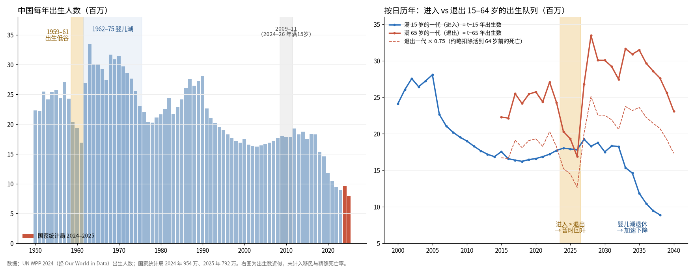
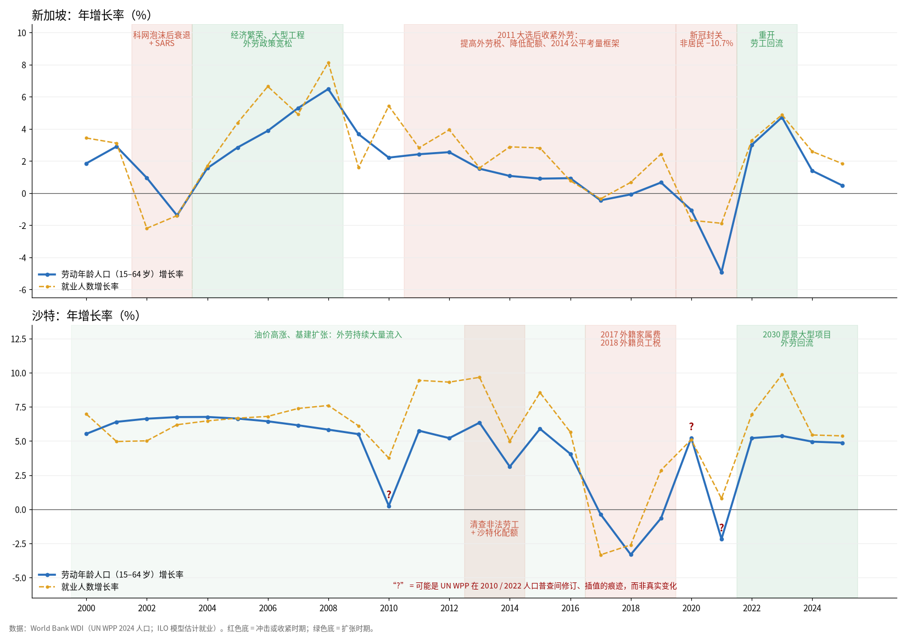

# 劳动人口与人均实际 GDP 增长：14 个经济体比较（2000–2025）

> 制作日期：2026-10-02 ｜ 覆盖：中国、台湾、俄罗斯、韩国、日本、印度、越南、新加坡、加拿大、美国、英国、法国、德国、沙特 ｜ 年份：2000–2025（2025 为目前可得的最新年度）

## 问题

1. 各国**劳动年龄人口**（working-age population）年增长率
2. 各国**实际劳动人口**（考虑劳动参与率与失业率）年增长率
3. 各国**人均实际 GDP** 增长率，以**劳动年龄人口**为除数
4. 各国**人均实际 GDP** 增长率，以**实际劳动人口**为除数（即劳动生产率 labor productivity）

## 口径

| 量 | 定义 |
|---|---|
| 劳动年龄人口 $W$ | 15–64 岁人口 |
| 实际劳动人口 $E$ | 就业人数 $E = L \times (1 - u)$，其中 $L$ 为劳动力（15 岁以上，已体现劳动参与率），$u$ 为失业率 |
| 实际 GDP $Y$ | 不变价 GDP（已扣除通胀） |
| 人均增长率 | $g_{Y/X} = \dfrac{1+g_Y}{1+g_X} - 1$，$X \in \{W, E\}$ |
| 年均复合增长率 | $\left(\dfrac{V_{2025}}{V_{1999}}\right)^{1/26} - 1$ |

注意 $L$ 是 15 岁以上（含 65 岁以上仍在工作者），而 $W$ 是 15–64 岁，所以两者口径不同——这正是图 1 与图 2 差异的信息来源（老年人与女性参与率上升）。

## 结果：2000–2025 年均复合增长率（%）

| | ① 劳动年龄人口 | ② 实际劳动人口 | 实际 GDP | ③ GDP / 劳动年龄人口 | ④ GDP / 实际劳动人口 |
|---|---:|---:|---:|---:|---:|
| 中国 | 0.54 | 0.30 | 8.03 | 7.45 | **7.71** |
| 台湾 | 0.05 | 0.83 | 3.93 | 3.89 | 3.08 |
| 俄罗斯 | −0.31 | 0.43 | 3.27 | 3.59 | 2.83 |
| 韩国 | 0.26 | 1.31 | 3.64 | 3.37 | 2.29 |
| 日本 | **−0.69** | 0.17 | 0.76 | 1.46 | 0.58 |
| 印度 | 1.86 | 1.85 | 6.21 | 4.27 | 4.28 |
| 越南 | 1.47 | 1.57 | 6.38 | 4.84 | 4.74 |
| 新加坡 | 1.64 | 2.36 | 4.76 | 3.07 | 2.34 |
| 加拿大 | 1.03 | 1.43 | 2.08 | 1.05 | 0.65 |
| 美国 | 0.67 | 0.72 | 2.20 | 1.52 | 1.47 |
| 英国 | 0.55 | 0.83 | 1.62 | 1.06 | 0.79 |
| 法国 | 0.25 | 0.81 | 1.33 | 1.08 | 0.52 |
| 德国 | −0.27 | 0.51 | 1.06 | 1.33 | 0.55 |
| 沙特 | **4.28** | **5.56** | 3.89 | −0.37 | **−1.58** |

逐年数据见 [data/processed/](data/processed/)。

## 图表

每张图中，每个经济体一个小图，四张图中各经济体的位置固定（按问题中列出的顺序），便于跨图对照。柱 = 当年增长率；橙色虚线 = 2000–2025 年均复合增长率；灰线 = 其他经济体（对比背景）；超出坐标范围的值以红字标注。右下角为年均增长率排名。

### 1. 劳动年龄人口（15–64 岁）年增长率


### 2. 实际劳动人口（就业人数）年增长率


### 3. 每劳动年龄人口实际 GDP 年增长率


### 4. 每就业人员实际 GDP（劳动生产率）年增长率


## 主要发现

1. **人口红利逆转已经发生。** 日本（−0.69%）、俄罗斯（−0.31%）、德国（−0.27%）在整个时期劳动年龄人口萎缩；台湾（2014 年起，近年约 −1.3%/年）、韩国（2019 年起）转为负增长；中国在 2016–2023 年为负，2024–2025 年 UN 预测值又小幅转正（+0.2–0.3%，主要因为 1959–1961 年出生低谷的一代正在年满 65 岁，退出 15–64 岁区间的人数暂时偏少；1962 年起的生育高峰一代随后跨过 65 岁，下降将重新开始）。只有印度、越南、沙特、新加坡、加拿大保持明显正增长——印度和越南的增速也在逐年放缓（图 1 中呈平滑下降的阶梯）。
2. **就业人数增长普遍快于劳动年龄人口增长。** 日本、德国、俄罗斯、台湾、韩国、法国的 ② 都明显高于 ①：劳动年龄人口在缩，就业人数仍在增长，主要靠女性与老年人劳动参与率上升（以及失业率下降）。中国是例外：② 低于 ①，反映劳动参与率持续下降（教育年限延长、提前退休）。
3. **因此除数的选择会改变"人均"结论。** 对人口老龄化、参与率上升的经济体，③ 明显高于 ④（日本 1.46% vs 0.58%，德国 1.33% vs 0.55%，韩国 3.37% vs 2.29%）：按劳动年龄人口算的人均 GDP 增长，有一部分其实来自"更多人去工作"，而不是"每个工人更有生产力"。④ 才是劳动生产率。
4. **劳动生产率排名：** 中国（7.71%）遥遥领先，其次是越南、印度、台湾、俄罗斯；发达经济体中美国（1.47%）明显高于欧洲与日本（约 0.5–0.8%）。中国的生产率增速自 2007 年峰值（约 13%）以来持续放缓到 5% 左右（图 4）。
5. **沙特是反例：要素投入驱动、而非效率驱动。** 劳动年龄人口与就业人数增长最快（外籍劳工大量流入），但实际 GDP 增长跟不上，每就业人员实际 GDP 年均下降 1.58%；同时受油价与 OPEC+ 减产影响，年度波动极大。
6. **台湾 2025 年**实际 GDP 增长约 8.7%（与 AI 服务器出口热潮相符），带动两种人均口径都达到样本期内最高的几个年度之一。

## 问答

### Q：中国劳动年龄人口的下降在 2020 年前后放缓，近两年甚至转为增长——是生育率回升了吗？

**不是。这是 65 年前三年困难时期出生低谷的“回声”，与当前生育率无关；生育率实际在持续下滑。**

15–64 岁人口的年变化近似为

$$\Delta W_t \approx \underbrace{N_{t-15}}_{\text{满 15 岁进入}} \;-\; \underbrace{s \cdot N_{t-65}}_{\text{满 65 岁退出}} \;-\; \text{期间死亡} \;+\; \text{净迁移}$$

其中 $N_y$ 为 $y$ 年出生人数，$s$ 为活到 64 岁的存活比例（1950–60 年代出生队列约 0.7–0.8，因当年婴幼儿死亡率高）。中国净迁移可忽略。所以**今天出生的人要 15 年后才影响这条曲线**——2024–25 年的变化取决于 2009–10 年与 1959–60 年两代人的规模对比。



| 年份 | 满 15 岁的一代（进入） | 满 65 岁的一代（退出） | 15–64 岁人口增长率 |
|---|---|---|---|
| 2020 | 2005 年生：16.6 百万 | 1955 年生：25.7 百万 | −0.25% |
| 2022 | 2007 年生：17.2 | 1957 年生：27.1 | −0.18% |
| 2023 | 2008 年生：17.7 | 1958 年生：24.3 | −0.11% |
| **2024** | 2009 年生：18.0 | **1959 年生：20.3** | **+0.21%** |
| **2025** | 2010 年生：17.9 | **1960 年生：19.3** | **+0.34%** |
| 2026 | 2011 年生：17.8 | **1961 年生：16.9** | （预计更高） |
| 2027 | 2012 年生：19.2 | **1962 年生：26.8** | 转为下降 |
| 2028 | 2013 年生：18.3 | **1963 年生：33.5** | 大幅下降 |

（出生人数来自 UN WPP 2024。）

- **2016–2023 年**：进入的一代（约 16–18 百万）略少于扣除死亡后的退出一代（约 17–20 百万），所以小幅下降。2020 年前后降幅变小，是因为进入的一代在变大（2005→2008 年生），退出的一代在变小（1957→1959 年生）。
- **2024–2026 年**：退出的恰好是 1959–1961 年出生低谷的一代，退出人数明显少于进入人数，劳动年龄人口暂时增长。
- **2027 年以后**：1962–1975 年婴儿潮（每年 25–33 百万）陆续满 65 岁，而进入的一代只有约 18 百万，下降将骤然加速，增长率可能低于 −1%。这次回升只是暂时的。

**生育率实际在下降。** 国家统计局公布的出生人数：2016 年约 1,786 万 → 2020 年约 1,200 万 → 2023 年 902 万 → 2024 年 954 万（龙年短暂反弹）→ 2025 年 792 万（1949 年以来最低）。总和生育率约 1.0。这些人要到 2031 年以后才进入劳动年龄，届时每年进入人数将从约 18 百万跌到不足 10 百万，劳动年龄人口会从两头同时收缩（见右图蓝线）。

**两点说明：**

1. **2024–25 年的数字是预测值。** UN WPP 2024 在 2023 年以后为中方案预测，但方向主要由已经出生的队列决定，比较可靠。
2. **中国官方口径不同。** 官方常用 16–59 岁作为劳动年龄；按此口径，出生低谷一代在 60 岁退出，即 2019–2021 年，回升出现的时间会比本图早几年，不要与本图直接比较。

### Q：新加坡和沙特的劳动年龄人口增速为什么起伏巨大？和移民政策有关吗？

**是的，主要由外籍劳工政策驱动，同时受经济周期影响。** 两国人口中外籍比例都很高：新加坡约 30% 是非居民，沙特 2022 年人口普查中约 42% 是非沙特人。这些外籍人口绝大多数是凭工作准证入境的劳动年龄人士，有工作才来、没工作就走。因此两国的劳动年龄人口主要随**用工需求与签证政策**变化，而不是随出生人数变化——这与中国那一问中的“出生队列”机制完全不同。



**新加坡（15–64 岁人口年增长率，%）**

| 时期 | 增长率 | 原因 |
|---|---|---|
| 2002–03 | 0.95 → **−1.39** | 互联网泡沫后的衰退，加上 SARS，外籍劳工减少 |
| 2004–08 | 1.6 → **+6.5** | 经济繁荣、综合度假村等大型工程建设，外劳政策宽松，非居民人口快速增加 |
| 2009 | 3.7 | 全球金融危机，增速下滑 |
| 2011–2019 | 2.4 → **≈0** | 2011 年大选后外劳政策明显收紧：提高外劳税、降低外劳配额，2014 年推出公平考量框架 |
| 2020–21 | −1.1 → **−4.9** | 疫情封关。2021 年 6 月非居民人口减少 [10.7%](https://www.population.gov.sg/files/media-centre/publications/population-in-brief-2021.pdf)，总人口降到 545 万 |
| 2022–23 | **+3.0 → +4.7** | 开放边境后，建筑和服务业补充人手，劳工回流 |
| 2024–25 | 1.4 → 0.5 | 回流基本结束，增速回到正常水平 |

背景：新加坡本地居民本身也在老龄化、生育率极低，所以外劳政策一收紧，劳动年龄人口增速就会马上接近零（如 2017–18 年）。

**沙特（15–64 岁人口年增长率，%）**

| 时期 | 增长率 | 原因 |
|---|---|---|
| 2000–2016 | 每年约 **+5～7** | 油价高涨、大规模基建，外籍劳工持续大量进入 |
| 2014 | 3.1（低于前后几年） | 2013 年起清查非法劳工、推行沙特化配额制度，大量非法滞留的外劳离境 |
| **2017–18** | **−0.4 → −3.3** | 2017 年 7 月开始征收外籍家属费，2018 年起再对外籍员工征税，此后逐年加码。官方数据显示 2017 年后至少 [70 万外籍人离境](https://www.middleeasteye.net/news/saudi-levy-foreign-workers-pushes-thousands-leave-country)；另有估计称 2017–2020 年外劳和家属共约 150 万人离开 |
| 2022–25 | 每年约 **+5** | “2030 愿景”大型项目（如 NEOM）开工，外劳重新大量进入 |

**需要注意的数据问题：**

1. **部分剧烈跳动可能来自数据本身，而不是真实变化。** 沙特 2010 年（+0.25%）以及 2020 年 +5.2%、2021 年 −2.2% 的反复（图中标 “?”），很可能是联合国人口估算在 2010 年和 2022 年两次人口普查之间修订、插值留下的痕迹。尤其 2020 年，疫情期间外劳实际上在离境，+5.2% 不太可信。
2. **这些起伏也会影响人均 GDP 图。** 外劳以低技能、低工资为主，大量进入时会拉低“每就业人员 GDP”。所以沙特在图 4 里年均 −1.58%，一部分原因是就业结构在变，不完全代表本地人的生产率在下降。

## 数据来源

| 内容 | 来源 |
|---|---|
| 13 个经济体（除台湾）：15–64 岁人口、劳动力、失业率、不变价 GDP | [World Bank WDI API](https://api.worldbank.org/v2/)（2026-07 更新）：[`SP.POP.1564.TO`](https://data.worldbank.org/indicator/SP.POP.1564.TO)、[`SL.TLF.TOTL.IN`](https://data.worldbank.org/indicator/SL.TLF.TOTL.IN)、[`SL.UEM.TOTL.ZS`](https://data.worldbank.org/indicator/SL.UEM.TOTL.ZS)、[`NY.GDP.MKTP.KD`](https://data.worldbank.org/indicator/NY.GDP.MKTP.KD)。人口源自 UN WPP 2024；劳动力与失业率为 ILO 模型估计；GDP 为 2015 年不变价美元 |
| 台湾：就业人数、不变价 GDP | [IMF World Economic Outlook，2026 年 4 月版（SDMX API）](https://api.imf.org/external/sdmx/2.1/data/IMF.RES,WEO/TWN.LE+LUR+NGDP_R+LP.A)：`LE`、`NGDP_R`。基于主计总处官方统计（2024 年就业 1,160 万人，与[主计总处/央行报告](https://www.cbc.gov.tw/dl-215893-af39cb14b0044d1cb05a60864ec8d1f1.html)一致） |
| 台湾：15–64 岁人口 | [UN WPP 2024，经 Our World in Data](https://ourworldindata.org/grapher/population-by-age-group-with-projections)（总人口 − 65 岁以上 − 15 岁以下） |
| 中国：每年出生人数（问答部分） | [UN WPP 2024，经 Our World in Data](https://ourworldindata.org/grapher/number-of-births-per-year)；2024、2025 年为国家统计局公布数：[954 万](https://weekly.caixin.com/2025-01-25/102283349.html)、[792 万](https://news.sina.cn/gn/2026-01-19/detail-inhhuziz1397767.d.html?vt=4) |
| 新加坡、沙特：政策与事件（问答部分） | [Population in Brief 2021](https://www.population.gov.sg/files/media-centre/publications/population-in-brief-2021.pdf)；[Bloomberg（2021-09）](https://www.bloomberg.com/news/articles/2021-09-28/singapore-population-shrinks-to-5-45m-on-drop-in-foreigners)；[Al Arabiya：沙特外籍家属费（2017-07）](https://english.alarabiya.net/business/economy/2017/07/03/Saudi-Arabia-introduces-new-tax-for-expatriates)；[Middle East Eye：外劳离境](https://www.middleeasteye.net/news/saudi-levy-foreign-workers-pushes-thousands-leave-country)；[Strategic Gears：沙特外籍税分析](https://engine.strategicgears.com/files/Strategic-Gears-Expat-Levy-Report.pdf) |

原始下载文件存放在 [data/raw/](data/raw/)。

## 局限与注意事项

- **台湾与其他经济体口径不完全一致。** 世界银行与 ILO 不收录台湾，因此台湾的就业人数来自官方调查（IMF 转载），而其他 13 国来自 ILO 模型估计；GDP 也分别来自 IMF 与世界银行。增长率可比，绝对水平不可直接比较（本报告只比较增长率）。
- **2024–2025 年数据较新，可能修订。** UN WPP 2024 在 2023 年以后为中方案预测值；ILO 劳动力数据部分为模型估计；IMF 的 2025 年数字可能在后续版本中调整。
- **新加坡、沙特人口包含大量外籍劳工**，随签证与工程项目周期剧烈波动，年度数值噪音较大。
- **2020–2021 年疫情**导致就业与 GDP 的剧烈波动（如英国 2020 年每就业人员 GDP −9.4%、新加坡 2021 年每劳动年龄人口 GDP +16%），单年数值应结合前后年份解读。
- **实际 GDP 以本币不变价计算增长率**，不涉及汇率；不同国家的通胀平减方法（尤其中国、越南等）存在可信度争议，结果仅代表官方统计口径。

## 复现

```bash
# 在本目录下
uv run --no-project --with pandas --with matplotlib python fetch.py     # 可选：重新下载最新数据到 data/raw/
uv run --no-project --with pandas --with matplotlib python analyze.py   # 计算并输出 data/processed/ 与 charts/
uv run --no-project --with pandas --with matplotlib python china_cohorts.py  # 问答部分的中国出生队列图
uv run --no-project --with pandas --with matplotlib python sg_sa_migration.py  # 问答部分的新加坡/沙特政策事件图（需先运行 analyze.py）
```
