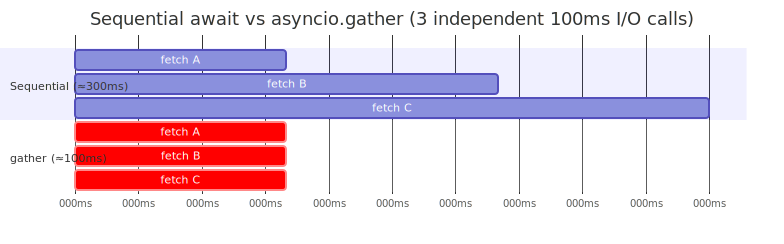

# Daily Reading — 2026-06-09  ✅ finalized

**Today's two readings (diversified):**
1. **CS / Python foundations** — Python concurrency: async/await vs threading *(extends your M01 Ch1 §2 session and is directly actionable on your arena code)*
2. **Frontier AI** — Context engineering for AI agents *(keeps you current; maps to M14 Agentic Systems)*

> Why these: §2 yesterday went deep on **`await` ≠ concurrency** (two sequential `await`s are just
> blocking calls; concurrency needs `gather`/`create_task`). Reading #1 cements that and turns it into
> a refactor pattern you can apply. Reading #2 is the most useful single thing to read right now if you
> build agents — it reframes "prompting" into the discipline that actually governs agent quality.

> **Finalized note:** the two **"What we worked out"** sections at the bottom are the durable takeaways
> from our Q&A — read those first on review; the source summaries above are the supporting detail.

---

## 1. Concurrency in async/await and threading (JetBrains / PyCharm Blog, Jun 2025)

🔗 https://blog.jetbrains.com/pycharm/2025/06/concurrency-in-async-await-and-threading/

**What it covers.** A clean, picture-driven comparison of Python's two concurrency models and when
each one actually helps.

- **Two control mechanisms.** Async/await is *cooperative* — coroutines voluntarily yield at `await`
  ("a microphone passed around the table"). Threading is *preemptive* — the OS decides who runs ("a
  chairperson giving people the floor"). This is exactly the green-thread / event-loop model you
  reconstructed in §2.
- **I/O-bound vs CPU-bound.** Async shines for I/O (DB reads, HTTP, file ops): the worked example
  compresses **3 sequential 5s waits → ~5s total (≈3× speedup)**, no extra hardware. CPU-bound work
  gets *nothing* from async — the core is already busy; you need real parallelism (multiprocessing /
  GPU).
- **The GIL.** Python threads run on a *single* core because of the GIL (the kicker that landed in
  §2). Python 3.13 introduced an experimental free-threaded (no-GIL) build.
- **Cost of each.** Async avoids locks/races because control transfer is *explicit*; threading needs
  `threading.Lock()` and careful synchronization to avoid data corruption.
- **Rule of thumb.** I/O-heavy → async (simpler & faster). True parallelism or legacy blocking code → threading (or processes).

**Connect it to your code (the actionable bit).** The pattern below is the §2 lesson as a refactor.
The profile flagged auditing your **arena turn-handling for sequential `await`s that should fan out**:

```python
# Sequential — each await blocks the next. Total ≈ sum of all latencies.
a = await call_model_a(prompt)
b = await call_model_b(prompt)
c = await fetch_leaderboard()

# Concurrent — independent I/O overlaps. Total ≈ the slowest one.
a, b, c = await asyncio.gather(
    call_model_a(prompt),
    call_model_b(prompt),
    fetch_leaderboard(),
)
```

```mermaid
gantt
    title Sequential await vs asyncio.gather (3 independent 100ms I/O calls)
    dateFormat X
    axisFormat %Lms
    section Sequential (≈300ms)
    fetch A :0, 100
    fetch B :100, 200
    fetch C :200, 300
    section gather (≈100ms)
    fetch A :crit, 0, 100
    fetch B :crit, 0, 100
    fetch C :crit, 0, 100
```

<!-- DIAGRAM:START -->


<details>
<summary>Diagram source (Mermaid)</summary>



</details>
<!-- DIAGRAM:END -->

**One thing the post doesn't stress — read it as a footnote.** Modern code increasingly prefers
**`asyncio.TaskGroup`** (Python 3.11+) over `gather`: if one task fails, the group *cancels the rest*
(structured concurrency), whereas `gather` lets siblings keep running. Use `gather(..., return_exceptions=True)`
when you want all results regardless of individual failures. Reference: [Python docs — Coroutines and Tasks](https://docs.python.org/3/library/asyncio-task.html).

**Questions to pressure-test while you read** (your usual style):
- In the arena, which `await`s are genuinely *independent* (safe to fan out) vs *data-dependent*
  (B needs A's result)? Only the independent ones can overlap.
- If two model calls go to the *same* rate-limited provider, does `gather` actually help, or just
  move the bottleneck? (Hint: think about where the real serialization is.)
- Where would unbounded `gather` over user input become a footgun? (Hint: 10,000 coroutines at once.)

---

## 2. Effective context engineering for AI agents (Anthropic, Engineering Blog)

🔗 https://www.anthropic.com/engineering/effective-context-engineering-for-ai-agents

**What it covers.** The shift from *prompt* engineering (craft one good instruction) to *context*
engineering (curate the **whole** set of tokens — system prompt, tools, examples, history, retrieved
data, memory — that the model sees at inference). For multi-turn agents like yours, this is the
discipline that decides reliability.

- **Context is a finite resource ("context rot").** Recall degrades as the window fills — not a hard
  cliff but a gradient. Rooted in the transformer's n² token-pair attention: every extra token taxes a
  fixed "attention budget." Implication: **fewer, higher-signal tokens beat more tokens.**
- **The four levers.**
  - *System prompt* — aim for the **"right altitude"**: specific enough to steer, not a brittle
    if/else tree; leave room for the model's own heuristics.
  - *Tools* — minimal, non-overlapping, unambiguous. *"If an engineer can't say which tool to use,
    neither can the model."*
  - *Examples* — a few diverse **canonical** ones, not an exhaustive edge-case dump.
  - *History* — actively managed, not just appended.
- **Techniques for long-horizon tasks:**
  - **Compaction** — summarize old history, keep decisions/open threads, drop redundant tool output.
  - **Structured note-taking / memory** — persist state to files *outside* the window; survive context resets.
  - **Just-in-time retrieval** — store light identifiers (paths, queries, IDs), load the heavy data
    only when needed (mirrors how humans don't memorize, they look up).
  - **Sub-agent architectures** — specialist agents do focused work and return *condensed* summaries;
    the orchestrator stays high-level.
- **The one-line principle:** find *"the smallest set of high-signal tokens that maximize the
  likelihood of your desired outcome."*

**Connect it to your work.** Your graph-lite pipeline already makes context decisions implicitly
(what you stuff into each call). This article gives you the vocabulary and the levers to make those
choices *deliberately* — and it's the conceptual on-ramp to **M14 (Agentic Systems)** and **M13 Ch2
(RAG / when retrieval is the wrong tool)**. "Just-in-time retrieval" in particular reframes RAG as one
option among several, not the default.

**Questions to pressure-test while you read:**
- Where does your pipeline pay the "context rot" tax today — long histories? dumped tool output?
- Which of your retrieval calls could become *just-in-time* (pass an ID, fetch on demand) instead of
  pre-loading everything into the prompt?
- Is anything in your system prompt at the *wrong altitude* — brittle rules that a clearer heuristic
  would replace?

---

## What we worked out — async vs threads for model evaluation (multiple LLM calls)

The reframing that mattered: **for LLM calls, the choice is *not* "which one actually overlaps the
waiting" — both do.** The common "GIL ⇒ threads are useless" reflex is wrong here.

- **CPython releases the GIL while a thread is blocked on I/O.** An LLM call is ~99.9% socket-wait,
  ~0.1% CPU. So while thread A waits, it isn't holding the GIL — thread B fires its request. N threads
  ⇒ N real in-flight calls. The GIL only caps **CPU-bound** parallelism, not I/O concurrency.
- So the decision is an **engineering trade-off**, not a concurrency-vs-not one:
  - `asyncio` (async client): coroutine ≈ KB, scales to 1,000s; bound with `asyncio.Semaphore(k)`;
    `gather(return_exceptions=True)` to collect all incl. failures, or `TaskGroup` to cancel siblings
    on first error; first-class timeouts/cancellation. **Default choice when the SDK has an async client.**
  - Threads (`ThreadPoolExecutor` + sync client): thread ≈ ~1 MB each, ceiling ~hundreds; bound via
    `max_workers`; works with **any blocking** client (no async support needed); awkward cancellation;
    needs a lock around shared result state. **Pick when the client is sync-only, the batch is small,
    or each item also does blocking non-async work.**

**Two conclusions you reached by pressure-testing (both refined):**

1. *"If the eval bottleneck is CPU (BLEU / local embeddings between calls), do threads win?"* — Right
   verdict, but one step short. Async **freezes the whole loop** on a non-`await`ing CPU coroutine, so
   threads beat it. **But threads don't parallelize the CPU either** — the GIL still serializes Python
   bytecode on one core; they only **degrade gracefully** (GIL released periodically + on I/O, so the
   LLM calls keep flowing). To actually fix CPU: **escape the GIL** — `ProcessPoolExecutor`/
   `multiprocessing`, **native libs that drop the GIL** (NumPy/PyTorch embeddings often do ⇒ threads
   *can* parallelize those; pure-Python BLEU can't), or GPU. Clean pattern: **async for the LLM I/O +
   `loop.run_in_executor(process_pool, cpu_fn, …)` for the compute** — the §2 "stack→heap / escape the
   constraint" move again.
2. *"async client vs threads on the same rate-limited endpoint — throughput difference? server-side
   optimization for async?"* — **No.** The server can't tell asyncio from threads; the wire requests
   are byte-for-byte identical. **Throughput is identical** at the same concurrency level; the real
   ceiling is the **rate limit (RPM/TPM) + remote latency**, not your client model. Client model only
   changes *local* cost. More concurrency helps **only up to the rate limit** — past it you just earn
   `429`s. (Second-order, client-side only: `httpx` HTTP/2 multiplexing ≠ "server optimizing for async.")

**Net for your evals:** concurrency model is a *local ergonomics/overhead* choice; spend effort on the
**`Semaphore`/`max_workers` level + retry-with-backoff on 429s**, not on async-vs-threads — *unless* CPU
work enters the loop, then reach for processes.

---

## What we worked out — context engineering, applied to *using* coding agents

Your key insight: **context engineering isn't only for *building* agents — every time you structure a
repo, write a plan, or maintain a doc, you're doing context engineering for the *next* agent (Claude /
Cursor) that reads it.** The builder/user line dissolves. Your four practices map almost 1:1 onto the
Anthropic levers:

1. **Plan-first = system prompt at the right altitude.** Unstated decisions (tech stack, algorithm,
   edge cases) get filled by the model's **training-data prior** ("fast, overconfident junior"), not
   yours — so pin them. Extra value: (a) writing the plan forces *you* to resolve hidden unknowns via
   the agent's clarifying questions; (b) it **separates messy exploration context from a clean
   execution context** (why "plan → finalize → fresh execution" beats one long thread); (c) it
   **survives compaction** as externalized memory. Gate on **ambiguity × blast radius** — don't
   over-plan a one-liner.
2. **Structure / names / folder READMEs / `docs/` = retrieval index + just-in-time retrieval.** Good
   path names *are* the index a grep agent navigates by; a folder README compresses "what's here" into
   a few tokens; `docs/` with API contracts + DB schema lets the agent **load** canonical truth instead
   of reverse-engineering it. **Trap: a stale doc is worse than none — the agent trusts it.** Prefer
   **generated-from-source** (OpenAPI from code, schema dumped from the DB); for hand-maintained prose,
   update it in the *same* change that touches the code.
3. **Retrieval — your read is right; the reason Cursor feels faster is architectural, not the model.**
   Claude Code = **agentic grep/glob/read in the loop**, leaning on path semantics → ground-truth,
   exact, no index to maintain/upload, but multi-round-trip (slower) and name-dependent. Cursor =
   **precomputed embedding index**, semantic search outside the Opus loop → one-shot (faster), finds by
   *meaning* even without the name, but **lossy + can be stale**, costs index upkeep, embeds your code.
   The speed comes from **offloading retrieval to a cheap embedding subsystem** (a sub-agent-style move),
   not from Opus. ⇒ Your point-2 name discipline pays off **most with the grep-based agent**.
4. **Compaction — your "background sub-agent summarizes ahead of time" guess is architecturally sound.**
   The instant-vs-slow gap means the work is **amortized or avoided**. The design space:
   (a) synchronous summarize-on-full by the main model = Claude Code's felt latency;
   (b) **background rolling summarization** (your guess, likely a cheaper model);
   (c) **eviction + just-in-time re-retrieval** — don't summarize, drop turns and re-fetch from the
   index (Cursor is uniquely positioned for this *because* of #3);
   (d) hierarchical/incremental summaries. (Cursor's exact mechanism unverified — but it's (b) and/or
   (c).) **Builder lesson: a retrieval layer lets you compact aggressively, because anything dropped can
   be fetched back — retrieval and compaction are two ends of the same memory-management problem.**

**Through-line:** context is a finite budget; the win is always **keep high-signal tokens cheap to find
and low-signal ones out of the window** — via plans (1), names (2), retrieval choice (3), or history
management (4). *(Possible follow-up: a dedicated reading on Cursor vs Claude Code retrieval/compaction
internals, or fold this into M14 Agentic Systems when we reach it.)*

---

## Sources
- [Concurrency in async/await and threading — JetBrains/PyCharm Blog (Jun 2025)](https://blog.jetbrains.com/pycharm/2025/06/concurrency-in-async-await-and-threading/)
- [Coroutines and Tasks — Python 3 docs (`gather`, `create_task`, `TaskGroup`)](https://docs.python.org/3/library/asyncio-task.html)
- [Effective context engineering for AI agents — Anthropic](https://www.anthropic.com/engineering/effective-context-engineering-for-ai-agents)

*Study, then Q&A with me. Say "finalize" when done and I'll rewrite this to match how you actually
think about it + update your learner profile.*
