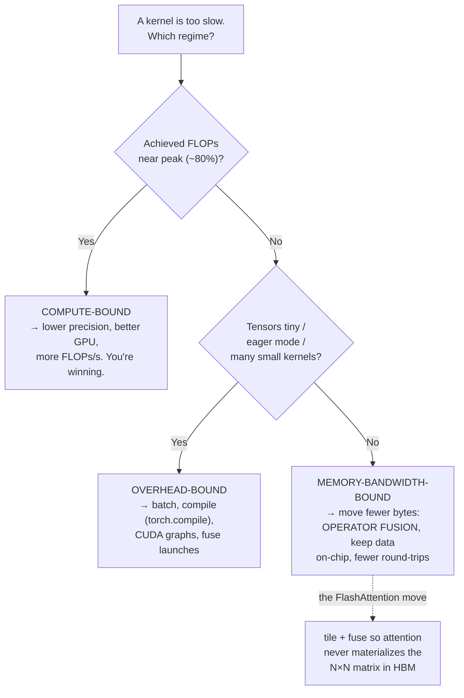

# Daily Reading — 2026-06-10  ✅ finalized

**Today's two readings (diversified):**
1. **AI / systems — from first principles** — *Making Deep Learning Go Brrrr From First Principles* (Horace He) *(directly extends yesterday's M01 Ch1 §3 GPU work, and is the conceptual bridge into M01 Ch2 — Memory)*
2. **Software engineering / career** — *The Next Two Years of Software Engineering* (Addy Osmani, Jan 2026) *(keeps you current; speaks straight to your "full-stack dev **and architect**" goal and your vibe-coding reality)*

> Why these: in §3 you pushed the whole session into **GPU memory hierarchy, latency-hiding, FlashAttention, and why LLM inference is memory-bound**. Reading #1 is the canonical first-principles framework that *names* what you were circling — every kernel is **compute-bound, memory-bandwidth-bound, or overhead-bound** — and gives you the back-of-envelope test to tell which. It's the perfect on-ramp to M01 Ch2 (Memory) and to M12. Reading #2 deliberately switches scope: it's the clearest recent map of how the *engineer's role* shifts as agents do more of the typing — i.e. the job you're actually skilling up for.

> **Finalized note:** the two **"What we worked out"** sections at the bottom are the durable takeaways from our Q&A — read those first on review; the source summaries above are the supporting detail. The big one (#1) is the **energy/power/heat reframing you drove** — the article is all about *time*, you asked what happens when the axis is *joules*.

---

## 1. Making Deep Learning Go Brrrr From First Principles (Horace He, 2022)

🔗 https://horace.io/brrr_intro.html

**Why it's worth your time even though it's from 2022.** It's the standard reference in ML-systems for *reasoning* about performance instead of cargo-culting tricks. The framework predates and explains the tools you now use by default — `torch.compile`, Triton, XLA. It's short, first-principles, and exactly your style (you re-derive, you don't memorize).

**The one idea.** Any deep-learning workload spends its time in exactly one of **three regimes**, and the optimization that helps depends *entirely* on which one you're in:

- **Compute-bound** — time goes to actual FLOPs. The good place: you're using the expensive silicon. More FLOPs/s (better GPU, lower precision) is the only lever.
- **Memory-bandwidth-bound** — time goes to *moving tensors* between global memory (HBM) and the compute units, not computing on them. Adding FLOPs does nothing; you must move **fewer bytes**. ← *this is the LLM-inference-decode regime you reconstructed in §3.*
- **Overhead-bound** — time goes to *everything else*: Python, the framework, kernel-launch costs. Dominates with **tiny tensors / eager mode**.

**The diagnostic (the back-of-envelope you wanted in §3).** Compare your op's **arithmetic intensity** (FLOPs done per byte moved) against the hardware's ratio of `peak FLOPs ÷ memory bandwidth`. He uses an A100: **~19.5 TFLOP/s** of compute vs **~1.5 TB/s** of bandwidth. If your op does few FLOPs per byte (elementwise ops, activations, the decode step reading weights + KV cache), you're **memory-bound** — the compute units sit idle waiting for data.

**The single most impactful technique: operator fusion.** `x.cos().cos()` naively is *read x → write tmp → read tmp → write out* = 4 memory trips. Fused into one kernel it's *read x → write out* = 2 trips → ~2× faster, **for free**, with zero change in FLOPs. Key consequence that surprises people: a fused `x.cos().cos()` costs almost the same as a single `x.cos()` — so for memory-bound chains, *which* cheap elementwise op you pick barely matters; **how many memory round-trips you make is everything.**

**The overhead point that should stick.** GPUs are so much faster than the CPU driving them that "in the time Python performs a *single* FLOP, an A100 could have done ~9.75 million." The only reason eager-mode PyTorch isn't crippled: execution is **asynchronous** — Python races ahead queuing kernels while the GPU chews through earlier ones, *hiding* the overhead — but only while kernels stay big enough to hide behind. Tiny kernels expose it.

**Connect it to your §3 + the next course chapter.**
- This *is* the formal version of "GPU inference is memory-bound" you arrived at. **Decode** = read all the weights + KV cache to produce one token → tiny arithmetic intensity → bandwidth-bound. That's why batching and KV-cache tricks (not faster math) speed up serving.
- **FlashAttention** is literally "memory-bound regime + operator fusion" applied to attention: tile the computation so the N×N attention matrix is *never written to HBM* — it lives in on-chip SRAM. The §3 callback you made (Shared Memory as a software-managed scratchpad) is exactly the mechanism. Paper: [FlashAttention — Dao et al., 2022](https://arxiv.org/abs/2205.14135).
- **Bridge to M01 Ch2 (Memory):** "moving bytes is the bottleneck, not computing on them" is the *same* lesson the CPU cache hierarchy teaches (cache locality, why a cache miss costs ~100× an L1 hit). GPU HBM↔SRAM is the same story one level up. Hold this thought going into Ch2.

**Questions to pressure-test while you read (your usual style):**
- For your arena's LLM serving: is the latency you feel **memory-bound decode** (per-token weight + KV reads) or **overhead-bound** (lots of small calls, framework/Python glue)? The fixes are completely different.
- Operator fusion needs the ops *adjacent and on-device*. Where in a Python pipeline does a `.cpu()` / `.numpy()` / logging call silently break a fusable chain and force a round-trip?
- The A100 ratio is ~13 FLOPs/byte (19.5T ÷ 1.5T). Newer chips push FLOPs up faster than bandwidth. Does that make memory-boundedness **better or worse** over time — and what does that imply for where the industry spends effort (quantization, KV-cache compression, batching)?

---

## 2. The Next Two Years of Software Engineering (Addy Osmani, Jan 5 2026)

🔗 https://addyosmani.com/blog/next-two-years/

**What it covers.** A calm, scenario-based read (not hype) on how the engineer's job changes as coding agents move from autocomplete → autonomous task execution. Osmani frames **five open questions** as "lenses for preparation," giving an optimistic and a pessimistic branch for each rather than firm predictions. This is the macro context for *why* your upskilling plan is shaped the way it is.

- **Junior hiring** — pressure on pure entry-level "typing" work; the bar rises to "immediately useful" (AI-fluent + domain knowledge + communication).
- **Skills & understanding** — the real risk is **atrophy**: leaning on AI so hard you can't judge its output. The counter: humans own the hard 20% — architecture, edge cases, design. His line worth keeping: *"the best engineers won't be the fastest coders, but those who know when to distrust AI."*
- **Developer role** — shift from *author* to **"composer"**: orchestrating agents/services, owning the architecture and the verification, not the keystrokes.
- **Specialist vs generalist** — **T-shaped** wins: one deep area + broad adaptability. Narrow-only niches are the most automatable.
- **Education** — credentials matter less than demonstrated, end-to-end ability (portfolios, real systems).

**Connect it to *you* specifically — this article is almost a mirror of your plan.**
- Your stated method — *"I'll keep vibe coding; what I need is to **read and judge** code with AI help"* — is exactly the "knows when to distrust AI" skill Osmani says becomes the differentiator. Your whole course track (fundamentals → reading code → testing → types → architecture) is the **anti-atrophy** curriculum.
- "Author → composer" *is* the **architect** goal in your profile. The high-leverage move isn't typing faster; it's owning system design + verification — which is why M07 (Architecture) and M06 (Testing) carry so much weight in your plan.
- "T-shaped" reframes your interleaved sequence: your **deep spike** is forming (AI/LLM + the GPU-systems intuition you keep showing); the breadth (CS fundamentals, networking, DB, cloud, security, frontend) is the horizontal bar this plan is deliberately building.

**Questions to pressure-test while you read:**
- Osmani's biggest risk is *skill atrophy from over-trusting AI*. Concretely: where in your current workflow do you **ship AI output you can't fully verify** — and which course module is the direct antidote to that specific blind spot?
- "Composer / orchestrator" sounds like the agent pipelines you already build. Is the future-engineer skill therefore *less* novel for you than for most — i.e. is **agent orchestration** quietly one of your spikes already, per yesterday's "applied context engineering" signal?
- If junior "implementation" work compresses, what's the **fastest-depreciating** skill in your stack, and the **slowest** — and is your study time allocated accordingly?

---

## What we worked out — the same framework on the *energy* axis (you drove this)

Operator fusion was the new piece for you; you understood the rest, then flipped the article from **time** to **energy/power/heat** — your physics/failure-analysis lens. The reframing that mattered:

**The one fact:** a FLOP is nearly free; the joules are in *moving the bytes*. Horowitz's ladder (45 nm, order-of-magnitude): FP add ≈ 0.9 pJ · FP mult ≈ 3.7 pJ · on-chip SRAM read ≈ 5 pJ · 10 mm wire ≈ 26 pJ · **off-chip DRAM/HBM read ≈ 640 pJ**. So a DRAM fetch costs **~600–1000× a FLOP** — the energy bill is a *data-movement* bill, even more lopsidedly than the time bill. And the trend is *worse* in energy: per-FLOP energy keeps falling with each node, per-byte-moved energy barely does (same "compute outruns memory" asymmetry as the time roofline, starker).

**The regimes remap cleanly:**
- **Compute-bound = the *most energy-efficient* place** — high arithmetic intensity means the expensive DRAM read is amortized over many cheap FLOPs.
- **Memory-bandwidth-bound = the energy-*wasteful* regime** — haul weights from HBM, do a trickle of math, discard. This is LLM **decode**: not just slow, but power-hungry per useful token.
- **Overhead-bound = doubly bad** — the GPU sits idle *but still burns power* (leakage/static).

⇒ **Operator fusion and FlashAttention are energy wins for the *same* reason they're speed wins** — they delete HBM round-trips, and each deleted trip saves ~1000× the energy of the math. **Arithmetic intensity (FLOPs/byte) is the master lever for *both* speed and perf/watt** — which is *why* the industry converges on it.

**The one genuine divergence (the keeper):** **time is governed by the `max`; energy by the `sum`.** In time, compute and memory transfers *overlap* — wall-clock ≈ `max(compute_time, mem_time)`, so the smaller one is hidden (that's the whole roofline). Energy has **no hiding**: `E ≈ E_compute + E_movement + P_static·time` — you pay joules for every FLOP *and* every byte regardless of overlap. So an optimization that's "free" in time (hidden behind something slower) can still cost real power. **The roofline can mislead you about energy.**

**Three levers energy adds that the time article doesn't foreground:**
1. **Static/leakage power** → "overhead-bound" is worse in joules than seconds (paying to keep idle silicon hot). Motivates batching/high utilization, and **"race to idle"** (finish fast, power-gate — the `P_static·time` term shrinks with time even though the dynamic work-energy doesn't).
2. **The cubic wall:** `P ∝ C·V²·f`, and higher `f` needs higher `V` ⇒ power scales ~`f³`. So **slow-and-wide beats fast-and-narrow** — the deep reason a GPU (thousands of slow lanes) crushes a CPU (few 5 GHz cores) on perf/watt. Ties straight back to §3 latency-hiding-via-parallelism.
3. **Precision is a double win:** multiplier energy ~ (mantissa bits)², movement ~ bits (linear). FP16/FP8/INT8 cut compute energy quadratically *and* move fewer bytes ⇒ pushes the memory-bound decode regime back toward efficiency.

**Heat = the same joules, plus a feedback loop.** ~100% of the electrical energy becomes heat, so power ≈ heat. Two things your old world already knows: (a) it's **spatial** — data-movement-heavy work lights up the **memory controllers / HBM stacks / interconnect**, not just the compute core → hotspots in exactly the structures the FLOPs-spec ignores (electromigration, thermal cycling). (b) **Thermal feedback couples energy back to performance** — leakage rises with temperature, and chips **thermally throttle** (`f`↓) when hot, sliding you back along the time roofline. So energy → heat → throttle → speed: the two axes aren't independent; they close a loop.

**The synthesis:** speed and energy point the *same direction* (max arithmetic intensity, fuse to kill data movement) because data movement dominates both — but energy adds three knobs time hides (leakage/idle, the V²f cubic wall, the precision-squared win) and reframes the goal from *"hide the slow part"* to *"don't **do** the expensive part, because joules don't overlap away."* *(Possible follow-ups you flagged interest in: why on-package HBM is fundamentally an energy-per-bit move via wire length → capacitance; a back-of-envelope on the energy to generate one token.)*

---

## What we worked out — Osmani vs. your actual plan

You checked whether your **course track** is following the article's advice. Verdict: **yes, almost point-for-point** —

| Osmani's "practical takeaways for aspiring architects" | Your plan |
|---|---|
| Learn complementary skills: system design, cloud, DevOps, security | M07 · M08 · M09 · M10 — *literally his list* |
| Own the hard 20% (architecture, design) | M07 (architect goal) · M04 decomposition |
| "Know when to distrust AI" (verification) | M04 Ch1 · M05 types · M06 testing |
| Understand the underlying logic, don't just accept AI output | M01–M03 fundamentals |
| T-shaped: deep spike + broad base | interleaved breadth + your AI/LLM spike (M12–M15) |
| Author → **composer** / orchestrate agents | M14 Agentic Systems |

**Two things that came out of it:**
1. **The alignment is *convergent*, not copied.** The plan was built 2026-06-08 from your own profile/gaps, *before* you read this. Two independent routes — your self-assessment and a frontier-watcher's forecast — landed on the same destination. That's the reassuring signal.
2. **You're *ahead* on the "composer" shift, not catching up.** Most engineers must grow into orchestrating agents; you already build framework-less agent pipelines (+ yesterday's "applied context engineering" signal). That's a real edge, worth leaning into.

**The honest watch-item (curriculum level):** Osmani's core skill — "know when to distrust AI" — is a *doing*-skill that cashes out in your two weakest areas (**testing, types, reading diffs critically**). The plan front-loads the *understand* half and parks the *build/demonstrate* half in Phase 6. Concept-first is right for how you learn — but the lever to pull if it ever feels too theoretical is to **pull real-code application (your arena/aquarium) forward** instead of waiting for the capstone. The reflection that stuck: *of the five shifts, which am I closing by reading vs. by doing?*

---

## Sources
- [Making Deep Learning Go Brrrr From First Principles — Horace He (2022)](https://horace.io/brrr_intro.html)
- [FlashAttention: Fast and Memory-Efficient Exact Attention with IO-Awareness — Dao et al. (2022)](https://arxiv.org/abs/2205.14135)
- [The Next Two Years of Software Engineering — Addy Osmani (Jan 2026)](https://addyosmani.com/blog/next-two-years/)

*Finalized 2026-06-10. The two "What we worked out" sections are the durable record — the energy reframing (#1) is the part you'll want on review.*
