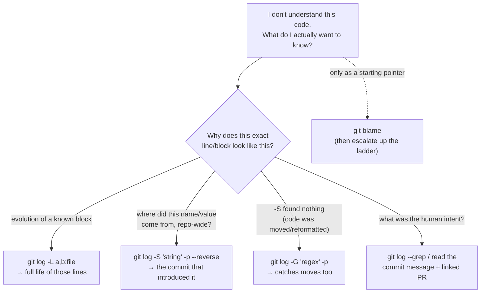

# Daily Reading — 2026-06-11

**Today's two readings (diversified — deliberately *not* AI/GPU this time):**
1. **CS / tooling** — Git as a *reading & history* tool: `blame` → `log -L` → the pickaxe (`-S` / `-G`) *(this is the entry queued from your M04 Ch1 §1 session — the one confirmed gap there)*
2. **Software engineering / architecture** — *A Philosophy of Software Design* (Ousterhout): deep vs shallow modules, fighting complexity *(your #1 actionable gap — monolithic files — and the core architect skill)*

> Why these, and why the pivot: the last two reading days (concurrency+agents, GPU+career) leaned hard into AI/systems — your spike. Today rebalances onto the **horizontal bar** of your T: a tool gap you explicitly flagged (git history) and the single most-cited gap in your profile (code decomposition / modularity). Both are *understanding*-skills, not typing-skills — which is exactly the lane you said you want to grow in. Reading #1 turns git from "save button" into a code-comprehension instrument; reading #2 gives you the vocabulary to *name why* a 2,400-line file is bad and what "better" actually means.

---

## 1. Stop using `git blame` to understand code — use the pickaxe

🔗 **Primary:** [Patterns for searching Git revision histories — Tekin Süleyman (2020)](https://tekin.co.uk/2020/11/patterns-for-searching-git-revision-histories)
🔗 **Mental-model companion (read first if internals feel fuzzy):** [Inside `.git` — Julia Evans (2024)](https://jvns.ca/blog/2024/01/26/inside-git/)
🔗 **Reference (for the flags):** [`git log` documentation](https://git-scm.com/docs/git-log)

**The gap this closes.** In your M04 §1 session you confirmed you *know* `git log` / `git blame` exist but don't reach for them when reading unfamiliar code. This reading is the "feature survey, not command memorization" you asked for — it gives you a **ladder of history tools** and, crucially, *when each one is the right one*.

**The one argument.** `git blame` answers "who last touched this line" — which is almost never the question you actually have. Tekin's three reasons it fails as a comprehension tool:
- **Too coarse** — it reports the *whole line*; if the last change was a rename or reformat, the real "why" is buried one commit deeper.
- **Too shallow** — it shows only the *single most recent* change, not the evolution.
- **Too narrow** — it only looks at *the file you ran it on*, so code that moved here from elsewhere looks like it was "born" in the move commit.

**The ladder (this is the keeper).** Each rung answers a deeper question:

| Tool | The question it answers |
|---|---|
| `git blame <file>` | "Who/what last changed this line?" (the shallow default) |
| `git log -L <start>,<end>:<file>` | "Show me the **whole life** of *these specific lines*" — every commit that touched that range, with diffs. The blame-killer for "how did this block evolve?" |
| `git log -S "<string>" -p` | **The pickaxe.** "When did this string (a function name, a constant, a config key) **first appear or get deleted** across the *entire repo*?" Add `--reverse` to jump straight to its **introduction**. |
| `git log -G "<regex>" -p` | Like `-S` but regex, and it **also catches lines that merely *moved*** (pickaxe `-S` only fires on net add/remove of an occurrence). Use when `-S` comes up empty. |
| `git log --grep "<text>"` | Search **commit messages**, not code — find the PR/ticket discussion. |



**The example that makes it click (from the article).** You find a weird `method_name`. `git blame` says "Alice, refactor, 3 months ago" — useless, it was just a rename. Instead: `git log -S "method_name" -p --reverse` walks you to the *original* commit that introduced it — often 2 years and 5 moves ago — with the diff and message explaining **why**. That's the answer you wanted.

**Why the companion link matters.** The pickaxe feels like magic until you see git's data model (Julia Evans, *Inside .git*): every commit is a tiny file pointing to a **tree** (a directory snapshot) pointing to **blobs** (file contents); branches/tags are just text files holding one commit ID; `git cat-file -p <hash>` lets you read any of it raw. Once you see that history is an immutable chain of content snapshots, "search the whole chain for a string" stops being mysterious — it's the natural query over that structure.

**Connect it to *you* specifically.**
- Your **eval-repo onboarding case** (M04 §1): you found "copy-paste inheritance" — class A silently holding a *copy* of class B instead of inheriting. `git log -S "<the duplicated method signature>"` would show you *both* birthplaces and likely the moment the copy diverged — archaeology that docstring-scaffolding alone won't surface.
- Your **vibe-coding reality**: when an agent writes code you don't fully understand and you merge it, the *why* lives in the commit/PR, not the code. Disciplined commit messages + `git log --grep` turn your own history into the context layer (this is the **"context engineering for the next agent"** insight from 06-09, applied to git: a good commit message is a high-signal token your future self and your next agent both retrieve).
- Your **environment-leakage case**: `git log -S "<the hardcoded path>"` finds every step that baked in its own assumption — fast way to map the blast radius before refactoring config up a level.

**Questions to pressure-test while you read (your style):**
- `-S` counts *occurrences*; `-G` matches *the diff text*. Construct a case where a one-line edit changes the code but `-S "foo"` stays silent while `-G "foo"` fires. (Hint: the count of `foo` didn't change.)
- `git log -L` needs start/end line numbers — but lines drift over history. How does git *track* a line range backwards across edits, and where would that tracking break?
- If history was rewritten (squash-merge, rebase), the pickaxe finds the *squashed* commit, not the original authoring step. Does your team's merge strategy help or hurt code archaeology — and is that a reason to keep PR links in commit messages?

---

## 2. A Philosophy of Software Design — deep modules & the war on complexity

🔗 **Primary:** [*A Philosophy of Software Design* — review by Gergely Orosz, The Pragmatic Engineer](https://blog.pragmaticengineer.com/a-philosophy-of-software-design-review/)
🔗 **Quick concept refs:** [Software Design: Deep Modules (dev.to)](https://dev.to/gosukiwi/software-design-deep-modules-2on9) · [Pragmatic Engineer interview with Ousterhout](https://newsletter.pragmaticengineer.com/p/the-philosophy-of-software-design)

**Why this, for you.** Your profile's **#1 actionable gap** is code decomposition/modularity — `process_no_waiting.py` at 2,434 LoC, `ArenaPage.jsx` at 3,270 LoC. Ousterhout's book is the canonical, *opinionated* framework for exactly this, and it's short and principle-driven (your style: re-derive, don't memorize). It also feeds the **architect** goal directly — this is what "owning the hard 20%" (Osmani, yesterday) actually consists of.

**The one thesis.** The fundamental limit on building large software is **our ability to understand it**. So design = **fighting complexity**. Everything else is downstream of that.

**What "complexity" actually is (the three symptoms — learn to name them):**
- **Change amplification** — one conceptual change forces edits in many places. (A 3,270-line component is a change-amplification machine.)
- **Cognitive load** — how much you must hold in your head to make a safe change.
- **Unknown unknowns** — the worst kind: *you can't even tell* what a change might break, or which code matters. Obscurity's endgame.

**The central tool: deep modules.** A module's value is **functionality buried ÷ interface exposed**.
- **Deep module** = *simple interface, lots hidden behind it.* The canonical example: Unix file I/O — `open/read/write/seek/close` is five calls hiding buffering, permissions, on-disk layout, device drivers, concurrent access. Enormous power, tiny surface.
- **Shallow module** = *interface nearly as complex as the implementation.* It costs you cognitive load to learn but hides almost nothing. A class with fifteen public methods that are all thin pass-throughs is shallow — it's *negative* value once you count the cost of understanding its interface.

> The counter-intuitive punchline: **more, smaller classes is not automatically better.** "Classitis" — chopping things into many shallow classes — *increases* total interface surface and can make a system harder to understand, not easier. Decomposition is about **depth**, not just line count. (Important nuance for you: the fix for your 2,400-line monolith isn't "split into 24 files of 100 lines" — it's "find the *deep seams*" where a simple interface hides a lot.)

```mermaid
quadrantChart
    title Module depth = functionality hidden vs. interface exposed
    x-axis "Simple interface" --> "Complex interface"
    y-axis "Hides little" --> "Hides a lot"
    quadrant-1 "Shallow & costly (avoid)"
    quadrant-2 "DEEP — the goal"
    quadrant-3 "Trivial (fine, but minor)"
    quadrant-4 "Worst: complex interface, hides nothing"
    "Unix file I/O": 0.15 0.9
    "Thin pass-through class": 0.45 0.15
    "2400-line god-module": 0.9 0.85
    "Well-named pure util": 0.2 0.25
```
*(The 2,400-line module is high-functionality but also high-interface — it leaks its internals everywhere it's used. The move is to push it left: same power, smaller surface.)*

**Other ideas worth carrying (each is a one-liner you can apply):**
- **Information hiding vs. information leakage.** A design decision that shows up in *multiple* modules is leakage — change one, chase the rest. Hide each decision behind one module.
- **"Define errors out of existence."** The deepest API isn't the one with great error handling — it's the one where the error *can't happen*. (His example: redefine an operation's semantics so the edge case is just normal behavior — e.g. deleting a non-existent thing is a no-op, not an exception.) **Directly relevant to your "LLM reliability" gap**: instead of three layers of JSON-parse fallback, can you design the call so malformed output is structurally impossible (schema-constrained / tool-call output)?
- **Strategic vs. tactical programming.** Tactical = "just make it work now," accreting complexity. Strategic = invest ~10–20% extra continuously in design. The **"tactical tornado"** — the dev who ships fast and leaves a mess — is an anti-pattern. *This is the single most important frame for vibe-coding:* an agent is a tactical tornado by default; **your job is to supply the strategic layer it lacks.**
- **Comments as design.** Ousterhout argues comments capture intent the code *can't* express; if something is hard to comment, that's a design smell. (Orosz pushes back — prefers comments as "invitations to refactor." Worth forming your own view; you like comparative framing.)

**Connect it to *you* specifically.**
- This is the **diagnostic language** your decomposition gap has been missing. Next time you look at `ArenaPage.jsx`, ask: *which design decisions leak across this file? where is the deep seam — a simple interface that could hide a big chunk?* That's a sharper question than "this file is too long."
- **Strategic-vs-tactical is your vibe-coding governance model.** You merge AI output fast (tactical). The architect move (your goal) is deciding *where* to spend the strategic 15% — and it's exactly your weak areas: module boundaries, interfaces, the verification layer (ties to Osmani's "know when to distrust AI").
- "Define errors out of existence" reframes **reliability**: design the failure away > handle it. A through-line into M05 (types — make illegal states unrepresentable) and M06 (testing).

**Questions to pressure-test while you read:**
- Ousterhout says *more classes can be worse*. That clashes with the usual "small files / SRP" advice. Where's the real boundary — when does splitting reduce complexity vs. just relocate it into more interfaces? Test it against your own monolith: is the right fix fewer-but-deeper modules, not simply *more* files?
- "Define errors out of existence" vs. defensive programming / fail-fast — when does designing-the-error-away become *hiding* a real failure you needed to see? (Your physics instinct: a silenced signal vs. a removed cause.)
- Map your two repos onto the deep/shallow quadrant. Which modules are *shallow* (high interface cost, low hidden value) — i.e. the ones to merge or deepen, not the ones to split further?

---

## Sources
- [Patterns for searching Git revision histories — Tekin Süleyman (2020)](https://tekin.co.uk/2020/11/patterns-for-searching-git-revision-histories)
- [Inside `.git` — Julia Evans (2024)](https://jvns.ca/blog/2024/01/26/inside-git/)
- [`git log` documentation (`-S`, `-G`, `-L`, `--grep`)](https://git-scm.com/docs/git-log)
- [A Philosophy of Software Design — review, Gergely Orosz / The Pragmatic Engineer](https://blog.pragmaticengineer.com/a-philosophy-of-software-design-review/)
- [Software Design: Deep Modules — dev.to](https://dev.to/gosukiwi/software-design-deep-modules-2on9)
- [The Philosophy of Software Design — interview with John Ousterhout, Pragmatic Engineer](https://newsletter.pragmaticengineer.com/p/the-philosophy-of-software-design)

*Study, then Q&A with me. Say "finalize" when done and I'll rewrite this to match how you actually think about it + update your learner profile.*
