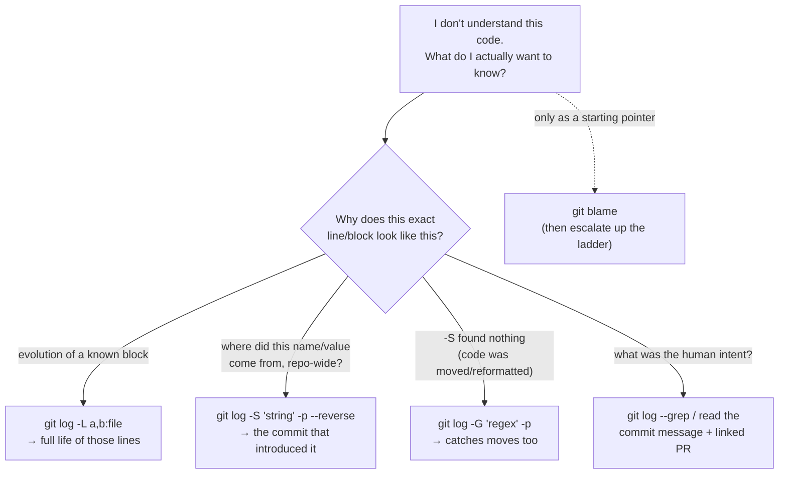
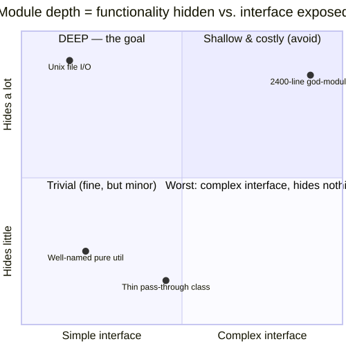
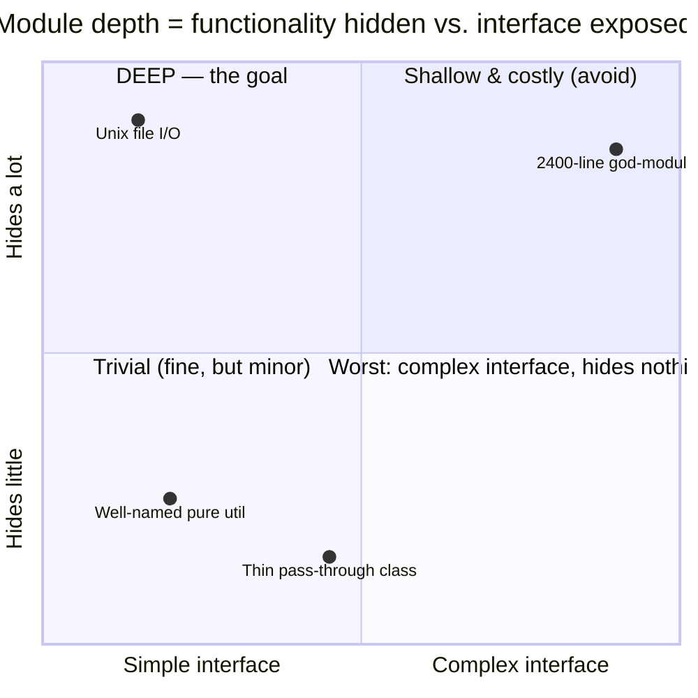

# Daily Reading — 2026-06-11  ✅ finalized

**Today's two readings (diversified — deliberately *not* AI/GPU this time):**
1. **CS (computer science) / tooling** — Git as a *reading & history* tool: `blame` → `log -L` → the pickaxe (`-S` / `-G`) *(this is the entry queued from your M04 Ch1 §1 session — the one confirmed gap there)*
2. **Software engineering / architecture** — *A Philosophy of Software Design* (Ousterhout): deep vs shallow modules, fighting complexity *(your #1 actionable gap — monolithic files — and the core architect skill)*

> Why these, and why the pivot: the last two reading days (concurrency+agents, GPU+career) leaned hard into AI/systems — your spike. Today rebalances onto the **horizontal bar** of your T: a tool gap you explicitly flagged (git history) and the single most-cited gap in your profile (code decomposition / modularity). Both are *understanding*-skills, not typing-skills — which is exactly the lane you said you want to grow in. Reading #1 turns git from "save button" into a code-comprehension instrument; reading #2 gives you the vocabulary to *name why* a 2,400-line file is bad and what "better" actually means.

> **Finalized note:** the **"What we worked out"** section after reading #1 is the durable takeaway — read it first on review. It's the strong thread from our Q&A: the **past-vs-present epistemic split** in delegating code questions to agents, and why **"safe to remove" is a universal-negative you must *falsify*, not accept.** Reading #2 you deliberately chose to **skim, not master** — it's logged below as a *primer for M04 Ch2 (Decomposition)*, with the three keepers worth carrying now.

---

## 1. Stop using `git blame` to understand code — use the pickaxe

<b>Vocabulary for this section</b> — every term, flag and abbreviation used below (click to expand)

**Abbreviations**

| Short | Stands for | Meaning |
|---|---|---|
| **PR** | pull request | the proposed-change unit on GitHub-style hosts, where the review discussion lives |
| **I/O** | input/output | reading and writing data outside the program |
| **LLM** | large language model | the text model an agent is built on; used here for the "next agent that reads your commits" |

**Terms**

| Term | Definition |
|---|---|
| **Git** | the version-control system that stores a project's full history as a chain of snapshots |
| **Commit** | one recorded change, with an author, a message and a pointer to the whole tree at that moment |
| **Commit message** | the human-written note attached to a commit; usually the only record of *why* |
| **`git blame`** | shows, for each line, the last commit that touched it — and nothing before that |
| **`git log`** | lists commits; the base command all the search flags below attach to |
| **`git log -L <start>,<end>:<file>`** | the full history of one line range: every commit that touched it, with diffs |
| **Pickaxe (`-S`)** | searches all of history for commits that changed *how many times* a string appears — i.e. introduced or deleted it |
| **`-G <regex>`** | like the pickaxe but matches the diff text with a regular expression, so it also catches lines that merely moved |
| **`--reverse`** | lists matching commits oldest-first, so the introducing commit is the first result |
| **`-p`** | prints the patch (the diff) alongside each matching commit |
| **`--grep`** | searches the *commit messages*, not the code |
| **Regex (regular expression)** | a pattern language for matching text |
| **Diff** | the line-by-line difference between two versions of a file |
| **Blob** | in git's data model, the stored contents of one file |
| **Tree** | in git's data model, a snapshot of a directory: names pointing at blobs and sub-trees |
| **Branch / tag** | a small file holding one commit ID — a movable (branch) or fixed (tag) label |
| **`git cat-file -p <hash>`** | prints any raw git object, which is how you see that the data model really is just blobs and trees |
| **Immutable** | never modified in place; a new state is a new object, which is why history can be searched |
| **Rebase** | replaying commits onto a new base, rewriting them in the process |
| **Squash-merge** | collapsing a branch's commits into a single commit, discarding the individual authoring steps |
| **Merge strategy** | the team's chosen way of integrating branches — and therefore how much history survives |
| **Refactor / rename** | changing code's structure or names without changing behaviour; the noise that defeats `blame` |
| **Copy-paste inheritance** | duplicating a class's methods instead of inheriting, so the two copies silently diverge |
| **Method signature** | a method's name and parameters — a good pickaxe search string |
| **Docstring scaffolding** | adding generated documentation to unfamiliar code as a way in |
| **Blast radius** | how much else a change can break |
| **Vibe coding** | working mainly by prompting an AI and steering the result rather than writing the code yourself |
| **Context engineering** | curating what an agent sees; here, commit messages as high-signal context for the next reader |
| **High-signal token** | a small amount of text that carries a lot of the meaning — what you want in a commit message |

🔗 **Primary:** [Patterns for searching Git revision histories — Tekin Süleyman (2020)](https://tekin.co.uk/2020/11/patterns-for-searching-git-revision-histories)
🔗 **Mental-model companion (read first if internals feel fuzzy):** [Inside `.git` — Julia Evans (2024)](https://jvns.ca/blog/2024/01/26/inside-git/)
🔗 **Reference (for the flags):** [`git log` documentation](https://git-scm.com/docs/git-log)

**The gap this closes.** In your M04 §1 session you confirmed you *know* `git log` / `git blame` exist but don't reach for them when reading unfamiliar code. This reading is the "feature survey, not command memorization" you asked for — it gives you a **ladder of history tools** and, crucially, *when each one is the right one*.

**The one argument.** `git blame` answers "who last touched this line" — which is almost never the question you actually have. Tekin's three reasons it fails as a comprehension tool:
- **Too coarse** — it reports the *whole line*; if the last change was a rename or reformat, the real "why" is buried one commit deeper.
- **Too shallow** — it shows only the *single most recent* change, not the evolution.
- **Too narrow** — it only looks at *the file you ran it on*, so code that moved here from elsewhere looks like it was "born" in the move commit.

**The ladder (this is the keeper).** Each rung answers a deeper question:

| Tool | The question it answers |
|---|---|
| `git blame <file>` | "Who/what last changed this line?" (the shallow default) |
| `git log -L <start>,<end>:<file>` | "Show me the **whole life** of *these specific lines*" — every commit that touched that range, with diffs. The blame-killer for "how did this block evolve?" |
| `git log -S "<string>" -p` | **The pickaxe.** "When did this string (a function name, a constant, a config key) **first appear or get deleted** across the *entire repo*?" Add `--reverse` to jump straight to its **introduction**. |
| `git log -G "<regex>" -p` | Like `-S` but regex, and it **also catches lines that merely *moved*** (pickaxe `-S` only fires on net add/remove of an occurrence). Use when `-S` comes up empty. |
| `git log --grep "<text>"` | Search **commit messages**, not code — find the PR/ticket discussion. |

<!-- DIAGRAM:START -->

Diagram source (Mermaid)

```mermaid
flowchart TD
    Q["I don't understand this code.<br/>What do I actually want to know?"] --> A{"Why does this exact<br/>line/block look like this?"}
    A -- "evolution of a known block" --> L["git log -L a,b:file<br/>→ full life of those lines"]
    A -- "where did this name/value<br/>come from, repo-wide?" --> S["git log -S 'string' -p --reverse<br/>→ the commit that introduced it"]
    A -- "-S found nothing<br/>(code was moved/reformatted)" --> G["git log -G 'regex' -p<br/>→ catches moves too"]
    A -- "what was the human intent?" --> M["git log --grep / read the<br/>commit message + linked PR"]
    Q -. "only as a starting pointer" .-> B["git blame<br/>(then escalate up the ladder)"]
```

<!-- DIAGRAM:END -->

**The example that makes it click (from the article).** You find a weird `method_name`. `git blame` says "Alice, refactor, 3 months ago" — useless, it was just a rename. Instead: `git log -S "method_name" -p --reverse` walks you to the *original* commit that introduced it — often 2 years and 5 moves ago — with the diff and message explaining **why**. That's the answer you wanted.

**Why the companion link matters.** The pickaxe feels like magic until you see git's data model (Julia Evans, *Inside .git*): every commit is a tiny file pointing to a **tree** (a directory snapshot) pointing to **blobs** (file contents); branches/tags are just text files holding one commit ID; `git cat-file -p <hash>` lets you read any of it raw. Once you see that history is an immutable chain of content snapshots, "search the whole chain for a string" stops being mysterious — it's the natural query over that structure.

**Connect it to *you* specifically.**
- Your **eval-repo onboarding case** (M04 §1): you found "copy-paste inheritance" — class A silently holding a *copy* of class B instead of inheriting. `git log -S "<the duplicated method signature>"` would show you *both* birthplaces and likely the moment the copy diverged — archaeology that docstring-scaffolding alone won't surface.
- Your **vibe-coding reality**: when an agent writes code you don't fully understand and you merge it, the *why* lives in the commit/PR, not the code. Disciplined commit messages + `git log --grep` turn your own history into the context layer (this is the **"context engineering for the next agent"** insight from 06-09, applied to git: a good commit message is a high-signal token your future self and your next agent both retrieve).
- Your **environment-leakage case**: `git log -S "<the hardcoded path>"` finds every step that baked in its own assumption — fast way to map the blast radius before refactoring config up a level.

**Questions to pressure-test while you read (your style):**
- `-S` counts *occurrences*; `-G` matches *the diff text*. Construct a case where a one-line edit changes the code but `-S "foo"` stays silent while `-G "foo"` fires. (Hint: the count of `foo` didn't change.)
- `git log -L` needs start/end line numbers — but lines drift over history. How does git *track* a line range backwards across edits, and where would that tracking break?
- If history was rewritten (squash-merge, rebase), the pickaxe finds the *squashed* commit, not the original authoring step. Does your team's merge strategy help or hurt code archaeology — and is that a reason to keep PR links in commit messages?

---

## 2. A Philosophy of Software Design — deep modules & the war on complexity

<b>Vocabulary for this section</b> — every term and abbreviation used below (click to expand)

**Abbreviations**

| Short | Stands for | Meaning |
|---|---|---|
| **LoC** | lines of code | the crude size measure used for the two monolithic files |
| **API** | application programming interface | the set of calls a module or service exposes to its users |
| **I/O** | input/output | reading and writing data outside the program; the Unix file calls are the canonical example |
| **JSON** | JavaScript Object Notation | the text data format an LLM is often asked to emit, and which often comes back malformed |
| **LLM** | large language model | the text model whose unreliable output motivates the "design the error away" move |
| **SRP** | single responsibility principle | the common advice that a class should do one thing — the advice Ousterhout partly disputes |

**Terms**

| Term | Definition |
|---|---|
| **Software design** | deciding what the pieces of a system are and what each one hides — as opposed to writing the lines |
| **Complexity** | anything about a system's structure that makes it hard to understand or modify |
| **Change amplification** | one conceptual change forcing edits in many places |
| **Cognitive load** | how much a developer must hold in their head to make a safe change |
| **Unknown unknowns** | not being able to tell what a change might break, or which code matters — the worst symptom |
| **Obscurity** | important information not being evident from the code, which is what breeds unknown unknowns |
| **Module** | any unit with an interface and an implementation — a class, a file, a package, a service |
| **Interface** | everything a user of the module must learn: calls, arguments, behaviours, assumptions |
| **Implementation** | the hidden machinery behind the interface |
| **Deep module** | a simple interface hiding a lot of functionality — the goal |
| **Shallow module** | an interface nearly as complex as what it hides, so it costs more to learn than it saves |
| **Pass-through method** | a method that does nothing but call another one, adding surface without adding value |
| **Classitis** | the habit of chopping code into many small classes, increasing total interface surface |
| **Decomposition** | splitting a system into modules; the skill is choosing *where*, not splitting more |
| **Deep seam** | a place in a monolith where a simple interface could hide a large chunk of the code |
| **Monolith / god-module** | a single very large unit that does many unrelated things |
| **Information hiding** | keeping a design decision inside one module so nothing else depends on it |
| **Information leakage** | the same design decision showing up in several modules, so a change chases through all of them |
| **"Define errors out of existence"** | redesigning the semantics so the error case is simply normal behaviour, instead of handling it |
| **No-op** | an operation that legitimately does nothing, e.g. deleting something that is already gone |
| **Schema-constrained output** | forcing a model's output to fit a declared structure, so malformed output cannot occur |
| **Tool-call output** | the model returning a structured function call rather than free text, which is checkable by construction |
| **Tactical programming** | doing whatever makes it work now, accreting complexity |
| **Strategic programming** | continuously investing a slice of effort in design so the system stays workable |
| **Tactical tornado** | the developer who ships fast and leaves a mess for everyone else |
| **Anti-pattern** | a common approach that looks reasonable and reliably makes things worse |
| **Design smell** | a surface symptom (here, code that is hard to comment) that points at a structural problem |
| **Defensive programming / fail-fast** | checking aggressively and crashing early rather than continuing in an unknown state |
| **Quadrant (deep/shallow chart)** | the two-axis map used here: how much a module hides against how complex its interface is |

🔗 **Primary:** [*A Philosophy of Software Design* — review by Gergely Orosz, The Pragmatic Engineer](https://blog.pragmaticengineer.com/a-philosophy-of-software-design-review/)
🔗 **Quick concept refs:** [Software Design: Deep Modules (dev.to)](https://dev.to/gosukiwi/software-design-deep-modules-2on9) · [Pragmatic Engineer interview with Ousterhout](https://newsletter.pragmaticengineer.com/p/the-philosophy-of-software-design)

**Why this, for you.** Your profile's **#1 actionable gap** is code decomposition/modularity — `process_no_waiting.py` at 2,434 LoC, `ArenaPage.jsx` at 3,270 LoC. Ousterhout's book is the canonical, *opinionated* framework for exactly this, and it's short and principle-driven (your style: re-derive, don't memorize). It also feeds the **architect** goal directly — this is what "owning the hard 20%" (Osmani, yesterday) actually consists of.

**The one thesis.** The fundamental limit on building large software is **our ability to understand it**. So design = **fighting complexity**. Everything else is downstream of that.

**What "complexity" actually is (the three symptoms — learn to name them):**
- **Change amplification** — one conceptual change forces edits in many places. (A 3,270-line component is a change-amplification machine.)
- **Cognitive load** — how much you must hold in your head to make a safe change.
- **Unknown unknowns** — the worst kind: *you can't even tell* what a change might break, or which code matters. Obscurity's endgame.

**The central tool: deep modules.** A module's value is **functionality buried ÷ interface exposed**.
- **Deep module** = *simple interface, lots hidden behind it.* The canonical example: Unix file I/O — `open/read/write/seek/close` is five calls hiding buffering, permissions, on-disk layout, device drivers, concurrent access. Enormous power, tiny surface.
- **Shallow module** = *interface nearly as complex as the implementation.* It costs you cognitive load to learn but hides almost nothing. A class with fifteen public methods that are all thin pass-throughs is shallow — it's *negative* value once you count the cost of understanding its interface.

> The counter-intuitive punchline: **more, smaller classes is not automatically better.** "Classitis" — chopping things into many shallow classes — *increases* total interface surface and can make a system harder to understand, not easier. Decomposition is about **depth**, not just line count. (Important nuance for you: the fix for your 2,400-line monolith isn't "split into 24 files of 100 lines" — it's "find the *deep seams*" where a simple interface hides a lot.)

<!-- DIAGRAM:START -->

Diagram source (Mermaid)

```mermaid
quadrantChart
    title Module depth = functionality hidden vs. interface exposed
    x-axis "Simple interface" --> "Complex interface"
    y-axis "Hides little" --> "Hides a lot"
    quadrant-1 "Shallow & costly (avoid)"
    quadrant-2 "DEEP — the goal"
    quadrant-3 "Trivial (fine, but minor)"
    quadrant-4 "Worst: complex interface, hides nothing"
    "Unix file I/O": [0.15, 0.9]
    "Thin pass-through class": [0.45, 0.15]
    "2400-line god-module": [0.9, 0.85]
    "Well-named pure util": [0.2, 0.25]
```

<!-- DIAGRAM:END -->
*(The 2,400-line module is high-functionality but also high-interface — it leaks its internals everywhere it's used. The move is to push it left: same power, smaller surface.)*

**Other ideas worth carrying (each is a one-liner you can apply):**
- **Information hiding vs. information leakage.** A design decision that shows up in *multiple* modules is leakage — change one, chase the rest. Hide each decision behind one module.
- **"Define errors out of existence."** The deepest API isn't the one with great error handling — it's the one where the error *can't happen*. (His example: redefine an operation's semantics so the edge case is just normal behavior — e.g. deleting a non-existent thing is a no-op, not an exception.) **Directly relevant to your "LLM (large language model) reliability" gap**: instead of three layers of JSON-parse fallback, can you design the call so malformed output is structurally impossible (schema-constrained / tool-call output)?
- **Strategic vs. tactical programming.** Tactical = "just make it work now," accreting complexity. Strategic = invest ~10–20% extra continuously in design. The **"tactical tornado"** — the dev who ships fast and leaves a mess — is an anti-pattern. *This is the single most important frame for vibe-coding:* an agent is a tactical tornado by default; **your job is to supply the strategic layer it lacks.**
- **Comments as design.** Ousterhout argues comments capture intent the code *can't* express; if something is hard to comment, that's a design smell. (Orosz pushes back — prefers comments as "invitations to refactor." Worth forming your own view; you like comparative framing.)

**Connect it to *you* specifically.**
- This is the **diagnostic language** your decomposition gap has been missing. Next time you look at `ArenaPage.jsx`, ask: *which design decisions leak across this file? where is the deep seam — a simple interface that could hide a big chunk?* That's a sharper question than "this file is too long."
- **Strategic-vs-tactical is your vibe-coding governance model.** You merge AI output fast (tactical). The architect move (your goal) is deciding *where* to spend the strategic 15% — and it's exactly your weak areas: module boundaries, interfaces, the verification layer (ties to Osmani's "know when to distrust AI").
- "Define errors out of existence" reframes **reliability**: design the failure away > handle it. A through-line into M05 (types — make illegal states unrepresentable) and M06 (testing).

**Questions to pressure-test while you read:**
- Ousterhout says *more classes can be worse*. That clashes with the usual "small files / SRP" advice. Where's the real boundary — when does splitting reduce complexity vs. just relocate it into more interfaces? Test it against your own monolith: is the right fix fewer-but-deeper modules, not simply *more* files?
- "Define errors out of existence" vs. defensive programming / fail-fast — when does designing-the-error-away become *hiding* a real failure you needed to see? (Your physics instinct: a silenced signal vs. a removed cause.)
- Map your two repos onto the deep/shallow quadrant. Which modules are *shallow* (high interface cost, low hidden value) — i.e. the ones to merge or deepen, not the ones to split further?

---

## What we worked out — delegating "when/why/safe-to-remove" to an agent (you drove this)

You moved past the article fast and landed on the real question: *can I just hand an agent "use git log to find when & why this code was added, whether it's still needed, and whether it's safe to remove"?* The reframing that mattered:

**That one sentence is four questions on different epistemic ground — and git history only covers the first two.**

> **Git history records the *past*. "When / why was this added" is a past question — history is ground truth and the agent reads it well. "Is it still needed / safe to remove" is a question about the *present dependency graph* and *future runtime* — git is silent on it.** The agent silently crosses that line and answers all four in the *same confident voice*. The skill is hearing the switch.

| Sub-question | Domain | Agent reliability | Failure mode |
|---|---|---|---|
| **When** added | past — `git log -S --reverse` | **High** (mechanical) | squash/rebase rewrote "when"; original commit gone |
| **Why** added | past — commit msg + PR/ticket | **Medium** | if the *why* isn't recorded, the agent **fabricates a plausible why from the diff** and states it as fact — rarely says "history doesn't say." *Tell: ask it to **quote** the commit/PR.* |
| **Still needed** | *present* — reachability | **Low** | not a git question at all; in Python, static reachability is **undecidable in general** |
| **Safe to remove** | *future* — runtime + external | **Lowest / dangerous** | "found no callers" ≠ "safe" |

**The two traps (the keepers):**
1. **The fabricated "why."** Bad commit hygiene (your own vibe-coded squash-merges) means the *why* often isn't in history; a confident agent invents it from the code. Retrieval and fabrication look identical in the output — so **demand the quoted source**.
2. **"Safe to remove" = proving a universal negative.** To show code *is* needed you need **one** caller (positive evidence, easy). To show it's *safe to delete* you must prove **no caller exists anywhere, ever** — which grep/an agent can't, especially in Python: `getattr(mod, name)()` from a string, decorator-registered entry points the *framework* calls (`@app.route`, `@celery.task`), reflection/serialization, and **external consumers in other repos / API clients / cron**. Absence of evidence ≠ evidence of absence.

**How you actually discharge "safe to remove" — falsify, don't accept** (lands in your testing + observability gaps):
- **Empirical > static:** delete on a branch → run the **full test suite + type checker** (`mypy`/`pyright`). Catches every static caller automatically and exhaustively.
- **For the dynamic/external callers tests can't reach — observe, don't guess:** ship a deprecation log/metric, watch production a release cycle. **Zero *observed* calls > zero *greppable* calls.** The canary/"scientist" pattern — your physics instinct: don't trust the model of the system, *run the experiment and measure.*

**Your refined claim (the through-line):** *"I can rely on agents for the archaeology — the **when**, and the **recorded** why. I should never accept **'safe to remove'** from an agent without falsifying it."* That's the composer split exactly: agent owns **retrieval**, you own the **universal-negative safety judgment** — because the agent hands it to you wearing the same confident face as the easy parts. *(Also sharpened: `git log` does two different searches — `--grep` over **messages** vs. `-S`/`-G` over **code content across all history**; the pickaxe over diffs is the underrated superpower, not message search.)*

---

## What we worked out — reading #2 as a primer, not a study (your call)

You correctly clocked that *A Philosophy of Software Design* overlaps the course track and chose to **skim, not master** it. Verdict: right call, well-calibrated — the depth is committed elsewhere:
- **M04 Ch2 — Decomposition** ([plan.md:189](../../../courses/plan.md#L189)) covers deep modules / cohesion-coupling / *refactoring a monolith* against your *actual* 2,400-line files.
- **M07 — Software Architecture** does the architect-altitude version.

The reading track is **exposure/breadth**, not mastery — so reading even this much is **priming**: when M04 Ch2 arrives you'll *consolidate* a name you already hold, not meet it cold. Not wasted, just front-loaded.

**The three keepers to carry now (actionable on your current vibe-coding, ahead of the course):**
1. **Deep, not just small.** The fix for a monolith is *deeper* modules (simple interface, lots hidden), **not merely more files**. The bit most people get wrong — lock it in.
2. **Strategic vs tactical programming.** The agent is a *tactical tornado* by default; the strategic ~15% (boundaries, interfaces, verification) is **your** job. The governance frame for working with agents — and it rhymes with the "safe to remove" lesson above: you own the part the agent won't.
3. **"Define errors out of existence."** Design the error away > handle it — the reliability reframe, and the conceptual bridge into M05 (types: make illegal states unrepresentable) and your LLM-reliability gap.

Everything else (the text-editor example, the comments debate, the complexity taxonomy) — the course does better, against your real code. Skipped guilt-free.

---

## Sources
- [Patterns for searching Git revision histories — Tekin Süleyman (2020)](https://tekin.co.uk/2020/11/patterns-for-searching-git-revision-histories)
- [Inside `.git` — Julia Evans (2024)](https://jvns.ca/blog/2024/01/26/inside-git/)
- [`git log` documentation (`-S`, `-G`, `-L`, `--grep`)](https://git-scm.com/docs/git-log)
- [A Philosophy of Software Design — review, Gergely Orosz / The Pragmatic Engineer](https://blog.pragmaticengineer.com/a-philosophy-of-software-design-review/)
- [Software Design: Deep Modules — dev.to](https://dev.to/gosukiwi/software-design-deep-modules-2on9)
- [The Philosophy of Software Design — interview with John Ousterhout, Pragmatic Engineer](https://newsletter.pragmaticengineer.com/p/the-philosophy-of-software-design)

*Finalized 2026-06-11. The first "What we worked out" section (delegating archaeology to an agent — the past-vs-present split + "safe to remove" = falsify-a-universal-negative) is the durable record; read it first on review. Reading #2 was a deliberate primer for M04 Ch2.*
