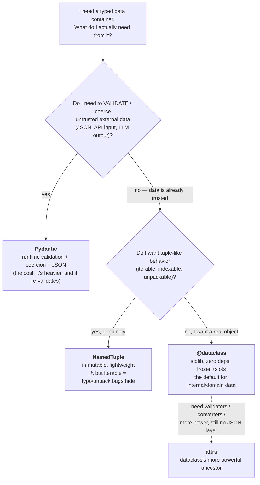
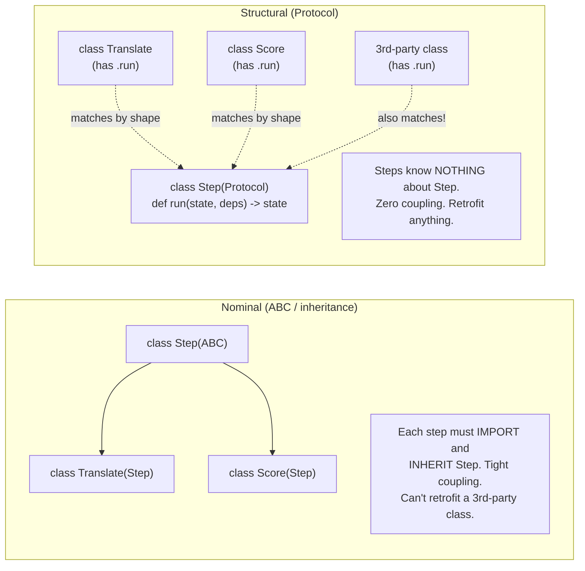

# Daily Reading — 2026-06-12  🔵 draft (for Q&A)

**Today's two readings (the pair you queued yesterday, while it's fresh):**
1. **Python / data modeling** — `@dataclass`: the boilerplate-free data container, and what `frozen` / `slots` / `field()` / `replace()` actually do. *(plus the comparison you asked for: dataclass vs NamedTuple vs Pydantic vs attrs)*
2. **Python / interfaces** — `typing.Protocol`: **static duck typing**. The other half of yesterday's pipeline skeleton — your `Step` was a Protocol.

> **Why these, and why now.** In yesterday's M01 Ch2 §1 session you drove the whole thing into pipeline state-management and we landed on a best-practice skeleton (§10b): a **`frozen` dataclass `State`** flowed through explicit signatures, set-once **`Deps`** injected on `self`, and a **`Step` `Protocol`** as the uniform interface. You flagged that *both `dataclass` and `Protocol` were unfamiliar* — which is notable given your Python strength (you vibe-code and have never had to reach for them). So this reading closes that exact gap: it's not generic Python trivia, it's **the two tools that make the design we agreed on actually expressible.** They're also the concrete, hands-on layer under three things you already hold from this week: Ousterhout's *"define errors out of existence"* (06-11), the *explicit-immutable-dataflow* keeper (yesterday), and the bridge into M05 (types — *make illegal states unrepresentable*).

> **Diversification note:** this is a third CS/SWE-leaning reading day in a row (git+design → this). Deliberate — the value of consolidating the skeleton *while the session is one day old* beats strict topic-rotation. Next reading day I'll swing back to the AI thread (M12 Ch2 video, or something current). Say the word if you'd rather pivot today.

---

## 1. Data classes — stop hand-writing `__init__`, and get immutability for free

🔗 **Primary (tutorial, your level):** [Data Classes in Python — Real Python](https://realpython.com/python-data-classes/)
🔗 **Canonical reference (the one to bookmark):** [`dataclasses` — Python docs](https://docs.python.org/3/library/dataclasses.html)
🔗 **Comparative (the "which container?" question):** [Why not…? — attrs docs](https://www.attrs.org/en/stable/why.html) · [Battle of the Data Containers — Towards Data Science](https://towardsdatascience.com/battle-of-the-data-containers-which-python-typed-structure-is-the-best-6d28fde824e/)

**The one idea.** A `@dataclass` is a decorator that **writes the boring methods for you** from your type-annotated fields — `__init__`, `__repr__`, `__eq__` (and more on request). You declare the *shape*; Python generates the plumbing. That's it. Everything else is options on that.

```python
from dataclasses import dataclass, field, replace

@dataclass(frozen=True, slots=True)
class PipeState:
    prompt: str
    candidates: list[str] = field(default_factory=list)   # NOT  = []  — see below
    score: float = 0.0
```

This one line gives you: a real constructor, a readable `repr` (`PipeState(prompt='...', score=0.0)`), value-based equality (two states with the same fields are `==`), immutability, and a compact memory layout. By hand that's ~30 lines of error-prone boilerplate.

**The four knobs that matter for you (this is the keeper):**

| Knob | What it does | Why it matters to *your* design |
|---|---|---|
| `frozen=True` | Assigning to a field after construction **raises** `FrozenInstanceError`. The object is read-only. | This is the mechanism behind yesterday's keeper. A frozen `State` **cannot be mutated in place** — the aliasing/temporal-coupling bugs you were trying to avoid become *structurally impossible*, not just discouraged. "Define errors out of existence." |
| `slots=True` (3.10+) | Generates `__slots__`: instances use a fixed C-struct layout instead of a per-instance `__dict__`. | Lower memory + faster attribute access when you make many instances. Also a **bonus safety net**: typos like `state.scoer = 1` raise `AttributeError` instead of silently creating a junk attribute. |
| `field(default_factory=list)` | Per-instance default for **mutable** defaults. | **The classic trap:** `candidates: list = []` would share *one* list across *all* instances (the same mutable-default bug that bites function args). `field(default_factory=...)` is the fix — `dataclass` actually *forbids* a bare mutable default and makes you use it. |
| `replace(obj, score=0.9)` | Returns a **new** instance with some fields changed; original untouched. | This is how you "update" frozen state. It *is* the explicit-immutable-dataflow pattern in one function: `new = replace(old, **delta)` — the functional-update move that LangGraph's reducers generalize. |

> **The `frozen` is shallow gotcha (we flagged this yesterday — here's the mechanism).** `frozen=True` stops you rebinding the *field*, but if the field holds a mutable object (a `list`, a `dict`), you can still mutate *that*: `state.candidates.append(x)` succeeds on a frozen dataclass. Immutability stops at the first reference. The disciplined fix: store immutable collections (`tuple` instead of `list`) when you want it to actually hold. This is the same "names are pointers; frozen freezes the pointer, not the pointee" idea straight out of yesterday's Ch2 §1.

**The comparison you asked for — dataclass vs NamedTuple vs Pydantic vs attrs.** They look interchangeable; they are not. The axis that sorts them: **how much do you pay, and what do you get?**



The sharp distinctions (from the attrs docs and the comparison piece, both linked):
- **Pydantic is a *validation* library, not a container.** Its job is sanitizing untrusted input (it coerces `"3"` → `3`). Reach for it at your **boundaries** — exactly your **LLM-JSON-reliability gap**: a Pydantic model is how you make malformed model output a caught validation error instead of a downstream crash. But the attrs authors warn: don't use it for your *internal domain* objects — *"Is it really necessary to re-validate all your objects while reading them from a trusted database?"* Validation is a boundary tax you shouldn't pay everywhere.
- **NamedTuple has a hidden cost:** because it *is* a tuple, it's iterable, indexable, and unpackable. That sounds convenient and is actually a **bug surface** — `a, b = my_point` silently "works" and a typo'd index `point[2]` reads neighbor data. Use it only when you genuinely want tuple semantics (e.g. a return value you'll unpack).
- **dataclass is the right default for trusted, internal data** — your pipeline `State`, config objects, domain models. Zero dependencies, and `frozen`+`slots` covers most of what you'd want.
- **attrs** is dataclass's older, more powerful sibling (validators, converters). The stdlib `dataclass` is *"intentionally less powerful than attrs… for the sake of simplicity."* Only reach for it when a dataclass can't express what you need and you still don't want Pydantic's validation weight.

**Connect it to *you*.** Your loose `Dict[str, Any]` habit (profile gap #3) is the thing dataclasses replace. A dict says "some keys, some values, who knows" — every reader has to *discover* the shape. A `frozen` dataclass *declares* the shape once, the type checker enforces it, and `slots` catches your typos. That's the cheapest correctness win on your board, and it's the literal building block of the §10b skeleton you asked me to keep.

**Questions to pressure-test while you read (your style):**
- A `frozen=True` dataclass is also **hashable by default** (it can be a dict key / set member), while a normal mutable dataclass is **not** (`__hash__` is set to `None`). Why is "immutable ⇒ safe to hash" not just a convention but a *correctness requirement*? (Think: what breaks if a dict key's hash changes after insertion?)
- You have `@dataclass(slots=True)`. Now try to `@functools.cached_property` one of its methods, or pin an arbitrary attribute on an instance. What breaks, and why is that the *same* mechanism that makes slots save memory? (One C-struct slot per declared field, no `__dict__`.)
- Map your `PipeState` from yesterday onto this: which fields should be the stable typed core, and which are the "artifacts" (your 10d insight)? Could the artifacts container itself be a frozen dataclass holding an immutable mapping — and what would `replace()` look like for an append-only update?

---

## 2. `typing.Protocol` — duck typing that the type checker can actually see

🔗 **Primary (tutorial, your level):** [Python Protocols: Leveraging Structural Subtyping — Real Python](https://realpython.com/python-protocol/)
🔗 **The spec (why it exists, conceptually):** [PEP 544 — Protocols: structural subtyping](https://peps.python.org/pep-0544/)
🔗 **Reference:** [Protocols and structural subtyping — typing docs](https://typing.python.org/en/latest/reference/protocols.html)

**The one idea.** Python has always had **duck typing**: if it has a `.read()` method, it's "file-like" — no inheritance required. The cost was that a *type checker* couldn't see that contract; "file-like" lived only in your head and the docstring. A `Protocol` writes that contract down so **mypy/pyright can check it statically** — duck typing you can verify before runtime. The phrase to hold: **static duck typing** (a.k.a. *structural* subtyping).

```python
from typing import Protocol

class Step(Protocol):
    def run(self, state: PipeState, deps: Deps) -> PipeState:
        ...   # no body — it's a contract, not an implementation

# This class satisfies Step WITHOUT importing or inheriting it:
class Translate:
    def run(self, state: PipeState, deps: Deps) -> PipeState:
        ...
# mypy now accepts `Translate()` anywhere a `Step` is expected.
```

**Nominal vs structural — the distinction that makes it click:**
- **Nominal subtyping** (classic inheritance / ABCs): you're a `Step` *only if you declared* `class Translate(Step)`. Membership is **by name/lineage**.
- **Structural subtyping** (Protocol): you're a `Step` *if you have the right methods with the right signatures*. Membership is **by shape**. "Two classes with the same methods are structural subtypes of one another."



**Why this is the *right* tool for your `Step` (the keeper).** With an ABC, every step must `import Step` and inherit it — the steps now *depend on* the framework. With a Protocol, the dependency arrow **reverses**: the runner depends on the *shape* `Step`, and the step classes know nothing about it. This is **dependency inversion done with zero coupling** — exactly the "deep seam" / information-hiding instinct from your Ousterhout reading. It's also why Protocols are how Python's own "file-like" / "iterable" / "context manager" contracts are now typed.

**Two caveats worth holding:**
- **`isinstance()` doesn't work by default.** A Protocol is a *static* tool; `isinstance(x, Step)` raises `TypeError` unless you decorate it `@runtime_checkable`. And even then it only checks *method names exist*, **not signatures** — so a runtime `isinstance` Protocol check is weaker than what mypy verifies statically. Lean on the static check; use `@runtime_checkable` sparingly.
- **Accidental matches.** Structural matching is *by shape*, so unrelated types can satisfy a Protocol by coincidence — the Real Python example: a `str` satisfies a `Message` protocol that just needs `.encode() -> bytes`. The narrower/more distinctive your method names and signatures, the less this bites. (A physics-style sanity check: a contract that's too loose will admit noise.)

**Connect it to *you*.** This is the cleanest answer to "how do I make my framework-less graph-lite pipeline *typed* without dragging in a framework." Each node just *has a `run`*; the Protocol lets the type checker enforce the contract across all of them with no inheritance and no coupling — which is the entire appeal of staying framework-less in the first place. It's the typed expression of the architecture you already chose. (Direct line into **M14 Ch2 — framework vs framework-less** and **M05 Ch2**.)

**Questions to pressure-test while you read:**
- ABCs *can* also be used structurally via `__subclasshook__`, and ABCs give you `isinstance` for free. So when is an **ABC** still the better choice than a **Protocol**? (Hint: do you want to *share implementation* via the base class, or only *specify a contract*? Who "owns" the classes — you, or a third party?)
- A Protocol can require **attributes**, not just methods (`score: float` as a bare annotation in the Protocol body). How does a type checker verify a *frozen dataclass* satisfies an attribute-bearing Protocol — and does `slots=True` change anything about that?
- Yesterday you reached twice for "encapsulate state in a class with methods." Protocols let you go the *other* way — define the **behavior contract** (`Step`) separately from the **data** (`PipeState`). Is separating "what it does" (Protocol) from "what it holds" (dataclass) a cleaner decomposition than one class doing both? When would you *want* them fused?

---

## Sources
- [Data Classes in Python — Real Python](https://realpython.com/python-data-classes/)
- [`dataclasses` — Python documentation](https://docs.python.org/3/library/dataclasses.html)
- [Why not…? (attrs vs dataclasses vs namedtuple vs Pydantic) — attrs docs](https://www.attrs.org/en/stable/why.html)
- [Battle of the Data Containers — Towards Data Science](https://towardsdatascience.com/battle-of-the-data-containers-which-python-typed-structure-is-the-best-6d28fde824e/)
- [Python Protocols: Leveraging Structural Subtyping — Real Python](https://realpython.com/python-protocol/)
- [PEP 544 — Protocols: structural subtyping (static duck typing)](https://peps.python.org/pep-0544/)
- [Protocols and structural subtyping — typing documentation](https://typing.python.org/en/latest/reference/protocols.html)

*Draft for Q&A. After we discuss, tell me to finalize and I'll rewrite this to match how you actually think about it + update the learner profile and the M05 Ch2 scope.*
