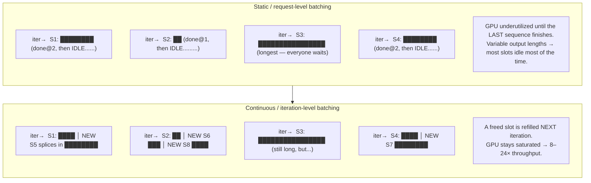
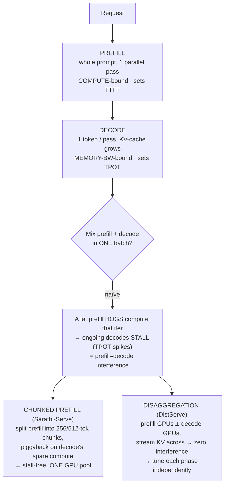

# Daily Reading — 2026-06-15  ✅ finalized

**Today's two readings (the *other half* of yesterday's course session):**
1. **Continuous batching** — *iteration-level scheduling*: why a naïve batch wastes most of your GPU, and how injecting new requests per-forward-pass buys 8–24× throughput. The **scheduling** layer.
2. **Prefill vs decode** — the two phases have *opposite* bottlenecks (compute-bound vs memory-bound). How modern servers stop them from sabotaging each other: **chunked prefill** (Sarathi-Serve) and **disaggregation** (DistServe). The **frontier** layer.

> **Why these, and why now.** Yesterday (M01 Ch2 §3, *out of memory*) you drove the entire session into LLM-serving **memory** from your own vLLM/llama.cpp ops experience — KV-cache budgeting, `gpu_memory_utilization` as the pool ceiling, PagedAttention killing internal fragmentation. That's the **memory** axis of "why does my LLM server behave the way it does." It is exactly *half* the picture. The other half is **scheduling**: given a fixed pool of KV-cache blocks, *which requests run in this forward pass, and how do you keep the GPU busy?* That's continuous batching. And once you're scheduling, you hit the deeper structural fact your memory work set up: **prefill and decode are different machines** — one saturates compute, one starves on memory bandwidth (your "load 1MB > compute on it" point from Ch1 §3 and yesterday's §7). Today closes the loop: memory (yesterday) + scheduling (today) = the complete mental model of an LLM serving engine. This is also directly **Arena-relevant** — throughput/latency under load is your production reality.

> **Diversification note.** On 06-12 I promised to swing back to the **AI thread** — this is it (after 3 CS/SWE days). I deliberately kept it adjacent to yesterday's course work to *consolidate while the session is one day old* (same rationale as the dataclass/Protocol pairing). It is **additive, not repetitive**: yesterday was where the bytes *live*; today is *which work runs when*. Next reading day I'll rotate further out — likely M12 Ch2 video (DiT/Sora) or something current in the model landscape. Say the word if you'd rather pivot today.

---

## 1. Continuous batching — stop letting the slowest request idle your GPU

🔗 **Primary (the canonical article, your level):** [How continuous batching enables 23x throughput in LLM inference while reducing p50 latency — Anyscale](https://www.anyscale.com/blog/continuous-batching-llm-inference)
🔗 **Deeper companion (mechanism + diagrams):** [LLM Inference: Continuous Batching and PagedAttention — insujang](https://insujang.github.io/2024-01-07/llm-inference-continuous-batching-and-pagedattention/)
🔗 **Tie-back to yesterday (the memory half):** [vLLM: Easy, Fast, and Cheap LLM Serving with PagedAttention — vLLM blog](https://vllm.ai/blog/2023-06-20-vllm)

**The one idea.** A naïve server batches at the **request** level: it gathers N prompts, runs them together until *all N* finish, then takes the next batch. But LLM outputs have wildly different lengths — one request emits 12 tokens, another emits 800. The whole batch is held hostage by the longest generation, and every sequence that finished early leaves its GPU slot **idle** for the rest of the batch. Continuous batching schedules at the **iteration** level instead: after *every* forward pass, finished sequences are evicted and waiting requests are spliced into their freed slots. The batch is never "full of corpses." That's the entire trick — and it's worth up to **23×**.

<!-- DIAGRAM:START -->

Diagram source (Mermaid)

<!-- DIAGRAM:END -->

**Why this works — and it's *your* insight from yesterday.** Continuous batching only pays off because **decode is memory-bandwidth-bound, not compute-bound** (your Ch1 §3 + §3-yesterday point: "it takes longer to load 1MB to the compute cores than to compute on it"). Generating one token for one sequence barely touches the GPU's FLOPs — it's dominated by *streaming the weights and KV-cache through memory*. So adding more sequences to the batch is nearly **free on the compute axis**: you reuse the same weight-load across more sequences, amortizing the bandwidth cost. Batching is the lever that turns a memory-bound workload back toward compute-bound (higher arithmetic intensity — the roofline framing). This is why the headline result is *throughput*, and why the ceiling on batch size is **KV-cache memory**, not FLOPs — which is precisely the budget you spent yesterday learning to size.

**The two halves snap together.** This is the payoff for keeping yesterday and today adjacent:
- **PagedAttention (yesterday)** decides *how many* sequences can fit — it kills the internal fragmentation from `max_seq_len` over-reservation, so the KV pool holds far more concurrent sequences.
- **Continuous batching (today)** decides *which* of those sequences run each iteration, keeping the pool's slots full.
- Together: PagedAttention raises the batch-size ceiling, continuous batching keeps you pinned against it. **vLLM's 23× is both mechanisms multiplying** — neither alone gets there. (The 06-12-style keeper: *memory layout and scheduling are orthogonal axes of the same win.*)

**The numbers worth holding** (Anyscale's production benchmark, vs naïve HF Transformers):
| System | Throughput vs HF | What it adds |
|---|---|---|
| HF Transformers (static) | 1× | request-level batching |
| FasterTransformer (optimized static) | ~4× | better kernels, still static |
| HF TGI / Ray (continuous batching) | ~8× | iteration-level scheduling |
| **vLLM (continuous batching + PagedAttention)** | **~23×** | scheduling **+** paged KV memory |

The other reported edge: continuous batching **also lowers median latency** at the same time — counterintuitive, because usually throughput and latency trade off. It works here because a new request doesn't wait for the current batch to drain; it enters at the next iteration. (Hold that thought — reading 2 shows where this *does* still bite latency.)

**Questions to pressure-test while you read (your style):**
- Continuous batching evicts finished sequences each iteration. When a *new* request joins, it must first run its **prefill** (process the whole prompt) before it can decode. What does injecting a fat prefill into a batch of decodes do to the *latency of the sequences already decoding*? (This is the exact seam reading 2 attacks — predict the failure before you read it.)
- The batch-size ceiling is KV-cache memory. Tie it to yesterday's `gpu_memory_utilization`: if you raise that knob, you get a bigger KV pool → bigger max batch → more throughput. What's the cost you accept, and what crashes if your peak estimate was wrong? (You answered this yesterday — confirm it transfers.)
- Throughput went up 23× but **per-token latency for a single lonely request** barely changes (or worsens slightly). Why is continuous batching a *throughput* optimization, not a *single-request-latency* one — and why does that distinction decide whether it helps your Arena workload?

---

## 2. Prefill vs decode — two phases, opposite bottlenecks, one GPU

🔗 **Frontier — disaggregation:** [DistServe: Disaggregating Prefill and Decoding for Goodput-optimized LLM Serving (arXiv 2401.09670)](https://arxiv.org/abs/2401.09670)
🔗 **Frontier — the other answer, chunked prefill:** [Taming Throughput-Latency Tradeoff with Sarathi-Serve (arXiv 2403.02310)](https://arxiv.org/abs/2403.02310)
🔗 **Origin of chunked prefill:** [SARATHI: Piggybacking Decodes with Chunked Prefills (arXiv 2308.16369)](https://arxiv.org/abs/2308.16369)

**The one idea.** An LLM request has two phases that are *physically different workloads*:
- **Prefill** — process the entire prompt in **one** parallel forward pass. Hundreds/thousands of tokens at once → high arithmetic intensity → **compute-bound**. Sets your **TTFT** (time to first token).
- **Decode** — generate output tokens **one at a time**, each pass reading all the weights + the growing KV-cache to emit a single token → **memory-bandwidth-bound**. Sets your **TPOT/TBT** (time per output token).

Same GPU, opposite bottlenecks. When you naïvely mix them in one continuous batch (reading 1), a long prefill **monopolizes the compute** for an iteration and *stalls* every decode sharing that batch — users mid-stream see their token stream hitch. This is the **prefill–decode interference** that reading 1's question pointed at. Two SLOs that pull against each other:

<!-- DIAGRAM:START -->

Diagram source (Mermaid)

<!-- DIAGRAM:END -->

**Goodput, not throughput — the metric shift that matters.** DistServe's framing: raw throughput (tokens/sec) is a vanity number if half those tokens arrived too late to honor their SLO. **Goodput** = requests/sec *that meet both TTFT and TPOT targets*. A server can have great throughput and terrible goodput (it's fast on average but stalls violate latency for a third of users — your tail-latency problem). This is the right lens for Arena: a user staring at a turn cares about *their* TTFT and smooth streaming, not your aggregate tokens/sec.

**Two answers, and the trade-off between them** (this is the keeper):
- **Chunked prefill (Sarathi-Serve)** — *don't separate the phases, tame them.* Split a long prefill into fixed chunks (256/512 tokens) and **piggyback** each chunk onto a batch of decodes, using the *spare compute the memory-bound decodes leave on the table* ("arithmetic intensity slack"). Decodes never stall because each iteration's compute is capped. **One GPU pool, stall-free.** Gains: up to 2.6× (Mistral-7B, 1×A100) / 6.9× (Falcon-180B, 8×A100) within SLO. This is now a **standard vLLM scheduler option** — directly tunable in your stack.
- **Disaggregation (DistServe)** — *separate the phases onto different GPUs.* Prefill runs on one GPU group, decode on another; the KV-cache is streamed across the interconnect at handoff. Each group gets its **own parallelism, batch policy, and even hardware**, tuned for its bottleneck — zero interference *by construction* (the same "design the problem out of existence" instinct as `frozen` from 06-12, applied to hardware). Gains: **7.4× more requests / 12.6× tighter SLO**. Cost: complexity, KV transfer bandwidth, and you need enough GPUs to dedicate. It shines at scale; chunked prefill shines on a single node.

**Connect it to *you*.** You run vLLM. Both of these are levers you can actually pull: chunked prefill is a scheduler flag; disaggregation is an architecture choice (vLLM, SGLang, TensorRT-LLM all now support a P/D-disaggregated mode). The decision rule that falls out: **single-node / cost-bound → chunked prefill; multi-node / SLO-bound at scale → disaggregation.** And the *why* is the same physics you already own — prefill is compute-bound, decode is memory-bound, so the question is always "am I packing the spare capacity of one onto the other, or am I giving each its own box?"

**Questions to pressure-test while you read:**
- Disaggregation has to **physically copy the KV-cache** from the prefill GPU to the decode GPU. Using yesterday's KV-cache sizing (per-token bytes × layers × 2 for K and V): for a 4k-token prompt, roughly how much data crosses the interconnect, and why does DistServe say it places the two phases "according to bandwidth"? When does the transfer cost eat the disaggregation win? (Echoes your llama.cpp `-ngl` analysis — *who pays the PCIe/NVLink toll, and is the thing crossing it small or huge?*)
- Chunked prefill caps per-iteration compute to protect TPOT — but chunking a prefill into N pieces means re-reading the model weights N times for that prompt. What does that cost on the *memory-bandwidth* axis, and why is it still a net win? (Hint: whose spare capacity is it spending?)
- "Goodput under SLO" vs "throughput." Sketch a workload where system A has 2× the throughput of system B but **lower goodput**. Which one would you ship for Arena, and what does that tell you about the metric your dashboards should actually track?

---

## What to take away (read first on review)

- **An LLM serving engine has two orthogonal axes: memory (where the KV-cache lives) and scheduling (which work runs each iteration).** Yesterday was the first; today is the second. vLLM's 23× is *both multiplying*.
- **Continuous batching = iteration-level scheduling.** Refill freed slots every forward pass; never let the slowest sequence idle the GPU. It's a *throughput* win, enabled by decode being memory-bound (batching is near-free on compute).
- **Prefill ≠ decode.** Compute-bound (TTFT) vs memory-bound (TPOT). Mixing them naïvely causes **interference** (prefill stalls decodes). Two fixes: **chunked prefill** (tame, one pool — a vLLM flag) and **disaggregation** (separate, scale — an architecture). Single-node→chunk; at-scale-SLO→disaggregate.
- **Goodput > throughput** for user-facing serving. Track requests-meeting-SLO, not raw tokens/sec — your Arena tail-latency lens.

---

## What we worked out — the three threads you drove (read these first on review)

You didn't engage the readings as written — you re-derived the engine from your own ops priors and pressure-tested each claim with sharp yes/no hypotheses, then corrected your *own* wording mid-stream. These are the durable keepers.

### Thread 1 — "decode is bandwidth-bound, so the fix is to use more bandwidth." (corrected)
Your premise was right; the conclusion needed a flip. **Being bandwidth-bound means you're *already* saturating bandwidth — there's no headroom to "use more."** The real lever is **tokens-per-byte-moved, not bytes-per-second.** The unlock: split "token rate" into two.
- **Aggregate throughput** — decompose bytes/decode-step: `weight bytes (FIXED, shared by the whole batch) + KV bytes (scale with batch)`. At small batch, weight traffic dominates and is a fixed cost; **batching amortizes it across B sequences** → ~B× tokens for the same byte-traffic. Roofline framing (yours): you sit far left, memory-bound *with idle compute*; batching raises arithmetic intensity, moving you right toward the compute ridge. Throughput win = "amortize fixed weight traffic," **not** "use more bandwidth."
- **Per-request latency (TPOT)** — batching does *not* help one lonely request; it's hard-capped at `bandwidth / bytes-per-token`. To speed a single stream you must **shrink bytes-per-token**: quantization (fewer bytes/weight), GQA/MQA (smaller KV), speculative decoding (multiple tokens per weight-load).
- **The three walls** where batching stops winning: KV traffic (per-sequence, *unshared*) overtakes the shared weight traffic as batch×context grows; the compute roofline knee; KV-cache capacity (yesterday's ceiling).

### Thread 2 — continuous batching vs PagedAttention are different layers (your separation was right; two wordings fixed)
- **Continuous batching** = *policy*: iteration-level admit/evict to keep the **one** running batch full. Correction to your wording: the unit is **sequences within a batch** (not "active batches"), and the goal is **no idle slots**, not a *constant* count — the count is dynamic by nature.
- **PagedAttention** = *mechanism*: fixed-size KV **blocks**, non-contiguous, allocated **on demand** via a block table (= OS page table; your yesterday analogy is exact). Correction to your wording: it does **not oversubscribe/overcommit VRAM** — every block is real. Its win is **ending over-*reservation*** (the naïve engine reserves `max_seq_len` contiguous KV per sequence; PagedAttention allocates blocks as tokens are actually generated → <4% waste vs yesterday's 60–80%).
- **Where your "avg << max bet" actually lives:** at the **scheduler admission layer** (continuous batching), *enabled by* PagedAttention's fine-grained allocation — a statistical-multiplexing overcommit, hedged by **preemption**, not a gamble that crashes.
- **Preemption cost (you asked: does the net degrade performance? — yes):** recompute (redo the victim's *entire* prefill → throw away paid-for compute) or swap (KV over PCIe, ~50–100× slower than HBM). **Rare = a bounded tax; chronic = thrashing** — repeated preempt/recompute, throughput falls off a cliff. This *is* yesterday's OS page-thrashing, one layer up (KV pool = RAM, preemption = page fault). **Operational signal:** preemptions in the vLLM log = you've over-admitted → lower `max_num_seqs` / cap `max_model_len`; note `gpu_memory_utilization` pulls *against* this (smaller pool → more preemption). Sweet spot = pinned just below preemption onset.

### Thread 3 — "if disaggregation under-utilizes each GPU, how can it beat Sarathi?" → it's a TRADE-OFF, not strictly better (your headline takeaway)
You spotted correctly that colocation (Sarathi/chunked-prefill) has **higher raw hardware utilization**. The flaw was the hidden premise *"efficiency = keep every unit busy."* The real objective is **goodput** (requests/sec meeting *both* TTFT and TPOT SLOs). Disaggregation trades unit-utilization for goodput, and it pays off because:
1. **The "wasted" units were doing interference, not useful work.** Decode's idle compute was only ever filled by prefill chunks that *slowed the decodes*; removing them gives decode its best TPOT. And chunked prefill re-streams weights N times (one per chunk), so monolithic prefill on a dedicated GPU is *more* bandwidth-efficient — the prefill GPU's "idle bandwidth" is partly it doing prefill better.
2. **Chunked prefill bounds the decode tax but doesn't remove it** — every hybrid-batch decode still runs slower than alone. Disaggregation = zero interference *by construction*.
3. **Each phase runs its own optimal config** — colocation forces one shared parallelism degree / batch / memory split; the phases want opposite ones (prefill: TTFT-tuned parallelism, small batch; decode: huge batch, max KV). Disaggregation also **scales the two GPU pools independently** to match the workload's compute:bandwidth ratio.
- **Cost that keeps it honest:** the KV-cache must physically cross prefill→decode over the interconnect (your reading-Q2 prediction) → DistServe places them "according to bandwidth" (keep the hop on NVLink).
- **Regime rule (the keeper):** **few GPUs / single node / loose SLO → chunked prefill** (utilization matters, can't strand GPUs); **many GPUs / tight SLO / scale → disaggregation** (interference-free + per-phase tuning beats utilization). Newest 2025 work adaptively switches between them — which only makes sense once you see they're points on a spectrum, not rivals.

---

## Sources
- [How continuous batching enables 23x throughput in LLM inference while reducing p50 latency — Anyscale](https://www.anyscale.com/blog/continuous-batching-llm-inference)
- [LLM Inference: Continuous Batching and PagedAttention — insujang](https://insujang.github.io/2024-01-07/llm-inference-continuous-batching-and-pagedattention/)
- [vLLM: Easy, Fast, and Cheap LLM Serving with PagedAttention — vLLM blog](https://vllm.ai/blog/2023-06-20-vllm)
- [DistServe: Disaggregating Prefill and Decoding for Goodput-optimized LLM Serving (arXiv 2401.09670)](https://arxiv.org/abs/2401.09670)
- [Taming Throughput-Latency Tradeoff in LLM Inference with Sarathi-Serve (arXiv 2403.02310)](https://arxiv.org/abs/2403.02310)
- [SARATHI: Efficient LLM Inference by Piggybacking Decodes with Chunked Prefills (arXiv 2308.16369)](https://arxiv.org/abs/2308.16369)

*Finalized 2026-06-15. The three "What we worked out" threads are the durable record — read them first on review. Pairs with the course track's M01 Ch2 §3 (out of memory, 2026-06-14): that session was the **memory** axis of LLM serving; this reading is the **scheduling** axis. The headline keeper you landed on: **colocation maximizes hardware utilization, disaggregation maximizes goodput — a trade-off, not a strict improvement.***
