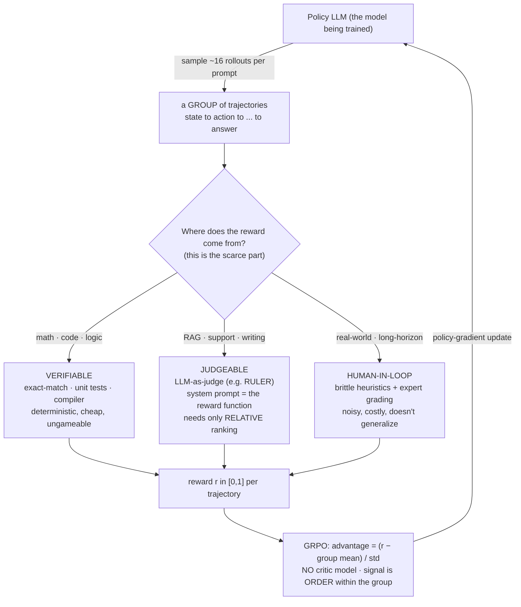
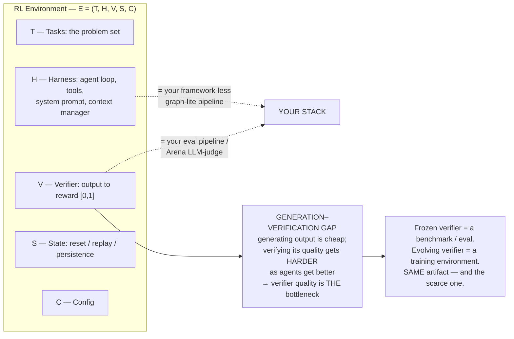

# Daily Reading — 2026-06-16  🔵 prepared (not yet finalized)

**Today's two readings (one theme, two altitudes):**
1. **How top labs actually train RL agents in 2026** — the mechanism. RLHF → **RLVR** (DeepSeek's verifiable rewards) → **LLM-as-judge** (RULER) → universal verifiers. The thread that ties it together: in **GRPO, only *relative* rankings matter** — which is the hinge the whole agent-RL stack now turns on.
2. **Environments are the new moat — and the verifier *is* your eval.** The strategic/economic shift: frontier labs are no longer bottlenecked on model capability but on **verification**. The "generation–verification gap," why coding is "the holy grail," and the punchline that should reframe a chunk of your work: *a verifier and a production eval are the same artifact.*

> **Why this, and why now.** You delegated the pick and said "expand my view." So I deliberately aimed at the part of the frontier that sits *right next to* your strength but isn't it. You already own LLM **internals** — you read and critique frontier papers, you know the R1 pipeline, GRPO, MoE, KV-cache economics. What you've had less reason to look at head-on is the thing the entire industry pivoted toward in 2025–2026: the realization that **the scarce resource is no longer the model — it's the reward signal.** This reframes three things you already do: (1) your **eval pipeline** (turns out an eval and an RL "verifier" are the same object); (2) your **Arena** (LLM-vs-LLM with judging is structurally a *relative-ranking reward generator* — the exact shape GRPO consumes); (3) your **framework-less agent pipeline** (that's a "harness," one of the five formal parts of an RL environment). It's also a genuine *career* signal: the skill the labs are spending tens of millions to acquire is **building good verifiers** — i.e. evals — which is your M15 gap. So this reading turns "I'm behind on eval" into "the thing I'm behind on is the moat."

> **Diversification note.** Last reading (06-15, LLM serving) was the *systems/ops* axis of AI. This is the *training/economics* axis — still AI, but a different muscle, and it pulls you toward the data/reward side rather than the inference side. After this I'd swing properly out of AI (a databases or networking reading, ahead of those course phases) unless you want to keep mining this vein — there's a lot here.

---

## 1. From RLVR to LLM-as-judge — how RL actually trains agents in 2026

🔗 **Primary (your level, technical-but-readable):** [How Top AI Labs Are Building RL Agents in 2026 — Daily Dose of DS](https://blog.dailydoseofds.com/p/how-top-ai-labs-are-building-rl-agents)
🔗 **Canonical anchor (you've likely read it — the origin of RLVR-at-scale):** [DeepSeek-R1: Incentivizing Reasoning in LLMs via RL (arXiv 2501.12948)](https://arxiv.org/abs/2501.12948)
🔗 **GRPO origin (the algorithm, if you want the math):** [DeepSeekMath / GRPO (arXiv 2402.03300)](https://arxiv.org/abs/2402.03300)
🔗 **Living index of the field:** [awesome-RLVR — curated, continually updated](https://github.com/opendilab/awesome-RLVR)

**The one idea.** RLHF needed a *learned* reward model — an extra network trained on human preference rankings, sitting in the loop alongside the policy, reference, and critic (≈**28B params of machinery to RL a 7B model**). **RLVR throws the reward model away** and replaces it with a **verifier**: a deterministic check that returns a reward only when the output actually passes. Math → compare to ground-truth answer. Code → run the unit tests / compiler, binary pass/fail. DeepSeek-R1-Zero rode *only* that binary signal from **15.6% → 77.9% on AIME 2024**, and "nobody taught it to reason step by step" — the chain-of-thought *emerged* because it was instrumentally useful for passing the check. You know this part; I'm restating it only to set up the two moves past it.

**Move 1 — GRPO's quiet radicalism: only *relative* rankings matter.** GRPO drops PPO's critic entirely. For each prompt it samples a **group** of ~16 rollouts, scores them, and sets each one's advantage to *how much better than the group's own mean* it was (`(r − mean)/std`). The consequence that matters for you: **the absolute scale of the reward is irrelevant — all the signal lives in the ordering within the group.** That's why you don't strictly need a calibrated 0–100 grader; you need something that can say "this rollout beat that one." Hold that thought through reading 2 and against your Arena.

<!-- DIAGRAM:START -->

Diagram source (Mermaid)

<!-- DIAGRAM:END -->

**Move 2 — the wall, and how labs climbed it.** RLVR only works where outcomes are *verifiable*. Math, code, logic: clean. But "was this support reply good?", "is this summary faithful?", "did the agent edit the CRM correctly?" have **no deterministic check** — outcomes are subjective or multi-dimensional. Hand-coded reward functions for these are "brittle" and take "days of iteration." The convergent fix across labs: **LLM-as-judge as the reward signal.** OpenPipe's **RULER** is the clean instance — it generates 4–8 trajectories, hands them *all* to a judge model, and asks only for a **relative ranking** (exactly what GRPO wants). The trick that makes it general: **the agent's own system prompt becomes the reward function.** A RAG agent told "use only the retrieved context, don't add outside info" → the judge automatically penalizes hallucination and rewards faithfulness, *with no reward code written.* Concrete RULER scores from one RAG scenario: concise+faithful **0.98**, verbose+accurate **0.96**, hallucinated **0.20**, ignored-context **0.05** — note the *partial credit*, not pass/fail. And labs are pushing this outward: OpenAI's **"universal verifiers"** aim to extend checkable rewards into biology, medicine, general knowledge; Anthropic's Constitutional AI is the same instinct — "a document of rules replaced an army of human evaluators."

**Connect it to *you* — your Arena is an RLVR reward generator in disguise.** Your Arena pits models against each other and judges the result. Structurally that is **exactly** the RULER pattern: multiple rollouts → a judge → a *relative* ordering. The GRPO insight ("only relative rankings matter") is *why* a pairwise/ranked arena is a legitimate training signal and not just a leaderboard toy. Two practical reads fall out: (a) your Arena's judging rubric **is** a reward function — its weaknesses are reward-hacking surfaces (reading 2); (b) the cold-start problem you've been wrestling with is, in RL terms, the *exploration* problem — with no warm signal, early rollouts are near-random and the relative ranking is noise until you seed it.

**Questions to pressure-test while you read (your style):**
- GRPO needs only *relative* order within a group. So why do labs still bother building expensive *absolute* verifiers (exact-match, unit tests) when a cheap judge giving relative order would feed GRPO just fine? (Hint: think about what a judge can be *fooled* by that a compiler can't — and who's adversarial in the loop.)
- RULER lets the **system prompt be the reward function**. That's elegant, but it couples "what the agent is told to do" with "how the agent is graded." Name a failure mode where that coupling silently teaches the wrong thing. (You'll meet it formally in reading 2 as *reward hacking* / rubric exploitation.)
- R1-Zero learned to reason from a *binary* signal with zero process supervision. Square that against your prior on RLHF needing dense human preference data. What does the binary-signal result imply about *where* the reasoning ability was already latent? (This is the "RLVR incentivizes correct reasoning *already in the base model*" claim — the [OpenReview paper](https://openreview.net/forum?id=jGbRWwIidy) argues exactly this.)

---

## 2. Environments are the new moat — and the verifier *is* your eval

🔗 **Primary (the strategic/economic argument):** [Who Will Win the RL Environment Market — and Why (Wing VC)](https://www.wing.vc/content/who-will-win-the-rl-environment-market--and-why)
🔗 **The technical anatomy (a taxonomy of RL environments):** [A Taxonomy of RL Environments for LLM Agents — Lee Hanchung](https://leehanchung.github.io/blogs/2026/03/21/rl-environments-for-llm-agents/)
🔗 **Practitioner's view (building tasks & reward systems):** [RL Environments: Building Tasks & Reward Systems for Agents — SuperAnnotate](https://www.superannotate.com/blog/rl-environments)
🔗 **Frontier — rewarding long-form agentic tasks:** [OpenReward (arXiv 2510.24636)](https://arxiv.org/abs/2510.24636) · [Agentic Reinforced Policy Optimization (arXiv 2507.19849)](https://arxiv.org/abs/2507.19849)

**The one idea.** Base-model capability is commoditizing; everyone has a strong model. The thing that's *scarce* — and therefore the moat — is the ability to **reliably train and verify agents on long-horizon, real-world workflows.** Wing's thesis in one line: **"verification, not raw model capability, is what makes automation durable."** Labs are now spending heavily here (Anthropic on the order of tens of millions/year on environments, aggregate lab spend projected to grow 3–5×), and a ~20-company market is expected to consolidate to **3–5 winners by 2030**. The winner isn't whoever has the *most* environments — it's whoever can "reliably extract learning signal from a small set of long-form workflows at scale."

**The anatomy — and three of its five parts are things you already build.** The taxonomy formalizes an environment as **E = (T, H, V, S, C)**: **T**asks, **H**arness, **V**erifier, **S**tate, **C**onfig.

<!-- DIAGRAM:START -->

Diagram source (Mermaid)

<!-- DIAGRAM:END -->

- **H (harness)** is your agent loop — rollout protocol, tools (the field is converging on *atomic* tools: read/write/edit/bash), system prompt, context manager, turn limit. Your "graph-lite" pipeline *is* a harness.
- **V (verifier)** is the reward function — and here's the keystone: **a benchmark is just a frozen RL environment.** Same components; a benchmark is an environment whose verifier and tasks don't evolve during a run. So **the eval you write for Arena and the verifier a lab writes to RL-train an agent are the same kind of object.** Your M15 "gap" is literally the in-demand skill.

**The two laws of verifiers (write these down).**
1. **"Verifiable beats judgeable."** A programmatic check (string-match, code execution) is faster, cheaper, and *more consistent* than an LLM-judge — and crucially it **can't be talked into a good score.** So the design move is always: *push as much of your eval/verifier toward deterministic checks as the task allows*, and only fall back to a judge for the irreducibly subjective part. (This is the same instinct as "define errors out of existence" from your 06-15 session, applied to grading.)
2. **The generation–verification gap widens with capability.** As agents get better, generating plausible output gets *cheaper* while telling good from subtly-wrong gets *harder* — "reward signals often become noisier, not cleaner" at scale. This is why **static rubrics get exploited** (the model finds the cheap path to a high score — reward hacking) and why frontier work **co-evolves the rubric with the policy** (RLER), uses **turn-level** rewards for finer credit assignment, and even **injects 5–10% tool errors** so agents stay robust. Auto-generating *environments* is now ~$4 each — so the bottleneck has fully shifted from *making* environments to *trusting their verifiers.*

**Why "coding is the holy grail."** Code has *dense, free* verification — tests pass or fail, it compiles or doesn't, diffs are checkable — so RL signal is available at industrial scale. That's not a coincidence with where the money is: Wing notes **Claude Code ≈ $1B ARR in six months, Cursor ≈ $2B ARR.** The domains that are easy to *verify* are exactly the domains where agents are getting good fastest. Corollary for your roadmap: when you pick a problem for an agent to own, **ask "what's my verifier?" first** — if the answer is "a human eyeballs it," you're in the hard regime; if it's "a check I can run," you're on the holy-grail track.

**Connect it to *you*.** Three concrete take-homes:
1. Your **Arena judge rubric is a verifier with a reward-hacking surface.** If models can win by being verbose, confident, or formatting nicely rather than being *right*, your rubric is exploitable — same disease as a gameable RL reward. The fix is law #1: move what you can to deterministic checks; keep the judge for the residue.
2. Your **eval work is the moat skill, not chore work.** The labs are paying tens of millions for exactly "can you build a verifier that doesn't teach the wrong thing." Reframing M15 from "catch up on testing" to "build the scarce asset" should change how much you invest in it.
3. Your **cold-start problem is an exploration/verification problem.** Without a trustworthy signal early, you can't tell good rollouts from lucky ones — which is *precisely* the generation–verification gap biting at t=0. The leverage point is the verifier, not the model.

**Questions to pressure-test while you read:**
- A benchmark is a *frozen* environment; a training environment *evolves* its tasks/rubric mid-run. What goes wrong if you accidentally let your **eval** evolve (e.g. you keep "improving" the rubric while comparing models across weeks)? What's the eval analog of the train/test leak? (This is why benchmarks freeze — connect it to why you can't move the goalposts mid-experiment.)
- "Verifiable beats judgeable," yet labs lean on LLM-judges anyway for most real tasks. Reconcile: when is paying the judge's *inconsistency + gameability* tax worth it, and what's the cheapest way to *bound* that tax? (Hint: ensembles, deterministic pre-filters, and reading 1's "relative-ranking-only" property.)
- Auto-generated environments cost ~$4 and the bottleneck is verifier *quality*, not quantity. If you could spend a fixed budget either generating 1,000 new tasks or hardening the verifier on your existing 100, which buys more — and what does your answer say about where to point your own eval effort? (Wing: "environment diversity matters as much as quality" — so it's a *real* trade-off, not an obvious win either way.)

---

## What to take away (read first on review)

- **The scarce resource flipped from the model to the reward signal.** RLVR removed the learned reward model; the new bottleneck is the **verifier**. "Verification, not raw model capability, is what makes automation durable."
- **GRPO needs only *relative* rankings within a group** (no critic, advantage = deviation from group mean). This is why an LLM-judge — or an *arena* — is a legitimate reward source, and why your Arena is structurally an RLVR signal generator.
- **The reward-source spectrum: verifiable → judgeable → human-in-loop.** Push as far left as the task allows; "**verifiable beats judgeable**" because deterministic checks are cheap, consistent, and ungameable.
- **A verifier and an eval are the same artifact** — a benchmark is a *frozen* RL environment (E = T, H, V, S, C). So your M15 eval gap is the exact skill labs are spending tens of millions to acquire.
- **The generation–verification gap widens with capability** → static rubrics get reward-hacked → frontier work co-evolves rubrics, scores per-turn, and injects noise. When choosing what an agent should own, **ask "what's my verifier?" first** — that's why *coding* (dense free verification) is the holy grail.

---

## What we worked out (filled in at finalize)

*Placeholder — after our Q&A I'll replace this with the durable threads you actually drove, in the 06-15 style (the corrections, the connections you pushed to, the keepers). Likely seams given your profile: how exactly your Arena maps onto GRPO's relative-ranking signal; where your eval/Arena rubric is reward-hackable and the deterministic-check fixes; and the cold-start ⇄ exploration ⇄ verification-gap connection.*

---

## Sources
- [How Top AI Labs Are Building RL Agents in 2026 — Daily Dose of DS](https://blog.dailydoseofds.com/p/how-top-ai-labs-are-building-rl-agents)
- [DeepSeek-R1: Incentivizing Reasoning in LLMs via Reinforcement Learning (arXiv 2501.12948)](https://arxiv.org/abs/2501.12948)
- [DeepSeekMath — GRPO (arXiv 2402.03300)](https://arxiv.org/abs/2402.03300)
- [awesome-RLVR — curated list of RL with verifiable rewards](https://github.com/opendilab/awesome-RLVR)
- [RLVR implicitly incentivizes correct reasoning in base LLMs (OpenReview)](https://openreview.net/forum?id=jGbRWwIidy)
- [Who Will Win the RL Environment Market — and Why (Wing VC)](https://www.wing.vc/content/who-will-win-the-rl-environment-market--and-why)
- [A Taxonomy of RL Environments for LLM Agents — Lee Hanchung](https://leehanchung.github.io/blogs/2026/03/21/rl-environments-for-llm-agents/)
- [RL Environments: Building Tasks & Reward Systems for Agents — SuperAnnotate](https://www.superannotate.com/blog/rl-environments)
- [OpenReward: Learning to Reward Long-form Agentic Tasks via RL (arXiv 2510.24636)](https://arxiv.org/abs/2510.24636)
- [Agentic Reinforced Policy Optimization (arXiv 2507.19849)](https://arxiv.org/abs/2507.19849)

*Prepared 2026-06-16. Pairs with the AI thread: 06-15 (LLM serving) was the inference/ops axis; this is the training/economics axis. The reframe to hold: **the verifier is the moat, and a verifier is just an eval** — which makes your M15 gap the highest-leverage thing on your roadmap.*
