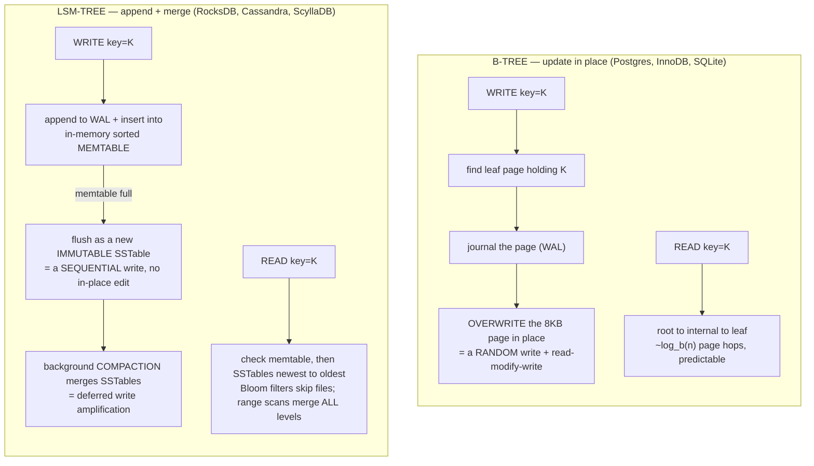
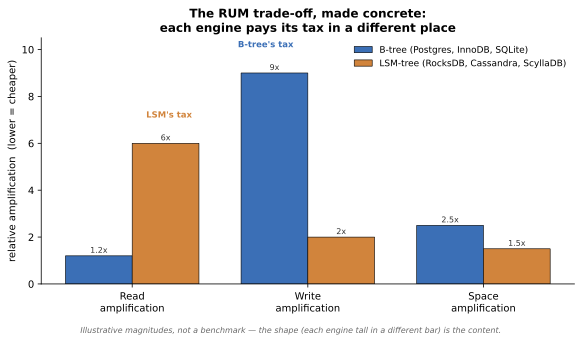
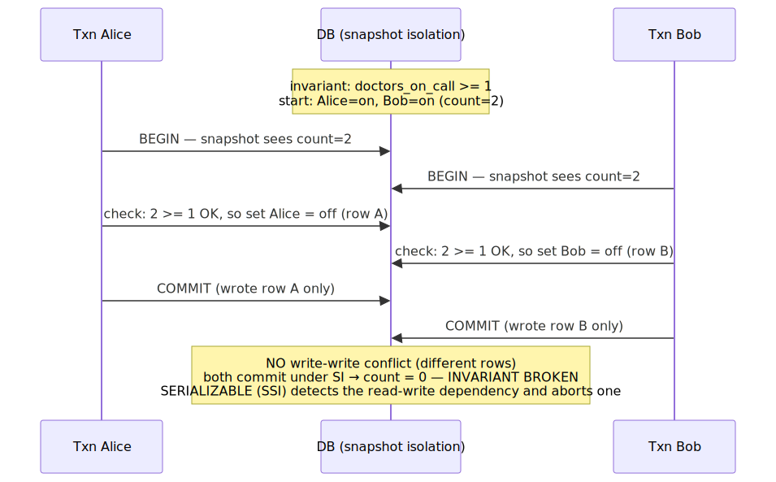
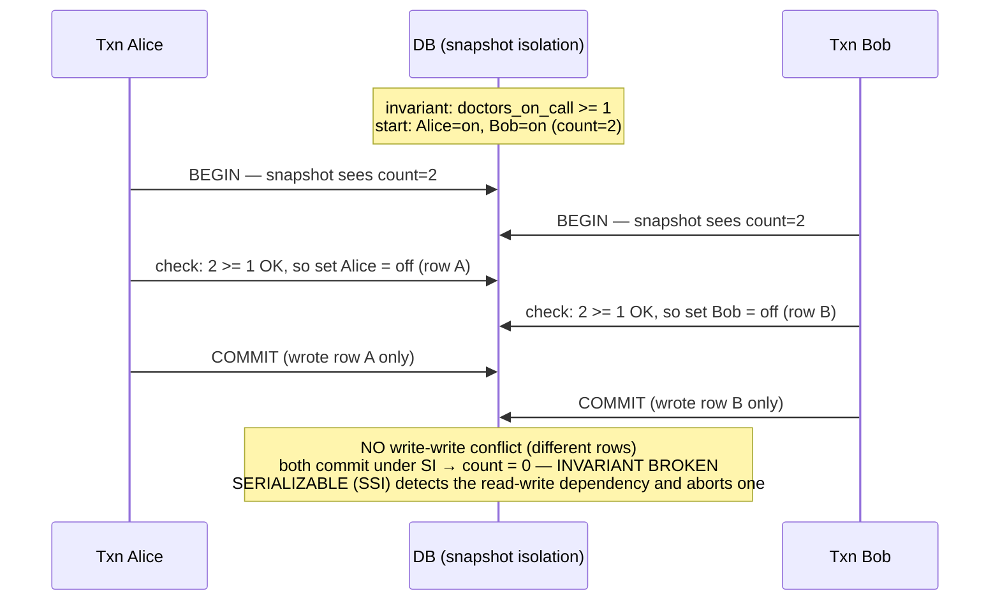

# Daily Reading — 2026-06-26  🔵 draft (awaiting Q&A)

**Today's two readings (one theme — "what your database actually does with your bytes" — two altitudes):**
1. **How a database stores your data on disk — B-tree vs LSM-tree.** The mechanism, one layer under SQL. Why PostgreSQL/MySQL update *in place* (a B-tree) while Cassandra/RocksDB/ScyllaDB/TiKV *append and merge* (an LSM-tree), and the single law that makes this a permanent trade-off rather than a solved problem: the **RUM conjecture** — you can optimize *read*, *update*, or *space*, but only two at once.
2. **How a database keeps your concurrent transactions from corrupting each other — isolation levels & MVCC.** What the "I" in ACID actually buys you, why the default is *weaker than you think*, the anomaly your `SELECT … FOR UPDATE` / advisory-lock instinct is really defending against, and why **snapshot isolation ≠ serializable** (the write-skew trap). Plus the 2026 strategic backdrop: *"just use Postgres,"* the distributed-Postgres race, and why everyone is bolting everything onto one engine.

> **Why this, and why now.** You've shipped on top of databases for a year — parameterized SQL, an advisory-lock pattern, idempotent retries — and those are *good distributed-systems instincts*. But they sit **on top of** the database as a black box. Both readings open the box at exactly the two seams that touch what you already do well. (1) The **storage-engine** reading is the disk-level twin of your GPU/memory sessions: write amplification, sequential-vs-random I/O, and SSD wear are *bandwidth-and-endurance* problems — your semiconductor/hardware lens applies almost verbatim ("don't move the big thing" becomes "don't rewrite the page in place"). (2) The **isolation** reading is the database-internals twin of your *concurrency* sessions (the GIL, `asyncio` races): your advisory locks and idempotency keys are **application-level concurrency control**, and you reach for them — often correctly — precisely because you can't assume the database's *default* isolation level prevents the race you're worried about. This reading tells you *exactly what it does and doesn't prevent*, so you can know when an advisory lock is load-bearing and when `SERIALIZABLE` would replace it (and what that costs). It feeds **M01 Ch3** (concurrency, just finished) sideways and **M03 Ch1–2** (relational model, transactions) head-on — the next course phase.

> **Diversification note.** This is the deliberate **swing out of AI** flagged at the end of the 06-16 reading. The last six readings clustered in AI (serving, RL, GPUs, agent context); this is foundations-first CS — storage and concurrency theory — ahead of the M02/M03 course phases. It still *connects* to your AI work (the §2 "just use Postgres" thread hits `pgvector` vs Pinecone, and 2025's database story was largely an AI story), but the muscle being trained is database internals, not model internals.

---

## 1. How a database stores your bytes — B-tree vs LSM-tree

🔗 **Primary (clean, quantitative comparison):** [B-Tree vs LSM-Tree — TiKV deep dive](https://tikv.org/deep-dive/key-value-engine/b-tree-vs-lsm/)
🔗 **The LSM side, explained from scratch:** [Log Structured Merge Trees — Ben Stopford](https://benstopford.com/2015/02/14/log-structured-merge-trees/)
🔗 **The law behind the trade-off:** [The RUM Conjecture — DASlab @ Harvard](http://daslab.seas.harvard.edu/rum-conjecture/) (Athanassoulis et al., EDBT 2016)
🔗 **Practitioner numbers (read/write/space amplification):** [Read, write & space amplification — B-Tree vs LSM — Mark Callaghan, *Small Datum*](http://smalldatum.blogspot.com/2015/11/read-write-space-amplification-b-tree.html)

**The one idea.** A storage engine is the part of the database that turns "store this row" into "write these bytes to these blocks," and there are two dominant designs, distinguished by **where a write lands**:

- A **B-tree** (B+ tree) is a balanced on-disk tree of fixed-size pages. To update a key you find its leaf page and **overwrite it in place**. Reads are a short, predictable walk from root to leaf — $O(\log_{b} n)$ page accesses, each potentially a random I/O. This is PostgreSQL, MySQL/InnoDB, SQLite, Oracle, SQL Server — every "classic" RDBMS.
- An **LSM-tree** (Log-Structured Merge tree) **never updates in place**. A write goes to an in-memory sorted buffer (the *memtable*) plus an append-only *write-ahead log*; when the memtable fills it is flushed as an immutable sorted file (an *SSTable*); a background **compaction** process merges these files over time. All disk writes are **sequential**. This is RocksDB, LevelDB, Cassandra, ScyllaDB, HBase, TiKV.

**The keystone trade-off — three "amplifications."** Every access method pays a tax measured three ways, and the two designs sit at opposite corners:

- **Write amplification** — bytes physically written per byte of logical data. A B-tree rewrites a whole page (often 8 KB) to change one row, *and* journals it first → high. An LSM appends sequentially → low *on the write itself*, but **compaction re-writes data several times** as it merges levels, so the LSM's write-amp is "low at the front, paid later in the background."
- **Read amplification** — work per logical read. A B-tree: one root-to-leaf walk. An LSM: a key might be in the memtable *or any* SSTable, so a read may probe many files (mitigated by Bloom filters and block caches) → higher read-amp, *especially for range scans* that must merge across all levels.
- **Space amplification** — disk used per byte of live data. A B-tree fragments and leaves half-empty pages; an LSM keeps superseded/deleted versions until compaction reclaims them.

**Why this is a *law*, not an engineering gap — the RUM conjecture.** Athanassoulis et al. formalized it: for the three overheads **R**ead, **U**pdate, **M**emory (space), *setting a tight bound on any two forces the third to blow up.* There is no access method that wins all three; "B-tree vs LSM" is just **two different choices of which corner to sacrifice.** B-tree picks low Read + low Space, pays Update. LSM picks low Update + (tunable) Space, pays Read. (This is the same flavour of impossibility result as CAP — a real boundary on the design space, not a TODO.)

<!-- DIAGRAM:START -->

Diagram source (Mermaid)

<!-- DIAGRAM:END -->

**The amplification trade-off, drawn (illustrative magnitudes, not a benchmark):**

*Reading it: the B-tree pays its tax on **writes** (rewrite-the-page + fragmentation space), the LSM pays its on **reads** (probe many files) — exactly the RUM trade-off. The numbers are illustrative; the **shape** (each engine tall in a different place) is the real content.*

**Connect it to *you* — this is your GPU/memory session, on disk.** Three bridges to what you already own:

1. **"Don't move the big thing" → "don't rewrite the page in place."** Your 06-14 unifier (don't move/duplicate/over-reserve the big thing) is the LSM design philosophy verbatim: an in-place B-tree update *moves the big thing* (read-modify-write a whole page) on every write; the LSM refuses to, batching writes in memory and only ever appending. The cost it accepts in exchange — re-reading many files on a read, re-writing during compaction — is the *deferred* version of the same tax.
2. **Sequential vs random I/O is your bandwidth-vs-latency axis again.** The whole reason LSMs exist is that **sequential writes are far cheaper than random writes** on both spinning disks (seek time) and SSDs (erase-block granularity). This is the storage twin of your decode-is-bandwidth-bound reasoning: the bottleneck isn't *how many bytes* but *how they're laid out for the device.*
3. **Write amplification is literally a semiconductor-endurance problem — your home turf.** NAND flash wears out after a bounded number of program/erase cycles per cell, and the SSD's own FTL adds another layer of write amplification on top of the database's. An engine with 10× write-amp burns through flash endurance ~10× faster. The "modern hardware changes the answer" papers ([FAST '22, transparent-compression SSDs](https://www.usenix.org/conference/fast22/presentation/qiao)) are exactly the kind of device-level re-derivation you did for derating — *the access method and the device's physics are coupled.*

**Questions to pressure-test while you read (your style):**
- LSMs turn random writes into sequential writes, "so LSMs are just strictly better for write-heavy workloads." Where does that break? (Hint: compaction. What does background compaction do to your *p99 write latency* and your *read amplification* right when a big merge fires — and why is that worse on a workload of small random updates than on append-only logs?)
- The RUM conjecture says you can't win all three of R/U/M. Postgres added asynchronous I/O and skip-scan in v18 — does a *hardware/implementation* improvement ever let you escape RUM, or only **slide along** the same frontier? (Re-rank: improving the constant factor vs moving the Pareto boundary.)
- A B-tree read is $O(\log_{b} n)$ "so reads are cheap." But each hop can be a random I/O and the tree may not fit in RAM. Restate the *real* read cost in terms of **cache/buffer-pool hit rate**, and connect it to why your working-set-vs-RAM intuition (from the OOM session) decides whether a B-tree feels fast or slow.

---

## 2. How a database isolates concurrent transactions — MVCC & the anomaly ladder

🔗 **Primary (the canonical, hands-on tour):** [Hermitage: Testing the "I" in ACID — Martin Kleppmann](https://martin.kleppmann.com/2014/11/25/hermitage-testing-the-i-in-acid.html) · [test suite on GitHub](https://github.com/ept/hermitage)
🔗 **Build the intuition by building it:** [Implementing MVCC and the major SQL isolation levels (400 lines of Go) — Phil Eaton](https://notes.eatonphil.com/2024-05-16-mvcc.html)
🔗 **The reference (read the table):** [PostgreSQL docs — Transaction Isolation](https://www.postgresql.org/docs/current/transaction-iso.html)
🔗 **The 2026 backdrop:** [Databases in 2025: A Year in Review — Andy Pavlo (CMU)](https://www.cs.cmu.edu/~pavlo/blog/2026/01/2025-databases-retrospective.html) · [It's 2026, Just Use Postgres — Raja Rao (TigerData)](https://www.tigerdata.com/blog/its-2026-just-use-postgres)

**The one idea.** "ACID isolation" sounds binary — your transactions are isolated or they aren't. It is actually a **ladder of levels**, each preventing more *anomalies* (concurrency bugs) at more cost, and **the default on most databases is several rungs below the top.** The ladder, from the ANSI standard plus the anomalies the standard forgot:

| Isolation level | Dirty read | Non-repeatable read | Phantom | Write skew / lost update | Typical engine |
|---|---|---|---|---|---|
| Read Uncommitted | ✅ possible | ✅ | ✅ | ✅ | (rarely used) |
| **Read Committed** | ❌ prevented | ✅ possible | ✅ possible | ✅ possible | **Postgres / Oracle DEFAULT** |
| **Repeatable Read** | ❌ | ❌ | ❌ (in PG) | ✅ possible | **MySQL/InnoDB DEFAULT** |
| Snapshot Isolation | ❌ | ❌ | ❌ | ⚠️ **write skew still possible** | PG "Repeatable Read" *is* SI |
| Serializable | ❌ | ❌ | ❌ | ❌ prevented | PG `SERIALIZABLE` (SSI) |

Two facts on that table bite people, and both are in Kleppmann's Hermitage post:
- **The names lie across vendors.** Oracle's "SERIALIZABLE" is really *snapshot isolation*; PostgreSQL's "REPEATABLE READ" is also really *snapshot isolation*; MySQL's "REPEATABLE READ" is something else again. The ANSI level *names* don't pin down behaviour — only a test suite (Hermitage) or the engine's docs do.
- **The default is weak on purpose.** Read Committed gives each *statement* a fresh snapshot but not each *transaction*, so two statements in one transaction can see different data. It's the default because it's cheap and rarely surprises simple code — but it's exactly the gap your defensive locking is plugging.

**How modern engines do it without read locks — MVCC.** Older databases serialized readers and writers with locks (readers block writers). Modern ones use **Multi-Version Concurrency Control**: every row update writes a *new version* tagged with the transaction ID that created it (and later, the one that deleted it); each transaction reads from a **consistent snapshot** by applying *visibility rules* — "show me the version that was committed as of my snapshot." **Readers never block writers and writers never block readers.** Phil Eaton's 400-line implementation makes this concrete: the *only* thing that changes between Read Committed, Repeatable Read, Snapshot, and Serializable is **the visibility rule plus which conflicts you check at commit.** (Cost: old versions pile up — Postgres must `VACUUM` them, and table *bloat* from un-vacuumed dead tuples is a real production failure mode, the storage-§1 space-amplification tax showing up in the transaction layer.)

**The subtle trap — snapshot isolation is *not* serializable (write skew).** This is the anomaly worth burning into memory, because SI prevents *almost* everything and feels safe. Classic example: a hospital requires **at least one doctor on call.** Two doctors, Alice and Bob, are both on call. Each opens a transaction, each reads "2 doctors on call ≥ 1, fine," each takes *themselves* off call. Under SI both commit — they wrote *different rows*, so there's **no write-write conflict to detect** — and now **zero** doctors are on call. The invariant held in every snapshot and was violated in reality.

<!-- DIAGRAM:START -->

Diagram source (Mermaid)

<!-- DIAGRAM:END -->

**Connect it to *you* — your advisory locks are hand-rolled serialization.** This is the bridge to your distributed-systems strength:

1. **Why you reach for `pg_advisory_lock` / `SELECT … FOR UPDATE`.** When you wrap a read-check-then-write in an advisory lock, you are **manually forcing serializability** for that operation because you (correctly) don't trust Read Committed to prevent a write skew or lost update. That instinct is right — but now you can name *exactly which anomaly* you're preventing, and decide per-case whether a row lock (`FOR UPDATE`), a `SERIALIZABLE` transaction, or a unique constraint is the cleaner tool. (Often a **database constraint** beats a lock — "define the error out of existence," your Ousterhout keeper, applied to data integrity: a `CHECK`/`UNIQUE`/exclusion constraint makes the bad state *unrepresentable* instead of *guarded*.)
2. **`SERIALIZABLE` (SSI) is the lock you didn't write — and its cost is the retry you already do.** Postgres's Serializable Snapshot Isolation gives true serializability by *detecting* dangerous read-write dependencies and **aborting one transaction with a serialization failure**. The price is that you must be ready to **retry** the aborted transaction — which is *exactly your idempotency-and-retry pattern* already in place. So for you, `SERIALIZABLE` is unusually cheap to adopt: you have the retry machinery; you'd be trading bespoke advisory locks for a declarative guarantee + a retry loop you already run.
3. **The eval/Arena angle (light, since we're swinging out of AI):** "consistent snapshot" is the same idea as freezing a benchmark — if two model-comparison runs read the leaderboard mid-update, they disagree for non-model reasons. A read-only snapshot transaction gives you a stable view, the DB-level version of the frozen-environment point from 06-16.

**The 2026 backdrop (why this is current, not just textbook).** Andy Pavlo's *Databases in 2025* retrospective: the year's biggest stories were **Postgres** ones — Databricks bought Neon (~$1B), Snowflake bought Crunchy Data (~$250M), and **three** competing projects launched to add horizontal sharding to Postgres (Multigres, Neki, PgDog). The popular framing — *"It's 2026, just use Postgres"* — is that one engine plus extensions now replaces a zoo of specialized systems: `pgvector`/pgvectorscale for vector search (vs Pinecone — *your* RAG stack), TimescaleDB for time-series, JSONB for documents, `pgmq` for queues, PostGIS for geo. Worth reading **with** Pavlo's skepticism: consolidating onto one engine trades operational simplicity for the cost of pushing Postgres into workloads its **B-tree, MVCC, single-writer** design (everything in §1–§2) wasn't built for — which is precisely *why* the sharding race and the separate-storage architectures (Neon/Lakebase on S3) exist. The storage-engine and isolation fundamentals above are the lens for judging when "just use Postgres" is right and when it isn't.

**Questions to pressure-test while you read:**
- Read Committed gives a fresh snapshot *per statement*; Repeatable Read/SI gives one *per transaction*. Construct the smallest two-statement transaction that returns inconsistent results under Read Committed but not under SI — and decide whether any code you've shipped has that shape. (This is the "non-repeatable read" row made concrete.)
- Write skew commits because there's *no write-write conflict*. So why can't the database just *also* lock the rows you **read**, to catch it cheaply? (Re-rank: that's essentially pessimistic 2-phase locking / materializing predicate locks — what does it cost in concurrency, and why did Postgres instead build SSI to detect the dependency *optimistically* and abort? Tie it to your optimistic-vs-pessimistic, retry-friendly instincts.)
- "Just use Postgres for everything" leans on MVCC + B-tree + extensions. Pick **one** workload from §2's list (queue, vector search, time-series, cache) and name the §1/§2 property that makes Postgres a *worse* fit than the specialist — and what the specialist sacrifices in return. (e.g. a queue hammers MVCC with high-churn rows → VACUUM/bloat pressure; Redis-as-cache skips durability the B-tree pays for.)

---

## Key terms (English · 大陆 简体 · 台灣 繁體)

Databases have several genuine Mainland/Taiwan term splits (not just simplified-vs-traditional) — flagged with ⚠.

| English | 大陆 (简体) | 台灣 (繁體) | Note |
|---|---|---|---|
| database | 数据库 | 資料庫 | ⚠ different word — 数据 vs 資料 |
| data | 数据 | 資料 | ⚠ recurring split |
| server | 服务器 | 伺服器 | ⚠ different word |
| transaction (DB) | 事务 | 交易 / 異動 | ⚠ TW often 交易; 異動 in some texts |
| index | 索引 | 索引 | same |
| concurrency | 并发 | 並行 / 並發 | ⚠ TW commonly 並行 |
| lock | 锁 | 鎖 | script only |
| cache | 缓存 | 快取 | ⚠ different word |
| isolation level | 隔离级别 | 隔離等級 | 级别 vs 等級 |
| snapshot | 快照 | 快照 | same |
| consistency | 一致性 | 一致性 | same |
| default (setting) | 默认 | 預設 | ⚠ different word |
| write amplification | 写放大 | 寫入放大 | script + wording |
| compaction (LSM) | 压缩合并 / 合并 | 壓實 / 合併 | wording varies |

---

## What to take away (read first on review)

- **Two storage-engine families, split by *where a write lands*:** B-tree overwrites a page **in place** (cheap reads, expensive random writes — Postgres/InnoDB/SQLite); LSM-tree **appends + compacts** (cheap sequential writes, expensive multi-file reads — RocksDB/Cassandra/ScyllaDB).
- **The RUM conjecture makes it permanent:** you can optimize at most two of **R**ead / **U**pdate / **M**emory. B-tree vs LSM is a *choice of which corner to sacrifice*, not a problem awaiting a solution. (Storage's CAP.)
- **Write amplification = your "don't move the big thing" + an SSD-endurance problem** — in-place page rewrites and LSM compaction both re-write data; sequential-vs-random layout, not raw byte count, sets the cost. Your hardware lens transfers directly.
- **Isolation is a *ladder*, and the default is low.** Read Committed (Postgres/Oracle default) allows non-repeatable reads, phantoms, and write skew. The level *names* differ across vendors (Oracle "Serializable" = snapshot isolation) — trust Hermitage / the docs, not the name.
- **MVCC = versioned rows + visibility rules**; the only thing that changes between levels is *which versions you see* and *which conflicts you check at commit*. Cost = dead-version bloat (`VACUUM`).
- **Snapshot isolation ≠ serializable: write skew** survives SI because two transactions writing *different* rows have no write-write conflict (the doctors-on-call bug). **`SERIALIZABLE` (SSI)** catches it by aborting one transaction — paid for with a **retry**, which you already do.
- **Your advisory locks are hand-rolled serialization.** Now you can name the anomaly each one prevents and choose deliberately: advisory lock vs `FOR UPDATE` vs `SERIALIZABLE`+retry vs a **constraint** that makes the bad state unrepresentable.
- **2026 context:** the database story is a *Postgres* story (Neon/Crunchy acquisitions, the Multigres/Neki/PgDog sharding race, "just use Postgres" + extensions). Judge "one engine for everything" through the §1/§2 fundamentals — its B-tree/MVCC/single-writer core is why the sharding race exists.

---

## What we worked out — the thread you drove

*(To be filled after our Q&A, then this reading is finalized — as with prior readings, this section is the durable record. Read it first on review.)*

---

## Sources
- [B-Tree vs LSM-Tree — TiKV deep dive](https://tikv.org/deep-dive/key-value-engine/b-tree-vs-lsm/)
- [Log Structured Merge Trees — Ben Stopford](https://benstopford.com/2015/02/14/log-structured-merge-trees/)
- [The RUM Conjecture — DASlab @ Harvard (Athanassoulis et al., EDBT 2016)](http://daslab.seas.harvard.edu/rum-conjecture/)
- [Read, write & space amplification — B-Tree vs LSM — Mark Callaghan, *Small Datum*](http://smalldatum.blogspot.com/2015/11/read-write-space-amplification-b-tree.html)
- [Closing the B-tree vs. LSM-tree Write Amplification Gap on Modern Storage Hardware (FAST '22)](https://www.usenix.org/conference/fast22/presentation/qiao)
- [Hermitage: Testing the "I" in ACID — Martin Kleppmann](https://martin.kleppmann.com/2014/11/25/hermitage-testing-the-i-in-acid.html) · [GitHub](https://github.com/ept/hermitage)
- [Implementing MVCC and major SQL isolation levels — Phil Eaton](https://notes.eatonphil.com/2024-05-16-mvcc.html)
- [PostgreSQL docs — Transaction Isolation](https://www.postgresql.org/docs/current/transaction-iso.html)
- [Databases in 2025: A Year in Review — Andy Pavlo (CMU)](https://www.cs.cmu.edu/~pavlo/blog/2026/01/2025-databases-retrospective.html)
- [It's 2026, Just Use Postgres — Raja Rao (TigerData)](https://www.tigerdata.com/blog/its-2026-just-use-postgres)

*Draft prepared 2026-06-26. Swing out of AI into CS foundations (storage + concurrency), ahead of the M02/M03 course phases. Two reframes to carry: **(1) B-tree vs LSM is the RUM conjecture made physical — your "don't move the big thing" + SSD-endurance lens, on disk;** **(2) your advisory locks are hand-rolled serializability — isolation levels tell you exactly which anomaly you're defending against, and `SERIALIZABLE`+retry may be the declarative replacement.***
