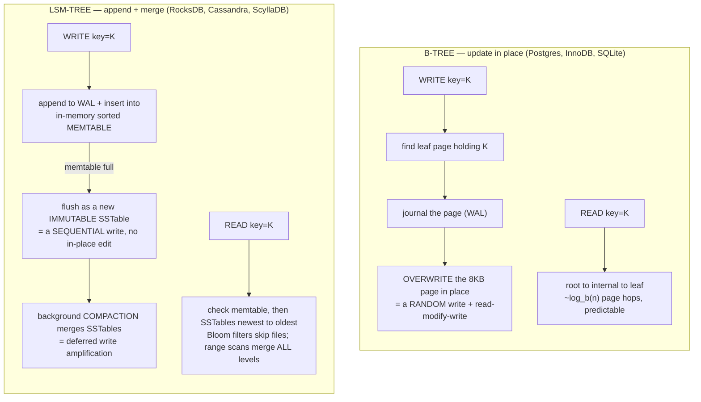
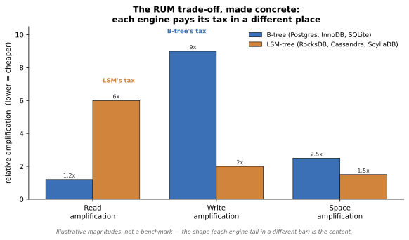
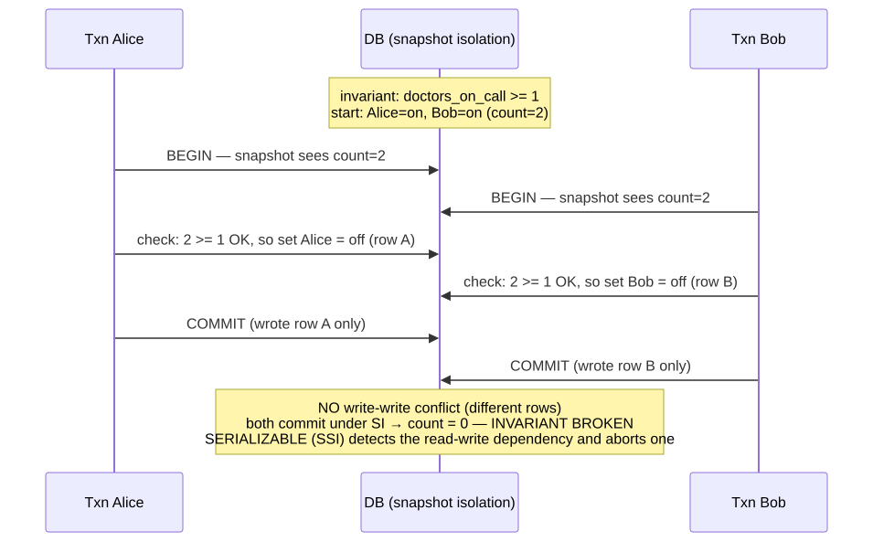
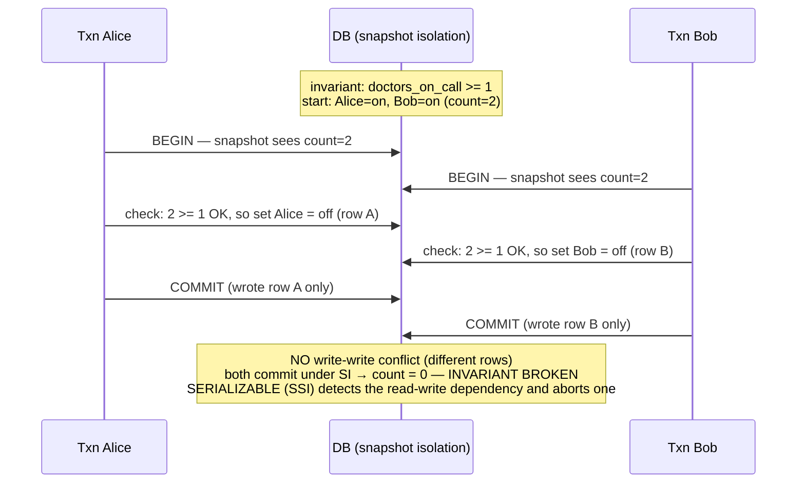

# Daily Reading — 2026-06-26  ✅ finalized

**Today's two readings (one theme — "what your database actually does with your bytes" — two altitudes):**
1. **How a database stores your data on disk — B-tree vs LSM-tree.** The mechanism, one layer under SQL. Why PostgreSQL/MySQL update *in place* (a B-tree) while Cassandra/RocksDB/ScyllaDB/TiKV *append and merge* (an LSM-tree), and the single law that makes this a permanent trade-off rather than a solved problem: the **RUM conjecture** — you can optimize *read*, *update*, or *space*, but only two at once.
2. **How a database keeps your concurrent transactions from corrupting each other — isolation levels & MVCC (multi-version concurrency control).** What the "I" in ACID (Atomicity, Consistency, Isolation, Durability) actually buys you, why the default is *weaker than you think*, the anomaly your `SELECT … FOR UPDATE` / advisory-lock instinct is really defending against, and why **snapshot isolation ≠ serializable** (the write-skew trap). Plus the 2026 strategic backdrop: *"just use Postgres,"* the distributed-Postgres race, and why everyone is bolting everything onto one engine.

> **Why this, and why now.** You've shipped on top of databases for a year — parameterized SQL, an advisory-lock pattern, idempotent retries — and those are *good distributed-systems instincts*. But they sit **on top of** the database as a black box. Both readings open the box at exactly the two seams that touch what you already do well. (1) The **storage-engine** reading is the disk-level twin of your GPU/memory sessions: write amplification, sequential-vs-random I/O, and SSD (solid-state drive) wear are *bandwidth-and-endurance* problems — your semiconductor/hardware lens applies almost verbatim ("don't move the big thing" becomes "don't rewrite the page in place"). (2) The **isolation** reading is the database-internals twin of your *concurrency* sessions (the GIL [Global Interpreter Lock], `asyncio` races): your advisory locks and idempotency keys are **application-level concurrency control**, and you reach for them — often correctly — precisely because you can't assume the database's *default* isolation level prevents the race you're worried about. This reading tells you *exactly what it does and doesn't prevent*, so you can know when an advisory lock is load-bearing and when `SERIALIZABLE` would replace it (and what that costs). It feeds **M01 Ch3** (concurrency, just finished) sideways and **M03 Ch1–2** (relational model, transactions) head-on — the next course phase.

> **Diversification note.** This is the deliberate **swing out of AI** flagged at the end of the 06-16 reading. The last six readings clustered in AI (serving, RL, GPUs, agent context); this is foundations-first CS (computer science) — storage and concurrency theory — ahead of the M02/M03 course phases. It still *connects* to your AI work (the §2 "just use Postgres" thread hits `pgvector` vs Pinecone, and 2025's database story was largely an AI story), but the muscle being trained is database internals, not model internals.

---

## 1. How a database stores your bytes — B-tree vs LSM-tree

<b>Vocabulary for this section</b> — every term, abbreviation and symbol used below (click to expand)

**Abbreviations**

| Short | Stands for | Meaning |
|---|---|---|
| **LSM-tree** | Log-Structured Merge tree | a storage engine that only ever appends, then merges files in the background |
| **B+ tree** | (the B-tree variant that stores all data in the leaves) | what "B-tree" means in every real database |
| **RDBMS** | relational database management system | the classic SQL database family — Postgres, MySQL, Oracle, SQL Server |
| **WAL** | write-ahead log | an append-only journal written *before* the data pages, so a crash can be replayed |
| **SSTable** | sorted string table | an immutable file of key-value pairs in sorted order, flushed from the memtable |
| **I/O** | input/output | reads and writes to the storage device |
| **RUM** | Read, Update, Memory | the three overheads the conjecture says you cannot all minimise at once |
| **CAP** | Consistency, Availability, Partition tolerance | the older impossibility result, cited as the same kind of hard boundary |
| **KB** | kilobyte | one thousand bytes; the typical B-tree page is 8 KB |
| **RAM** | random-access memory | main memory — where the buffer pool and memtable live |
| **SSD** | solid-state drive | flash-based storage, with no seek time but an erase-block granularity |
| **NAND** | (the flash memory cell type) | the storage medium inside an SSD, which wears out with use |
| **P/E cycle** | program/erase cycle | one write-and-wipe of a flash block; each cell tolerates a bounded number |
| **FTL** | flash translation layer | the SSD's internal firmware that remaps writes, adding its own write amplification |
| **OOM** | out of memory | the failure mode when the working set outgrows RAM |
| **p99** | 99th percentile | the slow tail: the value 99% of requests come in under |
| **GPU** | graphics processing unit | referenced as the earlier session whose bandwidth reasoning transfers here |
| **FAST** | (USENIX Conference on File and Storage Technologies) | the storage-research venue of the cited hardware paper |

**Symbols used in the formulas**

| Symbol | Reads as | Meaning |
|---|---|---|
| $O(\cdot)$ | "order of" | big-O notation: how the cost grows as the data grows, ignoring constant factors |
| $n$ | "n" | the number of keys stored in the tree |
| $b$ | "b" | the branching factor — how many children one tree page points to |
| $O(\log_{b} n)$ | "order log base b of n" | the number of page hops from root to leaf; with a large $b$ the tree is very shallow |

**Terms**

| Term | Definition |
|---|---|
| **Storage engine** | the layer that turns "store this row" into actual bytes written to actual blocks |
| **Access method** | the data structure and algorithm used to find and update data on disk |
| **Page** | the fixed-size block a database reads and writes as a unit, typically 8 KB |
| **Leaf page** | the bottom level of a B-tree, where the rows themselves live |
| **Update in place** | overwriting the existing bytes where the row already sits |
| **Read-modify-write** | having to read a whole page in just to change a few bytes and write it all back |
| **Random I/O** | reads or writes scattered across the device, which it handles far less efficiently |
| **Sequential I/O** | reads or writes in contiguous order, which every storage device prefers |
| **Seek time** | the mechanical delay while a spinning disk's head moves — what makes random I/O expensive there |
| **Erase-block granularity** | an SSD's rule that flash must be wiped in large blocks, not per byte |
| **Memtable** | the in-memory sorted buffer an LSM write lands in first |
| **Flush** | writing a full memtable out as a new immutable file |
| **Immutable** | never modified after creation; new data supersedes old rather than overwriting it |
| **Compaction** | the background process that merges SSTables, discarding superseded and deleted versions |
| **Level** | one tier of an LSM's file hierarchy; compaction moves data down through the levels |
| **Bloom filter** | a tiny probabilistic index that can say "definitely not in this file", letting a read skip it |
| **Block cache** | in-memory copies of recently read blocks, so a repeat read avoids the device |
| **Buffer pool** | the database's cache of pages in RAM; its hit rate decides whether a B-tree read is fast |
| **Working set** | the portion of data actually being touched — the thing that has to fit in RAM |
| **Range scan** | reading all keys between two bounds, which an LSM must merge across every level |
| **Write amplification** | bytes physically written per byte of logical data |
| **Read amplification** | work done per logical read — how many places you must look |
| **Space amplification** | disk consumed per byte of live data |
| **Fragmentation** | wasted space inside partially-filled pages |
| **RUM conjecture** | the result that tightening any two of read, update and memory overhead forces the third up |
| **Impossibility result** | a proof that no design can have everything — a boundary, not an unfinished to-do |
| **Pareto frontier** | the curve of best possible trade-offs; an implementation gain can slide along it without moving it |
| **Constant factor** | the part of the cost big-O throws away, and the part engineering usually improves |
| **Asynchronous I/O** | issuing reads without waiting for each one, so several are in flight at once |
| **Skip scan** | an index-scan optimisation that jumps over ranges of a leading column instead of reading them |
| **Endurance** | how many writes a flash device can absorb before it wears out |
| **Derating** | operating a component below its rated limit to extend its life — the learner's own hardware practice |
| **PostgreSQL / MySQL / InnoDB / SQLite / Oracle / SQL Server** | the classic B-tree databases named here; InnoDB is MySQL's default storage engine |
| **RocksDB / LevelDB / Cassandra / ScyllaDB / HBase / TiKV** | the LSM-tree engines named here |

🔗 **Primary (clean, quantitative comparison):** [B-Tree vs LSM-Tree — TiKV deep dive](https://tikv.org/deep-dive/key-value-engine/b-tree-vs-lsm/)
🔗 **The LSM side, explained from scratch:** [Log Structured Merge Trees — Ben Stopford](https://benstopford.com/2015/02/14/log-structured-merge-trees/)
🔗 **The law behind the trade-off:** [The RUM Conjecture — DASlab @ Harvard](http://daslab.seas.harvard.edu/rum-conjecture/) (Athanassoulis et al., EDBT 2016)
🔗 **Practitioner numbers (read/write/space amplification):** [Read, write & space amplification — B-Tree vs LSM (log-structured merge) — Mark Callaghan, *Small Datum*](http://smalldatum.blogspot.com/2015/11/read-write-space-amplification-b-tree.html)

**The one idea.** A storage engine is the part of the database that turns "store this row" into "write these bytes to these blocks," and there are two dominant designs, distinguished by **where a write lands**:

- A **B-tree** (B+ tree) is a balanced on-disk tree of fixed-size pages. To update a key you find its leaf page and **overwrite it in place**. Reads are a short, predictable walk from root to leaf — $O(\log_{b} n)$ page accesses, each potentially a random I/O. This is PostgreSQL, MySQL/InnoDB, SQLite, Oracle, SQL Server — every "classic" RDBMS (relational database management system).
- An **LSM-tree** (Log-Structured Merge tree) **never updates in place**. A write goes to an in-memory sorted buffer (the *memtable*) plus an append-only *write-ahead log*; when the memtable fills it is flushed as an immutable sorted file (an *SSTable*); a background **compaction** process merges these files over time. All disk writes are **sequential**. This is RocksDB, LevelDB, Cassandra, ScyllaDB, HBase, TiKV.

**The keystone trade-off — three "amplifications."** Every access method pays a tax measured three ways, and the two designs sit at opposite corners:

- **Write amplification** — bytes physically written per byte of logical data. A B-tree rewrites a whole page (often 8 KB) to change one row, *and* journals it first → high. An LSM appends sequentially → low *on the write itself*, but **compaction re-writes data several times** as it merges levels, so the LSM's write-amp is "low at the front, paid later in the background."
- **Read amplification** — work per logical read. A B-tree: one root-to-leaf walk. An LSM: a key might be in the memtable *or any* SSTable, so a read may probe many files (mitigated by Bloom filters and block caches) → higher read-amp, *especially for range scans* that must merge across all levels.
- **Space amplification** — disk used per byte of live data. A B-tree fragments and leaves half-empty pages; an LSM keeps superseded/deleted versions until compaction reclaims them.

**Why this is a *law*, not an engineering gap — the RUM conjecture.** Athanassoulis et al. formalized it: for the three overheads **R**ead, **U**pdate, **M**emory (space), *setting a tight bound on any two forces the third to blow up.* There is no access method that wins all three; "B-tree vs LSM" is just **two different choices of which corner to sacrifice.** B-tree picks low Read + low Space, pays Update. LSM picks low Update + (tunable) Space, pays Read. (This is the same flavour of impossibility result as CAP — a real boundary on the design space, not a TODO.)

<!-- DIAGRAM:START -->

Diagram source (Mermaid)

```mermaid
flowchart TB
    subgraph BT["B-TREE — update in place (Postgres, InnoDB, SQLite)"]
        direction TB
        bw["WRITE key=K"] --> bf["find leaf page holding K"]
        bf --> bj["journal the page (WAL)"]
        bj --> bo["OVERWRITE the 8KB page in place<br/>= a RANDOM write + read-modify-write"]
        br["READ key=K"] --> brt["root to internal to leaf<br/>~log_b(n) page hops, predictable"]
    end
    subgraph LSM["LSM-TREE — append + merge (RocksDB, Cassandra, ScyllaDB)"]
        direction TB
        lw["WRITE key=K"] --> lm["append to WAL + insert into<br/>in-memory sorted MEMTABLE"]
        lm -->|"memtable full"| lf["flush as a new IMMUTABLE SSTable<br/>= a SEQUENTIAL write, no in-place edit"]
        lf --> lc["background COMPACTION merges SSTables<br/>= deferred write amplification"]
        lr["READ key=K"] --> lrt["check memtable, then SSTables newest to oldest<br/>Bloom filters skip files; range scans merge ALL levels"]
    end
```

<!-- DIAGRAM:END -->

**The amplification trade-off, drawn (illustrative magnitudes, not a benchmark):**

*Reading it: the B-tree pays its tax on **writes** (rewrite-the-page + fragmentation space), the LSM pays its on **reads** (probe many files) — exactly the RUM trade-off. The numbers are illustrative; the **shape** (each engine tall in a different place) is the real content.*

**Connect it to *you* — this is your GPU/memory session, on disk.** Three bridges to what you already own:

1. **"Don't move the big thing" → "don't rewrite the page in place."** Your 06-14 unifier (don't move/duplicate/over-reserve the big thing) is the LSM design philosophy verbatim: an in-place B-tree update *moves the big thing* (read-modify-write a whole page) on every write; the LSM refuses to, batching writes in memory and only ever appending. The cost it accepts in exchange — re-reading many files on a read, re-writing during compaction — is the *deferred* version of the same tax.
2. **Sequential vs random I/O is your bandwidth-vs-latency axis again.** The whole reason LSMs exist is that **sequential writes are far cheaper than random writes** on both spinning disks (seek time) and SSDs (erase-block granularity). This is the storage twin of your decode-is-bandwidth-bound reasoning: the bottleneck isn't *how many bytes* but *how they're laid out for the device.*
3. **Write amplification is literally a semiconductor-endurance problem — your home turf.** NAND flash wears out after a bounded number of program/erase cycles per cell, and the SSD's own FTL adds another layer of write amplification on top of the database's. An engine with 10× write-amp burns through flash endurance ~10× faster. The "modern hardware changes the answer" papers ([FAST '22, transparent-compression SSDs](https://www.usenix.org/conference/fast22/presentation/qiao)) are exactly the kind of device-level re-derivation you did for derating — *the access method and the device's physics are coupled.*

**Questions to pressure-test while you read (your style):**
- LSMs turn random writes into sequential writes, "so LSMs are just strictly better for write-heavy workloads." Where does that break? (Hint: compaction. What does background compaction do to your *p99 write latency* and your *read amplification* right when a big merge fires — and why is that worse on a workload of small random updates than on append-only logs?)
- The RUM conjecture says you can't win all three of R/U/M. Postgres added asynchronous I/O and skip-scan in v18 — does a *hardware/implementation* improvement ever let you escape RUM, or only **slide along** the same frontier? (Re-rank: improving the constant factor vs moving the Pareto boundary.)
- A B-tree read is $O(\log_{b} n)$ "so reads are cheap." But each hop can be a random I/O and the tree may not fit in RAM. Restate the *real* read cost in terms of **cache/buffer-pool hit rate**, and connect it to why your working-set-vs-RAM intuition (from the OOM — out of memory — session) decides whether a B-tree feels fast or slow.

---

## 2. How a database isolates concurrent transactions — MVCC & the anomaly ladder

<b>Vocabulary for this section</b> — every term, abbreviation and product name used below (click to expand)

**Abbreviations**

| Short | Stands for | Meaning |
|---|---|---|
| **ACID** | Atomicity, Consistency, Isolation, Durability | the four guarantees a classic transaction promises; this section is about the "I" |
| **MVCC** | multi-version concurrency control | keeping several versions of each row so readers see a snapshot and never block writers |
| **SI** | snapshot isolation | a level where a transaction reads one consistent snapshot throughout — **note the collision: `SI` elsewhere means SI units** |
| **SSI** | serializable snapshot isolation | Postgres's way of getting true serializability by detecting dangerous dependencies and aborting one transaction |
| **ANSI** | American National Standards Institute | the body whose SQL standard named the isolation levels |
| **PG** | PostgreSQL | shorthand for the database throughout the table |
| **SQL** | Structured Query Language | the query language of relational databases |
| **DB** | database | the system as a whole |
| **2PL** | two-phase locking | the pessimistic locking scheme that acquires locks, then releases them only at the end |
| **RAG** | retrieval-augmented generation | fetching documents to ground a model's answer — the learner's stack that uses a vector store |
| **S3** | (Amazon's object storage service) | the cheap durable store the separated-storage architectures build on |
| **CMU** | Carnegie Mellon University | the author's institution for the *Databases in 2025* retrospective |
| **B-tree** | (the classic balanced on-disk index) | the storage structure from section 1, named again as part of Postgres's design |

**Terms**

| Term | Definition |
|---|---|
| **Transaction** | a group of statements that should take effect all together or not at all |
| **Isolation level** | how much concurrent transactions are allowed to see of each other's in-progress work |
| **Anomaly** | a specific concurrency bug a given isolation level does or does not prevent |
| **Dirty read** | reading data another transaction wrote but has not committed |
| **Non-repeatable read** | reading the same row twice in one transaction and getting different values |
| **Phantom read** | re-running the same query and finding rows that were not there before |
| **Lost update** | two transactions read-modify-write the same row and one's change silently disappears |
| **Write skew** | two transactions each read the same data, each write a *different* row, and together break an invariant |
| **Read Uncommitted / Read Committed / Repeatable Read / Serializable** | the four ANSI levels, from weakest to strongest |
| **Snapshot** | a fixed view of the database as of one moment, which a transaction reads from |
| **Consistent snapshot** | a snapshot containing only committed data, with no half-applied transaction visible |
| **Visibility rule** | the test deciding which version of a row a given transaction is allowed to see |
| **Row version** | one copy of a row, tagged with the transaction that created it and the one that deleted it |
| **Transaction ID** | the sequence number identifying a transaction, used to tag versions and order snapshots |
| **Commit** | making a transaction's effects permanent and visible to others |
| **Abort / rollback** | discarding a transaction's effects entirely |
| **Serialization failure** | the error Postgres raises when SSI aborts a transaction to preserve serializability |
| **Serializability** | the guarantee that the result is as if the transactions had run one after another |
| **Invariant** | a rule the data must always satisfy, such as "at least one doctor on call" |
| **Write-write conflict** | two transactions writing the same row — the conflict SI can detect, and write skew avoids |
| **Read-write dependency** | one transaction reading what another is about to write; the pattern SSI watches for |
| **Optimistic concurrency** | let transactions run and detect conflicts at commit, aborting if needed |
| **Pessimistic concurrency** | take locks up front so conflicts cannot happen |
| **Two-phase locking** | the pessimistic scheme that holds every lock until the transaction ends |
| **Predicate lock** | a lock on a *condition* rather than on existing rows, needed to block phantoms |
| **Lock** | a claim on data that makes others wait |
| **Advisory lock (`pg_advisory_lock`)** | an application-defined Postgres lock on an arbitrary number, used to hand-roll mutual exclusion |
| **`SELECT … FOR UPDATE`** | a query that locks the rows it returns so nobody else can change them until you commit |
| **Constraint (`CHECK`, `UNIQUE`, exclusion)** | a rule the database itself enforces, making a bad state impossible rather than merely guarded |
| **Idempotency** | designing an operation so re-running it has the same effect as running it once — what makes retries safe |
| **Retry loop** | re-running an aborted transaction, which is the price of using `SERIALIZABLE` |
| **`VACUUM`** | Postgres's housekeeping that reclaims row versions no transaction can still see |
| **Bloat** | disk wasted on dead row versions that have not been vacuumed — space amplification in the transaction layer |
| **Dead tuple** | an obsolete row version awaiting vacuum |
| **High churn** | a workload that inserts and deletes the same rows rapidly, e.g. a queue, which stresses `VACUUM` |
| **Durability** | the guarantee that a committed write survives a crash — what a pure cache declines to provide |
| **Sharding** | splitting one logical database horizontally across several machines |
| **Extension** | a plug-in that adds capability to Postgres without forking it |
| **Hermitage** | Kleppmann's test suite that determines what an engine's isolation levels actually do |
| **Benchmark freeze** | fixing the evaluation so two runs are comparable — the analogy drawn to a read-only snapshot |
| **Postgres / Neon / Lakebase / Crunchy Data / Databricks / Snowflake** | the Postgres-ecosystem companies and products named in the 2026 backdrop, including the separated-storage offerings |
| **Multigres / Neki / PgDog** | the three projects competing to add horizontal sharding to Postgres |
| **`pgvector` / pgvectorscale** | Postgres extensions for vector search, the alternative to a dedicated vector database |
| **Pinecone** | a managed vector database — the specialist those extensions compete with |
| **TimescaleDB / JSONB / `pgmq` / PostGIS** | Postgres extensions and types for time-series, JSON documents, queues and geospatial data |
| **Redis** | an in-memory data store, cited as the cache that skips the durability a B-tree pays for |

🔗 **Primary (the canonical, hands-on tour):** [Hermitage: Testing the "I" in ACID — Martin Kleppmann](https://martin.kleppmann.com/2014/11/25/hermitage-testing-the-i-in-acid.html) · [test suite on GitHub](https://github.com/ept/hermitage)
🔗 **Build the intuition by building it:** [Implementing MVCC and the major SQL isolation levels (400 lines of Go) — Phil Eaton](https://notes.eatonphil.com/2024-05-16-mvcc.html)
🔗 **The reference (read the table):** [PostgreSQL docs — Transaction Isolation](https://www.postgresql.org/docs/current/transaction-iso.html)
🔗 **The 2026 backdrop:** [Databases in 2025: A Year in Review — Andy Pavlo (CMU)](https://www.cs.cmu.edu/~pavlo/blog/2026/01/2025-databases-retrospective.html) · [It's 2026, Just Use Postgres — Raja Rao (TigerData)](https://www.tigerdata.com/blog/its-2026-just-use-postgres)

**The one idea.** "ACID isolation" sounds binary — your transactions are isolated or they aren't. It is actually a **ladder of levels**, each preventing more *anomalies* (concurrency bugs) at more cost, and **the default on most databases is several rungs below the top.** The ladder, from the ANSI standard plus the anomalies the standard forgot:

| Isolation level | Dirty read | Non-repeatable read | Phantom | Write skew / lost update | Typical engine |
|---|---|---|---|---|---|
| Read Uncommitted | ✅ possible | ✅ | ✅ | ✅ | (rarely used) |
| **Read Committed** | ❌ prevented | ✅ possible | ✅ possible | ✅ possible | **Postgres / Oracle DEFAULT** |
| **Repeatable Read** | ❌ | ❌ | ❌ (in PG) | ✅ possible | **MySQL/InnoDB DEFAULT** |
| Snapshot Isolation | ❌ | ❌ | ❌ | ⚠️ **write skew still possible** | PG "Repeatable Read" *is* SI |
| Serializable | ❌ | ❌ | ❌ | ❌ prevented | PG `SERIALIZABLE` (SSI) |

Two facts on that table bite people, and both are in Kleppmann's Hermitage post:
- **The names lie across vendors.** Oracle's "SERIALIZABLE" is really *snapshot isolation*; PostgreSQL's "REPEATABLE READ" is also really *snapshot isolation*; MySQL's "REPEATABLE READ" is something else again. The ANSI level *names* don't pin down behaviour — only a test suite (Hermitage) or the engine's docs do.
- **The default is weak on purpose.** Read Committed gives each *statement* a fresh snapshot but not each *transaction*, so two statements in one transaction can see different data. It's the default because it's cheap and rarely surprises simple code — but it's exactly the gap your defensive locking is plugging.

**How modern engines do it without read locks — MVCC.** Older databases serialized readers and writers with locks (readers block writers). Modern ones use **Multi-Version Concurrency Control**: every row update writes a *new version* tagged with the transaction ID that created it (and later, the one that deleted it); each transaction reads from a **consistent snapshot** by applying *visibility rules* — "show me the version that was committed as of my snapshot." **Readers never block writers and writers never block readers.** Phil Eaton's 400-line implementation makes this concrete: the *only* thing that changes between Read Committed, Repeatable Read, Snapshot, and Serializable is **the visibility rule plus which conflicts you check at commit.** (Cost: old versions pile up — Postgres must `VACUUM` them, and table *bloat* from un-vacuumed dead tuples is a real production failure mode, the storage-§1 space-amplification tax showing up in the transaction layer.)

**The subtle trap — snapshot isolation is *not* serializable (write skew).** This is the anomaly worth burning into memory, because SI prevents *almost* everything and feels safe. Classic example: a hospital requires **at least one doctor on call.** Two doctors, Alice and Bob, are both on call. Each opens a transaction, each reads "2 doctors on call ≥ 1, fine," each takes *themselves* off call. Under SI both commit — they wrote *different rows*, so there's **no write-write conflict to detect** — and now **zero** doctors are on call. The invariant held in every snapshot and was violated in reality.

<!-- DIAGRAM:START -->

Diagram source (Mermaid)

```mermaid
sequenceDiagram
    participant A as Txn Alice
    participant DB as DB (snapshot isolation)
    participant B as Txn Bob
    Note over DB: invariant: doctors_on_call >= 1<br/>start: Alice=on, Bob=on (count=2)
    A->>DB: BEGIN — snapshot sees count=2
    B->>DB: BEGIN — snapshot sees count=2
    A->>DB: check: 2 >= 1 OK, so set Alice = off (row A)
    B->>DB: check: 2 >= 1 OK, so set Bob = off (row B)
    A->>DB: COMMIT (wrote row A only)
    B->>DB: COMMIT (wrote row B only)
    Note over DB: NO write-write conflict (different rows)<br/>both commit under SI → count = 0 — INVARIANT BROKEN<br/>SERIALIZABLE (SSI) detects the read-write dependency and aborts one
```

<!-- DIAGRAM:END -->

**Connect it to *you* — your advisory locks are hand-rolled serialization.** This is the bridge to your distributed-systems strength:

1. **Why you reach for `pg_advisory_lock` / `SELECT … FOR UPDATE`.** When you wrap a read-check-then-write in an advisory lock, you are **manually forcing serializability** for that operation because you (correctly) don't trust Read Committed to prevent a write skew or lost update. That instinct is right — but now you can name *exactly which anomaly* you're preventing, and decide per-case whether a row lock (`FOR UPDATE`), a `SERIALIZABLE` transaction, or a unique constraint is the cleaner tool. (Often a **database constraint** beats a lock — "define the error out of existence," your Ousterhout keeper, applied to data integrity: a `CHECK`/`UNIQUE`/exclusion constraint makes the bad state *unrepresentable* instead of *guarded*.)
2. **`SERIALIZABLE` (SSI) is the lock you didn't write — and its cost is the retry you already do.** Postgres's Serializable Snapshot Isolation gives true serializability by *detecting* dangerous read-write dependencies and **aborting one transaction with a serialization failure**. The price is that you must be ready to **retry** the aborted transaction — which is *exactly your idempotency-and-retry pattern* already in place. So for you, `SERIALIZABLE` is unusually cheap to adopt: you have the retry machinery; you'd be trading bespoke advisory locks for a declarative guarantee + a retry loop you already run.
3. **The eval/Arena angle (light, since we're swinging out of AI):** "consistent snapshot" is the same idea as freezing a benchmark — if two model-comparison runs read the leaderboard mid-update, they disagree for non-model reasons. A read-only snapshot transaction gives you a stable view, the DB-level version of the frozen-environment point from 06-16.

**The 2026 backdrop (why this is current, not just textbook).** Andy Pavlo's *Databases in 2025* retrospective: the year's biggest stories were **Postgres** ones — Databricks bought Neon (~USD 1B), Snowflake bought Crunchy Data (~USD 250M), and **three** competing projects launched to add horizontal sharding to Postgres (Multigres, Neki, PgDog). The popular framing — *"It's 2026, just use Postgres"* — is that one engine plus extensions now replaces a zoo of specialized systems: `pgvector`/pgvectorscale for vector search (vs Pinecone — *your* RAG (retrieval-augmented generation) stack), TimescaleDB for time-series, JSONB for documents, `pgmq` for queues, PostGIS for geo. Worth reading **with** Pavlo's skepticism: consolidating onto one engine trades operational simplicity for the cost of pushing Postgres into workloads its **B-tree, MVCC, single-writer** design (everything in §1–§2) wasn't built for — which is precisely *why* the sharding race and the separate-storage architectures (Neon/Lakebase on S3) exist. The storage-engine and isolation fundamentals above are the lens for judging when "just use Postgres" is right and when it isn't.

**Questions to pressure-test while you read:**
- Read Committed gives a fresh snapshot *per statement*; Repeatable Read/SI gives one *per transaction*. Construct the smallest two-statement transaction that returns inconsistent results under Read Committed but not under SI — and decide whether any code you've shipped has that shape. (This is the "non-repeatable read" row made concrete.)
- Write skew commits because there's *no write-write conflict*. So why can't the database just *also* lock the rows you **read**, to catch it cheaply? (Re-rank: that's essentially pessimistic 2-phase locking / materializing predicate locks — what does it cost in concurrency, and why did Postgres instead build SSI to detect the dependency *optimistically* and abort? Tie it to your optimistic-vs-pessimistic, retry-friendly instincts.)
- "Just use Postgres for everything" leans on MVCC + B-tree + extensions. Pick **one** workload from §2's list (queue, vector search, time-series, cache) and name the §1/§2 property that makes Postgres a *worse* fit than the specialist — and what the specialist sacrifices in return. (e.g. a queue hammers MVCC with high-churn rows → VACUUM/bloat pressure; Redis-as-cache skips durability the B-tree pays for.)

---

## Key terms (English · 大陆 简体 · 台灣 繁體)

Databases have several genuine Mainland/Taiwan term splits (not just simplified-vs-traditional) — flagged with ⚠.

| English | 大陆 (简体) | 台灣 (繁體) | Note |
|---|---|---|---|
| database | 数据库 | 資料庫 | ⚠ different word — 数据 vs 資料 |
| data | 数据 | 資料 | ⚠ recurring split |
| server | 服务器 | 伺服器 | ⚠ different word |
| transaction (DB) | 事务 | 交易 / 異動 | ⚠ TW often 交易; 異動 in some texts |
| index | 索引 | 索引 | same |
| concurrency | 并发 | 並行 / 並發 | ⚠ TW commonly 並行 |
| lock | 锁 | 鎖 | script only |
| cache | 缓存 | 快取 | ⚠ different word |
| isolation level | 隔离级别 | 隔離等級 | 级别 vs 等級 |
| snapshot | 快照 | 快照 | same |
| consistency | 一致性 | 一致性 | same |
| default (setting) | 默认 | 預設 | ⚠ different word |
| write amplification | 写放大 | 寫入放大 | script + wording |
| compaction (LSM) | 压缩合并 / 合并 | 壓實 / 合併 | wording varies |

---

## What to take away (read first on review)

- **Two storage-engine families, split by *where a write lands*:** B-tree overwrites a page **in place** (cheap reads, expensive random writes — Postgres/InnoDB/SQLite); LSM-tree **appends + compacts** (cheap sequential writes, expensive multi-file reads — RocksDB/Cassandra/ScyllaDB).
- **The RUM conjecture makes it permanent:** you can optimize at most two of **R**ead / **U**pdate / **M**emory. B-tree vs LSM is a *choice of which corner to sacrifice*, not a problem awaiting a solution. (Storage's CAP.)
- **Write amplification = your "don't move the big thing" + an SSD-endurance problem** — in-place page rewrites and LSM compaction both re-write data; sequential-vs-random layout, not raw byte count, sets the cost. Your hardware lens transfers directly.
- **Isolation is a *ladder*, and the default is low.** Read Committed (Postgres/Oracle default) allows non-repeatable reads, phantoms, and write skew. The level *names* differ across vendors (Oracle "Serializable" = snapshot isolation) — trust Hermitage / the docs, not the name.
- **MVCC = versioned rows + visibility rules**; the only thing that changes between levels is *which versions you see* and *which conflicts you check at commit*. Cost = dead-version bloat (`VACUUM`).
- **Snapshot isolation ≠ serializable: write skew** survives SI because two transactions writing *different* rows have no write-write conflict (the doctors-on-call bug). **`SERIALIZABLE` (SSI)** catches it by aborting one transaction — paid for with a **retry**, which you already do.
- **Your advisory locks are hand-rolled serialization.** Now you can name the anomaly each one prevents and choose deliberately: advisory lock vs `FOR UPDATE` vs `SERIALIZABLE`+retry vs a **constraint** that makes the bad state unrepresentable.
- **2026 context:** the database story is a *Postgres* story (Neon/Crunchy acquisitions, the Multigres/Neki/PgDog sharding race, "just use Postgres" + extensions). Judge "one engine for everything" through the §1/§2 fundamentals — its B-tree/MVCC/single-writer core is why the sharding race exists.

---

## What we worked out — the thread you drove (read this first on review)

You read both topics, and **parked §2 (isolation levels / MVCC / write skew / serializability) for course M03 Ch2** — you flagged it as hard *without a database-design background*, which is the right call: isolation only makes sense once the relational model (M03 Ch1) is in place, so we'll ground it there. Instead you took §1's storage-engine framing and drove it, in three hops, all the way to a **real production architecture decision** — your signature move (abstract idea → your own system).

### 1. "What data structure suits a graph database?" — it's two layers, not one
The keystone re-rank: the question splits into **storage engine** vs **access method**, and conflating them is the usual trap.
- **Storage engine** (how bytes hit disk): graph DBs don't invent a third engine — underneath they still use **B-tree or LSM** (§1 holds).
- **Access method** (how you get from a node to its neighbours): *this* is the real answer — **index-free adjacency** (无索引邻接 / 無索引鄰接). A native graph DB (Neo4j) stores each node with **direct physical pointers to its adjacent edges** — an adjacency list persisted as **fixed-size records + doubly-linked relationship lists**, so a hop is pointer-chasing at `O(1)` / `O(degree)`, *independent of total graph size*. Contrast the relational hop: a `JOIN` = a B-tree index probe at $O(\log_{b} n)$ that grows with the **whole** dataset $n$, and compounds over depth × fan-out.
- The second data structure worth knowing (landed well via your linear-algebra fluency): the **adjacency matrix + sparse matrix–vector multiply (GraphBLAS)** — BFS as iterated SpMV — which suits *whole-graph analytics* where pointer-chasing suits *local OLTP (online transaction processing) traversals*. Same RUM-flavoured "no structure wins everything."
- Two caveats you took: index-free adjacency still needs a **B-tree at the entry point** (find the start node by property), and pointer-chasing is **random access** → it loves RAM and degrades when the hot subgraph spills past memory (your working-set/OOM point resurfacing).

### 2. "So Postgres can be a graph DB — edge-tables = simulating a graph on relational tables?" — your instinct was right
Confirmed and sharpened (and notably, **correctly ranked on the first try** — this needed naming, not a re-rank). An `edges(from_id, to_id, …)` table **is** an adjacency list stored as rows; a hop = a `JOIN` = an index probe; a `WITH RECURSIVE` CTE (common table expression) is the variable-depth "simulation." The keystone distinction you took: **a graph query *language* ≠ a graph *access method*.** Apache AGE gives you openCypher *inside* Postgres but still stores nodes/edges in ordinary tables → still JOIN-per-hop, **no index-free adjacency**. So Postgres can be a graph DB (database) at the *API* layer, not the *storage* layer. And "**having relationships ≠ needing a graph DB**" — almost all relational data has relationships (that's what foreign keys are); a graph DB pays off only when the *access pattern* is graph-shaped. (Currency: **SQL/PGQ** in SQL:2023 and **GQL** as an ISO standard in 2024 have now standardized querying property graphs *over relational tables*.)

### 3. The payoff — your aquarium `nexus` Neptune-vs-RDS cost call
Your hypothesis — *"we can use the existing RDS only, to save cost"* — was **right, and stronger than you framed it.** From the repo (you asked me to look): a **Neptune Serverless** cluster (openCypher) sits beside a **Postgres 17** RDS. The `nexus` knowledge graph is ~8 relationship types (`TAGGED_WITH`, `PRODUCED_BY`, `LICENSED_UNDER`, `HAS_RAI_PROFILE`, `HAS_RECORD_SET`, `HAS_FIELD`, `CLASSIFIED_AS`, `SUPERSEDES`), and **every query is a fixed-depth star/chain (1–3 hops following the schema)** — i.e. a relational catalog drawn as a graph. The *only* variable-length query is `(:Dataset)-[:SUPERSEDES*0..]-(:Dataset)`, a short linear version chain → a trivial `WITH RECURSIVE` CTE.
- **Verdict:** consolidate onto the RDS. Neptune Serverless floors at 1 NCU and **never scales to zero** (~USD 100+/mo per environment) vs ≈USD 0 marginal on the Postgres you already run.
- **The bigger win (your §2 theme, applied):** today ingestion **dual-writes** metadata into Neptune while Postgres is the source of truth — a two-store consistency problem with no transaction spanning both, exactly the isolation hazard §2 is about. Consolidating *deletes that whole failure mode* — a correctness win, not just a cost one. (So §2 wasn't wasted; it came back as the decisive argument.)
- **Steelman / caveats given:** keep Neptune only if the *roadmap* is graph-shaped — multi-hop "related datasets," recommendations, or GraphRAG for the chatbot — plus open-ended schema churn and a real one-time migration cost. Decision rule landed: *a dedicated graph DB earns its keep only for variable-depth traversal, graph algorithms, or a graph too large for recursive SQL.*
- Output: a discussion memo (relational target schema + the recursive-CTE replacement + questions for the colleague) in `temp/graph-db-vs-rds-consolidation-memo.md` (gitignored), for you to take to the discussion.

### Open / carried forward
- **§2 (isolation, MVCC, snapshot-vs-serializable, write skew) → course M03 Ch2 (transactions)**, after M03 Ch1 (relational model) supplies the database-design foundation you flagged as missing. The reading's §2 stands as the primer to re-read going in.

---

## Sources
- [B-Tree vs LSM-Tree — TiKV deep dive](https://tikv.org/deep-dive/key-value-engine/b-tree-vs-lsm/)
- [Log Structured Merge Trees — Ben Stopford](https://benstopford.com/2015/02/14/log-structured-merge-trees/)
- [The RUM Conjecture — DASlab @ Harvard (Athanassoulis et al., EDBT 2016)](http://daslab.seas.harvard.edu/rum-conjecture/)
- [Read, write & space amplification — B-Tree vs LSM — Mark Callaghan, *Small Datum*](http://smalldatum.blogspot.com/2015/11/read-write-space-amplification-b-tree.html)
- [Closing the B-tree vs. LSM-tree Write Amplification Gap on Modern Storage Hardware (FAST '22)](https://www.usenix.org/conference/fast22/presentation/qiao)
- [Hermitage: Testing the "I" in ACID — Martin Kleppmann](https://martin.kleppmann.com/2014/11/25/hermitage-testing-the-i-in-acid.html) · [GitHub](https://github.com/ept/hermitage)
- [Implementing MVCC and major SQL isolation levels — Phil Eaton](https://notes.eatonphil.com/2024-05-16-mvcc.html)
- [PostgreSQL docs — Transaction Isolation](https://www.postgresql.org/docs/current/transaction-iso.html)
- [Databases in 2025: A Year in Review — Andy Pavlo (CMU)](https://www.cs.cmu.edu/~pavlo/blog/2026/01/2025-databases-retrospective.html)
- [It's 2026, Just Use Postgres — Raja Rao (TigerData)](https://www.tigerdata.com/blog/its-2026-just-use-postgres)

*Finalized 2026-06-28. The "What we worked out" thread is the durable record — read it first on review. §1 (storage engines) landed and you carried it all the way to a real `nexus` Neptune-vs-RDS decision; §2 (isolation/MVCC) is deferred to course M03 Ch2 (needs the relational-design foundation first). Three reframes to keep: **(1) B-tree vs LSM is the RUM conjecture made physical — "don't move the big thing" + SSD-endurance, on disk; (2) a graph DB's defining data structure is index-free adjacency (pointer-based), but most "graph features" (edge-tables, Apache AGE) run on a B-tree and pay JOIN-per-hop — a graph *language* ≠ a graph *access method*; (3) "has relationships ≠ needs a graph DB" — for fixed-depth, follow-the-foreign-keys queries the relational DB you already run wins, and consolidating also kills the cross-store dual-write.***
