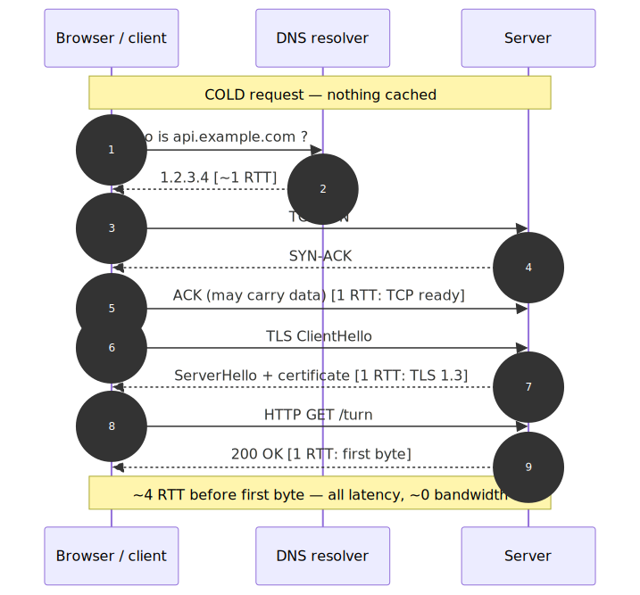
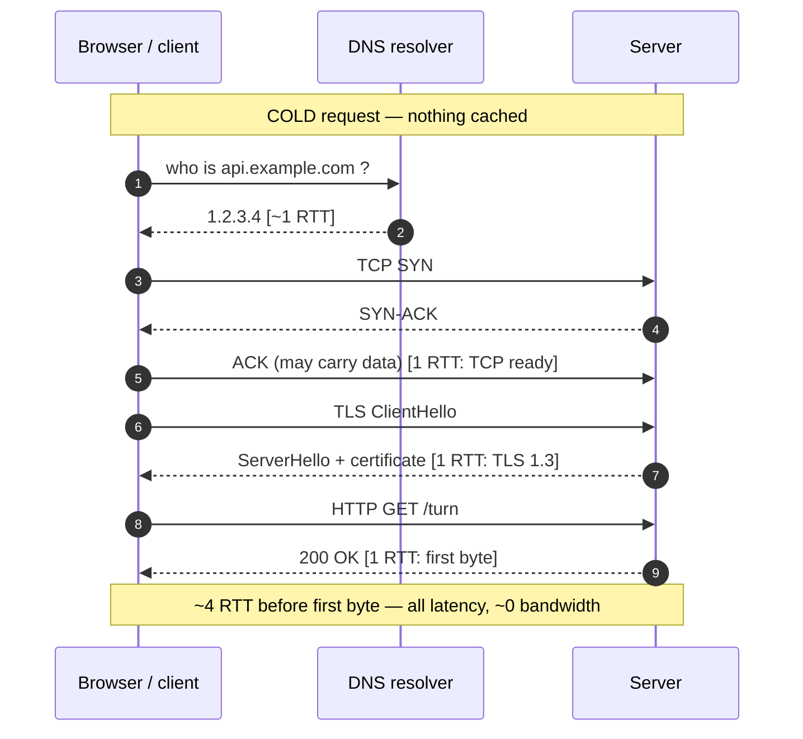
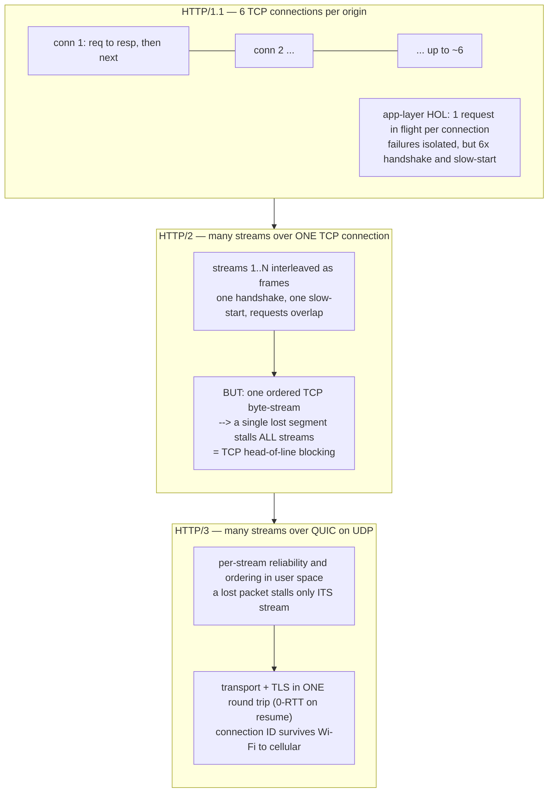

# Daily Reading — 2026-07-02  🔵 draft (pre-Q&A)

**Today's two readings (one theme — "where the time actually goes when you make a request" — two altitudes):**
1. **The anatomy of one HTTPS request, bottom-up — and why it's slow before it sends a single useful byte.** DNS → TCP → TLS → HTTP as a stack of *round trips*, and the one law that governs it: for anything small, **latency is round-trips × RTT, and bandwidth barely matters.** The physical floor under all of it (the speed of light in glass) and the only three moves you have against it.
2. **The 30-year fight to delete those round trips — HTTP/1.1 → HTTP/2 → HTTP/3 (QUIC) — and the edge.** Each HTTP version is an attack on a specific round trip or a specific *head-of-line-blocking* stall; QUIC's jump to UDP is the payoff. Then the strategic layer you already ship on: CDNs/Anycast, connection reuse, TLS termination, and why your **API Gateway + WebSocket** turns behave the way they do.

> **Why this, and why now.** You ship on top of the network every day — API Gateway, WebSockets, multi-region — but, by your own account, largely *on intuition*. This is the deliberate move to make the protocol stack **explicit, bottom-up**, exactly the way the M01 sessions made the machine explicit. And it lands on a lens you already own cold: the whole reading is a **latency-vs-bandwidth** story, which is the *network* twin of your GPU/memory sessions. "Decode is bandwidth-bound; a CPU layer is 10–40× slower but only ~8 KB crosses PCIe" becomes, almost verbatim, "a page load is *round-trip*-bound; adding bandwidth does nothing but adding a round trip costs you a whole RTT." The senior instinct you've shown all along — **don't move/duplicate/over-reserve the big thing** — reappears here as **don't pay a round trip you don't have to.** It feeds course **M02 (Networking & the Web)** head-on — this is Phase 2 material read a step early — and §2 connects straight to your real-time/WebSocket work (M02 Ch4).

> **Diversification note.** The last reading (06-26, database internals) was the swing out of AI into foundations-first CS; this continues that swing along the axis the 06-16 note flagged as the *other* pre-course pick ("a databases **or networking** reading, ahead of those course phases"). Databases covered the *storage* seam under your apps; this covers the *transport* seam in front of them. Still foundations, still ahead of the course, still not-AI — a different muscle from model internals.

---

## 1. The anatomy of one request — a stack of round trips

🔗 **Primary (your level — the canonical free book):** [High Performance Browser Networking — *Primer on Latency and Bandwidth*, Ilya Grigorik](https://hpbn.co/primer-on-latency-and-bandwidth/) · then [*Building Blocks of TCP*](https://hpbn.co/building-blocks-of-tcp/) · then [*Transport Layer Security (TLS)*](https://hpbn.co/transport-layer-security-tls/)
🔗 **The end-to-end walkthrough (a classic — "type a URL, press enter, then what?"):** [alex/what-happens-when (GitHub)](https://github.com/alex/what-happens-when)
🔗 **The numbers that anchor everything (interactive, scale it to any year):** [Latency Numbers Every Programmer Should Know — Colin Scott](https://colin-scott.github.io/personal_website/research/interactive_latency.html)
🔗 **Reference framing:** [MDN — Understanding latency](https://developer.mozilla.org/en-US/docs/Web/Performance/Guides/Understanding_latency)

**The one idea.** When you fetch a small resource — an arena turn, a JSON payload, an API call — the wall-clock time is almost never the time to *transmit the bytes*. It is the time spent waiting for **round trips** to complete: a signal goes to the server and back, and until it does, nothing proceeds. A "cold" HTTPS request is a *sequence* of these waits stacked on top of each other, and each layer of the stack adds at least one before any application data moves.

Define the round-trip time $\text{RTT}$ = the time for a packet to reach the peer and an acknowledgement to come back. Then, with nothing cached:

- **DNS resolution** — turn `api.example.com` into an IP address. If your resolver has it cached, $\approx 1$ RTT to the resolver; if not, the resolver itself walks the hierarchy (root → TLD → authoritative), which can be several RTTs. This must finish before you can open a connection to anything.
- **TCP handshake** — `SYN` → `SYN-ACK` → `ACK`. You can piggyback data on that final `ACK`, so it costs **1 RTT** before you may send a request.
- **TLS handshake** — negotiate cipher + keys and verify the certificate. **TLS 1.2 costs 2 RTT; TLS 1.3 costs 1 RTT**, and TLS 1.3 *resumption* can be **0-RTT** (send encrypted application data in the very first flight — with a replay-safety caveat).
- **The HTTP request itself** — send `GET /turn`, wait for the response: **1 RTT** to first byte.

Stack them for a cold request over TLS 1.3: roughly $1 + 1 + 1 + 1 = 4\ \text{RTT}$ *before the response starts arriving*. On a 50 ms RTT link that is $\approx 200$ ms of pure waiting, and **not one millisecond of it is bandwidth** — a 1 Gbps link and a 10 Mbps link pay the identical 200 ms. This is why "upgrade the pipe" so often does nothing for API latency, and why every optimization below is really about **deleting round trips or shortening the RTT**.

<!-- diagram-1 -->
<!-- DIAGRAM:START -->

Diagram source (Mermaid)

<!-- DIAGRAM:END -->

**Why RTT has a floor you cannot code around — the physics lens (this one earns its place).** Bandwidth is an engineering variable: lay more fibre, buy a bigger link. RTT is bounded by *distance and the speed of light*. Light in a vacuum is $c \approx 3\times10^{8}$ m/s; in glass fibre it travels at about $\tfrac{2}{3}c \approx 2\times10^{8}$ m/s. So every 100 km of fibre is $\approx 0.5$ ms one way, $\approx 1$ ms round trip — **before** routers, queuing, and the last-mile hop. London↔New York is ~5,600 km great-circle, so the *theoretical* RTT floor is ~56 ms and the real one is ~70–80 ms, permanently. You cannot optimize the speed of light; you can only (a) **make fewer round trips**, (b) **move the endpoint physically closer** (this is the entire reason CDNs exist — §2), or (c) **overlap** trips that don't depend on each other. This is the same shape as your memory-hierarchy lesson: you don't make DRAM faster, you *stop going to it* (caches, locality). Here you don't make the Atlantic shorter, you *stop crossing it.*

**Three mechanisms worth having crisp, because the rest of the reading leans on them:**

1. **TCP slow-start — bandwidth isn't free at $t=0$ either.** Even once connected, TCP does not blast at full line rate. It starts with a small **congestion window** (typically 10 packets, ~14 KB) and doubles it each RTT until it sees loss. So a fresh connection is *round-trip-limited even for medium payloads*: a 64 KB response over a cold connection needs several RTTs of window-growth, not one. This is why **connection reuse** (keep-alive) is one of the highest-leverage things you can do — you inherit an already-warmed window instead of restarting at 14 KB.
2. **Head-of-line (HOL) blocking — the villain of §2.** TCP delivers bytes **in order**. If segment #3 is lost, segments #4, #5, #6 sit in the kernel's receive buffer, *fully arrived*, but the application cannot read them until #3 is retransmitted (one more RTT). One lost packet stalls *everything behind it*. Hold this thought — it is the exact stall HTTP/2 failed to fix and HTTP/3 was built to kill.
3. **The knee is set by round trips, not throughput.** For small objects, doubling bandwidth is a rounding error; removing one RTT (say, TLS 1.3 vs 1.2) is a ~25% cut on a 4-RTT request. This inverts the intuition most people bring from file downloads, where bandwidth dominates. **Small + frequent (your API/turn traffic) = latency-bound; large + rare (a model download) = bandwidth-bound.**

---

## 2. Deleting the round trips — HTTP/1.1 → HTTP/2 → HTTP/3, and the edge

🔗 **The evolution, canonical & concise:** [MDN — Evolution of HTTP](https://developer.mozilla.org/en-US/docs/Web/HTTP/Guides/Evolution_of_HTTP)
🔗 **HTTP/2 in depth (your level):** [High Performance Browser Networking — *HTTP/2*, Ilya Grigorik](https://hpbn.co/http2/)
🔗 **Why QUIC exists — the clearest explainer of the TCP-HOL problem:** [The Road to QUIC — Cloudflare blog](https://blog.cloudflare.com/the-road-to-quic/) · [HTTP/3 vs HTTP/2 — Cloudflare blog](https://blog.cloudflare.com/http-3-vs-http-2/)
🔗 **Deep, current, and honest about the caveats (Robin Marx):** [HTTP/3 From A To Z — Part 1: Core Concepts](https://www.smashingmagazine.com/2021/08/http3-core-concepts-part1/) · [Part 2: Performance](https://www.smashingmagazine.com/2021/08/http3-performance-improvements-part2/)
🔗 **The standards themselves (skim, don't read):** [RFC 9000 — QUIC](https://datatracker.ietf.org/doc/html/rfc9000) · [RFC 9114 — HTTP/3](https://datatracker.ietf.org/doc/html/rfc9114)
🔗 **Your real-time seam (feeds M02 Ch4):** [High Performance Browser Networking — *WebSocket*](https://hpbn.co/websocket/)

**The one idea.** Read the HTTP version history as a **single, escalating campaign against round trips and HOL blocking.** Each version fixes the previous one's dominant stall and, in doing so, exposes the next one — until the stall stops living in HTTP at all and turns out to be in **TCP itself**, which is why the final move (QUIC) had to abandon TCP and rebuild reliability on UDP.

**HTTP/1.1 — one request in flight per connection.** A connection carries one request/response at a time; the next request cannot start until the current response finishes (*head-of-line blocking at the application layer*). Browsers hacked around it by opening **~6 parallel TCP connections per origin** — 6× the handshakes, 6× slow-start, 6× the memory, and still a hard ceiling. "Optimizations" of the era (spriting images, inlining, domain sharding) were all *round-trip-avoidance hacks*.

**HTTP/2 — multiplexing over one connection.** The headline fix: many concurrent **streams** interleaved as *frames* over a **single** TCP connection, plus header compression (HPACK) and server push. One warm connection, one slow-start, requests overlap freely. This deletes the *application-layer* HOL block — but it **inherits a worse one**. Because all those streams ride one ordered TCP byte-stream, a **single lost TCP segment stalls *every* multiplexed stream at once** (mechanism #2 from §1). HTTP/1.1's 6 connections accidentally *isolated* failures; HTTP/2 put all eggs in one ordered basket, so on a lossy network (mobile, congested Wi-Fi) HTTP/2 can be *worse* than HTTP/1.1. This is **TCP head-of-line blocking**, and no amount of HTTP-layer cleverness can fix it, because HTTP/2 doesn't control how TCP delivers bytes.

**HTTP/3 — same multiplexing, but over QUIC on UDP.** The realization: the HOL block is baked into TCP's *in-order, single-stream* delivery, so you must replace the transport. **QUIC** runs over **UDP** and reimplements reliability, ordering, and congestion control *per-stream* in user space. Now a lost packet stalls **only the one stream it belonged to**; the others keep flowing. QUIC also **merges the transport and TLS handshakes into one** — connection setup + encryption in a *single* round trip (and **0-RTT** resumption for repeat visits), collapsing §1's separate TCP-then-TLS ladder. Bonus: because a QUIC connection is identified by a **connection ID**, not the 4-tuple, it **survives a network change** — your phone moving Wi-Fi → cellular keeps the same connection instead of re-handshaking. The honest caveats (Robin Marx's Part 2): QUIC's per-packet crypto and user-space stacks cost more **CPU**, kernel-bypass UDP is less offloaded than TCP, and the real-world win is largest on *lossy/high-latency* links, not fast wired ones.

<!-- diagram-2 -->
<!-- DIAGRAM:START -->

Diagram source (Mermaid)

<!-- DIAGRAM:END -->

**The edge — where these round trips actually get deleted in production.** Protocol upgrades shorten *each* trip; the **edge** shortens the *distance* (the RTT itself) and reuses warm connections so you skip setup entirely:

- **CDN + Anycast — move the endpoint closer.** A CDN puts servers in hundreds of cities; **Anycast** advertises the *same* IP from all of them so the network routes you to the nearest one. Your London user terminates TLS ~10 ms away at the edge instead of ~80 ms away at origin — a direct attack on §1's speed-of-light floor. This is *literally* "move the endpoint physically closer," option (b) from §1.
- **TLS termination + connection reuse at the edge.** The edge keeps **warm, pooled connections** to your origin. The expensive TCP+TLS ladder (§1) is paid once and amortized across thousands of users; a given request often rides an already-established, already-slow-start-warmed connection — inheriting mechanism #1's warm window for free.
- **Where your stack sits.** Your **API Gateway** is exactly this pattern: a managed edge that terminates TLS, reuses connections to your Lambda/backend, and speaks HTTP/2 or /3 to the client. And **WebSockets** (feeding M02 Ch4) are the *other* answer to round-trip cost: instead of paying a fresh request round trip per arena turn, you pay the handshake **once** and then push frames both ways over the open connection — the right tool precisely when the traffic is *small, frequent, and bidirectional* (latency-bound, mechanism #3). The comparison REST vs SSE vs long-poll vs WebSocket in M02 Ch4 is, underneath, a question about *how many round trips per message* each one costs.

---

## Key terms (English · 大陆 简体 · 台灣 繁體)

Networking has an unusually high number of **genuinely different** Mainland/Taiwan terms (not just script) — flagged ⚠. Useful when you read Chinese-language technical sources.

| English | 大陆 (简体) | 台灣 (繁體) | Note |
|---|---|---|---|
| network | 网络 | 網路 | ⚠ different word (络 vs 路) |
| server | 服务器 | 伺服器 | ⚠ different word |
| protocol | 协议 | 協定 / 通訊協定 | ⚠ different word |
| bandwidth | 带宽 | 頻寬 | ⚠ different word |
| latency | 延迟 | 延遲 | script only |
| round-trip time (RTT) | 往返时延 | 來回時間 | ⚠ phrasing differs |
| packet | 数据包 | 封包 | ⚠ different word |
| port | 端口 | 連接埠 | ⚠ different word |
| domain name | 域名 | 網域 / 網域名稱 | ⚠ different word |
| cache | 缓存 | 快取 | ⚠ different word |
| handshake | 握手 | 握手 | same |
| encryption | 加密 | 加密 | same |
| head-of-line blocking | 队头阻塞 | 隊頭阻塞 | script only |
| congestion (window) | 拥塞（窗口） | 壅塞（視窗） | ⚠ 窗口 vs 視窗 |

---

## Sources
- [High Performance Browser Networking — Primer on Latency and Bandwidth (Ilya Grigorik)](https://hpbn.co/primer-on-latency-and-bandwidth/)
- [High Performance Browser Networking — Building Blocks of TCP](https://hpbn.co/building-blocks-of-tcp/)
- [High Performance Browser Networking — Transport Layer Security (TLS)](https://hpbn.co/transport-layer-security-tls/)
- [High Performance Browser Networking — HTTP/2](https://hpbn.co/http2/)
- [High Performance Browser Networking — WebSocket](https://hpbn.co/websocket/)
- [alex/what-happens-when — GitHub](https://github.com/alex/what-happens-when)
- [Latency Numbers Every Programmer Should Know — Colin Scott (interactive)](https://colin-scott.github.io/personal_website/research/interactive_latency.html)
- [MDN — Understanding latency](https://developer.mozilla.org/en-US/docs/Web/Performance/Guides/Understanding_latency)
- [MDN — Evolution of HTTP](https://developer.mozilla.org/en-US/docs/Web/HTTP/Guides/Evolution_of_HTTP)
- [The Road to QUIC — Cloudflare blog](https://blog.cloudflare.com/the-road-to-quic/)
- [HTTP/3 vs HTTP/2 — Cloudflare blog](https://blog.cloudflare.com/http-3-vs-http-2/)
- [HTTP/3 From A To Z, Part 1: Core Concepts — Robin Marx, Smashing Magazine](https://www.smashingmagazine.com/2021/08/http3-core-concepts-part1/)
- [HTTP/3 From A To Z, Part 2: Performance — Robin Marx, Smashing Magazine](https://www.smashingmagazine.com/2021/08/http3-performance-improvements-part2/)
- [RFC 9000 — QUIC: A UDP-Based Multiplexed and Secure Transport](https://datatracker.ietf.org/doc/html/rfc9000)
- [RFC 9114 — HTTP/3](https://datatracker.ietf.org/doc/html/rfc9114)

*Draft prepared 2026-07-02 — pre-Q&A. Theme: **latency is round-trips × RTT; bandwidth barely matters for small requests**, and the whole HTTP/QUIC/edge story is one long campaign to delete round trips and shorten the RTT (the network twin of your memory-hierarchy / "don't move the big thing" lens). On finalize I'll add the "What we worked out" thread from our Q&A and flip the status to ✅.*
