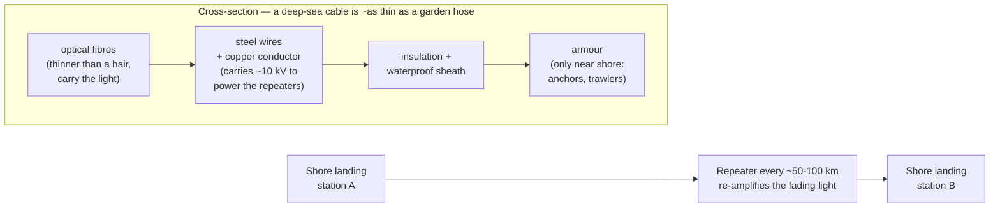
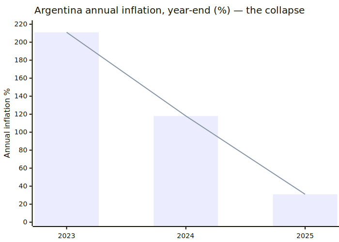
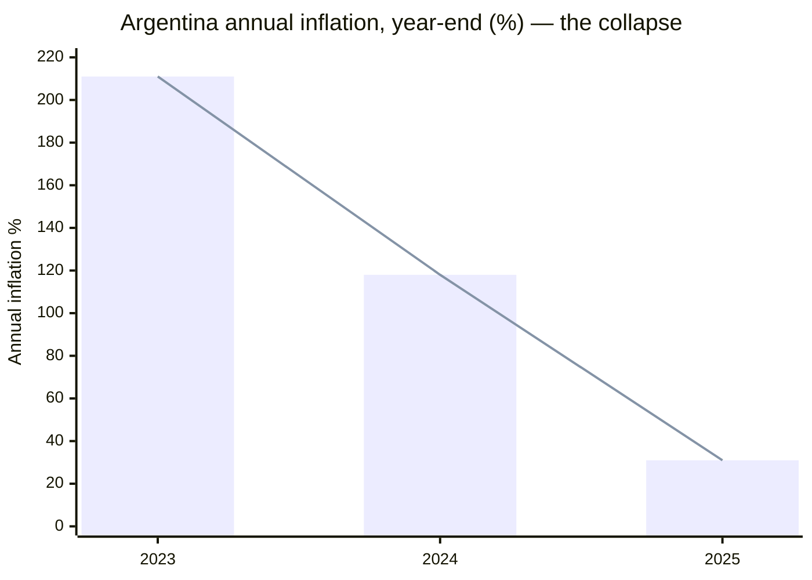

# Daily Reading — 2026-07-02  ✅ finalized

*A "National Geographic / Discovery" pair — one story from the **career** world (CS/networking), one from the **hobby** world (economics). Not course material; the wider, stranger, more current world around it.*

**Today's two stories:**
1. 🛰️→🌊 **The internet lives at the bottom of the ocean — and someone keeps cutting it.** ~99% of the world's intercontinental data doesn't go through satellites or "the cloud." It travels through ~600 fibre-optic cables, each about as thick as a garden hose, lying in the mud of the seabed — and since late 2023 those cables have become the front line of a quiet, deniable kind of warfare.
2. 🇦🇷🪚 **The man with the chainsaw: Argentina's shock war on inflation.** In December 2023 a self-described "anarcho-capitalist" who campaigned waving a literal chainsaw took over a country with **211%** inflation. Two years later inflation is a *fraction* of that, Argentina is running its first budget surplus in over a decade — and economists are fighting about whether it's a miracle, a warning, or both.

> **Why this pair.** The reading track is your *Discovery Channel*, not a lecture hall — the point is to widen the lens, not to pre-teach a chapter. **Story 1** sits next to your networking world (you ship on API Gateway and WebSockets) but pulls the camera all the way back: past the protocols, past the data centre, to the physical *thing* — a cable in the dark on the ocean floor, and the geopolitics now being fought over it. **Story 2** picks up exactly where your Econ hobby track just was — you did inflation (E02 §2), unemployment (§3), and were heading into the business cycle (§4) and monetary policy (E03) — and drops you into the most dramatic *live* macro experiment on Earth right now, where every concept you studied (disinflation, austerity, recession, central-bank independence) is playing out in real time with real people. Two different worlds; same habit of mind — *follow the thing itself.*

---

## 1. 🌊 The internet is a bundle of glass threads in the mud — and it's under attack

🔗 **See it for yourself (spend five minutes here — it's mesmerising):** [TeleGeography Submarine Cable Map](https://www.submarinecablemap.com/)
🔗 **The "99%" myth, checked:** [Do submarine cables carry 99% of intercontinental traffic? — TeleGeography](https://resources.telegeography.com/2023-mythbusting-part-3) · [Invisible highways: the vast network of undersea cables — UN News, Feb 2026](https://news.un.org/en/story/2026/02/1166867)
🔗 **Big Tech now builds its own:** [Project Waterworth — Engineering at Meta](https://engineering.fb.com/2025/02/14/connectivity/project-waterworth-ai-subsea-infrastructure/) · [Meta's cable "skirts conflict zones" — IEEE Spectrum](https://spectrum.ieee.org/undersea-internet-cables-meta-waterworth)
🔗 **The new front line:** [NATO launches "Baltic Sentry"](https://www.nato.int/en/news-and-events/articles/news/2025/01/14/nato-launches-baltic-sentry-to-increase-critical-infrastructure-security) · [11 Baltic cables damaged in 15 months — Defense News](https://www.defensenews.com/global/europe/2025/01/28/11-baltic-cables-damaged-in-15-months-pushing-nato-to-boost-security/) · [Taiwan's Matsu Islands cut off — Foreign Policy](https://foreignpolicy.com/2025/01/23/taiwan-china-cables-internet-matsu-islands/) · [The web beneath the waves — Rest of World](https://restofworld.org/2025/web-beneath-waves-taiwan-underseas-cables/)

**The thing itself.** When you send a message from Singapore to a friend in London, it does not go "up to the cloud." The cloud is a metaphor; the reality is a **glass thread on the seabed**. Roughly **99% of all intercontinental internet traffic** — every video call, bank transfer, stock trade, and AI API request that crosses an ocean — runs through a network of about **600 submarine cables** totalling well over **1.4 million kilometres** (enough to loop the Earth ~35 times). Satellites, even Starlink, carry a rounding error by comparison. The deep-sea sections of these cables are astonishingly thin — **about the diameter of a garden hose** — because in the calm of the deep ocean the only thing you need to protect is a cluster of glass fibres each thinner than a human hair. Near shore, where anchors and trawlers roam, they're armoured up to the thickness of a soda can.

Down the middle run the optical fibres, pulses of light bouncing along at ~200,000 km/s. But light *fades* over distance, so every **~50–100 km** the cable contains a **repeater** — an amplifier that re-boosts the signal — and to power thousands of kilometres of these, a **copper conductor** carries up to **~10,000 volts** along the whole cable from the shore stations at each end. A single modern cable can now move **hundreds of terabits per second**. It is one of the most extraordinary machines humanity has ever built, and almost nobody has seen one.

<!-- diagram-1 -->
<!-- DIAGRAM:START -->

Diagram source (Mermaid)

<!-- DIAGRAM:END -->

**Who owns it — the quiet takeover.** For a century, submarine cables were laid by consortia of telephone companies. No longer. The hungriest consumers of bandwidth — **Google, Meta, Amazon, Microsoft** — now own or lease a huge and growing share of the world's cable capacity, and increasingly build their *own* private cables. In February 2025 Meta announced **Project Waterworth**: a single cable **over 50,000 km long** — *longer than the Earth's circumference* — connecting five continents, the longest ever attempted, explicitly to feed its AI ambitions. Notably, its route was designed to **skirt geopolitical flashpoints** like the Red Sea and the South China Sea. Which brings us to the problem.

**The new front line.** A cable on the seabed is almost impossible to guard and trivially easy to break — you just drag a ship's anchor across it. Most cable faults are genuine accidents (fishing gear, anchors, undersea landslides; ~150–200 a year worldwide, quietly repaired). But since **October 2023**, a pattern has emerged that is much harder to call accidental:

- **The Baltic Sea** has become the epicentre. In 15 months, **~11 cables** were damaged. On Christmas Day 2024 the tanker **Eagle S** — Cook Islands-flagged, tied to Russia's sanctions-dodging "**shadow fleet**" — severed the EstLink-2 power cable plus data cables between Finland and Estonia, allegedly dragging its anchor along the seabed for **~100 km**. Finland seized the ship; nine crew became sabotage suspects.
- **Taiwan** lives this constantly. The tiny Matsu Islands, 10 nautical miles off China's coast, have been cut off repeatedly — 2023, 2024, and again in January 2025 when a Chinese-crewed freighter damaged a cable. Taiwan now keeps **microwave and satellite backups** ready precisely because it expects the cables to be cut.
- **The Red Sea**, one of the planet's worst chokepoints, saw multiple cables severed in 2024 amid the Houthi conflict, disrupting a chunk of Europe–Asia traffic.

The unnerving part is the **deniability**. Was it an anchor accidentally dragged, or deliberately? A grey zone by design — which is exactly why it's attractive as a tool of statecraft. In January 2025 NATO launched **"Baltic Sentry,"** deploying frigates, maritime patrol aircraft, and **naval drones** to watch the seabed. The infrastructure you treat as invisible and infinite turns out to be finite, physical, and *contested* — a set of glass threads that a single ship, on a dark night, can quietly cut.

> **The "huh, I didn't know that" file.** Sharks really do occasionally bite cables (Google once wrapped one in Kevlar-like armour after repeated shark damage) — but they're a tiny cause; **ships and fishing gear do far more damage than any animal.** And when a deep-ocean cable breaks, a specialised **repair ship** sails out, drags a *grapnel* along the seabed to hook the cable, hauls both severed ends up to the surface, splices the hair-thin fibres by hand under a microscope, and lowers it back down — a process that can take *weeks*. There are only a few dozen such ships in the world, and the fleet is aging.

---

## 2. 🪚 The chainsaw and the 211%: Argentina's shock war on inflation

🔗 **The live data (watch it fall):** [Argentina inflation — Trading Economics](https://tradingeconomics.com/argentina/inflation-cpi)
🔗 **The debate — miracle or warning?** [Milei's inflation "miracle" is a warning to the world, not a blueprint — The Conversation](https://theconversation.com/javier-mileis-inflation-miracle-in-argentina-is-a-warning-to-the-world-not-a-blueprint-278840)
🔗 **The man and the method:** [Javier Milei — Wikipedia](https://en.wikipedia.org/wiki/Javier_Milei) · [Argentina's inflation hits a 7-year low (Nov 2025) — Semafor](https://www.semafor.com/article/11/13/2025/argentinas-inflation-slows-again-following-years-of-crisis)

**The setup.** Argentina is the country economics can't explain. A century ago it was among the *richest* nations on Earth; since then it has defaulted on its debt **nine times** and lived with chronic, morale-crushing inflation for generations. By the end of 2023, annual inflation hit **~211%** — prices more than tripling in a year. Argentines had long since stopped trusting the peso: they price big things in US dollars, and hold savings as physical greenbacks in safes and under mattresses.

Into this walked **Javier Milei** — an economist, former TV pundit, and self-described "anarcho-capitalist" who campaigned literally **brandishing a chainsaw** to symbolise what he'd do to the state, and won the presidency in November 2023. His diagnosis was blunt and orthodox: Argentina's inflation was **fiscal** — decades of governments spending more than they earned and **printing pesos to cover the gap**. His prescription was equally blunt: stop printing, by any means necessary. *"No hay plata"* — "there is no money" — became the slogan of the government.

**The shock.** What followed is one of the most aggressive austerity programmes ever attempted in a democracy:
- He **devalued** the peso by ~50% overnight, slashed subsidies, froze public works, and cut ministries — deliberately inducing a sharp recession to kill the money-printing at its source.
- Within a year Argentina posted its **first budget surplus in ~14 years** — a genuinely stunning fiscal turnaround.
- **Inflation collapsed.** Monthly inflation, which peaked at **25.5% in December 2023** (that's *per month*), fell to around **2%** by 2025. Annual inflation dropped from **211% (2023) → ~118% (2024) → ~31% (2025)**.

<!-- diagram-2 -->
<!-- DIAGRAM:START -->

Diagram source (Mermaid)

<!-- DIAGRAM:END -->

**The cost, and the fight.** None of this was free. The engineered recession meant real pain: **poverty spiked above 50%** in early 2024, pensions and wages were crushed, and activity contracted before it recovered. Milei's bet — the classic disinflation gamble you met in your Econ track — is that the pain is *front-loaded and temporary*, and that low, stable inflation will unlock lasting growth. The IMF, which agreed a fresh **~$20bn** programme, has called the stabilisation one of the most successful in recent memory. Markets partly agree.

But the critics — this is the live debate worth reading — argue two things. First, that it's **not a repeatable blueprint**: Argentina's starting point was so catastrophic that "shock" was politically survivable in a way it wouldn't be elsewhere, and the human cost was severe. Second, that it's **fragile**: hold the currency down to crush inflation and you risk an overvalued peso, thin reserves, and a fresh crisis — and indeed inflation showed signs of **re-accelerating into early 2026** (back toward the low-30s% annually), a reminder that Argentina has "won" this fight before and lost the peace. Milei even campaigned on **abolishing the central bank** and **dollarising** the economy outright — the ultimate "tie your own hands" move against money-printing (and a vivid real-world case of the *central-bank-independence* theme from your unemployment session). He hasn't done it, but the fact it's seriously on the table tells you how deep the distrust of the peso runs.

It is, right now, the closest thing economics has to a live laboratory — every lever you studied (disinflation, austerity, the output gap, credibility, the exchange rate) being pulled at once, in public, on 46 million people.

---

## What we worked out — the threads you drove (read this first on review)

You didn't just read these; you attacked both with a thesis. The durable record:

### Story 1 — "Could Starlink replace the undersea cables?" Your thesis: yes, once satellite count scales.
Your case was strong and shares the industry's actual bets: (1) **cheap launch (Starship) is the real lever** — full credit, it's the only reason the question is even open; (2) **graceful degradation** — losing 1 of ~7,000 sats ≪ losing 1 of ~3 cables on a route; (3) the **seabed is uniquely easy to sabotage** (no orbital anchor-drag); (4) **phased arrays + laser inter-satellite links do scale capacity with count** (Starlink already reached ~450 Tbps this way). Two re-ranks landed:
- **Re-rank 1 — "same bandwidth, no interference, so it scales freely" is the load-bearing error.** Split the links: laser *inter-satellite* links are ~interference-free but add *zero ground-facing capacity*; the satellite↔ground RF link is **spatial reuse of a shared, finite, ITU-regulated spectrum**. Beam count is capped by diffraction ($\theta \approx \lambda/D$; a small aperture from ~550 km gives a spot ~10 km-plus wide) and orbital geometry. So capacity scales **sub-linearly against a shared commons**, whereas fiber scales **~linearly** by laying another interference-free ~10 THz strand. Different laws; no phased-array trick repeals $\lambda/D$.
- **Re-rank 2 — the geometry mismatch (the real crux, independent of count).** Satellite capacity is **spread over geography by construction**; demand — and cables — are **concentrated**. The *whole* constellation ≈ 450 Tbps smeared over the planet; *one* cable dumps 250 Tbps into *one metro*. This **inverts the "grow into dense markets" intuition**: dense areas are the *hardest* case for satellites (most contention per beam footprint), which is exactly where cables are strongest and where the traffic actually is.
- **Correction:** a cable **landing station is not a datacenter** — it's light infra (power-feed + line terminal + backhaul); your proposed "small centralized receiver/router site" *is* a landing station/teleport, and in dense areas it still hands off to terrestrial fiber, conceding the point.
- **Conclusion we landed:** not replacement but a **tiered system — fiber core + satellite edge & low-latency overlay** (latency is the one axis LEO wins outright: c-in-vacuum + a straight laser mesh beats bent ⅔-c fiber). The boundary slides satellite-ward as launch cheapens; the ocean *trunk* stays glass. Your instinct about satellites' *rise* is right; it mis-ranked *which layer* they take.

### Story 2 — Milei: you read it as "mostly a success," against the op-ed's caution. Largely defensible.
Your strongest moves, credited: (1) the **malinvestment / flight-from-cash** framing — hyperinflation pumps forward-buying, so some pre-Milei manufacturing demand was distortion, and its disappearance is the *cure working*, not a cost of it; (2) the **attribution correction** — Argentina's manufacturing was structurally uncompetitive behind ~70 years of import-substitution tariffs *before* Milei, so blaming its weakness on him confuses trigger with disease; (3) the **poverty rebound (53% → ~32%)** is real evidence for your "pain is front-loaded" thesis, which the op-ed under-weights. Then two sharpenings:
- **The premise fix (your refinement about trade under hyperinflation).** Hyperinflation doesn't actually stop trade, because **trade is USD-invoiced** — foreigners never held pesos; Argentina kept exporting commodities and ran surpluses throughout. What strangled commerce was the **`cepo`** (capital controls + multiple exchange rates), and **Milei lifting it (April 2025) is the genuine pro-trade win** your intuition was pointing at. The real "confidence" channel is **trade finance & investment**, not willingness-to-hold-pesos.
- **The blind spot — real exchange-rate appreciation.** The exchange-rate *anchor* that crushed inflation left the peso **overvalued in real terms**, which *fights* the export pivot ("**confidence ≠ competitiveness**"). Historical rhyme: Convertibility 1991→2001 ended in exactly this trap.
- **The synthesis that reconciled us — two export sectors on two clocks:** **commodities** (never stopped, dollar-priced, squeezed by the strong peso *now*, and financing the whole stabilization) vs **manufactured/new exports** (need the stability precondition first — your sequencing argument is right *here*). So the exchange rate isn't fully deferrable: the sector carrying the country is already living it. Net: your thesis holds on attribution and malinvestment; the one over-rank was "the lost demand was all fake" — some was genuine immiseration (real-wage collapse), not only distortion unwinding.

---

## Key terms (English · 大陆 简体 · 台灣 繁體)

| English | 大陆 (简体) | 台灣 (繁體) | Note |
|---|---|---|---|
| submarine / undersea cable | 海底电缆 | 海底電纜 | script only |
| optical fibre | 光纤 | 光纖 | script only |
| repeater (amplifier) | 中继器 | 中繼器 | script only |
| bandwidth | 带宽 | 頻寬 | ⚠ different word |
| shadow fleet | 影子舰队 | 影子船隊 | ⚠ 舰队 vs 船隊 |
| grey-zone (warfare) | 灰色地带 | 灰色地帶 | script only |
| sabotage | 蓄意破坏 | 蓄意破壞 / 蓄意破壞行動 | script only |
| inflation | 通货膨胀 | 通貨膨脹 | script only |
| hyperinflation | 恶性通货膨胀 | 惡性通貨膨脹 | script only |
| austerity | 财政紧缩 | 撙節 | ⚠ genuinely different word |
| fiscal surplus | 财政盈余 | 財政盈餘 | script only |
| devaluation | 贬值 | 貶值 | script only |
| dollarization | 美元化 | 美元化 | same |
| central bank | 中央银行（央行） | 中央銀行（央行） | script only |
| capital controls | 资本管制 | 資本管制 | script only |

---

## Sources
- [TeleGeography Submarine Cable Map](https://www.submarinecablemap.com/)
- [Do submarine cables carry 99% of intercontinental traffic? — TeleGeography](https://resources.telegeography.com/2023-mythbusting-part-3)
- [Invisible highways: the vast network of undersea cables — UN News (Feb 2026)](https://news.un.org/en/story/2026/02/1166867)
- [Project Waterworth — Engineering at Meta](https://engineering.fb.com/2025/02/14/connectivity/project-waterworth-ai-subsea-infrastructure/)
- [Meta's undersea cable skirts conflict zones — IEEE Spectrum](https://spectrum.ieee.org/undersea-internet-cables-meta-waterworth)
- [NATO launches "Baltic Sentry"](https://www.nato.int/en/news-and-events/articles/news/2025/01/14/nato-launches-baltic-sentry-to-increase-critical-infrastructure-security)
- [11 Baltic cables damaged in 15 months — Defense News](https://www.defensenews.com/global/europe/2025/01/28/11-baltic-cables-damaged-in-15-months-pushing-nato-to-boost-security/)
- [Taiwan's Matsu Islands cut off again — Foreign Policy](https://foreignpolicy.com/2025/01/23/taiwan-china-cables-internet-matsu-islands/)
- [The web beneath the waves: Taiwan's undersea cables — Rest of World](https://restofworld.org/2025/web-beneath-waves-taiwan-underseas-cables/)
- [Argentina inflation — Trading Economics (live data)](https://tradingeconomics.com/argentina/inflation-cpi)
- [Milei's inflation "miracle" is a warning, not a blueprint — The Conversation](https://theconversation.com/javier-mileis-inflation-miracle-in-argentina-is-a-warning-to-the-world-not-a-blueprint-278840)
- [Javier Milei — Wikipedia](https://en.wikipedia.org/wiki/Javier_Milei)
- [Argentina's inflation hits a 7-year low (Nov 2025) — Semafor](https://www.semafor.com/article/11/13/2025/argentinas-inflation-slows-again-following-years-of-crisis)

*Finalized 2026-07-02 — the first reading under the new format: two feature stories, one **career-track** (undersea cables / networking) and one **hobby-track** (Argentina / macroeconomics), in a "Nat-Geo / Discovery" register rather than a course pre-teach. Figures current to early 2026. The **"What we worked out"** section is the durable record — read it first on review: two theses he drove (Starlink-vs-cables → tiered system; Milei-mostly-a-success → holds on attribution/malinvestment, with the real-exchange-rate + two-export-sectors sharpening).*
