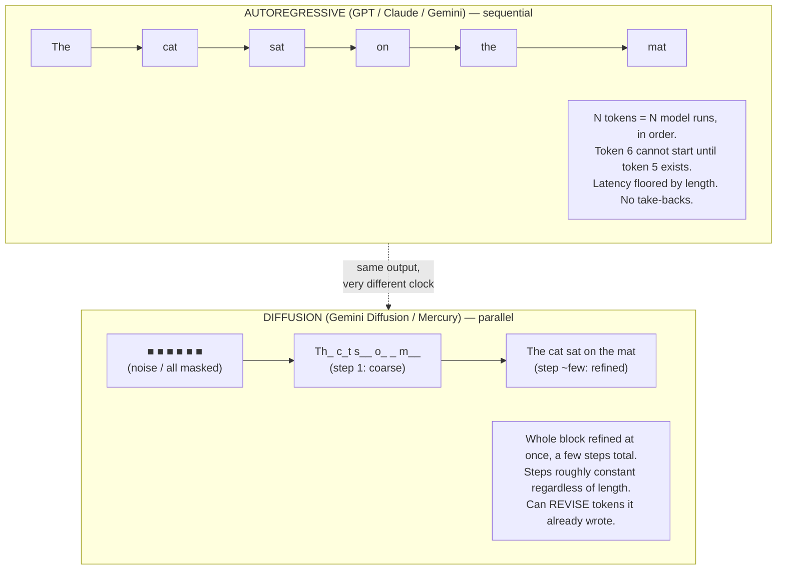
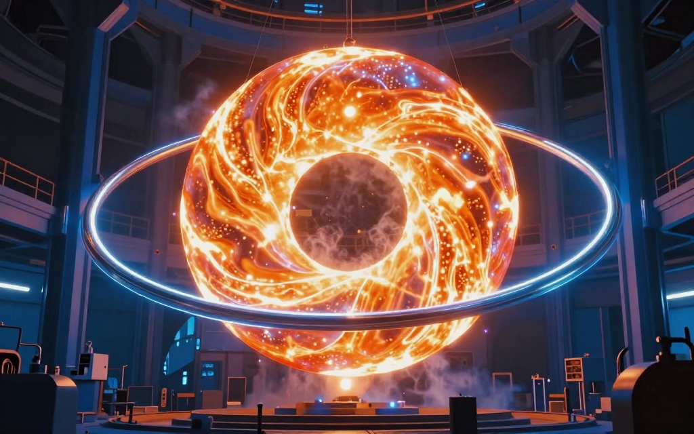
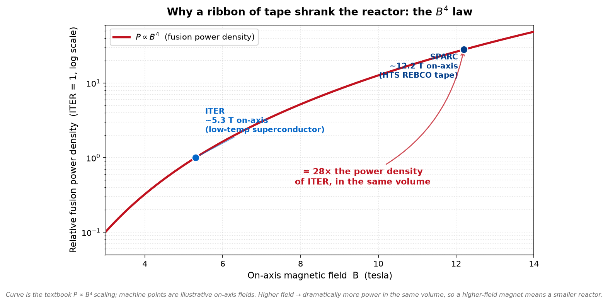

# Daily Reading — 2026-07-10  ⏳ prepared (awaiting your read)

*A "National Geographic / Discovery" pair — one story from the **career** world (AI), one from the **hobby** world (physics / energy). Not course material; the wider, stranger, more current world around what you do.*

**Today's two stories:**
1. 🌀⌨️ **The AI that stopped writing left-to-right.** Every model you use — GPT, Claude, Gemini — writes the way you're reading this: one word after another, left to right, never taking a word back. In 2026 that stopped being the only option. A new class of model borrows the trick behind AI *image* generators — start from noise, refine the whole thing at once — and applies it to **text**. The result writes a *whole block* of words in parallel and can *edit what it already wrote mid-sentence*, hitting **over 1,000 tokens per second** where a normal model crawls at 50–200. Google shipped an experimental one; a startup shipped a commercial one; and in **June 2026** Google released open weights anyone can download.
2. ⭐🔋 **The startups trying to bottle a star — and the reason it's suddenly urgent.** Fusion — the reaction that powers the Sun — has been "30 years away" for 70 years. What changed is a **ribbon of superconducting tape**. A new magnet lets you build a fusion machine roughly **40× smaller** than the giant international one, because fusion power scales like the **fourth power of the magnetic field**. On a site outside Boston, a company is installing eighteen 24-tonne magnets into a reactor it says will produce **net energy in 2027** — and it already has a **customer**: Google signed a deal to buy **200 megawatts** of fusion power to feed its AI data centers.

> **Why this pair.** These two stories are the same story told from opposite ends of your own industry. The AI boom is straining two things at once — **how fast a model can think** and **where the electricity comes from** — and both stories are a **decades-old default finally cracking** under a new enabling technology. Story 1 is the *software* side: the assumption that "language must be generated one token at a time, front to back" is breaking, because someone borrowed the diffusion recipe from images. Story 2 is the *hardware/energy* side: the assumption that "a fusion reactor must be stadium-sized and always a generation away" is breaking, because someone swapped in a better superconductor. And they're **causally linked** — the same surge in AI compute that makes a 20×-faster model valuable is what's funding the fusion startups, because *someone has to power the data centers*. One story makes the model faster; the other tries to keep the lights on while it runs.

---

## 1. 🌀 The model that writes all at once: diffusion comes for language

🔗 **Start here (both are accessible and short):** [Gemini Diffusion — Google DeepMind](https://deepmind.google/models/gemini-diffusion/) · [Introducing Mercury, the first commercial diffusion LLM — Inception Labs](https://www.inceptionlabs.ai/blog/introducing-mercury)
🔗 **The "why now":** [DiffusionGemma (open-weights) — Google DeepMind](https://deepmind.google/models/gemma/diffusiongemma/) · [Inception's Mercury is 10× faster than the frontier — The New Stack](https://thenewstack.io/inception-labs-mercury-2-diffusion/)
🔗 **Go deeper (the paper):** [Mercury: Ultra-Fast Language Models Based on Diffusion — arXiv 2506.17298](https://arxiv.org/abs/2506.17298)

*The whole idea in one picture: autoregressive models type left-to-right, one token at a time (left); diffusion models resolve a whole block of text at once out of noise, refining it in a few passes (right). — Illustration, generated locally (ComfyUI + Z-Image Turbo); a generic concept image, no real text depicted.*

Image prompt (source of truth)

> Split-scene conceptual illustration contrasting two ways of producing writing. On the left, a single glowing character being struck one at a time on an old mechanical typewriter, a thin faint sequential trail of abstract luminous marks emerging letter by letter. On the right, an entire luminous paragraph-shaped block of ordered light crystallizing all at once out of a swirling cloud of chaotic static and noise, coarse blurry glow resolving into sharp neat rows simultaneously. Contrast between slow sequential emergence and instantaneous parallel emergence. Deep blue background with warm golden light, cinematic conceptual digital illustration, clean modern style, highly detailed, abstract glowing marks instead of readable letters, no text, no words, no legible letters

**The default nobody questioned.** Every large language model you've ever used is **autoregressive**: it generates text one token at a time, left to right, each new token conditioned on all the ones before it. This is baked so deep into how we think about LLMs that it feels like a law of nature. It has one unavoidable consequence: to write $N$ tokens you must run the model $N$ times, in sequence, and you *cannot start token 500 until token 499 exists*. Latency is therefore floored by length — a long answer is slow no matter how much hardware you throw at it, because the work is fundamentally serial. And the model can never *revise*: once a token is emitted it's part of the history forever, even if the sentence paints itself into a corner.

**The borrowed trick.** Image generators (Stable Diffusion, Midjourney, DALL·E) don't paint left-to-right pixel by pixel — that would be absurd. They start from a field of pure **noise** and *denoise* it over a handful of steps, sharpening the *whole image at once* from a blurry mess into a crisp picture. The 2025–26 insight was: **do that to text.** Start with a whole block of "noise" (masked/garbage tokens), and over a few **denoising steps** refine *all of them in parallel*, coarse-to-fine, until readable text emerges. Google DeepMind's own description of Gemini Diffusion: *"Instead of predicting text directly, they learn to generate outputs by refining noise, step-by-step,"* and it *"generates entire blocks of tokens at once."*

<!-- fig1 -->
<!-- DIAGRAM:START -->

Diagram source (Mermaid)

<!-- DIAGRAM:END -->

**Why it's fast — and why that matters to anyone who *serves* models.** Because the denoising steps are roughly *constant* (a handful) regardless of how long the answer is, and because each step updates many tokens at once, a diffusion LLM decouples latency from length. The numbers are the headline: Inception's **Mercury** runs at **over 1,000 tokens/second on a single NVIDIA H100** and bills itself as **5–10× faster** than comparable autoregressive models (and up to ~20× versus frontier models that plod under 50 tok/s). Google's **Gemini Diffusion** clocks **1,479 tokens/second** in DeepMind's own figures. For latency-sensitive work — code completion, autocomplete, agent loops that make dozens of sequential model calls — that is not a tweak, it's a different category. Mercury's first target was exactly this: **Mercury Coder Mini** landed **tied for 2nd on Copilot Arena**, beating speed-tuned models like GPT-4o Mini while being several times faster.

**The subtler superpower: it can take a word back.** Autoregressive generation is strictly causal — token $t$ only sees tokens before it. Diffusion generation is **not causal**: every refinement step sees the *whole* draft, so the model can **correct earlier tokens in light of later ones**. DeepMind lists this explicitly — Gemini Diffusion *"corrects errors during generation for more consistent outputs."* That unlocks things autoregressive models are structurally bad at: filling a hole in the *middle* of a document (infilling), keeping a strict output format (JSON, code with balanced brackets), and self-repair mid-draft. It's the difference between a typist who can never hit backspace and a sculptor revising the whole block.

> **The "huh, I didn't know that" file.** This isn't a lab curiosity anymore — you can *hold it in your hand.* On **10 June 2026** Google DeepMind released **DiffusionGemma**, an **open-weights** text-diffusion model (built on Gemma 4) that generates in parallel blocks at ~1,000 tok/s on a single H100 — downloadable and self-hostable, the first time a diffusion LLM is something you can run yourself rather than call over an API. It starts from a block of **256 placeholder tokens** and refines them across denoising passes until text appears. And the honest caveat, because this track doesn't sell you the hype: diffusion LLMs still **trail the best autoregressive models on hard reasoning**, the block length is **fixed** (you commit to an output window up front), and each denoising step is heavier than one autoregressive step — so the speed win is real but it's a *throughput/latency* win, not (yet) a *quality* win. The interesting question for someone who ships models is whether the two paradigms **merge**: a diffusion draft, autoregressively polished, or the reverse.

---

## 2. ⭐ Bottling a star with a ribbon of tape — and selling its power to a data center

🔗 **Start here:** [SPARC — Commonwealth Fusion Systems](https://cfs.energy/technology/sparc/) · [SPARC (tokamak) — Wikipedia](https://en.wikipedia.org/wiki/SPARC_(tokamak))
🔗 **The "why now":** [Google inks its first fusion power deal with Commonwealth Fusion Systems — TechCrunch](https://techcrunch.com/2025/06/30/google-inks-its-first-fusion-power-deal-with-commonwealth-fusion-systems/) · [Fusion power nearly ready for prime time — Fortune (Jan 2026)](https://fortune.com/2026/01/07/fusion-power-commonwealth-sparc-nuclear-fusion-pilot-ai-siemens-nvidia/)
🔗 **Reference:** [Inside the race to power AI data centers with fusion — GeekWire](https://www.geekwire.com/2026/inside-the-race-to-power-ai-data-centers-with-fusion-energy-and-the-surprise-detours-along-the-way/)

*Scene-setting for magnetic-confinement fusion — a glowing plasma torus held inside a compact ring of superconducting magnets, a "star in a bottle." — Illustration, generated locally (ComfyUI + Z-Image Turbo). A **generic** conceptual reactor, **not** the actual SPARC machine (a real, specific device); for real images see the links above.*

Image prompt (source of truth)

> A glowing donut-shaped torus of blindingly hot orange-white plasma suspended and confined inside a compact industrial reactor hall, wrapped in sleek curved superconducting magnet coils glowing faint cold blue, a small captured star held in a magnetic bottle, wisps of cryogenic mist, cinematic dramatic lighting, deep blue steel machinery, a sense of enormous contained energy inside a surprisingly small chamber, stylized conceptual digital illustration, highly detailed, no text, no words, no letters

**The problem is heat, and it's worse than the Sun.** Fusion means slamming light nuclei (hydrogen isotopes deuterium and tritium) together hard enough that they fuse into helium and release energy — the reaction that powers every star. The Sun does it at "only" ~15 million °C, but it cheats: its crushing gravitational pressure is something we can't reproduce. Lacking that pressure, a reactor on Earth has to compensate with **temperature** — roughly **100–150 million °C**, ten times hotter than the Sun's core. Nothing solid can touch that. The dominant approach, the **tokamak**, holds the blazing hydrogen **plasma** in a donut-shaped **magnetic bottle**, never letting it touch the walls. The catch has always been the **Lawson criterion**: you need enough density $n$, temperature $T$, and confinement time $\tau$ *simultaneously* — the "triple product" $n T \tau$ — and hitting all three at once is why the joke is that fusion is always 30 years away.

**What actually changed: a fourth-power law and a better magnet.** Here is the single fact that reignited the field. In a tokamak, the achievable **fusion power density scales like the fourth power of the magnetic field**, $P \propto B^{4}$. Double the field and you get *sixteen times* the power density in the same volume — or the same power in a far smaller, cheaper machine. For decades the field was capped near **~5 T on-axis** by the low-temperature superconductors everyone used (this is what makes the international **ITER** reactor stadium-sized). Then **high-temperature superconductors** — specifically **REBCO** (rare-earth barium copper oxide) tape — matured. In **September 2021**, MIT and Commonwealth Fusion Systems ran a magnet made of this tape to a record **20 tesla**. That one result is the whole thesis: at roughly ~12 T on-axis instead of ~5 T, the $B^{4}$ law buys you almost **30× the power density**, so you can shrink the machine ~40× in volume and still aim for the same physics. A tape rewrote the economics of fusion.

<!-- fig2 -->
<!-- PLOT:START -->

Plot source (matplotlib)

See [`images/10-diffusion-llms-and-the-fusion-power-race-2-plot.py`](images/10-diffusion-llms-and-the-fusion-power-race-2-plot.py). Power density normalized to ITER's on-axis field; the curve is $P \propto B^{4}$.

<!-- PLOT:END -->

**The machine going in right now.** On a site in **Devens, Massachusetts**, CFS is assembling **SPARC**, a compact tokamak (major radius just **1.85 m**) built around **18 toroidal-field magnets** of that HTS tape. Each magnet weighs **~24 tonnes** and is cooled to about **−253 °C** so it can carry over **30,000 amps**. As of early 2026 the first magnet is installed and construction is roughly **75% complete**, with the magnets arriving about every two weeks. The design goal: **~140 MW of fusion power in 10-second bursts** at a fusion gain of **$Q \approx 11$** — meaning it puts out ~11× the energy needed to heat the plasma. SPARC is targeting **first plasma in 2026** and **net energy gain ($Q > 1$) in 2027** — which would be the first time a magnetic-confinement machine produces more fusion energy than it consumes. (Slips happen: first plasma was once penciled for 2025.) In a very 2026 touch, CFS runs a **digital twin** of the whole machine on NVIDIA Omniverse and Siemens software, so engineers can test changes in simulation before touching 20-tesla hardware.

**The twist — it already has a buyer, and the buyer is an AI company.** SPARC is the prototype; the real product is **ARC**, CFS's first commercial plant, planned near **Richmond, Virginia**, at **~400 MW**, online in the **early 2030s**. And here's where this story loops back to Story 1: in **June 2025, Google signed a deal to buy 200 megawatts from ARC** — its first-ever fusion power purchase — explicitly because **AI and cloud data-center electricity demand is exploding** (Google's own forecast: data-center power demand roughly *doubling* by the end of the decade). Microsoft made a similar bet earlier, contracting **50 MW from Helion Energy by 2028** (Helion chases a different design — a pulsed field-reversed configuration aiming for near-aneutronic fuel and direct electricity conversion, no steam turbine). The pattern is unmistakable: the companies building the most compute-hungry systems on Earth are now **pre-ordering power from reactors that don't exist yet**, because they're betting the AI buildout will outrun the grid.

> **The "huh, I didn't know that" file.** Fusion is having a genuine capital moment: private fusion companies have now raised well over **7 billion dollars** across roughly **fifty** firms, turning a government-lab science project into a venture race with real customers and IPO chatter. And note the delicious asymmetry — the thing that made compact fusion suddenly plausible wasn't a physics breakthrough in *fusion* at all; it was progress in **superconducting tape**, a materials-science advance from a neighboring field. The whole edifice of 100-million-degree plasma physics was waiting on a better ribbon of wire. (Separately, in December 2022 the US **National Ignition Facility** hit fusion *ignition* — more energy out than the laser delivered — using a completely different, inertial-confinement approach: brief proof that net-gain fusion is physically real, just not yet in a form you can plug into a grid.)

---

## Key terms (English · 大陆 简体 · 台灣 繁體)

| English | 大陆 (简体) | 台灣 (繁體) | Note |
|---|---|---|---|
| diffusion model | 扩散模型 | 擴散模型 | script only |
| autoregressive | 自回归 | 自迴歸 | script only |
| token | 词元 / 令牌 | 詞元 | both forms seen in 大陆 |
| inference (ML) | 推理 | 推論 | ⚠ genuinely different word |
| latency | 延迟 | 延遲 | script only |
| throughput | 吞吐量 | 吞吐量 | same |
| data center | 数据中心 | 資料中心 | ⚠ 数据 vs 資料 |
| nuclear fusion | 核聚变 | 核融合 | ⚠ genuinely different word |
| plasma | 等离子体 | 電漿 | ⚠ genuinely different word |
| tokamak | 托卡马克 | 托卡馬克 | script only |
| superconductor | 超导体 | 超導體 | script only |
| magnetic confinement | 磁约束 | 磁約束 | script only |
| net energy gain | 净能量增益 | 淨能量增益 | script only |
| magnetic field | 磁场 | 磁場 | script only |

---

## Sources
- [Gemini Diffusion — Google DeepMind](https://deepmind.google/models/gemini-diffusion/)
- [DiffusionGemma — Google DeepMind](https://deepmind.google/models/gemma/diffusiongemma/)
- [Introducing Mercury, the world's first commercial-scale diffusion LLM — Inception Labs](https://www.inceptionlabs.ai/blog/introducing-mercury)
- [Mercury: Ultra-Fast Language Models Based on Diffusion — arXiv 2506.17298](https://arxiv.org/abs/2506.17298)
- [Inception's Mercury diffusion LLM — The New Stack](https://thenewstack.io/inception-labs-mercury-2-diffusion/)
- [SPARC — Commonwealth Fusion Systems](https://cfs.energy/technology/sparc/)
- [SPARC (tokamak) — Wikipedia](https://en.wikipedia.org/wiki/SPARC_(tokamak))
- [Google inks its first fusion power deal with Commonwealth Fusion Systems — TechCrunch](https://techcrunch.com/2025/06/30/google-inks-its-first-fusion-power-deal-with-commonwealth-fusion-systems/)
- [Fusion power nearly ready for prime time — Fortune (Jan 2026)](https://fortune.com/2026/01/07/fusion-power-commonwealth-sparc-nuclear-fusion-pilot-ai-siemens-nvidia/)
- [Helion begins work on the plant that will power Microsoft by 2028 — Data Center Dynamics](https://www.datacenterdynamics.com/en/news/helion-begins-work-at-fusion-plant-expects-to-deliver-power-to-microsoft-by-2028/)
- [Inside the race to power AI data centers with fusion — GeekWire](https://www.geekwire.com/2026/inside-the-race-to-power-ai-data-centers-with-fusion-energy-and-the-surprise-detours-along-the-way/)

*Prepared 2026-07-10 — two feature stories in the "Nat-Geo / Discovery" register: one **career-track** (diffusion language models — non-autoregressive, parallel text generation) and one **hobby-track** (the private fusion race — HTS-magnet tokamaks and the AI-data-center power deals funding them). Figures current to mid-2026. Awaiting your read; the "What we worked out" durable-record section will be added on finalize if you drive a discussion.*
