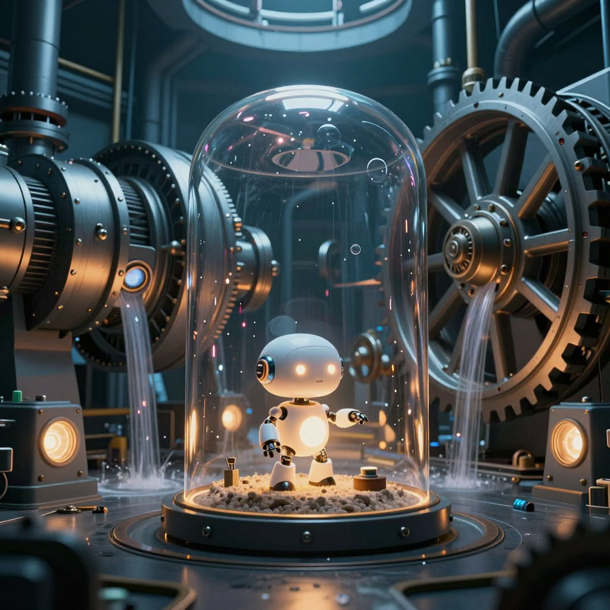
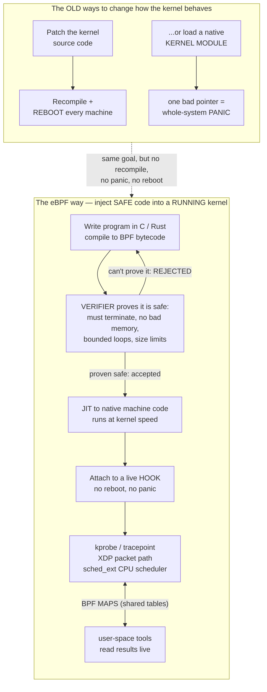
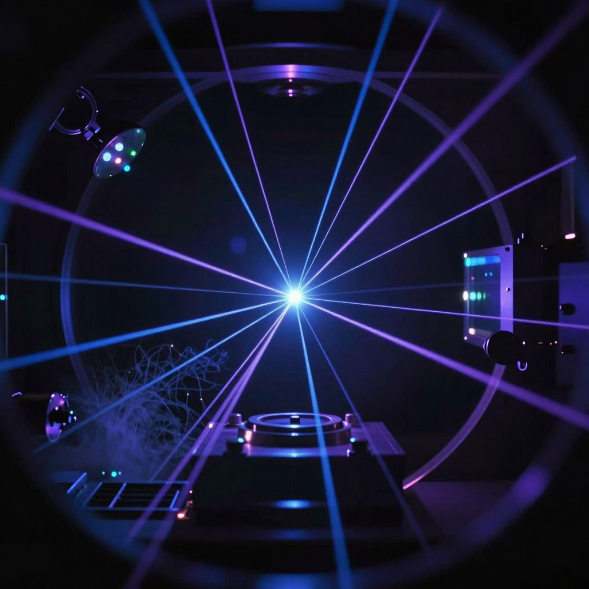

# Daily Reading — 2026-07-22

*A "National Geographic / Discovery" pair — one story from the **career** world (systems / infrastructure), one from the **hobby** world (physics / metrology). Not course material; the wider, stranger, more current world around what you do.*

**Today's two stories:**
1. 🐝⚙️ **The operating-system kernel quietly became programmable.** For fifty years there were exactly two ways to change how Linux behaves down in its core: patch the kernel's source and recompile the whole thing (then reboot every machine), or write a *kernel module* — native code with root of the machine, where one stray pointer crashes the box. In the last few years a third way went mainstream: **eBPF**, a tiny sandboxed virtual machine *inside* the running kernel. You load a small program, a **verifier** mathematically proves it can't hang or corrupt memory, it's compiled to native speed, and it attaches to a live hook — **no reboot, no crash, no recompile.** Netflix, Meta, Cloudflare and Google now run it in production on millions of machines. And in late 2024 it reached the last place anyone expected: you can now write the **CPU scheduler itself** — the code that decides which program runs next — as a hot-swappable eBPF program.
2. ⏱️✨ **We're about to redefine what a second *is* — and the new one is built on light.** Since 1967 the second has been defined by a microwave hum inside a caesium atom: exactly 9,192,631,770 oscillations. That definition is now the *slowest* part of our best clocks. A new generation of **optical** atomic clocks — probing a transition that buzzes not billions but *hundreds of trillions* of times a second — has blown past caesium by a factor of about 100. In **July 2025** a clock at NIST built on a single trapped aluminum ion hit **19 decimal places** of accuracy: it wouldn't gain or lose a second in *roughly 40 billion years*, several times the age of the universe. The world's metrologists have a roadmap to **redefine the SI second on optical clocks around 2030** — and, in the same breath, to **abolish the leap second by 2035**.

> **Why this pair.** Both stories are about a piece of **invisible bedrock** — something so foundational you never think about it — turning out to be *up for revision*. Story 1: the kernel, the most sacred untouchable layer of a computer, becomes something you can safely inject code into at runtime; even *the scheduler's rules* are now soft. Story 2: the **second**, the base unit the entire physical world is measured against, is being rebuilt on a better physical phenomenon. And they're quietly linked. Those optical clocks don't just define time in a lab — precise, synchronized time is the hidden ingredient that lets the giant distributed systems eBPF watches over *agree on the order of events at all* (Google's globe-spanning Spanner database literally waits out clock uncertainty to keep its data consistent). One story reprograms the machine from the inside; the other sharpens the tick that all the machines quietly march to.

---

## 1. 🐝 The kernel you can reprogram without breaking it: eBPF

🔗 **Start here (both are accessible):** [What is eBPF? — the official primer](https://ebpf.io/what-is-ebpf/) · [eBPF — Brendan Gregg's overview](https://www.brendangregg.com/ebpf.html)
🔗 **The "why now":** [Extensible Scheduler Class (sched_ext) — Linux kernel docs](https://docs.kernel.org/scheduler/sched-ext.html) · [sched_ext's plans for GPU-awareness and energy-aware scheduling — Phoronix](https://www.phoronix.com/news/sched-ext-future-plans-2026)
🔗 **Go deeper:** [Cilium — eBPF-based networking, security, observability](https://cilium.io/) · [bcc / bpftrace tracing tools](https://github.com/iovisor/bcc)

*The whole idea in one picture: eBPF lets you drop a small program into the "engine room" of the kernel, but it runs inside a sealed sandbox a verifier polices — it can observe and tap into the machinery around it, yet it cannot break the machine. — Illustration, generated locally (ComfyUI + Z-Image Turbo); a generic metaphor, no real hardware or text depicted.*

Image prompt (source of truth)

> A tiny sleek glowing robotic creature safely enclosed inside a transparent protective glass capsule sandbox, placed deep inside a vast dark industrial engine room full of massive turbines gears pipes and flowing streams of light, the small program-creature observing and tapping into the machinery through safe sealed glowing ports, cinematic conceptual illustration, deep blue and teal palette with warm amber highlights, sense of a small safe agent operating inside a huge complex living machine, highly detailed, atmospheric, no text, no words, no letters, no legible symbols

**The wall that used to be absolute.** Every program you run lives in **user space**, walled off from the **kernel** — the privileged core that actually talks to the CPU, memory, disk and network. That wall is the whole reason your laptop doesn't die when an app crashes. But it also meant the kernel was *frozen from the outside*: if you wanted it to do something new — a smarter firewall, a custom tracing probe, a different way of steering packets — you had exactly two grim options. **Option one: patch the kernel source and recompile it**, then get your change through the Linux maintainers (months to years) and reboot every machine on Earth that wants it. **Option two: write a kernel module** — native code loaded straight into that privileged core, running with no seatbelt, where a single bad pointer doesn't throw an exception, it takes down the entire operating system. Both are how you got, say, a new network feature into production in 2010. Neither is something you do casually.

**The trick: a tiny sandboxed computer living inside the kernel.** eBPF (the name is historical — it grew out of the *Berkeley Packet Filter*, but "the acronym no longer carries literal meaning," in the project's own words) is a small **virtual machine baked into the Linux kernel**. You write a little program — in C or Rust — compile it to a compact **bytecode**, and hand it to the kernel. Three things then happen that make this safe in a way a kernel module never was:

- **A verifier proves it can't hurt you.** Before the program is allowed to run, the kernel's **verifier** walks every possible path through it and *rejects it unless it can prove* the program terminates (no infinite loops), never touches memory out of bounds, never dereferences a bad pointer, and stays within strict size and complexity limits. If it can't be proven safe, it doesn't load. This is the heart of the whole idea: you get to run your code in the most privileged place on the machine *because a theorem-checker vouched for it first*.
- **It's JIT-compiled to native speed.** The bytecode is **just-in-time compiled** into machine instructions for your actual CPU, so it runs at essentially native kernel speed — not interpreted, not slow.
- **It attaches to a hook, live.** The verified program is hung onto a **hook point** — a system call, a kernel function entry/exit (a *kprobe*), a network event, a tracepoint — and starts firing on those events *immediately, with no reboot*. It talks to the outside world through **maps**: shared key/value tables the kernel side writes and your user-space tool reads live.

<!-- fig1 -->
<!-- DIAGRAM:START -->

Diagram source (Mermaid)

<!-- DIAGRAM:END -->

**Why this quietly ate the infrastructure world.** Once you can run safe, fast, custom code at any kernel event without shipping a kernel, three huge domains fall to it:

- **Networking.** Instead of the old `iptables` chains, you process packets *at the earliest possible instant* — some eBPF programs (via **XDP**, eXpress Data Path) run on the network card's driver path *before the kernel even builds a socket buffer*, dropping a DDoS flood or load-balancing at millions of packets per second. Meta's **Katran** load balancer and the **Cilium** project (the leading Kubernetes networking layer, running on clusters of tens of thousands of nodes) are built this way.
- **Observability.** This is the one that changes daily engineering life. eBPF lets you attach a probe to *any* kernel or user function and measure it — latency, off-CPU time, which process opened which file — **without changing a single line of the application** and without a sidecar agent. This "zero-instrumentation" telemetry is the engine under **bpftrace**, **Pixie**, Cilium's **Hubble**, and Datadog's tracing. Meta's **Strobelight** profiler, built on it, reportedly cut fleet CPU usage by around 20% just by finding waste.
- **Security.** Because you see every system call as it happens, you can enforce policy and spot intrusions in real time — projects like **Falco** and **Tetragon** filter billions of kernel events a minute to catch a container doing something it shouldn't.

> **The "huh, I didn't know that" file.** The frontier just crossed a line people thought was uncrossable: **the CPU scheduler is now pluggable.** The scheduler is the kernel's beating heart — the code that, thousands of times a second, decides *which thread runs on which core next*. It was the definition of untouchable core kernel. Then in **Linux 6.12 (November 2024)** the kernel merged **`sched_ext`, the extensible scheduler class**: you can now write a **whole CPU scheduler as an eBPF program and hot-swap it on a running system** — and if your scheduler misbehaves or stalls, the kernel *automatically rips it out and falls back to the default*, so you literally cannot brick the machine. Suddenly scheduling stopped being a decade-long negotiation with kernel maintainers and became something you can *experiment* with over an afternoon: game-latency schedulers, cloud schedulers that pack VMs tighter, and (per NVIDIA's 2026 roadmap for `sched_ext`) **GPU-aware and energy-aware** schedulers that know an AI training job's shape. The catch worth holding: the verifier's safety guarantee is real but *narrow* — it proves your program won't corrupt the kernel; it does **not** prove your scheduler is any *good*, and a "safe" but dumb scheduler can still wreck your throughput. Safety and correctness are different theorems.

---

## 2. ⏱️ Rebuilding the second out of light

🔗 **Start here:** [FAQ — the redefinition of the second (BIPM)](https://www.bipm.org/en/faq-redefinition-second) · [NIST ion clock sets a new record for the most accurate clock in the world (July 2025)](https://www.nist.gov/news-events/news/2025/07/nist-ion-clock-sets-new-record-most-accurate-clock-world)
🔗 **The "why now":** [Roadmap toward the redefinition of the second — *Metrologia* (open access)](https://iopscience.iop.org/article/10.1088/1681-7575/ad17d2) · [The leap second's time is up: world votes to stop pausing clocks — *Scientific American*](https://www.scientificamerican.com/article/the-leap-seconds-time-is-up-world-votes-to-stop-pausing-clocks/)
🔗 **Go deeper:** [Optical lattice clock — Wikipedia](https://en.wikipedia.org/wiki/Optical_lattice) · [Leap second will be abolished by 2035 — Live Science](https://www.livescience.com/goodbye-leap-second-2035)

*Scene-setting for an optical atomic clock — a single atom (or ion) pinned and held nearly motionless at the crossing point of laser beams, its light-frequency "tick" read out by the surrounding optics. — Illustration, generated locally (ComfyUI + Z-Image Turbo). A **generic** conceptual apparatus, **not** the actual NIST clock (a real, specific device); for real images see the links above.*

Image prompt (source of truth)

> A single tiny brilliant point of blue-white light, a single trapped atom, suspended and levitating at the exact center of a crisscrossing web of fine sharp laser beams inside an ultra-cold scientific vacuum apparatus, surrounded by intricate mirrors and optics glowing faintly, wisps of cryogenic vapor, cinematic dramatic lighting, deep blacks with electric blue and violet laser light, a sense of impossible precision and perfect stillness, stylized conceptual digital illustration, highly detailed, no text, no words, no letters, no numbers

**What a clock actually is.** Strip away the face and the hands: *every* clock is just two parts — something that **oscillates** at a steady rate, and something that **counts** the oscillations. A pendulum swings once a second and gears count the swings. A quartz watch flexes a crystal about 32,768 times a second. The faster and more *regular* the oscillator, the finer you can slice time — so the entire history of timekeeping is a hunt for a faster, steadier tick. The steadiest oscillator we know of is an **atom**: an electron jumping between two energy levels absorbs or emits radiation at a frequency that is *identical for every atom of that element in the universe* and set by the laws of physics, not by any manufacturing. That's why in **1967** the world redefined the second not as a slice of Earth's wobbly rotation but as a fixed count of atomic beats: **exactly 9,192,631,770 oscillations** of the microwave radiation from a **caesium-133** atom. Count that many and one second has passed, anywhere, forever.

**Why caesium is now the bottleneck.** Here's the catch built into that number. The *precision* of a clock scales with how many ticks you can count in a given time — a higher-frequency oscillator carves time into finer pieces. Caesium's transition sits in the **microwave** band at about 9 gigahertz (that 9.2-billion figure). But visible and ultraviolet **light** oscillates at *hundreds of terahertz* — roughly **100,000 times faster**. Build a clock on an *optical* transition instead of a microwave one and, in principle, you get about five orders of magnitude finer resolution on the tick. The trouble was always the *counting*: nothing electronic can count hundreds of trillions of cycles per second. The breakthrough that unlocked optical clocks — the **optical frequency comb**, which won the 2005 Nobel Prize — is essentially a gearbox that divides that blistering optical frequency down to something countable. Once combs existed, optical clocks took off and left caesium behind. Best caesium fountains top out around a few parts in $10^{16}$; the best optical clocks are now down in the $10^{-18}$ to $10^{-19}$ range — about **100 times more accurate.** Measurement accuracy is now limited *by the 1967 definition itself*, not by our technology. That is the entire argument for a redefinition.

<!-- fig2 -->
<!-- PLOT:START -->

Plot source (matplotlib)

See [`images/22-programmable-kernels-and-redefining-the-second-2-plot.py`](images/22-programmable-kernels-and-redefining-the-second-2-plot.py). Real published milestones; representative headline uncertainty figures, plotted on an inverted log axis so "higher = better."

<!-- PLOT:END -->

**The machine that just set the record.** In **July 2025**, a NIST team announced the most accurate clock ever built: a single **aluminum ion** ($\text{Al}^{+}$), held motionless in an electromagnetic trap and interrogated by *quantum logic spectroscopy* (the aluminum ion is a beautifully stable timekeeper but hard to probe directly, so a companion magnesium ion is used to cool it and read out its state — a trick that shared in the 2012 Nobel Prize). The result: a fractional frequency uncertainty of about $5.5 \times 10^{-19}$ — **19 decimal places**, roughly 41% better than the previous record, and 2.6 times more stable than any other ion clock. Put in human terms: at that rate the clock would not gain or lose a full second in **around 40 billion years** — several times the current age of the universe. Getting there took making the probe laser absurdly steady: its stability was borrowed from a **cryogenic silicon cavity** and piped in over a **3.6-kilometer fiber link**, letting them ask the ion a single question for a full second at a time.

**The wonder buried in the numbers: these clocks feel gravity.** When a clock gets *this* good, it stops being just a clock and becomes a sensor for **Einstein's relativity** on a tabletop. General relativity says time runs *faster* higher up in a gravitational field — a clock on a shelf ticks faster than one on the floor. The size of the effect is tiny, a fractional rate change of about $\Delta f / f = g h / c^{2}$, which comes to roughly one part in $10^{16}$ for every meter you go up. A caesium clock can't see that. But a $10^{-19}$ optical clock can resolve the time difference caused by raising it **by about a centimeter** — and in 2022 a JILA group measured the redshift *across a single millimeter-tall cloud of atoms*. This cuts both ways: it's a nuisance the metrologists must correct for (you have to know a clock's altitude to sub-centimeter precision to compare two of them), and it's a gift — a network of optical clocks becomes a **relativistic altimeter** that can map tiny changes in Earth's gravity, sense magma moving under a volcano, or hunt for drifting fundamental constants and dark matter.

> **The "huh, I didn't know that" file.** Two twists most people miss. **First — redefining the second is a committee marathon, not a switch-flip.** The plan (endorsed by the international timekeeping bodies) is to pick *which* optical transition — or *combination* of them — becomes the new definition, satisfy a checklist of "mandatory criteria" (multiple independent clocks worldwide must agree, and the ultra-precise links to compare them across continents must be proven) by about 2029, and have the General Conference on Weights and Measures **ratify a new second around 2030**, with 2034 as a backup. There's even a serious proposal to define the second not on one atom but on the *geometric mean of several* optical transitions at once, hedging against any single one turning out imperfect. **Second — the same era is killing the leap second.** Because Earth's rotation is slightly irregular, since 1972 we've occasionally inserted a "leap second" into UTC to keep atomic time aligned with the spinning planet — a nightmare for computers (leap seconds have crashed Reddit, Cloudflare and airline systems). In 2022 the world's metrologists **voted to abolish the leap second by 2035**, letting atomic time and Earth-rotation time drift apart by more than a second before anyone bothers to reconcile them. So within about a decade, humanity will have *both* a new, light-based definition of the second *and* a decision to stop chaining our clocks to the wobble of the Earth. The tick is being cut loose from the planet.

---

## Key terms (English · 大陆 简体 · 台灣 繁體)

| English | 大陆 (简体) | 台灣 (繁體) | Note |
|---|---|---|---|
| kernel (OS) | 内核 | 核心 | ⚠ genuinely different word (大陆 内核 vs 台灣 核心/核心程式) |
| operating system | 操作系统 | 作業系統 | ⚠ 操作 vs 作業 |
| virtual machine | 虚拟机 | 虛擬機 | script only |
| compiler | 编译器 | 編譯器 | script only |
| scheduler (CPU) | 调度器 | 排程器 | ⚠ genuinely different word (调度 vs 排程) |
| observability | 可观测性 | 可觀測性 | script only |
| packet (network) | 数据包 | 封包 | ⚠ genuinely different word |
| second (unit of time) | 秒 | 秒 | same |
| atomic clock | 原子钟 | 原子鐘 | script only |
| frequency | 频率 | 頻率 | script only |
| oscillation | 振荡 | 振盪 | script only |
| uncertainty | 不确定度 | 不確定度 | script only |
| general relativity | 广义相对论 | 廣義相對論 | script only |
| dark matter | 暗物质 | 暗物質 | script only |

---

## Sources
- [What is eBPF? — ebpf.io](https://ebpf.io/what-is-ebpf/)
- [eBPF — Brendan Gregg](https://www.brendangregg.com/ebpf.html)
- [Extensible Scheduler Class (sched_ext) — Linux kernel documentation](https://docs.kernel.org/scheduler/sched-ext.html)
- [Linux's sched_ext has plans for GPU-awareness, energy-aware abstractions — Phoronix](https://www.phoronix.com/news/sched-ext-future-plans-2026)
- [Cilium — eBPF-based networking, security and observability](https://cilium.io/)
- [bcc / bpftrace — the iovisor tracing tools](https://github.com/iovisor/bcc)
- [FAQ: redefinition of the second — BIPM](https://www.bipm.org/en/faq-redefinition-second)
- [NIST ion clock sets new record for most accurate clock in the world (July 2025)](https://www.nist.gov/news-events/news/2025/07/nist-ion-clock-sets-new-record-most-accurate-clock-world)
- [World's most precise clock achieves 19-decimal accuracy — Phys.org](https://phys.org/news/2025-07-world-precise-clock-decimal-accuracy.html)
- [Roadmap toward the redefinition of the second — *Metrologia*](https://iopscience.iop.org/article/10.1088/1681-7575/ad17d2)
- [The leap second's time is up — *Scientific American*](https://www.scientificamerican.com/article/the-leap-seconds-time-is-up-world-votes-to-stop-pausing-clocks/)
- [Pesky 'leap second' will be abolished by 2035 — Live Science](https://www.livescience.com/goodbye-leap-second-2035)

*Prepared 2026-07-22 — two feature stories in the "Nat-Geo / Discovery" register: one **career-track** (eBPF — safe, verified, JIT-compiled programs loaded into a running Linux kernel; the `sched_ext` pluggable-scheduler frontier) and one **hobby-track** (the coming redefinition of the SI second on optical atomic clocks, and the abolition of the leap second by 2035). Figures current to mid-2026. The **"What we worked out"** section will be added on finalize, after the discussion — leaving room for the threads he wants to pull (natural sparring hooks: the verifier's safety-vs-correctness gap and whether formal proof can ever cover a scheduler's *quality*; eBPF as "JavaScript for the kernel" and what that analogy over-promises; why optical clocks feeling gravity is a nuisance *and* a sensor; and the distributed-systems link — TrueTime/Spanner waiting out clock uncertainty — that ties the two stories together). Visuals: 2 ComfyUI path-4 illustrations (a sandboxed program-creature in the kernel engine room; a trapped ion in a web of laser light) + 1 matplotlib figure (clock fractional uncertainty vs year, caesium floor vs the optical dive to $10^{-19}$) + 1 Mermaid diagram (old kernel-change paths vs the eBPF verify→JIT→attach flow).*
