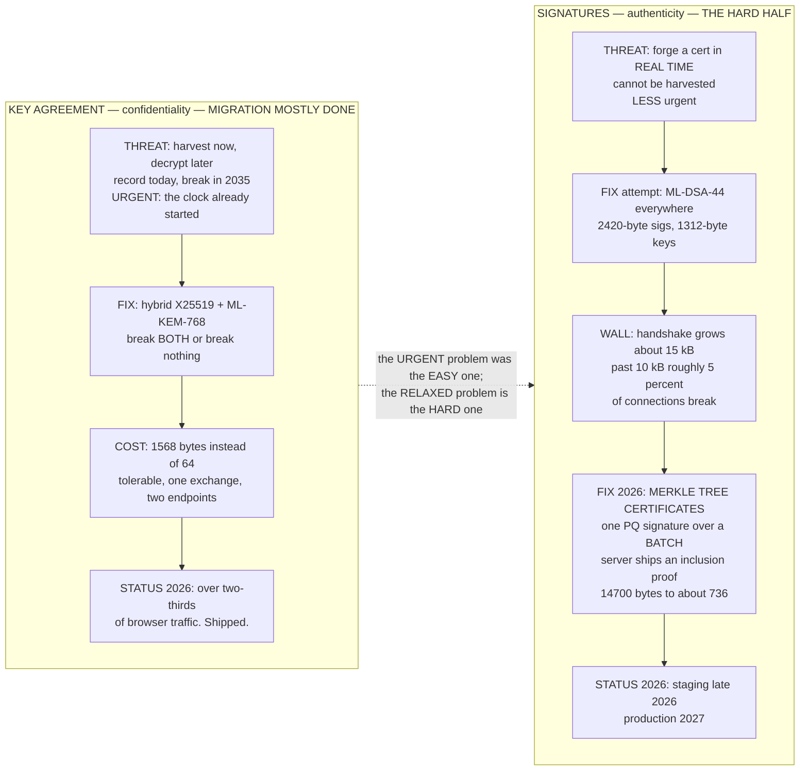
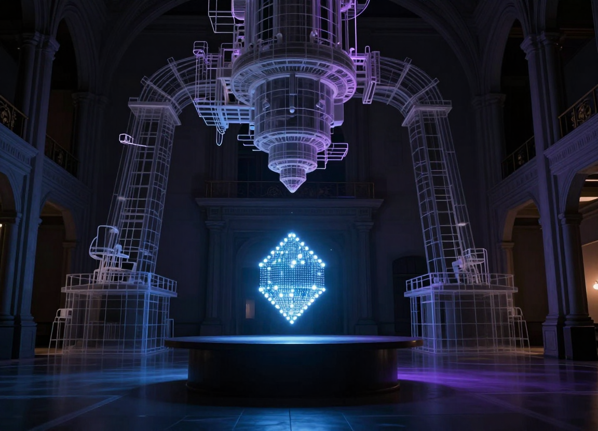
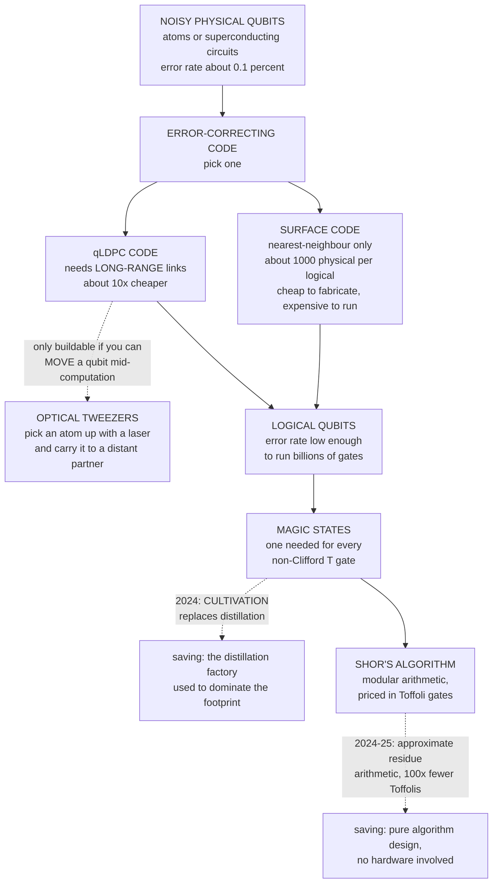
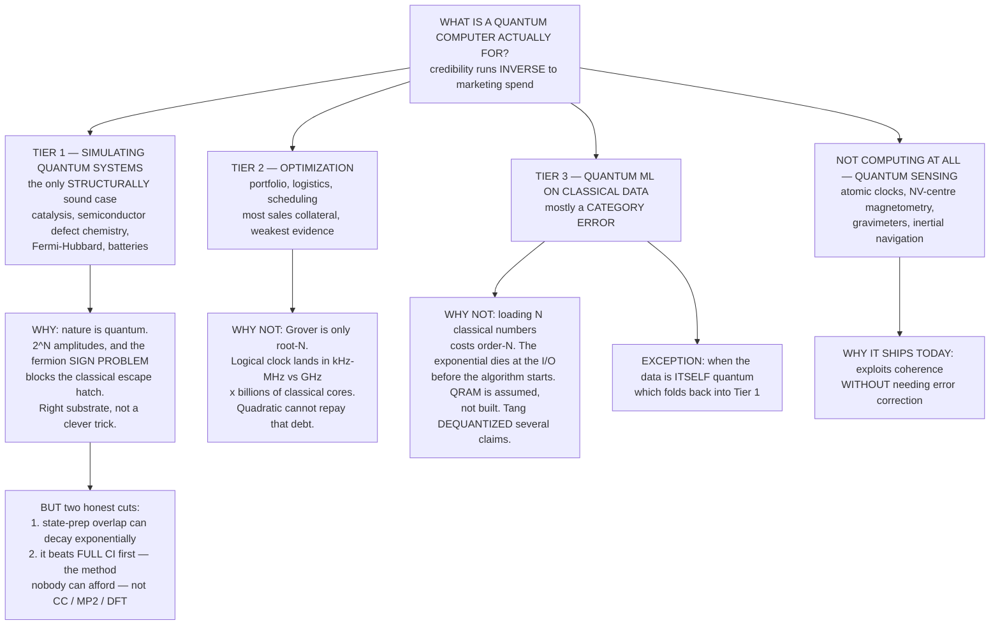

# Daily Reading — 2026-07-27  ✅ finalized

*A "National Geographic / Discovery" pair — one story from the **career** world (security / internet infrastructure), one from the **hobby** world (quantum physics / hardware). Not course material; the wider, stranger, more current world around what you do.*

**Today's two stories:**
1. 🔐🌍 **The internet is replacing every lock it owns — while staying open for business.** Somewhere between your last two browser refreshes, the maths that keeps HTTPS private changed. RSA and elliptic-curve cryptography — the two algorithms that have secured essentially every connection you have ever made — are being ripped out and replaced with lattice-based successors, because a sufficiently large quantum computer breaks both. This is not a proposal. **Over two-thirds of browser traffic reaching Cloudflare is already post-quantum encrypted**, up from 1.8% in early 2024, and nobody sent you a notification. On **22 June 2026** the US signed **Executive Order 14412**, putting a hard legal deadline on it: federal systems post-quantum for *encryption* by end-2030, for *authentication* by end-2031. And the harder half — the digital signatures inside every TLS certificate — only got a credible plan **seven weeks ago**, when Let's Encrypt committed to a genuinely elegant trick that makes a post-quantum certificate chain *smaller* than today's classical one.
2. ⚛️📉 **The machine that would break those locks keeps getting smaller — and nobody has built anything.** In 2012, the estimate for the quantum computer needed to factor a 2048-bit RSA key was around **a billion** physical qubits. In 2019 it was 20 million. In May 2025, **under one million**. In February 2026, **under 100,000**. On **30 March 2026** a Caltech/Oratomic/Berkeley team put a number on the table that would have been laughed out of a seminar room a decade ago: **10,000 atomic qubits**. That is five orders of magnitude in fourteen years — faster than Moore's law — and almost **none of it came from better hardware.** It came from better error-correcting codes, cheaper "magic states," and one wonderfully physical trick: in a neutral-atom machine you can pick a qubit up with a laser tweezer and *carry it somewhere else, mid-computation*. The same week, that team raised 300 million dollars to go build it.

> **Why this pair.** These are the two blades of a pair of scissors closing, and the reason to read them together is that **the blade moving fastest is the one made of mathematics, not silicon.** Story 1 is a migration racing a deadline nobody can date. Story 2 is why that deadline keeps moving *toward* you — the threat curve is being pulled down five orders of magnitude by theorists writing papers, while the hardware curve creeps up from 5 qubits to 6,100. And the link is now literal and dated: **in April 2026 Cloudflare pulled its own "fully post-quantum" target forward to 2029, explicitly citing the Google and Oratomic results from story 2.** A paper posted to arXiv on a Monday changed an infrastructure company's roadmap by a year. There is also a quieter lesson under both: the *hard* part of story 1 turns out not to be inventing quantum-proof maths — that's done and standardised — but **changing a primitive inside a planetary-scale legacy system**. We have never been good at that. This time we have a deadline.

---

## 1. 🔐 The great cryptographic migration

🔗 **Start here:** [State of the post-quantum Internet in 2025 — Cloudflare](https://blog.cloudflare.com/pq-2025/) · [NIST releases the first three finalized post-quantum encryption standards (Aug 2024)](https://www.nist.gov/news-events/news/2024/08/nist-releases-first-3-finalized-post-quantum-encryption-standards)
🔗 **The "why now":** [Executive Order 14412 — Securing the Nation Against Advanced Cryptographic Attacks (22 June 2026)](https://www.whitehouse.gov/presidential-actions/2026/06/securing-the-nation-against-advanced-cryptographic-attacks/) · [Cloudflare on the EO: "it's time to get to work"](https://blog.cloudflare.com/post-quantum-eo-2026/) · [A post-quantum future for Let's Encrypt (3 June 2026)](https://letsencrypt.org/2026/06/03/pq-certs)
🔗 **Go deeper:** [Why we cannot wait for better post-quantum signature algorithms — Cloudflare](https://blog.cloudflare.com/ml-dsa-will-have-to-do/) · [NIST IR 8547 — transition to post-quantum standards](https://csrc.nist.gov/pubs/ir/8547/ipd)

*The shape of the problem: replace every lock on the door — without ever closing the door. Some keyholes have been swapped for the new crystalline kind, most have not, and the traffic never stopped for a second. — Illustration, generated locally (ComfyUI + Z-Image Turbo); a generic metaphor, no real system or text depicted.*

Image prompt (source of truth)

> A colossal ornate brass vault door swung WIDE OPEN at a three-quarter angle inside a vast dark hall, revealing a bright glowing portal behind it through which a continuous river of streaming light and data is flowing, the face of the open door leaf covered in rows of old dark keyholes of which roughly half have already been replaced by glowing blue crystalline geometric lock modules, low dramatic camera angle, cinematic conceptual illustration, warm brass and cold electric blue palette, the sense of traffic never stopping while the locks are swapped one by one, highly detailed, atmospheric, no text, no words, no letters, no numbers, no vehicles

**What is actually being replaced, and what isn't.** Public-key cryptography does two separate jobs, and it is worth keeping them apart because their migrations have completely different clocks. **Key agreement** gives you *confidentiality* — you and the server derive a shared secret over a public wire, and everything after that is encrypted with it. **Signatures** give you *authenticity* — the certificate chain that proves the server you are talking to is really your bank. Today both jobs are done by RSA or elliptic curves, and **Shor's algorithm breaks both** on a large enough quantum computer, because both rest on the same kind of hidden-period problem. What is *not* broken: symmetric encryption. AES-256 and SHA-256 survive; Grover's algorithm gives only a square-root speedup, which you buy off by doubling key lengths. So the migration is precisely a **public-key** migration — which is, unfortunately, the part woven into every protocol handshake on earth.

**Why the deadline is already in the past for some data — "harvest now, decrypt later."** An adversary does not need a quantum computer today to hurt you today. They need a hard drive. Record the encrypted traffic now, store it, and decrypt it whenever the machine arrives. Anything whose secrecy must outlive the machine is *already* exposed. Michele Mosca's way of putting this is the cleanest risk model in the field: let $x$ be how many years your migration takes, $y$ how many years your data must stay secret, and $z$ how many years until a cryptographically relevant quantum computer exists. You are in trouble whenever

$$x + y > z$$

and note that **you do not get to know** $z$ — you only get to shrink $x$ and $y$. That inequality is the entire argument for migrating a decade before anyone expects the machine, and it is why the EO's language is about adversaries "collecting United States information now and decrypting it later."

**The standards exist and are boring now, which is the point.** On 13 August 2024 NIST finalised three: **FIPS 203 / ML-KEM** (key encapsulation, formerly Kyber), **FIPS 204 / ML-DSA** (signatures, formerly Dilithium), and **FIPS 205 / SLH-DSA** (hash-based signatures, formerly SPHINCS+). In March 2025 NIST added a fifth algorithm, **HQC**, as a deliberate backup for ML-KEM — draft standard early 2026, final expected 2027. HQC is slower and bigger and nobody wants to deploy it. That is not the point. The point is that HQC rests on **code-based** hardness rather than lattices, so if lattices ever fall, the world is not left with nothing.

**And lattices *could* fall — the cautionary tale everyone in this field tells.** In July 2022, **SIKE** — a NIST fourth-round key-encapsulation candidate that had survived five years of public scrutiny — was destroyed by Wouter Castryck and Thomas Decru. Not by a quantum computer. By a **single core of a 2013-vintage Intel Xeon, in about 62 minutes**, using a "glue-and-split" theorem that Ernst Kani had published in **1997**. The parameter set they broke was the one claiming NIST security level 1. (Rainbow, a signature finalist, died the same year.) The lesson is not "post-quantum crypto is unsafe." It is the more uncomfortable one: **"post-quantum" means "no known attack," not "proven hard"** — the same status classical crypto has always had, just with less history behind it. This is why every real deployment today is **hybrid**: X25519 (classical elliptic curve) *and* ML-KEM-768 together, so an attacker must break both. Belt and braces, deliberately.

**The half that is essentially done: key agreement.** The hybrid **X25519MLKEM768** is now the default in Chrome, Firefox, Cloudflare's entire edge, and — since iOS 26 shipped in September 2025 — Apple's networking stack. The adoption curve is one of the fastest protocol transitions the internet has ever seen, and almost nobody noticed it happening:

<!-- fig1 -->
<!-- PLOT:START -->

Plot source (matplotlib)

See [`images/27-the-crypto-migration-and-the-shrinking-codebreaker-2-plot.py`](images/27-the-crypto-migration-and-the-shrinking-codebreaker-2-plot.py). Points are reported Cloudflare figures (1.8% in early 2024; 29% at the start of 2025; over 50% by late October 2025; 52% in early December 2025; "over two-thirds" in June 2026); the connecting line is interpolation, not measurement.

<!-- PLOT:END -->

**The half that isn't: signatures — and the reason is size, not maths.** Here the numbers get brutal. A typical TLS handshake today ships **five signatures and two public keys, totalling roughly 640 bytes**. Swap in ML-DSA-44 — signature 2,420 bytes, public key 1,312 bytes — and the certificate chain grows by about **15 kilobytes**. For context, the median certificate chain today is 3.2 kB and already accounts for roughly 40% of all bytes transferred in half of non-resumed connections. Push a handshake past about 10 kB and you are no longer doing cryptography, you are doing **network archaeology**: you overflow TCP's initial congestion window, you trip middleboxes and firewalls that were written when nobody imagined a 14 kB ClientHello, and roughly **5% of real-world connections simply break**. The alternatives are worse in different ways — FN-DSA-512 is smaller but needs floating-point arithmetic in a side-channel-sensitive code path, and newer schemes like SNOVA and MAYO have not been beaten on for long enough to trust.

**But here is the subtlety worth carrying — the two clocks run in opposite directions.** A signature cannot be harvested and forged later. To impersonate your bank, the attacker needs a working quantum computer **at the moment of the handshake**, not in 2040. So *confidentiality* is urgent and *authentication* is not. Yet confidentiality was also the **easy** migration — one key exchange, two endpoints, ship it — while authentication is the **hard** one, because it drags in certificate authorities, certificate transparency logs, root programmes, embedded devices, and every TLS library on earth. **The urgent problem was easy and the relaxed problem is hard.** That inversion is why the industry did key agreement first and is only now, in mid-2026, arriving at a credible answer for signatures.

**The elegant answer: Merkle Tree Certificates.** On 3 June 2026, Let's Encrypt — which secures over 500 million websites — announced that **Merkle Tree Certificates (MTCs)** are its route to a quantum-safe web PKI. The idea is a lovely piece of engineering judo. Instead of a CA signing each certificate individually with an expensive post-quantum signature, the CA **batches thousands of certificates into a Merkle tree and signs the root once**. Browsers periodically fetch and cache these signed roots — "landmarks." Then, in the common case, the server does not send a signature at all: it sends **one inclusion proof** showing its certificate sits in a tree the browser already trusts. Authentication data collapses from roughly **14,700 bytes to as little as 736 bytes** — meaning a post-quantum handshake ends up **smaller than today's classical one**. Certificate Transparency, which was bolted onto the web PKI after the fact, comes built in, because an append-only Merkle tree is exactly what CT already is. There is a fallback "standalone" form with a full ML-DSA signature for clients whose landmarks are stale. Staging late 2026, production 2027; it is an IETF experiment in the PLANTS working group, authored by Google, Cloudflare and Geomys engineers, and Chrome is already testing it on live traffic.

<!-- fig2 -->
<!-- DIAGRAM:START -->

Diagram source (Mermaid)

<!-- DIAGRAM:END -->

**Why now, in dates.** **NIST IR 8547** deprecates RSA-2048 and ECC P-256 in **2030** and disallows all quantum-vulnerable public-key algorithms by **2035**. **Executive Order 14412** (22 June 2026) hard-codes federal deadlines: a PQC pilot within 180 days, a **cryptographic bill of materials** within 270 days, post-quantum key establishment for high-value systems by **31 December 2030**, post-quantum authentication by **31 December 2031**, and federal contractors on post-quantum FIPS by end-2030. NSA's CNSA 2.0 wants new national-security systems there by 2027. And in April 2026 Cloudflare moved its own "fully post-quantum" target to **2029** — a year ahead of the government's — citing the research in story 2.

> **The "huh, I didn't know that" file.** Three things worth keeping. **First: the actual deliverable is not ML-KEM, it is *cryptographic agility*.** Nobody sane believes ML-KEM is the last algorithm. SIKE proves the field can lose a candidate overnight; HQC exists precisely as insurance. The durable engineering asset is the ability to *swap a primitive quickly* — which is why the EO asks for a **cryptographic bill of materials**, a dependency manifest for cryptography. If that sounds like an SBOM, it is: the deep problem is the same one you meet in any legacy system, which is that **nobody knows what depends on what**. The historical record is not encouraging — SHA-1's deprecation was announced in 2011 and it was still limping through production systems well into the 2020s. This migration is bigger and has a deadline. **Second: a CBOM is worth doing even if quantum computing stalls forever.** It is the artefact that tells you which of your services still pins TLS 1.0, which library your vendor's SDK statically links, and where the 2013-era hardware security module lives. The quantum threat is, in a slightly cynical reading, the forcing function that finally gets organisations to inventory their own cryptography. **Third: the migration is genuinely invisible.** You have already been using post-quantum key agreement for months. No version bump, no user-facing change, no press release you saw — just a slow ratchet in the TLS handshake. It is a nice reminder of what "good infrastructure work" actually looks like: the successful case is the one nobody notices.

---

## 2. ⚛️ The codebreaker that keeps shrinking

🔗 **Start here:** [New findings shorten the road to cryptographically relevant quantum computers — *Physics World*](https://physicsworld.com/a/new-findings-shorten-the-road-to-cryptographically-relevant-quantum-computers/) · [Caltech: useful quantum computers could be built with as few as 10,000 qubits](https://www.caltech.edu/about/news/caltech-team-finds-useful-quantum-computers-could-be-built-with-as-few-as-10000-qubits)
🔗 **The "why now":** [*Shor's algorithm is possible with as few as 10,000 reconfigurable atomic qubits* — Cain et al., arXiv (30 Mar 2026)](https://arxiv.org/abs/2603.28627) · [Q-Day just got closer: three papers in three months — *The Quantum Insider*](https://thequantuminsider.com/2026/03/31/q-day-just-got-closer-three-papers-in-three-months-are-rewriting-the-quantum-threat-timeline/)
🔗 **Go deeper:** [*Quantum error correction below the surface code threshold* — Google, *Nature* (Dec 2024)](https://www.nature.com/articles/s41586-024-08449-y) · [*A tweezer array with 6100 highly coherent atomic qubits* — Manetsch et al., *Nature* (Sept 2025)](https://www.nature.com/articles/s41586-025-09641-4) · [IBM's path to large-scale fault tolerance](https://www.ibm.com/quantum/blog/large-scale-ftqc)

*What we thought it would take, and what it might actually take. The ghost is the billion-qubit machine of the 2012 estimates; the small bright lattice is the 10,000-atom device the 2026 papers describe. Nothing about the physics changed — the **design** did. — Illustration, generated locally (ComfyUI + Z-Image Turbo); a generic conceptual scene, not any real apparatus.*

Image prompt (source of truth)

> A small dense jewel-like lattice grid of brilliant glowing blue-white points of light, floating just above a dark polished tabletop in the middle of a vast empty cathedral-sized hall, surrounded by the faint translucent ghostly wireframe outline of a colossal industrial machine that is not really there, dramatic contrast of scale between the tiny solid brilliant object and the enormous transparent phantom around it, cinematic conceptual illustration, deep blacks with electric cyan and violet light, a sense of something enormous collapsing down into something very small, highly detailed, atmospheric, no text, no words, no letters, no numbers, no people

**The number that will not stop falling.** Breaking RSA-2048 with Shor's algorithm needs a few thousand *perfect* qubits. We have no perfect qubits, so the real question is always: how many **noisy physical** qubits do you need to build enough error-corrected logical ones? That number has collapsed:

| Year | Estimate for RSA-2048 | Runtime | What changed |
|---|---|---|---|
| 2012 | order of $10^{9}$ physical qubits | — | first serious surface-code costing |
| 2019 | 20 million (Gidney–Ekerå) | 8 hours | windowed arithmetic, better layout |
| May 2025 | under 1 million (Gidney) | under 1 week | approximate residue arithmetic, yoked surface codes, magic-state *cultivation* |
| Feb 2026 | under 100,000 (Iceberg Quantum) | — | qLDPC codes — simulation only, not hardware-validated |
| Mar 2026 | 10,000 reconfigurable atoms (Cain et al.) | see the catch below | qLDPC plus atom transport |

That is a factor of about $10^{5}$ in fourteen years. Expressed the way you would express a hardware trend: $\log_{2}(10^{5}) \approx 16.6$ halvings over 14 years, or **one halving roughly every ten months** — comfortably faster than Moore's law's 24-month doubling. And the reason it is uncomfortable is that **this curve is not made of transistors.** As *The Quantum Insider* put it, each 10-to-20-fold step was "driven not by hardware improvements but by better algorithms." Theorists are pulling Q-Day toward us from their desks.

**Where did five orders of magnitude actually come from?** Three levers, and they are worth separating because they are very different kinds of win.

- **Cheaper arithmetic.** Shor's algorithm is mostly modular exponentiation, and you pay for it in **Toffoli gates** (the expensive, non-Clifford kind). Chevignard, Fouque and Schrottenloher's 2024 *approximate residue arithmetic* let you compute the answer without ever computing the full modular exponentiation exactly; Gidney then cut the Toffoli count by more than 100× on top of that. This is pure algorithm design — the same kind of win as replacing an $O(n^{2})$ loop with an FFT.
- **Cheaper magic states.** Inside a surface code, the "Clifford" gates are nearly free but the non-Clifford $T$ gates are not — you must import a specially prepared **magic state** from a *distillation factory*, and historically those factories dominated the chip's footprint. **Magic state cultivation** (Gidney, Shutty, Jones, 2024) grows the state in place at far lower cost. A large fraction of the 2019-to-2025 saving is simply "we stopped spending most of the machine on a state-preparation refinery."
- **Cheaper error correction.** This is the biggest lever and the most physical. The **surface code** is the industry default because it only needs nearest-neighbour connections on a 2-D grid — very friendly to lithography — but it is *expensive*, historically around **1,000 physical qubits per logical qubit**. **Quantum LDPC codes** get that overhead down by roughly an order of magnitude, but they demand **long-range connectivity**: qubits that must talk to distant partners, not just their four neighbours. On a superconducting chip, connectivity is etched in metal at fabrication time. On a **neutral-atom** machine, it is not.

**The wonderful bit: you rewire the computer while it is computing.** In a neutral-atom processor the qubits are individual atoms held in "optical tweezers" — tightly focused laser beams. And you can *move* the beams. The Caltech group's 2025 array holds **over 6,100 atoms in about 12,000 tweezer sites**, with a **12.6-second** coherence time (a record for hyperfine tweezer qubits), imaging survival of 99.99%, and — the part that matters here — they demonstrated **transporting atoms hundreds of micrometres across the array while preserving superposition**. That is the physical capability that makes qLDPC codes deployable: if any qubit can be carried next to any other qubit on demand, "long-range connectivity" stops being a fabrication problem and becomes a scheduling problem. It is the difference between a circuit board and a switchboard operator.

**And at the other end: error correction demonstrably works.** In December 2024, Google's **Willow** chip published the result the whole field had been waiting a quarter-century for — **below-threshold** operation. They ran surface-code memories at increasing code distance and found the logical error rate suppressed by $\Lambda = 2.14 \pm 0.02$ for each step of two in code distance. In plain terms: **each time you make the code bigger, the errors halve.** Above threshold, adding qubits makes things worse and the whole programme is doomed; below threshold, adding qubits makes things better, and scaling becomes an engineering and budget problem rather than a physics one. Their distance-7 memory used 101 qubits, hit 0.143% error per cycle, outlived its best physical qubit by 2.4×, and — importantly for the resource estimates — was decoded **in real time**, at 63 microseconds of decoder latency per 1.1-microsecond cycle, sustained over a million cycles.

<!-- fig3 -->
<!-- PLOT:START -->

Plot source (matplotlib)

See [`images/27-the-crypto-migration-and-the-shrinking-codebreaker-4-plot.py`](images/27-the-crypto-migration-and-the-shrinking-codebreaker-4-plot.py). Published resource estimates versus announced processor sizes. **Read the caveat in the text before reading the crossing:** the two curves do not measure the same thing — the upper curve counts *fault-tolerant* qubits, the lower one counts *raw* ones.

<!-- PLOT:END -->

**Now the honest part, ranked.** The chart above is the most misleading true picture in quantum computing, and the discipline is in knowing exactly why.

1. **The remaining gap is not 6,100 versus 10,000.** Those are different units. The Caltech array is a superb **register** — atoms that hold a state and can be moved and imaged. The 10,000 in the Cain paper must be **computing, fault-tolerantly**: below-threshold *two-qubit* gates at that scale, mid-circuit measurement without disturbing neighbours, and real-time decoding of a terabyte-scale measurement firehose, sustained without interruption for the whole run. The 6,100-atom array does none of that yet. The distance from "6,100 coherent atoms" to "10,000 fault-tolerant qubits" is not 1.6×; it is several unsolved systems-engineering problems.
2. **Read the runtimes, not the headline.** The 10,000-qubit figure is the *floor of a trade-off curve*, not an operating point. At 10,000 qubits, the paper's own projection for elliptic-curve P-256 is on the order of **three years of continuous computation**, and RSA-2048 is far worse — of order a century. Spend more qubits and the time collapses: **26,000 qubits gets P-256 in about ten days**; **100,000 gets RSA-2048 in roughly three months**. Anyone quoting "10,000 qubits breaks encryption" without the runtime is quoting half a sentence.
3. **Two of the three papers are paper.** Iceberg Quantum's sub-100,000 result is a simulation of an architecture, not a hardware demonstration, and qLDPC codes still have unsolved problems in connectivity, fabrication, and **decoding latency** — the decoder has to keep up with the machine in real time, and for qLDPC that is much harder than for the surface code. Google's ECDLP estimate is for a superconducting machine with error rates better than anything currently fielded.
4. **The algorithmic well may be running dry.** Gidney himself says he "does not see another 10× reduction without changing assumptions." Five orders of magnitude arrived quickly; the sixth is not promised.

For scale on the hardware side: IBM's public roadmap runs **Loon** (2025, validating the qLDPC hardware primitives — long-range "c-couplers" on chip), **Nighthawk** (120 qubits, 2026, aimed at verified quantum advantage), **Kookaburra** (2026, first module combining qLDPC memory with a logic unit), **Cockatoo** (2027, entangling modules), and **Starling** in **2029** — 200 logical qubits running 100 million gates. Two hundred logical qubits is a real machine and still nowhere near the \~1,400 logical qubits Google's ECDLP circuits want.

<!-- fig4 -->
<!-- DIAGRAM:START -->

Diagram source (Mermaid)

<!-- DIAGRAM:END -->

**The bet.** On 31 March 2026, **Oratomic** launched out of Pasadena with **300 million dollars** in Series A funding — co-led by ARCH, Spark Capital and Khosla, one of the largest early-stage deep-tech raises of the year — to build a fault-tolerant neutral-atom machine of about 20,000 qubits by the end of the decade. Its founding CEO, **Dolev Bluvstein**, is the Harvard physicist behind the field's landmark logical-qubit demonstrations, and the 10,000-qubit paper carries **John Preskill's** name — the man who coined the term "quantum supremacy" and who has spent twenty years being the field's most reliable brake on hype. Oxford Quantum Circuits' Maria Violaris gives the fair verdict: the estimates rest on pieces "demonstrated to work individually" plus "more speculative assumptions that need future innovation."

> **The "huh, I didn't know that" file.** **First — Q-Day is being pulled forward by mathematicians, not engineers.** Of the roughly eight orders of magnitude that separated us from a codebreaking machine in 2012, about **five have been closed by theory** and only two or three by hardware. If you were forecasting this threat by watching qubit counts, you were watching the slower variable. **Second — Google published a codebreaking result without publishing the codebreaking circuits.** The March 2026 ECDLP whitepaper describes two optimised circuits for the 256-bit elliptic-curve discrete log on `secp256k1` — fewer than 1,200 logical qubits, about 90 million Toffoli gates, and, on a fast-clock superconducting architecture, a runtime of roughly **nine minutes** (against Bitcoin's ten-minute block interval — the paper computes a 41% success probability inside one block). Rather than hand over the circuits, Google shipped a **zero-knowledge proof** that substantiates the resource claims while withholding the details needed to mount the attack. Responsible disclosure has arrived in quantum algorithms: *here is proof that the exploit exists; no, you may not have it.* **Third — the physical trick underneath all of it is embarrassingly tangible.** The reason the estimate collapsed is not a new insight into number theory. It is that somebody realised you can **pick up an atom with a laser and carry it across the chip while it is still in superposition**, and that this makes a whole family of cheaper error-correcting codes suddenly buildable. Five orders of magnitude of cryptographic risk, unlocked in significant part by the ability to *move things*.

---

## What we worked out — the thread you drove (read this first on review)

Story 1 (the crypto migration) stayed a read. The whole session went to a question that sat *underneath* story 2 rather than inside it — not "is the estimate collapse real?" but the prior one: **"I am not familiar with quantum computing. What will be its real application besides hacking the password?"** That is the practitioner's question, not the physicist's, and it turns out to be the more useful one.

**A. One small correction first: Shor does not crack passwords.** Passwords are protected by *hashing* — SHA-2, bcrypt, Argon2 — which is symmetric-flavoured. Grover only halves the effective bit strength, so you lengthen the key and move on. What breaks is **public-key** cryptography specifically: key exchange and signatures. That is exactly why story 1 is about TLS handshakes and certificate chains and not about your login.

**B. The answer is a *ranking*, not a list — and credibility runs roughly inverse to marketing spend.**

<!-- fig5 -->
<!-- DIAGRAM:START -->

Diagram source (Mermaid)

<!-- DIAGRAM:END -->

The load-bearing detail in each tier: **Tier 1** is the only one where the advantage is a *substrate match* rather than an algorithmic trick — $N$ spin-orbitals span a $2^{N}$-dimensional Hilbert space, and the **fermion sign problem** is why quantum Monte Carlo cannot rescue you. The canonical target is the FeMo cofactor of nitrogenase: Haber–Bosch fixes nitrogen at roughly 450 °C and 200 atm and consumes on the order of 1–2% of world energy, while a soil bacterium does it at ambient temperature with an enzyme we still cannot model, because it is multireference and DFT simply picks a spin state and lies. **Tier 2** dies on arithmetic: a logical gate costs many error-correction cycles, so logical clock rates land in the kHz-to-MHz range against classical GHz across billions of cores — you begin roughly twelve orders of magnitude behind, and a $\sqrt{N}$ speedup never repays that. **Tier 3** dies on I/O before it begins.

**C. The keeper from tier 1, and it is a ranking claim:** *quantum wins first against the method nobody uses, not the method everyone uses.* The MIT FutureTech analysis has quantum phase estimation beating **full CI** on tens-to-hundreds of atoms within a decade — but full CI is the exact, exponentially expensive method almost nobody can afford to run. Against coupled cluster, MP2 and DFT at the accuracy people actually need, classical stays ahead for at least a couple more decades.

**D. Your synthesis — *"so for now quantum isn't competing on anything classical computing is doing"* — bundled two claims that need splitting.** This is the session's real correction, and it is a **decoupling** rather than a re-ranking:

- **The practical claim is TRUE.** There is no production workload anywhere today where you would choose quantum hardware. Every result so far is a physics demonstration, not a service.
- **The structural claim is FALSE.** Quantum computers solve a *subset* of classically solvable problems, not a disjoint set — any quantum circuit can be simulated classically, just with exponential slowdown. There is nothing quantum-solvable that is classically unsolvable. It is never a different sport; it is always the same race with a different exponent.
- **Why that distinction pays:** it means quantum chemistry is not entering an empty field. Electronic structure is one of the largest consumers of HPC cycles on the planet, and that incumbent is *also* improving — which is exactly why the crossover in **C** sits where it does.

**E. The dynamic you were half-sensing is real — the classical baseline fights back.** Google claimed 10,000 years of Summit time for Sycamore in 2019; IBM countered within days with about 2.5 days, and tensor-network methods later brought it to hours on a modest GPU cluster. Ewin Tang's dequantization erased several quantum-ML speedups the same way, by giving the classical algorithm the same sampling access the quantum one had quietly assumed. The recurring joke with real substance: **the most durable output of a quantum advantage claim is often a better classical algorithm.**

**F. But this year's update cuts the other way — and it is the reason your "for now" is at its weakest right now.** Google's **Quantum Echoes** has so far *survived* the counterattack. In April 2026 a group tested **tensor networks with belief propagation** — the one strong classical method Google had not tried — and found it cannot reproduce the experiment, because the OTOC circuits generate enough entanglement to be essentially incompressible, which also rules out the broader Schrödinger-picture tensor-network family. That paper set out as a rebuttal and concluded the opposite. So the honest 2026 position is not "quantum isn't competing" but: **quantum has, for the first time, won one narrow head-to-head race on a task classical machines were genuinely trying to do, and the classical side has not yet taken it back.**

> **Where we landed.** Your practical conclusion survives even though the reasoning under it needed adjusting. The set of things a quantum computer will *ever* win is a tiny sliver — far narrower than a GPU, which accelerates dense linear algebra that turns out to be everywhere. No database, web server, compiler, neural network or data pipeline will run on one. The mental model to keep, borrowed from your own world: **a quantum computer is closer to a synchrotron beamline than to a server.** You will not own one. You will apply for time on someone else's, to answer one specific question no other instrument can answer, and then go home and do the rest of your work on a normal machine. Which leaves exactly one way this technology reaches what you build — **your TLS stack** — and that is precisely why story 1 is the half of this reading that actually touches you. Two hooks that landed in your own professional territory: **NV-centre diamond magnetometry** is already a real IC failure-analysis tool for current-density mapping and fault localisation, and **semiconductor defect and dopant chemistry** — small, strongly-correlated clusters — is among the most defensible tier-1 targets there is.

---

## Key terms (English · 大陆 简体 · 台灣 繁體)

| English | 大陆 (简体) | 台灣 (繁體) | Note |
|---|---|---|---|
| cryptography | 密码学 | 密碼學 | script only |
| encryption | 加密 | 加密 | same |
| public-key cryptography | 公钥密码学 | 公開金鑰密碼學 | ⚠ 公钥 vs 公開金鑰 (大陆 says 密钥/公钥; 台灣 says 金鑰) |
| key (cryptographic) | 密钥 | 金鑰 | ⚠ genuinely different word |
| digital signature | 数字签名 | 數位簽章 | ⚠ 数字 vs 數位, and 签名 vs 簽章 |
| certificate (TLS) | 证书 | 憑證 | ⚠ genuinely different word |
| authentication | 身份验证 | 身分驗證 | ⚠ 身份 vs 身分 |
| post-quantum cryptography | 后量子密码学 | 後量子密碼學 | script only |
| lattice (cryptography) | 格 | 格 | same |
| quantum computer | 量子计算机 | 量子電腦 | ⚠ 计算机 vs 電腦 |
| qubit | 量子比特 / 量子位 | 量子位元 | ⚠ 比特 vs 位元 (bit) |
| error correction | 纠错 | 糾錯 / 除錯碼 | script (大陆 纠错码, 台灣 糾錯碼) |
| superposition | 叠加 | 疊加 | script only |
| entanglement | 纠缠 | 糾纏 | script only |
| threshold | 阈值 | 閾值 / 門檻 | ⚠ 台灣 often 門檻值 |
| algorithm | 算法 | 演算法 | ⚠ genuinely different word |
| firmware / infrastructure | 基础设施 | 基礎建設 | ⚠ 设施 vs 建設 |
| supply chain / bill of materials | 物料清单 | 物料清單 | script only |
| quantum simulation | 量子模拟 | 量子模擬 | script only |
| Hilbert space | 希尔伯特空间 | 希爾伯特空間 | script only |
| density functional theory | 密度泛函理论 | 密度泛函理論 | script only |
| catalysis | 催化 | 催化 | same |
| nitrogen fixation | 固氮 | 固氮 | same |
| optimization | 优化 | 最佳化 | ⚠ genuinely different word |
| machine learning | 机器学习 | 機器學習 | script only |
| sensor / sensing | 传感器 / 传感 | 感測器 / 感測 | ⚠ genuinely different word (传感 vs 感測) |
| semiconductor | 半导体 | 半導體 | script only |
| superconductivity | 超导 | 超導 | script only |

---

## Sources
- [State of the post-quantum Internet in 2025 — Cloudflare](https://blog.cloudflare.com/pq-2025/)
- [The White House's post-quantum executive order is an important milestone — Cloudflare](https://blog.cloudflare.com/post-quantum-eo-2026/)
- [Executive Order 14412, *Securing the Nation Against Advanced Cryptographic Attacks* (22 June 2026)](https://www.whitehouse.gov/presidential-actions/2026/06/securing-the-nation-against-advanced-cryptographic-attacks/)
- [Trump sets new deadlines for agencies and contractors to adopt post-quantum cryptography — Cybersecurity Dive](https://www.cybersecuritydive.com/news/quantum-cryptography-white-house-executive-order/823530/)
- [A post-quantum future for Let's Encrypt (3 June 2026)](https://letsencrypt.org/2026/06/03/pq-certs)
- [Why we cannot wait for better post-quantum signature algorithms — Cloudflare](https://blog.cloudflare.com/ml-dsa-will-have-to-do/)
- [NIST releases first three finalized post-quantum encryption standards (Aug 2024)](https://www.nist.gov/news-events/news/2024/08/nist-releases-first-3-finalized-post-quantum-encryption-standards)
- [NIST selects HQC as fifth algorithm for post-quantum encryption (Mar 2025)](https://www.nist.gov/news-events/news/2025/03/nist-selects-hqc-fifth-algorithm-post-quantum-encryption)
- [NIST IR 8547 — Transition to Post-Quantum Cryptography Standards](https://csrc.nist.gov/pubs/ir/8547/ipd)
- [*An efficient key recovery attack on SIDH* — Castryck & Decru, IACR ePrint 2022/975](https://eprint.iacr.org/2022/975)
- [Single-core CPU cracked a post-quantum encryption candidate in an hour — The Hacker News](https://thehackernews.com/2022/08/single-core-cpu-cracked-post-quantum.html)
- [The 2025 Cloudflare Radar Year in Review](https://blog.cloudflare.com/radar-2025-year-in-review/)
- [*How to factor 2048 bit RSA integers with less than a million noisy qubits* — Gidney, arXiv 2505.15917](https://arxiv.org/abs/2505.15917)
- [*Shor's algorithm is possible with as few as 10,000 reconfigurable atomic qubits* — Cain et al., arXiv 2603.28627](https://arxiv.org/abs/2603.28627)
- [*Securing Elliptic Curve Cryptocurrencies against Quantum Vulnerabilities* — Babbush et al., arXiv 2603.28846](https://arxiv.org/abs/2603.28846)
- [Safeguarding cryptocurrency by disclosing quantum vulnerabilities responsibly — Google Research](https://research.google/blog/safeguarding-cryptocurrency-by-disclosing-quantum-vulnerabilities-responsibly/)
- [Q-Day just got closer: three papers in three months — The Quantum Insider](https://thequantuminsider.com/2026/03/31/q-day-just-got-closer-three-papers-in-three-months-are-rewriting-the-quantum-threat-timeline/)
- [New findings shorten the road to cryptographically relevant quantum computers — Physics World](https://physicsworld.com/a/new-findings-shorten-the-road-to-cryptographically-relevant-quantum-computers/)
- [Caltech: useful quantum computers could be built with as few as 10,000 qubits](https://www.caltech.edu/about/news/caltech-team-finds-useful-quantum-computers-could-be-built-with-as-few-as-10000-qubits)
- [*Quantum error correction below the surface code threshold* — Google Quantum AI, *Nature* (Dec 2024)](https://www.nature.com/articles/s41586-024-08449-y)
- [*A tweezer array with 6100 highly coherent atomic qubits* — Manetsch et al., *Nature* (Sept 2025)](https://www.nature.com/articles/s41586-025-09641-4)
- [Caltech team sets record with 6,100-qubit array](https://www.caltech.edu/about/news/caltech-team-sets-record-with-6100-qubit-array)
- [Oratomic launch announcement (31 Mar 2026)](https://www.oratomic.com/news/launch-announcement)
- [IBM lays out a clear path to fault-tolerant quantum computing](https://www.ibm.com/quantum/blog/large-scale-ftqc)

**Added during the Q&A (what a quantum computer is actually for):**
- [*Elucidating reaction mechanisms on quantum computers* — Reiher et al., PNAS 2017 (arXiv 1605.03590)](https://arxiv.org/abs/1605.03590)
- [*Evaluating the evidence for exponential quantum advantage in ground-state quantum chemistry* — Lee et al., *Nature Communications* 2023](https://www.nature.com/articles/s41467-023-37587-6)
- [*Quantum advantage in computational chemistry?* — Gundlach, Thompson et al. (MIT FutureTech), arXiv 2508.20972](https://arxiv.org/abs/2508.20972)
- [*Focus beyond quadratic speedups for error-corrected quantum advantage* — Babbush et al., PRX Quantum 2021 (arXiv 2011.04149)](https://arxiv.org/abs/2011.04149)
- [*A quantum-inspired classical algorithm for recommendation systems* — Ewin Tang, arXiv 1807.04271 (the dequantization result)](https://arxiv.org/abs/1807.04271)
- [A verifiable quantum advantage ("Quantum Echoes") — Google Research](https://research.google/blog/a-verifiable-quantum-advantage/)
- [*Tensor networks with belief propagation cannot feasibly simulate Google's Quantum Echoes experiment* — arXiv 2604.15427 (Apr 2026)](https://arxiv.org/abs/2604.15427)

*Finalized 2026-08-03 (created 2026-07-27) — two feature stories in the "Nat-Geo / Discovery" register: one **career-track** (the post-quantum cryptographic migration — hybrid ML-KEM key agreement already carrying over two-thirds of browser traffic, the signature-size wall, Merkle Tree Certificates, and EO 14412's 2030/2031 deadlines) and one **hobby-track** (the collapsing resource estimate for a cryptographically relevant quantum computer — from a billion physical qubits in 2012 to 10,000 reconfigurable atoms in March 2026, driven by qLDPC codes, magic-state cultivation and atom transport, against the honest state of the hardware). Figures current to July 2026. The **"What we worked out"** section is the durable record — read it first on review: **story 1 stayed a read**, and the whole session went to the question sitting *underneath* story 2 rather than inside it — *what is a quantum computer actually FOR, besides breaking crypto?* Delivered as a **credibility ranking**, not a survey: **tier 1 quantum simulation** (the only structural case — an exponentially large Hilbert space plus the fermion sign problem; FeMoco/nitrogenase, and semiconductor defect chemistry as the target nearest his own decade of failure analysis), **tier 2 optimization** (most sales collateral, weakest evidence — Grover is only square-root-N against a roughly twelve-order-of-magnitude logical-clock deficit), **tier 3 quantum ML on classical data** (a category error — the exponential dies at the I/O; Tang's dequantization), plus **quantum sensing** as the mature quantum technology that is not computing at all. Keeper: *quantum wins first against the method nobody uses (full CI), not the method everyone uses (CC/MP2/DFT)*. **His synthesis — "for now quantum isn't competing on anything classical computing is doing" — needed a DECOUPLING, not a re-ranking:** the practical claim is true (no production workload today), the structural claim is false (quantum solves a *subset* of classically solvable problems — same race, different exponent), which is why quantum chemistry enters the most crowded field in HPC rather than an empty one. Logged the classical-fights-back dynamic (Sycamore 2019; Tang) **and this year's counter-update**: Google's Quantum Echoes has so far *survived* — an April 2026 tensor-network rebuttal attempt concluded the opposite. Landing analogy from his own world: **a quantum computer is closer to a synchrotron beamline than to a server.** Visuals: 2 ComfyUI path-4 illustrations (a vault door being re-keyed while open; a small bright lattice inside the ghost of a colossal machine) + 2 matplotlib figures (post-quantum TLS adoption 2024–2026; the scissors chart of estimates falling versus processors growing) + 3 Mermaid diagrams (the two halves of the TLS migration and their inverted clocks; the overhead stack from physical qubits to Shor's algorithm; the four-tier credibility map of quantum applications, added on finalize).*
