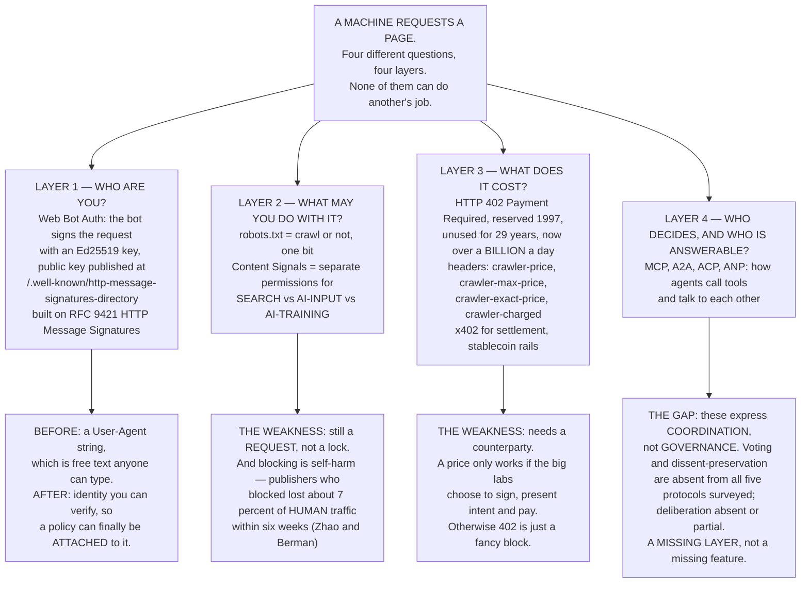
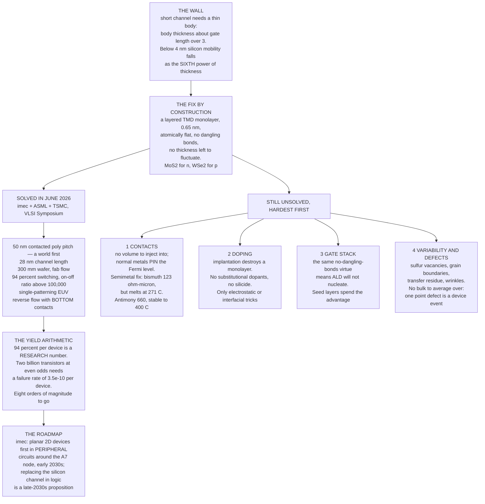
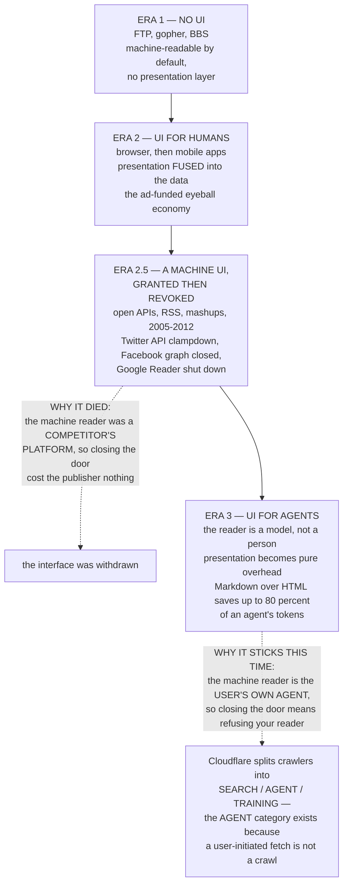
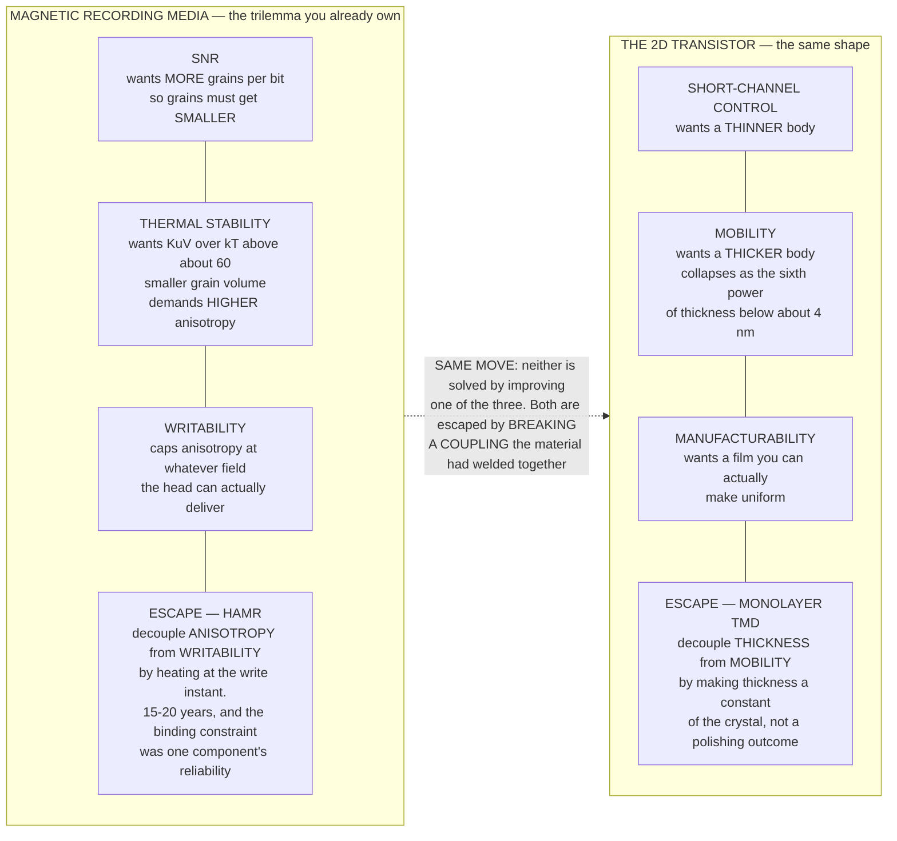

# Daily Reading — 2026-08-03  ✅ finalized

*A "National Geographic / Discovery" pair — one story from the **career** world (the web's plumbing and its economics), one from the **hobby** world (semiconductor physics and manufacturing). Not course material; the wider, stranger, more current world around what you do.*

**Today's two stories:**
1. 🤖💳 **The web stopped being mostly human, and grew a toll booth in response.** On **3 June 2026** Cloudflare's measurements crossed a line the internet had never crossed: **57.5% of HTML requests came from machines, 42.5% from people.** Matthew Prince had predicted the crossover for late 2027 at SXSW in March; it arrived eighteen months early. That is the headline, but the interesting part is what it broke. The web ran for thirty years on an unwritten bargain — *you may read my page, and in exchange you send me a reader* — enforced by nothing but a text file called `robots.txt` that is a **polite request, not a lock**. Cloudflare's own numbers show the bargain gone: in July 2025 one operator's crawlers were taking **38,066 pages for every visitor sent back**. So the industry is now doing something it has avoided since 1997: putting **cryptographic identity and a price** into the HTTP request itself. `402 Payment Required` — a status code reserved in the spec and left unused for **twenty-nine years** — is suddenly being emitted **over a billion times a day** on Cloudflare's network alone. And on **15 September 2026**, for new sites, the default flips from *allow* to *block*.
2. ⚛️🔬 **The transistor is quietly preparing to stop being made of silicon.** On **15 June 2026**, at the VLSI Symposium in Kyoto, imec, ASML and **TSMC** reported something that sounds modest and isn't: on a **300 mm production wafer**, complementary n- and p-channel transistors whose conducting channel is not silicon but a **single crystalline layer of molybdenum disulfide and tungsten diselenide — about 0.65 nanometres thick, three atoms** — at a **50 nm contacted poly pitch**, which is real leading-edge geometry. **94% of them switched correctly.** The reason this has to happen is a trap silicon cannot escape: to keep control of a very short channel you must make the channel body thinner than the channel is long, and below about 4 nm silicon's carrier mobility collapses roughly as $t^{6}$ — an atomic step on a 3 nm film is a 10% thickness variation. A monolayer crystal has **no thickness to fluctuate**. Meanwhile a Shanghai startup claims the **world's first 8-inch 2D-semiconductor pilot line** (16 July 2026), and a Fudan group has already run a **32-bit RISC-V processor made of 5,900 MoS₂ transistors**.

> **Why this pair.** Both are **substrate swaps under a system that is not allowed to stop** — and in both, the invention is finished and the *migration* is the whole story. That is now three readings in a row with the same shape (the post-quantum crypto migration was the last one), and it is worth noticing as a pattern rather than a coincidence: **at planetary scale, the hard problem is almost never the new primitive. It is changing a primitive inside an installed base that nobody can switch off.** What makes the pair instructive is that the two migrations are being *forced by completely different clocks.* Story 1 is being driven by **economics in months** — an incentive broke, money started flowing the wrong way, and the protocol layer is being rebuilt live, in production, by companies with quarterly targets. Story 2 is being driven by **physics over a decade** — nothing about the incentive changed, the material simply stopped working, and the fix needs a fab, a roadmap and about ten years. One last thing, and it is a genuinely first-hand data point for story 1: while assembling the sources for this reading, **three of them (Cloudflare Radar, EurekAlert and SSRN) returned `403 Forbidden` to an automated fetch while serving the same page happily to a browser.** The research for a story about the machine-readable web was partly obstructed by the machine-readable web's new immune system. That is not an anecdote — it is the mechanism, observed from the inside.

---

## 1. 🤖 The majority-machine web

🔗 **Start here:** [The crawl-to-click gap: Cloudflare data on AI bots, training, and referrals](https://blog.cloudflare.com/crawlers-click-ai-bots-training/) · [Bot traffic passes humans online — Cloudflare says agentic AI drove the 57.5% share](https://www.techtimes.com/articles/317877/20260605/bot-traffic-passes-humans-online-cloudflare-says-agentic-ai-drove-575-share.htm)
🔗 **The "why now":** [Cloudflare's new policy pushes AI companies to pay for publishers' content — TechCrunch (1 July 2026)](https://techcrunch.com/2026/07/01/cloudflares-new-policy-pushes-ai-companies-to-pay-for-publishers-content/) · [Announcing the Monetization Gateway: charge for any resource behind Cloudflare via x402 (1 July 2026)](https://blog.cloudflare.com/monetization-gateway/) · [Introducing the Agent Readiness score](https://blog.cloudflare.com/agent-readiness/)
🔗 **Go deeper:** [Introducing pay per crawl — the HTTP 402 mechanism in detail](https://blog.cloudflare.com/introducing-pay-per-crawl/) · [RFC 9421 — HTTP Message Signatures](https://datatracker.ietf.org/doc/html/rfc9421) · [Web Bot Auth (IETF draft)](https://datatracker.ietf.org/doc/draft-meunier-webbotauth-httpsig-protocol/) · [*Strategic Response of News Publishers to Generative AI* — Zhao & Berman](https://arxiv.org/abs/2512.24968)

*The shape of the change: the crowd is now mostly machines, each carrying a cryptographic seal that says who it is, and a gate has appeared where there used to be an open street. Find the human. — Illustration, generated locally (ComfyUI + Z-Image Turbo); a generic metaphor, no real place, system or text depicted.*

Image prompt (source of truth)

> A vast rain-slick nocturnal city plaza of glass server-like towers, filled with a dense silent crowd of faceless humanoid automata made of matte metal and glowing circuitry, each carrying a small bright glowing wax-seal medallion of light in one hand, all queueing through a single narrow illuminated turnstile gate that glows gold, while a handful of ordinary warm-lit human silhouettes are almost lost in the machine crowd, cinematic conceptual illustration, low wide dramatic angle, cold blue and teal palette with one warm gold accent at the gate, volumetric fog, highly detailed, atmospheric, no text, no words, no letters, no numbers, no logos, no signage

**First, what actually flipped — and what didn't.** "Bots are the majority" needs a unit before it means anything. Cloudflare's figure is a share of **HTML page requests** seen across its network, not of bytes, not of API calls, not of "the internet." Bots have out-numbered humans in *many* traffic measurements for years, and a large slice of the automated share is boring old furniture: search indexers, uptime monitors, RSS fetchers, security scanners. What changed in 2026 is **which** machines. Cloudflare puts **AI crawlers at roughly 20.3% of verified bot traffic** in May 2026, with AI-search bots adding about **6.5%** — and the fastest-growing category is not the crawler at all, it is the **agent**: a browser driven by a model, fetching a page *because a specific human asked a question thirty seconds ago*. HUMAN Security measured agentic traffic growing **7,851% year over year**. That category did not meaningfully exist in 2024, which is precisely why Prince's own forecast was eighteen months wrong.

**The bargain that broke, in one chart.** The web's economics were never written down, but they were real: a crawler took your page and paid you in attention. Cloudflare's **crawl-to-refer ratio** — pages crawled divided by referrals sent back — is the cleanest available measure of that exchange rate, and it shows the exchange rate has collapsed by five orders of magnitude *for some operators and not others*:

<!-- fig1 -->
<!-- PLOT:START -->

Plot source (matplotlib)

See [`images/03-the-majority-machine-web-and-the-atom-thin-transistor-2-plot.py`](images/03-the-majority-machine-web-and-the-atom-thin-transistor-2-plot.py). All six operators, both dates, one source and one unit: Cloudflare's published crawl-to-refer ratios from *The crawl-to-click gap* (29 August 2025).

<!-- PLOT:END -->

**The finding is the spread, not the villain.** Look at what separates the top of that chart from the bottom: it is not politeness, and it is not respect for `robots.txt`. It is **whether the operator runs a product that shows the user a link they click.** Google and DuckDuckGo sit near parity because a crawl exists to populate a result someone clicks through. Perplexity, which cites inline, sits two orders of magnitude better than the training crawlers. An operator whose product **answers in place** structurally cannot return traffic — there is no click to send. This is why "just make the AI companies behave" misdiagnoses the problem. The referral wasn't a courtesy that lapsed; it was a **by-product of a specific product shape**, and that product shape is being replaced. The same Cloudflare data shows the purpose mix shifting hard: in July 2025, **about 79% of AI crawling was for training** and only \~17% for search; by May 2026 the reported split was \~52% training, \~36% mixed, \~9% search-only. A read-once-and-answer-forever machine is a fundamentally different customer than an index.

**And here is the trap that makes this genuinely hard, not merely unfair.** The obvious defence is to block the crawlers in `robots.txt`. Hangcheng Zhao (Rutgers) and Ron Berman (Wharton) measured what actually happens when publishers do that, difference-in-differences across three independent traffic panels. Publishers who blocked LLM crawlers **lost about 7% of weekly traffic within six weeks** — **−7.4%** in SimilarWeb, **−6.9%** in Semrush, **−6.5%** in Comscore's *human* panel. The loss was concentrated in the **largest** publishers (top 50 by rank; the effect washes out below that) and it faded after roughly twenty weeks. Read that carefully, because it is not the result the intuition predicts: **blocking the machine readers cost you the human ones.** Once a meaningful share of people arrive by asking a model instead of typing a query, being absent from the model's reachable web is a distribution decision, not a licensing one. `robots.txt` turns out to be a lever that moves the wrong thing — you cannot use it to *charge*, only to *disappear*.

**So the stack is being rebuilt, and it is being rebuilt in the boring, load-bearing place: the HTTP request.** Three layers are appearing, and the useful discipline is keeping them apart, because each answers a different question and none of them can do another's job.

<!-- fig2 -->
<!-- DIAGRAM:START -->

Diagram source (Mermaid)

<!-- DIAGRAM:END -->

**Layer 1 — identity, and why it had to come first.** For thirty years a bot announced itself with a `User-Agent` string, which is free text: anyone can claim to be Googlebot, and plenty do. **Web Bot Auth** replaces the honour system with cryptography — the client signs each outbound request with an **Ed25519** key pair and publishes the public key at a well-known URL (`/.well-known/http-message-signatures-directory`), riding on **RFC 9421 HTTP Message Signatures**, which has been a Proposed Standard since February 2024 and was sitting there waiting for a use case. This is the unglamorous prerequisite for everything else: **you cannot attach a policy, a price, or a liability to an identity you cannot verify.** Note the IETF status honestly — the architecture draft has already expired once and been superseded, and this is still an individual submission, not a working-group product. The mechanism is real; the standard is not finished.

**Layer 2 — policy, which is where the good intentions live and the leverage doesn't.** `robots.txt` expresses one bit: crawl or don't. **Content Signals** extend that to distinguish *search* from *AI input* from *AI training* — which is the right vocabulary, since as the chart shows those are economically different acts. But the layer inherits the original sin: it is **advisory**. Cloudflare's own data says training-focused crawling "can be aggressive at times, often ignoring directives found in `robots.txt`." A preference file cannot bill anyone.

**Layer 3 — settlement, and the code that waited twenty-nine years.** `402 Payment Required` was reserved in the HTTP/1.1 specification in 1997 and marked, essentially, *for future use*. It is now the mechanism: a crawler requests a paid URL, gets **402** plus a `crawler-price` header, and retries with `crawler-exact-price` (or pre-commits with `crawler-max-price`) to indicate agreement; on success the response carries `crawler-charged`. Cloudflare acts as **merchant of record**, aggregating and distributing. As of 1 July 2026 this generalised from *pay per crawl* into a **Monetization Gateway** — per-request pricing for "any resource": pages, datasets, APIs, and notably **MCP tools** — settled over **x402**, an HTTP-native payment protocol Cloudflare and Coinbase put into a joint foundation in September 2025, with stablecoin rails and sub-second peer-to-peer settlement. **The number that makes the scale concrete: Cloudflare says sites on its network already emit over a billion HTTP 402 responses a day.** Almost all of that is refusal rather than commerce — but the plumbing is warm.

**Layer 4 — the layer that does not exist yet.** When a machine is not fetching a page but *doing something on your behalf*, identity and price are not sufficient. Somebody has to be answerable. A June 2026 survey by Kang and Diponegoro tested five agent-interoperability protocols — **MCP, A2A, ACP, ANP and ERC-8004** — against six governance dimensions borrowed from organisational theory (membership, deliberation, voting, dissent preservation, human escalation, audit and replay). The finding is stark: **voting and dissent preservation are absent from all five**, deliberation absent or at best partial. Their framing is the part worth keeping — this is *"a missing architectural layer above current interoperability standards, not a missing feature within them."* MCP tells an agent how to call a tool. Nothing in it can express *who authorised this, who objected, and what happens when a human needs to overrule it.*

**Why now, in dates.** **1 July 2026:** Cloudflare splits AI bots into **Search / Agent / Training** and announces that from **15 September 2026**, for newly onboarded domains, **Training and Agent crawlers are blocked by default on ad-supported pages** while Search stays allowed; existing customers are notified and can opt out beforehand. There is a sharp edge in the implementation worth knowing about: Cloudflare applies **the most restrictive rule to any multi-purpose crawler**, so a site that blocks Training also **blocks Googlebot** on ad-monetised pages — because Googlebot crawls for both. Meanwhile none of OpenAI, Anthropic, Google DeepMind or Meta has announced support for paying, which means for now the practical effect of the new machinery is mostly the *block*, not the *bill*.

> **The "huh, I didn't know that" file.** **First — the fix for a broken economic incentive turned out to be a twenty-nine-year-old status code.** `402` was reserved in 1997 by people who assumed the web would need micropayments, and then nothing needed it for three decades, because the ad-funded human-eyeball model worked. The moment the reader stopped being a human, the unused byte in the spec became load-bearing. Infrastructure hoards options like this; occasionally one gets cashed. **Second — `robots.txt` was never a security mechanism, and 2026 is when that stopped being a pedantic distinction.** It is a *request*, honoured by convention, with no identity behind it and no consequence attached. The entire new stack — signatures, content signals, 402, x402 — is what you have to build when you finally need the *enforceable* version of something you have relied on socially for thirty years. There is a general lesson in there about every convention-based control in your own systems. **Third — the agentic web is being designed for readers who don't want your HTML.** Cloudflare's Agent Readiness work notes that serving **Markdown via content negotiation** can cut an agent's token cost by **up to 80%** — your carefully built DOM is pure overhead to a model. And the adoption numbers are a reminder of how early this is: across 200,000 domains surveyed, MCP Server Cards and API catalogues together appeared on **fewer than 15 sites.** The traffic is already majority-machine; the *interface* for machines has essentially not been built.

---

## 2. ⚛️ Six atoms thick

🔗 **Start here:** [ASML, TSMC and imec bring industry-ready 2D-material transistors closer with breakthrough 300 mm integration (15 June 2026)](https://www.imec-int.com/en/press/asml-tsmc-and-imec-bring-industry-ready-2d-material-transistors-closer-breakthrough-300mm) · [Post-silicon era gets closer as industry giants crack the 2D transistor scaling bottleneck — Tom's Hardware](https://www.tomshardware.com/tech-industry/semiconductors/imec-asml-and-tsmc-build-complementary-2d-material-transistors-at-50nm-pitch-on-a-300mm-wafer)
🔗 **The "why now":** [ASML, TSMC and imec present 300 mm integration route for industry-ready 2D-material transistors — Semiconductor Today](https://www.semiconductor-today.com/news_items/2026/jun/imec-asml-tsmc-220626.shtml) · [China startup Yuanjiwei claims world's first 2D-semiconductor pilot line (16 July 2026)](https://www.electronicsweekly.com/news/business/china-startup-clains-worlds-first-2d-semiconductor-pilot-line-2026-07/) · [*Kinetic acceleration of MoS₂ growth by oxy-metalorganic chemical vapor deposition* — Science (30 Jan 2026)](https://www.science.org/doi/10.1126/science.aec7259)
🔗 **Go deeper:** [Introducing 2D-material based devices in the logic scaling roadmap — imec](https://www.imec-int.com/en/articles/introducing-2d-material-based-devices-logic-scaling-roadmap) · [*Ultralow contact resistance between semimetal and monolayer semiconductors* — Nature (2021)](https://www.nature.com/articles/s41586-021-03472-9) · [*A RISC-V 32-bit microprocessor based on two-dimensional semiconductors* — Nature (Apr 2025)](https://www.nature.com/articles/s41586-025-08759-9) · [imec's 2026 roadmap: A3 by 2038 — Tom's Hardware](https://www.tomshardware.com/tech-industry/semiconductors/imecs-2026-roadmap-details-0-3nm-nodes-by-2038-cfet-transistors-become-viable-at-0-7nm-company-redefines-moores-law-as-cell-sizes-gain-importance-for-density)

*The object at the centre of the story: a crystal one molecule thick, handled by machinery built for solid slabs. Everything hard about 2D transistors is in that mismatch. — Illustration, generated locally (ComfyUI + Z-Image Turbo); a generic conceptual scene, not any real tool, wafer or process.*

Image prompt (source of truth)

> An enormous mirror-polished circular silicon wafer lying horizontally in a dim cleanroom, and hovering just above its centre a single impossibly thin transparent crystalline sheet the thickness of a soap bubble, held at its edges by two slender robotic manipulators, the sheet iridescent and showing a faint hexagonal atomic lattice pattern where light catches it, rainbow thin-film interference shimmer, cinematic macro conceptual illustration, deep blacks with cyan violet and gold interference colours, shallow depth of field, sense of something unbelievably fragile being handled by industrial machinery, highly detailed, atmospheric, no text, no words, no letters, no numbers, no people

**Why the channel has to get thinner, and why that is a trap.** A transistor is a switch whose gate must dominate the channel. As the gate gets shorter, the source and drain start to compete with it for control of the same electrons — the family of short-channel effects — and the standard defence is to shrink the conducting body so the gate is never far from any carrier. The scale over which the drain's influence leaks in is the device's **natural length**,

$$\lambda = \sqrt{\frac{\varepsilon_{s}}{\varepsilon_{\text{ox}}}\thinspace t_{\text{ox}}\thinspace t_{\text{body}}}$$

and you need the gate length to be several $\lambda$ — which, once the oxide can get no thinner, leaves exactly one knob: $t_{\text{body}}$. The rule of thumb the industry has run on for two decades is $t_{\text{body}} \approx L_{g}/3$. Push toward a 10 nm gate and you are asking for a body of 3 nm or less, and that is where silicon betrays you. A 3 nm silicon film is squeezed between two imperfect interfaces, and a **single atomic step is a 10% thickness variation**; surface-roughness and thickness-fluctuation scattering take over and the effective mobility falls, in the measured and modelled ultrathin-body regime, roughly as

$$\mu \propto t_{\text{body}}^{6}$$

which is one of the most unforgiving exponents in device physics. Thin enough to control is too thin to conduct.

<!-- fig3 -->
<!-- PLOT:START -->

Plot source (matplotlib)

See [`images/03-the-majority-machine-web-and-the-atom-thin-transistor-4-plot.py`](images/03-the-majority-machine-web-and-the-atom-thin-transistor-4-plot.py). **Read the honesty note:** the silicon curve is the normalised $t^{6}$ ultrathin-body scaling law with an illustrative thick-body anchor — its *shape* is the claim, not its absolute values. The 2D points are measurements, sourced in the script's docstring.

<!-- PLOT:END -->

**The escape is structural, not clever — which is exactly why it is credible.** A transition-metal dichalcogenide such as MoS₂ or WSe₂ is a **layered** crystal: within a layer the bonds are strong and covalent, between layers they are weak van der Waals. So a monolayer is not a thin slice cut from a thick crystal — it is a **complete, self-terminated object**, about **0.65 nm** thick, atomically flat by construction, with no dangling bonds and no thickness left to fluctuate. It does not have a roughness problem because it does not have a *surface* in the silicon sense. Mobility is then set by the material and its environment, not by how thin you dared to make it. That is the same class of argument as the strongest case in the last reading: **a substrate match rather than a trick.**

**What the June 2026 result actually is, and why the number to look at is 50 nm and not 0.65 nm.** Making a good 2D transistor in a lab is fifteen years old. Making one at a **pitch** is new. **Contacted poly pitch (CPP)** is the distance from one gate to the next including its source/drain contacts, and it is the honest density metric, because it is where 2D devices have always cheated: you can demonstrate a beautiful 20 nm channel and then hide a huge contact next to it to keep the resistance survivable, which buys you nothing at the chip level. The imec/ASML/TSMC work reports:

| What | Number | Why it matters |
|---|---|---|
| contacted poly pitch | **50 nm** | a world first for complementary 2D; within range of leading-edge silicon |
| channel length | down to **28 nm** | scaled, not a showcase long-channel device |
| wafer | **300 mm** | production diameter, in a fab flow, not a coupon |
| n-channel material | **MoS₂** | electrons |
| p-channel material | **WSe₂ / WS₂** | holes — a *complementary* pair, so you can build logic |
| working devices | **94%** | with on/off current ratio above $10^{5}$ |
| lithography | **single-patterning EUV** | named as the critical enabler |
| flow | reverse TFT, **bottom contacts** | TMD transferred onto pre-patterned tungsten-filled trenches, gate deposited over the top |

Gouri Sankar Kar of imec put the point precisely: *"For the first time, we achieved 50 nm CPP without affecting the performance of the 2D nFETs and pFETs."* Both polarities turn off at zero gate voltage with matched threshold voltages, and the WSe₂ p-channel devices came in close to lab-record levels. The presence of **TSMC** and **ASML** on that author list is not decoration — it is the difference between a materials result and a manufacturing roadmap item.

**Now the honest part, ranked — because "94% work" is a research number that would be a catastrophe in a fab.** Take the arithmetic seriously. If each transistor independently works with probability $p$, a chip of $N$ transistors works with probability $p^{N}$. For a modern die of two billion transistors to have a coin-flip chance, you need

$$1 - p = \frac{\ln 2}{N} \approx 3.5 \times 10^{-10} \quad (N = 2 \times 10^{9})$$

so a per-device failure rate around **three in ten billion** — against today's **six in a hundred**. That is **eight orders of magnitude** of yield engineering, and no amount of redundancy or clever design closes a gap that size on its own. This is why the roadmap talks about a decade. The remaining walls, in rough order of how hard they look:

1. **Contacts — the dominant problem, and it is physics, not process.** A monolayer has almost no volume to carry current into, and depositing a normal metal on it pins the Fermi level through metal-induced gap states, producing a Schottky barrier you did not ask for. The best-known fix is delightful: contact it with a **semimetal** whose density of states near the Fermi level is nearly zero, so there is nothing to pin against. Bismuth on monolayer MoS₂ gave an ohmic contact at **123 ohm-micrometres** with effectively zero barrier — a landmark 2021 *Nature* result, co-authored with TSMC. But bismuth melts at 271 °C, which is a problem in a flow with later thermal steps; antimony is more thermally robust to about 400 °C at roughly **660 ohm-micrometres**. Both are still well above what a leading-edge node wants.
2. **Doping — you cannot implant a sheet one atom thick.** Silicon technology is built on ion implantation, and firing ions into a monolayer destroys the very transport you are trying to create. There is no substitutional doping recipe and no silicide to form, because van der Waals surfaces do not react the way silicon does. The workarounds are all *electrostatic or interfacial* — charge transfer from an adjacent layer, remote doping in the dielectric — which means the doping profile becomes someone else's film's problem.
3. **The gate stack — the same virtue, inverted.** The reason the channel is perfect is that its surface has no dangling bonds. The reason a gate dielectric will not grow on it is *also* that its surface has no dangling bonds: atomic layer deposition needs reactive sites to nucleate, and a pristine TMD offers none, so the oxide beads up instead of forming a uniform sub-nanometre film. Every fix (seed layers, buffer layers, oxidised metals) puts something between the gate and the channel and spends part of the electrostatic advantage you came for.
4. **Variability and defects — the part closest to your old job.** A monolayer's electrical behaviour is set by things that are, in a real film, *countable*: sulfur vacancies, grain boundaries from the growth, wrinkles and polymer residue from the transfer, adsorbates. There is no bulk to average over — a single point defect is a device-level event. This is a metrology and failure-analysis problem before it is a device problem, and it is the least glamorous and most likely rate-limiting item on the list.

<!-- fig4 -->
<!-- DIAGRAM:START -->

Diagram source (Mermaid)

<!-- DIAGRAM:END -->

**Where this sits on the roadmap — and note the shape of the insertion.** imec is not proposing to replace the silicon channel in a CPU next decade. Its plan puts planar 2D devices **first into peripheral circuits** — low-dropout regulators, power switches — around the **A7** generation in the early 2030s, widening later under the "CMOS 2.0" heterogeneous-integration framing, with 2D channels displacing silicon in the CFET architecture only in the **late 2030s** (its 2026 roadmap runs to A3 in 2038). That is a very familiar migration pattern: **the new material enters through the door where the requirements are loosest, and earns its way toward the hot path.** Worth also noticing that imec has begun redefining the density metric away from transistor dimensions toward **cell size** — when the channel stops shrinking, density has to come from somewhere else.

**Meanwhile, the field is moving faster than the roadmap in the places where "good enough" is allowed.** Three items from the last eighteen months, and the pattern across them is that 2D electronics is escaping the single-device paper:

- **A working processor.** In April 2025 a Fudan University team published **WUJI** in *Nature*: a **32-bit RISC-V** microprocessor built from about **5,900 MoS₂ transistors**, with a self-developed standard-cell library of 25 logic cells including flip-flops. The previous record for a functional 2D integrated circuit was **115 transistors**. That is not an incremental step, it is a jump of nearly two orders of magnitude — and it is what a *design* discipline, not a device discipline, produces. The same group followed with the first wafer-scale **2D FPGA** (\~4,000 transistors, 4-inch MoS₂ on sapphire) in *National Science Review* in late 2025.
- **Material at wafer scale, by a real deposition route.** A Chinese collaboration reported in *Science* on **30 January 2026** an **oxy-MOCVD** growth chemistry — oxygen participating in the precursor pre-reaction — that yields **6-inch single-crystal MoS₂** with large domains, no carbon contamination, average mobility above **100** and a best device at **123 cm²/V/s**, demonstrated out to 150 mm. Growth-and-transfer has been the field's dirtiest secret; industrial-style MOCVD closing on lab-CVD quality is a bigger deal than any single device.
- **And someone is building a fab for it.** On **16 July 2026** the Shanghai startup **Yuanjiwei** claimed the world's first **8-inch 2D-semiconductor pilot line**, released version 0.1 of a PDK, and opened tape-out services — targeting performance comparable to a 90 nm silicon node by end-2026 and, remarkably, a fully domestic **5 nm-equivalent process by 2029 without EUV**. Treat the timeline with the scepticism any pre-revenue claim deserves. Treat the *existence of a PDK* seriously: a process design kit means someone believes third parties should design against this.

> **The "huh, I didn't know that" file.** **First — the same property that makes the channel perfect makes the rest of the transistor nearly impossible.** No dangling bonds means no roughness scattering, and it also means no ALD nucleation, no substitutional doping, no silicide, and no chemistry to bond a contact. It is rare to find an engineering trade-off this cleanly single-sourced: one physical fact, buying the thing you need and blocking three of the things you also need. The whole 2D programme is essentially the project of *keeping the virtue while defeating its consequences.* **Second — the winning contact material is chosen for what it does NOT have.** Bismuth works not because it conducts especially well but because it has almost **no electronic states at the Fermi level**, so there is nothing available to pin the barrier against. The engineering move is to contact your semiconductor with a material selected for its *absence* of the property you would naively want more of. **Third — the last two decades of "the end of Moore's law" were about lithography, and this one is not.** ASML's High-NA EUV is on schedule and IBM has shown patterning capability below the 2 nm node; the industry can *print* smaller than it can usefully *switch*. The binding constraint has migrated from optics to **materials and interfaces** — which is why the news is coming from growth chemistry, contact metallurgy and defect metrology rather than from lens makers. If your instinct is that the interesting problems are now in materials characterisation and failure analysis at the atomic scale, the roadmap agrees with you.

---

## What we worked out — the thread you drove (read this first on review)

Story 1 took the whole session. Story 2 landed as a read — *"I roughly understand the concept"* — and then produced the more consequential of the two corrections: **a background fix that re-aims how this material should have been pitched in the first place.**

### A. Story 1 — your four-claim thesis, and where it splits

You didn't ask a question about the reading. You returned a *model* of where this ends up, in four parts: **(1)** humans have taken information off the internet through three interface eras — FTP and BBS with almost no UI, then browsers and mobile apps as **UI for humans**, and now **UI for agents**; **(2)** providers are fighting to separate humans from bots and that fight is unwinnable — *if I ask Claude to drive a browser and read screenshots, or eventually sit a robot in front of the keyboard, how can they tell?* — so era 3 wins; **(3)** that is **good** for providers, because attention stops being capped by the 24-hour day, so less popular apps finally get users; **(4)** it is **bad** because page ads stop working — but ads won't die, they'll migrate into the **token providers' pipeline**: watch five minutes of ads, get a million tokens.

**A1. The arc is right — and it is missing a beat.** There was an **era 2.5**: the open-API / RSS / mashup web of roughly 2005–2012. That *was* a machine interface to the web, and it was **deliberately revoked** — Twitter's API clampdown, Facebook closing the graph, Google Reader's shutdown. Machine-readable access has been granted and taken back once already, which turns "era 3 is the future" from a prediction into a question: *why does it stick this time?* It has an answer, and the answer is the strongest support for your thesis. Last time the machine reader was **a competitor's platform** — a rival app rendering your content — so closing the interface was pure defence at no cost to your readers. This time the machine reader is **the user's own agent**, so closing it means refusing the reader. **The industry has already conceded your point in its taxonomy:** the reason Cloudflare's new split is *Search / Agent / Training* rather than *human / bot* is that a user-initiated agent fetch had to be priced differently from a crawl. The Agent category exists because the distinction is real.

The axis underneath all three eras is also not "UI" — it is **who pays for the impedance mismatch**. FTP: machine-readable, no presentation layer. The web: presentation fused into the data. Era 3: the presentation layer becomes pure overhead — which is exactly why serving Markdown by content negotiation saves an agent up to 80% of its tokens. Your DOM became a tax.

<!-- fig5 -->
<!-- DIAGRAM:START -->

Diagram source (Mermaid)

<!-- DIAGRAM:END -->

**A2. The one real correction, and it is a *decoupling*: "detection fails" is not "blocking fails."** Your argument bundled three claims that come apart:

- **(a) Behavioural detection of a determined agent will fail — TRUE**, and the robot-at-the-keyboard is the correct reductio. This is the **client-side trust problem**: you cannot verify anything about a client you do not control. It is the same reason game anti-cheat, DRM and CAPTCHA all lost — models now solve CAPTCHAs better than people do.
- **(b) Therefore blocking fails — DOES NOT FOLLOW.** Nobody is trying to detect bots. Two moves route around detection entirely. **Remote attestation** is the technical answer to *"how can they tell?"* — hardware-backed proof that a session runs on a genuine unmodified device (Apple Private Access Tokens, Android Play Integrity, Google's Web Environment Integrity proposal). It never detects your agent; it refuses to serve anything that cannot attest. Note what actually stopped it: **WEI was withdrawn in 2023 after public and antitrust backlash, not because it failed.** So the honest answer to your question is *"technically yes — and the ecosystem refused to allow it."* **That relocates your question from engineering to governance**, which is the same relocation that keeps showing up on institutional-plumbing questions. The second move is **identity as a carrot**: Web Bot Auth is voluntary, and the bot signs because signing buys access and priority while evading buys throttling — **incentive-compatible disclosure, not detection.**
- **(c) The real battlefield is cost asymmetry.** Your robot argument proves too much: it also proves you cannot stop a *human* paid to scrape. The web never could stop determined humans — it stopped **cheap at scale**. Screenshot-driving a browser already costs 10–100× a DOM read in tokens and latency; a physical robot costs a device per concurrent session. Push the automated path's marginal cost up to the marginal value of the content and the operator would rather pay the toll than route around it.

> **Keeper: blocking is the negotiating position; pricing is the endgame.** The tell is that the 15 September default flip landed while **no major lab has agreed to pay** — a wall that nobody has agreed to climb is a bargaining move.

**A3. The claim that does not hold — and the version of it that does.** Agents relax the **reading** constraint. They do not touch the **deciding** constraint, and that was always the scarce one. An agent that reads 500 pages and returns one answer means 500 sites were read and *one* was acted on; aggregation is an argmax. So agentic mediation **diffuses crawl share and concentrates outcome share** — the opposite of your prediction on the payoff side. The measurements agree so far: AI answers cite roughly **3–6 domains** where a search page surfaces about ten, the top 15 domains take about **68%** of citations, the top 1% about **47%**, and Reddit alone is around 40% of multi-engine citation frequency. That is *more* concentrated than PageRank ever was. (Provenance caveat: these are SEO-industry studies, much weaker than the Cloudflare network data — read them as directional, not as measurements of the same quality as the crawl-to-refer chart.)

**The version that survives is better than the original.** What agents genuinely collapse is **discovery cost**, not attention. A niche site that ranked fortieth was invisible; if it is the *best* answer to a narrow question it is now reachable. So the tail gains **eligibility, not traffic** — and the competitive axis flips from capturing time (SEO, brand, sticky UI) to **being the definitive source on a narrow thing**. Retrievability and specificity replace stickiness.

And the two halves of your thesis turn out to be **one variable seen twice**: if every human's agent reads 500 pages per question, serving cost rises about 500× while the monetizable event stays at one. **The ad model did not break because eyeballs disappeared — it broke because the denominator exploded.** Your good side *is* your bad side.

**A4. Ads — directionally right, already shipped, wrong mechanism.** The prediction is correct and partly cashed: OpenAI began testing ads in ChatGPT on **9 February 2026** on the Free and Go tiers, reportedly reaching about **100 million dollars annualized** within months, with a self-serve Ads Manager (CPC/CPM bidding) by May; Google has confirmed ads in Gemini for 2026; Microsoft already runs sponsored answers in Copilot. Ads did land in the inference layer, exactly as you said.

The **barter** form is the part that does not clear, and it is worth doing the arithmetic rather than asserting it:

<!-- fig6 -->
<!-- PLOT:START -->

Plot source (matplotlib)

See [`images/03-the-majority-machine-web-and-the-atom-thin-transistor-5-plot.py`](images/03-the-majority-machine-web-and-the-atom-thin-transistor-5-plot.py). Supply side: rewarded-video eCPM of $15–40 in tier-1 markets, 30 s per completed view. Demand side: published list prices blended 85% input / 15% output, the shape of consumer assistant traffic. Both sides are list-rate estimates, not any provider's real unit economics — the finding is the order of magnitude, not the third digit.

<!-- PLOT:END -->

**Why the barter never needed to clear — and this is the part worth keeping:** **ad value tracks intent, and the highest-intent moment is inside the answer, not before it.** Rewarded video is worth cents because generic attention is cheap; a recommendation slot in a commercial-intent answer monetizes like search, in dollars per click. So the money arrived in the pipeline exactly where you predicted, but it attached itself to **the recommendation, not the compute**. Today's implementation is still an honest labelled unit below the answer; the structural pressure runs toward paying to *be the cited source*, which recreates SEO as GEO with a much worse property — the ad sits inside the artifact the user has already delegated their decision to. **Perplexity is the datum on that ceiling:** it tested sponsored answers through 2024–25, stopped taking new advertisers in October 2025, and **exited advertising entirely in February 2026**, explicitly on trust grounds — *"the challenge with ads is that a user would just start doubting everything."* Someone ran your experiment and concluded the trust cost exceeded the revenue.

> **The synthesis to keep from story 1.** Your two "bad side" outcomes are not alternatives, they are **complements**: ads at the inference layer *and* micropayments at the content layer, because **value is now captured at a different layer than it is created** — the model monetizes an answer assembled from pages it did not pay for. That gap is precisely what the whole `402` / x402 stack exists to bridge. Whether it succeeds is open; that it is needed is not.

### B. Story 2 — the read landed, and the background correction is the keeper

You confirmed the concept landed and then corrected something more important: **your decade of materials and failure analysis was in magnetic-disk (HDD recording media) manufacturing, not silicon semiconductor fab.** Every earlier "his semiconductor world" hook in this repo — including the one in reading #12 — was aimed at the wrong domain. The canonical record is fixed. What matters here is that the *correct* domain is a **better** fit for this story, in three specific ways.

**B1. It is the same trilemma.** Your world: SNR wants more grains per bit, so grains must get smaller; thermal stability wants $K_{u} V / k_{B} T$ above about 60, so smaller grain volume demands higher anisotropy; writability caps anisotropy at whatever field the head can deliver. Pick two. The transistor version: short-channel control wants a thinner body; mobility wants a thicker one, collapsing as $\mu \propto t^{6}$ below about 4 nm; manufacturability wants a film you can actually make uniform. Pick two. **And both escapes have the same structure — not "improve one of the three" but *break a coupling the material had welded together*.** HAMR decouples anisotropy from writability by making anisotropy momentarily temperature-dependent. A monolayer decouples thickness from mobility by making thickness a constant of the crystal instead of a polishing outcome. That is the reason the 2D route is credible where "make silicon smoother" is not.

**B2. Grains-per-feature is your problem, restated in a different material.** A 28 nm channel at 50 nm CPP is **one to a few grains across** a CVD-grown monolayer. You already know what happens when a feature shrinks to a few grains: the mean stops mattering, the *distribution* takes over, the tail sets the failure rate, and boundary bridging correlates neighbours that were supposed to be independent. Same statistics, different physics. This reframes which 2026 result matters most: **the 6-inch single-crystal MoS₂ growth is a bigger deal than the 123 cm²/V·s headline**, because it *deletes* the grain-boundary random variable rather than tightening its distribution — the analogue of leaving granular media behind entirely, not of squeezing another point out of σ/D.

**B3. HAMR is the insertion precedent.** Roughly fifteen to twenty years from concept to volume, in which the binding constraint turned out to be **one component's reliability** (the near-field transducer) and the interfaces around it — not the headline physics, which worked early. That is the honest template for imec's A7-and-beyond timeline, and you lived through it.

**B4. The correction to my own ranking — and it is a decoupling, not a re-rank.** The section ranked contacts first and variability fourth. Your lens says variability sets the schedule, and that is right, but the fix is not to reorder the list: **I fused two different questions into one ranking.**

- **Contacts set whether the device is *good enough*** — a performance ceiling. At roughly 660 Ω·μm, drive current misses target no matter how uniform the film is.
- **Grain-boundary variability sets whether it is *manufacturable, and when*** — a yield and schedule variable. It is also what the yield arithmetic was actually about: $1 - p \approx 3.5 \times 10^{-10}$ is a statement about the tail of a distribution, not about a mean.

Those belong in two columns, not one ordered list.

<!-- fig7 -->
<!-- DIAGRAM:START -->

Diagram source (Mermaid)

<!-- DIAGRAM:END -->

> **Where we landed.** Story 1 is the half of this reading that actually touches what you build: the web is being re-plumbed to charge for machine reads, and the load-bearing question is not whether sites can tell a bot from a human — they can't, and increasingly they aren't trying — but **at what price the machine path becomes cheaper to pay for than to evade.** Story 2 is the half that touches where you came from, and the transfer is sharper than the one I originally reached for: **your discipline was never "semiconductors," it was thin films whose device statistics are set by grain microstructure — which is exactly the variable that will decide when 2D transistors ship.** The unifying line across both halves is the one the pair was chosen for and the session confirmed twice: **the invention is finished in both stories; the migration is the entire problem.** In story 1 the migration is priced in months by economics, in story 2 in a decade by physics — and in both, the thing that decides the schedule is not the headline result but the least glamorous constraint in the stack.

---

## Key terms (English · 大陆 简体 · 台灣 繁體)

| English | 大陆 (简体) | 台灣 (繁體) | Note |
|---|---|---|---|
| web crawler | 网络爬虫 | 網路爬蟲 | ⚠ 网络 vs 網路 |
| bot | 机器人 / 爬虫程序 | 機器人 / 網路機器人 | script mostly |
| agent (AI) | 智能体 / 代理 | 智慧代理 / 代理程式 | ⚠ genuinely different word (智能体 is 大陆-specific) |
| protocol | 协议 | 協定 / 協議 | ⚠ 大陆 almost always 协议; 台灣 often 協定 |
| referral traffic | 引荐流量 | 推薦流量 / 導流 | ⚠ genuinely different word |
| digital signature | 数字签名 | 數位簽章 | ⚠ 数字 vs 數位, 签名 vs 簽章 |
| key pair | 密钥对 | 金鑰對 | ⚠ 密钥 vs 金鑰 |
| authentication | 身份验证 | 身分驗證 | ⚠ 身份 vs 身分 |
| micropayment | 微支付 | 微支付 / 小額支付 | ⚠ 台灣 prefers 小額支付 |
| stablecoin | 稳定币 | 穩定幣 | script only |
| settlement (payment) | 结算 | 結算 / 清算 | script mostly |
| governance | 治理 | 治理 | same |
| audit trail | 审计日志 | 稽核紀錄 | ⚠ 审计 vs 稽核 |
| transistor | 晶体管 | 電晶體 | ⚠ genuinely different word |
| semiconductor | 半导体 | 半導體 | script only |
| two-dimensional material | 二维材料 | 二維材料 | script only |
| monolayer | 单层 | 單層 | script only |
| molybdenum disulfide | 二硫化钼 | 二硫化鉬 | script only |
| carrier mobility | 载流子迁移率 | 載子遷移率 | ⚠ 载流子 vs 載子 |
| channel (of a FET) | 沟道 | 通道 | ⚠ genuinely different word |
| gate (of a FET) | 栅极 | 閘極 | ⚠ genuinely different word |
| gate dielectric / gate stack | 栅介质 / 栅叠层 | 閘極介電層 | ⚠ 栅 vs 閘 |
| short-channel effect | 短沟道效应 | 短通道效應 | ⚠ follows 沟道/通道 |
| contact resistance | 接触电阻 | 接觸電阻 | script only |
| Schottky barrier | 肖特基势垒 | 蕭特基能障 | ⚠ 势垒 vs 能障, and 肖 vs 蕭 |
| doping | 掺杂 | 摻雜 | script only |
| ion implantation | 离子注入 | 離子佈植 | ⚠ genuinely different word (注入 vs 佈植) |
| atomic layer deposition | 原子层沉积 | 原子層沉積 | script only |
| lithography | 光刻 | 微影 | ⚠ genuinely different word |
| wafer | 晶圆 | 晶圓 | script only |
| yield | 良率 / 成品率 | 良率 | script mostly |
| defect / vacancy | 缺陷 / 空位 | 缺陷 / 空缺 | ⚠ 空位 vs 空缺 |
| process node | 工艺节点 | 製程節點 | ⚠ genuinely different word (工艺 vs 製程) |
| foundry | 代工厂 | 晶圓代工廠 | ⚠ phrasing differs |
| grain boundary | 晶界 | 晶界 | same |
| crystal grain | 晶粒 | 晶粒 | same |
| hard disk drive | 硬盘 | 硬碟 | ⚠ genuinely different word |
| magnetic recording media | 磁记录介质 | 磁記錄媒體 | ⚠ 介质 vs 媒體 |
| sputtering (deposition) | 溅射 | 濺鍍 | ⚠ genuinely different word |
| thin film | 薄膜 | 薄膜 | same |
| anisotropy | 各向异性 | 異向性 | ⚠ genuinely different word |
| superparamagnetic limit | 超顺磁极限 | 超順磁極限 | script only |
| statistical distribution | 分布 | 分佈 | script only |
| remote attestation | 远程证明 | 遠端認證 | ⚠ 远程 vs 遠端, 证明 vs 認證 |
| long tail | 长尾 | 長尾 | script only |
| subscription | 订阅 | 訂閱 | script only |
| advertisement | 广告 | 廣告 | script only |

---

## Sources
- [The crawl-to-click gap: Cloudflare data on AI bots, training, and referrals — The Cloudflare Blog (29 Aug 2025)](https://blog.cloudflare.com/crawlers-click-ai-bots-training/)
- [A deeper look at AI crawlers: breaking down traffic by purpose and industry — The Cloudflare Blog](https://blog.cloudflare.com/ai-crawler-traffic-by-purpose-and-industry/)
- [Bot traffic passes humans online: Cloudflare says agentic AI drove 57.5% share — TechTimes (5 Jun 2026)](https://www.techtimes.com/articles/317877/20260605/bot-traffic-passes-humans-online-cloudflare-says-agentic-ai-drove-575-share.htm)
- [Cloudflare's new policy pushes AI companies to pay for publishers' content — TechCrunch (1 Jul 2026)](https://techcrunch.com/2026/07/01/cloudflares-new-policy-pushes-ai-companies-to-pay-for-publishers-content/)
- [Announcing the Monetization Gateway: charge for any resource behind Cloudflare via x402 (1 Jul 2026)](https://blog.cloudflare.com/monetization-gateway/)
- [Introducing pay per crawl: enabling content owners to charge AI crawlers for access](https://blog.cloudflare.com/introducing-pay-per-crawl/)
- [Launching the x402 Foundation with Coinbase, and support for x402 transactions](https://blog.cloudflare.com/x402/)
- [Your site, your rules: new AI traffic options for all customers — The Cloudflare Blog](https://blog.cloudflare.com/content-independence-day-ai-options/)
- [Introducing the Agent Readiness score — The Cloudflare Blog](https://blog.cloudflare.com/agent-readiness/)
- [RFC 9421 — HTTP Message Signatures (IETF, Feb 2024)](https://datatracker.ietf.org/doc/html/rfc9421)
- [Web Bot Auth: HTTP message signatures protocol (IETF draft)](https://datatracker.ietf.org/doc/draft-meunier-webbotauth-httpsig-protocol/)
- [RFC 9110 §15.5.3 — 402 Payment Required](https://www.rfc-editor.org/rfc/rfc9110.html#name-402-payment-required)
- [*Strategic Response of News Publishers to Generative AI* — Zhao (Rutgers) & Berman (Wharton), arXiv 2512.24968](https://arxiv.org/abs/2512.24968)
- [*Governance Gaps in Agent Interoperability Protocols: What MCP, A2A, and ACP Cannot Express* — Kang & Diponegoro, arXiv 2606.31498](https://arxiv.org/abs/2606.31498)
- [AI crawler and bot traffic statistics 2026 — a compiled data reference](https://www.digitalapplied.com/blog/ai-crawler-bot-traffic-statistics-2026-data-reference)
- [ASML, TSMC and imec bring industry-ready 2D-material transistors closer with breakthrough 300 mm integration (15 Jun 2026)](https://www.imec-int.com/en/press/asml-tsmc-and-imec-bring-industry-ready-2d-material-transistors-closer-breakthrough-300mm)
- [ASML, TSMC and imec present 300 mm integration route for industry-ready 2D-material transistors — Semiconductor Today](https://www.semiconductor-today.com/news_items/2026/jun/imec-asml-tsmc-220626.shtml)
- [Post-silicon era gets closer as industry giants crack the 2D transistor scaling bottleneck — Tom's Hardware](https://www.tomshardware.com/tech-industry/semiconductors/imec-asml-and-tsmc-build-complementary-2d-material-transistors-at-50nm-pitch-on-a-300mm-wafer)
- [ASML, TSMC and imec achieve 300 mm integration of 2D-material transistors with 50 nm pitch — TechPowerUp](https://www.techpowerup.com/349987/asml-tsmc-and-imec-achieve-300-mm-integration-of-2d-material-transistors-with-50-nm-pitch)
- [Introducing 2D-material based devices in the logic scaling roadmap — imec](https://www.imec-int.com/en/articles/introducing-2d-material-based-devices-logic-scaling-roadmap)
- [imec's 2026 roadmap details 0.3 nm-class nodes by 2038 — Tom's Hardware](https://www.tomshardware.com/tech-industry/semiconductors/imecs-2026-roadmap-details-0-3nm-nodes-by-2038-cfet-transistors-become-viable-at-0-7nm-company-redefines-moores-law-as-cell-sizes-gain-importance-for-density)
- [imec semiconductor technology roadmap: CFETs in 2033 — IEEE Spectrum](https://spectrum.ieee.org/semiconductor-technology-roadmap)
- [*Ultralow contact resistance between semimetal and monolayer semiconductors* — Shen et al., *Nature* (2021)](https://www.nature.com/articles/s41586-021-03472-9)
- [*A RISC-V 32-bit microprocessor based on two-dimensional semiconductors* — *Nature* (2 Apr 2025)](https://www.nature.com/articles/s41586-025-08759-9)
- [*A field-programmable gate array based on wafer-scale 2D semiconductor* — *National Science Review* (2025)](https://academic.oup.com/nsr/article/doi/10.1093/nsr/nwaf458/8348617)
- [*Kinetic acceleration of MoS₂ growth by oxy-metalorganic chemical vapor deposition* — *Science* (30 Jan 2026)](https://www.science.org/doi/10.1126/science.aec7259)
- [China startup Yuanjiwei claims world's first 2D-semiconductor pilot line — Electronics Weekly (16 Jul 2026)](https://www.electronicsweekly.com/news/business/china-startup-clains-worlds-first-2d-semiconductor-pilot-line-2026-07/)
- [IBM demonstrates High-NA EUV process capability on track for insertion below 2 nm — IBM Research](https://research.ibm.com/blog/spie-2026-below-2-nm)
- [*The 2D Materials Roadmap* — arXiv 2503.22476](https://arxiv.org/abs/2503.22476)

**Added during the Q&A (the machine-web thesis, the ad arithmetic, and the HDD ↔ 2D bridge):**
- [Eliminating CAPTCHAs on iPhones and Macs using a new standard — Cloudflare on Private Access Tokens](https://blog.cloudflare.com/eliminating-captchas-on-iphones-and-macs-using-new-standard/)
- [Web Environment Integrity — the original explainer (proposal withdrawn after backlash, 2023)](https://github.com/RupertBenWiser/Web-Environment-Integrity)
- [RFC 9334 — Remote ATtestation procedureS (RATS) Architecture](https://datatracker.ietf.org/doc/html/rfc9334)
- [ChatGPT ads: announcement, leak and rollout timeline (July 2026)](https://www.contexthints.com/guide/chatgpt-ads-news.html)
- [Perplexity abandons AI advertising over trust concerns (18 Feb 2026) — MacRumors](https://www.macrumors.com/2026/02/18/perplexity-abandons-ai-advertising/)
- [App ad revenue benchmarks 2026: eCPMs by format, region and platform](https://revenueflex.com/blog/app-ad-revenue-benchmarks-2026/)
- [AI search citation analysis, Q2 2026 — domain concentration](https://www.digitalapplied.com/blog/ai-search-citation-analysis-q2-2026-domains-ranked)
- [Claude model pricing (list rates used in the barter arithmetic)](https://platform.claude.com/docs/en/about-claude/pricing)

*Finalized 2026-08-11 (created 2026-08-03) — two feature stories in the "Nat-Geo / Discovery" register: one **career-track** (the web crossing into majority-machine traffic on 3 June 2026, the collapse of the crawl-for-referral bargain, and the new HTTP-level stack of cryptographic bot identity, per-purpose content policy, and `402`-based settlement being built to replace `robots.txt`) and one **hobby-track** (the June 2026 imec/ASML/TSMC demonstration of complementary 2D-material transistors at 50 nm contacted poly pitch on 300 mm wafers, why silicon's sixth-power mobility collapse with body thickness forces a channel-material change, and the honest ranking of what is still unsolved). Figures current to early August 2026. The **"What we worked out"** section is the durable record — read it first on review. **Story 1 took the whole session, and he drove it with a four-part thesis rather than a question**: three interface eras (no UI → UI for humans → UI for agents), detection being unwinnable, agents lifting the 24-hour attention cap in publishers' favour, and ads surviving by migrating into the token providers' pipeline. Verdicts: **the arc is right but missing era 2.5** — the open-API/RSS web that *was* a machine interface and was revoked — and the reason it sticks this time is that the machine reader is now the user's own agent, which Cloudflare has already conceded by creating an **Agent** crawler category. **The one real correction was a DECOUPLING:** *detection fails* is true (the client-side trust problem; CAPTCHA/DRM/anti-cheat lineage) but *therefore blocking fails* does not follow — **remote attestation is the technical answer and it lost politically, not technically** (WEI withdrawn 2023), which relocates his question from engineering to governance; and the real battlefield is **cost asymmetry**, since the web never stopped determined humans, only cheap-at-scale. Keeper: **blocking is the negotiating position, pricing is the endgame.** **The claim that failed was the optimistic one:** agents relax *reading*, not *deciding*, and aggregation is an argmax — AI answers cite 3–6 domains against a SERP's ten, top-15 domains take about 68% of citations — so mediation **diffuses crawl share and concentrates outcome share**; the surviving version is that the tail gains **eligibility, not traffic**, flipping the competitive axis from capturing time to being the definitive source on a narrow thing. His good side and bad side then **refused into one variable**: 500 reads per monetizable event is the denominator explosion that broke the ad model. **His ads prediction was right and is already shipping** (OpenAI 9 Feb 2026, about 100 million dollars annualized; Gemini ads confirmed) but the *barter* mechanism misses by 6×–32× — five minutes of rewarded video buys about 31,000 frontier tokens, not a million — because ad value tracks intent, so the money attached to the recommendation rather than to the compute; Perplexity's February 2026 exit from ads is the datum on that ceiling. **MAJOR DURABLE CORRECTION — he corrected his own background:** the decade of materials/failure analysis was in **magnetic-disk (HDD recording media) manufacturing, NOT silicon semiconductor fab**; every prior "his semiconductor world" hook in this repo was mis-aimed and `agent-docs/learner-profile.md` is now fixed. The corrected domain is a **better** fit: the HDD **trilemma** (SNR ↔ thermal stability ↔ writability) is structurally the transistor's short-channel-control ↔ thickness ↔ mobility trilemma, and **both are escaped by breaking a coupling the material had welded together** (HAMR decouples anisotropy from writability; a monolayer decouples thickness from mobility); **grains-per-feature is his problem restated**, which reframes 6-inch single-crystal MoS₂ as more important than the mobility headline because it deletes the grain-boundary random variable rather than tightening it; and **HAMR is the decade-long insertion precedent** where one component's reliability, not the headline physics, set the schedule. That prompted a correction to the piece's own ranking — again a **decoupling, not a re-rank**: **contacts decide whether the device is good enough; grain-boundary variability decides whether and when it is manufacturable.** Visuals: 2 ComfyUI path-4 illustrations (a machine crowd funnelling through a lit turnstile; a monolayer sheet handled above a wafer) + 3 matplotlib figures (crawl-to-refer ratios by operator; mobility versus body thickness with the sixth-power collapse; the ads-for-tokens barter arithmetic, added on finalize) + 4 Mermaid diagrams (the four layers of the machine web and what each cannot express; the 2D-transistor wall, what June 2026 solved, and the four unsolved problems; the three interface eras including the revoked era 2.5; and the HDD ↔ transistor trilemma parallel — the last two added on finalize).*
